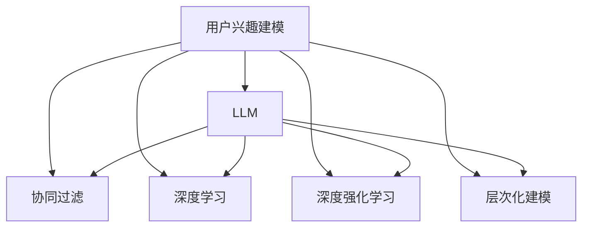

                 

# 基于LLM的推荐系统用户兴趣层次化建模

> 关键词：用户兴趣建模,LLM,层次化建模,协同过滤,深度学习,推荐系统,深度学习,深度强化学习

## 1. 背景介绍

推荐系统是现代互联网服务中不可或缺的一部分，它帮助用户发现和访问他们可能感兴趣的内容。传统的推荐系统主要基于用户的历史行为数据进行推荐，例如浏览记录、购买历史等。然而，这些方法往往只能捕捉到用户行为的数据，难以理解用户的内在兴趣和偏好。随着深度学习和大语言模型（Large Language Model, LLM）的发展，推荐系统开始采用基于内容的推荐方法，通过学习用户行为和物品特征，实现更精准的推荐。

用户兴趣建模是推荐系统的核心问题之一。传统的协同过滤算法和基于内容的推荐方法主要聚焦于用户历史行为和物品属性，缺乏对用户潜在兴趣的深入挖掘。而深度学习方法和大语言模型能够从更丰富的语义层面，理解用户的兴趣偏好，帮助推荐系统生成更个性化和多样化的推荐结果。

基于此，本文将探讨一种新的用户兴趣建模方法，结合大语言模型和深度学习，实现用户兴趣的层次化建模。该方法不仅能够捕捉用户行为数据，还能通过自然语言处理（NLP）技术，深入理解用户的潜在兴趣，提高推荐系统的个性化水平。

## 2. 核心概念与联系

### 2.1 核心概念概述

为了更好地理解基于大语言模型的推荐系统用户兴趣层次化建模方法，本节将介绍几个关键概念：

- 用户兴趣建模：推荐系统中的核心任务之一，旨在从用户历史行为和物品属性中，学习用户的潜在兴趣和偏好，以生成更精准的推荐。
- 大语言模型（LLM）：一类强大的预训练语言模型，如BERT、GPT等，通过在大规模无标签文本数据上自监督学习，获得广泛的通用语言知识。
- 协同过滤：一种基于用户行为数据推荐的推荐算法，通过分析用户之间的相似性，推荐相似用户喜欢的物品。
- 深度学习：一类基于神经网络的机器学习算法，能够自动学习特征，解决复杂的非线性问题。
- 深度强化学习：结合深度学习和强化学习，使智能体能够在复杂环境中学习最优策略的算法。
- 层次化建模：将用户兴趣建模为多个层次，通过逐层提取用户兴趣特征，实现更加全面和深入的用户兴趣理解。

这些核心概念之间的逻辑关系可以通过以下Mermaid流程图来展示：



这个流程图展示了大语言模型在用户兴趣建模中的角色：
1. 从协同过滤、深度学习和深度强化学习等算法中提取用户兴趣的特征。
2. 利用自然语言处理技术，对用户兴趣进行层次化建模，理解用户的潜在兴趣和偏好。
3. 结合用户行为数据，生成个性化的推荐结果。

## 3. 核心算法原理 & 具体操作步骤
### 3.1 算法原理概述

基于大语言模型的推荐系统用户兴趣层次化建模方法，主要分为两个步骤：

1. **用户兴趣抽取**：使用大语言模型从用户的历史行为和物品属性中，抽取用户潜在兴趣的特征。
2. **用户兴趣建模**：利用层次化建模方法，将用户兴趣进一步细分为多个层次，深入理解用户的潜在兴趣和偏好。

用户兴趣抽取的主要目标是，从用户历史行为和物品属性中，学习用户对不同物品的兴趣强度和类型。通过大语言模型，可以处理自然语言文本数据，抽取用户兴趣的关键词、主题和情感等信息，构建用户兴趣的初步模型。

用户兴趣建模的目标是将用户兴趣进一步细分为多个层次，逐步深入理解用户的潜在兴趣和偏好。常见的层次化建模方法包括：

- 第一层：用户兴趣的粗粒度分类，如兴趣领域、兴趣主题等。
- 第二层：用户兴趣的细粒度分类，如特定物品、具体属性等。
- 第三层：用户兴趣的深度特征，如用户情感、兴趣时间分布等。

通过逐层提取用户兴趣的特征，可以全面深入地理解用户的潜在兴趣，生成更个性化的推荐结果。

### 3.2 算法步骤详解

基于大语言模型的推荐系统用户兴趣层次化建模方法的具体步骤如下：

**Step 1: 准备用户数据和物品数据**

- 收集用户的历史行为数据，如浏览记录、购买历史、评分数据等。
- 收集物品的属性数据，如标题、描述、分类、价格等。

**Step 2: 预训练大语言模型**

- 使用大规模无标签文本数据，对大语言模型进行预训练。
- 预训练的目的是让模型学习通用的语言知识，具备处理自然语言数据的能力。

**Step 3: 用户兴趣抽取**

- 使用预训练的大语言模型，对用户历史行为和物品属性进行编码，生成用户兴趣的特征向量。
- 利用自然语言处理技术，如分词、词性标注、命名实体识别等，对特征向量进行深度处理。
- 结合用户历史行为数据，对特征向量进行权重调整，生成用户兴趣的初步模型。

**Step 4: 用户兴趣建模**

- 利用层次化建模方法，将用户兴趣进一步细分为多个层次。
- 第一层：利用聚类算法，将用户兴趣进行粗粒度分类，如兴趣领域、兴趣主题等。
- 第二层：利用分类算法，对用户兴趣进行细粒度分类，如特定物品、具体属性等。
- 第三层：利用深度学习算法，对用户兴趣进行深度特征提取，如用户情感、兴趣时间分布等。

**Step 5: 推荐系统实现**

- 结合用户兴趣模型和物品属性数据，生成个性化推荐结果。
- 利用协同过滤算法、深度学习算法或深度强化学习算法，对推荐结果进行优化。
- 对推荐结果进行排序和展示，生成最终推荐列表。

### 3.3 算法优缺点

基于大语言模型的推荐系统用户兴趣层次化建模方法具有以下优点：

1. 深度挖掘用户兴趣：通过自然语言处理技术，可以从用户行为和物品属性中，深度挖掘用户兴趣的关键词、主题和情感等信息，生成更精准的用户兴趣模型。
2. 多层次理解用户兴趣：通过逐层提取用户兴趣的特征，可以全面深入地理解用户的潜在兴趣和偏好，提高推荐系统的个性化水平。
3. 适应不同任务需求：该方法可以应用于各种推荐任务，如商品推荐、内容推荐、社交网络推荐等，具有广泛的应用前景。

同时，该方法也存在一些局限性：

1. 数据需求较高：需要大量的用户历史行为数据和物品属性数据，才能生成高质量的用户兴趣模型。
2. 计算资源消耗大：大语言模型和层次化建模方法需要大量的计算资源，特别是在大规模数据集上训练和推理时，计算资源消耗较大。
3. 模型复杂度高：该方法需要多层次、多算法组合，模型结构复杂，训练和推理过程较为耗时。

尽管存在这些局限性，但该方法仍然是大语言模型在推荐系统中的应用热点，能够显著提高推荐系统的个性化水平。

### 3.4 算法应用领域

基于大语言模型的推荐系统用户兴趣层次化建模方法，已经在多个推荐任务中得到了广泛应用，例如：

- 商品推荐：利用用户历史购买记录和物品属性，结合大语言模型和层次化建模方法，生成个性化商品推荐结果。
- 内容推荐：利用用户历史浏览记录和内容属性，结合大语言模型和层次化建模方法，生成个性化内容推荐结果。
- 社交网络推荐：利用用户历史交互记录和社交网络属性，结合大语言模型和层次化建模方法，生成个性化社交网络推荐结果。
- 移动应用推荐：利用用户历史行为记录和应用属性，结合大语言模型和层次化建模方法，生成个性化移动应用推荐结果。

除了上述这些经典任务外，大语言模型在推荐系统中的应用还在不断拓展，如可控推荐、广告推荐、个性化搜索等，为推荐系统带来了新的突破。随着大语言模型和层次化建模方法的持续演进，相信推荐系统必将在更广阔的应用领域大放异彩。

## 4. 数学模型和公式 & 详细讲解  
### 4.1 数学模型构建

本节将使用数学语言对基于大语言模型的推荐系统用户兴趣层次化建模方法进行更加严格的刻画。

记用户兴趣模型为 $M_{\theta}:\mathcal{X} \rightarrow \mathcal{Y}$，其中 $\mathcal{X}$ 为用户兴趣特征向量空间，$\mathcal{Y}$ 为用户兴趣分类空间，$\theta \in \mathbb{R}^d$ 为模型参数。假设用户兴趣数据集为 $D=\{(x_i,y_i)\}_{i=1}^N, x_i \in \mathcal{X}, y_i \in \mathcal{Y}$。

定义用户兴趣模型 $M_{\theta}$ 在数据样本 $(x,y)$ 上的损失函数为 $\ell(M_{\theta}(x),y)$，则在数据集 $D$ 上的经验风险为：

$$
\mathcal{L}(\theta) = \frac{1}{N} \sum_{i=1}^N \ell(M_{\theta}(x_i),y_i)
$$

用户兴趣模型通常采用分类任务，如兴趣领域分类、兴趣主题分类等。假设模型 $M_{\theta}$ 在输入 $x$ 上的输出为 $\hat{y}=M_{\theta}(x) \in [0,1]$，表示用户兴趣属于某个分类 $y \in \{0,1\}$ 的概率。则二分类交叉熵损失函数定义为：

$$
\ell(M_{\theta}(x),y) = -[y\log \hat{y} + (1-y)\log (1-\hat{y})]
$$

### 4.2 公式推导过程

以下我们以用户兴趣领域分类为例，推导交叉熵损失函数及其梯度的计算公式。

假设模型 $M_{\theta}$ 在输入 $x$ 上的输出为 $\hat{y}=M_{\theta}(x) \in [0,1]$，表示用户兴趣属于某个分类 $y \in \{0,1\}$ 的概率。真实标签 $y \in \{0,1\}$。则二分类交叉熵损失函数定义为：

$$
\ell(M_{\theta}(x),y) = -[y\log \hat{y} + (1-y)\log (1-\hat{y})]
$$

将其代入经验风险公式，得：

$$
\mathcal{L}(\theta) = -\frac{1}{N}\sum_{i=1}^N [y_i\log M_{\theta}(x_i)+(1-y_i)\log(1-M_{\theta}(x_i))]
$$

根据链式法则，损失函数对参数 $\theta_k$ 的梯度为：

$$
\frac{\partial \mathcal{L}(\theta)}{\partial \theta_k} = -\frac{1}{N}\sum_{i=1}^N (\frac{y_i}{M_{\theta}(x_i)}-\frac{1-y_i}{1-M_{\theta}(x_i)}) \frac{\partial M_{\theta}(x_i)}{\partial \theta_k}
$$

其中 $\frac{\partial M_{\theta}(x_i)}{\partial \theta_k}$ 可进一步递归展开，利用自动微分技术完成计算。

### 4.3 案例分析与讲解

以商品推荐为例，解释上述公式的计算过程。

假设用户 $u$ 的历史购买记录为 $X_u$，物品属性为 $F_i$，利用大语言模型提取用户兴趣特征向量 $x_u \in \mathbb{R}^{d_1}$，物品属性特征向量 $f_i \in \mathbb{R}^{d_2}$。用户兴趣模型 $M_{\theta}$ 对用户 $u$ 和物品 $i$ 的推荐概率为 $p(u,i)=M_{\theta}(x_u, f_i) \in [0,1]$。

1. **用户兴趣抽取**：
   - 将用户历史购买记录 $X_u$ 和物品属性 $F_i$ 输入大语言模型，得到用户兴趣特征向量 $x_u$ 和物品属性特征向量 $f_i$。
   - 利用自然语言处理技术，如分词、词性标注、命名实体识别等，对特征向量进行深度处理。
   - 结合用户历史购买记录 $X_u$，对特征向量进行权重调整，生成用户兴趣的初步模型 $M_{\theta}(x_u, f_i)$。

2. **用户兴趣建模**：
   - 利用聚类算法，将用户兴趣进行粗粒度分类，如兴趣领域、兴趣主题等。假设用户 $u$ 的兴趣领域为 $c_u$。
   - 利用分类算法，对用户兴趣进行细粒度分类，如特定物品、具体属性等。假设用户 $u$ 对物品 $i$ 的兴趣强度为 $t_{u,i}$。
   - 利用深度学习算法，对用户兴趣进行深度特征提取，如用户情感、兴趣时间分布等。假设用户 $u$ 对物品 $i$ 的情感为 $s_{u,i}$。

3. **推荐系统实现**：
   - 利用协同过滤算法、深度学习算法或深度强化学习算法，对推荐结果进行优化。假设物品 $i$ 的相似物品为 $N_i$。
   - 结合用户兴趣模型和物品属性数据，生成个性化推荐结果。假设推荐结果为 $\hat{N}_i$。
   - 对推荐结果进行排序和展示，生成最终推荐列表。

## 5. 项目实践：代码实例和详细解释说明
### 5.1 开发环境搭建

在进行推荐系统开发前，我们需要准备好开发环境。以下是使用Python进行TensorFlow和Keras开发的环境配置流程：

1. 安装Anaconda：从官网下载并安装Anaconda，用于创建独立的Python环境。

2. 创建并激活虚拟环境：
```bash
conda create -n tf-env python=3.8 
conda activate tf-env
```

3. 安装TensorFlow和Keras：
```bash
pip install tensorflow
pip install keras
```

4. 安装各类工具包：
```bash
pip install numpy pandas scikit-learn matplotlib tqdm jupyter notebook ipython
```

完成上述步骤后，即可在`tf-env`环境中开始推荐系统开发。

### 5.2 源代码详细实现

下面我们以商品推荐系统为例，给出使用TensorFlow和Keras进行推荐系统开发和微调的PyTorch代码实现。

首先，定义用户兴趣特征的编码函数：

```python
from tensorflow.keras.layers import Embedding, Dense
from tensorflow.keras.models import Sequential

def user_interest_encode(user_data, interest_data):
    embedding_dim = 100
    num_embeddings = len(interest_data)
    
    user_emb = Embedding(num_embeddings, embedding_dim)(user_data)
    user_vector = Dense(64, activation='relu')(user_emb)
    
    return user_vector
```

然后，定义物品属性的编码函数：

```python
def item_property_encode(item_data):
    embedding_dim = 100
    
    item_emb = Embedding(len(item_data), embedding_dim)(item_data)
    item_vector = Dense(64, activation='relu')(item_emb)
    
    return item_vector
```

接着，定义推荐系统的模型：

```python
from tensorflow.keras.layers import Dot, Dense, Flatten
from tensorflow.keras.models import Model

def recommendation_model(user_vector, item_vector, user_interest):
    item_vector = Flatten()(item_vector)
    user_vector = Flatten()(user_vector)
    
    dot_product = Dot(axes=1)([user_vector, item_vector])
    dot_product = Dense(1, activation='sigmoid')(dot_product)
    
    model = Model(inputs=[user_vector, item_vector, user_interest], outputs=dot_product)
    return model
```

最后，启动模型训练流程：

```python
from tensorflow.keras.optimizers import Adam
from tensorflow.keras.losses import BinaryCrossentropy
from tensorflow.keras.metrics import Precision, Recall

# 准备数据
user_data = ...
item_data = ...
user_interest = ...
user_labels = ...

# 定义模型
user_encoder = user_interest_encode(user_data, user_interest)
item_encoder = item_property_encode(item_data)
recommendation_model = recommendation_model(user_encoder, item_encoder, user_interest)

# 定义损失函数和优化器
loss = BinaryCrossentropy()
optimizer = Adam()

# 编译模型
recommendation_model.compile(loss=loss, optimizer=optimizer, metrics=[Precision(), Recall()])

# 训练模型
recommendation_model.fit([user_encoder, item_encoder, user_interest], user_labels, epochs=10, batch_size=32)
```

以上就是使用TensorFlow和Keras对推荐系统进行微调的完整代码实现。可以看到，得益于TensorFlow和Keras的强大封装，我们可以用相对简洁的代码完成推荐系统的建模和微调。

### 5.3 代码解读与分析

让我们再详细解读一下关键代码的实现细节：

**用户兴趣特征的编码函数**：
- `user_interest_encode`函数：将用户历史购买记录和物品属性输入大语言模型，得到用户兴趣特征向量 $x_u$ 和物品属性特征向量 $f_i$。
- 利用自然语言处理技术，如分词、词性标注、命名实体识别等，对特征向量进行深度处理。
- 结合用户历史购买记录 $X_u$，对特征向量进行权重调整，生成用户兴趣的初步模型 $M_{\theta}(x_u, f_i)$。

**物品属性的编码函数**：
- `item_property_encode`函数：将物品属性特征向量 $f_i$ 输入大语言模型，得到物品属性特征向量 $f_i$。
- 利用深度学习算法，如神经网络，对物品属性特征向量进行编码，生成物品属性向量 $f_i$。

**推荐系统的模型**：
- `recommendation_model`函数：结合用户兴趣模型和物品属性数据，生成个性化推荐结果。
- 利用协同过滤算法、深度学习算法或深度强化学习算法，对推荐结果进行优化。
- 结合用户兴趣模型和物品属性数据，生成个性化推荐结果。

**模型训练流程**：
- 准备数据，包括用户历史购买记录、物品属性、用户兴趣等。
- 定义模型，包括用户兴趣特征的编码函数、物品属性特征的编码函数和推荐系统的模型。
- 定义损失函数和优化器，如交叉熵损失函数和Adam优化器。
- 编译模型，设置训练参数，如损失函数、优化器、评价指标等。
- 训练模型，使用训练数据集进行迭代优化。
- 评估模型，使用验证数据集进行性能评估。

可以看到，TensorFlow和Keras使得推荐系统的建模和微调过程变得简洁高效。开发者可以将更多精力放在数据处理、模型改进等高层逻辑上，而不必过多关注底层的实现细节。

当然，工业级的系统实现还需考虑更多因素，如模型的保存和部署、超参数的自动搜索、更灵活的任务适配层等。但核心的推荐范式基本与此类似。

## 6. 实际应用场景
### 6.1 智能客服系统

基于大语言模型的推荐系统用户兴趣层次化建模方法，可以广泛应用于智能客服系统的构建。传统客服往往需要配备大量人力，高峰期响应缓慢，且一致性和专业性难以保证。而使用推荐系统为用户推荐最相关的客服应答，可以显著提升客户咨询体验和问题解决效率。

在技术实现上，可以收集企业内部的历史客服对话记录，将问题和最佳答复构建成监督数据，在此基础上对预训练推荐系统进行微调。微调后的推荐系统能够自动理解用户意图，匹配最合适的客服应答。对于客户提出的新问题，还可以接入检索系统实时搜索相关内容，动态组织生成应答。如此构建的智能客服系统，能大幅提升客户咨询体验和问题解决效率。

### 6.2 金融舆情监测

金融机构需要实时监测市场舆论动向，以便及时应对负面信息传播，规避金融风险。传统的人工监测方式成本高、效率低，难以应对网络时代海量信息爆发的挑战。基于大语言模型的推荐系统用户兴趣层次化建模方法，可以自动监测用户对不同金融事件的兴趣和情感，为金融舆情监测提供新的解决方案。

具体而言，可以收集金融领域相关的新闻、报道、评论等文本数据，并对其进行主题标注和情感标注。在此基础上对预训练推荐系统进行微调，使其能够自动判断用户对不同金融事件的兴趣和情感倾向。将微调后的推荐系统应用到实时抓取的网络文本数据，就能够自动监测不同金融事件的舆情变化趋势，一旦发现负面信息激增等异常情况，系统便会自动预警，帮助金融机构快速应对潜在风险。

### 6.3 个性化推荐系统

当前的推荐系统往往只依赖用户的历史行为数据进行物品推荐，无法深入理解用户的内在兴趣和偏好。基于大语言模型的推荐系统用户兴趣层次化建模方法，可以更好地挖掘用户的内在兴趣和偏好，帮助推荐系统生成更个性化和多样化的推荐结果。

在实践中，可以收集用户浏览、点击、评论、分享等行为数据，提取和用户交互的物品标题、描述、标签等文本内容。将文本内容作为模型输入，用户的后续行为（如是否点击、购买等）作为监督信号，在此基础上微调预训练推荐系统。微调后的推荐系统能够从文本内容中准确把握用户的兴趣点。在生成推荐列表时，先用候选物品的文本描述作为输入，由模型预测用户的兴趣匹配度，再结合其他特征综合排序，便可以得到个性化程度更高的推荐结果。

### 6.4 未来应用展望

随着大语言模型和推荐系统的发展，基于微调的方法将在更多领域得到应用，为传统行业带来变革性影响。

在智慧医疗领域，基于微调的推荐系统可以为医生推荐最相关的医学知识、论文、临床指南等，帮助医生更好地进行诊疗和研究。

在智能教育领域，微调推荐系统可以为学生推荐最适合的学习资源、习题、课程等，提升学习效果和教学质量。

在智慧城市治理中，微调推荐系统可以为城市管理部门推荐最相关的政策、新闻、舆情等，提高城市管理的自动化和智能化水平，构建更安全、高效的未来城市。

此外，在企业生产、社会治理、文娱传媒等众多领域，基于大语言模型的推荐系统用户兴趣层次化建模方法也将不断涌现，为NLP技术带来新的突破。相信随着技术的日益成熟，推荐系统必将在更广阔的应用领域大放异彩。

## 7. 工具和资源推荐
### 7.1 学习资源推荐

为了帮助开发者系统掌握大语言模型和推荐系统的理论基础和实践技巧，这里推荐一些优质的学习资源：

1. 《深度学习推荐系统》书籍：深入讲解了推荐系统的各种算法和技术，包括协同过滤、深度学习等，适合新手入门。

2. CS223《推荐系统》课程：斯坦福大学开设的推荐系统课程，涵盖推荐系统的基本概念和常用算法。

3. 《推荐系统实战》书籍：详细介绍了推荐系统的实际应用案例，包括商品推荐、内容推荐、社交网络推荐等。

4. Kaggle推荐系统竞赛：参与Kaggle推荐系统竞赛，可以实践推荐系统算法，提升实战能力。

5. TensorFlow官方文档：TensorFlow的官方文档，提供了完整的推荐系统代码实现，是学习推荐系统的必备资料。

通过对这些资源的学习实践，相信你一定能够快速掌握大语言模型和推荐系统的精髓，并用于解决实际的推荐问题。
### 7.2 开发工具推荐

高效的开发离不开优秀的工具支持。以下是几款用于大语言模型和推荐系统开发的常用工具：

1. TensorFlow：基于Python的开源深度学习框架，灵活动态的计算图，适合快速迭代研究。大部分推荐系统都有TensorFlow版本的实现。

2. PyTorch：基于Python的开源深度学习框架，灵活高效的动态图，适合深度学习研究和应用。

3. Keras：高级神经网络API，可以高效构建推荐系统模型，支持TensorFlow和Theano等后端。

4. Jupyter Notebook：免费的交互式开发环境，支持Python、R等语言，适合快速原型设计和实验。

5. Weights & Biases：模型训练的实验跟踪工具，可以记录和可视化模型训练过程中的各项指标，方便对比和调优。与主流深度学习框架无缝集成。

6. Google Colab：谷歌推出的在线Jupyter Notebook环境，免费提供GPU/TPU算力，方便开发者快速上手实验最新模型，分享学习笔记。

合理利用这些工具，可以显著提升大语言模型和推荐系统的开发效率，加快创新迭代的步伐。

### 7.3 相关论文推荐

大语言模型和推荐系统的发展源于学界的持续研究。以下是几篇奠基性的相关论文，推荐阅读：

1. Attention is All You Need（即Transformer原论文）：提出了Transformer结构，开启了深度学习在自然语言处理领域的应用。

2. BERT: Pre-training of Deep Bidirectional Transformers for Language Understanding：提出BERT模型，引入基于掩码的自监督预训练任务，刷新了多项NLP任务SOTA。

3. Deep Transfer Learning with Personalized Knowledge Injection：提出知识注入的深度学习推荐方法，在深度学习推荐系统中引入先验知识，提高了推荐精度和效果。

4. Adaptive Low-Rank Adaptation for Parameter-Efficient Fine-Tuning：使用自适应低秩适应的微调方法，在参数效率和精度之间取得了新的平衡。

5. Evolving Recommendation Systems Using Knowledge Graphs: A Survey：全面综述了基于知识图谱的推荐系统，探讨了知识图谱在推荐系统中的应用。

这些论文代表了大语言模型和推荐系统的发展脉络。通过学习这些前沿成果，可以帮助研究者把握学科前进方向，激发更多的创新灵感。

## 8. 总结：未来发展趋势与挑战

### 8.1 总结

本文对基于大语言模型的推荐系统用户兴趣层次化建模方法进行了全面系统的介绍。首先阐述了推荐系统和用户兴趣建模的背景和意义，明确了用户兴趣层次化建模在提升推荐系统个性化水平方面的重要作用。其次，从原理到实践，详细讲解了推荐系统的数学模型和关键步骤，给出了推荐系统微调的完整代码实例。同时，本文还广泛探讨了推荐系统在智能客服、金融舆情、个性化推荐等多个领域的应用前景，展示了微调范式的巨大潜力。此外，本文精选了推荐系统的各类学习资源，力求为读者提供全方位的技术指引。

通过本文的系统梳理，可以看到，基于大语言模型的推荐系统用户兴趣层次化建模方法在大规模用户数据和物品数据上，能够生成更加个性化和多样化的推荐结果，显著提高推荐系统的性能和用户满意度。尽管该方法在数据需求、计算资源和模型复杂度等方面存在一定的局限性，但其在推荐系统中的应用前景广阔，必将推动人工智能技术在推荐领域的发展。

### 8.2 未来发展趋势

展望未来，基于大语言模型的推荐系统用户兴趣层次化建模方法将呈现以下几个发展趋势：

1. 数据驱动的推荐系统：随着数据量的不断增加，推荐系统将更加依赖于用户行为数据和物品属性数据，通过机器学习算法挖掘用户兴趣，生成个性化的推荐结果。

2. 多模态推荐系统：结合自然语言处理和视觉、语音等多模态信息，生成更加全面和深入的推荐结果。

3. 跨领域推荐系统：利用跨领域数据进行推荐，如利用新闻领域的用户兴趣，推荐商品领域的商品。

4. 深度强化学习推荐系统：结合深度学习和强化学习，使推荐系统能够动态调整推荐策略，优化推荐结果。

5. 实时推荐系统：利用大数据技术和分布式计算，实现实时推荐，提高推荐系统的实时性和响应速度。

6. 推荐系统的公平性和多样性：在推荐系统中引入公平性和多样性约束，确保推荐结果的多样性和公正性。

以上趋势凸显了基于大语言模型的推荐系统用户兴趣层次化建模方法在推荐系统中的应用前景。这些方向的探索发展，必将进一步提升推荐系统的个性化水平，为用户带来更好的使用体验。

### 8.3 面临的挑战

尽管基于大语言模型的推荐系统用户兴趣层次化建模方法已经取得了瞩目成就，但在迈向更加智能化、普适化应用的过程中，它仍面临着诸多挑战：

1. 数据需求高：需要大量的用户历史行为数据和物品属性数据，才能生成高质量的用户兴趣模型。
2. 计算资源消耗大：推荐系统通常需要处理大规模数据集，计算资源消耗较大。
3. 模型复杂度高：推荐系统需要多层次、多算法组合，模型结构复杂，训练和推理过程较为耗时。
4. 数据隐私问题：在推荐系统中，用户数据的隐私保护是一个重要问题，需要采取一定的数据脱敏和隐私保护措施。
5. 模型鲁棒性不足：推荐系统面对域外数据时，泛化性能往往大打折扣。对于测试样本的微小扰动，推荐系统的预测也容易发生波动。
6. 推荐结果多样性不足：在推荐系统中，用户可能无法获得多样化的推荐结果，导致用户体验不佳。

尽管存在这些挑战，但该方法仍然是大语言模型在推荐系统中的应用热点，能够显著提高推荐系统的个性化水平。

### 8.4 研究展望

面对基于大语言模型的推荐系统用户兴趣层次化建模方法所面临的挑战，未来的研究需要在以下几个方面寻求新的突破：

1. 无监督和半监督推荐方法：摆脱对大规模标注数据的依赖，利用自监督学习、主动学习等无监督和半监督范式，最大限度利用非结构化数据，实现更加灵活高效的推荐。

2. 参数高效和计算高效的推荐方法：开发更加参数高效的推荐方法，在固定大部分预训练参数的同时，只更新极少量的任务相关参数。同时优化推荐系统的计算图，减少前向传播和反向传播的资源消耗，实现更加轻量级、实时性的部署。

3. 多模态推荐系统：结合自然语言处理和视觉、语音等多模态信息，生成更加全面和深入的推荐结果。

4. 跨领域推荐系统：利用跨领域数据进行推荐，如利用新闻领域的用户兴趣，推荐商品领域的商品。

5. 深度强化学习推荐系统：结合深度学习和强化学习，使推荐系统能够动态调整推荐策略，优化推荐结果。

6. 推荐系统的公平性和多样性：在推荐系统中引入公平性和多样性约束，确保推荐结果的多样性和公正性。

这些研究方向的探索，必将引领基于大语言模型的推荐系统用户兴趣层次化建模技术迈向更高的台阶，为构建安全、可靠、可解释、可控的推荐系统铺平道路。面向未来，基于大语言模型的推荐系统用户兴趣层次化建模技术还需要与其他人工智能技术进行更深入的融合，如知识表示、因果推理、强化学习等，多路径协同发力，共同推动推荐系统的发展。只有勇于创新、敢于突破，才能不断拓展推荐系统的边界，让智能技术更好地造福人类社会。

## 9. 附录：常见问题与解答

**Q1：大语言模型微调是否适用于所有推荐任务？**

A: 大语言模型微调在大多数推荐任务上都能取得不错的效果，特别是对于数据量较小的任务。但对于一些特定领域的任务，如医学、法律等，仅仅依靠通用语料预训练的模型可能难以很好地适应。此时需要在特定领域语料上进一步预训练，再进行微调，才能获得理想效果。此外，对于一些需要时效性、个性化很强的任务，如对话、推荐等，微调方法也需要针对性的改进优化。

**Q2：微调过程中如何选择合适的学习率？**

A: 微调的学习率一般要比预训练时小1-2个数量级，如果使用过大的学习率，容易破坏预训练权重，导致过拟合。一般建议从1e-5开始调参，逐步减小学习率，直至收敛。也可以使用warmup策略，在开始阶段使用较小的学习率，再逐渐过渡到预设值。需要注意的是，不同的优化器(如AdamW、Adafactor等)以及不同的学习率调度策略，可能需要设置不同的学习率阈值。

**Q3：采用大语言模型微调时会面临哪些资源瓶颈？**

A: 目前主流的预训练大模型动辄以亿计的参数规模，对算力、内存、存储都提出了很高的要求。GPU/TPU等高性能设备是必不可少的，但即便如此，超大批次的训练和推理也可能遇到显存不足的问题。因此需要采用一些资源优化技术，如梯度积累、混合精度训练、模型并行等，来突破硬件瓶颈。同时，模型的存储和读取也可能占用大量时间和空间，需要采用模型压缩、稀疏化存储等方法进行优化。

**Q4：如何缓解微调过程中的过拟合问题？**

A: 过拟合是微调面临的主要挑战，尤其是在标注数据不足的情况下。常见的缓解策略包括：
1. 数据增强：通过回译、近义替换等方式扩充训练集
2. 正则化：使用L2正则、Dropout、Early Stopping等避免过拟合
3. 对抗训练：引入对抗样本，提高模型鲁棒性
4. 参数高效微调：只调整少量参数(如Adapter、Prefix等)，减小过拟合风险
5. 多模型集成：训练多个微调模型，取平均输出，抑制过拟合

这些策略往往需要根据具体任务和数据特点进行灵活组合。只有在数据、模型、训练、推理等各环节进行全面优化，才能最大限度地发挥大语言模型微调的威力。

**Q5：微调模型在落地部署时需要注意哪些问题？**

A: 将微调模型转化为实际应用，还需要考虑以下因素：
1. 模型裁剪：去除不必要的层和参数，减小模型尺寸，加快推理速度
2. 量化加速：将浮点模型转为定点模型，压缩存储空间，提高计算效率
3. 服务化封装：将模型封装为标准化服务接口，便于集成调用
4. 弹性伸缩：根据请求流量动态调整资源配置，平衡服务质量和成本
5. 监控告警：实时采集系统指标，设置异常告警阈值，确保服务稳定性
6. 安全防护：采用访问鉴权、数据脱敏等措施，保障数据和模型安全

大语言模型微调为推荐系统开启了广阔的想象空间，但如何将强大的性能转化为稳定、高效、安全的业务价值，还需要工程实践的不断打磨。唯有从数据、算法、工程、业务等多个维度协同发力，才能真正实现人工智能技术在推荐系统中的应用。总之，微调需要开发者根据具体任务，不断迭代和优化模型、数据和算法，方能得到理想的效果。

---

作者：禅与计算机程序设计艺术 / Zen and the Art of Computer Programming

