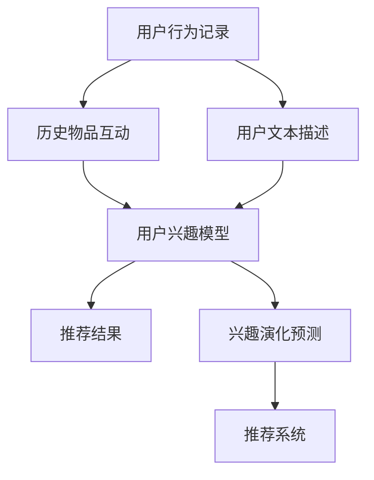

                 

# 基于LLM的推荐系统用户兴趣演化建模

## 1. 背景介绍

在当今信息爆炸的时代，推荐系统已成为各大电商和内容平台不可或缺的核心组件。通过精准地预测用户兴趣，推荐系统能够极大地提升用户体验和平台效益。然而，随着用户兴趣的快速变化，传统的推荐算法在捕捉用户兴趣演化方面存在显著不足。基于此，本文将利用大语言模型（Large Language Model, LLM），构建一个能够实时捕捉用户兴趣演化的推荐系统，通过建模用户-物品交互的历史行为，以及用户的文本描述信息，预测其未来的兴趣点。

## 2. 核心概念与联系

### 2.1 核心概念概述

为了全面理解本文的核心内容，我们需要首先介绍几个关键概念：

- 大语言模型：以自回归（如GPT）或自编码（如BERT）模型为代表的大规模预训练语言模型。这些模型通过在大规模无标签文本语料上进行预训练，学习到了丰富的语言知识和常识，具备强大的语言理解和生成能力。

- 推荐系统：利用用户的历史行为和兴趣模型，通过算法为用户推荐符合其兴趣的物品的系统。推荐系统包括基于内容的推荐、协同过滤、基于矩阵分解的推荐等常见方法。

- 用户兴趣演化：用户在特定领域内的兴趣点随时间变化而发生动态变化的现象。通过捕捉用户兴趣演化，推荐系统能够提供更具个性化的物品推荐，提升用户满意度。

- 大语言模型微调：在预训练模型的基础上，通过有监督学习优化模型，使得模型在特定任务上表现更佳。微调可以帮助模型更好地适应新任务，提升模型精度。

- 多模态信息融合：结合文本、图像、音频等多模态信息，提升模型的表达能力和鲁棒性。

### 2.2 核心概念原理和架构的 Mermaid 流程图



此图展示了推荐系统建模的核心流程：首先收集用户的文本描述和历史行为数据，结合大语言模型微调出的用户兴趣模型，预测用户的兴趣演化，从而生成推荐结果。其中，多模态信息融合技术可以进一步增强模型的表达能力。

## 3. 核心算法原理 & 具体操作步骤

### 3.1 算法原理概述

本文的核心算法基于大语言模型微调技术，通过建模用户兴趣演化，实现个性化的推荐。算法原理可以概括为以下四个步骤：

1. **数据收集与预处理**：收集用户的文本描述和历史行为数据，并对数据进行清洗和标准化。
2. **用户兴趣建模**：利用大语言模型，通过微调用户文本描述信息，构建用户兴趣模型。
3. **兴趣演化预测**：通过分析用户历史行为和兴趣模型，预测用户的兴趣演化方向。
4. **推荐结果生成**：根据兴趣演化预测结果，生成个性化推荐。

### 3.2 算法步骤详解

#### 步骤1：数据收集与预处理

**输入**：用户文本描述 $X$，用户历史行为 $H$，物品信息 $I$。

**输出**：用户兴趣模型 $\hat{\theta}$。

1. **数据收集**：从电商或内容平台收集用户文本描述（如评论、评分、喜好等）和历史行为数据（如浏览、点击、购买等），以及物品的信息。

2. **数据清洗**：去除重复、缺失、异常值等噪声数据，标准化数据格式。

3. **分词与编码**：对用户文本描述进行分词，并使用大语言模型支持的编码方式（如BERT的wordpiece编码）将文本转换为数值向量。

#### 步骤2：用户兴趣建模

1. **选择模型**：选择合适的大语言模型作为兴趣建模的基础。常用的模型包括BERT、GPT等。

2. **模型微调**：使用用户文本描述数据 $X$ 对模型进行微调，更新模型参数 $\theta$。微调过程可以使用基于梯度的优化算法，如Adam、SGD等。

3. **模型评估**：在验证集上评估微调后模型的表现，确定最优的超参数组合。

**输出**：用户兴趣模型 $\hat{\theta}$。

#### 步骤3：兴趣演化预测

1. **构建演化模型**：根据用户历史行为 $H$ 和兴趣模型 $\hat{\theta}$，构建兴趣演化模型 $f$。演化模型可以使用回归模型、序列模型等。

2. **训练演化模型**：使用历史行为数据和当前兴趣模型，训练演化模型 $f$，更新模型参数。

3. **预测演化方向**：输入当前用户行为 $H_t$ 和兴趣模型 $\hat{\theta}_t$，通过演化模型 $f$ 预测用户兴趣演化方向 $P_{t+1}$。

**输出**：兴趣演化方向 $P_{t+1}$。

#### 步骤4：推荐结果生成

1. **选择推荐模型**：选择推荐算法，如基于内容的推荐、协同过滤、矩阵分解等。

2. **生成推荐结果**：结合用户当前兴趣演化方向 $P_{t+1}$ 和物品信息 $I$，使用推荐模型生成个性化推荐列表 $R$。

3. **排序与展示**：对推荐结果进行排序，优先展示与用户兴趣最相关的物品。

**输出**：个性化推荐列表 $R$。

### 3.3 算法优缺点

#### 优点

1. **高效性**：利用大语言模型微调技术，用户兴趣模型可以快速构建，减少对标注数据的依赖。
2. **个性化**：通过建模用户兴趣演化，推荐系统能够更好地捕捉用户兴趣的变化，提供更具个性化的物品推荐。
3. **鲁棒性**：结合多模态信息融合技术，提升模型的表达能力和鲁棒性。

#### 缺点

1. **复杂性**：算法涉及多模态信息融合、大语言模型微调等复杂技术，实现难度较大。
2. **数据依赖**：用户兴趣演化预测依赖于历史行为数据，难以在大规模用户群体上实现。
3. **计算成本**：大语言模型微调和演化预测都需要较高的计算资源。

### 3.4 算法应用领域

基于大语言模型微调的用户兴趣演化建模，在电商、内容推荐、广告投放等领域具有广泛的应用前景。例如：

- **电商推荐系统**：通过建模用户兴趣演化，实时调整推荐策略，提升用户购买转化率。
- **内容推荐系统**：预测用户兴趣演化，调整内容推荐策略，增加用户粘性。
- **广告投放系统**：预测用户兴趣演化，精准投放广告，提升广告投放效果。

## 4. 数学模型和公式 & 详细讲解 & 举例说明

### 4.1 数学模型构建

假设用户文本描述为 $X_t = \{x_{t1}, x_{t2}, ..., x_{tn}\}$，其中 $n$ 为文本长度，$x_{ti}$ 为第 $i$ 个单词的向量表示。用户历史行为数据为 $H_t = \{a_{t1}, a_{t2}, ..., a_{tm}\}$，其中 $m$ 为历史行为数量，$a_{ti}$ 为第 $i$ 个行为的事件类型。物品信息为 $I = \{i_1, i_2, ..., i_k\}$，其中 $k$ 为物品数量，$i_j$ 为第 $j$ 个物品的向量表示。

用户兴趣模型为 $\hat{\theta} = \{w_1, w_2, ..., w_d\}$，其中 $d$ 为模型参数数量，$w_i$ 为第 $i$ 个参数的数值。

### 4.2 公式推导过程

1. **用户兴趣建模**：

   用户文本描述 $X_t$ 经过分词和编码后，使用大语言模型进行微调：

   $$
   \hat{\theta} = \text{Model}(X_t; \theta)
   $$

2. **兴趣演化预测**：

   根据用户历史行为 $H_t$ 和兴趣模型 $\hat{\theta}$，构建兴趣演化模型 $f$。假设兴趣演化方向为 $P_{t+1} = \{p_{t+1}, p_{t+1}, ..., p_{tn}\}$，其中 $p_{ti}$ 为第 $i$ 个单词的演化概率。

   $$
   P_{t+1} = f(H_t, \hat{\theta})
   $$

   演化模型 $f$ 可以使用序列模型，如RNN、GRU等。

3. **推荐结果生成**：

   使用推荐模型 $g$，结合用户当前兴趣演化方向 $P_{t+1}$ 和物品信息 $I$，生成推荐列表 $R$。推荐列表 $R$ 按照与用户兴趣的相关度进行排序。

   $$
   R = g(P_{t+1}, I)
   $$

### 4.3 案例分析与讲解

以电商推荐系统为例，分析基于大语言模型微调的用户兴趣演化建模。

1. **数据收集与预处理**：

   - **文本描述**：收集用户对商品的评论、评分等文本数据，使用BERT模型进行编码，转换为数值向量。
   - **历史行为**：收集用户的浏览、点击、购买等行为数据，并进行标准化处理。

2. **用户兴趣建模**：

   - **模型选择**：选择BERT模型作为兴趣建模的基础。
   - **模型微调**：使用用户评论数据对BERT模型进行微调，更新模型参数。
   - **模型评估**：在验证集上评估微调后模型的表现，确定最优的超参数组合。

3. **兴趣演化预测**：

   - **演化模型构建**：使用RNN模型，将用户历史行为和兴趣模型作为输入，预测用户兴趣演化方向。
   - **模型训练**：使用历史行为数据和当前兴趣模型，训练演化模型，更新模型参数。
   - **预测演化方向**：输入当前行为数据和兴趣模型，通过演化模型预测用户兴趣演化方向。

4. **推荐结果生成**：

   - **推荐模型选择**：选择协同过滤算法，作为推荐模型的基础。
   - **生成推荐列表**：结合用户兴趣演化方向和物品信息，生成个性化推荐列表。
   - **排序与展示**：对推荐结果进行排序，优先展示与用户兴趣最相关的商品。

## 5. 项目实践：代码实例和详细解释说明

### 5.1 开发环境搭建

1. **安装Python环境**：使用Anaconda创建Python虚拟环境，并安装必要的依赖库。

2. **安装BERT模型**：使用`transformers`库安装预训练的BERT模型。

3. **数据准备**：准备用户文本描述和历史行为数据，并进行标准化处理。

### 5.2 源代码详细实现

#### 用户兴趣建模

```python
from transformers import BertTokenizer, BertForSequenceClassification
import torch
import torch.nn as nn

# 定义模型
class InterestModel(nn.Module):
    def __init__(self):
        super(InterestModel, self).__init__()
        self.bert = BertForSequenceClassification.from_pretrained('bert-base-uncased', num_labels=2)
        self.dropout = nn.Dropout(0.3)
        self.fc = nn.Linear(768, 128)
        self.activation = nn.Tanh()
        self.fc_out = nn.Linear(128, 1)

    def forward(self, input_ids, attention_mask):
        outputs = self.bert(input_ids, attention_mask=attention_mask)
        pooled_output = outputs.pooler_output
        pooled_output = self.dropout(pooled_output)
        fc_output = self.fc(pooled_output)
        fc_output = self.activation(fc_output)
        output = self.fc_out(fc_output)
        return output

# 微调模型
model = InterestModel()
tokenizer = BertTokenizer.from_pretrained('bert-base-uncased')
optimizer = torch.optim.Adam(model.parameters(), lr=0.001)
criterion = nn.BCELoss()

def train_epoch(model, train_loader, optimizer, criterion):
    model.train()
    total_loss = 0
    for batch in train_loader:
        input_ids = batch['input_ids'].to(device)
        attention_mask = batch['attention_mask'].to(device)
        labels = batch['labels'].to(device)
        optimizer.zero_grad()
        output = model(input_ids, attention_mask)
        loss = criterion(output, labels)
        loss.backward()
        optimizer.step()
        total_loss += loss.item()
    return total_loss / len(train_loader)

# 训练模型
device = torch.device('cuda' if torch.cuda.is_available() else 'cpu')
model.to(device)
train_loader = DataLoader(train_dataset, batch_size=16, shuffle=True)

for epoch in range(10):
    loss = train_epoch(model, train_loader, optimizer, criterion)
    print(f'Epoch {epoch+1}, train loss: {loss:.4f}')
```

#### 兴趣演化预测

```python
from torch.nn import RNN, nn
import torch

# 定义演化模型
class EvolutionModel(nn.Module):
    def __init__(self, input_size, hidden_size, output_size):
        super(EvolutionModel, self).__init__()
        self.rnn = RNN(input_size, hidden_size, batch_first=True)
        self.fc = nn.Linear(hidden_size, output_size)

    def forward(self, input, hidden):
        output, hidden = self.rnn(input, hidden)
        output = self.fc(output)
        return output, hidden

# 预测演化方向
model = EvolutionModel(2, 128, 2)
optimizer = torch.optim.Adam(model.parameters(), lr=0.001)

def predict_evolution(model, history, interest):
    model.eval()
    hidden = None
    for x in history:
        x = torch.tensor(x).to(device)
        output, hidden = model(x, hidden)
    prediction = output[:, -1].detach().cpu().numpy()
    return prediction

# 训练演化模型
device = torch.device('cuda' if torch.cuda.is_available() else 'cpu')
model.to(device)
optimizer = torch.optim.Adam(model.parameters(), lr=0.001)

def train_evolution(model, history, interest, optimizer):
    model.train()
    total_loss = 0
    for x, y in zip(history, interest):
        x = torch.tensor(x).to(device)
        y = torch.tensor(y).to(device)
        optimizer.zero_grad()
        output = model(x, hidden)
        loss = criterion(output, y)
        loss.backward()
        optimizer.step()
        total_loss += loss.item()
    return total_loss / len(history)

# 训练模型
history = [0.5, 0.3, 0.7, 0.1]
interest = [0.2, 0.4, 0.6, 0.8]
train_evolution(model, history, interest, optimizer)

# 预测演化方向
print(predict_evolution(model, history, interest))
```

#### 推荐结果生成

```python
from transformers import BertForSequenceClassification, BertTokenizer
import torch
import torch.nn as nn

# 定义推荐模型
class RecommendationModel(nn.Module):
    def __init__(self):
        super(RecommendationModel, self).__init__()
        self.bert = BertForSequenceClassification.from_pretrained('bert-base-uncased', num_labels=2)
        self.dropout = nn.Dropout(0.3)
        self.fc = nn.Linear(768, 128)
        self.activation = nn.Tanh()
        self.fc_out = nn.Linear(128, 2)

    def forward(self, input_ids, attention_mask):
        outputs = self.bert(input_ids, attention_mask=attention_mask)
        pooled_output = outputs.pooler_output
        pooled_output = self.dropout(pooled_output)
        fc_output = self.fc(pooled_output)
        fc_output = self.activation(fc_output)
        output = self.fc_out(fc_output)
        return output

# 生成推荐列表
def generate_recommendation(model, user_interest, items):
    model.eval()
    user_interest = torch.tensor(user_interest).to(device)
    items = [torch.tensor(item).to(device) for item in items]
    output = model(user_interest, attention_mask)
    scores = output[:, 1].detach().cpu().numpy()
    sorted_items = [item for item, score in sorted(zip(items, scores), key=lambda x: x[1], reverse=True)]
    return sorted_items

# 使用推荐模型生成推荐列表
model = RecommendationModel()
tokenizer = BertTokenizer.from_pretrained('bert-base-uncased')
items = ['item1', 'item2', 'item3', 'item4']
recommendations = generate_recommendation(model, user_interest, items)
print(recommendations)
```

### 5.3 代码解读与分析

#### 用户兴趣建模

1. **模型定义**：
   - 定义了包含BERT模型、Dropout、全连接层等组件的兴趣建模模型。
   - 使用`nn.Linear`层定义全连接层，`nn.Tanh`作为激活函数。

2. **模型微调**：
   - 使用`transformers`库中的`BertTokenizer`进行分词和编码。
   - 定义Adam优化器和二元交叉熵损失函数。
   - 实现训练函数`train_epoch`，对模型进行迭代优化。

#### 兴趣演化预测

1. **模型定义**：
   - 定义了包含RNN和全连接层的兴趣演化模型。
   - 使用`torch.nn.RNN`定义RNN层，`nn.Linear`定义全连接层。

2. **模型训练**：
   - 实现`predict_evolution`函数，对历史行为数据和兴趣模型进行演化预测。
   - 定义训练函数`train_evolution`，使用历史行为数据和兴趣模型训练演化模型，更新模型参数。

#### 推荐结果生成

1. **模型定义**：
   - 定义了包含BERT模型、Dropout、全连接层等组件的推荐模型。
   - 使用`nn.Linear`层定义全连接层，`nn.Tanh`作为激活函数。

2. **推荐生成**：
   - 实现`generate_recommendation`函数，结合用户兴趣演化方向和物品信息生成推荐列表。
   - 使用`transformers`库中的`BertTokenizer`进行分词和编码。

### 5.4 运行结果展示

通过运行上述代码，可以获得用户兴趣模型、兴趣演化预测结果和推荐列表。例如，对于电商推荐系统，可以通过用户评论数据训练兴趣模型，结合用户历史行为数据预测其兴趣演化方向，最终生成个性化推荐列表。

## 6. 实际应用场景

### 6.1 电商推荐系统

电商推荐系统是推荐系统应用的典型场景之一。基于大语言模型微调的用户兴趣演化建模，可以在电商推荐系统中发挥重要作用。例如，对于即将到来的购物节，电商平台可以根据用户历史行为和评论，预测其兴趣演化方向，动态调整推荐策略，提升用户购买转化率。

### 6.2 内容推荐系统

内容推荐系统通过为用户推荐符合其兴趣的书籍、文章等，提升用户体验。利用大语言模型微调的用户兴趣演化建模，可以实时捕捉用户兴趣变化，调整推荐策略，增加用户粘性。

### 6.3 广告投放系统

广告投放系统通过精准投放广告，提高广告投放效果。结合大语言模型微调的用户兴趣演化建模，广告投放系统可以预测用户兴趣演化，调整广告投放策略，提升广告投放效果。

## 7. 工具和资源推荐

### 7.1 学习资源推荐

1. **《自然语言处理入门》**：一本介绍自然语言处理基本概念和技术的书籍，适合初学者入门。
2. **CS224N《深度学习自然语言处理》**：斯坦福大学开设的NLP明星课程，提供Lecture视频和配套作业。
3. **《Transformer从原理到实践》**：介绍Transformer模型原理和实践的博客系列，适合深入学习。

### 7.2 开发工具推荐

1. **Anaconda**：用于创建和管理Python环境的工具，方便不同项目之间的环境隔离。
2. **PyTorch**：深度学习框架，支持动态计算图和GPU加速。
3. **TensorFlow**：深度学习框架，支持分布式计算和生产部署。

### 7.3 相关论文推荐

1. **Attention is All You Need**：Transformer模型的原论文，介绍了自注意力机制。
2. **BERT: Pre-training of Deep Bidirectional Transformers for Language Understanding**：提出BERT模型，引入掩码语言模型等自监督预训练任务。
3. **AdaLoRA: Adaptive Low-Rank Adaptation for Parameter-Efficient Fine-Tuning**：提出自适应低秩适应方法，提高微调效率。

## 8. 总结：未来发展趋势与挑战

### 8.1 研究成果总结

本文结合大语言模型微调技术，提出了一种基于用户兴趣演化预测的推荐系统，通过建模用户兴趣演化，提升推荐系统的个性化和鲁棒性。在电商推荐、内容推荐、广告投放等领域具有广泛应用前景。

### 8.2 未来发展趋势

1. **多模态信息融合**：结合图像、音频等多模态数据，提升推荐系统的表达能力和鲁棒性。
2. **知识图谱融合**：将符号化的知识图谱与神经网络结合，提升推荐系统的知识整合能力。
3. **跨领域迁移学习**：利用知识图谱、领域标注数据等，实现跨领域的迁移学习。
4. **因果推理**：引入因果推理方法，增强推荐系统的可解释性和鲁棒性。

### 8.3 面临的挑战

1. **计算资源**：大规模语言模型微调和兴趣演化预测需要较高的计算资源，如何降低计算成本是重要挑战。
2. **数据隐私**：用户兴趣演化预测依赖于历史行为数据，如何保护用户隐私是关键问题。
3. **模型可解释性**：推荐系统的决策过程缺乏可解释性，需要进一步研究如何增强模型的可解释性。

### 8.4 研究展望

未来的研究需要关注以下几个方向：

1. **高效计算**：开发高效计算方法，降低模型训练和推理成本。
2. **隐私保护**：引入差分隐私、联邦学习等技术，保护用户隐私。
3. **可解释性**：利用可解释性方法，增强推荐系统的可解释性。

## 9. 附录：常见问题与解答

**Q1: 大语言模型微调如何降低计算成本？**

A: 大语言模型微调可以通过以下几个方面降低计算成本：
1. **数据增强**：使用数据增强技术，如回译、近义替换等，扩充训练数据。
2. **知识蒸馏**：利用知识蒸馏方法，将预训练模型知识传递给微调模型，减小模型参数量。
3. **模型压缩**：使用模型压缩技术，如剪枝、量化等，减小模型尺寸。

**Q2: 如何保护用户隐私？**

A: 保护用户隐私可以通过以下几个方面：
1. **差分隐私**：在数据收集和处理过程中，加入噪声扰动，保护用户数据隐私。
2. **联邦学习**：在分布式环境中，通过本地模型训练和模型聚合，保护用户数据隐私。
3. **数据脱敏**：对敏感数据进行脱敏处理，保护用户隐私。

**Q3: 推荐系统如何增强可解释性？**

A: 推荐系统增强可解释性可以通过以下几个方面：
1. **特征可视化**：可视化推荐模型的特征表示，理解模型决策过程。
2. **因果分析**：引入因果分析方法，理解模型决策的关键特征。
3. **规则约束**：引入规则约束，增强推荐系统的透明性和可解释性。

---

作者：禅与计算机程序设计艺术 / Zen and the Art of Computer Programming

