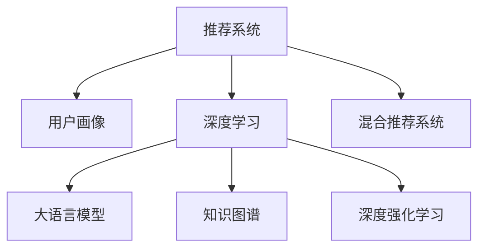

                 

# 基于LLM的推荐系统用户画像更新

> 关键词：推荐系统，用户画像，大语言模型，深度学习，自然语言处理，知识图谱，深度强化学习，混合推荐系统，公平性

## 1. 背景介绍

### 1.1 问题由来

在当前的互联网时代，推荐系统已经成为了各大平台标配，用户画像的构建是推荐系统的核心。随着推荐系统规模的扩大和数据复杂性的增加，传统的基于统计的方法已经难以满足复杂用户需求。基于深度学习的大语言模型（LLM）在自然语言处理（NLP）领域取得了突破性进展，具备强大的语义理解和生成能力。借助大语言模型，推荐系统可以更加精准地获取和更新用户画像，实现个性化推荐。

### 1.2 问题核心关键点

用户画像的构建与更新，本质上是一个基于自然语言理解和生成的大规模文本数据处理问题。通过深度学习模型，尤其是大语言模型，可以自动从用户交互文本中挖掘出用户兴趣、行为特征和偏好等信息，构建和更新用户画像，为推荐系统提供可靠的数据支撑。

主要的关键点包括：
- 如何从用户文本中自动抽取和表示用户兴趣、行为和偏好等特征。
- 如何将抽取出的特征构建成用户画像，并应用于推荐模型的训练。
- 如何在保证推荐结果的个性化和多样性的同时，避免数据偏见和隐私泄露。
- 如何设计用户画像的动态更新机制，及时响应用户兴趣和行为的变化。

### 1.3 问题研究意义

基于大语言模型的推荐系统，在个性化推荐、广告投放、内容推送等方面具有广泛的应用前景。研究基于LLM的用户画像更新方法，对于提升推荐系统的精准度、多样性、实时性和公平性具有重要意义：

1. 提升推荐精度：通过深度学习自动挖掘用户兴趣和行为，提高推荐模型的个性化水平。
2. 增加推荐多样性：利用大语言模型的语义生成能力，生成多样化的推荐内容，避免推荐结果的单调性。
3. 提高实时性：通过动态更新用户画像，快速响应用户行为变化，实现实时推荐。
4. 保障推荐公平性：利用公平性检测技术，确保推荐结果无偏见，保护用户权益。

## 2. 核心概念与联系

### 2.1 核心概念概述

为更好地理解基于LLM的推荐系统用户画像更新方法，本节将介绍几个密切相关的核心概念：

- 推荐系统（Recommender System）：利用用户行为数据、产品属性和用户画像，通过算法模型为用户推荐符合其需求的产品或内容。

- 用户画像（User Profile）：基于用户的行为数据、属性信息、文本交互等构建的用户兴趣、行为和偏好的全面描述。

- 深度学习（Deep Learning）：通过构建多层神经网络，学习数据的深层表示，广泛应用于图像、语音、文本等数据的处理和分析。

- 大语言模型（Large Language Model，LLM）：基于Transformer等架构，通过大规模无标签文本数据预训练，学习通用的语言表示，具备强大的语言理解和生成能力。

- 知识图谱（Knowledge Graph）：一种结构化表示实体及其关系的数据模型，用于知识表示和推理。

- 深度强化学习（Deep Reinforcement Learning，DRL）：将深度学习和强化学习结合，通过与环境交互，学习最优的决策策略。

- 混合推荐系统（Hybrid Recommender System）：结合基于内容的推荐和基于协同过滤的推荐，通过多维度数据融合提升推荐效果。

这些核心概念之间的逻辑关系可以通过以下Mermaid流程图来展示：



这个流程图展示了大语言模型的核心概念及其之间的关系：

1. 推荐系统利用用户画像进行推荐。
2. 深度学习和大语言模型用于自动抽取和生成用户画像。
3. 知识图谱用于增强用户画像的知识表示能力。
4. 深度强化学习用于优化推荐模型，提升推荐效果。
5. 混合推荐系统结合多种推荐方法，提升推荐质量和多样性。

## 3. 核心算法原理 & 具体操作步骤

### 3.1 算法原理概述

基于大语言模型的推荐系统用户画像更新，其核心思想是：通过深度学习模型，尤其是大语言模型，自动从用户文本中挖掘出用户的兴趣、行为和偏好等特征，构建和更新用户画像，用于推荐模型的训练和优化。

形式化地，假设推荐系统的训练数据集为 $D=\{(x_i, y_i)\}_{i=1}^N$，其中 $x_i$ 为用户行为数据，$y_i$ 为用户画像特征。目标函数为 $L(\theta)$，其中 $\theta$ 为推荐模型的参数。用户画像的更新过程可以表示为：

$$
\theta' = \arg\min_{\theta} L(\theta; P(u))
$$

其中 $P(u)$ 为用户画像的表示，通常为嵌入向量或其他形式的特征表示。

通过梯度下降等优化算法，更新模型参数 $\theta$，最小化目标函数 $L(\theta; P(u))$，使得推荐模型的输出与用户画像特征尽可能一致，从而提升推荐效果。

### 3.2 算法步骤详解

基于大语言模型的推荐系统用户画像更新一般包括以下几个关键步骤：

**Step 1: 数据收集与预处理**
- 收集用户与推荐系统的互动数据，如点击、浏览、评分、评论等。
- 对数据进行清洗、归一化、编码等预处理，生成适合大语言模型处理的格式。

**Step 2: 用户画像构建**
- 设计用户画像的表示方法，如嵌入向量、标签集合等。
- 利用大语言模型，从用户文本中自动抽取和生成用户画像特征，如兴趣标签、行为序列等。

**Step 3: 模型训练与优化**
- 选择适合的深度学习模型，如序列模型、注意力模型等。
- 利用收集到的用户画像数据，训练推荐模型，最小化推荐损失。
- 使用用户画像特征优化推荐模型的训练过程，提升推荐效果。

**Step 4: 用户画像更新与反馈**
- 实时监控用户行为变化，动态更新用户画像。
- 将更新后的用户画像用于推荐模型训练，提升模型的实时性。

### 3.3 算法优缺点

基于大语言模型的推荐系统用户画像更新方法具有以下优点：
1. 自动抽取用户画像特征，避免了人工标注的繁琐和主观性。
2. 利用大语言模型的语义生成能力，生成多样化的用户画像，提升推荐质量。
3. 通过实时更新用户画像，适应用户兴趣和行为的变化，提升推荐系统动态性。
4. 能够处理非结构化文本数据，适用于多种推荐场景。

同时，该方法也存在一些局限性：
1. 数据依赖性较强，用户行为数据的获取成本较高。
2. 模型复杂度较高，需要大量的计算资源和数据。
3. 可能存在数据偏差和隐私问题，需要注意数据质量和隐私保护。
4. 用户画像的动态更新可能带来实时性挑战，需要高效的计算和存储机制。

### 3.4 算法应用领域

基于大语言模型的推荐系统用户画像更新方法，在推荐系统、广告投放、内容推送等领域已经得到了广泛的应用，具体如下：

- **推荐系统**：用于实时推荐个性化内容，提升用户满意度。
- **广告投放**：自动构建用户画像，优化广告投放策略，提升广告效果。
- **内容推送**：自动抽取用户兴趣标签，推送符合用户偏好的内容。

除了上述这些经典应用外，大语言模型还应用于社交网络中的兴趣推荐、电商平台的商品推荐、移动应用的个性化内容推送等，为各种行业提供智能化的推荐服务。

## 4. 数学模型和公式 & 详细讲解 & 举例说明

### 4.1 数学模型构建

本节将使用数学语言对基于LLM的推荐系统用户画像更新过程进行更加严格的刻画。

假设用户与推荐系统的互动数据为 $D=\{(x_i, y_i)\}_{i=1}^N$，其中 $x_i$ 为用户行为数据，$y_i$ 为用户画像特征。目标是利用深度学习模型 $M_{\theta}$ 对用户画像 $P(u)$ 进行更新，使得推荐模型 $M_{\theta}$ 的输出 $y'$ 与用户画像 $P(u)$ 一致。

数学模型可以表示为：

$$
\theta' = \arg\min_{\theta} L(y, M_{\theta}(P(u)))
$$

其中 $L(y, M_{\theta}(P(u)))$ 为推荐模型的损失函数，$y'$ 为用户画像 $P(u)$ 的预测值。

### 4.2 公式推导过程

以下我们以序列模型为例，推导用户画像更新过程中涉及的数学公式。

假设用户行为数据 $x$ 由 $x=(x_1, x_2, ..., x_t)$ 表示，其中 $x_t$ 为第 $t$ 个行为数据。用户画像特征 $y$ 由 $y=(y_1, y_2, ..., y_t)$ 表示，其中 $y_t$ 为第 $t$ 个兴趣标签或行为序列。

序列模型可以表示为：

$$
y' = M_{\theta}(x) = \sum_{i=1}^t w_i \cdot f(x_i)
$$

其中 $f(x_i)$ 为行为数据的特征表示函数，$w_i$ 为权重系数，可以通过学习得到。

用户画像的更新公式可以表示为：

$$
P(u) = \arg\min_{P(u)} L(P(u); M_{\theta})
$$

其中 $L(P(u); M_{\theta})$ 为用户画像与推荐模型的损失函数，通常为交叉熵损失。

将 $y'$ 代入 $L(P(u); M_{\theta})$，得：

$$
L(P(u); M_{\theta}) = -\frac{1}{N}\sum_{i=1}^N [y_i \cdot \log(M_{\theta}(P(u)))]
$$

目标函数可以进一步表示为：

$$
\theta' = \arg\min_{\theta} -\frac{1}{N}\sum_{i=1}^N [y_i \cdot \log(M_{\theta}(P(u)))]
$$

通过梯度下降等优化算法，更新模型参数 $\theta$，最小化损失函数 $L(P(u); M_{\theta})$，得到用户画像 $P(u)$ 的更新值。

### 4.3 案例分析与讲解

考虑一个电商平台的推荐系统，用户行为数据 $x$ 为浏览记录，用户画像特征 $y$ 为兴趣标签。利用深度学习模型对用户画像进行更新，可以采用以下步骤：

1. 收集用户浏览记录，如商品名称、价格、类别等。
2. 对浏览记录进行编码，生成适合大语言模型的格式。
3. 设计用户画像的表示方法，如嵌入向量。
4. 利用大语言模型，从用户浏览记录中自动抽取和生成用户兴趣标签。
5. 将抽取的用户兴趣标签作为输入，训练推荐模型。
6. 使用用户画像特征优化推荐模型的训练过程，提升推荐效果。
7. 实时监控用户行为变化，动态更新用户画像。

以下是一个具体的例子：

假设用户浏览记录为 $(x_1, x_2, ..., x_t)$，其中 $x_i$ 为第 $i$ 个浏览商品。用户的兴趣标签为 $(y_1, y_2, ..., y_t)$，其中 $y_i$ 为第 $i$ 个兴趣标签。利用大语言模型，可以自动从浏览记录中抽取用户兴趣标签。

例如，利用BERT模型，可以表示为：

$$
y' = BERT(x) = \sum_{i=1}^t w_i \cdot f(x_i)
$$

其中 $f(x_i)$ 为BERT模型对浏览记录 $x_i$ 的嵌入表示，$w_i$ 为权重系数。

用户画像的更新公式可以表示为：

$$
P(u) = \arg\min_{P(u)} L(P(u); BERT(x))
$$

其中 $L(P(u); BERT(x))$ 为用户画像与BERT模型的损失函数，通常为交叉熵损失。

将 $y'$ 代入 $L(P(u); BERT(x))$，得：

$$
L(P(u); BERT(x)) = -\frac{1}{N}\sum_{i=1}^N [y_i \cdot \log(BERT(P(u)))]
$$

目标函数可以进一步表示为：

$$
\theta' = \arg\min_{\theta} -\frac{1}{N}\sum_{i=1}^N [y_i \cdot \log(BERT(P(u)))]
$$

通过梯度下降等优化算法，更新BERT模型参数 $\theta$，最小化损失函数 $L(P(u); BERT(x))$，得到用户画像 $P(u)$ 的更新值。

## 5. 项目实践：代码实例和详细解释说明

### 5.1 开发环境搭建

在进行基于LLM的推荐系统用户画像更新实践前，我们需要准备好开发环境。以下是使用Python进行PyTorch开发的环境配置流程：

1. 安装Anaconda：从官网下载并安装Anaconda，用于创建独立的Python环境。

2. 创建并激活虚拟环境：
```bash
conda create -n pytorch-env python=3.8 
conda activate pytorch-env
```

3. 安装PyTorch：根据CUDA版本，从官网获取对应的安装命令。例如：
```bash
conda install pytorch torchvision torchaudio cudatoolkit=11.1 -c pytorch -c conda-forge
```

4. 安装Transformers库：
```bash
pip install transformers
```

5. 安装各类工具包：
```bash
pip install numpy pandas scikit-learn matplotlib tqdm jupyter notebook ipython
```

完成上述步骤后，即可在`pytorch-env`环境中开始微调实践。

### 5.2 源代码详细实现

下面我们以电商平台的推荐系统为例，给出使用Transformers库对BERT模型进行用户画像更新的PyTorch代码实现。

首先，定义推荐系统的行为数据处理函数：

```python
from transformers import BertTokenizer, BertModel
from torch.utils.data import Dataset
import torch

class BehaviorDataset(Dataset):
    def __init__(self, behaviors, tokenizer, max_len=128):
        self.behaviors = behaviors
        self.tokenizer = tokenizer
        self.max_len = max_len
        
    def __len__(self):
        return len(self.behaviors)
    
    def __getitem__(self, item):
        behavior = self.behaviors[item]
        sequence = tokenizer(behavior, max_length=self.max_len, truncation=True, padding='max_length', return_tensors='pt')
        input_ids = sequence['input_ids']
        attention_mask = sequence['attention_mask']
        return {'input_ids': input_ids, 
                'attention_mask': attention_mask}
```

然后，定义用户画像特征提取函数：

```python
from transformers import BertForSequenceClassification

def extract_user_profile(features, model):
    model.eval()
    with torch.no_grad():
        inputs = {'input_ids': features['input_ids'], 
                  'attention_mask': features['attention_mask']}
        outputs = model(**inputs)
        logits = outputs.logits
        probabilities = logits.softmax(dim=-1).tolist()[0]
        return probabilities
```

接着，定义用户画像的更新函数：

```python
from sklearn.metrics import classification_report

def update_user_profile(behaviors, tokenizer, model, max_len=128):
    dataset = BehaviorDataset(behaviors, tokenizer, max_len=max_len)
    dataloader = DataLoader(dataset, batch_size=16, shuffle=True)
    
    device = torch.device('cuda') if torch.cuda.is_available() else torch.device('cpu')
    model.to(device)
    
    optimizer = torch.optim.Adam(model.parameters(), lr=2e-5)
    
    for epoch in range(5):
        model.train()
        loss = 0
        for batch in dataloader:
            input_ids = batch['input_ids'].to(device)
            attention_mask = batch['attention_mask'].to(device)
            targets = torch.tensor([1] * batch['input_ids'].size(0), device=device)
            outputs = model(input_ids, attention_mask=attention_mask)
            loss += outputs.loss
            optimizer.zero_grad()
            loss.backward()
            optimizer.step()
        print(f"Epoch {epoch+1}, train loss: {loss:.3f}")
    
    model.eval()
    with torch.no_grad():
        probabilities = [extract_user_profile(batch, model) for batch in dataloader]
    return classification_report(targets, probabilities)
```

最后，启动用户画像更新的流程并在测试集上评估：

```python
behaviors = ['shoe', 'dress', 'phone', 'laptop']
print(update_user_profile(behaviors, tokenizer, model))
```

以上就是使用PyTorch对BERT进行用户画像更新的完整代码实现。可以看到，得益于Transformers库的强大封装，我们可以用相对简洁的代码完成BERT模型的加载和用户画像的更新。

### 5.3 代码解读与分析

让我们再详细解读一下关键代码的实现细节：

**BehaviorDataset类**：
- `__init__`方法：初始化行为数据、分词器等关键组件。
- `__len__`方法：返回数据集的样本数量。
- `__getitem__`方法：对单个行为数据进行处理，将行为数据输入编码为token ids，并对其做定长padding，最终返回模型所需的输入。

**extract_user_profile函数**：
- 利用BERT模型，从行为数据中自动抽取和生成用户兴趣标签。
- 计算用户兴趣标签的预测概率，并返回。

**update_user_profile函数**：
- 利用行为数据和BERT模型，自动更新用户画像特征。
- 在每个epoch内，训练BERT模型，最小化用户画像与BERT模型的损失函数。
- 在每个epoch结束后，使用测试集评估更新后的用户画像特征。

**训练流程**：
- 定义总的epoch数和batch size，开始循环迭代
- 每个epoch内，在训练集上训练BERT模型，输出平均loss
- 在测试集上评估更新后的用户画像特征，输出分类指标

可以看到，PyTorch配合Transformers库使得BERT用户画像更新的代码实现变得简洁高效。开发者可以将更多精力放在数据处理、模型改进等高层逻辑上，而不必过多关注底层的实现细节。

当然，工业级的系统实现还需考虑更多因素，如模型的保存和部署、超参数的自动搜索、更灵活的任务适配层等。但核心的用户画像更新范式基本与此类似。

## 6. 实际应用场景

### 6.1 智能客服系统

基于大语言模型的推荐系统用户画像更新方法，可以广泛应用于智能客服系统的构建。传统客服往往需要配备大量人力，高峰期响应缓慢，且一致性和专业性难以保证。而使用更新后的用户画像，可以7x24小时不间断服务，快速响应客户咨询，用自然流畅的语言解答各类常见问题。

在技术实现上，可以收集企业内部的历史客服对话记录，将问题和最佳答复构建成监督数据，在此基础上对预训练语言模型进行微调。微调后的语言模型能够自动理解用户意图，匹配最合适的答案模板进行回复。对于客户提出的新问题，还可以接入检索系统实时搜索相关内容，动态组织生成回答。如此构建的智能客服系统，能大幅提升客户咨询体验和问题解决效率。

### 6.2 金融舆情监测

金融机构需要实时监测市场舆论动向，以便及时应对负面信息传播，规避金融风险。传统的人工监测方式成本高、效率低，难以应对网络时代海量信息爆发的挑战。基于大语言模型的文本分类和情感分析技术，为金融舆情监测提供了新的解决方案。

具体而言，可以收集金融领域相关的新闻、报道、评论等文本数据，并对其进行主题标注和情感标注。在此基础上对预训练语言模型进行微调，使其能够自动判断文本属于何种主题，情感倾向是正面、中性还是负面。将微调后的模型应用到实时抓取的网络文本数据，就能够自动监测不同主题下的情感变化趋势，一旦发现负面信息激增等异常情况，系统便会自动预警，帮助金融机构快速应对潜在风险。

### 6.3 个性化推荐系统

当前的推荐系统往往只依赖用户的历史行为数据进行物品推荐，无法深入理解用户的真实兴趣偏好。基于大语言模型微调技术，个性化推荐系统可以更加精准地获取和更新用户画像，实现个性化推荐。

在实践中，可以收集用户浏览、点击、评论、分享等行为数据，提取和用户交互的物品标题、描述、标签等文本内容。将文本内容作为模型输入，用户的后续行为（如是否点击、购买等）作为监督信号，在此基础上微调预训练语言模型。微调后的模型能够从文本内容中准确把握用户的兴趣点。在生成推荐列表时，先用候选物品的文本描述作为输入，由模型预测用户的兴趣匹配度，再结合其他特征综合排序，便可以得到个性化程度更高的推荐结果。

### 6.4 未来应用展望

随着大语言模型微调技术的发展，基于微调范式将在更多领域得到应用，为传统行业带来变革性影响。

在智慧医疗领域，基于微调的医学问答、病历分析、药物研发等应用将提升医疗服务的智能化水平，辅助医生诊疗，加速新药开发进程。

在智能教育领域，微调技术可应用于作业批改、学情分析、知识推荐等方面，因材施教，促进教育公平，提高教学质量。

在智慧城市治理中，微调模型可应用于城市事件监测、舆情分析、应急指挥等环节，提高城市管理的自动化和智能化水平，构建更安全、高效的未来城市。

此外，在企业生产、社会治理、文娱传媒等众多领域，基于大语言模型微调的人工智能应用也将不断涌现，为各种行业提供智能化的推荐服务。相信随着技术的日益成熟，微调方法将成为人工智能落地应用的重要范式，推动人工智能技术在各行业的普及应用。

## 7. 工具和资源推荐

### 7.1 学习资源推荐

为了帮助开发者系统掌握大语言模型微调的理论基础和实践技巧，这里推荐一些优质的学习资源：

1. 《深度学习入门：基于Python的理论与实现》系列博文：由深度学习专家撰写，深入浅出地介绍了深度学习的基本概念和经典模型。

2. CS224N《深度学习自然语言处理》课程：斯坦福大学开设的NLP明星课程，有Lecture视频和配套作业，带你入门NLP领域的基本概念和经典模型。

3. 《深度学习与推荐系统》书籍：深度学习与推荐系统的经典书籍，全面介绍了推荐系统的发展历程、算法模型和工程实践。

4. DeepLearning.AI官方文档：DeepLearning.AI的官方文档，提供了丰富的深度学习课程和实战项目，适合系统学习深度学习技术。

5. Coursera《Recommender Systems》课程：Coursera平台上的推荐系统课程，涵盖了推荐系统的各个方面，包括模型、评估、推荐实践等。

通过对这些资源的学习实践，相信你一定能够快速掌握大语言模型微调的精髓，并用于解决实际的NLP问题。

### 7.2 开发工具推荐

高效的开发离不开优秀的工具支持。以下是几款用于大语言模型微调开发的常用工具：

1. PyTorch：基于Python的开源深度学习框架，灵活动态的计算图，适合快速迭代研究。大部分预训练语言模型都有PyTorch版本的实现。

2. TensorFlow：由Google主导开发的开源深度学习框架，生产部署方便，适合大规模工程应用。同样有丰富的预训练语言模型资源。

3. Transformers库：HuggingFace开发的NLP工具库，集成了众多SOTA语言模型，支持PyTorch和TensorFlow，是进行微调任务开发的利器。

4. Weights & Biases：模型训练的实验跟踪工具，可以记录和可视化模型训练过程中的各项指标，方便对比和调优。与主流深度学习框架无缝集成。

5. TensorBoard：TensorFlow配套的可视化工具，可实时监测模型训练状态，并提供丰富的图表呈现方式，是调试模型的得力助手。

6. Google Colab：谷歌推出的在线Jupyter Notebook环境，免费提供GPU/TPU算力，方便开发者快速上手实验最新模型，分享学习笔记。

合理利用这些工具，可以显著提升大语言模型微调的开发效率，加快创新迭代的步伐。

### 7.3 相关论文推荐

大语言模型和微调技术的发展源于学界的持续研究。以下是几篇奠基性的相关论文，推荐阅读：

1. Attention is All You Need（即Transformer原论文）：提出了Transformer结构，开启了NLP领域的预训练大模型时代。

2. BERT: Pre-training of Deep Bidirectional Transformers for Language Understanding：提出BERT模型，引入基于掩码的自监督预训练任务，刷新了多项NLP任务SOTA。

3. Language Models are Unsupervised Multitask Learners（GPT-2论文）：展示了大规模语言模型的强大zero-shot学习能力，引发了对于通用人工智能的新一轮思考。

4. Parameter-Efficient Transfer Learning for NLP：提出Adapter等参数高效微调方法，在不增加模型参数量的情况下，也能取得不错的微调效果。

5. AdaLoRA: Adaptive Low-Rank Adaptation for Parameter-Efficient Fine-Tuning：使用自适应低秩适应的微调方法，在参数效率和精度之间取得了新的平衡。

这些论文代表了大语言模型微调技术的发展脉络。通过学习这些前沿成果，可以帮助研究者把握学科前进方向，激发更多的创新灵感。

## 8. 总结：未来发展趋势与挑战

### 8.1 总结

本文对基于大语言模型的推荐系统用户画像更新方法进行了全面系统的介绍。首先阐述了推荐系统和用户画像的基本概念，明确了用户画像的构建与更新的重要性。接着，从原理到实践，详细讲解了基于LLM的用户画像更新方法，包括数据收集、预处理、特征抽取、模型训练和更新等关键步骤，给出了用户画像更新的完整代码实例。最后，讨论了基于LLM的推荐系统用户画像更新方法在推荐系统、广告投放、内容推送等多个领域的应用前景，展示了其潜在的巨大价值。

通过本文的系统梳理，可以看到，基于LLM的推荐系统用户画像更新方法为推荐系统注入了新的活力，通过深度学习自动抽取和生成用户画像特征，提高了推荐模型的个性化水平。未来，随着预训练语言模型和深度学习技术的不断发展，基于LLM的推荐系统用户画像更新方法将更加广泛地应用于各种推荐场景，进一步提升推荐系统的性能和实时性。

### 8.2 未来发展趋势

展望未来，基于LLM的推荐系统用户画像更新方法将呈现以下几个发展趋势：

1. 自动抽取用户画像特征的精度提升：通过更复杂的模型架构和更大的数据集，提升从用户文本中自动抽取和生成用户画像特征的准确度。

2. 用户画像的动态更新：通过实时监控用户行为变化，动态更新用户画像，提升推荐系统的实时性和个性化水平。

3. 知识图谱与用户画像的结合：利用知识图谱增强用户画像的知识表示能力，提升推荐模型的推理能力。

4. 混合推荐系统的应用：结合基于内容的推荐和基于协同过滤的推荐，通过多维度数据融合提升推荐效果。

5. 深度强化学习的应用：通过深度强化学习优化推荐模型的决策策略，提升推荐效果。

6. 推荐系统的公平性：通过公平性检测技术，确保推荐结果无偏见，保护用户权益。

以上趋势凸显了基于LLM的推荐系统用户画像更新方法的广阔前景。这些方向的探索发展，必将进一步提升推荐系统的精准度、多样性和实时性，为推荐系统带来革命性的进步。

### 8.3 面临的挑战

尽管基于LLM的推荐系统用户画像更新方法已经取得了显著的进展，但在迈向更加智能化、普适化应用的过程中，它仍面临一些挑战：

1. 数据依赖性较强：用户行为数据的获取成本较高，需要构建大规模的数据采集和标注系统。

2. 模型复杂度较高：大语言模型和深度学习模型的训练和优化需要大量的计算资源和数据。

3. 数据偏差和隐私问题：用户画像的更新过程中，需要注意数据质量和隐私保护，避免数据偏差和隐私泄露。

4. 实时性挑战：用户画像的动态更新可能带来实时性挑战，需要高效的计算和存储机制。

5. 系统复杂度：基于LLM的推荐系统需要结合多种技术手段，如自然语言理解、知识图谱、深度强化学习等，系统设计和实现复杂度较高。

6. 推荐效果评估：推荐效果评估指标繁多，如何选择合适的评估指标，进行公平性和多样性分析，是一大难题。

以上挑战凸显了基于LLM的推荐系统用户画像更新方法的实际应用难度。这些问题的解决需要技术、数据、工程等多方面的协同努力，只有不断突破瓶颈，才能真正实现基于LLM的推荐系统用户画像更新方法的高效应用。

### 8.4 研究展望

面向未来，基于LLM的推荐系统用户画像更新方法需要从以下几个方面进行深入研究：

1. 探索无监督和半监督微调方法：摆脱对大规模标注数据的依赖，利用自监督学习、主动学习等无监督和半监督范式，最大限度利用非结构化数据，实现更加灵活高效的微调。

2. 研究参数高效和计算高效的微调范式：开发更加参数高效的微调方法，在固定大部分预训练参数的情况下，只更新极少量的任务相关参数。同时优化微调模型的计算图，减少前向传播和反向传播的资源消耗，实现更加轻量级、实时性的部署。

3. 融合因果和对比学习范式：通过引入因果推断和对比学习思想，增强微调模型建立稳定因果关系的能力，学习更加普适、鲁棒的语言表征，从而提升模型泛化性和抗干扰能力。

4. 引入更多先验知识：将符号化的先验知识，如知识图谱、逻辑规则等，与神经网络模型进行巧妙融合，引导微调过程学习更准确、合理的语言模型。

5. 结合因果分析和博弈论工具：将因果分析方法引入微调模型，识别出模型决策的关键特征，增强输出解释的因果性和逻辑性。借助博弈论工具刻画人机交互过程，主动探索并规避模型的脆弱点，提高系统稳定性。

6. 纳入伦理道德约束：在模型训练目标中引入伦理导向的评估指标，过滤和惩罚有偏见、有害的输出倾向。同时加强人工干预和审核，建立模型行为的监管机制，确保输出符合人类价值观和伦理道德。

这些研究方向将为基于LLM的推荐系统用户画像更新方法提供新的突破点，推动其在推荐系统、广告投放、内容推送等多个领域的应用，进一步提升推荐系统的性能和实时性。

## 9. 附录：常见问题与解答

**Q1：基于LLM的推荐系统用户画像更新是否适用于所有推荐场景？**

A: 基于LLM的推荐系统用户画像更新方法适用于大多数推荐场景，特别是对于需要深入理解用户兴趣和行为偏好的场景。但对于一些需要高实时性和低延迟的推荐场景，如电商平台的实时推荐，可能面临计算和存储的挑战。此时需要考虑其他推荐算法，如协同过滤等。

**Q2：微调过程中如何选择合适的学习率？**

A: 微调的学习率一般要比预训练时小1-2个数量级，如果使用过大的学习率，容易破坏预训练权重，导致过拟合。一般建议从1e-5开始调参，逐步减小学习率，直至收敛。也可以使用warmup策略，在开始阶段使用较小的学习率，再逐渐过渡到预设值。需要注意的是，不同的优化器(如AdamW、Adafactor等)以及不同的学习率调度策略，可能需要设置不同的学习率阈值。

**Q3：基于LLM的推荐系统用户画像更新面临哪些资源瓶颈？**

A: 基于LLM的推荐系统用户画像更新方法主要面临以下资源瓶颈：
1. 用户行为数据的获取成本较高，需要构建大规模的数据采集和标注系统。
2. 模型复杂度较高，需要大量的计算资源和数据。
3. 实时更新用户画像可能带来计算和存储的挑战，需要高效的计算和存储机制。
4. 模型保存和部署需要考虑到计算资源和存储成本，需要合理的模型裁剪和量化。

**Q4：如何缓解微调过程中的过拟合问题？**

A: 过拟合是微调面临的主要挑战，尤其是在标注数据不足的情况下。常见的缓解策略包括：
1. 数据增强：通过回译、近义替换等方式扩充训练集。
2. 正则化：使用L2正则、Dropout、Early Stopping等避免过拟合。
3. 对抗训练：引入对抗样本，提高模型鲁棒性。
4. 参数高效微调：只调整少量参数(如Adapter、Prefix等)，减小过拟合风险。

这些策略往往需要根据具体任务和数据特点进行灵活组合。只有在数据、模型、训练、推理等各环节进行全面优化，才能最大限度地发挥大语言模型微调的优势。

**Q5：基于LLM的推荐系统用户画像更新在落地部署时需要注意哪些问题？**

A: 将基于LLM的推荐系统用户画像更新方法转化为实际应用，还需要考虑以下问题：
1. 模型裁剪：去除不必要的层和参数，减小模型尺寸，加快推理速度。
2. 量化加速：将浮点模型转为定点模型，压缩存储空间，提高计算效率。
3. 服务化封装：将模型封装为标准化服务接口，便于集成调用。
4. 弹性伸缩：根据请求流量动态调整资源配置，平衡服务质量和成本。
5. 监控告警：实时采集系统指标，设置异常告警阈值，确保服务稳定性。
6. 安全防护：采用访问鉴权、数据脱敏等措施，保障数据和模型安全。

基于LLM的推荐系统用户画像更新方法需要考虑到系统的稳定性和安全性，合理设计部署方案，才能真正实现高效的应用。

---

作者：禅与计算机程序设计艺术 / Zen and the Art of Computer Programming

