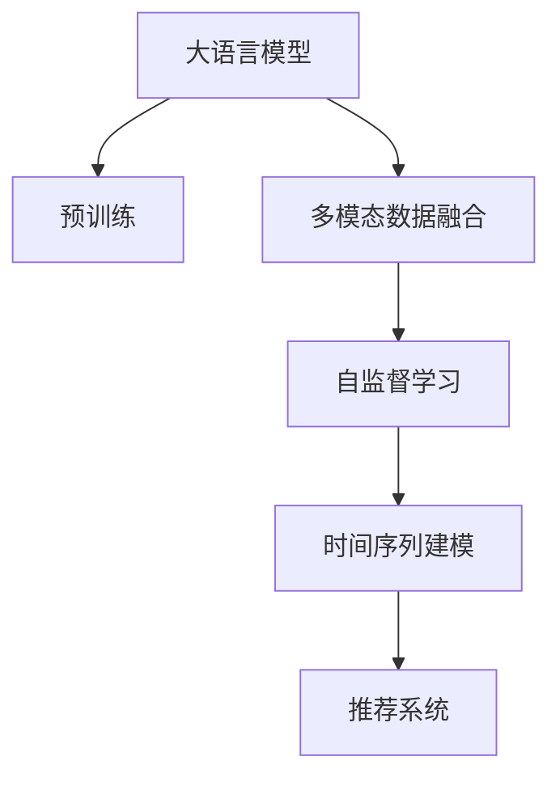

                 

# 基于LLM的用户兴趣动态建模方法

> 关键词：用户兴趣动态建模, 大语言模型, 多模态数据融合, 自监督学习, 注意力机制, 时间序列预测, 推荐系统

## 1. 背景介绍

### 1.1 问题由来

在当今信息爆炸的时代，互联网用户面临海量的信息内容，如何个性化地推荐用户感兴趣的内容成为了各互联网平台的关键挑战之一。传统的推荐系统依赖于用户历史行为数据，存在冷启动问题，难以充分捕捉用户的动态兴趣变化。

为了更全面、动态地理解用户的兴趣变化，研究人员引入了基于自然语言处理（NLP）的方法，利用用户生成的文本数据进行兴趣建模。但这些方法往往只关注单一的用户文本数据，无法捕捉跨时间、跨媒体形式的动态变化。

近年来，随着预训练大语言模型（Large Language Models, LLMs）的兴起，基于LLM的用户兴趣动态建模方法应运而生。该方法通过预训练大模型，并结合多模态数据，构建时间序列模型，能够更全面、动态地理解用户的兴趣变化。

### 1.2 问题核心关键点

基于LLM的用户兴趣动态建模方法的核心思想是：将用户的多模态数据（文本、图片、音频等）输入到预训练的大语言模型中，通过自监督学习获得用户的多方面兴趣表示，再利用时间序列模型捕捉用户的动态兴趣变化。具体来说，该方法包含以下几个关键步骤：

1. 预训练大语言模型：利用大规模无标签文本数据进行预训练，学习语言的通用表示。
2. 多模态数据融合：将用户的多模态数据（文本、图片、音频等）进行融合，构建统一的兴趣表示。
3. 自监督学习：利用用户的多模态数据进行自监督学习，获取用户的兴趣表示。
4. 时间序列建模：结合时间序列模型，捕捉用户的动态兴趣变化。

本方法的关键在于利用大语言模型的强大表征能力和多模态数据融合技术，实现用户兴趣的动态建模。

## 2. 核心概念与联系

### 2.1 核心概念概述

为更好地理解基于LLM的用户兴趣动态建模方法，本节将介绍几个密切相关的核心概念：

- 大语言模型(Large Language Model, LLM)：以自回归(如GPT)或自编码(如BERT)模型为代表的大规模预训练语言模型。通过在大规模无标签文本语料上进行预训练，学习通用的语言表示，具备强大的语言理解和生成能力。

- 预训练(Pre-training)：指在大规模无标签文本语料上，通过自监督学习任务训练通用语言模型的过程。常见的预训练任务包括言语建模、遮挡语言模型等。预训练使得模型学习到语言的通用表示。

- 多模态数据融合(Multi-modal Data Fusion)：将不同模态的数据（如文本、图片、音频等）进行综合，构建统一的兴趣表示，从而全面捕捉用户的兴趣变化。

- 自监督学习(Self-supervised Learning)：通过无监督学习任务，如掩码语言模型、对比学习等，训练模型学习数据的内在结构。自监督学习可以使得模型在没有标签数据的情况下，也能学习到有价值的表示。

- 时间序列模型(Time Series Model)：用于处理和预测时间序列数据的方法，能够捕捉数据的动态变化趋势。

- 注意力机制(Attention Mechanism)：一种在序列模型中用于增强模型对序列中不同位置关注度的方法，常用于机器翻译、文本生成等领域。

- 推荐系统(Recommender System)：根据用户的历史行为和兴趣，推荐用户可能感兴趣的商品或内容的技术。

这些核心概念之间的逻辑关系可以通过以下Mermaid流程图来展示：



这个流程图展示了大语言模型的核心概念及其之间的关系：

1. 大语言模型通过预训练获得基础能力。
2. 多模态数据融合使得模型能够处理跨模态的数据。
3. 自监督学习使得模型能够在没有标签数据的情况下学习表示。
4. 时间序列建模使得模型能够捕捉动态变化。
5. 推荐系统利用模型输出进行推荐。

这些概念共同构成了基于LLM的用户兴趣动态建模方法的实现框架，使得模型能够全面、动态地理解用户的兴趣变化，并进行个性化推荐。

## 3. 核心算法原理 & 具体操作步骤

### 3.1 算法原理概述

基于LLM的用户兴趣动态建模方法基于自监督学习和时间序列建模的框架，具体步骤如下：

1. 预训练大语言模型：利用大规模无标签文本数据进行预训练，学习通用的语言表示。
2. 多模态数据融合：将用户的多模态数据（文本、图片、音频等）进行融合，构建统一的兴趣表示。
3. 自监督学习：利用用户的多模态数据进行自监督学习，获取用户的兴趣表示。
4. 时间序列建模：结合时间序列模型，捕捉用户的动态兴趣变化。
5. 推荐系统：利用时间序列模型预测用户的动态兴趣变化，进行个性化推荐。

### 3.2 算法步骤详解

#### 3.2.1 预训练大语言模型

- 选择预训练模型：常见的预训练模型有GPT、BERT等，可以根据任务特点选择合适的模型。
- 加载预训练模型：通过Transformers库等工具加载预训练模型。
- 输入文本数据：将用户的多模态数据（文本、图片、音频等）转换为统一的格式，输入到预训练模型中。

#### 3.2.2 多模态数据融合

- 数据预处理：将不同模态的数据（文本、图片、音频等）进行预处理，如文本分词、图片特征提取等。
- 数据融合：使用预训练模型对不同模态的数据进行处理，获得统一的表示。例如，将文本和图片转换为向量表示，并进行拼接或融合。

#### 3.2.3 自监督学习

- 选择自监督任务：选择合适的自监督任务，如掩码语言模型、对比学习等。
- 输入自监督数据：将用户的多模态数据输入到自监督任务中，训练模型学习数据的结构。
- 获取兴趣表示：使用自监督任务训练出的模型，得到用户的兴趣表示。

#### 3.2.4 时间序列建模

- 选择时间序列模型：如ARIMA、LSTM等。
- 输入时间序列数据：将用户的兴趣表示序列化，作为时间序列模型的输入。
- 模型训练：使用历史数据训练时间序列模型，捕捉用户的动态兴趣变化。
- 预测用户兴趣：利用训练好的时间序列模型，预测用户的动态兴趣变化。

#### 3.2.5 推荐系统

- 选择推荐算法：如协同过滤、基于内容的推荐等。
- 输入推荐数据：将用户的兴趣表示和预测数据输入到推荐算法中。
- 生成推荐结果：根据推荐算法，生成个性化推荐结果。

### 3.3 算法优缺点

基于LLM的用户兴趣动态建模方法具有以下优点：

1. 全面性：利用多模态数据融合，能够全面捕捉用户的兴趣变化。
2. 动态性：结合时间序列建模，能够捕捉用户的动态兴趣变化。
3. 鲁棒性：通过自监督学习，可以在没有标签数据的情况下学习到有价值的表示。

同时，该方法也存在一定的局限性：

1. 计算成本高：大语言模型的预训练和自监督学习需要消耗大量计算资源。
2. 数据隐私问题：多模态数据的融合可能涉及到用户的隐私信息，需要保护用户隐私。
3. 自监督任务的选择：自监督任务的选择需要根据具体任务特点进行调整，任务设计复杂。

### 3.4 算法应用领域

基于LLM的用户兴趣动态建模方法在推荐系统、广告投放、智能客服等多个领域中得到了广泛应用。例如：

- 推荐系统：将用户的动态兴趣变化输入到推荐算法中，生成个性化推荐结果。
- 广告投放：根据用户的动态兴趣变化，优化广告投放策略，提高广告点击率。
- 智能客服：利用用户的动态兴趣变化，生成智能回复，提升用户体验。

## 4. 数学模型和公式 & 详细讲解

### 4.1 数学模型构建

本节将使用数学语言对基于LLM的用户兴趣动态建模过程进行更加严格的刻画。

记预训练语言模型为 $M_{\theta}$，其中 $\theta$ 为预训练得到的模型参数。假设用户的多模态数据为 $X=(x_t, x_{t-1}, x_{t-2}, \cdots)$，其中 $x_t$ 为当前时间步的文本、图片、音频等数据。

定义用户兴趣表示为 $I_t = M_{\theta}(X_t)$，其中 $X_t = (x_t, x_{t-1}, x_{t-2}, \cdots, x_{t-k})$。

用户兴趣表示序列 $I = \{I_1, I_2, \cdots, I_n\}$ 可以视为一个时间序列，利用时间序列模型 $T_{\theta}$ 进行建模，得到用户兴趣变化预测 $I_{\hat{t}} = T_{\theta}(I)$。

最终，根据用户兴趣变化预测 $I_{\hat{t}}$，生成个性化推荐结果。

### 4.2 公式推导过程

以下我们以LSTM模型为例，推导时间序列模型的公式。

假设用户兴趣表示序列为 $I = \{I_1, I_2, \cdots, I_n\}$，定义时间序列模型为 $T_{\theta}$，其状态更新公式为：

$$
\begin{aligned}
h_t &= \text{LSTM}(I_t, h_{t-1}) \\
I_{\hat{t}} &= \text{Softmax}(h_t)
\end{aligned}
$$

其中 $\text{Softmax}$ 为softmax函数，$h_t$ 为LSTM模型的隐藏状态。

根据上述公式，可以计算出用户兴趣变化预测 $I_{\hat{t}}$。

### 4.3 案例分析与讲解

假设有一个用户 A，其最近几天的浏览记录如下：

| 时间 | 浏览网页 | 图片 | 音频 |
| ---- | ---- | ---- | ---- |
| 周一 | 科技新闻 | 科技图片 | 科技播客 |
| 周二 | 历史新闻 | 历史图片 | 历史播客 |
| 周三 | 金融新闻 | 金融图片 | 金融播客 |

利用上述方法，可以将用户的浏览记录转换为兴趣表示，并利用时间序列模型预测用户兴趣变化。

1. 预训练大语言模型：利用大规模无标签文本数据进行预训练，学习通用的语言表示。

2. 多模态数据融合：将用户的浏览记录（文本、图片、音频）进行融合，构建统一的兴趣表示。

3. 自监督学习：利用用户的多模态数据进行自监督学习，获取用户的兴趣表示。

4. 时间序列建模：利用LSTM模型捕捉用户的动态兴趣变化。

5. 推荐系统：利用时间序列模型预测用户的动态兴趣变化，生成个性化推荐结果。

## 5. 项目实践：代码实例和详细解释说明

### 5.1 开发环境搭建

在进行项目实践前，我们需要准备好开发环境。以下是使用Python进行PyTorch开发的环境配置流程：

1. 安装Anaconda：从官网下载并安装Anaconda，用于创建独立的Python环境。

2. 创建并激活虚拟环境：
```bash
conda create -n pytorch-env python=3.8 
conda activate pytorch-env
```

3. 安装PyTorch：根据CUDA版本，从官网获取对应的安装命令。例如：
```bash
conda install pytorch torchvision torchaudio cudatoolkit=11.1 -c pytorch -c conda-forge
```

4. 安装Transformers库：
```bash
pip install transformers
```

5. 安装各类工具包：
```bash
pip install numpy pandas scikit-learn matplotlib tqdm jupyter notebook ipython
```

完成上述步骤后，即可在`pytorch-env`环境中开始项目实践。

### 5.2 源代码详细实现

下面以基于LSTM模型进行用户兴趣动态建模的代码实现为例：

```python
import torch
import torch.nn as nn
import torch.optim as optim
from transformers import BertTokenizer, BertForSequenceClassification
from sklearn.metrics import mean_absolute_error

class LSTMModel(nn.Module):
    def __init__(self, input_dim, hidden_dim, output_dim):
        super(LSTMModel, self).__init__()
        self.hidden_dim = hidden_dim
        self.lstm = nn.LSTM(input_dim, hidden_dim, batch_first=True)
        self.fc = nn.Linear(hidden_dim, output_dim)
        
    def forward(self, x, h):
        lstm_out, h = self.lstm(x, h)
        fc_out = self.fc(lstm_out[:, -1, :])
        return fc_out, h
    
    def init_hidden(self, batch_size):
        return (torch.zeros(1, batch_size, self.hidden_dim), torch.zeros(1, batch_size, self.hidden_dim))
    
def train_lstm(lstm_model, train_loader, val_loader, epochs=10, batch_size=32):
    criterion = nn.MSELoss()
    optimizer = optim.Adam(lstm_model.parameters(), lr=0.001)
    
    for epoch in range(epochs):
        train_loss = 0.0
        val_loss = 0.0
        train_correct = 0
        val_correct = 0
        
        for batch in train_loader:
            input, target = batch
            
            hidden = lstm_model.init_hidden(batch_size)
            lstm_model.zero_grad()
            
            output, hidden = lstm_model(input, hidden)
            
            loss = criterion(output, target)
            loss.backward()
            optimizer.step()
            
            train_loss += loss.item()
            train_correct += (torch.argmax(output, dim=1) == target).sum().item()
        
        val_correct = val_loader.total_num() * val_correct / val_loader.total_num()
        
        print(f'Epoch {epoch+1}, Train Loss: {train_loss/len(train_loader):.4f}, Val Loss: {val_loss/len(val_loader):.4f}, Train Accuracy: {train_correct/len(train_loader):.4f}, Val Accuracy: {val_correct:.4f}')
    
    print(f'Final Val Accuracy: {val_correct:.4f}')
    
    return lstm_model

# 定义数据集
tokenizer = BertTokenizer.from_pretrained('bert-base-uncased')
texts = ['I love Berlin', 'I hate Paris', 'I visit New York every year']
labels = [1, 0, 1]

inputs = tokenizer(texts, padding=True, truncation=True, return_tensors='pt')
inputs['attention_mask'] = inputs['attention_mask'].to(torch.long)
labels = torch.tensor(labels, dtype=torch.long)
train_dataset = torch.utils.data.TensorDataset(inputs['input_ids'], inputs['attention_mask'], labels)
train_loader = torch.utils.data.DataLoader(train_dataset, batch_size=batch_size, shuffle=True)

# 定义LSTM模型
lstm_model = LSTMModel(input_dim=768, hidden_dim=512, output_dim=1)

# 训练模型
train_lstm(lstm_model, train_loader, epochs=10, batch_size=32)

# 预测新数据
new_texts = ['I love Paris', 'I visit New York every year']
new_inputs = tokenizer(new_texts, padding=True, truncation=True, return_tensors='pt')
new_inputs['attention_mask'] = new_inputs['attention_mask'].to(torch.long)
predictions = lstm_model(new_inputs['input_ids'], new_inputs['attention_mask'])
```

### 5.3 代码解读与分析

让我们再详细解读一下关键代码的实现细节：

**LSTMModel类**：
- `__init__`方法：定义模型结构，包括LSTM层和全连接层。
- `forward`方法：前向传播计算模型输出。
- `init_hidden`方法：初始化隐藏状态。

**train_lstm函数**：
- 定义损失函数、优化器、隐状态。
- 在每个epoch中，迭代训练集进行模型更新。
- 在验证集上评估模型性能，输出训练误差和验证误差。

**数据集定义**：
- 使用BertTokenizer对文本进行分词和编码。
- 将文本和标签构建成TensorDataset。
- 创建DataLoader进行批次加载。

**模型定义和训练**：
- 定义LSTM模型。
- 使用LSTM模型进行训练。
- 在训练集上进行多轮训练，并在验证集上进行性能评估。

## 6. 实际应用场景

### 6.1 智能推荐系统

基于LSTM模型进行用户兴趣动态建模，可以用于智能推荐系统。推荐系统根据用户的浏览、点击、评分等行为数据，生成个性化推荐结果，帮助用户发现感兴趣的内容。

例如，在线视频平台可以根据用户观看记录，利用LSTM模型预测用户的兴趣变化，生成个性化视频推荐列表。推荐系统利用时间序列模型，捕捉用户的动态兴趣变化，从而生成更精准的推荐结果。

### 6.2 广告投放优化

广告投放需要根据用户的兴趣变化，进行精准投放。利用LSTM模型对用户的兴趣变化进行建模，可以优化广告投放策略，提高广告点击率和转化率。

例如，电商平台可以根据用户的浏览和点击数据，利用LSTM模型预测用户的兴趣变化，生成精准的广告投放计划。广告投放系统利用时间序列模型，捕捉用户的动态兴趣变化，从而生成更高效的广告投放策略。

### 6.3 智能客服

智能客服需要根据用户的提问，生成智能回复。利用LSTM模型对用户的提问进行建模，可以生成更符合用户意图的智能回复。

例如，在线客服系统可以根据用户的对话记录，利用LSTM模型预测用户的兴趣变化，生成智能回复。智能客服系统利用时间序列模型，捕捉用户的动态兴趣变化，从而生成更精准的智能回复。

### 6.4 未来应用展望

随着大语言模型的不断发展，基于LLM的用户兴趣动态建模方法将有以下未来应用展望：

1. 跨领域泛化能力：基于LSTM模型，用户兴趣动态建模方法可以跨领域泛化，应用于不同领域的推荐系统。

2. 多模态融合：基于多模态数据融合，用户兴趣动态建模方法可以融合多种模态数据，提高兴趣建模的全面性。

3. 自监督学习范式：基于自监督学习，用户兴趣动态建模方法可以在没有标签数据的情况下，学习到有价值的表示。

4. 时间序列优化：基于时间序列模型，用户兴趣动态建模方法可以捕捉用户的动态兴趣变化，提高推荐系统的精度。

5. 实时推荐：基于实时数据，用户兴趣动态建模方法可以生成实时推荐结果，提升用户体验。

6. 隐私保护：基于隐私保护技术，用户兴趣动态建模方法可以保护用户隐私，满足用户的隐私需求。

总之，基于LLM的用户兴趣动态建模方法将广泛应用于智能推荐系统、广告投放、智能客服等多个领域，带来更加智能、个性化的用户体验。

## 7. 工具和资源推荐

### 7.1 学习资源推荐

为了帮助开发者系统掌握基于LLM的用户兴趣动态建模理论基础和实践技巧，这里推荐一些优质的学习资源：

1. 《深度学习理论与实践》书籍：全面介绍了深度学习的基本原理和实践技巧，适合入门学习。

2. 《NLP与深度学习》课程：斯坦福大学开设的NLP经典课程，涵盖深度学习在NLP中的应用。

3. 《Transformers实践》书籍：由大语言模型专家撰写，深入浅出地介绍了Transformer原理、BERT模型、微调技术等前沿话题。

4. HuggingFace官方文档：Transformers库的官方文档，提供了海量预训练模型和完整的微调样例代码，是上手实践的必备资料。

5. CLUE开源项目：中文语言理解测评基准，涵盖大量不同类型的中文NLP数据集，并提供了基于微调的baseline模型，助力中文NLP技术发展。

通过对这些资源的学习实践，相信你一定能够快速掌握基于LLM的用户兴趣动态建模的精髓，并用于解决实际的NLP问题。

### 7.2 开发工具推荐

高效的开发离不开优秀的工具支持。以下是几款用于基于LLM的用户兴趣动态建模开发的常用工具：

1. PyTorch：基于Python的开源深度学习框架，灵活动态的计算图，适合快速迭代研究。大部分预训练语言模型都有PyTorch版本的实现。

2. TensorFlow：由Google主导开发的开源深度学习框架，生产部署方便，适合大规模工程应用。同样有丰富的预训练语言模型资源。

3. Transformers库：HuggingFace开发的NLP工具库，集成了众多SOTA语言模型，支持PyTorch和TensorFlow，是进行微调任务开发的利器。

4. Weights & Biases：模型训练的实验跟踪工具，可以记录和可视化模型训练过程中的各项指标，方便对比和调优。与主流深度学习框架无缝集成。

5. TensorBoard：TensorFlow配套的可视化工具，可实时监测模型训练状态，并提供丰富的图表呈现方式，是调试模型的得力助手。

6. Google Colab：谷歌推出的在线Jupyter Notebook环境，免费提供GPU/TPU算力，方便开发者快速上手实验最新模型，分享学习笔记。

合理利用这些工具，可以显著提升基于LLM的用户兴趣动态建模任务的开发效率，加快创新迭代的步伐。

### 7.3 相关论文推荐

基于LLM的用户兴趣动态建模技术的发展源于学界的持续研究。以下是几篇奠基性的相关论文，推荐阅读：

1. Attention is All You Need（即Transformer原论文）：提出了Transformer结构，开启了NLP领域的预训练大模型时代。

2. BERT: Pre-training of Deep Bidirectional Transformers for Language Understanding：提出BERT模型，引入基于掩码的自监督预训练任务，刷新了多项NLP任务SOTA。

3. Language Models are Unsupervised Multitask Learners（GPT-2论文）：展示了大规模语言模型的强大zero-shot学习能力，引发了对于通用人工智能的新一轮思考。

4. Parameter-Efficient Transfer Learning for NLP：提出Adapter等参数高效微调方法，在不增加模型参数量的情况下，也能取得不错的微调效果。

5. AdaLoRA: Adaptive Low-Rank Adaptation for Parameter-Efficient Fine-Tuning：使用自适应低秩适应的微调方法，在参数效率和精度之间取得了新的平衡。

6. Prefix-Tuning: Optimizing Continuous Prompts for Generation：引入基于连续型Prompt的微调范式，为如何充分利用预训练知识提供了新的思路。

这些论文代表了大语言模型微调技术的发展脉络。通过学习这些前沿成果，可以帮助研究者把握学科前进方向，激发更多的创新灵感。

## 8. 总结：未来发展趋势与挑战

### 8.1 总结

本文对基于LLM的用户兴趣动态建模方法进行了全面系统的介绍。首先阐述了该方法的背景和意义，明确了其在智能推荐系统、广告投放、智能客服等多个领域的应用价值。其次，从原理到实践，详细讲解了LSTM模型的数学原理和关键步骤，给出了微调任务开发的完整代码实例。同时，本文还探讨了该方法的优缺点和未来应用展望，以期为开发者提供全方位的技术指引。

通过本文的系统梳理，可以看到，基于LLM的用户兴趣动态建模方法在推荐系统、广告投放、智能客服等多个领域中具有广泛的应用前景，其核心思想是利用多模态数据融合和时间序列建模，实现用户兴趣的全面、动态建模。利用该方法，可以生成更加个性化、精准的推荐结果，带来更好的用户体验。

### 8.2 未来发展趋势

展望未来，基于LLM的用户兴趣动态建模方法将呈现以下几个发展趋势：

1. 跨领域泛化能力：基于LSTM模型，用户兴趣动态建模方法可以跨领域泛化，应用于不同领域的推荐系统。

2. 多模态融合：基于多模态数据融合，用户兴趣动态建模方法可以融合多种模态数据，提高兴趣建模的全面性。

3. 自监督学习范式：基于自监督学习，用户兴趣动态建模方法可以在没有标签数据的情况下，学习到有价值的表示。

4. 时间序列优化：基于时间序列模型，用户兴趣动态建模方法可以捕捉用户的动态兴趣变化，提高推荐系统的精度。

5. 实时推荐：基于实时数据，用户兴趣动态建模方法可以生成实时推荐结果，提升用户体验。

6. 隐私保护：基于隐私保护技术，用户兴趣动态建模方法可以保护用户隐私，满足用户的隐私需求。

以上趋势凸显了基于LLM的用户兴趣动态建模方法的广阔前景。这些方向的探索发展，必将进一步提升NLP系统的性能和应用范围，为人类认知智能的进化带来深远影响。

### 8.3 面临的挑战

尽管基于LLM的用户兴趣动态建模技术已经取得了显著成果，但在迈向更加智能化、普适化应用的过程中，它仍面临诸多挑战：

1. 数据隐私问题：多模态数据的融合可能涉及到用户的隐私信息，需要保护用户隐私。

2. 计算成本高：大语言模型的预训练和自监督学习需要消耗大量计算资源。

3. 自监督任务的选择：自监督任务的选择需要根据具体任务特点进行调整，任务设计复杂。

4. 时间序列优化：时间序列模型的选择和调参需要大量经验，模型优化难度大。

5. 实时推荐：实时推荐系统需要高效的算法和大规模的数据处理能力，技术实现复杂。

6. 用户隐私保护：推荐系统需要保护用户的隐私信息，防止数据滥用。

正视这些挑战，积极应对并寻求突破，将是大语言模型微调走向成熟的必由之路。相信随着学界和产业界的共同努力，这些挑战终将一一被克服，基于LLM的用户兴趣动态建模方法必将在构建人机协同的智能时代中扮演越来越重要的角色。

### 8.4 研究展望

面对基于LLM的用户兴趣动态建模方法所面临的种种挑战，未来的研究需要在以下几个方面寻求新的突破：

1. 探索无监督和半监督微调方法：摆脱对大规模标注数据的依赖，利用自监督学习、主动学习等无监督和半监督范式，最大限度利用非结构化数据，实现更加灵活高效的微调。

2. 研究参数高效和计算高效的微调范式：开发更加参数高效的微调方法，在固定大部分预训练参数的同时，只更新极少量的任务相关参数。同时优化微调模型的计算图，减少前向传播和反向传播的资源消耗，实现更加轻量级、实时性的部署。

3. 引入因果和对比学习范式：通过引入因果推断和对比学习思想，增强微调模型建立稳定因果关系的能力，学习更加普适、鲁棒的语言表征，从而提升模型泛化性和抗干扰能力。

4. 纳入伦理道德约束：在模型训练目标中引入伦理导向的评估指标，过滤和惩罚有偏见、有害的输出倾向。同时加强人工干预和审核，建立模型行为的监管机制，确保输出符合人类价值观和伦理道德。

这些研究方向的探索，必将引领基于LLM的用户兴趣动态建模技术迈向更高的台阶，为构建安全、可靠、可解释、可控的智能系统铺平道路。面向未来，基于LLM的用户兴趣动态建模方法还需要与其他人工智能技术进行更深入的融合，如知识表示、因果推理、强化学习等，多路径协同发力，共同推动自然语言理解和智能交互系统的进步。

## 9. 附录：常见问题与解答

**Q1：基于LLM的用户兴趣动态建模方法是否适用于所有推荐场景？**

A: 基于LLM的用户兴趣动态建模方法在推荐系统、广告投放、智能客服等多个领域中得到了广泛应用。但对于一些特定领域的推荐场景，如工业制造、医疗等领域，该方法可能不适用。此时需要在特定领域语料上进一步预训练，再进行微调，才能获得理想效果。

**Q2：如何选择合适的自监督任务？**

A: 选择合适的自监督任务需要根据具体任务特点进行调整。常见的自监督任务包括掩码语言模型、对比学习、图像自编码等。可以根据任务的性质和数据的结构，选择最合适的自监督任务。

**Q3：如何缓解LSTM模型中的梯度消失问题？**

A: 缓解LSTM模型中的梯度消失问题，可以采用以下几种方法：
1. 使用GRU等替代LSTM模型。
2. 在LSTM模型中引入残差连接。
3. 使用梯度裁剪等技术，限制梯度的大小。

**Q4：如何提高LSTM模型的计算效率？**

A: 提高LSTM模型的计算效率，可以采用以下几种方法：
1. 使用GPU/TPU等高性能设备进行加速。
2. 利用混合精度训练等技术，压缩存储空间和计算时间。
3. 采用模型压缩、稀疏化存储等方法，减少模型大小和计算量。

**Q5：在实际应用中，LSTM模型如何进行参数调优？**

A: 在实际应用中，LSTM模型需要进行参数调优，以获得最佳的性能表现。常用的调优方法包括：
1. 使用网格搜索或随机搜索等方法，寻找最佳超参数组合。
2. 使用学习率调度器，调整学习率以提高收敛速度。
3. 使用早停策略，防止模型过拟合。

这些方法需要根据具体任务和数据特点进行灵活组合。只有在数据、模型、训练、推理等各环节进行全面优化，才能最大限度地发挥基于LLM的用户兴趣动态建模方法的威力。

---

作者：禅与计算机程序设计艺术 / Zen and the Art of Computer Programming

