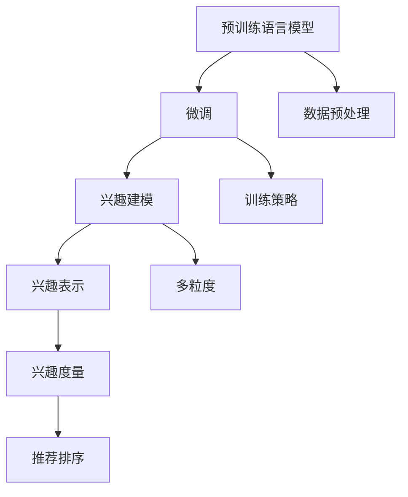

                 

# 基于LLM的用户兴趣多粒度表示学习

## 1. 背景介绍

### 1.1 问题由来

近年来，随着深度学习和大数据技术的快速发展，自然语言处理（NLP）领域取得了巨大的突破。自然语言理解（NLU）、自然语言生成（NLG）、情感分析、文本分类等任务在大规模数据和先进算法的支撑下，展现出了前所未有的表现。然而，在个性化推荐系统中，如何有效地利用用户的历史行为数据，建模用户兴趣，成为困扰推荐系统发展的一个核心问题。

传统的推荐系统主要依赖于用户的显式反馈数据，如点击、评分等，通过协同过滤、基于内容的推荐等方法，对用户兴趣进行建模。然而，用户的行为数据往往是不完整的、稀疏的，难以充分表达其真实兴趣和需求。而自然语言处理技术，尤其是基于大规模预训练语言模型（Large Language Models, LLM）的微调方法，为推荐系统提供了新的可能。

用户生成的文本数据（如评论、文章、社交媒体等）是更为丰富的用户兴趣表示形式，能够从更细致的粒度上反映用户的行为模式和偏好。如何从文本数据中挖掘出有价值的用户兴趣信息，成为学术界和工业界研究的重点。

### 1.2 问题核心关键点

基于预训练语言模型的用户兴趣建模技术，通过微调大模型，使其能够从大量文本数据中学习到用户的兴趣表示。其核心在于：

1. **数据预处理**：如何从大规模文本数据中提取用户相关的子集，减少噪音和冗余信息。
2. **模型选择**：选择合适的预训练语言模型进行微调。
3. **训练策略**：设计有效的训练策略，最大化模型对用户兴趣的表征能力。
4. **兴趣度量**：如何将用户的兴趣表示转化为推荐系统中的兴趣度量。

本文聚焦于基于大规模预训练语言模型的用户兴趣多粒度表示学习，旨在通过多粒度兴趣建模，从用户文本数据中提取更为细致、丰富的兴趣信息，提升推荐系统的个性化和多样性。

## 2. 核心概念与联系

### 2.1 核心概念概述

为更好地理解基于预训练语言模型的用户兴趣多粒度表示学习，本节将介绍几个关键概念及其相互关系：

- **大规模预训练语言模型（LLM）**：通过在大规模无标签文本数据上进行预训练，学习通用的语言表示。常见的LLM包括GPT、BERT等。

- **微调（Fine-tuning）**：在预训练模型的基础上，使用下游任务的少量标注数据，通过有监督地训练优化模型在该任务上的性能。

- **多粒度兴趣建模**：通过微调，从用户文本数据中挖掘出不同粒度的兴趣信息，如总体兴趣、细分领域兴趣等，提升推荐系统的个性化和多样化。

- **兴趣表示（Interest Representation）**：将用户的兴趣信息编码为模型可以理解的向量形式，用于推荐系统的兴趣匹配和排序。

- **兴趣度量（Interest Metric）**：将用户兴趣表示转化为推荐系统中的评分或排序依据。常见的兴趣度量方法包括基于内容的匹配度、相似度、协同过滤等。

- **自然语言处理（NLP）**：涉及自然语言的理解、生成、分析和应用，是构建推荐系统兴趣模型的重要技术支撑。

### 2.2 核心概念原理和架构的 Mermaid 流程图



这个流程图展示了从预训练语言模型到最终推荐排序的核心流程：

1. **预训练语言模型**：通过在大规模无标签文本数据上进行预训练，学习通用的语言表示。
2. **微调**：在预训练模型的基础上，使用下游任务的少量标注数据，通过有监督地训练优化模型在该任务上的性能。
3. **兴趣建模**：通过微调，从用户文本数据中挖掘出不同粒度的兴趣信息，如总体兴趣、细分领域兴趣等。
4. **兴趣表示**：将用户的兴趣信息编码为模型可以理解的向量形式，用于推荐系统的兴趣匹配和排序。
5. **兴趣度量**：将用户兴趣表示转化为推荐系统中的评分或排序依据。
6. **推荐排序**：根据兴趣度量进行推荐系统的排序和推荐。

这些概念相互关联，共同构成了一个完整的基于预训练语言模型的用户兴趣表示学习框架。

## 3. 核心算法原理 & 具体操作步骤

### 3.1 算法原理概述

基于预训练语言模型的用户兴趣多粒度表示学习，本质上是一个多任务学习（Multi-task Learning）过程。其核心思想是：通过微调预训练语言模型，使其同时学习到不同粒度的用户兴趣表示，从而提升推荐系统的个性化和多样化。

形式化地，假设预训练语言模型为 $M_{\theta}$，其中 $\theta$ 为预训练得到的模型参数。给定用户文本数据集 $D=\{(x_i, y_i)\}_{i=1}^N$，其中 $x_i$ 为用户文本，$y_i$ 为用户标签（0/1表示用户对文本感兴趣与否）。微调的目标是找到新的模型参数 $\hat{\theta}$，使得模型在多粒度兴趣建模任务上的性能最大化：

$$
\hat{\theta} = \mathop{\arg\min}_{\theta} \sum_{i=1}^N \ell_i(M_{\theta}(x_i), y_i)
$$

其中 $\ell_i$ 为第 $i$ 个兴趣任务上的损失函数，用于衡量模型预测与真实标签之间的差异。常见的损失函数包括二元交叉熵、多分类交叉熵等。

### 3.2 算法步骤详解

基于预训练语言模型的用户兴趣多粒度表示学习，主要包括以下几个关键步骤：

**Step 1: 准备预训练模型和数据集**
- 选择合适的预训练语言模型 $M_{\theta}$ 作为初始化参数，如 BERT、GPT等。
- 准备用户文本数据集 $D$，划分为训练集、验证集和测试集。一般要求数据集与预训练数据的分布不要差异过大。

**Step 2: 设计兴趣任务**
- 根据推荐系统的需求，设计不同粒度的用户兴趣任务。如总体兴趣、细分领域兴趣、场景兴趣等。
- 为每个兴趣任务，设计对应的标注数据集，标注用户是否对文本感兴趣。

**Step 3: 设置微调超参数**
- 选择合适的优化算法及其参数，如 AdamW、SGD 等，设置学习率、批大小、迭代轮数等。
- 设置正则化技术及强度，包括权重衰减、Dropout、Early Stopping等。
- 确定冻结预训练参数的策略，如仅微调顶层，或全部参数都参与微调。

**Step 4: 执行梯度训练**
- 将训练集数据分批次输入模型，前向传播计算损失函数。
- 反向传播计算参数梯度，根据设定的优化算法和学习率更新模型参数。
- 周期性在验证集上评估模型性能，根据性能指标决定是否触发 Early Stopping。
- 重复上述步骤直到满足预设的迭代轮数或 Early Stopping 条件。

**Step 5: 兴趣表示和度量**
- 将微调后的模型对用户文本进行编码，得到用户兴趣表示。
- 根据不同的兴趣任务，设计相应的兴趣度量方法，如基于内容的匹配度、相似度、协同过滤等。
- 根据兴趣度量方法，计算用户兴趣与候选物品的匹配度，进行推荐排序。

### 3.3 算法优缺点

基于预训练语言模型的用户兴趣多粒度表示学习，具有以下优点：

1. **丰富性**：通过多粒度兴趣建模，能够从更细致的粒度上挖掘用户兴趣，提升推荐系统的个性化和多样化。
2. **鲁棒性**：大语言模型的预训练权重具有良好的泛化能力，能够较好地适应不同领域的用户兴趣建模。
3. **可解释性**：通过文本数据的微调，能够生成较为直观的兴趣表示，便于解释和调试。
4. **可扩展性**：只需要增加更多的兴趣任务，即可扩展到更广泛的用户兴趣建模，具有较好的可扩展性。

同时，该方法也存在一定的局限性：

1. **数据依赖**：微调过程依赖于大量的标注数据，标注成本较高。
2. **过拟合风险**：微调过程中容易过拟合，需要更多的正则化技术和数据增强策略。
3. **计算成本**：大规模预训练语言模型的计算成本较高，需要高效的硬件和算法支持。
4. **多任务学习复杂性**：不同粒度的兴趣任务可能存在冲突，需要精心设计任务权重和损失函数。

尽管存在这些局限性，但就目前而言，基于预训练语言模型的用户兴趣多粒度表示学习，仍是大规模推荐系统研究的热点方向。未来相关研究的重点在于如何进一步降低微调对标注数据的依赖，提高模型的鲁棒性和泛化能力，同时兼顾可解释性和计算效率。

### 3.4 算法应用领域

基于预训练语言模型的用户兴趣多粒度表示学习，已经在多个推荐系统任务中得到应用，如商品推荐、音乐推荐、视频推荐、新闻推荐等。以下是一些具体的应用场景：

- **电商推荐**：通过微调，从用户评论中挖掘用户对商品的具体喜好和需求，生成更个性化的商品推荐列表。
- **音乐推荐**：从用户的听歌历史和评论中学习用户的音乐偏好，生成个性化的音乐播放列表。
- **视频推荐**：利用用户的观影历史和评分数据，学习用户对不同类型视频内容的兴趣，生成个性化视频推荐。
- **新闻推荐**：从用户的阅读历史和评论中学习用户的兴趣主题，生成个性化的新闻推荐流。

这些应用场景展示了基于预训练语言模型的用户兴趣多粒度表示学习，在推荐系统中的强大表现，为NLP技术落地应用提供了新的思路。

## 4. 数学模型和公式 & 详细讲解 & 举例说明

### 4.1 数学模型构建

本节将使用数学语言对基于预训练语言模型的用户兴趣多粒度表示学习进行更加严格的刻画。

假设预训练语言模型为 $M_{\theta}$，其中 $\theta$ 为预训练得到的模型参数。给定用户文本数据集 $D=\{(x_i, y_i)\}_{i=1}^N$，其中 $x_i$ 为用户文本，$y_i$ 为用户标签（0/1表示用户对文本感兴趣与否）。

定义模型 $M_{\theta}$ 在输入 $x$ 上的兴趣表示为 $z=f_{\theta}(x)$，其中 $f_{\theta}$ 为兴趣表示函数。假设模型 $M_{\theta}$ 在兴趣任务 $T_k$ 上的损失函数为 $\ell_k(z,y)$，则多粒度兴趣建模的优化目标为：

$$
\hat{\theta} = \mathop{\arg\min}_{\theta} \sum_{k=1}^K \mathcal{L}_k(M_{\theta})
$$

其中 $K$ 为兴趣任务的总数，$\mathcal{L}_k$ 为第 $k$ 个兴趣任务上的损失函数。

### 4.2 公式推导过程

以下我们以总体兴趣和细分领域兴趣为例，推导多粒度兴趣建模的损失函数及其梯度的计算公式。

假设模型 $M_{\theta}$ 在输入 $x$ 上的总体兴趣表示为 $z_1=f_{\theta}(x)$，细分领域兴趣表示为 $z_2=f_{\theta}(x)$，对应损失函数分别为 $\ell_1(z_1,y_1)$ 和 $\ell_2(z_2,y_2)$，其中 $y_1$ 和 $y_2$ 分别为总体兴趣和细分领域兴趣的标注数据。则多粒度兴趣建模的优化目标为：

$$
\mathcal{L} = \ell_1(z_1,y_1) + \lambda \ell_2(z_2,y_2)
$$

其中 $\lambda$ 为领域兴趣的权重。根据链式法则，损失函数对参数 $\theta_k$ 的梯度为：

$$
\frac{\partial \mathcal{L}}{\partial \theta_k} = \frac{\partial \ell_1(z_1,y_1)}{\partial \theta_k} + \lambda \frac{\partial \ell_2(z_2,y_2)}{\partial \theta_k}
$$

其中 $\frac{\partial \ell_1(z_1,y_1)}{\partial \theta_k}$ 和 $\frac{\partial \ell_2(z_2,y_2)}{\partial \theta_k}$ 分别为总体兴趣和细分领域兴趣损失函数的梯度，可通过反向传播算法高效计算。

在得到损失函数的梯度后，即可带入参数更新公式，完成模型的迭代优化。重复上述过程直至收敛，最终得到适应多粒度兴趣任务优化的模型参数 $\theta^*$。

### 4.3 案例分析与讲解

为了更直观地理解多粒度兴趣建模的计算过程，我们以电商推荐为例进行具体分析。

假设电商推荐系统的目标是从用户评论中学习用户的兴趣，生成个性化商品推荐。用户的评论文本 $x$ 作为模型的输入，模型的输出 $z$ 作为用户兴趣表示。模型的总体兴趣表示 $z_1$ 和细分领域兴趣表示 $z_2$ 分别用于生成总体推荐和细分领域推荐。

首先，设计总体兴趣任务和细分领域兴趣任务的数据集。总体兴趣任务的数据集 $D_1=\{(x_i, y_{1,i})\}_{i=1}^N$，其中 $y_{1,i}$ 表示用户是否对评论文本 $x_i$ 感兴趣。细分领域兴趣任务的数据集 $D_2=\{(x_i, y_{2,i})\}_{i=1}^N$，其中 $y_{2,i}$ 表示用户对评论文本 $x_i$ 中的细分领域是否感兴趣。

接着，选择预训练语言模型 $M_{\theta}$ 作为初始化参数，设计微调策略。可以采用全参数微调，也可以使用参数高效微调（PEFT），如添加特定层的兴趣表示函数 $f_{\theta}(x)$。在微调过程中，计算总体兴趣任务和细分领域兴趣任务的损失函数，并根据设定权重进行加权求和。

最后，将微调后的模型对用户评论进行编码，生成用户兴趣表示 $z$。根据兴趣表示和用户历史行为数据，设计兴趣度量方法，如基于内容的匹配度、相似度、协同过滤等。根据兴趣度量方法，计算用户兴趣与候选物品的匹配度，进行推荐排序。

## 5. 项目实践：代码实例和详细解释说明

### 5.1 开发环境搭建

在进行多粒度兴趣建模实践前，我们需要准备好开发环境。以下是使用Python进行PyTorch开发的环境配置流程：

1. 安装Anaconda：从官网下载并安装Anaconda，用于创建独立的Python环境。

2. 创建并激活虚拟环境：
```bash
conda create -n pytorch-env python=3.8 
conda activate pytorch-env
```

3. 安装PyTorch：根据CUDA版本，从官网获取对应的安装命令。例如：
```bash
conda install pytorch torchvision torchaudio cudatoolkit=11.1 -c pytorch -c conda-forge
```

4. 安装HuggingFace Transformers库：
```bash
pip install transformers
```

5. 安装各类工具包：
```bash
pip install numpy pandas scikit-learn matplotlib tqdm jupyter notebook ipython
```

完成上述步骤后，即可在`pytorch-env`环境中开始多粒度兴趣建模实践。

### 5.2 源代码详细实现

这里我们以电商推荐为例，给出使用Transformers库对BERT模型进行多粒度兴趣建模的PyTorch代码实现。

首先，定义总体兴趣和细分领域兴趣的数据处理函数：

```python
from transformers import BertTokenizer
from torch.utils.data import Dataset
import torch

class ReviewDataset(Dataset):
    def __init__(self, reviews, labels, tokenizer, max_len=128):
        self.reviews = reviews
        self.labels = labels
        self.tokenizer = tokenizer
        self.max_len = max_len
        
    def __len__(self):
        return len(self.reviews)
    
    def __getitem__(self, item):
        review = self.reviews[item]
        label = self.labels[item]
        
        encoding = self.tokenizer(review, return_tensors='pt', max_length=self.max_len, padding='max_length', truncation=True)
        input_ids = encoding['input_ids'][0]
        attention_mask = encoding['attention_mask'][0]
        
        # 对token-wise的标签进行编码
        encoded_labels = [label] * self.max_len
        labels = torch.tensor(encoded_labels, dtype=torch.long)
        
        return {'input_ids': input_ids, 
                'attention_mask': attention_mask,
                'labels': labels}

# 总体兴趣和细分领域兴趣的数据
train_dataset = ReviewDataset(train_reviews, train_labels, tokenizer)
dev_dataset = ReviewDataset(dev_reviews, dev_labels, tokenizer)
test_dataset = ReviewDataset(test_reviews, test_labels, tokenizer)
```

然后，定义模型和优化器：

```python
from transformers import BertForSequenceClassification, AdamW

model = BertForSequenceClassification.from_pretrained('bert-base-cased', num_labels=2)

optimizer = AdamW(model.parameters(), lr=2e-5)
```

接着，定义训练和评估函数：

```python
from torch.utils.data import DataLoader
from tqdm import tqdm
from sklearn.metrics import accuracy_score

device = torch.device('cuda') if torch.cuda.is_available() else torch.device('cpu')
model.to(device)

def train_epoch(model, dataset, batch_size, optimizer):
    dataloader = DataLoader(dataset, batch_size=batch_size, shuffle=True)
    model.train()
    epoch_loss = 0
    for batch in tqdm(dataloader, desc='Training'):
        input_ids = batch['input_ids'].to(device)
        attention_mask = batch['attention_mask'].to(device)
        labels = batch['labels'].to(device)
        model.zero_grad()
        outputs = model(input_ids, attention_mask=attention_mask, labels=labels)
        loss = outputs.loss
        epoch_loss += loss.item()
        loss.backward()
        optimizer.step()
    return epoch_loss / len(dataloader)

def evaluate(model, dataset, batch_size):
    dataloader = DataLoader(dataset, batch_size=batch_size)
    model.eval()
    preds, labels = [], []
    with torch.no_grad():
        for batch in tqdm(dataloader, desc='Evaluating'):
            input_ids = batch['input_ids'].to(device)
            attention_mask = batch['attention_mask'].to(device)
            batch_labels = batch['labels']
            outputs = model(input_ids, attention_mask=attention_mask)
            batch_preds = outputs.logits.argmax(dim=2).to('cpu').tolist()
            batch_labels = batch_labels.to('cpu').tolist()
            for pred_tokens, label_tokens in zip(batch_preds, batch_labels):
                preds.append(pred_tokens)
                labels.append(label_tokens)
                
    print(f"Accuracy: {accuracy_score(labels, preds):.2f}")
```

最后，启动训练流程并在测试集上评估：

```python
epochs = 5
batch_size = 16

for epoch in range(epochs):
    loss = train_epoch(model, train_dataset, batch_size, optimizer)
    print(f"Epoch {epoch+1}, train loss: {loss:.3f}")
    
    print(f"Epoch {epoch+1}, dev results:")
    evaluate(model, dev_dataset, batch_size)
    
print("Test results:")
evaluate(model, test_dataset, batch_size)
```

以上就是使用PyTorch对BERT进行多粒度兴趣建模的完整代码实现。可以看到，得益于Transformers库的强大封装，我们可以用相对简洁的代码完成BERT模型的加载和微调。

### 5.3 代码解读与分析

让我们再详细解读一下关键代码的实现细节：

**ReviewDataset类**：
- `__init__`方法：初始化评论、标签、分词器等关键组件。
- `__len__`方法：返回数据集的样本数量。
- `__getitem__`方法：对单个样本进行处理，将评论输入编码为token ids，将标签编码为数字，并对其进行定长padding，最终返回模型所需的输入。

**BertForSequenceClassification类**：
- `from_pretrained`方法：从预训练模型库中选择合适的模型进行加载和微调。

**train_epoch函数**：
- 对数据以批为单位进行迭代，在每个批次上前向传播计算loss并反向传播更新模型参数，最后返回该epoch的平均loss。

**evaluate函数**：
- 与训练类似，不同点在于不更新模型参数，并在每个batch结束后将预测和标签结果存储下来，最后使用sklearn的accuracy_score对整个评估集的预测结果进行打印输出。

**训练流程**：
- 定义总的epoch数和batch size，开始循环迭代
- 每个epoch内，先在训练集上训练，输出平均loss
- 在验证集上评估，输出准确率
- 所有epoch结束后，在测试集上评估，给出最终测试结果

可以看到，PyTorch配合Transformers库使得BERT微调的代码实现变得简洁高效。开发者可以将更多精力放在数据处理、模型改进等高层逻辑上，而不必过多关注底层的实现细节。

当然，工业级的系统实现还需考虑更多因素，如模型的保存和部署、超参数的自动搜索、更灵活的任务适配层等。但核心的微调范式基本与此类似。

## 6. 实际应用场景

### 6.1 电商推荐系统

基于多粒度兴趣建模的电商推荐系统，可以更细致地理解用户对商品的兴趣，生成更加个性化的商品推荐列表。电商推荐系统可以收集用户的历史浏览、点击、购买等行为数据，同时通过多粒度兴趣建模，从用户评论、产品描述中学习用户的兴趣。

在技术实现上，可以收集电商平台的评论数据和用户行为数据，构建总体兴趣和细分领域兴趣的标注数据集。在BERT等预训练模型上，进行多粒度兴趣建模，微调生成用户兴趣表示。根据用户兴趣表示和用户历史行为数据，设计兴趣度量方法，如基于内容的匹配度、相似度、协同过滤等。根据兴趣度量方法，计算用户兴趣与候选物品的匹配度，进行推荐排序。

### 6.2 音乐推荐系统

音乐推荐系统可以利用用户的听歌历史和评论，学习用户的音乐偏好。通过多粒度兴趣建模，可以从音乐类型、歌手、歌词等方面学习用户的细分领域兴趣，生成更加个性化的音乐推荐列表。

在技术实现上，可以收集用户的听歌历史、评分数据、评论等，构建总体兴趣和细分领域兴趣的标注数据集。在BERT等预训练模型上，进行多粒度兴趣建模，微调生成用户兴趣表示。根据用户兴趣表示和用户历史行为数据，设计兴趣度量方法，如基于内容的匹配度、相似度、协同过滤等。根据兴趣度量方法，计算用户兴趣与候选音乐的匹配度，进行推荐排序。

### 6.3 视频推荐系统

视频推荐系统可以从用户的观影历史和评分数据中，学习用户对不同类型视频内容的兴趣。通过多粒度兴趣建模，可以从视频类型、剧情、导演等方面学习用户的细分领域兴趣，生成更加个性化的视频推荐列表。

在技术实现上，可以收集用户的观影历史、评分数据、评论等，构建总体兴趣和细分领域兴趣的标注数据集。在BERT等预训练模型上，进行多粒度兴趣建模，微调生成用户兴趣表示。根据用户兴趣表示和用户历史行为数据，设计兴趣度量方法，如基于内容的匹配度、相似度、协同过滤等。根据兴趣度量方法，计算用户兴趣与候选视频的匹配度，进行推荐排序。

### 6.4 新闻推荐系统

新闻推荐系统可以从用户的阅读历史和评论中，学习用户的兴趣主题。通过多粒度兴趣建模，可以从新闻类型、新闻主题、新闻来源等方面学习用户的细分领域兴趣，生成更加个性化的新闻推荐流。

在技术实现上，可以收集用户的阅读历史、点击数据、评论等，构建总体兴趣和细分领域兴趣的标注数据集。在BERT等预训练模型上，进行多粒度兴趣建模，微调生成用户兴趣表示。根据用户兴趣表示和用户历史行为数据，设计兴趣度量方法，如基于内容的匹配度、相似度、协同过滤等。根据兴趣度量方法，计算用户兴趣与候选新闻的匹配度，进行推荐排序。

## 7. 工具和资源推荐

### 7.1 学习资源推荐

为了帮助开发者系统掌握基于预训练语言模型的用户兴趣多粒度表示学习理论基础和实践技巧，这里推荐一些优质的学习资源：

1. 《Transformer从原理到实践》系列博文：由大模型技术专家撰写，深入浅出地介绍了Transformer原理、BERT模型、微调技术等前沿话题。

2. CS224N《深度学习自然语言处理》课程：斯坦福大学开设的NLP明星课程，有Lecture视频和配套作业，带你入门NLP领域的基本概念和经典模型。

3. 《Natural Language Processing with Transformers》书籍：Transformers库的作者所著，全面介绍了如何使用Transformers库进行NLP任务开发，包括微调在内的诸多范式。

4. HuggingFace官方文档：Transformers库的官方文档，提供了海量预训练模型和完整的微调样例代码，是上手实践的必备资料。

5. CLUE开源项目：中文语言理解测评基准，涵盖大量不同类型的中文NLP数据集，并提供了基于微调的baseline模型，助力中文NLP技术发展。

通过对这些资源的学习实践，相信你一定能够快速掌握基于预训练语言模型的用户兴趣多粒度表示学习的精髓，并用于解决实际的NLP问题。

### 7.2 开发工具推荐

高效的开发离不开优秀的工具支持。以下是几款用于基于预训练语言模型的用户兴趣多粒度表示学习开发的常用工具：

1. PyTorch：基于Python的开源深度学习框架，灵活动态的计算图，适合快速迭代研究。大部分预训练语言模型都有PyTorch版本的实现。

2. TensorFlow：由Google主导开发的开源深度学习框架，生产部署方便，适合大规模工程应用。同样有丰富的预训练语言模型资源。

3. Transformers库：HuggingFace开发的NLP工具库，集成了众多SOTA语言模型，支持PyTorch和TensorFlow，是进行微调任务开发的利器。

4. Weights & Biases：模型训练的实验跟踪工具，可以记录和可视化模型训练过程中的各项指标，方便对比和调优。与主流深度学习框架无缝集成。

5. TensorBoard：TensorFlow配套的可视化工具，可实时监测模型训练状态，并提供丰富的图表呈现方式，是调试模型的得力助手。

6. Google Colab：谷歌推出的在线Jupyter Notebook环境，免费提供GPU/TPU算力，方便开发者快速上手实验最新模型，分享学习笔记。

合理利用这些工具，可以显著提升基于预训练语言模型的用户兴趣多粒度表示学习的开发效率，加快创新迭代的步伐。

### 7.3 相关论文推荐

基于预训练语言模型的用户兴趣多粒度表示学习的研究源于学界的持续研究。以下是几篇奠基性的相关论文，推荐阅读：

1. Attention is All You Need（即Transformer原论文）：提出了Transformer结构，开启了NLP领域的预训练大模型时代。

2. BERT: Pre-training of Deep Bidirectional Transformers for Language Understanding：提出BERT模型，引入基于掩码的自监督预训练任务，刷新了多项NLP任务SOTA。

3. Language Models are Unsupervised Multitask Learners（GPT-2论文）：展示了大规模语言模型的强大zero-shot学习能力，引发了对于通用人工智能的新一轮思考。

4. Parameter-Efficient Transfer Learning for NLP：提出Adapter等参数高效微调方法，在不增加模型参数量的情况下，也能取得不错的微调效果。

5. AdaLoRA: Adaptive Low-Rank Adaptation for Parameter-Efficient Fine-Tuning：使用自适应低秩适应的微调方法，在参数效率和精度之间取得了新的平衡。

这些论文代表了大规模预训练语言模型微调技术的发展脉络。通过学习这些前沿成果，可以帮助研究者把握学科前进方向，激发更多的创新灵感。

## 8. 总结：未来发展趋势与挑战

### 8.1 总结

本文对基于预训练语言模型的用户兴趣多粒度表示学习进行了全面系统的介绍。首先阐述了基于预训练语言模型的用户兴趣多粒度表示学习的背景和意义，明确了微调在提升推荐系统个性化和多样性方面的独特价值。其次，从原理到实践，详细讲解了基于预训练语言模型的多粒度兴趣建模的数学原理和关键步骤，给出了基于微调的电商推荐、音乐推荐、视频推荐、新闻推荐等完整的代码实例。

通过本文的系统梳理，可以看到，基于预训练语言模型的用户兴趣多粒度表示学习，在推荐系统中的应用展现了强大的威力，为NLP技术落地应用提供了新的思路。未来，伴随预训练语言模型和微调方法的不断演进，基于预训练语言模型的用户兴趣多粒度表示学习必将在推荐系统领域得到更广泛的应用，为自然语言处理技术的普及和发展带来新的机遇。

### 8.2 未来发展趋势

展望未来，基于预训练语言模型的用户兴趣多粒度表示学习将呈现以下几个发展趋势：

1. **多任务学习扩展**：未来将涌现更多任务间关联紧密的多粒度兴趣建模方法，提升模型对不同领域兴趣的表达能力。

2. **跨领域知识融合**：将外部知识库、规则库等专家知识与预训练模型结合，提升模型的先验知识利用能力，增强其通用性。

3. **跨模态多粒度建模**：除了文本数据，将引入图像、视频、语音等多模态数据，构建跨模态用户兴趣表示，提升模型的理解和生成能力。

4. **兴趣度量优化**：结合用户行为数据和兴趣表示，设计更加科学合理的兴趣度量方法，提升推荐系统的个性化和多样性。

5. **在线实时学习**：将预训练语言模型与在线学习机制结合，动态更新模型，适应数据分布的变化，提高推荐系统的时效性和稳定性。

6. **联邦学习应用**：在大规模推荐系统中，采用联邦学习机制，保护用户隐私的同时，提升模型性能。

这些趋势凸显了大语言模型微调技术的广阔前景，为推荐系统应用提供了新的方向。这些方向的探索发展，必将进一步提升推荐系统的个性化和多样化，为人工智能技术落地应用带来新的突破。

### 8.3 面临的挑战

尽管基于预训练语言模型的用户兴趣多粒度表示学习已经取得了显著成果，但在迈向更加智能化、普适化应用的过程中，它仍面临诸多挑战：

1. **数据隐私问题**：用户文本数据的隐私保护是重要挑战。如何在保护用户隐私的同时，获得高质量的标注数据，是亟待解决的问题。

2. **计算资源依赖**：大规模预训练语言模型的计算资源需求较高，对硬件设备提出了很高的要求。如何在有限的计算资源下，提高模型的训练效率，是未来技术发展的方向。

3. **模型复杂度**：大规模预训练语言模型结构复杂，参数量巨大，难以解释和调试。如何在提高模型性能的同时，降低模型的复杂度，提高模型的可解释性，是未来的研究方向。

4. **过拟合风险**：多粒度兴趣建模的微调过程容易过拟合，需要更多的正则化技术和数据增强策略。如何优化模型结构，提高模型的泛化能力，是未来技术发展的关键。

5. **模型鲁棒性**：多粒度兴趣建模的微调模型对域外数据的泛化能力较弱，容易受到攻击和干扰。如何提高模型的鲁棒性和泛化能力，是未来的研究方向。

6. **兴趣表示更新**：用户的兴趣是动态变化的，如何在模型训练和在线推理中，动态更新用户的兴趣表示，是提升推荐系统时效性的关键。

7. **交互界面优化**：如何将多粒度兴趣建模技术与用户交互界面优化结合，提高用户的使用体验，是未来技术发展的方向。

正视基于预训练语言模型的用户兴趣多粒度表示学习面临的这些挑战，积极应对并寻求突破，将是大规模推荐系统迈向成熟的必由之路。相信随着学界和产业界的共同努力，这些挑战终将一一被克服，预训练语言模型在推荐系统中的应用将更加广泛，为人工智能技术落地应用带来新的机遇。

### 8.4 研究展望

面对基于预训练语言模型的用户兴趣多粒度表示学习所面临的挑战，未来的研究需要在以下几个方面寻求新的突破：

1. **隐私保护技术**：研究隐私保护技术，如差分隐私、联邦学习等，保护用户隐私的同时，获得高质量的标注数据。

2. **高效计算技术**：研究高效的模型压缩、剪枝技术，提升模型的训练和推理效率，降低对计算资源的依赖。

3. **可解释性增强**：研究可解释性增强技术，如注意力机制、模型蒸馏等，提高模型的可解释性，降低模型复杂度。

4. **模型鲁棒性提升**：研究模型鲁棒性提升技术，如对抗训练、自适应正则化等，提高模型的泛化能力和鲁棒性。

5. **动态兴趣建模**：研究动态兴趣建模技术，如在线学习、增量学习等，提高模型的时效性和适应性。

6. **交互界面优化**：研究用户交互界面优化技术，如自然语言交互、多模态融合等，提高用户的使用体验。

这些研究方向的研究突破，必将进一步推动基于预训练语言模型的用户兴趣多粒度表示学习技术的发展，为推荐系统应用带来新的突破。面向未来，基于预训练语言模型的用户兴趣多粒度表示学习技术将与其他人工智能技术进行更深入的融合，共同推动人工智能技术的发展和普及。

## 9. 附录：常见问题与解答

**Q1：基于预训练语言模型的用户兴趣多粒度表示学习是否适用于所有推荐系统任务？**

A: 基于预训练语言模型的用户兴趣多粒度表示学习在大多数推荐系统任务上都能取得不错的效果，特别是对于数据量较小的任务。但对于一些特定领域的任务，如医学、法律等，仅仅依靠通用语料预训练的模型可能难以很好地适应。此时需要在特定领域语料上进一步预训练，再进行微调，才能获得理想效果。此外，对于一些需要时效性、个性化很强的任务，如对话推荐、实时推荐等，微调方法也需要针对性的改进优化。

**Q2：如何选择合适的预训练语言模型进行微调？**

A: 选择合适的预训练语言模型是影响微调效果的重要因素。一般来说，应选择与推荐系统任务领域匹配度较高的预训练模型。如电商推荐系统可以选择BERT、RoBERTa等，音乐推荐系统可以选择Transformer等，视频推荐系统可以选择Vision Transformer等。此外，还可以在预训练模型基础上进行微调，如添加特定层的兴趣表示函数，提升微调效果。

**Q3：在多粒度兴趣建模过程中，如何设计有效的训练策略？**

A: 设计有效的训练策略是提升多粒度兴趣建模效果的关键。一般建议采用以下策略：
1. 使用适当的正则化技术，如L2正则、Dropout等，避免过拟合。
2. 采用数据增强技术，如回译、近义替换等，扩充训练集。
3. 使用对抗训练技术，引入对抗样本，提高模型的鲁棒性。
4. 使用自适应学习率调整技术，如AdaLoRA等，提高模型的训练效率和泛化能力。
5. 采用多任务学习技术，设计不同的兴趣任务权重，平衡不同粒度兴趣的建模。

这些策略需要根据具体任务和数据特点进行灵活组合，找到最优的训练策略。

**Q4：如何衡量多粒度兴趣建模的效果？**

A: 多粒度兴趣建模的效果可以通过多种指标进行衡量，包括准确率、召回率、F1-score等。对于电商推荐、音乐推荐等分类任务，可以采用准确率、召回率等指标进行评估。对于新闻推荐、视频推荐等排序任务，可以采用F1-score等指标进行评估。此外，还可以采用A/B测试等方法，比较微调前后的推荐效果提升情况。

**Q5：如何利用用户历史行为数据进行兴趣度量？**

A: 用户历史行为数据是评估推荐效果的重要依据。一般来说，可以采用以下方法进行兴趣度量：
1. 基于内容的匹配度：根据用户历史行为数据，提取用户喜欢的物品特征，计算与候选物品特征的匹配度。
2. 相似度计算：计算用户兴趣表示与物品特征表示的相似度，生成推荐排序。
3. 协同过滤：根据用户和物品的评分数据，计算用户的协同过滤评分，生成推荐排序。

这些方法需要根据具体任务进行灵活选择，找到最优的兴趣度量方法。

---

作者：禅与计算机程序设计艺术 / Zen and the Art of Computer Programming

