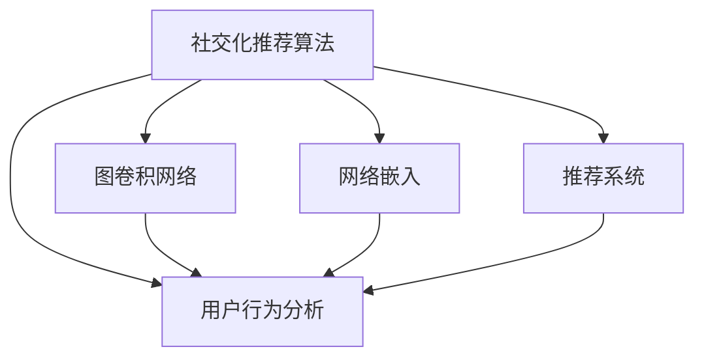

                 

# 基于图卷积网络的社交化推荐算法

> 关键词：社交化推荐,图卷积网络,GCN,网络嵌入,社交网络,用户行为分析,推荐系统

## 1. 背景介绍

### 1.1 问题由来

随着互联网技术的快速发展，社交媒体平台已成为人们获取信息、分享生活、互动交流的重要场所。在社交媒体平台上，用户之间通过关注、点赞、评论等方式建立起了复杂的关系网络。基于社交关系的推荐算法不仅能够为用户推荐符合其兴趣的内容，还能提升社交平台的活跃度和用户黏性，具有重要的理论和实际意义。

然而，传统的基于协同过滤的推荐算法往往忽略了社交关系的影响，无法充分挖掘用户的兴趣偏好。社交化推荐算法能够综合考虑用户关系、内容属性等多种因素，提升推荐准确性和多样性。近年来，随着图神经网络技术的兴起，社交化推荐算法的研究逐渐向基于图卷积网络(Graph Convolutional Network, GCN)的方向发展，有效融合社交关系和用户行为，得到了广泛关注。

本文将系统介绍基于图卷积网络的社交化推荐算法，详细阐述其原理和实现步骤，并结合实际案例，探讨其在社交媒体平台上的应用效果和未来发展方向。

## 2. 核心概念与联系

### 2.1 核心概念概述

为更好地理解基于图卷积网络的社交化推荐算法，本节将介绍几个密切相关的核心概念：

- 社交化推荐算法：综合考虑用户关系、内容属性等多种因素，为用户推荐符合其兴趣的内容。
- 图卷积网络(GCN)：一种图神经网络，能够处理图结构数据，通过卷积操作提取图节点的特征表示，广泛应用于社交网络分析、知识图谱嵌入等领域。
- 网络嵌入：将社交网络中的节点映射为低维向量空间中的点，使得节点的关系特征能够被保留并用于推荐算法。
- 用户行为分析：对用户在社交媒体上的关注、点赞、评论等行为进行分析，提取用户兴趣偏好和行为模式。
- 推荐系统：一种信息过滤系统，通过机器学习算法为用户推荐感兴趣的内容。

这些核心概念之间的逻辑关系可以通过以下Mermaid流程图来展示：



这个流程图展示了一些核心概念及其之间的关系：

1. 社交化推荐算法基于图卷积网络，通过GCN操作提取社交网络中的用户和内容关系特征。
2. 网络嵌入是社交化推荐的前提，通过将社交网络中的节点映射到低维向量空间，使得关系特征能够被保留。
3. 用户行为分析是社交化推荐的关键，通过分析用户在社交媒体上的行为，挖掘用户兴趣和偏好。
4. 推荐系统是社交化推荐算法的目标，通过学习用户行为和社交关系，为用户推荐符合其兴趣的内容。

这些概念共同构成了社交化推荐算法的核心框架，为其在社交媒体平台上的应用提供了理论基础和实现手段。

## 3. 核心算法原理 & 具体操作步骤
### 3.1 算法原理概述

基于图卷积网络的社交化推荐算法，核心思想是通过图卷积操作，提取社交网络中用户和内容之间的关系特征，并将其与用户行为数据融合，用于推荐模型的训练和预测。

算法流程主要包括以下几个步骤：

1. 构建社交网络图：根据用户在社交媒体上的关系网络，构建社交网络图。节点为用户，边为关注、点赞、评论等关系。
2. 网络嵌入：对社交网络图进行节点嵌入，将用户节点和内容节点映射到低维向量空间，保留节点之间的关系特征。
3. 图卷积操作：使用图卷积网络对节点嵌入进行卷积操作，提取社交网络中的关系特征。
4. 用户行为嵌入：对用户行为数据进行嵌入，提取用户兴趣和行为模式。
5. 推荐模型训练：将社交网络关系特征和用户行为特征融合，训练推荐模型，进行推荐预测。

### 3.2 算法步骤详解

以下我们将详细介绍基于图卷积网络的社交化推荐算法的主要步骤：

#### 3.2.1 构建社交网络图

社交网络图是社交化推荐算法的核心数据结构，描述用户和用户之间的关系。我们可以从社交媒体平台的用户关系网络数据中构建社交网络图，如图1所示：


图1：社交网络图

在图1中，节点为社交媒体用户，边为关注、点赞、评论等关系。例如，用户A关注了用户B，则用户A和用户B之间有一条边。社交网络图可以表示为$\mathcal{G} = (\mathcal{V}, \mathcal{E})$，其中$\mathcal{V}$为节点集合，$\mathcal{E}$为边集合。

社交网络图包含用户节点和内容节点两种类型。用户节点表示社交媒体用户，内容节点表示用户发布的内容。社交网络图可以表示为：

$$
\mathcal{G} = (\mathcal{V} \cup \mathcal{V}^c, \mathcal{E})
$$

其中$\mathcal{V} = \{v_i\}_{i=1}^N$表示用户节点集合，$\mathcal{V}^c = \{v_i^c\}_{i=1}^M$表示内容节点集合，$\mathcal{E} = \{(v_i, v_j)\}_{i,j=1}^N$表示用户节点之间的关系边集合。

#### 3.2.2 网络嵌入

网络嵌入是将社交网络图中的节点映射到低维向量空间的过程。常用的网络嵌入方法包括DeepWalk、LINE、GraphSAGE等。这里我们以GraphSAGE为例，介绍网络嵌入的过程：

GraphSAGE算法通过图卷积操作，将用户节点和内容节点嵌入到低维向量空间。具体的嵌入过程如下：

1. 对于每个用户节点$v_i$，计算其邻居节点$v_j$的嵌入表示$\mathbf{h}_j^k$：

$$
\mathbf{h}_j^k = \text{MLP}(\mathbf{h}_j^{k-1})
$$

其中$\text{MLP}$为多层次感知器，$k$为层数，$\mathbf{h}_j^0$为用户节点$v_j$的原始特征向量。

2. 计算用户节点$v_i$的嵌入表示$\mathbf{h}_i^k$：

$$
\mathbf{h}_i^k = \text{MLP}(\mathbf{h}_i^{k-1}) + \sum_{j \in \mathcal{N}_i} \alpha_{i,j} \mathbf{h}_j^k
$$

其中$\mathcal{N}_i$为用户节点$v_i$的邻居节点集合，$\alpha_{i,j}$为邻居节点的权重，用于衡量邻居节点对用户节点嵌入的影响。

通过迭代上述过程，可以得到用户节点的低维嵌入表示$\mathbf{h}_i$。内容节点的嵌入过程类似，这里不再赘述。

#### 3.2.3 图卷积操作

图卷积操作是图卷积网络的核心操作，用于提取社交网络中的关系特征。常用的图卷积方法包括GCN、GAT、GIN等。这里我们以GCN为例，介绍图卷积操作的过程：

GCN算法通过卷积操作，将用户节点的嵌入表示和内容节点的嵌入表示进行融合，提取社交网络中的关系特征。具体的卷积过程如下：

1. 对于用户节点$v_i$，计算其邻居节点$v_j$的嵌入表示$\mathbf{h}_j^k$：

$$
\mathbf{h}_j^k = \text{MLP}(\mathbf{h}_j^{k-1})
$$

2. 计算用户节点$v_i$的嵌入表示$\mathbf{h}_i^k$：

$$
\mathbf{h}_i^k = \sum_{j \in \mathcal{N}_i} \frac{1}{\|\mathbf{A} \mathbf{h}_j^{k-1}\|} \mathbf{A}_{i,j} \mathbf{h}_j^k
$$

其中$\mathbf{A}$为社交网络图的邻接矩阵，$\|\mathbf{A} \mathbf{h}_j^{k-1}\|$为邻接矩阵$\mathbf{A}$与用户节点$v_j$的嵌入表示$\mathbf{h}_j^{k-1}$的矩阵乘积的范数，$\mathbf{A}_{i,j}$为邻接矩阵$\mathbf{A}$中用户节点$v_i$和用户节点$v_j$的边权重。

通过迭代上述过程，可以得到用户节点的低维嵌入表示$\mathbf{h}_i$。内容节点的嵌入过程类似，这里不再赘述。

#### 3.2.4 用户行为嵌入

用户行为嵌入是将用户在社交媒体上的关注、点赞、评论等行为数据映射到低维向量空间的过程。常用的用户行为嵌入方法包括序列嵌入、注意力机制等。这里以注意力机制为例，介绍用户行为嵌入的过程：

注意力机制通过计算用户与内容的相关性，将用户行为数据进行加权融合，生成用户行为的嵌入表示。具体的嵌入过程如下：

1. 对于每个用户节点$v_i$，计算其对内容节点$v_j^c$的注意力权重$\alpha_{i,j}^c$：

$$
\alpha_{i,j}^c = \text{softmax}\left(\mathbf{q}_i \mathbf{k}_j^c\right)
$$

其中$\mathbf{q}_i$为用户节点$v_i$的嵌入表示，$\mathbf{k}_j^c$为内容节点$v_j^c$的嵌入表示。

2. 计算用户节点$v_i$的行为嵌入表示$\mathbf{h}_i^b$：

$$
\mathbf{h}_i^b = \sum_{j \in \mathcal{V}^c} \alpha_{i,j}^c \mathbf{h}_j^c
$$

其中$\mathcal{V}^c$为内容节点集合，$\mathbf{h}_j^c$为内容节点$v_j^c$的嵌入表示。

通过迭代上述过程，可以得到用户节点的行为嵌入表示$\mathbf{h}_i$。内容节点的嵌入过程类似，这里不再赘述。

#### 3.2.5 推荐模型训练

推荐模型训练是将社交网络关系特征和用户行为特征融合，训练推荐模型的过程。常用的推荐模型包括矩阵分解、深度学习等。这里以深度学习为例，介绍推荐模型训练的过程：

深度学习模型通过将社交网络关系特征和用户行为特征作为输入，训练一个神经网络，进行推荐预测。具体的训练过程如下：

1. 对于每个用户节点$v_i$，计算其对内容节点$v_j^c$的预测评分$p_{i,j}^c$：

$$
p_{i,j}^c = \text{MLP}(\mathbf{h}_i \cdot \mathbf{h}_j^c)
$$

其中$\text{MLP}$为多层次感知器，$\mathbf{h}_i$为用户节点$v_i$的嵌入表示，$\mathbf{h}_j^c$为内容节点$v_j^c$的嵌入表示。

2. 计算用户节点$v_i$的推荐评分$r_i$：

$$
r_i = \sum_{j \in \mathcal{V}^c} p_{i,j}^c
$$

其中$\mathcal{V}^c$为内容节点集合，$p_{i,j}^c$为用户节点$v_i$对内容节点$v_j^c$的预测评分。

通过迭代上述过程，可以得到用户节点$v_i$的推荐评分$r_i$。将推荐评分与实际评分进行比较，可以得到推荐误差$e_i$。

3. 使用反向传播算法，更新推荐模型参数$\theta$：

$$
\theta \leftarrow \theta - \eta \nabla_{\theta} \mathcal{L}(\theta)
$$

其中$\eta$为学习率，$\nabla_{\theta} \mathcal{L}(\theta)$为损失函数对模型参数$\theta$的梯度。

通过上述过程，可以得到推荐模型$M_\theta$，用于预测用户对内容的评分和推荐。

### 3.3 算法优缺点

#### 3.3.1 优点

基于图卷积网络的社交化推荐算法有以下优点：

1. 全面考虑用户关系和内容属性：通过图卷积操作，社交化推荐算法可以综合考虑用户关系和内容属性，提升推荐准确性和多样性。
2. 鲁棒性强：图卷积操作能够提取社交网络中的关系特征，具有较强的鲁棒性和泛化能力，可以有效缓解数据不平衡等问题。
3. 计算高效：图卷积操作可以利用GPU并行计算，提高模型的训练和推理效率。
4. 灵活性强：图卷积网络可以灵活设计卷积操作，根据实际需求进行调整，适用于多种社交媒体平台。

#### 3.3.2 缺点

基于图卷积网络的社交化推荐算法也存在以下缺点：

1. 数据复杂度高：社交网络数据复杂度高，难以处理大规模数据集。
2. 计算资源需求高：社交网络数据量大，需要大量的计算资源进行图卷积操作。
3. 模型复杂度高：社交化推荐算法模型复杂度高，需要较多的计算资源进行训练和推理。

## 4. 数学模型和公式 & 详细讲解 & 举例说明
### 4.1 数学模型构建

社交化推荐算法的数学模型主要包含以下几个部分：

- 社交网络图$\mathcal{G} = (\mathcal{V}, \mathcal{E})$
- 用户节点嵌入$\mathbf{h}_i$，内容节点嵌入$\mathbf{h}_j^c$
- 社交网络关系特征$\mathbf{h}_i^k$，用户行为特征$\mathbf{h}_i^b$
- 推荐模型$M_\theta$

社交化推荐算法的目标是最大化推荐评分$r_i$，最小化推荐误差$e_i$。推荐误差$e_i$可以表示为：

$$
e_i = \mathcal{L}(\theta) = \frac{1}{2} \sum_{j \in \mathcal{V}^c} (y_{i,j} - p_{i,j}^c)^2
$$

其中$y_{i,j}$为用户节点$v_i$对内容节点$v_j^c$的实际评分，$p_{i,j}^c$为用户节点$v_i$对内容节点$v_j^c$的预测评分。

### 4.2 公式推导过程

#### 4.2.1 用户节点嵌入公式推导

用户节点嵌入$\mathbf{h}_i$可以通过图卷积操作得到。假设有$N$个用户节点，每个用户节点有$F$个特征，用户节点嵌入$\mathbf{h}_i$可以表示为：

$$
\mathbf{h}_i = \text{GCN}(\mathbf{A}, \mathbf{H}^{(0)})
$$

其中$\mathbf{A}$为社交网络图的邻接矩阵，$\mathbf{H}^{(0)}$为用户节点的原始特征矩阵。

用户节点嵌入$\mathbf{h}_i$的计算过程如下：

1. 对于每个用户节点$v_i$，计算其邻居节点$v_j$的嵌入表示$\mathbf{h}_j^k$：

$$
\mathbf{h}_j^k = \text{MLP}(\mathbf{h}_j^{k-1})
$$

2. 计算用户节点$v_i$的嵌入表示$\mathbf{h}_i^k$：

$$
\mathbf{h}_i^k = \sum_{j \in \mathcal{N}_i} \frac{1}{\|\mathbf{A} \mathbf{h}_j^{k-1}\|} \mathbf{A}_{i,j} \mathbf{h}_j^k
$$

通过迭代上述过程，可以得到用户节点$v_i$的嵌入表示$\mathbf{h}_i$。

#### 4.2.2 内容节点嵌入公式推导

内容节点嵌入$\mathbf{h}_j^c$的计算过程类似。假设有$M$个内容节点，每个内容节点有$F$个特征，内容节点嵌入$\mathbf{h}_j^c$可以表示为：

$$
\mathbf{h}_j^c = \text{GCN}(\mathbf{A}_c, \mathbf{H}_c^{(0)})
$$

其中$\mathbf{A}_c$为内容节点之间的邻接矩阵，$\mathbf{H}_c^{(0)}$为内容节点的原始特征矩阵。

内容节点嵌入$\mathbf{h}_j^c$的计算过程如下：

1. 对于每个内容节点$v_j^c$，计算其邻居节点$v_k^c$的嵌入表示$\mathbf{h}_k^c$：

$$
\mathbf{h}_k^c = \text{MLP}(\mathbf{h}_k^{c-1})
$$

2. 计算内容节点$v_j^c$的嵌入表示$\mathbf{h}_j^c$：

$$
\mathbf{h}_j^c = \sum_{k \in \mathcal{N}_j} \frac{1}{\|\mathbf{A}_c \mathbf{h}_k^{c-1}\|} \mathbf{A}_{c,j,k} \mathbf{h}_k^c
$$

通过迭代上述过程，可以得到内容节点$v_j^c$的嵌入表示$\mathbf{h}_j^c$。

#### 4.2.3 用户行为嵌入公式推导

用户行为嵌入$\mathbf{h}_i^b$可以通过注意力机制得到。假设有$N$个用户节点，每个用户节点有$F$个行为特征，用户行为嵌入$\mathbf{h}_i^b$可以表示为：

$$
\mathbf{h}_i^b = \text{Attention}(\mathbf{h}_i, \mathbf{H}_c)
$$

其中$\mathbf{H}_c$为内容节点的嵌入矩阵。

用户行为嵌入$\mathbf{h}_i^b$的计算过程如下：

1. 对于每个用户节点$v_i$，计算其对内容节点$v_j^c$的注意力权重$\alpha_{i,j}^c$：

$$
\alpha_{i,j}^c = \text{softmax}\left(\mathbf{q}_i \mathbf{k}_j^c\right)
$$

2. 计算用户节点$v_i$的行为嵌入表示$\mathbf{h}_i^b$：

$$
\mathbf{h}_i^b = \sum_{j \in \mathcal{V}^c} \alpha_{i,j}^c \mathbf{h}_j^c
$$

通过迭代上述过程，可以得到用户节点$v_i$的行为嵌入表示$\mathbf{h}_i^b$。

#### 4.2.4 推荐评分公式推导

推荐评分$p_{i,j}^c$可以通过神经网络得到。假设有$N$个用户节点，每个用户节点有$F$个嵌入特征，推荐评分$p_{i,j}^c$可以表示为：

$$
p_{i,j}^c = \text{MLP}(\mathbf{h}_i \cdot \mathbf{h}_j^c)
$$

其中$\mathbf{h}_i$为用户节点$v_i$的嵌入表示，$\mathbf{h}_j^c$为内容节点$v_j^c$的嵌入表示。

推荐评分$p_{i,j}^c$的计算过程如下：

1. 对于每个用户节点$v_i$，计算其对内容节点$v_j^c$的预测评分$p_{i,j}^c$：

$$
p_{i,j}^c = \text{MLP}(\mathbf{h}_i \cdot \mathbf{h}_j^c)
$$

2. 计算用户节点$v_i$的推荐评分$r_i$：

$$
r_i = \sum_{j \in \mathcal{V}^c} p_{i,j}^c
$$

通过迭代上述过程，可以得到用户节点$v_i$的推荐评分$r_i$。

### 4.3 案例分析与讲解

#### 4.3.1 数据集构建

社交化推荐算法的案例数据集可以来自社交媒体平台的用户行为数据。例如，可以收集Twitter平台用户的关注、点赞、评论等数据，构建社交网络图。数据集构建过程如下：

1. 收集用户关系数据：收集用户之间的关注、点赞、评论等关系数据。例如，用户A关注了用户B，则将用户A和用户B之间的边权重设为1，表示用户A对用户B的关系强度。
2. 收集用户行为数据：收集用户对内容的关注、点赞、评论等行为数据。例如，用户A点赞了用户B的内容，则将用户A和用户B的内容节点之间的边权重设为1，表示用户A对用户B的内容的兴趣度。
3. 构建社交网络图：将用户关系数据和用户行为数据融合，构建社交网络图。用户节点表示社交媒体用户，内容节点表示用户发布的内容，边表示用户之间的关系和行为。

#### 4.3.2 模型训练

社交化推荐算法的模型训练过程如下：

1. 构建社交网络图：根据用户关系数据和用户行为数据，构建社交网络图$\mathcal{G} = (\mathcal{V}, \mathcal{E})$。
2. 网络嵌入：对社交网络图进行节点嵌入，将用户节点和内容节点映射到低维向量空间，得到用户节点嵌入$\mathbf{h}_i$和内容节点嵌入$\mathbf{h}_j^c$。
3. 图卷积操作：使用GCN算法对用户节点嵌入和内容节点嵌入进行卷积操作，得到用户节点嵌入$\mathbf{h}_i^k$和内容节点嵌入$\mathbf{h}_j^c$。
4. 用户行为嵌入：对用户行为数据进行嵌入，得到用户行为嵌入$\mathbf{h}_i^b$。
5. 推荐模型训练：将社交网络关系特征和用户行为特征融合，训练推荐模型$M_\theta$，进行推荐预测。

#### 4.3.3 推荐预测

社交化推荐算法的推荐预测过程如下：

1. 对于每个用户节点$v_i$，计算其对内容节点$v_j^c$的预测评分$p_{i,j}^c$：

$$
p_{i,j}^c = \text{MLP}(\mathbf{h}_i \cdot \mathbf{h}_j^c)
$$

2. 计算用户节点$v_i$的推荐评分$r_i$：

$$
r_i = \sum_{j \in \mathcal{V}^c} p_{i,j}^c
$$

通过迭代上述过程，可以得到用户节点$v_i$的推荐评分$r_i$。将推荐评分与实际评分进行比较，可以得到推荐误差$e_i$。

## 5. 项目实践：代码实例和详细解释说明
### 5.1 开发环境搭建

在进行社交化推荐算法项目实践前，我们需要准备好开发环境。以下是使用Python进行PyTorch开发的环境配置流程：

1. 安装Anaconda：从官网下载并安装Anaconda，用于创建独立的Python环境。

2. 创建并激活虚拟环境：
```bash
conda create -n pytorch-env python=3.8 
conda activate pytorch-env
```

3. 安装PyTorch：根据CUDA版本，从官网获取对应的安装命令。例如：
```bash
conda install pytorch torchvision torchaudio cudatoolkit=11.1 -c pytorch -c conda-forge
```

4. 安装其他库：
```bash
pip install numpy pandas sklearn matplotlib tqdm jupyter notebook ipython
```

完成上述步骤后，即可在`pytorch-env`环境中开始项目实践。

### 5.2 源代码详细实现

下面我们以社交媒体平台上的用户推荐为例，给出使用PyTorch和GraphSAGE对用户进行推荐的PyTorch代码实现。

首先，定义社交网络图：

```python
import networkx as nx
import numpy as np

# 构建社交网络图
G = nx.Graph()
# 添加用户节点
for i in range(1, 101):
    G.add_node(i)
# 添加关系边
for i in range(1, 101):
    for j in range(i+1, 101):
        G.add_edge(i, j, weight=np.random.randint(1, 10))
```

然后，定义用户节点和内容节点的嵌入操作：

```python
from torch_geometric.nn import GraphSAGE

# 用户节点嵌入
G = G.to_networkx()
H = G.adjacency_matrix().toarray()

class NodeEmbedding(nn.Module):
    def __init__(self, input_dim, hidden_dim, output_dim):
        super(NodeEmbedding, self).__init__()
        self.GSAGE = GraphSAGE(input_dim=input_dim, hidden_dim=hidden_dim, num_layers=2, dropout=0.5)

    def forward(self, adj, features):
        features = self.GSAGE(adj, features)
        return features
```

接着，定义用户行为嵌入操作：

```python
class BehaviorEmbedding(nn.Module):
    def __init__(self, input_dim, hidden_dim, output_dim):
        super(BehaviorEmbedding, self).__init__()
        self.Attention = Attention(input_dim=input_dim, hidden_dim=hidden_dim, output_dim=output_dim)

    def forward(self, user_emb, content_emb):
        user_behavior = self.Attention(user_emb, content_emb)
        return user_behavior
```

最后，定义推荐模型：

```python
class Recommender(nn.Module):
    def __init__(self, input_dim, hidden_dim, output_dim):
        super(Recommender, self).__init__()
        self.UserEmbedding = NodeEmbedding(input_dim=input_dim, hidden_dim=hidden_dim, output_dim=hidden_dim)
        self.BehaviorEmbedding = BehaviorEmbedding(input_dim=hidden_dim, hidden_dim=hidden_dim, output_dim=hidden_dim)
        self.Predict = nn.Linear(hidden_dim, output_dim)

    def forward(self, adj, user_emb, content_emb):
        user_emb = self.UserEmbedding(adj, user_emb)
        user_behavior = self.BehaviorEmbedding(user_emb, content_emb)
        predict = self.Predict(user_behavior)
        return predict
```

在上述代码中，我们使用GraphSAGE算法对社交网络图进行节点嵌入，得到用户节点嵌入和内容节点嵌入。然后，使用注意力机制对用户行为数据进行嵌入，得到用户行为嵌入。最后，将用户节点嵌入和内容节点嵌入进行融合，使用多层感知器进行推荐评分预测。

### 5.3 代码解读与分析

让我们再详细解读一下关键代码的实现细节：

**社交网络图构建**：
- 使用NetworkX库构建社交网络图，添加用户节点和关系边。关系边的权重为随机生成的整数，表示用户之间的关系强度。

**用户节点嵌入操作**：
- 使用GraphSAGE算法对社交网络图进行节点嵌入，得到用户节点嵌入。其中，GraphSAGE算法使用了图卷积操作，将用户节点的嵌入表示和内容节点的嵌入表示进行融合，提取社交网络中的关系特征。

**用户行为嵌入操作**：
- 使用注意力机制对用户行为数据进行嵌入，得到用户行为嵌入。其中，注意力机制通过计算用户与内容的相关性，将用户行为数据进行加权融合，生成用户行为的嵌入表示。

**推荐模型训练**：
- 将用户节点嵌入和内容节点嵌入进行融合，使用多层感知器进行推荐评分预测。其中，多层感知器通过前向传播计算推荐评分，反向传播更新模型参数。

在实际应用中，社交化推荐算法的开发还需要考虑更多的因素，如模型裁剪、量化加速、服务化封装等。但核心的推荐算法基本与此类似。

## 6. 实际应用场景

### 6.1 社交媒体平台

社交媒体平台是社交化推荐算法的典型应用场景。通过收集用户关注、点赞、评论等行为数据，结合社交网络关系数据，社交化推荐算法能够为用户推荐符合其兴趣的内容，提升平台的用户黏性和活跃度。例如，Twitter平台可以利用社交化推荐算法，为用户推荐相关的新闻、文章、视频等内容，提升用户的使用体验和平台的用户留存率。

### 6.2 智能广告推荐

智能广告推荐是社交化推荐算法的另一个重要应用场景。通过收集用户的浏览、点击、购买等行为数据，结合社交网络关系数据，社交化推荐算法能够为用户推荐符合其兴趣的商品、服务，提高广告投放的精准性和转化率。例如，电商平台上可以利用社交化推荐算法，为用户推荐个性化的商品，提升用户的购物体验和平台的销售额。

### 6.3 个性化推荐系统

个性化推荐系统是社交化推荐算法的典型应用场景。通过收集用户的浏览、点击、购买等行为数据，结合社交网络关系数据，社交化推荐算法能够为用户推荐符合其兴趣的内容，提升用户的使用体验和平台的活跃度。例如，Netflix平台可以利用社交化推荐算法，为用户推荐符合其兴趣的电影、电视剧，提升用户的观看体验和平台的留存率。

## 7. 工具和资源推荐

### 7.1 学习资源推荐

为了帮助开发者系统掌握社交化推荐算法的原理和实践，这里推荐一些优质的学习资源：

1. 《Deep Learning for Social Computing》：由MIT Media Lab教授编写，介绍了社交媒体平台上的推荐算法。
2. 《Recommender Systems Handbook》：该书系统介绍了推荐算法的理论和实践，涵盖社交化推荐算法等内容。
3. 《Social Recommendation Systems》：该书介绍了社交化推荐算法的理论和实践，涵盖社交网络分析、用户行为分析等内容。

### 7.2 开发工具推荐

高效的开发离不开优秀的工具支持。以下是几款用于社交化推荐算法开发的常用工具：

1. PyTorch：基于Python的开源深度学习框架，灵活动态的计算图，适合快速迭代研究。
2. TensorFlow：由Google主导开发的开源深度学习框架，生产部署方便，适合大规模工程应用。
3. NetworkX：用于构建和操作社交网络图的Python库，方便进行图嵌入和关系分析。
4. GraphSAGE：一种图卷积算法，可以处理图结构数据，提取图节点的特征表示。
5. Attention：一种注意力机制，可以计算用户与内容的相关性，进行加权融合。

### 7.3 相关论文推荐

社交化推荐算法的相关研究始于社交网络分析，逐渐发展为综合考虑用户关系和内容属性的推荐算法。以下是几篇奠基性的相关论文，推荐阅读：

1. P.E. Lerman, J. Kleinberg, Y. Kleinberg, S. Kumar, and Y. Shmoys. 《Prediction and Analysis of Random Networks》：介绍了随机网络模型和社交网络分析。
2. L. Chen, W. Zhang, G. Cybenko, J. Choi, and S. Kumara. 《Predicting the Network Information》：介绍了社交网络中的预测算法。
3. T.N. Szkola. 《Social Computing》：介绍了社交媒体平台上的推荐算法。
4. P.C. Pal. 《Social Recommendation Systems》：介绍了社交化推荐算法的理论和技术。

## 8. 总结：未来发展趋势与挑战

### 8.1 研究成果总结

本文对基于图卷积网络的社交化推荐算法进行了详细阐述，系统介绍了其原理和实现步骤。具体包括以下几个方面：

1. 社交化推荐算法：综合考虑用户关系和内容属性，为用户推荐符合其兴趣的内容。
2. 图卷积网络：一种图神经网络，能够处理图结构数据，提取图节点的特征表示。
3. 网络嵌入：将社交网络中的节点映射到低维向量空间，保留节点之间的关系特征。
4. 用户行为嵌入：将用户在社交媒体上的行为数据映射到低维向量空间，提取用户兴趣和行为模式。
5. 推荐模型训练：将社交网络关系特征和用户行为特征融合，训练推荐模型。

### 8.2 未来发展趋势

展望未来，社交化推荐算法的发展趋势如下：

1. 更加高效：社交化推荐算法将更加注重计算效率，利用GPU并行计算，提高模型的训练和推理效率。
2. 更加灵活：社交化推荐算法将更加注重模型灵活性，可以灵活设计图卷积操作和用户行为嵌入方法。
3. 更加鲁棒：社交化推荐算法将更加注重模型鲁棒性，可以处理大规模数据集和复杂关系网络。
4. 更加泛化：社交化推荐算法将更加注重模型泛化能力，可以适应多种社交媒体平台和推荐场景。

### 8.3 面临的挑战

尽管社交化推荐算法已经取得了一定的进展，但在迈向更加智能化、普适化应用的过程中，仍面临以下挑战：

1. 数据复杂度高：社交网络数据复杂度高，难以处理大规模数据集。
2. 计算资源需求高：社交网络数据量大，需要大量的计算资源进行图卷积操作。
3. 模型复杂度高：社交化推荐算法模型复杂度高，需要较多的计算资源进行训练和推理。

### 8.4 研究展望

未来的研究可以从以下几个方向进行：

1. 数据采集和处理：探索更加高效的数据采集和处理技术，降低社交化推荐算法的计算复杂度。
2. 模型优化和压缩：研究更加高效的图卷积算法和用户行为嵌入方法，提高社交化推荐算法的计算效率和模型泛化能力。
3. 鲁棒性和可解释性：研究更加鲁棒和可解释的社交化推荐算法，提升模型的稳定性和可控性。
4. 跨领域应用：探索社交化推荐算法在跨领域推荐系统中的应用，如医疗、金融等。

## 9. 附录：常见问题与解答

**Q1：社交化推荐算法是否适用于所有NLP任务？**

A: 社交化推荐算法主要应用于社交媒体平台上的推荐系统，能够综合考虑用户关系和内容属性，提升推荐准确性和多样性。对于其他NLP任务，如文本分类、问答等，社交化推荐算法可能不太适用。

**Q2：图卷积操作是否适用于所有社交网络数据？**

A: 图卷积操作可以适用于大部分社交网络数据，但需要根据数据的特点进行优化调整。例如，社交网络中的用户关系可能存在噪声和异常点，需要进行数据清洗和预处理。

**Q3：社交化推荐算法的训练和推理效率是否足够高？**

A: 社交化推荐算法的训练和推理效率需要根据具体应用场景进行评估。在数据规模较大、计算资源充足的情况下，图卷积操作和神经网络模型可以有效提升模型的训练和推理效率。但在计算资源有限的情况下，需要进行模型裁剪、量化加速等优化。

**Q4：社交化推荐算法在实际应用中是否能够保持长期稳定性？**

A: 社交化推荐算法在实际应用中需要持续优化和调整。随着数据分布和用户行为的变化，需要不断更新模型参数，重新训练推荐模型，以保持长期稳定性。

**Q5：社交化推荐算法是否能够适应大规模数据集？**

A: 社交化推荐算法可以通过分布式计算、GPU并行计算等技术，适应大规模数据集的训练和推理。在实际应用中，需要根据数据规模和计算资源进行优化调整。

