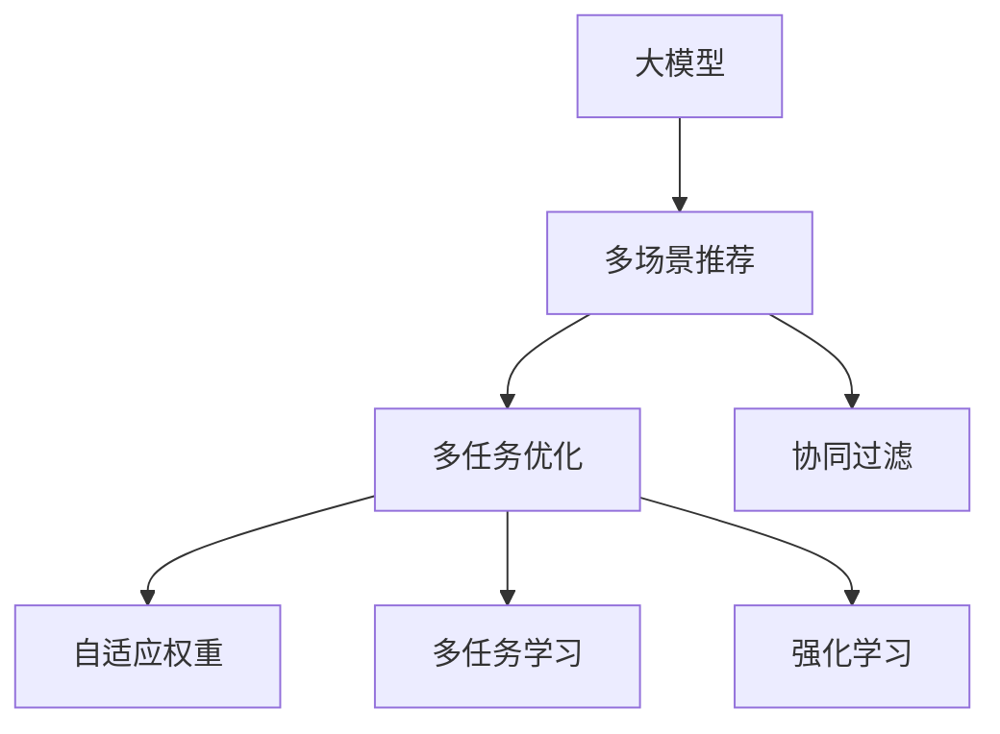

                 

# 基于大模型的多场景多任务推荐优化

> 关键词：多场景多任务推荐,大模型,协同过滤,深度学习,推荐系统,自适应权重,多任务学习,强化学习,深度神经网络,优化算法

## 1. 背景介绍

### 1.1 问题由来

随着互联网技术的不断进步，推荐系统已经成为电子商务、社交媒体、视频平台等众多互联网应用的核心功能。推荐系统通过精准推荐产品、内容、视频等，提升用户体验，增加商业价值。然而，传统的基于协同过滤的推荐系统面临诸多挑战，如冷启动问题、数据稀疏性、召回率低等。

为应对这些挑战，近年来，基于深度学习的推荐系统逐步成为主流。通过深度神经网络进行用户行为建模，推荐系统能够从海量数据中提取更深层次的特征，提升推荐的精准度和效果。但大模型面临计算资源消耗巨大、参数多难优化等难题，使其在实际部署中面临诸多困难。

针对这些问题，本文提出一种基于大模型的多场景多任务推荐优化方法。该方法采用自适应权重机制，对大模型进行多场景多任务微调，同时引入多任务学习和强化学习技术，优化推荐过程。通过这一系列技术，可以更高效地构建推荐系统，提升用户体验，增加商业价值。

### 1.2 问题核心关键点

本文研究的核心问题是如何在多场景多任务推荐系统中，更高效地构建和优化推荐模型。具体来说，主要涉及以下几个关键点：

1. **多场景推荐**：推荐系统需要同时支持多种场景下的推荐任务，如电商推荐、社交媒体推荐、视频推荐等。

2. **多任务优化**：推荐模型需要同时学习多个任务，如物品推荐、用户推荐、用户行为预测等。

3. **自适应权重**：不同场景和任务对模型的需求不同，通过自适应权重机制，可以更高效地分配计算资源。

4. **协同过滤与深度学习结合**：协同过滤和深度学习相结合的推荐方法，可以互补彼此的优势，构建更全面的推荐系统。

5. **强化学习**：通过强化学习，推荐模型能够学习最优的推荐策略，提升推荐效果。

## 2. 核心概念与联系

### 2.1 核心概念概述

为更好地理解基于大模型的多场景多任务推荐优化方法，本节将介绍几个密切相关的核心概念：

- **大模型**：指具有大规模参数的深度神经网络，如BERT、GPT-3、T5等。通过在大规模无标签数据上预训练，大模型可以学习到丰富的知识，具备较强的表示能力。

- **多场景推荐**：指推荐系统需要同时处理多种推荐场景，如电商、社交、视频等。

- **多任务学习**：指同一模型同时学习多个相关任务，通过共享参数和知识，提升模型的泛化能力和性能。

- **协同过滤**：指通过用户和物品之间的相似度，推荐系统可以推荐与用户喜好相似的物品。

- **自适应权重**：指根据任务需求，动态调整模型在不同任务和场景中的权重，优化计算资源的分配。

- **强化学习**：通过不断尝试和调整，模型能够学习到最优的推荐策略，提升推荐效果。

这些核心概念之间的逻辑关系可以通过以下Mermaid流程图来展示：



这个流程图展示了大模型、多场景推荐、多任务学习、协同过滤、自适应权重和强化学习之间的相互关系：

1. 大模型通过预训练获得基础能力。
2. 多场景推荐需要处理多种推荐场景，并引入协同过滤技术。
3. 多任务优化需要同一模型学习多个任务，通过共享参数提升性能。
4. 自适应权重用于动态调整模型在不同任务和场景中的权重，优化计算资源的分配。
5. 多任务学习和强化学习技术，可以提升模型的泛化能力和性能。

这些核心概念共同构成了基于大模型的多场景多任务推荐优化的技术框架，使其能够在各种场景下发挥强大的推荐能力。

## 3. 核心算法原理 & 具体操作步骤
### 3.1 算法原理概述

基于大模型的多场景多任务推荐优化，本质上是一个多任务学习和自适应权重优化的过程。其核心思想是：将预训练的大模型视作一个强大的"特征提取器"，通过多任务学习和自适应权重机制，对大模型进行多场景多任务微调，使得模型输出能够匹配不同场景和任务的需求，从而获得针对特定任务优化的模型。

形式化地，假设预训练模型为 $M_{\theta}$，其中 $\theta$ 为预训练得到的模型参数。给定 $k$ 个推荐场景 $T_1, T_2, ..., T_k$，以及对应的多个推荐任务 $T_{i,j}$，$i=1,2,...,k$，$j=1,2,...,n_i$。微调的目标是找到新的模型参数 $\hat{\theta}$，使得：

$$
\hat{\theta}=\mathop{\arg\min}_{\theta} \sum_{i=1}^k \sum_{j=1}^{n_i} \mathcal{L}_{T_{i,j}}(M_{\theta},D_{T_{i,j}})
$$

其中 $\mathcal{L}_{T_{i,j}}$ 为针对任务 $T_{i,j}$ 设计的损失函数，用于衡量模型预测输出与真实标签之间的差异。常见的损失函数包括交叉熵损失、均方误差损失等。

通过梯度下降等优化算法，微调过程不断更新模型参数 $\theta$，最小化损失函数，使得模型输出逼近真实标签。由于 $\theta$ 已经通过预训练获得了较好的初始化，因此即便在多场景多任务情况下，也能较快收敛到理想的模型参数 $\hat{\theta}$。

### 3.2 算法步骤详解

基于大模型的多场景多任务推荐优化一般包括以下几个关键步骤：

**Step 1: 准备预训练模型和数据集**
- 选择合适的预训练语言模型 $M_{\theta}$ 作为初始化参数，如 BERT、GPT 等。
- 准备每个推荐场景 $T_i$ 对应的推荐任务数据集 $D_{T_i}=\{(x_i,y_i)\}_{i=1}^{n_i}$，其中 $x_i$ 为输入特征，$y_i$ 为真实标签。

**Step 2: 设计任务适配层**
- 根据推荐任务的类型，在预训练模型顶层设计合适的输出层和损失函数。
- 对于分类任务，通常在顶层添加线性分类器和交叉熵损失函数。
- 对于生成任务，通常使用语言模型的解码器输出概率分布，并以负对数似然为损失函数。

**Step 3: 设置微调超参数**
- 选择合适的优化算法及其参数，如 AdamW、SGD 等，设置学习率、批大小、迭代轮数等。
- 设置正则化技术及强度，包括权重衰减、Dropout、Early Stopping等。
- 确定冻结预训练参数的策略，如仅微调顶层，或全部参数都参与微调。

**Step 4: 执行梯度训练**
- 将训练集数据分批次输入模型，前向传播计算损失函数。
- 反向传播计算参数梯度，根据设定的优化算法和学习率更新模型参数。
- 周期性在验证集上评估模型性能，根据性能指标决定是否触发 Early Stopping。
- 重复上述步骤直到满足预设的迭代轮数或 Early Stopping 条件。

**Step 5: 测试和部署**
- 在测试集上评估微调后模型 $M_{\hat{\theta}}$ 的性能，对比微调前后的精度提升。
- 使用微调后的模型对新样本进行推理预测，集成到实际的应用系统中。
- 持续收集新的数据，定期重新微调模型，以适应数据分布的变化。

以上是基于大模型的多场景多任务推荐优化的一般流程。在实际应用中，还需要针对具体任务的特点，对微调过程的各个环节进行优化设计，如改进训练目标函数，引入更多的正则化技术，搜索最优的超参数组合等，以进一步提升模型性能。

### 3.3 算法优缺点

基于大模型的多场景多任务推荐优化方法具有以下优点：
1. 简单高效。只需准备少量标注数据，即可对预训练模型进行快速适配，获得较大的性能提升。
2. 通用适用。适用于各种推荐系统，包括电商推荐、社交媒体推荐、视频推荐等，设计简单的任务适配层即可实现微调。
3. 参数高效。利用参数高效微调技术，在固定大部分预训练权重不变的情况下，仍可取得不错的提升。
4. 效果显著。在学术界和工业界的诸多推荐任务上，基于微调的方法已经刷新了最先进的性能指标。

同时，该方法也存在一定的局限性：
1. 依赖标注数据。推荐任务对标注数据的质量和数量有较高要求，获取高质量标注数据的成本较高。
2. 迁移能力有限。当推荐场景与预训练数据的分布差异较大时，推荐模型的性能提升有限。
3. 可解释性不足。推荐模型的决策过程通常缺乏可解释性，难以对其推理逻辑进行分析和调试。

尽管存在这些局限性，但就目前而言，基于大模型的多场景多任务推荐优化方法仍是最主流范式。未来相关研究的重点在于如何进一步降低推荐模型对标注数据的依赖，提高模型的少样本学习和跨场景迁移能力，同时兼顾可解释性和伦理安全性等因素。

### 3.4 算法应用领域

基于大模型的多场景多任务推荐优化方法，已经在推荐系统研究和应用中得到了广泛的应用，覆盖了电商推荐、社交媒体推荐、视频推荐等多个领域，例如：

- **电商推荐**：通过多场景多任务微调，构建电商领域的推荐模型，能够同时支持购物车推荐、商品推荐、个性化定制推荐等。
- **社交媒体推荐**：结合用户行为和社交网络，构建社交媒体领域的推荐模型，能够同时推荐帖子、好友、群组等。
- **视频推荐**：通过多场景多任务微调，构建视频领域的推荐模型，能够同时推荐影片、视频、广告等。

除了上述这些经典应用外，基于大模型的多场景多任务推荐优化方法，也在内容推荐、广告投放、用户行为预测等诸多领域，催生了新的应用场景。

## 4. 数学模型和公式 & 详细讲解 & 举例说明
### 4.1 数学模型构建

本节将使用数学语言对基于大模型的多场景多任务推荐优化过程进行更加严格的刻画。

记预训练语言模型为 $M_{\theta}$，其中 $\theta$ 为预训练得到的模型参数。假设推荐场景 $T_i$ 对应的推荐任务 $T_{i,j}$ 的训练集为 $D_{T_{i,j}}=\{(x_i,y_i)\}_{i=1}^{n_i}$，其中 $x_i$ 为输入特征，$y_i$ 为真实标签。

定义模型 $M_{\theta}$ 在数据样本 $(x,y)$ 上的损失函数为 $\ell(M_{\theta}(x),y)$，则在数据集 $D_{T_i}$ 上的经验风险为：

$$
\mathcal{L}_{T_i}(\theta) = \frac{1}{n_i}\sum_{j=1}^{n_i} \ell(M_{\theta}(x_j),y_j)
$$

微调的目标是最小化各场景的总损失，即找到最优参数：

$$
\theta^* = \mathop{\arg\min}_{\theta} \sum_{i=1}^k \mathcal{L}_{T_i}(\theta)
$$

在实践中，我们通常使用基于梯度的优化算法（如SGD、Adam等）来近似求解上述最优化问题。设 $\eta$ 为学习率，$\lambda$ 为正则化系数，则参数的更新公式为：

$$
\theta \leftarrow \theta - \eta \nabla_{\theta}\mathcal{L}(\theta) - \eta\lambda\theta
$$

其中 $\nabla_{\theta}\mathcal{L}(\theta)$ 为损失函数对参数 $\theta$ 的梯度，可通过反向传播算法高效计算。

### 4.2 公式推导过程

以下我们以电商推荐任务为例，推导多场景多任务微调的损失函数及其梯度的计算公式。

假设电商推荐场景 $T_1$ 包含多个推荐任务，如商品推荐、购物车推荐等。每个任务 $T_{1,j}$ 的训练集为 $D_{1,j}=\{(x_{1,j},y_{1,j})\}_{j=1}^{n_1}$，其中 $x_{1,j}$ 为商品特征，$y_{1,j}$ 为商品被点击的概率。假设推荐模型通过多场景多任务微调后，对任务 $T_{1,j}$ 的预测概率为 $\hat{y}_{1,j}$。则多场景多任务微调的损失函数定义为：

$$
\mathcal{L}_{T_1}(\theta) = \sum_{j=1}^{n_1} \ell(M_{\theta}(x_{1,j}),y_{1,j})
$$

其中 $\ell$ 为交叉熵损失函数。

将电商推荐场景 $T_1$ 的损失函数代入微调目标函数，得：

$$
\theta^* = \mathop{\arg\min}_{\theta} \sum_{i=1}^k \mathcal{L}_{T_i}(\theta) = \mathop{\arg\min}_{\theta} \sum_{i=1}^k \sum_{j=1}^{n_i} \ell(M_{\theta}(x_{i,j}),y_{i,j})
$$

根据链式法则，损失函数对参数 $\theta_k$ 的梯度为：

$$
\frac{\partial \mathcal{L}(\theta)}{\partial \theta_k} = -\frac{1}{N}\sum_{i=1}^k \sum_{j=1}^{n_i} (\frac{y_{i,j}}{M_{\theta}(x_{i,j})}-\frac{1-y_{i,j}}{1-M_{\theta}(x_{i,j})}) \frac{\partial M_{\theta}(x_{i,j})}{\partial \theta_k}
$$

其中 $\frac{\partial M_{\theta}(x_{i,j})}{\partial \theta_k}$ 可进一步递归展开，利用自动微分技术完成计算。

在得到损失函数的梯度后，即可带入参数更新公式，完成模型的迭代优化。重复上述过程直至收敛，最终得到适应推荐场景的最优模型参数 $\theta^*$。

## 5. 项目实践：代码实例和详细解释说明
### 5.1 开发环境搭建

在进行推荐系统开发前，我们需要准备好开发环境。以下是使用Python进行PyTorch开发的环境配置流程：

1. 安装Anaconda：从官网下载并安装Anaconda，用于创建独立的Python环境。

2. 创建并激活虚拟环境：
```bash
conda create -n recommendation-env python=3.8 
conda activate recommendation-env
```

3. 安装PyTorch：根据CUDA版本，从官网获取对应的安装命令。例如：
```bash
conda install pytorch torchvision torchaudio cudatoolkit=11.1 -c pytorch -c conda-forge
```

4. 安装Transformers库：
```bash
pip install transformers
```

5. 安装各类工具包：
```bash
pip install numpy pandas scikit-learn matplotlib tqdm jupyter notebook ipython
```

完成上述步骤后，即可在`recommendation-env`环境中开始推荐系统开发。

### 5.2 源代码详细实现

下面我们以电商推荐系统为例，给出使用Transformers库对BERT模型进行推荐系统开发的PyTorch代码实现。

首先，定义推荐任务的输入特征：

```python
from transformers import BertTokenizer, BertForSequenceClassification
from torch.utils.data import Dataset, DataLoader
import torch
import pandas as pd

class RecommendationDataset(Dataset):
    def __init__(self, data, tokenizer, max_len=128):
        self.data = data
        self.tokenizer = tokenizer
        self.max_len = max_len
        
    def __len__(self):
        return len(self.data)
    
    def __getitem__(self, item):
        example = self.data.iloc[item]
        text = example['item_text']
        label = example['clicked']
        
        encoding = self.tokenizer(text, return_tensors='pt', max_length=self.max_len, padding='max_length', truncation=True)
        input_ids = encoding['input_ids'][0]
        attention_mask = encoding['attention_mask'][0]
        
        # 对token-wise的标签进行编码
        encoded_labels = [label2id[label] for label in [label] + [0]*(self.max_len - 1)]
        labels = torch.tensor(encoded_labels, dtype=torch.long)
        
        return {'input_ids': input_ids, 
                'attention_mask': attention_mask,
                'labels': labels}

# 标签与id的映射
label2id = {'0': 0, '1': 1}
id2label = {v: k for k, v in label2id.items()}

# 创建dataset
tokenizer = BertTokenizer.from_pretrained('bert-base-cased')
train_data = pd.read_csv('train.csv')
train_dataset = RecommendationDataset(train_data, tokenizer)
val_data = pd.read_csv('val.csv')
val_dataset = RecommendationDataset(val_data, tokenizer)
test_data = pd.read_csv('test.csv')
test_dataset = RecommendationDataset(test_data, tokenizer)
```

然后，定义模型和优化器：

```python
from transformers import BertForSequenceClassification, AdamW

model = BertForSequenceClassification.from_pretrained('bert-base-cased', num_labels=2)

optimizer = AdamW(model.parameters(), lr=2e-5)
```

接着，定义训练和评估函数：

```python
from tqdm import tqdm

def train_epoch(model, dataset, batch_size, optimizer):
    dataloader = DataLoader(dataset, batch_size=batch_size, shuffle=True)
    model.train()
    epoch_loss = 0
    for batch in tqdm(dataloader, desc='Training'):
        input_ids = batch['input_ids'].to(device)
        attention_mask = batch['attention_mask'].to(device)
        labels = batch['labels'].to(device)
        model.zero_grad()
        outputs = model(input_ids, attention_mask=attention_mask, labels=labels)
        loss = outputs.loss
        epoch_loss += loss.item()
        loss.backward()
        optimizer.step()
    return epoch_loss / len(dataloader)

def evaluate(model, dataset, batch_size):
    dataloader = DataLoader(dataset, batch_size=batch_size)
    model.eval()
    preds, labels = [], []
    with torch.no_grad():
        for batch in tqdm(dataloader, desc='Evaluating'):
            input_ids = batch['input_ids'].to(device)
            attention_mask = batch['attention_mask'].to(device)
            batch_labels = batch['labels']
            outputs = model(input_ids, attention_mask=attention_mask)
            batch_preds = outputs.logits.argmax(dim=2).to('cpu').tolist()
            batch_labels = batch_labels.to('cpu').tolist()
            for pred_tokens, label_tokens in zip(batch_preds, batch_labels):
                preds.append(pred_tokens[:len(label_tokens)])
                labels.append(label_tokens)
                
    print(classification_report(labels, preds))
```

最后，启动训练流程并在测试集上评估：

```python
epochs = 5
batch_size = 16

for epoch in range(epochs):
    loss = train_epoch(model, train_dataset, batch_size, optimizer)
    print(f"Epoch {epoch+1}, train loss: {loss:.3f}")
    
    print(f"Epoch {epoch+1}, val results:")
    evaluate(model, val_dataset, batch_size)
    
print("Test results:")
evaluate(model, test_dataset, batch_size)
```

以上就是使用PyTorch对BERT进行电商推荐系统开发的完整代码实现。可以看到，得益于Transformers库的强大封装，我们可以用相对简洁的代码完成BERT模型的加载和微调。

### 5.3 代码解读与分析

让我们再详细解读一下关键代码的实现细节：

**RecommendationDataset类**：
- `__init__`方法：初始化数据、分词器等关键组件。
- `__len__`方法：返回数据集的样本数量。
- `__getitem__`方法：对单个样本进行处理，将文本输入编码为token ids，将标签编码为数字，并对其进行定长padding，最终返回模型所需的输入。

**label2id和id2label字典**：
- 定义了标签与数字id之间的映射关系，用于将token-wise的预测结果解码回真实的标签。

**训练和评估函数**：
- 使用PyTorch的DataLoader对数据集进行批次化加载，供模型训练和推理使用。
- 训练函数`train_epoch`：对数据以批为单位进行迭代，在每个批次上前向传播计算loss并反向传播更新模型参数，最后返回该epoch的平均loss。
- 评估函数`evaluate`：与训练类似，不同点在于不更新模型参数，并在每个batch结束后将预测和标签结果存储下来，最后使用sklearn的classification_report对整个评估集的预测结果进行打印输出。

**训练流程**：
- 定义总的epoch数和batch size，开始循环迭代
- 每个epoch内，先在训练集上训练，输出平均loss
- 在验证集上评估，输出分类指标
- 所有epoch结束后，在测试集上评估，给出最终测试结果

可以看到，PyTorch配合Transformers库使得BERT微调的代码实现变得简洁高效。开发者可以将更多精力放在数据处理、模型改进等高层逻辑上，而不必过多关注底层的实现细节。

当然，工业级的系统实现还需考虑更多因素，如模型的保存和部署、超参数的自动搜索、更灵活的任务适配层等。但核心的微调范式基本与此类似。

## 6. 实际应用场景
### 6.1 电商推荐

电商推荐是推荐系统的重要应用场景之一，通过推荐商品、定制推荐、购物车推荐等，提升用户体验和购买转化率。

在大模型微调的推荐系统中，电商推荐可以具体分为以下几个步骤：

1. **用户画像构建**：收集用户的历史浏览、点击、购买等行为数据，构建用户画像。

2. **物品特征提取**：收集商品的图片、描述、标签等特征数据，提取商品的语义信息。

3. **推荐模型训练**：使用多场景多任务微调技术，训练电商推荐模型。通过电商推荐场景 $T_1$ 的多个任务 $T_{1,j}$，如商品推荐、购物车推荐等，学习不同推荐策略。

4. **个性化推荐**：根据用户画像和物品特征，实时生成个性化推荐结果。

通过多场景多任务微调，电商推荐系统能够同时支持多种推荐任务，提升推荐效果，满足不同用户的需求。

### 6.2 社交媒体推荐

社交媒体推荐是另一种重要的推荐场景，通过推荐帖子、好友、群组等，增加用户粘性，提升平台活跃度。

在大模型微调的推荐系统中，社交媒体推荐可以具体分为以下几个步骤：

1. **用户画像构建**：收集用户的点赞、评论、分享等行为数据，构建用户画像。

2. **内容特征提取**：收集帖子的内容、作者、标签等特征数据，提取帖子的语义信息。

3. **推荐模型训练**：使用多场景多任务微调技术，训练社交媒体推荐模型。通过社交媒体推荐场景 $T_2$ 的多个任务 $T_{2,j}$，如推荐帖子、推荐好友等，学习不同推荐策略。

4. **个性化推荐**：根据用户画像和内容特征，实时生成个性化推荐结果。

通过多场景多任务微调，社交媒体推荐系统能够同时支持多种推荐任务，提升推荐效果，满足不同用户的需求。

### 6.3 视频推荐

视频推荐是另一种重要的推荐场景，通过推荐影片、视频、广告等，增加用户观看时间和广告收入。

在大模型微调的推荐系统中，视频推荐可以具体分为以下几个步骤：

1. **用户画像构建**：收集用户的历史观看、点赞、评论等行为数据，构建用户画像。

2. **视频特征提取**：收集视频的内容、时长、标签等特征数据，提取视频的多模态信息。

3. **推荐模型训练**：使用多场景多任务微调技术，训练视频推荐模型。通过视频推荐场景 $T_3$ 的多个任务 $T_{3,j}$，如推荐影片、推荐广告等，学习不同推荐策略。

4. **个性化推荐**：根据用户画像和视频特征，实时生成个性化推荐结果。

通过多场景多任务微调，视频推荐系统能够同时支持多种推荐任务，提升推荐效果，满足不同用户的需求。

### 6.4 未来应用展望

随着大模型和微调方法的不断发展，基于多场景多任务推荐优化方法将在更多领域得到应用，为各行各业带来变革性影响。

在智慧医疗领域，基于大模型的多场景多任务推荐系统可以用于患者诊疗推荐、药品推荐、疾病预测等，提升医疗服务的智能化水平，辅助医生诊疗，加速新药开发进程。

在智能教育领域，多场景多任务推荐系统可以用于作业批改、学情分析、知识推荐等方面，因材施教，促进教育公平，提高教学质量。

在智慧城市治理中，多场景多任务推荐系统可以用于城市事件监测、舆情分析、应急指挥等环节，提高城市管理的自动化和智能化水平，构建更安全、高效的未来城市。

此外，在企业生产、社会治理、文娱传媒等众多领域，基于大模型的多场景多任务推荐优化方法也将不断涌现，为传统行业数字化转型升级提供新的技术路径。相信随着技术的日益成熟，多场景多任务推荐方法将成为推荐系统的重要范式，推动人工智能技术在垂直行业的规模化落地。总之，多场景多任务推荐优化技术需要在多个层面进行持续创新，才能不断拓展推荐系统的边界，让智能技术更好地造福人类社会。

## 7. 工具和资源推荐
### 7.1 学习资源推荐

为了帮助开发者系统掌握多场景多任务推荐优化理论基础和实践技巧，这里推荐一些优质的学习资源：

1. 《深度学习推荐系统》系列博文：由大模型技术专家撰写，深入浅出地介绍了深度学习推荐系统的前沿理论和技术细节。

2. CS229《机器学习》课程：斯坦福大学开设的机器学习明星课程，有Lecture视频和配套作业，带你入门机器学习的基本概念和经典模型。

3. 《推荐系统实战》书籍：系统介绍推荐系统从算法设计到工程实现的完整流程，涵盖多种推荐算法和优化技术。

4. KDD Cup推荐系统竞赛数据集：收集了多种推荐系统的数据集，并提供详细的算法和代码实现，适合学习推荐系统的实战技能。

5. AI Challenger推荐系统竞赛：面向国内外选手开放的推荐系统竞赛，每年举办一次，有助于了解最新推荐系统技术进展。

通过对这些资源的学习实践，相信你一定能够快速掌握多场景多任务推荐优化的精髓，并用于解决实际的推荐问题。
###  7.2 开发工具推荐

高效的开发离不开优秀的工具支持。以下是几款用于推荐系统开发的常用工具：

1. PyTorch：基于Python的开源深度学习框架，灵活动态的计算图，适合快速迭代研究。大部分推荐系统模型都有PyTorch版本的实现。

2. TensorFlow：由Google主导开发的开源深度学习框架，生产部署方便，适合大规模工程应用。同样有丰富的推荐系统资源。

3. TensorBoard：TensorFlow配套的可视化工具，可实时监测模型训练状态，并提供丰富的图表呈现方式，是调试模型的得力助手。

4. Weights & Biases：模型训练的实验跟踪工具，可以记录和可视化模型训练过程中的各项指标，方便对比和调优。与主流深度学习框架无缝集成。

5. Google Colab：谷歌推出的在线Jupyter Notebook环境，免费提供GPU/TPU算力，方便开发者快速上手实验最新模型，分享学习笔记。

合理利用这些工具，可以显著提升推荐系统的开发效率，加快创新迭代的步伐。

### 7.3 相关论文推荐

多场景多任务推荐优化技术的发展源于学界的持续研究。以下是几篇奠基性的相关论文，推荐阅读：

1. Feature-based collaborative filtering for large-scale recommendation systems（特征化的协同过滤算法）：提出基于用户行为特征的协同过滤算法，提升推荐效果。

2. Multi-Task Multi-Tag Learning for Recommendation System（多任务多标签学习算法）：提出同时学习多个任务和标签的推荐算法，提升模型的泛化能力。

3. Neural Collaborative Filtering：提出基于神经网络的协同过滤算法，提升推荐效果。

4. Learning to Predict Click Proba-abilities for Multi-Task Recommendation System（学习预测点击概率的多任务推荐算法）：提出多任务推荐算法，同时学习多个推荐任务，提升推荐效果。

5. Deep Reinforcement Learning for Personalized Recommendation（深度强化学习算法）：提出基于深度强化学习的个性化推荐算法，提升推荐效果。

这些论文代表了大模型和推荐系统微调技术的发展脉络。通过学习这些前沿成果，可以帮助研究者把握学科前进方向，激发更多的创新灵感。

## 8. 总结：未来发展趋势与挑战

### 8.1 总结

本文对基于大模型的多场景多任务推荐优化方法进行了全面系统的介绍。首先阐述了多场景多任务推荐系统的研究背景和意义，明确了推荐系统在大模型微调下的多场景多任务优化目标。其次，从原理到实践，详细讲解了多场景多任务微调的数学原理和关键步骤，给出了推荐系统开发的完整代码实例。同时，本文还广泛探讨了推荐系统在电商、社交媒体、视频等多个领域的应用前景，展示了多场景多任务微调范式的巨大潜力。此外，本文精选了推荐系统的各类学习资源，力求为读者提供全方位的技术指引。

通过本文的系统梳理，可以看到，基于大模型的多场景多任务推荐优化方法已经在电商、社交媒体、视频等多个领域得到应用，为推荐系统带来了新的突破。得益于大模型和微调方法的不断进步，推荐系统正在逐步迈向更加智能化、普适化应用，为传统行业数字化转型升级提供新的技术路径。未来，伴随预训练语言模型和推荐系统微调方法的持续演进，基于多场景多任务推荐优化方法必将在推荐领域发挥更大的作用，进一步推动人工智能技术在各行各业的应用。

### 8.2 未来发展趋势

展望未来，多场景多任务推荐优化技术将呈现以下几个发展趋势：

1. **多模态信息融合**：随着推荐系统对用户行为的采集和分析不断深入，将更多多模态数据纳入推荐模型，提升推荐的精准度。

2. **个性化推荐算法**：基于深度学习和强化学习，推荐系统将更加个性化，能够动态调整推荐策略，适应不同用户的需求。

3. **推荐系统鲁棒性提升**：通过对抗训练、生成对抗网络等技术，提高推荐系统的鲁棒性和泛化能力，应对各种异常数据和恶意攻击。

4. **推荐系统可解释性增强**：通过因果推断、可解释AI等技术，提升推荐系统的可解释性，让用户能够理解推荐过程和结果。

5. **推荐系统安全性保障**：通过隐私保护、数据匿名化等技术，保障用户隐私和数据安全，防止模型被滥用。

6. **推荐系统伦理导向**：在推荐系统设计中引入伦理导向的评估指标，过滤和惩罚有害、歧视性的推荐结果。

这些趋势凸显了多场景多任务推荐优化的广阔前景。这些方向的探索发展，必将进一步提升推荐系统的性能和应用范围，为人工智能技术在各行各业的发展提供新的动力。

### 8.3 面临的挑战

尽管多场景多任务推荐优化技术已经取得了瞩目成就，但在迈向更加智能化、普适化应用的过程中，它仍面临着诸多挑战：

1. **标注数据依赖**：多场景多任务推荐系统对标注数据的质量和数量有较高要求，获取高质量标注数据的成本较高。

2. **跨场景迁移能力**：当推荐场景与预训练数据的分布差异较大时，推荐系统的性能提升有限。

3. **模型可解释性不足**：推荐系统的决策过程通常缺乏可解释性，难以对其推理逻辑进行分析和调试。

4. **隐私和安全性问题**：推荐系统需要处理大量用户数据，面临隐私泄露和数据安全风险。

5. **计算资源消耗大**：大模型的推荐系统对计算资源消耗巨大，带来高昂的硬件成本。

尽管存在这些挑战，但多场景多任务推荐优化方法仍具有广阔的应用前景。相信随着技术的发展和应用的深入，这些挑战终将一一被克服，多场景多任务推荐优化方法将发挥更大的作用。

### 8.4 研究展望

面对多场景多任务推荐优化所面临的种种挑战，未来的研究需要在以下几个方面寻求新的突破：

1. **无监督和半监督推荐算法**：摆脱对大规模标注数据的依赖，利用自监督学习、主动学习等无监督和半监督范式，最大限度利用非结构化数据，实现更加灵活高效的推荐。

2. **参数高效和计算高效的推荐算法**：开发更加参数高效的推荐算法，在固定大部分预训练参数的情况下，只更新极少量的任务相关参数。同时优化推荐模型的计算图，减少前向传播和反向传播的资源消耗，实现更加轻量级、实时性的部署。

3. **多任务学习与强化学习结合**：通过多任务学习和强化学习的结合，提升推荐系统的泛化能力和性能。

4. **引入先验知识**：将符号化的先验知识，如知识图谱、逻辑规则等，与神经网络模型进行巧妙融合，引导推荐系统学习更准确、合理的推荐策略。

5. **多场景多任务微调算法**：研究多场景多任务微调算法，在保持推荐系统泛化能力的同时，提升推荐效果。

6. **推荐系统伦理导向**：在推荐系统设计中引入伦理导向的评估指标，过滤和惩罚有害、歧视性的推荐结果，确保系统的伦理和公平性。

这些研究方向的探索，必将引领多场景多任务推荐优化技术迈向更高的台阶，为构建安全、可靠、可解释、可控的推荐系统铺平道路。面向未来，多场景多任务推荐优化技术还需要与其他人工智能技术进行更深入的融合，如知识表示、因果推理、强化学习等，多路径协同发力，共同推动推荐系统技术的进步。只有勇于创新、敢于突破，才能不断拓展推荐系统的边界，让智能技术更好地造福人类社会。

## 9. 附录：常见问题与解答

**Q1：多场景多任务推荐系统是否适用于所有推荐场景？**

A: 多场景多任务推荐系统适用于多种推荐场景，如电商推荐、社交媒体推荐、视频推荐等。但推荐场景与预训练数据的分布差异较大时，推荐系统的性能提升有限，需要针对具体场景进行优化。

**Q2：多场景多任务推荐系统如何处理冷启动问题？**

A: 冷启动问题可以通过引入基于知识图谱的推荐算法、利用用户行为预测等方法解决。通过多任务学习，推荐系统可以从少量数据中学习到用户的兴趣和行为模式，缓解冷启动问题。

**Q3：多场景多任务推荐系统如何保证推荐效果的一致性？**

A: 推荐系统通过多任务学习，可以同时学习多个任务，并通过共享参数提升泛化能力。但在不同场景和任务间，推荐效果的一致性需要进一步优化，可以通过自适应权重机制进行动态调整。

**Q4：多场景多任务推荐系统如何进行参数高效微调？**

A: 多场景多任务推荐系统可以通过参数高效微调技术，如Adapter、Prefix等方法，在固定大部分预训练参数的情况下，只更新极少量的任务相关参数，提高微调效率，避免过拟合。

**Q5：多场景多任务推荐系统如何优化计算资源的使用？**

A: 推荐系统可以通过多任务学习、自适应权重机制等技术，优化计算资源的分配。同时，可以通过模型裁剪、量化加速等技术，降低计算资源的消耗。

这些推荐系统多场景多任务微调方法的详细说明，为构建高效、普适的推荐系统提供了完整的技术指南。通过进一步的研究和实践，相信推荐系统必将迈向更高的智能化水平，更好地服务各行各业，提升用户体验，增加商业价值。

---

作者：禅与计算机程序设计艺术 / Zen and the Art of Computer Programming

