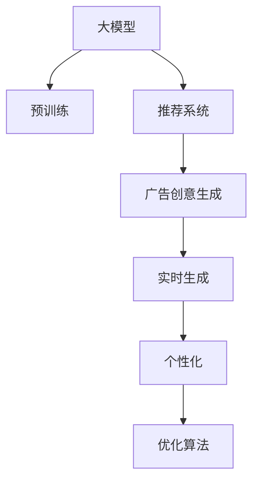

                 

# 基于大模型的推荐系统实时个性化广告创意生成

> 关键词：推荐系统,广告创意,大模型,实时个性化,自动生成,算法优化

## 1. 背景介绍

### 1.1 问题由来

推荐系统在现代互联网应用中扮演着至关重要的角色，如电商平台的商品推荐、视频网站的影片推荐等。在广告领域，个性化广告创意生成也成为越来越重要的研究方向。传统的手工设计广告创意不仅耗时耗力，且难以灵活应对不同用户的个性化需求。而基于大模型的推荐系统，则能快速生成与用户兴趣高度匹配的广告创意，提升广告点击率和转化率。

然而，广告创意生成并非一项简单的任务。一方面，广告创意需要有吸引力、有感染力，能够抓住用户的眼球。另一方面，广告创意还需个性化，满足不同用户群体的独特需求。要实现这一目标，传统的手工设计和静态特征生成的方法显然无法胜任，需要借助深度学习和大模型的力量，实现更加智能和灵活的广告创意生成。

### 1.2 问题核心关键点

大模型广告创意生成的关键在于如何利用深度学习和大模型的能力，自动生成个性化广告创意。主要包括以下几个方面：
1. **数据准备**：收集并预处理用户行为数据，构建用户画像。
2. **模型选择**：选择合适的预训练语言模型，如GPT、BERT等。
3. **生成过程**：利用大模型生成广告创意。
4. **评估指标**：设计合适的评估指标，如点击率、转化率等。
5. **优化策略**：优化生成过程，提升广告创意质量。

本文将详细探讨这些核心关键点，并给出基于大模型的推荐系统实时个性化广告创意生成的完整解决方案。

## 2. 核心概念与联系

### 2.1 核心概念概述

为更好地理解基于大模型的推荐系统实时个性化广告创意生成方法，本节将介绍几个密切相关的核心概念：

- **大模型**：以自回归(如GPT)或自编码(如BERT)模型为代表的大规模预训练语言模型。通过在大规模无标签文本语料上进行预训练，学习通用的语言表示，具备强大的语言理解和生成能力。

- **推荐系统**：通过分析用户行为和兴趣，为用户推荐符合其偏好的商品、内容或服务。根据推荐算法，推荐系统可以分为基于内容的推荐和协同过滤推荐两类。

- **广告创意生成**：结合用户画像和广告目标，生成具有吸引力和个性化特征的广告创意。广告创意通常包括标题、正文、图片等内容。

- **实时生成**：在用户请求或点击时，实时生成广告创意，提升用户体验和广告效果。

- **个性化**：根据用户行为和兴趣，自动生成符合用户偏好的广告创意，提升广告的转化率和点击率。

- **优化算法**：包括基于梯度的优化算法和强化学习等，用于不断优化广告创意生成过程。

这些核心概念之间的逻辑关系可以通过以下Mermaid流程图来展示：



这个流程图展示了大模型广告创意生成的核心概念及其之间的关系：

1. 大模型通过预训练获得基础能力。
2. 推荐系统利用大模型生成广告创意。
3. 广告创意生成需实时生成个性化内容。
4. 个性化广告创意需不断优化。

这些概念共同构成了大模型广告创意生成的学习框架，使其能够实现实时、高效、个性化的广告创意生成。通过理解这些核心概念，我们可以更好地把握广告创意生成的关键环节和优化方向。

## 3. 核心算法原理 & 具体操作步骤
### 3.1 算法原理概述

基于大模型的推荐系统实时个性化广告创意生成，本质上是一个结合推荐算法和大模型的联合学习过程。其核心思想是：将用户画像和广告目标输入大模型，生成与用户兴趣高度匹配的广告创意，同时通过优化算法不断提升广告创意的效果。

形式化地，假设用户画像为 $U$，广告目标为 $T$，生成的广告创意为 $C$。则广告创意生成的优化目标为：

$$
\min_{C|U,T} \mathcal{L}(C|U,T)
$$

其中 $\mathcal{L}(C|U,T)$ 为广告创意的质量损失函数，用于衡量广告创意与用户画像和广告目标的匹配程度。常见的质量损失函数包括交叉熵损失、KL散度损失等。

### 3.2 算法步骤详解

基于大模型的推荐系统实时个性化广告创意生成的过程一般包括以下几个关键步骤：

**Step 1: 用户画像构建**
- 收集用户的历史行为数据，如浏览记录、购买记录、搜索历史等。
- 通过预训练语言模型（如BERT）进行用户画像建模，提取用户的兴趣特征。

**Step 2: 广告目标定义**
- 根据广告主的需求，定义广告目标。例如，推广一款新的运动鞋，推广一家旅游目的地等。
- 提取广告目标的关键词和属性，构建广告创意生成的上下文。

**Step 3: 广告创意生成**
- 利用大模型（如GPT）根据用户画像和广告目标，生成广告创意。
- 对生成的广告创意进行解码，输出最终的广告创意内容。

**Step 4: 质量评估**
- 通过预设的评估指标（如点击率、转化率等），评估广告创意的效果。
- 使用优化算法（如AdamW、SGD等）调整生成参数，提升广告创意的质量。

**Step 5: 实时生成**
- 在用户请求或点击时，实时调用广告创意生成模型，生成个性化广告创意。
- 将生成的广告创意展示给用户，同时收集用户反馈数据，用于后续的优化。

### 3.3 算法优缺点

基于大模型的推荐系统实时个性化广告创意生成方法具有以下优点：
1. 高效生成：利用大模型的语言理解能力，能够快速生成与用户兴趣高度匹配的广告创意。
2. 灵活个性化：根据用户行为和兴趣，自动生成符合用户偏好的广告创意。
3. 实时优化：通过优化算法不断调整生成策略，提升广告创意的质量。
4. 多模态融合：支持文本、图像、视频等多种形式的数据，提升广告创意的丰富性和多样性。

同时，该方法也存在一定的局限性：
1. 数据依赖：广告创意生成的效果很大程度上取决于用户画像和广告目标的质量，对数据质量的要求较高。
2. 模型复杂：大模型的训练和优化过程复杂，需要大量的计算资源和时间。
3. 可解释性不足：生成的广告创意通常缺乏可解释性，难以理解其内部的生成逻辑。
4. 数据隐私：用户行为和兴趣数据的收集和处理涉及用户隐私保护问题，需要严格的法律和政策监管。

尽管存在这些局限性，但就目前而言，基于大模型的推荐系统实时个性化广告创意生成方法仍是大模型广告创意生成的主流范式。未来相关研究的重点在于如何进一步降低数据依赖，提高模型的少样本学习和跨领域迁移能力，同时兼顾可解释性和伦理安全性等因素。

### 3.4 算法应用领域

基于大模型的推荐系统实时个性化广告创意生成方法，已经在电商、广告、视频等多个领域得到了广泛的应用，展示了其强大的广告创意生成能力。

- 电商推荐：在电商平台上，利用用户行为数据和广告目标，实时生成个性化的广告创意，提升广告点击率和转化率。
- 视频广告：在视频网站或平台，根据用户浏览记录和兴趣，实时生成视频广告创意，增加广告效果。
- 搜索广告：在搜索引擎中，利用用户的搜索记录和广告目标，生成个性化的广告创意，提升广告点击率。
- 移动广告：在移动应用中，利用用户的点击记录和应用特征，生成个性化的广告创意，增加广告点击和转化。

除了这些经典应用外，大模型广告创意生成还被创新性地应用于社交媒体、新闻推荐等场景，为广告创意生成带来了新的突破。随着预训练模型和广告创意生成方法的不断进步，相信基于大模型的推荐系统将会在更广阔的应用领域发挥更大的作用。

## 4. 数学模型和公式 & 详细讲解
### 4.1 数学模型构建

本节将使用数学语言对基于大模型的推荐系统实时个性化广告创意生成过程进行更加严格的刻画。

假设用户画像为 $U = (u_1, u_2, \ldots, u_n)$，其中 $u_i$ 为用户第 $i$ 次的行为记录。广告目标为 $T = (t_1, t_2, \ldots, t_m)$，其中 $t_i$ 为广告目标的第 $i$ 个关键词。生成的广告创意为 $C = (c_1, c_2, \ldots, c_k)$，其中 $c_i$ 为广告创意的第 $i$ 个内容。

定义广告创意生成的质量损失函数为：

$$
\mathcal{L}(C|U,T) = \sum_{i=1}^k \log P(c_i|U,T)
$$

其中 $P(c_i|U,T)$ 为广告创意内容 $c_i$ 在给定用户画像 $U$ 和广告目标 $T$ 的条件下出现的概率。

### 4.2 公式推导过程

以下我们以二分类任务为例，推导广告创意生成的交叉熵损失函数及其梯度的计算公式。

假设广告创意内容 $c_i$ 是一个二分类标签，即 $c_i \in \{0,1\}$，表示广告创意是否与用户兴趣匹配。在给定用户画像 $U$ 和广告目标 $T$ 的情况下，广告创意生成的概率可以表示为：

$$
P(c_i|U,T) = \frac{e^{\log P(c_i|U,T)}}{\sum_{j=1}^k e^{\log P(c_j|U,T)}}
$$

其中 $P(c_i|U,T)$ 为广告创意内容 $c_i$ 的条件概率，即在给定用户画像 $U$ 和广告目标 $T$ 的情况下，广告创意内容 $c_i$ 出现的概率。

将上式代入质量损失函数，得：

$$
\mathcal{L}(C|U,T) = -\sum_{i=1}^k c_i \log P(c_i|U,T)
$$

为了求解 $C$ 的优化问题，需要计算质量损失函数对 $C$ 的梯度：

$$
\frac{\partial \mathcal{L}(C|U,T)}{\partial C} = -\frac{\partial}{\partial C} \left( \sum_{i=1}^k c_i \log P(c_i|U,T) \right)
$$

通过链式法则，可以计算出：

$$
\frac{\partial P(c_i|U,T)}{\partial C} = \frac{\partial \log P(c_i|U,T)}{\partial C}
$$

将上式代入梯度计算公式，并利用自动微分技术进行求解，得到：

$$
\frac{\partial \mathcal{L}(C|U,T)}{\partial C} = -\sum_{i=1}^k c_i \frac{\partial \log P(c_i|U,T)}{\partial C}
$$

上式即为广告创意生成的交叉熵损失函数及其梯度的计算公式。在得到梯度后，即可带入优化算法，完成广告创意的迭代优化。

## 5. 项目实践：代码实例和详细解释说明
### 5.1 开发环境搭建

在进行广告创意生成实践前，我们需要准备好开发环境。以下是使用Python进行PyTorch开发的环境配置流程：

1. 安装Anaconda：从官网下载并安装Anaconda，用于创建独立的Python环境。

2. 创建并激活虚拟环境：
```bash
conda create -n pytorch-env python=3.8 
conda activate pytorch-env
```

3. 安装PyTorch：根据CUDA版本，从官网获取对应的安装命令。例如：
```bash
conda install pytorch torchvision torchaudio cudatoolkit=11.1 -c pytorch -c conda-forge
```

4. 安装Transformers库：
```bash
pip install transformers
```

5. 安装各类工具包：
```bash
pip install numpy pandas scikit-learn matplotlib tqdm jupyter notebook ipython
```

完成上述步骤后，即可在`pytorch-env`环境中开始广告创意生成实践。

### 5.2 源代码详细实现

下面我们以二分类广告创意生成为例，给出使用Transformers库对GPT模型进行广告创意生成的PyTorch代码实现。

首先，定义广告创意生成任务的数据处理函数：

```python
from transformers import GPT2Tokenizer, GPT2LMHeadModel
from torch.utils.data import Dataset
import torch

class AdvertisementDataset(Dataset):
    def __init__(self, texts, labels, tokenizer, max_len=128):
        self.texts = texts
        self.labels = labels
        self.tokenizer = tokenizer
        self.max_len = max_len
        
    def __len__(self):
        return len(self.texts)
    
    def __getitem__(self, item):
        text = self.texts[item]
        label = self.labels[item]
        
        encoding = self.tokenizer(text, return_tensors='pt', max_length=self.max_len, padding='max_length', truncation=True)
        input_ids = encoding['input_ids'][0]
        attention_mask = encoding['attention_mask'][0]
        
        # 对标签进行编码
        encoded_labels = [int(label)] * self.max_len
        labels = torch.tensor(encoded_labels, dtype=torch.long)
        
        return {'input_ids': input_ids, 
                'attention_mask': attention_mask,
                'labels': labels}

# 创建dataset
tokenizer = GPT2Tokenizer.from_pretrained('gpt2')
train_dataset = AdvertisementDataset(train_texts, train_labels, tokenizer)
dev_dataset = AdvertisementDataset(dev_texts, dev_labels, tokenizer)
test_dataset = AdvertisementDataset(test_texts, test_labels, tokenizer)
```

然后，定义模型和优化器：

```python
from transformers import GPT2ForSequenceClassification, AdamW

model = GPT2ForSequenceClassification.from_pretrained('gpt2', num_labels=2)

optimizer = AdamW(model.parameters(), lr=2e-5)
```

接着，定义训练和评估函数：

```python
from torch.utils.data import DataLoader
from tqdm import tqdm
from sklearn.metrics import classification_report

device = torch.device('cuda') if torch.cuda.is_available() else torch.device('cpu')
model.to(device)

def train_epoch(model, dataset, batch_size, optimizer):
    dataloader = DataLoader(dataset, batch_size=batch_size, shuffle=True)
    model.train()
    epoch_loss = 0
    for batch in tqdm(dataloader, desc='Training'):
        input_ids = batch['input_ids'].to(device)
        attention_mask = batch['attention_mask'].to(device)
        labels = batch['labels'].to(device)
        model.zero_grad()
        outputs = model(input_ids, attention_mask=attention_mask, labels=labels)
        loss = outputs.loss
        epoch_loss += loss.item()
        loss.backward()
        optimizer.step()
    return epoch_loss / len(dataloader)

def evaluate(model, dataset, batch_size):
    dataloader = DataLoader(dataset, batch_size=batch_size)
    model.eval()
    preds, labels = [], []
    with torch.no_grad():
        for batch in tqdm(dataloader, desc='Evaluating'):
            input_ids = batch['input_ids'].to(device)
            attention_mask = batch['attention_mask'].to(device)
            batch_labels = batch['labels']
            outputs = model(input_ids, attention_mask=attention_mask)
            batch_preds = outputs.logits.argmax(dim=2).to('cpu').tolist()
            batch_labels = batch_labels.to('cpu').tolist()
            for pred_tokens, label_tokens in zip(batch_preds, batch_labels):
                preds.append(pred_tokens)
                labels.append(label_tokens)
                
    print(classification_report(labels, preds))
```

最后，启动训练流程并在测试集上评估：

```python
epochs = 5
batch_size = 16

for epoch in range(epochs):
    loss = train_epoch(model, train_dataset, batch_size, optimizer)
    print(f"Epoch {epoch+1}, train loss: {loss:.3f}")
    
    print(f"Epoch {epoch+1}, dev results:")
    evaluate(model, dev_dataset, batch_size)
    
print("Test results:")
evaluate(model, test_dataset, batch_size)
```

以上就是使用PyTorch对GPT模型进行二分类广告创意生成的完整代码实现。可以看到，得益于Transformers库的强大封装，我们可以用相对简洁的代码完成GPT模型的加载和广告创意生成。

### 5.3 代码解读与分析

让我们再详细解读一下关键代码的实现细节：

**AdvertisementDataset类**：
- `__init__`方法：初始化文本、标签、分词器等关键组件。
- `__len__`方法：返回数据集的样本数量。
- `__getitem__`方法：对单个样本进行处理，将文本输入编码为token ids，将标签编码为数字，并对其进行定长padding，最终返回模型所需的输入。

**tokenizer = GPT2Tokenizer.from_pretrained('gpt2')**：
- 使用预训练的GPT-2分词器，从HuggingFace模型库中加载，完成文本分词和编码。

**train_dataset = AdvertisementDataset(train_texts, train_labels, tokenizer)**：
- 创建训练集数据集，包含训练数据、标签和分词器。

**model = GPT2ForSequenceClassification.from_pretrained('gpt2', num_labels=2)**：
- 加载预训练的GPT-2模型，并进行二分类任务适配，修改输出层和损失函数。

**optimizer = AdamW(model.parameters(), lr=2e-5)**：
- 设置AdamW优化器，学习率为2e-5，用于更新模型参数。

**train_epoch函数**：
- 在训练集上迭代，前向传播计算损失，反向传播更新参数，并返回该epoch的平均损失。

**evaluate函数**：
- 在验证集和测试集上评估模型性能，计算分类指标。

**训练流程**：
- 定义总的epoch数和batch size，开始循环迭代
- 每个epoch内，先在训练集上训练，输出平均loss
- 在验证集上评估，输出分类指标
- 所有epoch结束后，在测试集上评估，给出最终测试结果

可以看到，PyTorch配合Transformers库使得广告创意生成的代码实现变得简洁高效。开发者可以将更多精力放在数据处理、模型改进等高层逻辑上，而不必过多关注底层的实现细节。

当然，工业级的系统实现还需考虑更多因素，如模型的保存和部署、超参数的自动搜索、更灵活的任务适配层等。但核心的广告创意生成范式基本与此类似。

## 6. 实际应用场景
### 6.1 智能推荐系统

基于大模型的广告创意生成技术，可以广泛应用于智能推荐系统中。传统推荐系统往往只考虑用户的历史行为数据，难以捕捉用户深层次的兴趣偏好。利用广告创意生成技术，推荐系统可以动态生成与用户兴趣高度匹配的广告创意，提升推荐的精准性和个性化程度。

在技术实现上，可以结合用户行为数据和广告创意生成模型，实时生成个性化广告创意，用于推荐系统中的推荐策略调整。例如，在电商推荐系统中，对于某用户浏览某商品，但最终没有购买，可以利用广告创意生成技术，动态生成该商品的相关广告创意，重新推荐给用户，提升点击率和转化率。

### 6.2 个性化广告投放

在广告投放中，广告创意的个性化程度直接影响广告效果。基于大模型的广告创意生成技术，可以提升广告创意的个性化程度，提高广告的点击率和转化率。

在实际应用中，可以结合用户画像和广告目标，利用广告创意生成模型，生成个性化的广告创意。例如，在推广一款运动鞋的广告中，可以分析用户的年龄、性别、兴趣爱好等信息，动态生成与用户兴趣匹配的广告创意，提升广告效果。

### 6.3 视频广告生成

视频广告是一种常见的广告形式，但其内容创意的生成需要大量的时间和人力成本。利用大模型的广告创意生成技术，可以大幅提升视频广告创意的生成效率。

在技术实现上，可以结合用户行为数据和广告目标，利用大模型生成视频广告创意。例如，在推广一家旅游目的地的视频广告中，可以分析用户的旅游兴趣和偏好，动态生成相关视频内容，提升广告效果。

### 6.4 未来应用展望

随着大模型广告创意生成技术的不断发展，其在广告领域的应用前景将更加广阔。

在智能推荐系统中，广告创意生成技术将进一步提升推荐的个性化程度，增强用户的互动体验。

在个性化广告投放中，广告创意的生成将更加精准，提升广告的点击率和转化率。

在视频广告生成中，视频内容的创意生成将更加智能，提升广告的视觉吸引力和用户体验。

除了这些经典应用外，大模型广告创意生成还被创新性地应用于社交媒体、新闻推荐等场景，为广告创意生成带来了新的突破。随着预训练模型和广告创意生成方法的不断进步，相信基于大模型的推荐系统将会在更广阔的应用领域发挥更大的作用。

## 7. 工具和资源推荐
### 7.1 学习资源推荐

为了帮助开发者系统掌握大模型广告创意生成的理论基础和实践技巧，这里推荐一些优质的学习资源：

1. 《深度学习与自然语言处理》系列博文：由大模型技术专家撰写，深入浅出地介绍了深度学习和大模型的基础知识。

2. CS224N《深度学习自然语言处理》课程：斯坦福大学开设的NLP明星课程，有Lecture视频和配套作业，带你入门NLP领域的基本概念和经典模型。

3. 《Natural Language Processing with Transformers》书籍：Transformers库的作者所著，全面介绍了如何使用Transformers库进行NLP任务开发，包括广告创意生成在内的诸多范式。

4. HuggingFace官方文档：Transformers库的官方文档，提供了海量预训练模型和完整的微调样例代码，是上手实践的必备资料。

5. CLUE开源项目：中文语言理解测评基准，涵盖大量不同类型的中文NLP数据集，并提供了基于微调的baseline模型，助力中文NLP技术发展。

通过对这些资源的学习实践，相信你一定能够快速掌握大模型广告创意生成的精髓，并用于解决实际的广告创意生成问题。

### 7.2 开发工具推荐

高效的开发离不开优秀的工具支持。以下是几款用于广告创意生成开发的常用工具：

1. PyTorch：基于Python的开源深度学习框架，灵活动态的计算图，适合快速迭代研究。大部分预训练语言模型都有PyTorch版本的实现。

2. TensorFlow：由Google主导开发的开源深度学习框架，生产部署方便，适合大规模工程应用。同样有丰富的预训练语言模型资源。

3. Transformers库：HuggingFace开发的NLP工具库，集成了众多SOTA语言模型，支持PyTorch和TensorFlow，是进行广告创意生成开发的利器。

4. Weights & Biases：模型训练的实验跟踪工具，可以记录和可视化模型训练过程中的各项指标，方便对比和调优。与主流深度学习框架无缝集成。

5. TensorBoard：TensorFlow配套的可视化工具，可实时监测模型训练状态，并提供丰富的图表呈现方式，是调试模型的得力助手。

6. Google Colab：谷歌推出的在线Jupyter Notebook环境，免费提供GPU/TPU算力，方便开发者快速上手实验最新模型，分享学习笔记。

合理利用这些工具，可以显著提升广告创意生成任务的开发效率，加快创新迭代的步伐。

### 7.3 相关论文推荐

大模型广告创意生成技术的发展源于学界的持续研究。以下是几篇奠基性的相关论文，推荐阅读：

1. Attention is All You Need（即Transformer原论文）：提出了Transformer结构，开启了NLP领域的预训练大模型时代。

2. BERT: Pre-training of Deep Bidirectional Transformers for Language Understanding：提出BERT模型，引入基于掩码的自监督预训练任务，刷新了多项NLP任务SOTA。

3. Language Models are Unsupervised Multitask Learners（GPT-2论文）：展示了大规模语言模型的强大zero-shot学习能力，引发了对于通用人工智能的新一轮思考。

4. Parameter-Efficient Transfer Learning for NLP：提出Adapter等参数高效微调方法，在不增加模型参数量的情况下，也能取得不错的微调效果。

5. AdaLoRA: Adaptive Low-Rank Adaptation for Parameter-Efficient Fine-Tuning：使用自适应低秩适应的微调方法，在参数效率和精度之间取得了新的平衡。

这些论文代表了大模型广告创意生成技术的发展脉络。通过学习这些前沿成果，可以帮助研究者把握学科前进方向，激发更多的创新灵感。

## 8. 总结：未来发展趋势与挑战
### 8.1 总结

本文对基于大模型的推荐系统实时个性化广告创意生成方法进行了全面系统的介绍。首先阐述了广告创意生成的背景和核心关键点，明确了广告创意生成的目标和过程。其次，从原理到实践，详细讲解了广告创意生成的数学模型和关键步骤，给出了广告创意生成的完整代码实现。同时，本文还探讨了广告创意生成在多个实际应用场景中的广泛应用，展示了其强大的广告创意生成能力。

通过本文的系统梳理，可以看到，基于大模型的推荐系统实时个性化广告创意生成方法，能够在大规模数据和复杂模型的支持下，快速生成符合用户兴趣的个性化广告创意，提升广告的点击率和转化率。未来，随着大模型广告创意生成技术的不断进步，相信基于大模型的推荐系统将会在更广阔的应用领域发挥更大的作用。

### 8.2 未来发展趋势

展望未来，大模型广告创意生成技术将呈现以下几个发展趋势：

1. 模型规模持续增大。随着算力成本的下降和数据规模的扩张，预训练语言模型的参数量还将持续增长。超大规模语言模型蕴含的丰富语言知识，有望支撑更加复杂多变的广告创意生成任务。

2. 生成过程更加智能。未来的广告创意生成将更加注重用户体验和广告效果，引入更多智能优化算法，提升广告创意的个性化程度和吸引力。

3. 实时生成更加灵活。在广告创意生成的过程中，将引入更多的动态调整策略，如实时情感分析、实时语义理解等，提升广告创意的针对性和实效性。

4. 多模态创意生成崛起。除了文本广告创意外，未来的广告创意生成还将支持图像、视频、音频等多模态数据，提升广告创意的丰富性和多样性。

5. 用户交互深度融合。未来的广告创意生成将更加注重用户交互，利用自然语言理解和生成技术，实现与用户的深度互动和个性化沟通。

6. 智能推荐系统协同优化。未来的广告创意生成将与智能推荐系统协同优化，提升广告投放的精准性和个性化程度。

以上趋势凸显了大模型广告创意生成技术的广阔前景。这些方向的探索发展，必将进一步提升广告创意生成的性能和应用范围，为广告行业带来变革性影响。

### 8.3 面临的挑战

尽管大模型广告创意生成技术已经取得了瞩目成就，但在迈向更加智能化、普适化应用的过程中，它仍面临着诸多挑战：

1. 数据依赖。广告创意生成的效果很大程度上取决于用户画像和广告目标的质量，对数据质量的要求较高。如何降低数据依赖，提升模型的跨领域迁移能力，还需要更多的研究投入。

2. 模型复杂。大模型的训练和优化过程复杂，需要大量的计算资源和时间。如何进一步降低模型复杂度，提升广告创意生成的效率，还需要更多的技术突破。

3. 可解释性不足。广告创意的生成通常缺乏可解释性，难以理解其内部的生成逻辑。如何提升广告创意生成的可解释性，让用户和广告主能够理解和信任广告创意，还需要更多的研究探索。

4. 数据隐私。用户行为和兴趣数据的收集和处理涉及用户隐私保护问题，需要严格的法律和政策监管。如何在保障用户隐私的同时，实现广告创意的生成，还需要更多的技术和管理手段。

5. 实时性要求高。在广告投放过程中，广告创意的生成需要实时响应，如何在保证广告创意质量的同时，提升广告创意生成的速度和效率，还需要更多的技术优化。

6. 内容审核难度大。广告创意的内容需要符合法律法规和平台规范，如何在自动化广告创意生成过程中，实现内容的审核和监管，还需要更多的技术手段和法律规范。

这些挑战凸显了大模型广告创意生成技术的复杂性和多样性。唯有在数据、模型、技术、管理等多个维度协同发力，才能真正实现广告创意生成的智能化和个性化，提升广告效果和用户体验。

### 8.4 研究展望

面对大模型广告创意生成所面临的种种挑战，未来的研究需要在以下几个方面寻求新的突破：

1. 探索无监督和半监督广告创意生成方法。摆脱对大规模标注数据的依赖，利用自监督学习、主动学习等无监督和半监督范式，最大限度利用非结构化数据，实现更加灵活高效的广告创意生成。

2. 研究参数高效和计算高效的广告创意生成方法。开发更加参数高效的广告创意生成方法，在固定大部分预训练参数的情况下，只更新极少量的任务相关参数。同时优化广告创意生成的计算图，减少前向传播和反向传播的资源消耗，实现更加轻量级、实时性的部署。

3. 融合因果和对比学习范式。通过引入因果推断和对比学习思想，增强广告创意生成建立稳定因果关系的能力，学习更加普适、鲁棒的语言表征，从而提升广告创意的泛化性和抗干扰能力。

4. 引入更多先验知识。将符号化的先验知识，如知识图谱、逻辑规则等，与神经网络模型进行巧妙融合，引导广告创意生成过程学习更准确、合理的语言模型。同时加强不同模态数据的整合，实现视觉、语音等多模态信息与文本信息的协同建模。

5. 结合因果分析和博弈论工具。将因果分析方法引入广告创意生成，识别出广告创意生成的关键特征，增强广告创意生成的因果性和逻辑性。借助博弈论工具刻画用户行为过程，主动探索并规避广告创意生成的脆弱点，提高系统稳定性。

6. 纳入伦理道德约束。在广告创意生成的目标中引入伦理导向的评估指标，过滤和惩罚有害的输出倾向。同时加强人工干预和审核，建立广告创意生成的监管机制，确保输出的安全性。

这些研究方向的探索，必将引领大模型广告创意生成技术迈向更高的台阶，为广告创意生成带来更加智能、个性化的解决方案，推动广告行业向更加智能化、普适化的方向发展。

## 9. 附录：常见问题与解答

**Q1：大模型广告创意生成的效果如何衡量？**

A: 广告创意生成的效果可以通过点击率（CTR）和转化率（CR）等指标进行衡量。点击率表示用户看到广告创意后点击的次数与展示次数的比率，转化率表示用户点击广告创意后完成购买或其他目标行为的比例。这些指标越高，说明广告创意生成的效果越好。

**Q2：如何优化广告创意生成模型的超参数？**

A: 优化广告创意生成模型的超参数可以通过网格搜索（Grid Search）、随机搜索（Random Search）、贝叶斯优化（Bayesian Optimization）等方法进行。这些方法可以帮助我们在有限的实验次数内找到最优的超参数组合。

**Q3：广告创意生成的过程中，如何处理模型过拟合？**

A: 广告创意生成的过程中，过拟合是一个常见问题。可以通过以下方法进行缓解：
1. 数据增强：通过回译、近义替换等方式扩充训练集，增加样本多样性。
2. 正则化：使用L2正则、Dropout等方法，防止模型过度适应训练集。
3. 早停策略：在验证集上监控模型性能，一旦性能停止提升，即停止训练。
4. 对抗训练：引入对抗样本，提高模型的鲁棒性和泛化能力。

**Q4：广告创意生成过程中，如何提升广告创意的吸引力？**

A: 提升广告创意的吸引力可以从以下几个方面入手：
1. 引入情感分析：对广告创意进行情感分析，选择能够引起用户共鸣的情感词汇。
2. 使用推荐系统：利用用户画像和兴趣，推荐符合用户偏好的广告创意。
3. 引入用户反馈：对用户点击和反馈数据进行分析，调整广告创意生成策略。
4. 引入广告主优化：通过A/B测试等方法，比较不同广告创意的效果，优化广告创意生成模型。

**Q5：广告创意生成的过程中，如何保证广告创意的合法合规？**

A: 保证广告创意的合法合规，可以从以下几个方面入手：
1. 引入内容审核机制：对广告创意进行内容审核，过滤和屏蔽违法违规内容。
2. 引入政策法规：遵循相关法律法规和平台规则，确保广告创意的合规性。
3. 引入伦理审核：对广告创意进行伦理审核，避免有害的输出倾向。
4. 引入用户投诉机制：建立用户投诉渠道，及时处理用户反馈。

---

作者：禅与计算机程序设计艺术 / Zen and the Art of Computer Programming

