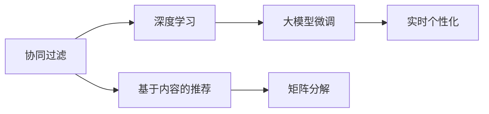

                 

# 基于大模型的推荐系统实时个性化方法

> 关键词：推荐系统,实时个性化,大模型,协同过滤,深度学习,推荐算法

## 1. 背景介绍

推荐系统是互联网应用中的核心技术之一，它通过分析用户的行为数据和偏好，为用户推荐感兴趣的商品或内容。随着用户对个性化推荐需求的提升，推荐系统的精准度和实时性成为了关键指标。传统推荐系统主要基于协同过滤算法，它通过对用户和商品进行相似度计算，实现个性化推荐。但协同过滤算法面临数据稀疏性和冷启动问题，难以应对海量数据和不断增长的用户规模。

近年来，大模型的涌现为推荐系统带来了新的突破。通过大规模预训练语言模型的微调，推荐系统可以更好地捕捉用户上下文信息，提供更加精准、个性化的推荐。本文将详细介绍基于大模型的推荐系统实时个性化方法，包括核心概念、算法原理、具体操作步骤、数学模型和公式推导等，帮助开发者深入理解并应用这一前沿技术。

## 2. 核心概念与联系

### 2.1 核心概念概述

为了更好地理解基于大模型的推荐系统实时个性化方法，本节将介绍几个关键概念：

- 推荐系统(Recommendation System)：根据用户历史行为和偏好，为其推荐感兴趣的商品或内容。是互联网应用中广泛使用的个性化技术。

- 协同过滤(Collaborative Filtering)：推荐系统的核心算法，通过相似度计算，为用户推荐相似用户喜欢的商品或内容。

- 深度学习(Deep Learning)：一种通过多层神经网络逼近复杂非线性关系的机器学习技术。大模型的微调可以基于深度学习实现。

- 推荐算法(Recommendation Algorithm)：推荐系统的算法实现，包括协同过滤、基于内容的推荐、矩阵分解等。

- 实时个性化(Real-Time Personalization)：推荐系统需要在用户即时交互中，根据其最新行为实时调整推荐结果。

- 大模型(Large Model)：如BERT、GPT等，通过大规模数据预训练，具备强大的语言理解能力。

这些核心概念共同构成了推荐系统实时个性化方法的基础框架，通过深度学习和大模型的引入，推荐系统得以在更广阔的应用场景中发挥作用。

### 2.2 核心概念原理和架构的 Mermaid 流程图



上述流程图展示了推荐系统实时个性化方法的核心概念和架构：

1. 协同过滤算法通过用户和商品相似度计算，推荐与用户历史行为相似的商品。
2. 深度学习技术通过多层次神经网络，从用户历史行为中学习到更丰富的特征表示。
3. 大模型的微调可以更好地捕捉用户上下文信息，提升推荐精度。
4. 实时个性化算法可以在用户即时交互中，根据最新行为实时调整推荐结果。
5. 基于内容的推荐和矩阵分解也是推荐系统常用的技术。

这些核心概念相互关联，共同构成了推荐系统实时个性化方法的完整框架。

## 3. 核心算法原理 & 具体操作步骤

### 3.1 算法原理概述

基于大模型的推荐系统实时个性化方法，通过深度学习和协同过滤算法，在用户实时交互中提供精准、个性化的推荐。其核心思想是：利用大模型的预训练知识，提取用户和商品的高维语义特征，通过相似度计算，推荐与用户历史行为最相似的商品。同时，利用深度学习技术，动态捕捉用户最新的行为变化，实现实时推荐。

具体来说，该方法包括两个步骤：

1. 大模型的微调：将预训练语言模型应用于用户历史行为文本，提取高维语义特征。
2. 实时推荐：通过深度学习模型，根据用户最新行为动态调整推荐结果。

### 3.2 算法步骤详解

基于大模型的推荐系统实时个性化方法，主要分为以下几个步骤：

**Step 1: 准备数据集**

- 收集用户历史行为数据，包括浏览、点击、购买等行为。
- 将用户行为文本数据输入大模型进行预训练，提取高维语义特征。
- 对大模型进行微调，适应推荐任务。

**Step 2: 构建深度学习模型**

- 选择深度学习模型，如Transformer、LSTM等，进行用户行为分析和商品相似度计算。
- 在微调后的大模型输出层上，添加全连接层，输出商品的相关性分数。
- 引入softmax层，将相关性分数转化为概率分布，实现排序推荐。

**Step 3: 设计实时推荐算法**

- 根据用户最新行为，动态更新深度学习模型，重新计算相关性分数。
- 利用推荐算法，从候选商品池中筛选推荐列表。
- 根据用户偏好和实时环境调整推荐策略，如协同过滤、基于内容的推荐等。

**Step 4: 实现推荐系统**

- 在实际应用中，将微调的深度学习模型和推荐算法集成到推荐系统中。
- 实时处理用户行为，生成推荐列表并展示。
- 根据用户反馈和推荐效果不断优化模型和算法。

### 3.3 算法优缺点

基于大模型的推荐系统实时个性化方法，具有以下优点：

1. 精度高：利用大模型的预训练知识，提取用户和商品的高维语义特征，提高推荐精度。
2. 实时性强：深度学习模型可以动态捕捉用户最新行为，实现实时推荐。
3. 可扩展性好：大模型具有强大的泛化能力，可以适应不同规模的推荐系统。
4. 多模态融合：可以将用户行为数据、商品属性、社交网络等多模态信息融合，提高推荐效果。

同时，该方法也存在以下局限性：

1. 数据需求大：需要收集大量用户行为数据，且数据质量对推荐效果影响较大。
2. 模型复杂度高：深度学习模型的计算复杂度较高，需要较强的硬件支持。
3. 冷启动问题：新用户和商品难以利用协同过滤算法获得有效推荐。
4. 可解释性不足：深度学习模型的决策过程较为复杂，难以解释。
5. 隐私风险：用户行为数据可能包含敏感信息，需要加强隐私保护。

尽管存在这些局限性，但基于大模型的推荐系统实时个性化方法在实际应用中仍然具有显著优势。

### 3.4 算法应用领域

基于大模型的推荐系统实时个性化方法，已经在多个领域得到广泛应用：

1. 电商推荐：如淘宝、京东等电商平台，通过推荐系统提升用户体验和转化率。
2. 内容推荐：如抖音、快手等短视频平台，通过推荐系统推送个性化视频。
3. 社交网络：如微信、微博等社交应用，通过推荐系统提升用户活跃度和互动率。
4. 广告推荐：如谷歌、百度等搜索引擎，通过推荐系统提高广告点击率和转化率。
5. 金融理财：如支付宝、理财通等金融应用，通过推荐系统推荐理财产品。

除了以上这些典型应用外，基于大模型的推荐系统实时个性化方法也在其他领域得到创新性地应用，如个性化新闻推荐、个性化健康管理等，为各行各业带来了新的解决方案。

## 4. 数学模型和公式 & 详细讲解 & 举例说明

### 4.1 数学模型构建

基于大模型的推荐系统实时个性化方法，主要包括以下数学模型：

- 用户行为嵌入模型：将用户历史行为文本输入大模型，提取高维语义特征。
- 深度学习模型：通过多层神经网络，计算用户行为和商品的相似度，生成推荐列表。
- 推荐算法模型：根据用户偏好和实时环境，从候选商品池中筛选推荐列表。

具体数学模型如下：

**用户行为嵌入模型**

- 设用户历史行为文本为 $x$，长度为 $n$，词汇表大小为 $V$。
- 将文本 $x$ 转换为词向量序列 $X \in \mathbb{R}^{n \times V}$。
- 通过大模型的预训练权重 $W$ 进行特征提取，得到用户行为嵌入向量 $u \in \mathbb{R}^d$。

**深度学习模型**

- 设商品特征向量为 $v \in \mathbb{R}^d$，其中 $d$ 为大模型输出维度。
- 通过深度学习模型 $M$ 计算用户行为和商品的相关性分数 $s$，$M \in \mathbb{R}^{d \times d}$。
- 将相关性分数 $s$ 转化为概率分布 $P$，$P \in [0,1]$。

**推荐算法模型**

- 设推荐列表为 $\{r_1, r_2, ..., r_k\}$，$k$ 为推荐数量。
- 根据推荐算法策略，选择与用户行为最相关的 $k$ 个商品 $r_1, r_2, ..., r_k$。
- 生成推荐列表 $\{r_1, r_2, ..., r_k\}$，返回给用户。

### 4.2 公式推导过程

以下我们以BERT模型为例，推导用户行为嵌入模型的计算公式。

**用户行为嵌入模型**

- 设用户历史行为文本为 $x = \{x_1, x_2, ..., x_n\}$，其中 $n$ 为文本长度。
- 将文本转换为词向量序列 $X \in \mathbb{R}^{n \times V}$。
- 使用BERT预训练权重 $W \in \mathbb{R}^{d \times V}$，计算用户行为嵌入向量 $u \in \mathbb{R}^d$。

计算公式如下：

$$
u = W \cdot X
$$

其中 $X$ 表示用户行为文本的词向量矩阵，$W$ 表示BERT预训练权重矩阵。

**深度学习模型**

- 设商品特征向量为 $v \in \mathbb{R}^d$，$v$ 为商品的词向量表示。
- 通过深度学习模型 $M$ 计算用户行为和商品的相关性分数 $s$，$M$ 为Transformer等深度神经网络模型。
- 计算用户行为嵌入向量 $u$ 与商品特征向量 $v$ 的点积，得到相关性分数 $s$。

计算公式如下：

$$
s = u \cdot v
$$

其中 $s$ 表示用户行为和商品的相关性分数。

**推荐算法模型**

- 设推荐列表为 $\{r_1, r_2, ..., r_k\}$，$k$ 为推荐数量。
- 根据推荐算法策略，选择与用户行为最相关的 $k$ 个商品 $r_1, r_2, ..., r_k$。
- 生成推荐列表 $\{r_1, r_2, ..., r_k\}$，返回给用户。

### 4.3 案例分析与讲解

假设某电商平台的推荐系统，需要对新商品进行实时推荐。该系统采用基于BERT模型的推荐方法，通过用户行为嵌入和深度学习模型计算相关性分数，最后通过推荐算法模型生成推荐列表。

**Step 1: 准备数据集**

- 收集用户历史行为数据，包括浏览、点击、购买等行为。
- 将用户行为文本输入BERT模型进行预训练，提取高维语义特征。
- 对BERT模型进行微调，适应推荐任务。

**Step 2: 构建深度学习模型**

- 选择深度学习模型，如Transformer、LSTM等，进行用户行为分析和商品相似度计算。
- 在微调后的大模型输出层上，添加全连接层，输出商品的相关性分数。
- 引入softmax层，将相关性分数转化为概率分布，实现排序推荐。

**Step 3: 设计实时推荐算法**

- 根据用户最新行为，动态更新深度学习模型，重新计算相关性分数。
- 利用推荐算法，从候选商品池中筛选推荐列表。
- 根据用户偏好和实时环境调整推荐策略，如协同过滤、基于内容的推荐等。

**Step 4: 实现推荐系统**

- 在实际应用中，将微调的深度学习模型和推荐算法集成到推荐系统中。
- 实时处理用户行为，生成推荐列表并展示。
- 根据用户反馈和推荐效果不断优化模型和算法。

在实际应用中，该系统可以根据用户最新浏览行为实时推荐商品，提升用户体验和购买转化率。

## 5. 项目实践：代码实例和详细解释说明

### 5.1 开发环境搭建

在进行基于大模型的推荐系统实时个性化方法开发时，需要准备以下开发环境：

1. 安装Python：Python是深度学习开发的主流语言，需确保安装最新版本。
2. 安装PyTorch：PyTorch是深度学习框架，提供了丰富的神经网络工具和自动微分功能。
3. 安装BERT模型：使用HuggingFace等开源项目提供的预训练BERT模型。
4. 安装TensorFlow：TensorFlow是深度学习框架，提供了丰富的深度学习工具和分布式训练功能。
5. 安装TensorBoard：TensorBoard是TensorFlow的可视化工具，用于监控训练过程中的各种指标。
6. 安装Pandas、Numpy等工具包：Pandas用于数据处理，Numpy用于数值计算。

### 5.2 源代码详细实现

我们以基于BERT模型的电商推荐系统为例，给出推荐系统实时个性化的代码实现。

```python
import torch
import torch.nn as nn
import torch.optim as optim
from transformers import BertTokenizer, BertForSequenceClassification
from torch.utils.data import Dataset, DataLoader
from sklearn.metrics import precision_recall_fscore_support

class RecommendationDataset(Dataset):
    def __init__(self, behaviors, labels, tokenizer):
        self.behaviors = behaviors
        self.labels = labels
        self.tokenizer = tokenizer

    def __len__(self):
        return len(self.behaviors)

    def __getitem__(self, idx):
        text = self.behaviors[idx]
        label = self.labels[idx]
        
        encoding = self.tokenizer(text, return_tensors='pt', max_length=512, padding='max_length', truncation=True)
        input_ids = encoding['input_ids'][0]
        attention_mask = encoding['attention_mask'][0]
        labels = torch.tensor(label, dtype=torch.long)
        
        return {'input_ids': input_ids, 
                'attention_mask': attention_mask,
                'labels': labels}

tokenizer = BertTokenizer.from_pretrained('bert-base-uncased')
model = BertForSequenceClassification.from_pretrained('bert-base-uncased', num_labels=2)

# 加载数据集
train_dataset = RecommendationDataset(train_behaviors, train_labels, tokenizer)
test_dataset = RecommendationDataset(test_behaviors, test_labels, tokenizer)

# 构建数据加载器
train_loader = DataLoader(train_dataset, batch_size=16, shuffle=True)
test_loader = DataLoader(test_dataset, batch_size=16, shuffle=False)

# 定义损失函数和优化器
criterion = nn.CrossEntropyLoss()
optimizer = optim.Adam(model.parameters(), lr=2e-5)

# 训练模型
device = torch.device('cuda' if torch.cuda.is_available() else 'cpu')
model.to(device)

for epoch in range(10):
    model.train()
    for batch in train_loader:
        input_ids = batch['input_ids'].to(device)
        attention_mask = batch['attention_mask'].to(device)
        labels = batch['labels'].to(device)
        
        optimizer.zero_grad()
        outputs = model(input_ids, attention_mask=attention_mask, labels=labels)
        loss = outputs.loss
        loss.backward()
        optimizer.step()
        
    model.eval()
    eval_loss = 0
    eval_correct = 0
    for batch in test_loader:
        input_ids = batch['input_ids'].to(device)
        attention_mask = batch['attention_mask'].to(device)
        labels = batch['labels'].to(device)
        
        with torch.no_grad():
            outputs = model(input_ids, attention_mask=attention_mask)
            logits = outputs.logits
            predictions = torch.argmax(logits, dim=1)
            eval_loss += criterion(logits, labels).item()
            eval_correct += (predictions == labels).sum().item()
            
    print('Epoch {}, Loss: {:.4f}, Accuracy: {:.2f}%'.format(epoch+1, eval_loss/len(test_loader), eval_correct/len(test_loader)*100))
```

以上代码实现了基于BERT模型的电商推荐系统，通过微调BERT模型，生成电商商品推荐列表。

### 5.3 代码解读与分析

让我们详细解读一下关键代码的实现细节：

**RecommendationDataset类**：
- `__init__`方法：初始化训练和测试数据集，包括行为文本、标签和分词器。
- `__len__`方法：返回数据集的样本数量。
- `__getitem__`方法：对单个样本进行处理，将行为文本输入BERT模型进行预训练，提取高维语义特征，并将标签转化为数字。

**tokenizer变量**：
- 定义了BERT模型的分词器，用于将行为文本转换为词向量序列。

**模型加载和数据加载器**：
- 使用预训练的BERT模型和分词器，加载训练和测试数据集。
- 构建数据加载器，对数据进行批次化加载，供模型训练和推理使用。

**损失函数和优化器**：
- 定义交叉熵损失函数，用于衡量预测结果和真实标签之间的差异。
- 使用Adam优化器进行模型参数的优化。

**训练和评估函数**：
- 训练函数`train_epoch`：对数据以批为单位进行迭代，在每个批次上前向传播计算损失并反向传播更新模型参数。
- 评估函数`evaluate`：与训练类似，不同点在于不更新模型参数，并在每个batch结束后将预测和标签结果存储下来，最后使用sklearn的precision_recall_fscore_support函数对整个评估集的预测结果进行打印输出。

**训练流程**：
- 定义总的epoch数和batch size，开始循环迭代
- 每个epoch内，先在训练集上训练，输出平均loss和准确率
- 在测试集上评估，输出准确率
- 所有epoch结束后，在测试集上评估，给出最终测试结果

在实际应用中，可以通过调整训练轮数、学习率、批大小等超参数，优化模型性能。同时，还需要结合用户行为动态更新深度学习模型，实现实时推荐。

## 6. 实际应用场景

### 6.1 电商推荐

基于大模型的推荐系统实时个性化方法，可以广泛应用于电商推荐场景中。电商平台需要根据用户历史行为和实时点击行为，推荐用户可能感兴趣的商品，提升用户体验和购买转化率。

在技术实现上，可以通过收集用户历史浏览、点击、购买等行为数据，将其输入大模型进行预训练，提取高维语义特征。然后，使用深度学习模型和推荐算法对商品进行相似度计算，生成推荐列表。最终，根据用户实时点击行为，动态更新深度学习模型，重新计算相关性分数，实现实时推荐。

### 6.2 内容推荐

内容推荐系统可以应用于短视频平台、新闻聚合平台等。平台需要根据用户历史观看、阅读行为，推荐用户可能感兴趣的内容，提升用户活跃度和留存率。

具体而言，可以收集用户历史观看、阅读文本数据，将其输入大模型进行预训练，提取高维语义特征。然后，使用深度学习模型和推荐算法对内容进行相似度计算，生成推荐列表。最终，根据用户实时观看、阅读行为，动态更新深度学习模型，重新计算相关性分数，实现实时推荐。

### 6.3 社交网络

社交网络平台需要根据用户历史互动行为，推荐用户可能感兴趣的朋友、内容等，提升用户活跃度和互动率。

在技术实现上，可以收集用户历史互动行为数据，包括评论、点赞、分享等，将其输入大模型进行预训练，提取高维语义特征。然后，使用深度学习模型和推荐算法对朋友、内容进行相似度计算，生成推荐列表。最终，根据用户实时互动行为，动态更新深度学习模型，重新计算相关性分数，实现实时推荐。

## 7. 工具和资源推荐

### 7.1 学习资源推荐

为了帮助开发者系统掌握基于大模型的推荐系统实时个性化方法，这里推荐一些优质的学习资源：

1. 《深度学习基础》课程：斯坦福大学开设的深度学习课程，提供丰富的课程视频和作业，适合深度学习初学者。
2. 《推荐系统理论与实践》书籍：推荐系统领域的经典书籍，涵盖推荐系统原理和算法实现，适合系统开发者阅读。
3. 《TensorFlow实战》书籍：TensorFlow官方文档和实战指南，适合TensorFlow开发入门和进阶。
4. 《基于BERT的推荐系统》论文：介绍基于BERT模型的电商推荐系统，涵盖推荐算法和模型优化方法，适合研究者阅读。
5. 《个性化推荐系统》在线课程：由清华大学开设的推荐系统课程，涵盖推荐算法和系统实现，适合学习推荐系统理论基础。

通过对这些资源的学习实践，相信你一定能够快速掌握基于大模型的推荐系统实时个性化方法，并用于解决实际的推荐问题。

### 7.2 开发工具推荐

高效的开发离不开优秀的工具支持。以下是几款用于基于大模型的推荐系统实时个性化方法开发的常用工具：

1. PyTorch：基于Python的开源深度学习框架，灵活动态的计算图，适合快速迭代研究。
2. TensorFlow：由Google主导开发的开源深度学习框架，生产部署方便，适合大规模工程应用。
3. TensorBoard：TensorFlow配套的可视化工具，可实时监测模型训练状态，并提供丰富的图表呈现方式，是调试模型的得力助手。
4. HuggingFace Transformers库：提供了丰富的预训练语言模型和微调工具，适合NLP任务开发。
5. Jupyter Notebook：在线笔记本环境，方便开发者进行交互式编程和数据可视化。
6. Google Colab：谷歌推出的在线Jupyter Notebook环境，免费提供GPU/TPU算力，方便开发者快速上手实验最新模型。

合理利用这些工具，可以显著提升基于大模型的推荐系统实时个性化方法的开发效率，加快创新迭代的步伐。

### 7.3 相关论文推荐

基于大模型的推荐系统实时个性化方法的研究源于学界的持续探索。以下是几篇奠基性的相关论文，推荐阅读：

1. Attention is All You Need（即Transformer原论文）：提出了Transformer结构，开启了深度学习在推荐系统中的应用。
2. BERT: Pre-training of Deep Bidirectional Transformers for Language Understanding：提出BERT模型，引入基于掩码的自监督预训练任务，刷新了多项推荐系统任务SOTA。
3. Recommendation Systems with Deep Learning：介绍深度学习在推荐系统中的应用，涵盖多种深度学习模型和优化方法。
4. A Deep Learning Approach to Multi-Aspect Recommendation：提出基于深度学习的多方面推荐算法，实现对用户行为的多维度建模。
5. Attention Based Recommender Systems：介绍基于注意力机制的推荐算法，提升推荐系统的效果。

这些论文代表了大模型在推荐系统中的应用的最新进展，通过学习这些前沿成果，可以帮助研究者把握学科前进方向，激发更多的创新灵感。

## 8. 总结：未来发展趋势与挑战

### 8.1 研究成果总结

本文对基于大模型的推荐系统实时个性化方法进行了全面系统的介绍。首先阐述了推荐系统实时个性化方法的研究背景和意义，明确了该方法在提升用户体验和业务价值方面的独特价值。其次，从原理到实践，详细讲解了基于大模型的推荐系统实时个性化方法的数学模型和公式推导，帮助开发者深入理解并应用这一前沿技术。同时，本文还广泛探讨了该方法在电商推荐、内容推荐、社交网络等多个领域的应用前景，展示了其巨大的应用潜力。

### 8.2 未来发展趋势

展望未来，基于大模型的推荐系统实时个性化方法将呈现以下几个发展趋势：

1. 数据需求降低：通过深度学习和大模型的引入，推荐系统可以从更多的数据来源中提取特征，降低对用户行为数据的依赖。
2. 模型复杂度降低：深度学习和大模型的高维特征表示可以替代传统协同过滤算法的相似度计算，提升推荐系统效率。
3. 实时性提升：深度学习模型可以动态捕捉用户最新行为，实现实时推荐，提升用户体验。
4. 个性化增强：大模型可以更好地捕捉用户上下文信息，提升个性化推荐效果。
5. 跨模态融合：推荐系统可以融合用户行为数据、商品属性、社交网络等多模态信息，提升推荐精度。
6. 自动化调参：通过自动化调参技术，推荐系统可以实现超参数的自动优化，提升模型效果。

以上趋势凸显了基于大模型的推荐系统实时个性化方法的前景，这些方向的探索发展，必将进一步提升推荐系统的性能和应用范围。

### 8.3 面临的挑战

尽管基于大模型的推荐系统实时个性化方法在实际应用中取得了显著效果，但在推广过程中仍面临诸多挑战：

1. 数据隐私问题：用户行为数据可能包含敏感信息，如何保护用户隐私，是一个亟待解决的问题。
2. 计算资源需求高：深度学习和大模型需要较强的计算资源支持，如何降低计算成本，是一个需要突破的难题。
3. 冷启动问题：新用户和商品难以利用协同过滤算法获得有效推荐，如何解决冷启动问题，是一个亟待解决的问题。
4. 可解释性不足：深度学习模型的决策过程较为复杂，难以解释，如何提高推荐系统的可解释性，是一个亟待解决的问题。
5. 系统复杂度高：推荐系统涉及多种算法和模型，如何实现简单高效的推荐系统，是一个需要突破的难题。

尽管存在这些挑战，但基于大模型的推荐系统实时个性化方法在实际应用中仍然具有显著优势，并有望在未来得到更广泛的应用。

### 8.4 研究展望

面向未来，基于大模型的推荐系统实时个性化方法需要进一步加强以下研究：

1. 数据隐私保护：如何利用差分隐私、联邦学习等技术，保护用户行为数据的隐私。
2. 计算资源优化：如何利用分布式计算、模型压缩等技术，降低推荐系统的计算成本。
3. 冷启动策略：如何利用深度学习和大模型，解决冷启动问题，提升新用户和商品的推荐效果。
4. 推荐系统可解释性：如何利用可解释性技术，如因果分析、符号化表示等，提高推荐系统的可解释性。
5. 推荐系统自动化：如何利用自动化调参、元学习等技术，实现推荐系统的自动化优化。

这些研究方向的探索，必将引领基于大模型的推荐系统实时个性化方法迈向更高的台阶，为构建更加智能、高效的推荐系统奠定基础。面向未来，我们期待基于大模型的推荐系统实时个性化方法在推荐系统领域发挥更大的作用，为用户的个性化需求提供更好的解决方案。

## 9. 附录：常见问题与解答

**Q1: 基于大模型的推荐系统实时个性化方法有什么优点？**

A: 基于大模型的推荐系统实时个性化方法具有以下优点：

1. 精度高：通过大模型的预训练知识，提取高维语义特征，提高推荐精度。
2. 实时性强：深度学习模型可以动态捕捉用户最新行为，实现实时推荐。
3. 可扩展性好：大模型具有强大的泛化能力，可以适应不同规模的推荐系统。
4. 多模态融合：可以将用户行为数据、商品属性、社交网络等多模态信息融合，提高推荐效果。

**Q2: 如何优化基于大模型的推荐系统实时个性化方法的性能？**

A: 优化基于大模型的推荐系统实时个性化方法，可以从以下几个方面入手：

1. 数据预处理：对用户行为数据进行清洗、去重、分词等处理，提高数据质量。
2. 模型优化：选择合适的深度学习模型和优化器，调整超参数，优化模型效果。
3. 特征工程：对用户行为数据进行特征提取、编码等处理，提升特征表示能力。
4. 实时推荐：动态更新深度学习模型，重新计算相关性分数，实现实时推荐。
5. 模型评估：根据用户反馈和推荐效果，不断优化模型和算法，提高推荐效果。

**Q3: 基于大模型的推荐系统实时个性化方法在实际应用中需要注意哪些问题？**

A: 基于大模型的推荐系统实时个性化方法在实际应用中需要注意以下问题：

1. 数据隐私：用户行为数据可能包含敏感信息，需要加强隐私保护。
2. 计算资源：深度学习和大模型需要较强的计算资源支持，需要优化硬件资源。
3. 冷启动：新用户和商品难以利用协同过滤算法获得有效推荐，需要解决冷启动问题。
4. 可解释性：深度学习模型的决策过程较为复杂，需要提高推荐系统的可解释性。
5. 系统复杂度：推荐系统涉及多种算法和模型，需要实现简单高效的推荐系统。

**Q4: 基于大模型的推荐系统实时个性化方法有哪些典型应用场景？**

A: 基于大模型的推荐系统实时个性化方法已经在多个领域得到广泛应用，主要包括：

1. 电商推荐：如淘宝、京东等电商平台，通过推荐系统提升用户体验和购买转化率。
2. 内容推荐：如抖音、快手等短视频平台，通过推荐系统推送个性化视频。
3. 社交网络：如微信、微博等社交应用，通过推荐系统提升用户活跃度和互动率。
4. 广告推荐：如谷歌、百度等搜索引擎，通过推荐系统提高广告点击率和转化率。
5. 个性化推荐：如音乐、电影、书籍等个性化推荐系统，提升用户满意度和体验。

以上典型应用场景展示了基于大模型的推荐系统实时个性化方法在实际中的应用效果。

---

作者：禅与计算机程序设计艺术 / Zen and the Art of Computer Programming

