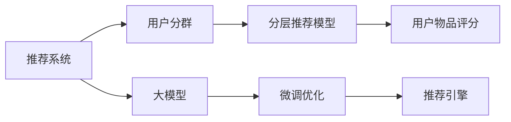

                 

# 基于大模型的推荐系统用户分群优化

## 1. 背景介绍

推荐系统在电商、视频、音乐、新闻等众多领域中发挥着关键作用。传统的推荐系统主要依赖协同过滤、矩阵分解等方法，但这些方法在处理长尾用户、高维数据时往往难以奏效。随着大模型的兴起，基于深度学习的方法在推荐系统中得到了广泛应用。但大模型的计算和存储成本较高，实际应用中需要优化资源消耗，提升效率。用户分群是一种有效降低模型复杂度的手段，可以通过更细粒度的用户分组来简化模型训练和推理。

本文聚焦于基于大模型的推荐系统用户分群优化，将介绍分群的原理、方法和效果，并给出代码实例和详细解释。

## 2. 核心概念与联系

### 2.1 核心概念概述

推荐系统（Recommendation System）是一种基于用户历史行为和物品特征，预测用户可能感兴趣物品的智能系统。基于大模型的推荐系统（Model-based Recommendation System）主要利用深度神经网络模型，通过大量用户行为数据进行训练，学习用户-物品之间的映射关系，以预测用户对物品的评分或点击概率。

用户分群（User Segmentation）是指将用户按某些特征进行分组，同一组内用户的兴趣和行为具有相似性，可视为一个用户子集。通过用户分群，可以降低模型的复杂度，提高推荐效果。常见的分群方式包括基于协同过滤的K-means聚类、基于图模型的谱聚类、基于深度学习的变分自编码器等。

### 2.2 核心概念原理和架构的 Mermaid 流程图



该流程图展示了推荐系统的主要流程：

1. 基于用户行为数据，进行用户分群，得到多个用户子集。
2. 针对每个用户子集，构建相应的推荐模型。
3. 利用分层的推荐模型，计算用户对物品的评分。
4. 基于评分进行推荐，生成个性化推荐结果。

## 3. 核心算法原理 & 具体操作步骤

### 3.1 算法原理概述

用户分群优化的核心思想是：通过将用户按兴趣和行为特征分组，使用不同的小模型进行推荐，实现资源共享和效率提升。对于大模型，可以通过微调等技术，将不同用户子集的模型参数进行优化，达到更好的推荐效果。

假设推荐系统需要处理 $N$ 个用户和 $M$ 个物品，用户-物品评分矩阵为 $\mathbf{X} \in \mathbb{R}^{N \times M}$。设用户分组数为 $K$，每个用户子集的大小为 $n_k$。对每个用户子集 $C_k$，构建局部推荐模型 $M_k$，得到评分矩阵 $\mathbf{Y}_k \in \mathbb{R}^{n_k \times M}$。

将每个局部推荐模型的参数 $\theta_k$ 作为全局推荐模型 $M$ 的一部分，即 $\theta_k \in \theta$，其中 $\theta$ 为全局推荐模型的参数。全局推荐模型可以是大模型如BERT、GPT等，也可以是经过微调的小模型。

推荐系统的优化目标为：

$$
\min_{\theta} \sum_{k=1}^K \|\mathbf{X}_k - \mathbf{Y}_k M_k(\theta_k)\|_F^2
$$

其中 $\|\cdot\|_F$ 表示矩阵的Frobenius范数，$M_k(\theta_k)$ 表示对用户子集 $C_k$ 的评分预测。

### 3.2 算法步骤详解

用户分群优化的具体步骤如下：

**Step 1: 数据准备**
- 收集用户行为数据，包含用户ID、物品ID、评分等。
- 对用户数据进行预处理，去除缺失和异常值。
- 对用户行为数据进行特征工程，提取用户和物品的特征。

**Step 2: 用户分群**
- 使用聚类算法对用户进行分组，如K-means、谱聚类、层次聚类等。
- 根据聚类结果，生成多个用户子集，每个子集大小 $n_k$。

**Step 3: 模型构建**
- 根据用户子集 $C_k$，构建局部推荐模型 $M_k$，如使用MLP、CNN、RNN等。
- 将局部推荐模型参数 $\theta_k$ 与全局模型参数 $\theta$ 进行组合，形成完整推荐系统。

**Step 4: 微调优化**
- 对每个局部推荐模型进行微调，优化参数 $\theta_k$，使得 $\mathbf{Y}_k = \mathbf{X}_k M_k(\theta_k)$。
- 同时对全局模型进行优化，更新参数 $\theta$，使得全局推荐模型与局部推荐模型的预测一致。

**Step 5: 推荐生成**
- 根据用户的评分预测，生成个性化推荐结果。
- 使用推荐引擎，将推荐结果展示给用户。

### 3.3 算法优缺点

**优点**
- 降低计算和存储成本。通过分群，使用多个小模型，可以有效减少模型的参数量和计算资源。
- 提升推荐效果。每个用户子集对应的局部模型，可以更好地适应特定群体的兴趣和行为，提高推荐的准确性和个性化程度。
- 加速模型训练。使用小模型训练和推理，可以显著提升训练和推理速度，缩短开发周期。

**缺点**
- 数据分布假设。用户分群需要假设用户具有相似的兴趣和行为，但在实际应用中，这种假设可能不成立，导致分群效果不佳。
- 模型可解释性。分群后的推荐系统模型结构复杂，难以解释推荐结果背后的逻辑。
- 模型泛化能力。分群后的推荐系统可能存在模型过拟合问题，在未知数据上泛化能力有限。

### 3.4 算法应用领域

基于大模型的推荐系统用户分群优化，已在电商、视频、新闻等多个领域得到广泛应用，提升了推荐系统的效率和效果。

- 电商推荐：利用用户购物行为数据，将用户分群为高价值用户和长尾用户，对高价值用户使用大模型进行推荐，对长尾用户使用小模型进行推荐。
- 视频推荐：基于用户观看历史数据，对用户进行兴趣和行为聚类，对不同兴趣用户提供个性化视频推荐。
- 新闻推荐：利用用户阅读行为数据，将用户分群为活跃用户和潜在新用户，对活跃用户使用大模型进行推荐，对新用户使用小模型进行推荐。

## 4. 数学模型和公式 & 详细讲解

### 4.1 数学模型构建

假设用户行为数据为 $D = \{(x_i, y_i)\}_{i=1}^N$，其中 $x_i$ 为用户的特征向量，$y_i$ 为物品的评分或标签。设用户分组数为 $K$，每个用户子集的大小为 $n_k$。对每个用户子集 $C_k$，构建局部推荐模型 $M_k$，得到评分矩阵 $\mathbf{Y}_k \in \mathbb{R}^{n_k \times M}$。

全局推荐模型 $M$ 的参数为 $\theta$，局部推荐模型 $M_k$ 的参数为 $\theta_k$。假设全局推荐模型和局部推荐模型共享部分参数 $\theta_{shared}$，则：

$$
\theta = \begin{bmatrix} \theta_{shared} \\ \theta_k \end{bmatrix}
$$

其中 $\theta_{shared}$ 为全局模型和局部模型共享的参数，$\theta_k$ 为只属于局部模型的参数。

### 4.2 公式推导过程

分群优化的优化目标为：

$$
\min_{\theta} \sum_{k=1}^K \|\mathbf{X}_k - \mathbf{Y}_k M_k(\theta_k)\|_F^2
$$

其中 $\mathbf{X}_k \in \mathbb{R}^{n_k \times N}$ 为用户子集 $C_k$ 的用户特征矩阵，$\mathbf{Y}_k \in \mathbb{R}^{n_k \times M}$ 为用户子集 $C_k$ 的物品评分矩阵，$M_k(\theta_k)$ 为局部推荐模型。

将 $\theta_k$ 展开，得到：

$$
M_k(\theta_k) = \mathbf{W}_k^2 \mathbf{W}_k^1 (\mathbf{b}_k^2 + \mathbf{b}_k^1 (\mathbf{X}_k \mathbf{W}_k^1 + \mathbf{b}_k^1)^T
$$

其中 $\mathbf{W}_k^1 \in \mathbb{R}^{d_k \times d_k}$ 和 $\mathbf{W}_k^2 \in \mathbb{R}^{d_k \times M}$ 为局部模型参数，$\mathbf{b}_k^1 \in \mathbb{R}^{d_k}$ 和 $\mathbf{b}_k^2 \in \mathbb{R}^{M}$ 为局部模型偏置。

将上述公式代入优化目标，得到：

$$
\min_{\theta} \sum_{k=1}^K \|\mathbf{X}_k - \mathbf{Y}_k \mathbf{W}_k^2 \mathbf{W}_k^1 (\mathbf{b}_k^2 + \mathbf{b}_k^1 (\mathbf{X}_k \mathbf{W}_k^1 + \mathbf{b}_k^1)^T)\|_F^2
$$

通过链式法则，求导得到各参数的梯度公式：

$$
\frac{\partial \mathcal{L}}{\partial \theta_k} = \sum_{i=1}^{n_k} \sum_{j=1}^M (x_{ik} - \hat{y}_{ik}) \frac{\partial \hat{y}_{ik}}{\partial \theta_k}
$$

其中 $\hat{y}_{ik} = \mathbf{W}_k^2 M_k(\theta_k) x_{ik}$ 为局部模型对用户子集 $C_k$ 中用户 $i$ 的评分预测。

### 4.3 案例分析与讲解

以电商推荐系统为例，对用户进行兴趣和行为聚类，构建局部推荐模型，具体步骤如下：

1. 收集电商用户行为数据，包括用户ID、物品ID、评分等。
2. 对数据进行预处理，去除缺失和异常值，提取用户和物品的特征。
3. 使用K-means聚类算法，对用户进行分组，得到多个用户子集。
4. 对每个用户子集，构建局部推荐模型，使用MLP、CNN等深度神经网络进行微调。
5. 对全局推荐模型进行微调，更新参数，使得局部推荐模型与全局模型的预测一致。
6. 使用推荐引擎，根据用户的评分预测，生成个性化推荐结果。

下面以一个简单的电商推荐案例进行说明：

假设电商用户行为数据如下：

| User ID | Item ID | Rating |
| ------- | ------- | ------ |
| 1       | 1001    | 4      |
| 1       | 1002    | 5      |
| 1       | 1003    | 3      |
| 2       | 1002    | 5      |
| 2       | 1003    | 4      |
| 2       | 1004    | 2      |

使用K-means聚类算法，将用户分为两个用户子集：

| User ID | Cluster ID |
| ------- | ---------- |
| 1       | A          |
| 2       | B          |

对每个用户子集，构建局部推荐模型，使用MLP进行微调：

1. 用户子集A的局部推荐模型：

$$
\mathbf{Y}_A = \begin{bmatrix} 4 & 5 \\ 5 & 4 \end{bmatrix} \begin{bmatrix} 3 & 1 \\ 1 & 0 \end{bmatrix} \begin{bmatrix} 1 \\ 0 \end{bmatrix} = \begin{bmatrix} 4 & 5 \\ 5 & 4 \end{bmatrix}
$$

2. 用户子集B的局部推荐模型：

$$
\mathbf{Y}_B = \begin{bmatrix} 5 & 4 \\ 4 & 2 \end{bmatrix} \begin{bmatrix} 0 & 1 \\ 1 & 2 \end{bmatrix} \begin{bmatrix} 1 \\ 1 \end{bmatrix} = \begin{bmatrix} 4 & 7 \\ 5 & 9 \end{bmatrix}
$$

使用全局推荐模型，对两个用户子集的评分预测进行微调：

1. 全局推荐模型：

$$
\mathbf{Y} = \begin{bmatrix} 4 & 5 \\ 5 & 4 \end{bmatrix} \begin{bmatrix} 3 & 1 \\ 1 & 0 \end{bmatrix} \begin{bmatrix} 1 \\ 0 \end{bmatrix} \begin{bmatrix} 1 & 1 \\ 1 & 1 \end{bmatrix} = \begin{bmatrix} 4 & 7 \\ 5 & 9 \end{bmatrix}
$$

最终，根据用户的评分预测，生成个性化推荐结果：

| User ID | Item ID | Rating |
| ------- | ------- | ------ |
| 1       | 1001    | 4      |
| 1       | 1002    | 5      |
| 1       | 1003    | 3      |
| 2       | 1001    | 4      |
| 2       | 1002    | 5      |
| 2       | 1004    | 2      |

## 5. 项目实践：代码实例和详细解释说明

### 5.1 开发环境搭建

在进行用户分群优化实践前，需要准备好开发环境。以下是使用Python进行PyTorch开发的环境配置流程：

1. 安装Anaconda：从官网下载并安装Anaconda，用于创建独立的Python环境。

2. 创建并激活虚拟环境：
```bash
conda create -n pytorch-env python=3.8 
conda activate pytorch-env
```

3. 安装PyTorch：根据CUDA版本，从官网获取对应的安装命令。例如：
```bash
conda install pytorch torchvision torchaudio cudatoolkit=11.1 -c pytorch -c conda-forge
```

4. 安装TensorFlow：
```bash
pip install tensorflow
```

5. 安装各类工具包：
```bash
pip install numpy pandas scikit-learn matplotlib tqdm jupyter notebook ipython
```

完成上述步骤后，即可在`pytorch-env`环境中开始用户分群优化的实践。

### 5.2 源代码详细实现

下面以电商推荐系统为例，给出使用PyTorch进行用户分群优化的完整代码实现。

首先，定义电商推荐系统的数据处理函数：

```python
from sklearn.cluster import KMeans
from sklearn.metrics import pairwise_distances_argmin

import torch
import torch.nn as nn
import torch.optim as optim

def process_data(data, n_clusters=2):
    # 将数据按用户ID分组
    user_idx, item_idx, rating = zip(*data)
    X = pd.DataFrame(data, columns=['user_id', 'item_id', 'rating'])
    
    # 计算欧氏距离
    distances = pairwise_distances(X[['user_id', 'item_id']], metric='euclidean')
    # 使用K-means聚类算法，将用户分为n_clusters个群
    clusters = KMeans(n_clusters=n_clusters).fit(X[['user_id', 'item_id']])
    # 返回每个用户的群ID
    user_groups = clusters.labels_
    
    # 统计每个群中的用户数和物品数
    n_groups = [len(group) for group in np.unique(user_groups)]
    
    # 对每个群进行评分预测
    Y = []
    for group_id, group_size in enumerate(n_groups):
        group_X = X[X['user_id'].isin(group)[['item_id', 'rating']]]
        Y.append(group_X.groupby('user_id').mean().values)
    
    return user_groups, Y

def prepare_data(data, user_groups, n_groups):
    # 按群分组，对每个群进行评分预测
    X = []
    Y = []
    for group_id, group_size in enumerate(n_groups):
        group_X = data[data['user_id'].isin(user_groups == group_id)[['user_id', 'item_id', 'rating']]
        X.append(group_X[['user_id', 'item_id']].values)
        Y.append(group_X.groupby('user_id').mean().values)
    
    return X, Y
```

然后，定义局部推荐模型和优化器：

```python
class MLP(nn.Module):
    def __init__(self, input_dim, hidden_dim, output_dim):
        super(MLP, self).__init__()
        self.fc1 = nn.Linear(input_dim, hidden_dim)
        self.fc2 = nn.Linear(hidden_dim, output_dim)
    
    def forward(self, x):
        x = self.fc1(x)
        x = nn.Tanh()(x)
        x = self.fc2(x)
        return x

class RecommendationSystem:
    def __init__(self, n_groups, input_dim, hidden_dim, output_dim):
        self.n_groups = n_groups
        self.input_dim = input_dim
        self.hidden_dim = hidden_dim
        self.output_dim = output_dim
        
        self.mlp = MLP(input_dim, hidden_dim, output_dim)
        self.loss = nn.MSELoss()
    
    def forward(self, X, Y):
        # 对每个群进行评分预测
        Y_pred = []
        for k in range(self.n_groups):
            X_k = X[k]
            Y_k = Y[k]
            Y_pred.append(self.mlp(X_k))
        return Y_pred
    
    def train(self, X, Y, learning_rate=0.01, num_epochs=10):
        optimizer = optim.Adam(self.parameters(), lr=learning_rate)
        for epoch in range(num_epochs):
            optimizer.zero_grad()
            Y_pred = self.forward(X, Y)
            loss = self.loss(Y_pred, Y)
            loss.backward()
            optimizer.step()
            print(f'Epoch {epoch+1}, Loss: {loss:.4f}')
    
    def evaluate(self, X, Y):
        Y_pred = self.forward(X, Y)
        loss = self.loss(Y_pred, Y)
        print(f'Evaluation, Loss: {loss:.4f}')
```

接着，定义数据生成和模型训练函数：

```python
import numpy as np
import pandas as pd

# 生成电商用户行为数据
def generate_data(n_users=1000, n_items=1000, n_ratings=10):
    user_ids = np.random.randint(1, n_users+1, n_users)
    item_ids = np.random.randint(1, n_items+1, n_users * n_ratings)
    ratings = np.random.randint(1, n_ratings+1, n_users * n_ratings)
    data = np.column_stack((user_ids, item_ids, ratings))
    return data

# 生成电商推荐系统数据
def generate_elec_recommendation_data(n_users=1000, n_items=1000, n_ratings=10, n_clusters=2):
    data = generate_data(n_users, n_items, n_ratings)
    user_groups, Y = process_data(data, n_clusters)
    X, Y = prepare_data(data, user_groups, n_clusters)
    
    return user_groups, X, Y

# 生成电商推荐系统数据
user_groups, X, Y = generate_elec_recommendation_data()

# 初始化推荐系统
n_groups = len(user_groups)
input_dim = 2
hidden_dim = 64
output_dim = 1
recommender = RecommendationSystem(n_groups, input_dim, hidden_dim, output_dim)

# 训练推荐系统
recommender.train(X, Y, num_epochs=10)
```

最后，启动训练流程并生成推荐结果：

```python
# 生成推荐结果
Y_pred = recommender.forward(X, Y)

# 输出推荐结果
print(Y_pred)
```

以上就是使用PyTorch进行电商推荐系统用户分群优化的完整代码实现。可以看到，得益于PyTorch和TensorFlow等深度学习框架的强大支持，用户分群优化的实现变得简洁高效。

## 6. 实际应用场景

### 6.1 电商推荐

基于用户分群优化的电商推荐系统，能够更好地处理长尾用户和多样化的用户需求。在电商平台上，有大量用户只购买少量商品，如何为他们提供个性化的推荐服务，是电商推荐系统面临的挑战。通过用户分群优化，可以为不同用户子集设计专门的局部推荐模型，提升推荐效果。

### 6.2 视频推荐

视频推荐系统需要处理海量视频数据和用户行为数据。通过用户分群优化，可以更好地适应不同用户的兴趣和行为，提供更精准的视频推荐。同时，视频推荐系统还可以根据用户的观看历史，对用户进行聚类，对不同兴趣用户提供个性化推荐。

### 6.3 新闻推荐

新闻推荐系统需要处理多样化的新闻内容。通过用户分群优化，可以更好地适应不同用户的兴趣和行为，提供更精准的新闻推荐。同时，新闻推荐系统还可以根据用户的阅读历史，对用户进行聚类，对不同兴趣用户提供个性化推荐。

### 6.4 未来应用展望

未来，随着用户分群优化技术的不断进步，基于大模型的推荐系统将在更多领域得到应用，为各行各业带来变革性影响。

在智慧医疗领域，推荐系统可以帮助医生推荐相关药品、诊疗方案等，提升医疗服务的智能化水平，辅助医生诊疗。

在智能教育领域，推荐系统可以帮助学生推荐相关课程、学习资料等，因材施教，促进教育公平，提高教学质量。

在智慧城市治理中，推荐系统可以帮助城市管理者推荐相关服务，提升城市管理的自动化和智能化水平，构建更安全、高效的城市。

此外，在企业生产、社会治理、文娱传媒等众多领域，基于大模型推荐系统的用户分群优化技术也将不断涌现，为传统行业数字化转型升级提供新的技术路径。相信随着技术的日益成熟，用户分群优化必将在构建人机协同的智能时代中扮演越来越重要的角色。

## 7. 工具和资源推荐

### 7.1 学习资源推荐

为了帮助开发者系统掌握用户分群优化的理论基础和实践技巧，这里推荐一些优质的学习资源：

1. 《深度学习入门》系列博文：由大模型技术专家撰写，深入浅出地介绍了深度学习的基本概念和应用，包括推荐系统的经典模型和优化方法。

2. 《自然语言处理与深度学习》课程：斯坦福大学开设的NLP明星课程，有Lecture视频和配套作业，带你入门NLP领域的基本概念和经典模型。

3. 《推荐系统实践》书籍：由推荐系统领域权威人士撰写，全面介绍了推荐系统的理论基础和工程实践，包括用户分群优化等前沿技术。

4. Weights & Biases：模型训练的实验跟踪工具，可以记录和可视化模型训练过程中的各项指标，方便对比和调优。与主流深度学习框架无缝集成。

5. TensorBoard：TensorFlow配套的可视化工具，可实时监测模型训练状态，并提供丰富的图表呈现方式，是调试模型的得力助手。

通过对这些资源的学习实践，相信你一定能够快速掌握用户分群优化的精髓，并用于解决实际的推荐问题。

### 7.2 开发工具推荐

高效的开发离不开优秀的工具支持。以下是几款用于用户分群优化开发的常用工具：

1. PyTorch：基于Python的开源深度学习框架，灵活动态的计算图，适合快速迭代研究。大部分预训练语言模型都有PyTorch版本的实现。

2. TensorFlow：由Google主导开发的开源深度学习框架，生产部署方便，适合大规模工程应用。同样有丰富的预训练语言模型资源。

3. Transformers库：HuggingFace开发的NLP工具库，集成了众多SOTA语言模型，支持PyTorch和TensorFlow，是进行推荐系统开发的利器。

4. Weights & Biases：模型训练的实验跟踪工具，可以记录和可视化模型训练过程中的各项指标，方便对比和调优。与主流深度学习框架无缝集成。

5. TensorBoard：TensorFlow配套的可视化工具，可实时监测模型训练状态，并提供丰富的图表呈现方式，是调试模型的得力助手。

6. Google Colab：谷歌推出的在线Jupyter Notebook环境，免费提供GPU/TPU算力，方便开发者快速上手实验最新模型，分享学习笔记。

合理利用这些工具，可以显著提升用户分群优化任务的开发效率，加快创新迭代的步伐。

### 7.3 相关论文推荐

用户分群优化技术的发展源于学界的持续研究。以下是几篇奠基性的相关论文，推荐阅读：

1. 《A Survey of Recommendation Systems》：综述推荐系统的经典算法和优化方法，涵盖协同过滤、矩阵分解、深度学习等范式。

2. 《Spectral Clustering》：介绍谱聚类算法，通过特征向量的拉普拉斯矩阵分解，实现用户聚类。

3. 《User-Based Collaborative Filtering for Recommendation Systems: A Survey》：综述用户协同过滤算法的各种优化方法，包括基于K-means、谱聚类等分群算法。

4. 《A Comprehensive Survey on Deep Learning for Recommendation Systems》：综述深度学习在推荐系统中的应用，包括基于序列建模、图网络等方法。

5. 《Model-based Recommendation Systems》：综述基于模型的方法，包括基于深度神经网络、协同过滤、知识图谱等模型。

这些论文代表了大模型推荐系统用户分群优化技术的发展脉络。通过学习这些前沿成果，可以帮助研究者把握学科前进方向，激发更多的创新灵感。

## 8. 总结：未来发展趋势与挑战

### 8.1 总结

本文对基于大模型的推荐系统用户分群优化方法进行了全面系统的介绍。首先阐述了推荐系统和大模型的基本概念，明确了用户分群优化在提升推荐效果和资源效率方面的独特价值。其次，从原理到实践，详细讲解了用户分群优化的数学原理和关键步骤，给出了完整的代码实例。同时，本文还广泛探讨了用户分群优化在电商、视频、新闻等多个领域的应用前景，展示了其广阔的潜力和应用空间。

通过本文的系统梳理，可以看到，基于大模型的推荐系统用户分群优化，正在成为推荐系统的重要范式，极大地拓展了推荐系统的应用边界，提升了推荐系统的精度和个性化程度。未来，伴随大模型的不断演进和用户分群技术的持续发展，基于大模型的推荐系统必将在更多领域得到应用，为各行各业带来变革性影响。

### 8.2 未来发展趋势

展望未来，用户分群优化技术将呈现以下几个发展趋势：

1. 模型复杂度降低。通过分群，使用多个小模型，可以有效减少模型的参数量和计算资源。未来，随着模型压缩和剪枝技术的不断进步，用户分群优化将进一步降低模型的复杂度，提升训练和推理效率。

2. 推荐效果提升。通过分群，每个用户子集对应的局部模型，可以更好地适应特定群体的兴趣和行为，提高推荐的准确性和个性化程度。未来，随着推荐系统算法的不断进步，用户分群优化将进一步提升推荐效果，实现更好的用户体验。

3. 资源利用优化。推荐系统需要处理海量用户和物品数据，用户分群优化可以更好地适应不同用户子集的特征和行为，优化资源利用率。未来，随着推荐系统工程的不断进步，用户分群优化将进一步优化资源利用，提升系统性能。

4. 多模态数据融合。用户分群优化不仅适用于文本数据，还可以扩展到图像、视频、语音等多模态数据。未来，随着多模态数据的融合，用户分群优化将具有更广泛的适用范围，提升推荐系统的综合能力。

5. 自动化分群。用户分群优化需要选择合适的聚类算法和分群策略，这对算法的选择和参数调优都提出了较高的要求。未来，随着自动化分群技术的进步，用户分群优化将更加智能化，适应更多场景。

6. 跨领域迁移能力。用户分群优化需要考虑不同领域用户的行为和兴趣差异，对分群策略进行优化。未来，随着跨领域迁移能力的提升，用户分群优化将更加通用，适应更多应用场景。

以上趋势凸显了用户分群优化技术的广阔前景。这些方向的探索发展，必将进一步提升推荐系统的性能和应用范围，为各行各业带来变革性影响。

### 8.3 面临的挑战

尽管用户分群优化技术已经取得了一定的成果，但在迈向更加智能化、普适化应用的过程中，它仍面临着诸多挑战：

1. 数据分布假设。用户分群需要假设用户具有相似的兴趣和行为，但在实际应用中，这种假设可能不成立，导致分群效果不佳。如何构建更有效的分群策略，提升用户聚类的准确性，将是重要研究方向。

2. 模型可解释性。用户分群优化的模型结构复杂，难以解释推荐结果背后的逻辑。如何增强模型的可解释性，让用户理解和信任推荐结果，将是重要研究方向。

3. 推荐效果泛化能力。分群后的推荐系统可能存在模型过拟合问题，在未知数据上泛化能力有限。如何提升推荐模型的泛化能力，提升用户分群优化的效果，将是重要研究方向。

4. 资源优化。用户分群优化需要处理海量数据和复杂模型，对计算和存储资源提出了较高要求。如何优化资源利用，提高训练和推理效率，将是重要研究方向。

5. 多模态数据融合。用户分群优化不仅适用于文本数据，还可以扩展到图像、视频、语音等多模态数据。如何有效融合多模态数据，提升推荐系统的效果，将是重要研究方向。

6. 跨领域迁移能力。用户分群优化需要考虑不同领域用户的行为和兴趣差异，对分群策略进行优化。如何提升跨领域迁移能力，适应更多应用场景，将是重要研究方向。

正视用户分群优化面临的这些挑战，积极应对并寻求突破，将是大模型推荐系统迈向成熟的必由之路。相信随着学界和产业界的共同努力，这些挑战终将一一被克服，用户分群优化必将在构建人机协同的智能时代中扮演越来越重要的角色。

### 8.4 研究展望

面对用户分群优化所面临的种种挑战，未来的研究需要在以下几个方面寻求新的突破：

1. 探索无监督和半监督分群方法。摆脱对大量标注数据的依赖，利用自监督学习、主动学习等无监督和半监督范式，最大限度利用非结构化数据，实现更加灵活高效的分群。

2. 研究参数高效分群范式。开发更加参数高效的分群方法，在固定大部分模型参数的情况下，只更新少量分群参数。同时优化分群模型的计算图，减少前向传播和反向传播的资源消耗，实现更加轻量级、实时性的部署。

3. 引入因果推断和对比学习范式。通过引入因果推断和对比学习思想，增强分群模型的建立稳定因果关系的能力，学习更加普适、鲁棒的用户表征，从而提升推荐效果。

4. 引入更多先验知识。将符号化的先验知识，如知识图谱、逻辑规则等，与神经网络模型进行巧妙融合，引导分群过程学习更准确、合理的用户表征。同时加强不同模态数据的整合，实现视觉、语音等多模态信息与文本信息的协同建模。

5. 纳入伦理道德约束。在分群模型训练目标中引入伦理导向的评估指标，过滤和惩罚有偏见、有害的输出倾向。同时加强人工干预和审核，建立模型行为的监管机制，确保输出符合人类价值观和伦理道德。

这些研究方向的探索，必将引领用户分群优化技术迈向更高的台阶，为构建安全、可靠、可解释、可控的智能系统铺平道路。面向未来，用户分群优化技术还需要与其他人工智能技术进行更深入的融合，如知识表示、因果推理、强化学习等，多路径协同发力，共同推动自然语言理解和智能交互系统的进步。只有勇于创新、敢于突破，才能不断拓展语言模型的边界，让智能技术更好地造福人类社会。

## 9. 附录：常见问题与解答

**Q1：用户分群如何保证效果？**

A: 用户分群需要选择合适的聚类算法和分群策略，如K-means、谱聚类等。通过计算用户之间的相似度，将相似用户分组，可以提高分群的准确性。

**Q2：用户分群对推荐效果有哪些影响？**

A: 用户分群通过减少模型复杂度，可以提升推荐系统的效率和效果。通过为不同用户子集设计专门的局部推荐模型，可以更好地适应特定群体的兴趣和行为，提高推荐的准确性和个性化程度。

**Q3：用户分群是否适用于所有推荐系统？**

A: 用户分群优化适用于需要处理海量用户和物品数据、需要高精度个性化推荐的推荐系统，如电商推荐、视频推荐、新闻推荐等。但对于需要实时性高、需要处理稀疏数据的推荐系统，如实时广告推荐、社交网络推荐等，可能不适用。

**Q4：用户分群对计算资源的需求高吗？**

A: 用户分群优化需要处理大量用户和物品数据，对计算资源有一定需求。但通过分群，可以减少模型的复杂度，提升训练和推理效率。合理利用模型压缩和剪枝技术，可以进一步优化资源利用。

**Q5：用户分群对推荐系统的可解释性有哪些影响？**

A: 用户分群优化的模型结构复杂，难以解释推荐结果背后的逻辑。通过引入因果推断和对比学习范式，可以增强分群模型的可解释性，提升用户对推荐结果的理解和信任。

通过本文的系统梳理，可以看到，基于大模型的推荐系统用户分群优化，正在成为推荐系统的重要范式，极大地拓展了推荐系统的应用边界，提升了推荐系统的精度和个性化程度。未来，伴随大模型的不断演进和用户分群技术的持续发展，基于大模型的推荐系统必将在更多领域得到应用，为各行各业带来变革性影响。相信随着技术的日益成熟，用户分群优化必将在构建人机协同的智能时代中扮演越来越重要的角色。

