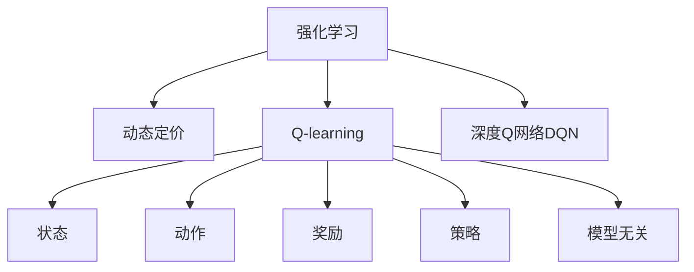

                 

## 1. 背景介绍

在当今数字化时代，智能定价策略已成为企业竞争力的关键组成部分。无论是电商平台、旅游行业、交通运输还是电信服务，都在使用动态定价策略以最大化收益并优化用户体验。这些策略通常依赖于复杂的数据分析、预测模型和优化算法。其中，强化学习（Reinforcement Learning, RL）作为一种学习形式，通过试错来优化决策，特别适用于动态定价这样的实时优化问题。

### 1.1 问题由来

动态定价（Dynamic Pricing）是指根据市场环境的变化，实时调整产品或服务的价格。传统的定价策略如成本加成、市场份额竞争等往往难以应对瞬息万变的市场条件。强化学习通过模拟市场环境，实时决策最优价格，帮助企业更灵活地应对需求波动、竞争态势和政策变化，从而最大化收益。

在实际应用中，强化学习动态定价策略可以分为两类：基于模型的强化学习和模型无关的强化学习。基于模型的强化学习需要精确的模型来预测市场状态和需求变化，而模型无关的强化学习则完全依赖历史数据和模型互动来优化价格策略。在本文中，我们将重点探讨模型无关的强化学习在动态定价中的应用。

### 1.2 问题核心关键点

强化学习动态定价策略的精髓在于，通过学习历史交易数据和市场变化，不断优化价格决策，以最大化长期收益。关键点包括：

- 模型无关：强化学习不依赖于具体的市场模型，直接从历史数据中学习最优策略。
- 实时性：通过实时反馈机制，强化学习可以动态调整价格，适应市场变化。
- 优化目标：最大化长期收益，而不仅仅是单次交易利润。
- 奖励机制：设置合理的奖励函数，引导学习算法寻找最优价格。

## 2. 核心概念与联系

### 2.1 核心概念概述

为了更好地理解强化学习动态定价策略，本节将介绍几个密切相关的核心概念：

- 强化学习（Reinforcement Learning, RL）：一种学习框架，通过试错来优化策略。强化学习由状态、动作、奖励和策略四个基本元素构成。
- 动态定价（Dynamic Pricing）：根据市场需求和竞争态势，实时调整产品或服务的价格。
- Q-learning：一种基于值的强化学习算法，通过估计每个状态的Q值，指导决策过程。
- 深度Q网络（Deep Q-Network, DQN）：利用深度神经网络近似Q值函数，以处理高维状态空间和大量数据。

这些概念之间的逻辑关系可以通过以下Mermaid流程图来展示：



这个流程图展示强化学习与动态定价的联系，以及Q-learning和DQN作为具体的强化学习算法。模型无关性表明该策略不依赖于特定模型，而深度Q网络则是一种实现Q-learning的常用技术。

## 3. 核心算法原理 & 具体操作步骤
### 3.1 算法原理概述

强化学习动态定价策略的基本原理是，在市场环境中学习最优的价格策略，以最大化长期收益。具体而言，算法通过以下步骤实现：

1. 观察市场状态（如需求水平、竞争对手价格、季节性因素等）。
2. 选择价格作为行动，并执行。
3. 观察市场反应（如实际需求、收入、成本等），计算奖励。
4. 根据观察到的状态和奖励，更新价格策略，以优化未来决策。

### 3.2 算法步骤详解

以下是基于强化学习动态定价策略的具体操作步骤：

**Step 1: 数据收集和预处理**

- 收集历史销售数据、市场环境数据、竞争对手数据等，作为训练和验证强化学习模型的基础。
- 对数据进行预处理，包括去噪、归一化、特征工程等，以提高模型的性能。

**Step 2: 环境建模**

- 定义强化学习环境，包括状态空间和动作空间。状态空间可以是连续的或离散的，而动作空间则是价格策略的集合。
- 设计奖励函数，奖励函数应反映市场表现的优劣，如利润最大化、客户满意度提升等。

**Step 3: 选择算法**

- 选择适合的具体强化学习算法，如Q-learning、SARSA、DQN等。深度Q网络是当前最流行的实现方式，因为它可以处理高维状态空间和大量数据。

**Step 4: 模型训练**

- 使用历史数据训练强化学习模型，优化价格策略。
- 将模型应用于实际市场环境，并通过实时反馈调整策略。

**Step 5: 策略部署**

- 部署优化后的价格策略，实时调整价格以适应市场变化。
- 监控模型表现，根据市场反馈不断优化策略。

### 3.3 算法优缺点

基于强化学习的动态定价策略具有以下优点：

- 灵活性高：强化学习动态定价策略可以根据市场变化实时调整价格，适应不同的需求和竞争态势。
- 自适应性强：算法通过学习历史数据，自动优化价格策略，不需要手动调整。
- 全局优化：强化学习能够考虑长期收益，避免局部最优解的陷阱。

同时，该策略也存在一些缺点：

- 数据需求高：强化学习需要大量的历史数据进行训练，而数据的获取和处理可能需要较长的时间。
- 模型复杂：深度Q网络等高级算法复杂度高，需要较强的计算资源。
- 非凸性问题：强化学习模型容易陷入局部最优，需要采用适当的优化算法和策略。
- 收敛速度慢：模型训练过程可能较慢，特别是在高维状态空间中。

### 3.4 算法应用领域

强化学习动态定价策略已在多个领域得到应用，例如：

- 电商零售：优化商品价格，提升销量和利润。
- 交通出行：根据实时路况和需求，调整票价或服务费用。
- 旅游预订：动态调整酒店价格，提升客房利用率。
- 能源交易：根据市场供需和价格波动，优化电力和燃料交易策略。
- 金融市场：调整金融产品定价，优化投资回报。

这些应用表明，强化学习动态定价策略具有广泛的市场适应性和应用前景。

## 4. 数学模型和公式 & 详细讲解 & 举例说明

### 4.1 数学模型构建

基于强化学习的动态定价模型通常由以下元素构成：

- 状态空间 $S$：表示市场环境的各种特征，如需求量、竞争对手价格、时间等。
- 动作空间 $A$：表示可采取的价格策略，如价格调整幅度、促销活动等。
- 奖励函数 $R(s,a)$：表示在状态 $s$ 下采取动作 $a$ 的奖励，可以基于利润、市场反应等设计。
- 状态转移概率 $P(s_{t+1}|s_t,a_t)$：表示在状态 $s_t$ 下采取动作 $a_t$ 后，转移到状态 $s_{t+1}$ 的概率。
- 折扣因子 $\gamma$：用于折现未来奖励，确保长期收益的最大化。

### 4.2 公式推导过程

基于强化学习的动态定价策略可以形式化为一个马尔可夫决策过程（Markov Decision Process, MDP）。通过Q-learning算法，我们可以估计每个状态的Q值，指导决策过程。

Q值函数 $Q(s,a)$ 定义为在状态 $s$ 下采取动作 $a$ 的预期长期奖励。Q-learning的更新公式为：

$$
Q(s_t,a_t) \leftarrow Q(s_t,a_t) + \alpha[R(s_{t+1},a_{t+1}) + \gamma\max_aQ(s_{t+1},a) - Q(s_t,a_t)]
$$

其中 $\alpha$ 为学习率，$R(s_{t+1},a_{t+1})$ 为在状态 $s_{t+1}$ 下采取动作 $a_{t+1}$ 的即时奖励和折现奖励之和。

### 4.3 案例分析与讲解

假设我们有一个电商平台，希望通过动态定价策略最大化收益。状态空间 $S$ 包括当前需求量、竞争对手价格、时间等，动作空间 $A$ 是可调整的价格策略。我们可以设计一个简单的奖励函数 $R(s,a) = \text{利润率} - \text{固定成本}$，其中利润率定义为 $(s_t,a_t)$ 下实际销售额与价格之比减去固定成本。

在训练过程中，我们收集历史交易数据，使用Q-learning算法学习每个状态的Q值。在实际应用中，我们将优化后的价格策略部署到平台，实时调整价格以适应市场变化。例如，在需求高时，可以适度提高价格，而在需求低时，可以适当降价促销。

## 5. 项目实践：代码实例和详细解释说明
### 5.1 开发环境搭建

在进行项目实践前，我们需要准备好开发环境。以下是使用Python进行OpenAI Gym环境搭建的流程：

1. 安装Python：推荐使用Python 3.6或更高版本。
2. 安装OpenAI Gym：使用pip安装Gym和相关依赖。
3. 安装深度学习框架：使用pip安装TensorFlow或PyTorch等深度学习框架。
4. 安装相关库：如Numpy、Pandas、Matplotlib等。

### 5.2 源代码详细实现

以下是使用深度Q网络（DQN）进行动态定价策略的PyTorch代码实现：

```python
import torch
import torch.nn as nn
import torch.optim as optim
import numpy as np
import gym
from collections import deque
from torch.autograd import Variable

class DQN(nn.Module):
    def __init__(self, input_dim, output_dim, hidden_dim=64):
        super(DQN, self).__init__()
        self.fc1 = nn.Linear(input_dim, hidden_dim)
        self.fc2 = nn.Linear(hidden_dim, hidden_dim)
        self.fc3 = nn.Linear(hidden_dim, output_dim)

    def forward(self, x):
        x = nn.functional.relu(self.fc1(x))
        x = nn.functional.relu(self.fc2(x))
        x = self.fc3(x)
        return x

class Agent:
    def __init__(self, input_dim, output_dim, gamma=0.9, epsilon=0.01, epsilon_min=0.01, epsilon_decay=0.995):
        self.input_dim = input_dim
        self.output_dim = output_dim
        self.gamma = gamma
        self.epsilon = epsilon
        self.epsilon_min = epsilon_min
        self.epsilon_decay = epsilon_decay
        self.learning_rate = 0.01
        self.model = DQN(input_dim, output_dim)
        self.target_model = DQN(input_dim, output_dim)
        self.optimizer = optim.Adam(self.model.parameters(), lr=self.learning_rate)
        self.loss_fn = nn.MSELoss()
        self.memory = deque(maxlen=2000)

    def act(self, state):
        if np.random.rand() < self.epsilon:
            return np.random.randint(0, self.output_dim)
        else:
            with torch.no_grad():
                state = Variable(torch.unsqueeze(torch.FloatTensor(state), 0))
                q_values = self.model(state)
                return torch.max(q_values).item()[0]

    def learn(self, batch):
        states, actions, rewards, next_states, dones = batch
        q_values = self.model(torch.FloatTensor(states))
        q_values_next = self.target_model(torch.FloatTensor(next_states))
        best_q_values = torch.max(q_values_next, dim=1)[0].unsqueeze(1)
        q_values = q_values.gather(1, actions)

        loss = self.loss_fn(q_values, rewards + self.gamma * best_q_values * (1 - dones))
        self.optimizer.zero_grad()
        loss.backward()
        self.optimizer.step()

    def update_target_model(self):
        self.target_model.load_state_dict(self.model.state_dict())

def train(env):
    state_dim = env.observation_space.shape[0]
    action_dim = env.action_space.n
    agent = Agent(state_dim, action_dim)
    
    for episode in range(1000):
        state = env.reset()
        state = np.reshape(state, [1, state_dim])
        done = False
        total_reward = 0
        for t in range(100):
            action = agent.act(state)
            next_state, reward, done, _ = env.step(action)
            next_state = np.reshape(next_state, [1, state_dim])
            agent.memory.append((state, action, reward, next_state, done))
            if len(agent.memory) > agent.memory.maxlen:
                agent.memory.popleft()
            if done:
                break
            state = next_state
            total_reward += reward
        agent.learn(agent.memory)
        agent.update_target_model()
        print("Episode: {}, Total Reward: {:.2f}".format(episode+1, total_reward))
        if episode % 10 == 0:
            print("Memory Length: {}, Episode: {}, Epsilon: {:.2f}".format(len(agent.memory), episode+1, agent.epsilon))

    env.close()
```

### 5.3 代码解读与分析

让我们再详细解读一下关键代码的实现细节：

**DQN模型**：
- `DQN`类继承自`nn.Module`，定义了神经网络的结构。该网络由三个全连接层组成，最后一层输出每个动作的Q值。
- `forward`方法定义了前向传播过程，将输入状态通过三个全连接层进行变换，输出每个动作的Q值。

**Agent类**：
- `Agent`类实现了强化学习算法的主体逻辑。包含模型、目标模型、优化器、损失函数、记忆队列等关键组件。
- `act`方法实现了动作选择策略，在探索和利用的平衡中选取最优动作。
- `learn`方法实现了Q值更新过程，使用批量数据的训练样本来更新模型参数。
- `update_target_model`方法用于更新目标模型，保持模型参数的一致性。

**训练流程**：
- 初始化Q值网络、目标Q值网络、优化器、损失函数等。
- 在每个回合中，通过模拟环境得到当前状态、动作、奖励、下一状态和done标记。
- 将数据存储到记忆队列中，并每隔一定时间从队列中取出一批数据进行训练。
- 训练后更新目标模型参数，以减少模型更新时的梯度不稳定问题。
- 输出每个回合的总奖励和记忆队列长度，以及ε-greedy策略中的ε值。

**代码实践**：
- `train`函数是主函数，实现了整个训练流程。
- 在每次迭代中，初始化状态，进入循环，模拟环境互动，存储数据，训练模型，更新目标模型，输出结果。

## 6. 实际应用场景
### 6.1 智能客服系统

智能客服系统可以通过强化学习动态定价策略，根据客户需求和系统资源自动调整服务价格。例如，在高峰期增加价格以降低系统负荷，而在低峰期降低价格以吸引客户。

在技术实现上，可以收集历史客户行为数据、系统资源数据、市场环境数据等，使用强化学习模型学习最优价格策略。在实际应用中，系统实时监测客户需求和资源状况，动态调整价格，提升客户满意度和服务质量。

### 6.2 供应链管理

供应链管理中的库存和物流优化问题，可以通过强化学习动态定价策略来解决。例如，根据市场需求的波动和供应链的成本，动态调整产品的生产计划和价格策略。

在技术实现上，可以收集历史销售数据、市场需求预测数据、供应链成本数据等，使用强化学习模型学习最优定价策略。在实际应用中，系统实时监测市场需求和供应链状况，动态调整价格和生产计划，优化库存和物流效率。

### 6.3 金融市场

金融市场中的投资和交易策略，也可以通过强化学习动态定价策略来实现。例如，根据市场数据和用户行为，动态调整投资组合和交易价格。

在技术实现上，可以收集历史交易数据、市场数据、用户行为数据等，使用强化学习模型学习最优定价策略。在实际应用中，系统实时监测市场数据和用户行为，动态调整投资组合和交易价格，提升投资回报和风险控制能力。

### 6.4 未来应用展望

随着强化学习动态定价策略的不断成熟，其在更多领域的应用前景将更加广阔：

- 实时定价：无论是电商、交通、旅游还是金融，实时定价策略可以提升资源利用率和用户体验，适应瞬息万变的市场环境。
- 个性化定价：通过学习用户行为和偏好，实现个性化定价，提升客户满意度和忠诚度。
- 多渠道整合：将线上线下定价策略整合，优化全渠道运营，提升整体营销效果。
- 自动化运营：通过强化学习自动化决策，减少人为干预，提高运营效率和准确性。
- 数据驱动决策：强化学习策略可以持续学习新数据，不断优化价格策略，保持市场竞争力。

## 7. 工具和资源推荐
### 7.1 学习资源推荐

为了帮助开发者系统掌握强化学习动态定价理论基础和实践技巧，这里推荐一些优质的学习资源：

1. 《强化学习》书籍：由Sutton和Barto合著，全面介绍了强化学习的基本概念、算法和应用。
2. 《深度强化学习》课程：由DeepMind和Stanford大学合作开设，涵盖强化学习的基本理论和前沿技术。
3. OpenAI Gym：一个用于研究强化学习的开源环境，提供了丰富的环境库和实验框架。
4. TensorFlow和PyTorch：两个流行的深度学习框架，提供了强大的计算能力和灵活的API设计。
5. GitHub上的强化学习项目：如AlphaGo、DQN等，提供了丰富的代码示例和实际应用。

通过对这些资源的学习实践，相信你一定能够快速掌握强化学习动态定价的精髓，并用于解决实际的业务问题。

### 7.2 开发工具推荐

高效的开发离不开优秀的工具支持。以下是几款用于强化学习动态定价开发的常用工具：

1. OpenAI Gym：一个用于研究强化学习的开源环境，提供了丰富的环境库和实验框架。
2. TensorFlow和PyTorch：两个流行的深度学习框架，提供了强大的计算能力和灵活的API设计。
3. NVIDIA CUDA：用于加速深度学习模型的GPU计算，提高训练和推理效率。
4. AWS SageMaker：一个云服务平台，提供了丰富的机器学习工具和模型训练服务。
5. Google Colab：谷歌提供的在线Jupyter Notebook环境，方便进行实验和共享代码。

合理利用这些工具，可以显著提升强化学习动态定价任务的开发效率，加快创新迭代的步伐。

### 7.3 相关论文推荐

强化学习动态定价策略的发展源于学界的持续研究。以下是几篇奠基性的相关论文，推荐阅读：

1. "Q-Learning: A New Approach to Continuous Control"：Watkins和Dayan提出的Q-learning算法，奠定了强化学习基础。
2. "Playing Atari with Deep Reinforcement Learning"：Mnih等人的工作展示了深度Q网络在复杂游戏环境中的应用。
3. "Human-level Control Through Deep Reinforcement Learning"：Silver等人的工作在围棋领域展示了强化学习的潜力。
4. "Adaptive Computation Time for Reinforcement Learning"：Schaul等人的工作引入了自适应计算时间（Adaptive Computation Time, ACT），提高了深度强化学习的效率。
5. "Asymptotic Convergence in Reinforcement Learning: The Time-Difference Method"：Sutton和Barto的理论分析，探讨了强化学习算法的收敛性。

这些论文代表了大规模强化学习的发展脉络。通过学习这些前沿成果，可以帮助研究者把握学科前进方向，激发更多的创新灵感。

## 8. 总结：未来发展趋势与挑战
### 8.1 总结

本文对基于强化学习的动态定价策略进行了全面系统的介绍。首先阐述了强化学习在动态定价中的应用背景和意义，明确了动态定价策略在提高企业收益和优化用户体验方面的重要价值。其次，从原理到实践，详细讲解了强化学习的数学模型和操作步骤，给出了动态定价策略的完整代码实例。同时，本文还广泛探讨了强化学习在智能客服、供应链管理、金融市场等多个行业领域的应用前景，展示了强化学习策略的强大潜力。此外，本文精选了强化学习技术的各类学习资源，力求为读者提供全方位的技术指引。

通过本文的系统梳理，可以看到，强化学习动态定价策略正在成为企业竞争力的关键组成部分，极大地拓展了决策模型的应用边界，催生了更多的落地场景。受益于强化学习的智能优化，决策过程更加灵活、高效、精确，为企业带来了显著的商业价值。未来，伴随强化学习技术的持续演进，动态定价策略将在更多领域得到应用，为智能决策带来新的变革。

### 8.2 未来发展趋势

展望未来，强化学习动态定价策略将呈现以下几个发展趋势：

1. 模型复杂性提升：随着深度学习技术的发展，强化学习模型将变得更加复杂，能够处理更加多样化的市场环境。
2. 多智能体学习：强化学习策略将变得更加智能，能够与其他决策者（如竞争对手、合作伙伴等）进行多智能体互动，实现更优的协同效果。
3. 跨领域应用：强化学习动态定价策略将拓展到更多领域，如医疗、教育、环境等，实现更广泛的应用。
4. 自适应性增强：强化学习模型将具备更强的自适应能力，能够实时调整策略以应对市场变化。
5. 可解释性提升：强化学习模型将具备更强的可解释性，能够提供决策过程的清晰解释，增强模型的可信度。

这些趋势凸显了强化学习动态定价策略的广阔前景。这些方向的探索发展，必将进一步提升决策模型的性能和应用范围，为智能决策带来新的突破。

### 8.3 面临的挑战

尽管强化学习动态定价策略已经取得了瞩目成就，但在迈向更加智能化、普适化应用的过程中，它仍面临着诸多挑战：

1. 数据需求高：强化学习需要大量的历史数据进行训练，数据的获取和处理可能需要较长的时间。
2. 模型复杂：深度强化学习模型复杂度高，需要较强的计算资源。
3. 收敛速度慢：模型训练过程可能较慢，特别是在高维状态空间中。
4. 非凸性问题：强化学习模型容易陷入局部最优，需要采用适当的优化算法和策略。
5. 可解释性不足：强化学习模型通常缺乏可解释性，难以解释其内部工作机制和决策逻辑。
6. 安全性问题：强化学习模型可能学习到有害的行为，产生误导性或歧视性的输出，带来安全隐患。

正视强化学习动态定价策略面临的这些挑战，积极应对并寻求突破，将是大规模强化学习走向成熟的必由之路。相信随着学界和产业界的共同努力，这些挑战终将一一被克服，强化学习动态定价策略必将在构建智能决策系统方面发挥更大的作用。

### 8.4 研究展望

面对强化学习动态定价策略所面临的挑战，未来的研究需要在以下几个方面寻求新的突破：

1. 优化算法：研究更高效的优化算法，如Adam、RMSprop等，以提高训练速度和模型性能。
2. 模型简化：通过模型压缩、剪枝等方法，减少模型参数，提高计算效率。
3. 多目标优化：将强化学习模型与多目标优化算法结合，提高决策模型的多目标优化能力。
4. 混合学习：将强化学习与传统机器学习算法结合，提高决策模型的鲁棒性和泛化能力。
5. 数据增强：通过数据增强技术，提高模型的泛化能力和鲁棒性。
6. 可解释性：研究更强的可解释性算法，如LIME、SHAP等，提高决策模型的可信度和可解释性。

这些研究方向的探索，必将引领强化学习动态定价策略迈向更高的台阶，为构建智能决策系统提供新的方法和工具。面向未来，强化学习动态定价策略还需要与其他人工智能技术进行更深入的融合，如知识表示、因果推理、强化学习等，多路径协同发力，共同推动智能决策系统的进步。只有勇于创新、敢于突破，才能不断拓展强化学习动态定价策略的边界，让智能决策技术更好地服务于社会。

## 9. 附录：常见问题与解答

**Q1：强化学习动态定价是否适用于所有市场环境？**

A: 强化学习动态定价策略适用于大多数市场环境，但需要根据具体市场特点进行适当调整。例如，在动态定价应用中，需要考虑价格变动对市场需求的弹性、竞争对手的定价策略、消费者的支付意愿等因素。

**Q2：如何选择合适的奖励函数？**

A: 奖励函数的设计是强化学习动态定价策略的关键。应根据具体市场环境选择适当的奖励函数。例如，在电商领域，可以设计利润率、销售额等作为奖励，而在金融市场，可以设计收益、风险等作为奖励。

**Q3：强化学习动态定价是否需要大量的历史数据？**

A: 强化学习动态定价策略通常需要大量的历史数据进行训练。数据量越大，模型的泛化能力越强，策略效果越好。然而，数据的获取和处理可能需要较长的时间，因此需要考虑数据来源和预处理策略。

**Q4：如何平衡探索和利用？**

A: 在强化学习动态定价策略中，平衡探索和利用是一个重要的挑战。可以通过ε-greedy策略来实现。具体而言，可以在大部分时间利用已知的最优策略，而在小概率下探索新的策略，以保持模型的创新能力。

**Q5：强化学习动态定价是否需要持续更新？**

A: 强化学习动态定价策略需要持续更新，以适应市场环境的变化。可以通过实时反馈机制，不断调整策略，以优化价格决策。在实际操作中，需要设置适当的模型更新频率和反馈机制，确保策略的有效性。

通过本文的系统梳理，可以看到，基于强化学习的动态定价策略正在成为企业竞争力的关键组成部分，极大地拓展了决策模型的应用边界，催生了更多的落地场景。受益于强化学习的智能优化，决策过程更加灵活、高效、精确，为企业带来了显著的商业价值。未来，伴随强化学习技术的持续演进，动态定价策略将在更多领域得到应用，为智能决策带来新的变革。

---

作者：禅与计算机程序设计艺术 / Zen and the Art of Computer Programming

