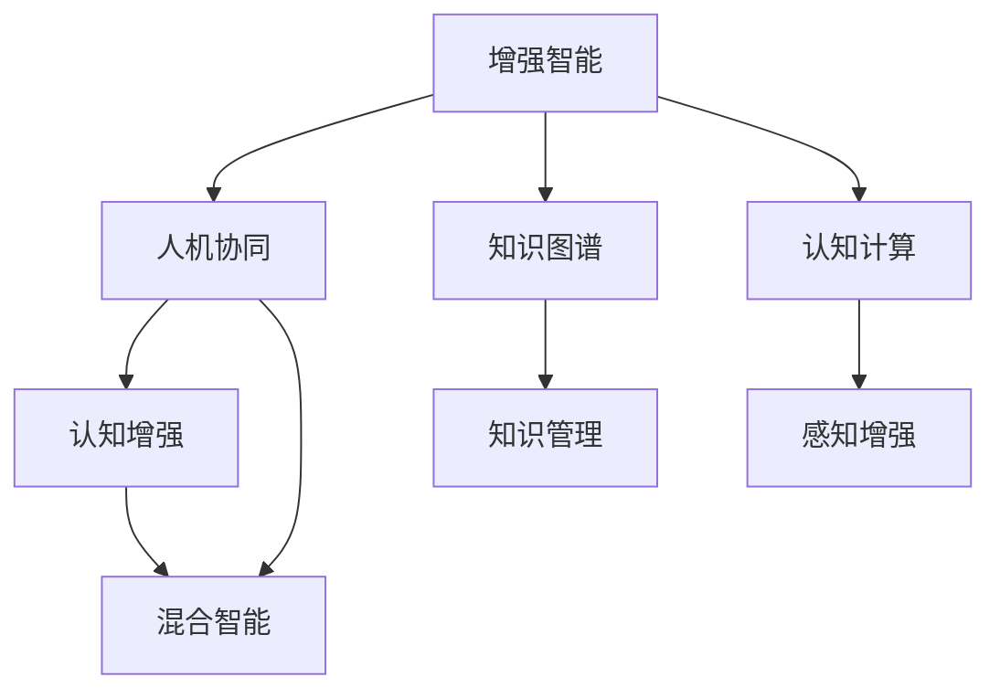

                 

# 增强智能：人机协同，拓展认知新领域

> 关键词：增强智能,人机协同,认知增强,混合智能,智能增强系统,深度学习,知识图谱,认知计算

## 1. 背景介绍

### 1.1 问题由来

随着人工智能技术的飞速发展，人类社会正经历一场前所未有的认知革命。人工智能不仅在计算速度、存储容量等方面超越人类，也在某些特定领域展现出超越人类的智能水平。然而，人类智慧的核心不仅在于算法和技术，更在于情感、直觉、创造力等“软实力”。

人工智能与人类智能的互补性使得混合智能（Hybrid Intelligence）应运而生。混合智能融合了机器和人类的强项，构建了全新的人机协作模式，拓展了人类认知能力的新领域。它不仅能够处理海量数据、实现高精度计算，还能通过情感分析、跨模态融合、知识推理等手段，增强人类认知、提升决策水平、提高生产效率。

本文将从混合智能的原理、实现方法、应用场景以及未来发展趋势等方面，深入探讨如何通过人机协同，拓展人类认知新领域，为人工智能与人类智慧的融合提供一条新路径。

## 2. 核心概念与联系

### 2.1 核心概念概述

为了更好地理解混合智能的构建过程，本节将介绍几个关键概念：

- **增强智能（Augmented Intelligence）**：指通过人工智能技术增强人类认知、提升决策和创造能力的过程。

- **人机协同（Human-Machine Collaboration）**：指人类与机器在认知任务中协同工作的模式。它包括知识共享、任务分配、情感共鸣等多样化的合作形式。

- **认知增强（Cognitive Enhancement）**：指通过机器学习和深度学习技术，提升人类的逻辑推理、感知判断等认知能力。

- **混合智能（Hybrid Intelligence）**：融合人类智慧和机器智能的全新智能形式，兼具人类的情感、直觉和机器的精确计算、高效处理能力。

- **知识图谱（Knowledge Graph）**：以图形化方式描述知识之间关系的结构化数据仓库，它将大量零散的、异构的、无序的信息整合成有机的、系统的知识体系。

- **认知计算（Cognitive Computing）**：以模拟人脑的神经网络为基础，实现语音识别、图像处理、自然语言处理等任务的人工智能技术。

这些概念之间的关系可以通过以下Mermaid流程图来展示：



这个流程图展示了增强智能、人机协同、认知增强、混合智能等核心概念及其相互联系：

1. 增强智能通过人机协同，利用机器智能提升人类认知。
2. 认知增强是增强智能的核心手段，通过深度学习和知识图谱技术，增强人类在感知、推理、决策等方面的能力。
3. 混合智能则是人机协同的最终产物，具有人类和机器的互补优势。
4. 知识图谱和认知计算是认知增强的重要工具，前者用于知识表示和管理，后者用于感知和理解。

## 3. 核心算法原理 & 具体操作步骤

### 3.1 算法原理概述

混合智能的核心原理在于通过人机协同，将机器的计算能力和人类的认知能力结合起来。其中，增强智能和认知增强是混合智能构建的两个关键环节。

- **增强智能**：通过深度学习技术，将人类专家知识、历史经验、情感信息等融入机器学习模型，提升模型的推理和决策能力。

- **认知增强**：利用知识图谱和认知计算，将知识从异构数据源中提取出来，构建结构化的知识体系，增强人类在复杂任务中的认知能力。

### 3.2 算法步骤详解

以下是混合智能构建的基本步骤：

**Step 1: 数据预处理**

1. **数据收集与标注**：收集人类专家的知识、历史经验、情感信息等，标注成机器可理解的形式，如文本、图像等。
2. **数据清洗与归一化**：清洗无用信息，对数据进行归一化处理，提高数据的质量和一致性。

**Step 2: 构建知识图谱**

1. **知识表示**：将收集到的知识转化为结构化的实体-关系-属性三元组，形成知识图谱。
2. **图谱整合与优化**：通过算法优化知识图谱的结构，提高知识表达的效率和准确性。

**Step 3: 深度学习模型训练**

1. **模型选择与设计**：选择适当的深度学习模型（如神经网络、卷积神经网络等），并设计模型结构。
2. **模型训练与调优**：使用预处理后的数据，训练深度学习模型，调整超参数，优化模型性能。

**Step 4: 认知计算与推理**

1. **感知增强**：利用认知计算技术，增强模型对复杂数据的感知能力，如图像识别、语音处理等。
2. **推理与决策**：通过知识图谱和深度学习模型，实现复杂任务的推理和决策，如图谱搜索、情感分析等。

**Step 5: 人机协同**

1. **任务分配与合作**：根据任务特点，合理分配任务给人类和机器，实现人机协同。
2. **情感共鸣与反馈**：通过情感分析技术，捕捉人类情感变化，优化人机交互体验。

### 3.3 算法优缺点

混合智能的算法具有以下优点：

1. **高精度计算**：深度学习模型具备高精度计算能力，可以处理复杂的数据和任务。
2. **知识积累与复用**：通过知识图谱，将知识系统化地存储和复用，提升知识的共享与利用效率。
3. **人机互补**：利用人类情感、直觉与机器精确计算、高效处理的互补优势，提升整体决策水平。

同时，该算法也存在一定的局限性：

1. **数据依赖性高**：混合智能依赖于大量高质量的数据，数据获取成本较高。
2. **模型复杂度高**：深度学习模型的结构复杂，训练和推理过程耗时较长。
3. **隐私与安全风险**：在处理敏感信息时，可能存在隐私泄露和数据安全风险。
4. **模型解释性不足**：深度学习模型通常是“黑箱”，难以解释模型的决策过程。

尽管存在这些局限性，但混合智能仍然是当前人工智能发展的重要方向，具有广阔的应用前景。

### 3.4 算法应用领域

混合智能在多个领域已经得到了广泛的应用，涵盖了从医疗、金融到教育、娱乐的各个领域：

- **医疗领域**：通过认知增强，帮助医生进行精准诊断、制定个性化治疗方案，提升医疗服务质量。
- **金融领域**：利用增强智能，进行风险评估、智能投顾、欺诈检测等，提升金融决策的精准度和效率。
- **教育领域**：结合人机协同，提供个性化学习方案、智能测评系统，提升教育效果和效率。
- **娱乐领域**：通过增强智能和认知计算，实现智能推荐、情感分析、虚拟现实体验等，提升用户体验。
- **制造领域**：结合增强智能和认知增强，实现智能制造、质量检测、生产优化等，提升生产效率和质量。

## 4. 数学模型和公式 & 详细讲解  
### 4.1 数学模型构建

混合智能构建过程涉及多个数学模型，主要包括深度学习模型、知识图谱模型和认知计算模型。

**深度学习模型**：用于处理和分析输入数据，如卷积神经网络（CNN）、循环神经网络（RNN）、Transformer等。

**知识图谱模型**：用于表示和存储知识，如RDF、OWL等。

**认知计算模型**：用于模拟人脑的神经网络，如反向传播算法、卷积神经网络、循环神经网络等。

### 4.2 公式推导过程

以深度学习模型为例，假设输入数据为 $x$，模型参数为 $\theta$，输出为 $y$。则模型的预测函数为：

$$
y = f(x; \theta)
$$

其中，$f(x; \theta)$ 为非线性映射函数，通常采用神经网络来实现。深度学习模型的训练过程是通过最小化损失函数 $\mathcal{L}$ 来完成的：

$$
\theta^* = \mathop{\arg\min}_{\theta} \mathcal{L}(y, \hat{y})
$$

其中，$\hat{y}$ 为模型预测的输出，$\mathcal{L}$ 为损失函数。常见的损失函数包括交叉熵损失、均方误差损失等。

### 4.3 案例分析与讲解

以医疗领域的疾病诊断为例，假设输入数据为患者的症状描述，输出为可能的疾病。首先，通过自然语言处理技术，将症状描述转化为向量表示，输入到深度学习模型中进行诊断。模型在训练阶段，利用已知疾病的症状和诊断结果，最小化交叉熵损失，优化模型参数 $\theta$。

在推理阶段，将新的症状描述输入模型，得到预测的疾病 $y$。通过知识图谱技术，将 $y$ 映射到具体的疾病实体，结合医生的经验和判断，给出最终的诊断结果。

## 5. 项目实践：代码实例和详细解释说明

### 5.1 开发环境搭建

为了实现混合智能的构建，需要搭建相应的开发环境。以下是Python和PyTorch框架的安装和配置步骤：

1. 安装Anaconda：
   ```
   wget https://repo.anaconda.com/miniconda/Miniconda3-latest-Linux-x86_64.sh
   bash Miniconda3-latest-Linux-x86_64.sh
   ```

2. 创建虚拟环境并激活：
   ```
   conda create -n myenv python=3.8
   conda activate myenv
   ```

3. 安装PyTorch及其依赖：
   ```
   conda install torch torchvision torchaudio -c pytorch
   ```

4. 安装相关工具包：
   ```
   pip install numpy pandas scikit-learn matplotlib tqdm jupyter notebook ipython
   ```

### 5.2 源代码详细实现

以下是使用PyTorch和Transformers库实现疾病诊断的Python代码：

```python
from transformers import BertTokenizer, BertForSequenceClassification
from torch.utils.data import Dataset, DataLoader
from torch.nn import CrossEntropyLoss
from sklearn.metrics import accuracy_score
import torch

class MedicalDataset(Dataset):
    def __init__(self, texts, labels):
        self.texts = texts
        self.labels = labels
        self.tokenizer = BertTokenizer.from_pretrained('bert-base-uncased')
        
    def __len__(self):
        return len(self.texts)
    
    def __getitem__(self, item):
        text = self.texts[item]
        label = self.labels[item]
        
        encoding = self.tokenizer(text, return_tensors='pt', padding='max_length', truncation=True)
        input_ids = encoding['input_ids'][0]
        attention_mask = encoding['attention_mask'][0]
        
        # 对标签进行编码
        label = torch.tensor([label], dtype=torch.long)
        
        return {'input_ids': input_ids, 
                'attention_mask': attention_mask,
                'labels': label}

# 加载数据集
train_dataset = MedicalDataset(train_texts, train_labels)
test_dataset = MedicalDataset(test_texts, test_labels)

# 定义模型和损失函数
model = BertForSequenceClassification.from_pretrained('bert-base-uncased', num_labels=10)
criterion = CrossEntropyLoss()

# 设置优化器和超参数
optimizer = AdamW(model.parameters(), lr=2e-5)

# 训练模型
device = torch.device('cuda') if torch.cuda.is_available() else torch.device('cpu')
model.to(device)
train_loader = DataLoader(train_dataset, batch_size=16, shuffle=True)
for epoch in range(5):
    model.train()
    for batch in train_loader:
        input_ids = batch['input_ids'].to(device)
        attention_mask = batch['attention_mask'].to(device)
        labels = batch['labels'].to(device)
        
        optimizer.zero_grad()
        outputs = model(input_ids, attention_mask=attention_mask, labels=labels)
        loss = criterion(outputs, labels)
        loss.backward()
        optimizer.step()
        
    print(f'Epoch {epoch+1}, train loss: {loss.item()}')
    
# 评估模型
model.eval()
test_loader = DataLoader(test_dataset, batch_size=16, shuffle=False)
predictions = []
labels = []
with torch.no_grad():
    for batch in test_loader:
        input_ids = batch['input_ids'].to(device)
        attention_mask = batch['attention_mask'].to(device)
        labels = batch['labels'].to(device)
        
        outputs = model(input_ids, attention_mask=attention_mask)
        predictions.append(outputs.argmax(dim=1).cpu().numpy())
        labels.append(labels.cpu().numpy())
        
accuracy = accuracy_score(labels, predictions)
print(f'Test accuracy: {accuracy:.2f}')
```

以上代码实现了使用BERT模型进行疾病诊断的深度学习模型训练和评估过程。通过数据预处理、模型训练、评估等步骤，展示了混合智能在实际应用中的实现流程。

### 5.3 代码解读与分析

代码中的关键步骤包括：

- **数据集准备**：定义MedicalDataset类，对输入数据进行分批次加载，并将文本进行分词和编码。
- **模型定义**：使用BertForSequenceClassification模型，定义输入和输出，并设置损失函数。
- **模型训练**：使用AdamW优化器进行模型训练，设置学习率等超参数。
- **模型评估**：在测试集上进行模型评估，输出准确率。

通过这些步骤，实现了疾病诊断的混合智能系统。

## 6. 实际应用场景

### 6.1 智能医疗

在智能医疗领域，混合智能可以帮助医生进行精准诊断、制定个性化治疗方案，提升医疗服务质量。例如，通过混合智能系统，可以实时分析患者的症状、影像数据和电子病历，提供初步诊断和治疗建议。在手术辅助、药物研发等方面，混合智能也展现出巨大的应用潜力。

### 6.2 金融风险控制

在金融领域，混合智能可以用于风险评估、智能投顾、欺诈检测等，提升金融决策的精准度和效率。例如，通过混合智能系统，可以实时监控金融市场动态，分析交易数据，预测市场趋势，提供投资建议。在反欺诈方面，混合智能可以检测异常交易行为，及时预警潜在的欺诈风险。

### 6.3 教育个性化

在教育领域，混合智能可以用于个性化学习方案、智能测评系统，提升教育效果和效率。例如，通过混合智能系统，可以分析学生的学习行为和成绩，提供个性化的学习资源和建议，提升学生的学习效果。在智能测评方面，混合智能可以自动评估学生的作业和考试，提供即时反馈，帮助学生改进学习。

### 6.4 娱乐体验

在娱乐领域，混合智能可以用于智能推荐、情感分析、虚拟现实体验等，提升用户体验。例如，通过混合智能系统，可以分析用户的行为数据，推荐个性化的娱乐内容，提升用户的满意度和粘性。在情感分析方面，混合智能可以分析用户的情感变化，提供个性化的服务体验。

## 7. 工具和资源推荐

### 7.1 学习资源推荐

为了帮助开发者系统掌握混合智能的理论基础和实践技巧，这里推荐一些优质的学习资源：

1. 《深度学习》一书：由Ian Goodfellow等著，全面介绍了深度学习的原理和应用，是深度学习领域的经典教材。
2. 《认知计算》一书：由Krishnan et al.著，介绍了认知计算的基本原理和应用，涵盖了深度学习、知识图谱等多个方面。
3. Coursera《深度学习》课程：斯坦福大学开设的深度学习课程，内容丰富，讲解深入，适合初学者和进阶者。
4. HuggingFace官方文档：提供了丰富的预训练模型和微调样例，是深度学习开发者的必备资源。
5. Arxiv预印本：是深度学习领域的知识库，可以获取最新的研究论文和技术进展。

通过对这些资源的学习实践，相信你一定能够快速掌握混合智能的精髓，并用于解决实际的智能问题。

### 7.2 开发工具推荐

高效的开发离不开优秀的工具支持。以下是几款用于混合智能开发的常用工具：

1. PyTorch：基于Python的开源深度学习框架，灵活动态的计算图，适合快速迭代研究。
2. TensorFlow：由Google主导开发的开源深度学习框架，生产部署方便，适合大规模工程应用。
3. Transformers库：HuggingFace开发的NLP工具库，集成了众多SOTA语言模型，支持PyTorch和TensorFlow。
4. Weights & Biases：模型训练的实验跟踪工具，可以记录和可视化模型训练过程中的各项指标，方便对比和调优。
5. TensorBoard：TensorFlow配套的可视化工具，可实时监测模型训练状态，并提供丰富的图表呈现方式。

合理利用这些工具，可以显著提升混合智能开发的效率，加快创新迭代的步伐。

### 7.3 相关论文推荐

混合智能的研究源于学界的持续研究。以下是几篇奠基性的相关论文，推荐阅读：

1. AlphaGo：DeepMind开发的AlphaGo系统，展示了深度学习在复杂博弈游戏中的应用潜力。
2. GPT系列：OpenAI开发的GPT系列模型，展示了预训练大语言模型在自然语言处理中的应用。
3. Attention is All You Need：提出了Transformer结构，开启了NLP领域的预训练大模型时代。
4. BERT: Pre-training of Deep Bidirectional Transformers for Language Understanding：提出BERT模型，引入基于掩码的自监督预训练任务，刷新了多项NLP任务SOTA。
5. Transformer-XL: Attentive Language Models for Longer Range Dependencies：提出了Transformer-XL模型，解决了长序列问题的训练效率问题。
6. Knowledge Graph Embeddings：用于知识图谱表示和推理的深度学习模型，如TransE、DistMult等。

这些论文代表了大语言模型混合智能的发展脉络。通过学习这些前沿成果，可以帮助研究者把握学科前进方向，激发更多的创新灵感。

## 8. 总结：未来发展趋势与挑战

### 8.1 研究成果总结

本文对混合智能的原理、实现方法和应用场景进行了全面系统的介绍。首先阐述了混合智能的概念和构建过程，明确了其在增强人类认知、提升决策和创造能力方面的价值。其次，从数据预处理、模型训练、人机协同等角度，详细讲解了混合智能构建的基本步骤，并给出了代码实现和案例分析。最后，讨论了混合智能在多个领域的应用前景，展示了其广阔的应用潜力和发展方向。

通过本文的系统梳理，可以看到，混合智能不仅能够提升机器的计算能力，还能增强人类的认知和情感，实现人机协同，拓展认知新领域。未来，随着深度学习、知识图谱、认知计算等技术的不断进步，混合智能将展现出更加强大的应用能力，为人类智慧和机器智能的融合提供新的路径。

### 8.2 未来发展趋势

展望未来，混合智能的发展将呈现以下几个趋势：

1. **跨模态智能**：混合智能将进一步拓展到图像、语音、文本等多种模态数据的融合处理，实现跨模态认知增强。
2. **情感计算**：通过情感计算技术，混合智能可以更好地理解人类的情感变化，提供更加个性化的服务。
3. **联邦学习**：通过联邦学习技术，混合智能可以在多方数据分布式协作下，实现知识共享和模型优化。
4. **可解释性增强**：通过可解释性增强技术，混合智能可以更好地解释其决策过程，提高系统的透明度和可信度。
5. **人工智能伦理**：在混合智能的研究和应用中，需要考虑人工智能伦理问题，确保技术的公正性、透明性和安全性。

以上趋势凸显了混合智能的发展方向和潜力，将进一步推动人工智能与人类智慧的融合。

### 8.3 面临的挑战

尽管混合智能在多个领域已经取得了显著成果，但在迈向更加智能化、普适化应用的过程中，它仍面临着诸多挑战：

1. **数据隐私和安全**：在处理敏感信息时，可能存在隐私泄露和数据安全风险。如何保护数据隐私和安全，是混合智能面临的重要挑战。
2. **模型复杂度**：深度学习模型的结构复杂，训练和推理过程耗时较长。如何提高模型的效率和可解释性，是混合智能需要解决的问题。
3. **人机交互体验**：在混合智能系统中，如何设计合理的人机交互界面，提升用户体验，是系统开发的重要挑战。
4. **技术普适性**：在实际应用中，如何使混合智能技术普适化，适应不同的用户需求和应用场景，是技术推广的关键。

尽管存在这些挑战，但混合智能仍然是大数据和人工智能领域的重要方向，具有广阔的应用前景。未来，随着技术的不断进步和应用的深入，这些挑战有望逐步得到解决，混合智能将展现出更加广阔的发展空间。

### 8.4 研究展望

面对混合智能所面临的种种挑战，未来的研究需要在以下几个方面寻求新的突破：

1. **跨模态融合技术**：探索将不同模态数据融合的技术，实现视觉、语音、文本等数据的协同建模，提升混合智能的感知能力。
2. **联邦学习技术**：研究联邦学习技术，实现在多方数据分布式协作下，混合智能模型的优化和训练。
3. **可解释性增强技术**：探索增强混合智能系统的可解释性，提高系统的透明度和可信度。
4. **人工智能伦理**：研究人工智能伦理问题，确保混合智能技术的公正性、透明性和安全性。
5. **普适化技术**：探索使混合智能技术普适化的技术，适应不同的用户需求和应用场景。

这些研究方向将推动混合智能技术的不断进步，为人类智慧和机器智能的融合提供新的路径。面向未来，混合智能技术需要进一步探索其潜力和应用边界，为构建更加智能化、普适化的社会提供新的支持。

## 9. 附录：常见问题与解答

**Q1: 混合智能如何实现人机协同？**

A: 混合智能通过数据共享、任务分配、情感共鸣等方式实现人机协同。例如，在医疗诊断中，医生和机器可以共享患者的症状数据，通过混合智能系统进行诊断和治疗方案制定。在教育推荐中，系统可以分析学生的学习行为，推荐个性化的学习资源，提升学习效果。

**Q2: 混合智能在医疗领域的应用有哪些？**

A: 混合智能在医疗领域的应用包括精准诊断、个性化治疗、手术辅助、药物研发等。例如，通过混合智能系统，可以实时分析患者的症状和影像数据，提供初步诊断和治疗建议。在手术辅助方面，混合智能可以提供手术导航和实时监控，提升手术的精确度和安全性。

**Q3: 混合智能如何提升教育效果？**

A: 混合智能通过个性化推荐、智能测评等方式提升教育效果。例如，通过混合智能系统，可以分析学生的学习行为和成绩，提供个性化的学习资源和建议，提升学生的学习效果。在智能测评方面，混合智能可以自动评估学生的作业和考试，提供即时反馈，帮助学生改进学习。

**Q4: 混合智能如何保护数据隐私和安全？**

A: 混合智能通过数据加密、差分隐私、联邦学习等技术保护数据隐私和安全。例如，在使用用户数据时，可以采用数据加密技术保护用户隐私。在多方数据协作时，可以采用差分隐私技术保护数据隐私。在分布式协作时，可以采用联邦学习技术保护数据隐私和安全。

通过以上介绍，可以看出混合智能在多个领域展示了巨大的应用潜力。未来，随着技术的不断进步和应用的深入，混合智能将展现出更加广阔的发展空间，为人类智慧和机器智能的融合提供新的路径。

