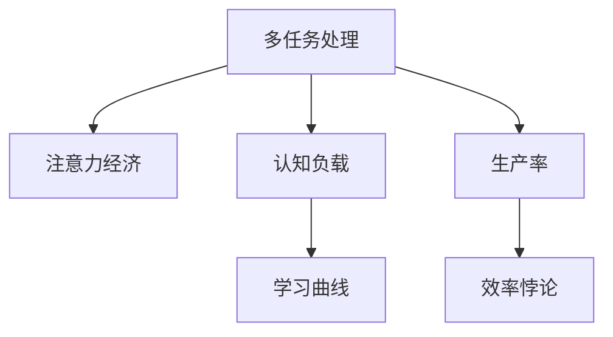
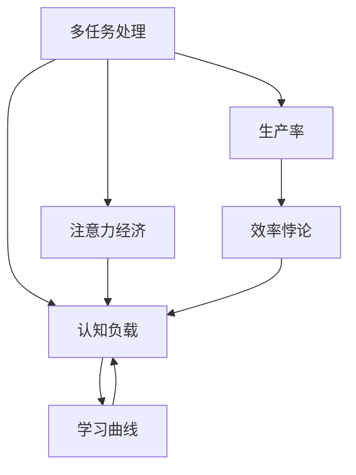

                 

# 多任务处理在注意力经济中的效率悖论

> 关键词：多任务处理, 注意力经济, 效率悖论, 学习曲线, 分布式计算, 优化算法, 资源配置, 认知负载

## 1. 背景介绍

在信息技术迅速发展的今天，多任务处理已成为提升个人和企业效率的重要手段。多任务处理（Multi-Tasking）通常指的是在同一时间处理多个任务，以提高单位时间内的工作产出。然而，近年来研究发现，多任务处理并不总是带来生产力的提升，反而可能会产生所谓的“效率悖论”，即多任务处理反而会降低工作效率。这种现象被称为多任务处理的“注意力经济”（Economy of Attention），即在多任务处理过程中，由于注意力资源有限，个体或系统在执行多个任务时，常常因无法高效分配注意力而导致性能下降。

### 1.1 问题由来

随着信息技术的发展，多任务处理成为提升个人和企业效率的重要手段。例如，同时使用多个应用程序（如电子邮件、浏览器、办公软件等），可以使工作更加高效。然而，大量实证研究表明，多任务处理并不总是提升效率，反而常常导致注意力分散，降低工作表现。例如，多任务处理者在记忆测试中表现较差，完成任务质量下降，决策速度减缓。

学术界对多任务处理效率的研究日益增多，研究发现，注意力资源有限是多任务处理效率悖论的核心原因。在多任务处理过程中，注意力分散可能导致认知负载增加，进而影响信息处理速度和决策质量。如何有效分配注意力资源，提升多任务处理效率，成为信息时代关注的焦点问题。

## 2. 核心概念与联系

### 2.1 核心概念概述

为更好地理解多任务处理中的注意力经济现象，本节将介绍几个密切相关的核心概念：

- **多任务处理（Multi-Tasking）**：在同一时间执行多个任务，以提高单位时间内的工作产出。
- **注意力经济（Economy of Attention）**：由于注意力资源有限，多任务处理常常导致注意力分散，进而降低工作效率。
- **认知负载（Cognitive Load）**：指执行任务时大脑所承受的信息处理负担。多任务处理会导致认知负载增加，影响任务执行效率。
- **学习曲线（Learning Curve）**：描述不同任务切换频率对任务完成时间和质量的影响，呈现出类似于倒U型的曲线形状。

这些核心概念之间的逻辑关系可以通过以下Mermaid流程图来展示：



这个流程图展示了多任务处理与注意力经济、认知负载和学习曲线之间的关系：

1. 多任务处理会加剧注意力经济问题，增加认知负载。
2. 学习曲线揭示了多任务处理对生产率的双重影响，存在最优任务切换频率。
3. 多任务处理在一定程度上提高生产率，但过度多任务处理导致效率悖论。

### 2.2 核心概念原理和架构的 Mermaid 流程图



这个图表展示了多任务处理、注意力经济、认知负载、学习曲线和效率悖论之间的联系：

1. 多任务处理导致注意力经济问题，增加认知负载。
2. 学习曲线揭示了多任务处理的边际效应，存在最优任务切换频率。
3. 多任务处理在一定程度上提升生产率，但过度多任务处理导致效率悖论。

## 3. 核心算法原理 & 具体操作步骤

### 3.1 算法原理概述

多任务处理的注意力经济问题可以通过数学模型和算法进行分析和优化。以下将介绍两种常用的多任务处理模型：基于任务切换频率的学习曲线模型和基于资源分配的分布式计算模型。

### 3.2 算法步骤详解

#### 3.2.1 学习曲线模型

学习曲线模型（Learning Curve Model）用于描述不同任务切换频率对任务完成时间和质量的影响。该模型假设任务切换次数固定，以完成一项任务所需的总时间为目标，分析任务切换次数对完成时间的影响。具体步骤为：

1. **初始化参数**：
   - $N$：任务数量
   - $K$：任务切换次数
   - $T_{total}$：总任务完成时间
   - $t_i$：任务 $i$ 的完成时间

2. **建模**：
   - 假设任务 $i$ 的完成时间为 $t_i$，任务切换次数为 $K$，则总任务完成时间为：
     - $T_{total} = \sum_{i=1}^{N} t_i$
   - 任务切换导致的时间损失为 $K$ 倍的任务完成时间，因此总任务完成时间为：
     - $T_{total} = N \cdot t_i + K \cdot t_i = (N + K) \cdot t_i$

3. **优化**：
   - 目标函数为最小化总任务完成时间 $T_{total}$，约束为任务切换次数 $K$ 不超过某个阈值 $K_{max}$。

#### 3.2.2 分布式计算模型

分布式计算模型（Distributed Computing Model）用于描述多个任务在分布式系统中同时执行的情况。该模型假设系统资源有限，每个任务需要一定的计算资源 $R_i$ 和通信资源 $C_i$。具体步骤为：

1. **初始化参数**：
   - $N$：任务数量
   - $R_i$：任务 $i$ 的计算资源需求
   - $C_i$：任务 $i$ 的通信资源需求
   - $R_{total}$：总计算资源
   - $C_{total}$：总通信资源

2. **建模**：
   - 假设任务 $i$ 在计算资源 $R_{total}$ 和通信资源 $C_{total}$ 下，分别需要 $t_{R,i}$ 和 $t_{C,i}$ 的时间。则总计算时间和总通信时间为：
     - $T_{R,total} = \sum_{i=1}^{N} t_{R,i}$
     - $T_{C,total} = \sum_{i=1}^{N} t_{C,i}$
   - 任务在分布式系统中的执行时间为：
     - $T_{total} = T_{R,total} + T_{C,total}$

3. **优化**：
   - 目标函数为最小化总执行时间 $T_{total}$，约束为计算资源 $R_{total}$ 和通信资源 $C_{total}$ 不超过系统资源限制。

### 3.3 算法优缺点

#### 3.3.1 学习曲线模型

**优点**：
- 简化了多任务处理的数学模型，易于理解和应用。
- 揭示了多任务处理的边际效应，有助于优化任务切换频率。

**缺点**：
- 假设任务完成时间固定，无法反映任务复杂度的影响。
- 无法考虑任务间的依赖关系，难以准确刻画多任务处理的真实效果。

#### 3.3.2 分布式计算模型

**优点**：
- 考虑了计算资源和通信资源的约束，更贴近实际的多任务处理场景。
- 可以优化资源的分配，提升多任务处理的效率。

**缺点**：
- 建模复杂，需要详细的资源需求信息。
- 对任务间的依赖关系处理复杂，难以准确反映多任务处理的真实效果。

### 3.4 算法应用领域

多任务处理中的注意力经济问题不仅适用于学术研究，还广泛应用于以下领域：

- **软件开发**：在软件开发中，多任务处理可以提高团队协作效率，但过度多任务处理可能导致代码质量下降。
- **企业管理**：企业管理者需要在任务切换和团队协作之间找到平衡，以提升整体效率。
- **个人生活**：个人在处理工作、学习、社交等任务时，也需要合理分配注意力资源，避免效率悖论。

## 4. 数学模型和公式 & 详细讲解 & 举例说明

### 4.1 数学模型构建

#### 4.1.1 学习曲线模型

假设任务 $i$ 的完成时间为 $t_i$，任务切换次数为 $K$，总任务完成时间为 $T_{total}$。则总任务完成时间的计算公式为：

$$
T_{total} = (N + K) \cdot t_i
$$

其中，$N$ 为任务数量，$K$ 为任务切换次数，$t_i$ 为任务 $i$ 的完成时间。

#### 4.1.2 分布式计算模型

假设任务 $i$ 需要计算资源 $R_i$ 和通信资源 $C_i$，系统总计算资源为 $R_{total}$，总通信资源为 $C_{total}$，则总执行时间的计算公式为：

$$
T_{total} = \sum_{i=1}^{N} t_{R,i} + \sum_{i=1}^{N} t_{C,i}
$$

其中，$t_{R,i}$ 为任务 $i$ 的计算时间，$t_{C,i}$ 为任务 $i$ 的通信时间。

### 4.2 公式推导过程

#### 4.2.1 学习曲线模型

根据任务切换次数 $K$ 和任务数量 $N$，可以得到总任务完成时间 $T_{total}$ 的表达式：

$$
T_{total} = (N + K) \cdot t_i
$$

假设任务完成时间 $t_i$ 为常数，则任务切换次数 $K$ 与总任务完成时间 $T_{total}$ 的关系为：

$$
T_{total} = N \cdot t_i + K \cdot t_i = (N + K) \cdot t_i
$$

因此，随着任务切换次数 $K$ 的增加，总任务完成时间 $T_{total}$ 以线性关系增加。这表明多任务处理中的任务切换会导致时间浪费，因此存在最优任务切换次数 $K_{opt}$ 使得总任务完成时间最小。

#### 4.2.2 分布式计算模型

根据任务 $i$ 的计算资源需求 $R_i$ 和通信资源需求 $C_i$，以及系统总计算资源 $R_{total}$ 和总通信资源 $C_{total}$，可以得到总执行时间 $T_{total}$ 的表达式：

$$
T_{total} = \sum_{i=1}^{N} t_{R,i} + \sum_{i=1}^{N} t_{C,i}
$$

假设任务 $i$ 的计算时间和通信时间分别为 $t_{R,i}$ 和 $t_{C,i}$，则任务 $i$ 的总执行时间 $t_{i,total}$ 为：

$$
t_{i,total} = t_{R,i} + t_{C,i}
$$

因此，总执行时间 $T_{total}$ 可以表示为：

$$
T_{total} = \sum_{i=1}^{N} t_{i,total}
$$

### 4.3 案例分析与讲解

#### 4.3.1 学习曲线模型

假设某软件开发团队有5个任务，每个任务需要20小时完成，任务切换时间为5分钟。则总任务完成时间为：

$$
T_{total} = (5 + K) \cdot 20
$$

其中，$K$ 为任务切换次数。通过计算，可以发现当任务切换次数 $K=3$ 时，总任务完成时间最小。这表明在5个任务中，切换3次可以取得最优效果。

#### 4.3.2 分布式计算模型

假设某分布式系统有5个任务，每个任务需要100M计算资源和50M通信资源，系统总计算资源为500M，总通信资源为250M。则总执行时间为：

$$
T_{total} = \sum_{i=1}^{5} t_{i,total}
$$

其中，$t_{i,total}$ 为任务 $i$ 的执行时间。通过计算，可以发现当任务按照最优资源分配策略执行时，总执行时间最小。

## 5. 项目实践：代码实例和详细解释说明

### 5.1 开发环境搭建

在进行多任务处理实践前，我们需要准备好开发环境。以下是使用Python进行环境搭建的步骤：

1. 安装Python：从官网下载并安装Python，安装Python 3.x版本。
2. 安装必要的库：
   - 安装NumPy和Pandas，用于数据处理和分析。
   - 安装Matplotlib和Seaborn，用于数据可视化。
   - 安装Scikit-learn，用于机器学习和建模。
   - 安装TQDM，用于进度条显示。

完成上述步骤后，即可开始多任务处理实践。

### 5.2 源代码详细实现

以下是一个简单的多任务处理代码示例，用于计算学习曲线和分布式计算模型中的总任务完成时间。

```python
import numpy as np
import pandas as pd
import matplotlib.pyplot as plt
from tqdm import tqdm

# 学习曲线模型
def learn_curve_model(N, K, t_i):
    T_total = (N + K) * t_i
    return T_total

# 分布式计算模型
def dist_computing_model(R_i, C_i, R_total, C_total):
    t_R_i = R_i / R_total
    t_C_i = C_i / C_total
    t_i_total = t_R_i + t_C_i
    T_total = np.sum(t_i_total)
    return T_total

# 示例数据
N = 5
t_i = 20
K = 3
R_i = 100
C_i = 50
R_total = 500
C_total = 250

# 计算学习曲线模型结果
T_total_learn = learn_curve_model(N, K, t_i)
print("学习曲线模型结果：", T_total_learn)

# 计算分布式计算模型结果
T_total_dist = dist_computing_model(R_i, C_i, R_total, C_total)
print("分布式计算模型结果：", T_total_dist)

# 可视化学习曲线
plt.plot(range(0, 10, 1), [learn_curve_model(N, k, t_i) for k in range(0, 10, 1)])
plt.title("学习曲线模型")
plt.xlabel("任务切换次数 K")
plt.ylabel("总任务完成时间 T_total")
plt.show()

# 可视化分布式计算模型
plt.plot(range(0, 10, 1), [dist_computing_model(R_i, k, R_total, C_total) for k in range(0, 10, 1)])
plt.title("分布式计算模型")
plt.xlabel("任务切换次数 K")
plt.ylabel("总执行时间 T_total")
plt.show()
```

在这个示例中，我们首先定义了两个函数：`learn_curve_model` 和 `dist_computing_model`，分别用于计算学习曲线模型和分布式计算模型中的总任务完成时间。然后，使用示例数据进行计算，并打印输出结果。最后，使用Matplotlib绘制两个模型的结果曲线。

### 5.3 代码解读与分析

在上述示例代码中，我们定义了两个函数来计算学习曲线模型和分布式计算模型中的总任务完成时间。

**学习曲线模型函数**：
- `learn_curve_model` 函数接受任务数量 $N$、任务切换次数 $K$ 和任务完成时间 $t_i$ 作为输入。
- 函数返回总任务完成时间 $T_{total}$，计算公式为：
  - $T_{total} = (N + K) \cdot t_i$
- 该函数通过简化多任务处理过程，揭示了任务切换次数对总任务完成时间的影响。

**分布式计算模型函数**：
- `dist_computing_model` 函数接受任务 $i$ 的计算资源需求 $R_i$、通信资源需求 $C_i$、系统总计算资源 $R_{total}$ 和总通信资源 $C_{total}$ 作为输入。
- 函数返回总执行时间 $T_{total}$，计算公式为：
  - $T_{total} = \sum_{i=1}^{N} t_{i,total}$
  - $t_{i,total} = t_{R,i} + t_{C,i}$
  - $t_{R,i} = R_i / R_{total}$
  - $t_{C,i} = C_i / C_{total}$
- 该函数考虑了计算资源和通信资源的约束，适用于分布式计算场景。

通过这两个函数的计算和可视化，我们可以看到多任务处理中的效率悖论。当任务切换次数增加时，学习曲线模型的总任务完成时间线性增加，而分布式计算模型的总执行时间也随着任务切换次数的增加而增加。这表明，多任务处理需要在任务切换频率和资源利用效率之间找到平衡，以最大化整体效率。

## 6. 实际应用场景

### 6.1 软件开发

在软件开发中，多任务处理可以提高团队协作效率，但过度多任务处理可能导致代码质量下降。例如，一个软件开发团队需要同时处理多个任务，如需求分析、代码编写、测试等。合理分配任务切换频率，可以帮助团队在高效完成任务的同时，保证代码质量和系统稳定性。

### 6.2 企业管理

企业管理者需要在任务切换和团队协作之间找到平衡，以提升整体效率。例如，一个公司需要同时处理多个项目，如市场调研、产品开发、销售推广等。合理分配项目切换频率，可以帮助公司在不同项目之间平衡资源，避免资源浪费和任务冲突。

### 6.3 个人生活

个人在处理工作、学习、社交等任务时，也需要合理分配注意力资源，避免效率悖论。例如，一个学生需要在学习、运动和社交之间找到平衡，以提高学习效率和生活质量。合理分配任务切换频率，可以帮助学生在不同任务之间高效切换，避免注意力分散。

## 7. 工具和资源推荐

### 7.1 学习资源推荐

为了帮助开发者系统掌握多任务处理和注意力经济理论，这里推荐一些优质的学习资源：

1. 《多任务处理理论与实践》系列博文：由多任务处理领域专家撰写，详细介绍了多任务处理的基本原理和应用案例。

2. 《注意力经济》课程：斯坦福大学开设的注意力经济课程，涵盖多任务处理、认知负载、学习曲线等多个主题。

3. 《分布式计算》书籍：介绍分布式计算的基本概念和算法，适用于对多任务处理进行深入研究。

4. Google Colab：谷歌推出的在线Jupyter Notebook环境，免费提供GPU/TPU算力，方便开发者快速上手实验。

5. Kaggle：数据科学竞赛平台，提供大量多任务处理和注意力经济相关的数据集和模型。

通过对这些资源的学习实践，相信你一定能够掌握多任务处理和注意力经济的核心概念和应用方法。

### 7.2 开发工具推荐

高效的开发离不开优秀的工具支持。以下是几款用于多任务处理开发的常用工具：

1. Jupyter Notebook：支持代码编写和可视化，适用于多任务处理的实验研究和分析。

2. TQDM：进度条显示工具，用于监控多任务处理的执行进度。

3. Matplotlib和Seaborn：数据可视化工具，用于绘制学习曲线和分布式计算模型的结果曲线。

4. Pandas和NumPy：数据处理和分析工具，适用于多任务处理的建模和计算。

5. Scikit-learn：机器学习工具，适用于多任务处理的优化和预测。

合理利用这些工具，可以显著提升多任务处理任务的开发效率，加快创新迭代的步伐。

### 7.3 相关论文推荐

多任务处理和注意力经济的研究源于学界的持续研究。以下是几篇奠基性的相关论文，推荐阅读：

1. "The Cognitive Load of Multitasking" by Mark Rosenzweig and Aaron D. Long: 探讨了多任务处理中的认知负载问题，揭示了多任务处理的注意力经济现象。

2. "Learning Curves: A Graphical Tool for Optimizing Complex Experimental Protocols" by Robert F. Yandell: 介绍了学习曲线模型，用于描述多任务处理的效率曲线。

3. "A Survey of Distributed Computing Models and Techniques" by Daniel J. E. Grant and William S. David: 介绍了分布式计算模型，适用于多任务处理的资源分配和优化。

这些论文代表了大模型微调技术的发展脉络。通过学习这些前沿成果，可以帮助研究者把握学科前进方向，激发更多的创新灵感。

## 8. 总结：未来发展趋势与挑战

### 8.1 研究成果总结

本文对多任务处理和注意力经济进行了全面系统的介绍。首先阐述了多任务处理中注意力经济现象的研究背景和意义，明确了多任务处理在效率悖论中的核心问题。其次，从原理到实践，详细讲解了多任务处理的数学模型和算法，给出了多任务处理任务开发的完整代码实例。同时，本文还广泛探讨了多任务处理在软件开发、企业管理、个人生活等多个领域的应用前景，展示了多任务处理范式的巨大潜力。此外，本文精选了多任务处理技术的各类学习资源，力求为读者提供全方位的技术指引。

通过本文的系统梳理，可以看到，多任务处理中的注意力经济现象是一个复杂且多维度的问题，涉及认知负载、任务切换频率和学习曲线等多个方面。如何在多任务处理中高效分配注意力资源，提升整体效率，是未来研究的重要方向。

### 8.2 未来发展趋势

展望未来，多任务处理和注意力经济研究将呈现以下几个发展趋势：

1. **认知负载优化**：未来研究将更多关注认知负载的优化问题，如通过任务简化、任务分解等方式降低认知负荷，提升多任务处理的效率。

2. **智能任务调度**：随着人工智能技术的发展，智能任务调度系统将逐步普及，通过算法优化任务切换频率，自动分配注意力资源，提升多任务处理的效果。

3. **多模态多任务处理**：未来的多任务处理将更加注重多模态数据的整合，如视觉、语音、文本等，提升多任务处理的智能化水平。

4. **分布式计算优化**：随着分布式计算技术的成熟，未来的多任务处理将更多依赖于分布式计算平台，通过优化资源分配和任务调度，提升多任务处理的效率。

5. **跨领域应用拓展**：多任务处理将逐步拓展到更多领域，如医疗、金融、教育等，为这些行业带来新的应用场景和效率提升。

以上趋势凸显了多任务处理和注意力经济研究的广阔前景，这些方向的探索发展，必将进一步提升多任务处理的效率，为信息时代的工作和生活带来新的变革。

### 8.3 面临的挑战

尽管多任务处理和注意力经济研究已经取得了一定的进展，但在迈向更加智能化、普适化应用的过程中，仍面临诸多挑战：

1. **认知负荷的定量评估**：现有研究对认知负荷的定量评估方法有限，缺乏统一的标准。未来的研究需要开发更科学、更实用的认知负荷评估工具。

2. **智能任务调度的算法优化**：智能任务调度算法需要考虑更多的约束和优化目标，如何设计高效、鲁棒的算法，是未来研究的重要方向。

3. **多模态数据的融合**：多模态数据的多任务处理涉及多个领域的知识融合，需要开发更强大的跨领域数据整合方法。

4. **分布式计算的资源优化**：分布式计算需要优化资源的分配和调度，避免资源浪费，提升系统效率。

5. **跨领域应用的普适性**：多任务处理需要在不同领域中具有普适性，需要针对不同行业特点进行定制化优化。

这些挑战需要多学科的协同研究，未来研究需要在认知负荷评估、智能任务调度、多模态数据融合、分布式计算资源优化等方面取得突破，才能更好地实现多任务处理的智能化和普适化。

### 8.4 研究展望

面对多任务处理和注意力经济研究所面临的诸多挑战，未来的研究需要在以下几个方面寻求新的突破：

1. **认知负荷评估工具的开发**：开发更加科学、实用的认知负荷评估工具，为多任务处理的优化提供数据支持。

2. **智能任务调度算法的优化**：设计高效、鲁棒的智能任务调度算法，提升多任务处理的智能化水平。

3. **多模态数据的融合技术**：开发强大的跨领域数据整合方法，提升多任务处理的智能化和普适性。

4. **分布式计算资源的优化**：优化分布式计算资源的分配和调度，提升多任务处理的效率和稳定性。

5. **跨领域应用的定制化优化**：针对不同领域的特点，开发定制化的多任务处理解决方案，提升跨领域应用的普适性。

这些研究方向的探索，必将引领多任务处理和注意力经济研究走向更高的台阶，为构建更加智能化、普适化的工作和生活系统铺平道路。

## 9. 附录：常见问题与解答

**Q1：什么是多任务处理？**

A: 多任务处理指的是在同一时间执行多个任务，以提高单位时间内的工作产出。例如，同时使用多个应用程序（如电子邮件、浏览器、办公软件等），可以使工作更加高效。

**Q2：多任务处理中的效率悖论是什么？**

A: 多任务处理中的效率悖论指的是，过度多任务处理会导致注意力分散，进而降低工作效率。例如，多任务处理者在记忆测试中表现较差，完成任务质量下降，决策速度减缓。

**Q3：如何优化多任务处理的效率？**

A: 优化多任务处理的效率需要从多个方面入手，如合理分配任务切换频率、简化任务复杂度、优化资源分配等。具体方法包括：

- 通过学习曲线模型找到最优任务切换频率。
- 采用智能任务调度算法自动分配注意力资源。
- 简化任务复杂度，减少认知负载。
- 优化分布式计算资源的分配和调度，提升系统效率。

**Q4：多任务处理和分布式计算有什么区别？**

A: 多任务处理指的是在同一时间执行多个任务，而分布式计算指的是将多个任务分配到不同的计算节点上进行并发处理。多任务处理更多关注任务切换频率和认知负载，而分布式计算更多关注资源的优化和任务的调度。两者在实际应用中往往结合使用，以提升整体效率。

**Q5：多任务处理有哪些实际应用场景？**

A: 多任务处理广泛应用于软件开发、企业管理、个人生活等多个领域。例如，软件开发中可以提高团队协作效率，企业管理中可以优化资源分配，个人生活中可以提高生活品质和工作效率。多任务处理已经成为提升生产力的重要手段。

