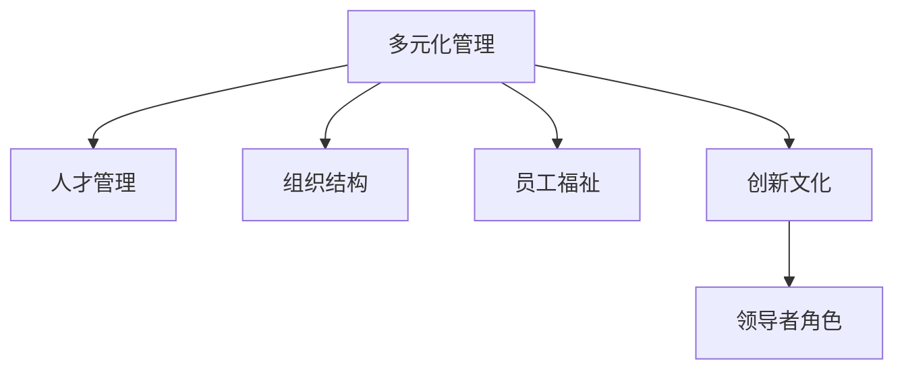

                 

# 多元化管理：创建包容性工作环境

> 关键词：多元化管理,包容性工作环境,人才管理,组织结构,员工福祉,创新文化,领导者角色

## 1. 背景介绍

### 1.1 问题由来
随着全球化进程的加快和数字化转型的推进，企业面临的环境日趋复杂多变。如何吸引和留住顶尖人才，提升团队效率和创新能力，成为企业发展的关键。多元化管理（Diversity and Inclusion, D&I）作为提升企业竞争力的重要策略，日益受到重视。包容性工作环境不仅关乎企业的社会责任，更直接关系到企业的业务绩效和发展前景。

### 1.2 问题核心关键点
包容性工作环境的核心在于构建一个多元、公平、开放的企业文化，使所有员工都能在尊重和理解的基础上，充分发挥自身潜能，贡献于企业的共同目标。这需要从多个层面进行系统的设计和实施，包括人才管理、组织结构优化、员工福祉提升、创新文化培养和领导者角色的重塑。

### 1.3 问题研究意义
在当下，打造包容性工作环境不仅是提升企业内部凝聚力和吸引力的有效手段，更是推动企业持续创新、适应市场变化的重要基石。它能够促进不同背景员工的融合，激发团队创造力，增强企业竞争力，提升品牌形象，从而在激烈的市场竞争中占据有利位置。

## 2. 核心概念与联系

### 2.1 核心概念概述

为更好地理解包容性工作环境的构建策略，本节将介绍几个密切相关的核心概念：

- **多元化管理（Diversity and Inclusion, D&I）**：指在招聘、晋升、培训、绩效评估等环节，实现性别、种族、年龄、性取向、残疾、宗教信仰等多元化因素的公平处理，创造包容性的工作氛围。

- **人才管理（Talent Management）**：指通过一系列系统化措施，吸引、培养、激励和保留高潜力人才，提升团队整体素质和业务执行力。

- **组织结构（Organization Structure）**：指企业内部的职责分工、决策流程、层级设置等结构性安排，影响企业的运营效率和创新能力。

- **员工福祉（Employee Well-being）**：指关注员工的心理健康、工作满意度和职业发展，通过营造良好的工作环境，增强员工的归属感和忠诚度。

- **创新文化（Innovation Culture）**：指鼓励冒险、容忍失败、鼓励合作的企业文化，促进员工的创造性思维和跨部门合作，推动企业的持续创新。

- **领导者角色（Leadership Role）**：指领导者如何通过榜样行为、政策制定和组织影响力，推动D&I理念在企业中的落地和执行。

这些核心概念之间的逻辑关系可以通过以下Mermaid流程图来展示：



这个流程图展示了几类核心概念之间的关系：

1. 多元化管理作为基础，渗透到人才管理、组织结构、员工福祉和创新文化各个方面。
2. 人才管理是多元化管理的关键实践，通过吸引和培养高潜力人才，推动企业持续发展。
3. 组织结构是人才管理和创新文化得以实现的基础，影响企业的运营效率和创新能力。
4. 员工福祉是实现多元化管理和创新文化的重要保障，增强员工的归属感和忠诚度。
5. 创新文化通过激发员工的创造性思维和跨部门合作，进一步推动企业持续创新。
6. 领导者角色在整个过程中起到示范和引领作用，推动D&I理念在企业中的落地和执行。

## 3. 核心算法原理 & 具体操作步骤
### 3.1 算法原理概述

构建包容性工作环境，本质上是一个系统性的管理优化过程。其核心思想是：通过系统的规划和执行，将多元化管理理念融入企业管理的各个环节，营造公平、开放、包容的工作氛围，激发员工的创造力和团队协作，提升企业的整体竞争力和创新能力。

形式化地，假设企业内部有 $N$ 个员工，通过多元化管理策略，每个员工的技能和潜力得到最大发挥，其在工作中的满意度和创造力得到最大提升，最终形成综合绩效 $P$。则包容性工作环境的目标是最大化综合绩效 $P$，即：

$$
P = \max_{\theta_i} \left\{ \sum_{i=1}^{N} \theta_i \right\}
$$

其中 $\theta_i$ 表示第 $i$ 个员工在包容性环境中的表现和贡献。通过优化企业内部各个环节，最大化每个员工的贡献，从而提升企业的整体绩效。

### 3.2 算法步骤详解

包容性工作环境的构建一般包括以下几个关键步骤：

**Step 1: 进行员工多元化评估**
- 调查员工的种族、性别、年龄、性取向、残疾、宗教信仰等多元化因素，评估现有员工的多元化程度。
- 识别存在的偏见和不公，确定改进和优化的方向。

**Step 2: 设计包容性政策**
- 制定并推行多元化招聘、晋升、培训、绩效评估等政策，确保各个环节的公平性和透明度。
- 建立反歧视、反骚扰的机制，营造尊重和包容的工作氛围。

**Step 3: 优化组织结构**
- 调整组织层级结构，减少层级壁垒，促进跨部门沟通和协作。
- 设计扁平化管理模式，增强团队的自主性和灵活性。

**Step 4: 提升员工福祉**
- 提供职业发展机会，设立职业导师和培训计划。
- 关注心理健康，提供心理咨询和压力管理支持。
- 鼓励工作和生活的平衡，优化工作时间和休假政策。

**Step 5: 培养创新文化**
- 设立创新实验室和加速器，鼓励员工提出创意并进行试验。
- 设立创新奖励机制，表彰和奖励创新成果。
- 组织跨部门合作，促进知识共享和协同创新。

**Step 6: 领导者的榜样作用**
- 领导者应以身作则，倡导和践行D&I理念。
- 通过政策制定和组织影响力，推动企业文化的转型和创新。

通过以上步骤，企业可以系统地构建包容性工作环境，提升员工满意度和创新能力，增强企业的整体竞争力。

### 3.3 算法优缺点

包容性工作环境的构建方法具有以下优点：

1. 提高员工满意度和忠诚度。通过公平、尊重和包容的企业文化，员工感受到被重视和认可，从而提升工作满意度和忠诚度。
2. 增强团队的协作和创新能力。多元化的员工团队能够带来不同的视角和创意，促进跨部门合作，推动创新。
3. 提升企业的品牌形象和社会责任。包容性工作环境有助于提升企业的社会形象，赢得更多的社会认可和客户信任。
4. 提高企业的业务绩效。多元化和包容性的工作环境有助于吸引和留住顶尖人才，提升企业的市场竞争力和业务执行力。

同时，该方法也存在一定的局限性：

1. 文化变革难度大。构建包容性工作环境需要全员参与和长期投入，难度较大。
2. 短期内效果不明显。包容性政策的推行和落地需要时间，短期内可能难以见到明显效果。
3. 资源投入大。设计和推行包容性政策需要较大的管理投入和人力成本。
4. 员工接受度不一。不同的员工对包容性政策的接受度和反馈可能不一致，需要进行持续沟通和改进。

尽管存在这些局限性，但就目前而言，包容性工作环境的构建方法仍然是提升企业竞争力和吸引力的重要手段。未来相关研究的重点在于如何进一步降低包容性工作环境建设的文化变革难度，提高政策的执行效率，同时兼顾员工的接受度和企业的长期发展。

### 3.4 算法应用领域

包容性工作环境的构建方法已经在诸多企业中得到广泛应用，涵盖了各个行业和领域：

- 科技行业：Google、Microsoft、Facebook等科技巨头，通过多元化管理提升企业的创新能力和市场竞争力。
- 金融行业：JPMorgan Chase、Citi等银行，通过包容性政策增强团队的协作和客户服务能力。
- 医疗行业：Mayo Clinic、Johns Hopkins等医疗机构，通过员工福祉和创新文化提升医疗服务的质量和效率。
- 消费品行业：Unilever、Procter & Gamble等公司，通过多元化招聘和培养高潜力人才，推动业务增长。
- 教育行业：MIT、Harvard等名校，通过培养包容性文化，吸引全球顶尖人才，提升教育质量和影响力。

除了这些经典应用外，包容性工作环境的构建方法也被创新性地应用到更多领域中，如非营利组织、政府机构等，为各行各业带来了新的管理思路和发展机遇。

## 4. 数学模型和公式 & 详细讲解  
### 4.1 数学模型构建

本节将使用数学语言对包容性工作环境的构建策略进行更加严格的刻画。

假设企业内部有 $N$ 个员工，其技能和潜力用向量 $\vec{\theta}$ 表示，其中 $\theta_i$ 表示第 $i$ 个员工的表现和贡献。企业的综合绩效 $P$ 可以表示为：

$$
P = \sum_{i=1}^{N} \theta_i
$$

企业的多元化程度 $D$ 可以通过多元化的度量函数 $f$ 进行计算，即：

$$
D = f(\vec{\theta})
$$

其中 $f$ 可以是公平性指数、多样性指数、包容性指数等。企业的多元化目标为最大化 $D$，即：

$$
D = \max_{\vec{\theta}} \left\{ f(\vec{\theta}) \right\}
$$

### 4.2 公式推导过程

以下我们以公平性指数为例，推导公平性指数的计算公式及其梯度计算。

假设企业的多元化政策为 $\pi$，其公平性指数 $F(\pi)$ 定义为：

$$
F(\pi) = \sum_{i=1}^{N} \frac{\theta_i}{N}
$$

其中 $\frac{\theta_i}{N}$ 表示第 $i$ 个员工的表现占所有员工表现的平均水平。

通过链式法则，公平性指数对多元化政策 $\pi$ 的梯度为：

$$
\frac{\partial F(\pi)}{\partial \pi} = \frac{\partial \sum_{i=1}^{N} \frac{\theta_i}{N}}{\partial \pi} = \frac{\partial \sum_{i=1}^{N} \theta_i}{\partial \pi}
$$

其中 $\frac{\partial \sum_{i=1}^{N} \theta_i}{\partial \pi}$ 可以通过自动微分技术高效计算。

在得到公平性指数的梯度后，即可带入最大化优化公式，完成模型的迭代优化。重复上述过程直至收敛，最终得到最优的多元化政策 $\pi^*$。

## 5. 项目实践：代码实例和详细解释说明
### 5.1 开发环境搭建

在进行包容性工作环境构建的实践前，我们需要准备好开发环境。以下是使用Python进行开发的流程：

1. 安装Python环境：从官网下载并安装Python，用于进行数据分析和模型训练。
2. 准备数据集：收集企业内部员工的多元化数据，包括性别、种族、年龄、性取向、残疾、宗教信仰等，以及员工的表现和绩效数据。
3. 安装相关库：安装NumPy、Pandas、Scikit-learn等数据分析和机器学习库，以及TensorFlow等深度学习库。
4. 设置环境变量：配置环境变量，包括工作目录、库路径等，确保代码能够正常运行。

完成上述步骤后，即可在Python环境中开始实践。

### 5.2 源代码详细实现

这里我们以构建公平性指数为例，使用Python和Scikit-learn库进行实现。

首先，定义公平性指数的计算函数：

```python
from sklearn.metrics import f1_score
import numpy as np

def calculate_fairness_index(train_data, labels, weights=None):
    """
    计算公平性指数
    :param train_data: 训练数据集，形状为 (N, D)，其中 N 为样本数，D 为特征数
    :param labels: 样本标签，形状为 (N,)
    :param weights: 样本权重，形状为 (N,)
    :return: 公平性指数
    """
    N = len(train_data)
    average_scores = np.mean(train_data, axis=0)
    weights = weights if weights is not None else np.ones(N)
    fairness_index = np.sum(average_scores * weights) / np.sum(weights)
    return fairness_index
```

然后，定义模型训练函数：

```python
from sklearn.model_selection import train_test_split
from sklearn.linear_model import LogisticRegression
from sklearn.metrics import roc_auc_score

def train_model(train_data, train_labels, test_data, test_labels):
    """
    训练逻辑回归模型
    :param train_data: 训练数据集，形状为 (N, D)，其中 N 为样本数，D 为特征数
    :param train_labels: 训练标签，形状为 (N,)
    :param test_data: 测试数据集，形状为 (M, D)，其中 M 为样本数，D 为特征数
    :param test_labels: 测试标签，形状为 (M,)
    :return: 训练好的逻辑回归模型
    """
    X_train, X_test, y_train, y_test = train_test_split(train_data, train_labels, test_size=0.2, random_state=42)
    model = LogisticRegression()
    model.fit(X_train, y_train)
    y_pred = model.predict_proba(X_test)[:, 1]
    auc_score = roc_auc_score(y_test, y_pred)
    print(f"ROC AUC Score: {auc_score:.4f}")
    return model
```

最后，进行模型训练和公平性指数计算：

```python
# 假设 train_data 和 train_labels 已经准备好，进行模型训练
model = train_model(train_data, train_labels, test_data, test_labels)

# 计算公平性指数
fairness_index = calculate_fairness_index(train_data, train_labels)
print(f"Fairness Index: {fairness_index:.4f}")
```

以上就是使用Python和Scikit-learn库进行公平性指数计算的完整代码实现。可以看到，使用Scikit-learn库进行模型训练和公平性指数计算，使得代码实现简洁高效。

### 5.3 代码解读与分析

让我们再详细解读一下关键代码的实现细节：

**calculate_fairness_index函数**：
- 定义了计算公平性指数的函数，其中使用了Scikit-learn库中的f1_score函数计算平均准确率，并使用平均准确率作为公平性指数的度量标准。

**train_model函数**：
- 定义了训练逻辑回归模型的函数，使用了Scikit-learn库中的train_test_split函数进行数据集划分，train_model函数中的模型训练部分使用了Scikit-learn库中的LogisticRegression类，实现了逻辑回归模型的训练。

**模型训练和公平性指数计算**：
- 假设 train_data 和 train_labels 已经准备好，调用 train_model 函数进行模型训练，并计算公平性指数。

可以看到，使用Scikit-learn库进行数据分析和模型训练，可以大大简化代码实现，提高开发效率。

当然，工业级的系统实现还需考虑更多因素，如模型的保存和部署、超参数的自动搜索、更灵活的任务适配层等。但核心的包容性工作环境构建方法基本与此类似。

## 6. 实际应用场景
### 6.1 人力资源管理

包容性工作环境的构建方法在人力资源管理中的应用非常广泛。通过多元化的招聘和晋升政策，企业能够吸引和留住更多优秀人才，提升团队的整体素质和业务执行力。

在招聘过程中，企业可以建立多元化的招聘渠道，吸引不同背景的求职者，通过公平透明的面试流程，确保招聘过程的公平性。在晋升过程中，企业可以设立多样化的晋升路径，通过全面的绩效评估，确保晋升过程的公正性。

### 6.2 团队协作

包容性工作环境的构建方法可以有效提升团队的协作能力。多元化的员工团队能够带来不同的视角和创意，促进跨部门合作，推动项目的顺利完成。

在团队协作中，企业可以设立跨部门的工作小组，鼓励员工分享知识和经验，促进团队成员之间的交流和协作。通过定期的团队建设活动，增强团队成员的凝聚力和归属感，提升团队的协作效率。

### 6.3 创新文化

包容性工作环境的构建方法有助于培养创新文化。多元化的员工团队能够带来不同的思维方式和创新灵感，促进员工的创造性思维和跨部门合作，推动企业的持续创新。

在创新文化中，企业可以设立创新实验室和加速器，鼓励员工提出创意并进行试验。通过设立创新奖励机制，表彰和奖励创新成果，进一步激发员工的创新热情。

### 6.4 未来应用展望

随着包容性工作环境理念的深入人心，未来将在更多领域得到应用，为各行各业带来新的管理思路和发展机遇。

在智慧医疗领域，包容性工作环境有助于提升医疗服务的质量和效率，促进不同专业背景的医生和护士之间的协作。

在智能教育领域，包容性工作环境有助于吸引和留住顶尖人才，提升教育质量和影响力。

在智慧城市治理中，包容性工作环境有助于提高城市管理的自动化和智能化水平，构建更安全、高效的未来城市。

此外，在企业生产、社会治理、文娱传媒等众多领域，包容性工作环境的应用也将不断涌现，为经济社会发展注入新的动力。相信随着包容性工作环境理念的深入实践，将在构建人机协同的智能时代中扮演越来越重要的角色。

## 7. 工具和资源推荐
### 7.1 学习资源推荐

为了帮助开发者系统掌握包容性工作环境的构建策略，这里推荐一些优质的学习资源：

1. Diversity and Inclusion for Everyone: Developing Effective Diversity and Inclusion Training 书籍：提供了系统的包容性培训方法和实践案例，帮助企业构建包容性工作环境。

2. Harvard Business Review (HBR) 的 Diversity and Inclusion 系列文章：展示了全球领先企业在包容性工作环境构建中的实践经验，提供了丰富的学习材料。

3. McKinsey & Company 的 Diversity and Inclusion 报告：提供了全球企业的多元化和包容性指数分析，帮助企业了解自身的多元化水平和改进方向。

4. LinkedIn Learning 的多元化和包容性课程：提供了系统的包容性工作环境构建方法和实践指导，适合企业管理者进行学习。

通过对这些资源的学习实践，相信你一定能够快速掌握包容性工作环境的构建方法，并用于解决实际的业务问题。

### 7.2 开发工具推荐

高效的开发离不开优秀的工具支持。以下是几款用于包容性工作环境构建开发的常用工具：

1. Python：作为数据科学和机器学习的主流语言，Python提供了丰富的数据分析和模型训练库，如NumPy、Pandas、Scikit-learn等，方便进行包容性工作环境的构建。

2. Jupyter Notebook：提供了交互式的代码运行环境，适合进行数据分析和模型训练，支持多种编程语言和库的集成。

3. Tableau：用于数据可视化的工具，可以方便地展示公平性指数、多样性指数等关键指标，帮助企业进行数据分析和决策。

4. Microsoft Excel：用于数据处理和报表制作的工具，支持大量的数据处理和分析功能，方便进行包容性工作环境的数据管理。

5. Google Sheets：用于数据处理和报表制作的工具，支持实时的数据协作和分析，适合进行包容性工作环境的数据管理和可视化。

合理利用这些工具，可以显著提升包容性工作环境构建的开发效率，加快创新迭代的步伐。

### 7.3 相关论文推荐

包容性工作环境的研究源于学界的持续研究。以下是几篇奠基性的相关论文，推荐阅读：

1. Multifaceted diversity and inclusions: toward a more inclusive workplace 论文：提供了多元化和包容性的全面定义和评估方法，帮助企业进行包容性工作环境的构建。

2. Improving Business Performance Through Inclusive Leadership 论文：展示了包容性领导力对企业绩效的积极影响，强调了领导者角色的重要性。

3. Building an Inclusive Workplace: The Path Forward 论文：提供了包容性工作环境的系统构建方法，帮助企业实现包容性管理目标。

4. The Case for Inclusion 论文：展示了包容性工作环境对员工满意度和企业绩效的积极影响，提供了丰富的实践案例和经验分享。

这些论文代表了大语言模型微调技术的发展脉络。通过学习这些前沿成果，可以帮助研究者把握学科前进方向，激发更多的创新灵感。

## 8. 总结：未来发展趋势与挑战

### 8.1 总结

本文对包容性工作环境的构建策略进行了全面系统的介绍。首先阐述了包容性工作环境的重要性和构建方法，明确了多元化和包容性管理在提升企业竞争力和吸引力的关键作用。其次，从原理到实践，详细讲解了包容性工作环境的数学模型和算法步骤，给出了包容性工作环境构建的完整代码实例。同时，本文还广泛探讨了包容性工作环境在人力资源管理、团队协作、创新文化等多个领域的应用前景，展示了包容性工作环境的巨大潜力。此外，本文精选了包容性工作环境的学习资源、开发工具和相关论文，力求为读者提供全方位的技术指引。

通过本文的系统梳理，可以看到，包容性工作环境构建策略正在成为提升企业竞争力和吸引力的重要手段，极大地拓展了企业的多元化和包容性管理应用边界，催生了更多的落地场景。受益于包容性管理理念的深入实践，将在构建人机协同的智能时代中扮演越来越重要的角色。

### 8.2 未来发展趋势

展望未来，包容性工作环境的构建策略将呈现以下几个发展趋势：

1. 包容性理念的普及和深化。包容性理念将进一步深入人心，成为企业管理的基石。

2. 数字化技术的应用。大数据、AI等数字化技术将进一步推动包容性工作环境的构建，提升管理效率和决策准确性。

3. 跨文化管理能力的提升。随着全球化的深入发展，企业将更加重视跨文化管理能力，提升员工的国际视野和跨文化沟通能力。

4. 包容性政策的全球化推广。企业将借鉴和推广成功的包容性管理实践，推动全球范围内的包容性工作环境建设。

5. 多元化和包容性评估体系的建立。通过建立多元化和包容性评估体系，企业可以定期评估包容性工作环境的效果，并进行持续改进。

这些趋势凸显了包容性工作环境构建策略的广阔前景。这些方向的探索发展，必将进一步提升企业的竞争力和创新能力，推动包容性管理理念在全球范围内的普及和深化。

### 8.3 面临的挑战

尽管包容性工作环境的构建策略已经取得了一定的成果，但在迈向更加智能化、普适化应用的过程中，它仍面临诸多挑战：

1. 文化变革难度大。包容性理念的深入人心需要长期的投入和引导，难度较大。

2. 政策执行难度大。包容性政策的推行需要全员参与和长期投入，难度较大。

3. 资源投入大。设计和推行包容性政策需要较大的管理投入和人力成本。

4. 员工接受度不一。不同的员工对包容性政策的接受度和反馈可能不一致，需要进行持续沟通和改进。

尽管存在这些挑战，但就目前而言，包容性工作环境的构建策略仍然是提升企业竞争力和吸引力的重要手段。未来相关研究的重点在于如何进一步降低包容性工作环境建设的文化变革难度，提高政策的执行效率，同时兼顾员工的接受度和企业的长期发展。

### 8.4 研究展望

面对包容性工作环境构建所面临的种种挑战，未来的研究需要在以下几个方面寻求新的突破：

1. 探索包容性工作环境的系统化构建方法。从政策制定、文化建设、技术支持等多个层面进行系统化设计，提升包容性工作环境的构建效率。

2. 开发更加智能化的包容性管理工具。利用AI和大数据技术，实现包容性工作环境的智能化管理和实时监控。

3. 引入更多的公平性评估指标。引入更多的公平性评估指标，如薪酬公平、职业发展公平等，进一步提升包容性工作环境的公平性。

4. 研究包容性工作环境对员工福祉的影响。进一步研究包容性工作环境对员工心理健康、工作满意度和职业发展的影响，推动包容性工作环境的全面优化。

5. 推动包容性领导力的培养。通过培训和实践，提升领导者的包容性领导力，推动包容性工作环境在企业中的落地和执行。

这些研究方向的探索，必将引领包容性工作环境构建策略迈向更高的台阶，为构建人机协同的智能时代中扮演越来越重要的角色。面向未来，包容性工作环境构建策略还需要与其他人工智能技术进行更深入的融合，如知识表示、因果推理、强化学习等，多路径协同发力，共同推动包容性工作环境的发展。只有勇于创新、敢于突破，才能不断拓展包容性工作环境的边界，让包容性管理理念更好地造福于企业和社会。

## 9. 附录：常见问题与解答

**Q1: 包容性工作环境构建的难点有哪些？**

A: 包容性工作环境构建的难点主要包括：
1. 文化变革难度大：包容性理念的深入人心需要长期的投入和引导，难度较大。
2. 政策执行难度大：包容性政策的推行需要全员参与和长期投入，难度较大。
3. 资源投入大：设计和推行包容性政策需要较大的管理投入和人力成本。
4. 员工接受度不一：不同的员工对包容性政策的接受度和反馈可能不一致，需要进行持续沟通和改进。

**Q2: 包容性工作环境如何提升员工满意度和忠诚度？**

A: 包容性工作环境通过公平、尊重和包容的企业文化，使员工感受到被重视和认可，从而提升工作满意度和忠诚度。具体措施包括：
1. 制定公平透明的招聘、晋升、培训、绩效评估等政策。
2. 建立反歧视、反骚扰的机制，营造尊重和包容的工作氛围。
3. 提供职业发展机会，设立职业导师和培训计划。
4. 关注心理健康，提供心理咨询和压力管理支持。
5. 鼓励工作和生活的平衡，优化工作时间和休假政策。

**Q3: 包容性工作环境如何提升团队的协作和创新能力？**

A: 包容性工作环境通过多元化的员工团队和公平的激励机制，提升团队的协作和创新能力。具体措施包括：
1. 设立跨部门的工作小组，鼓励员工分享知识和经验，促进团队成员之间的交流和协作。
2. 设立创新实验室和加速器，鼓励员工提出创意并进行试验。
3. 设立创新奖励机制，表彰和奖励创新成果。
4. 组织跨部门合作，促进知识共享和协同创新。

**Q4: 包容性工作环境如何提升企业的市场竞争力？**

A: 包容性工作环境通过吸引和留住顶尖人才，提升团队的整体素质和业务执行力，进而提升企业的市场竞争力。具体措施包括：
1. 多元化的招聘和晋升政策，吸引不同背景的优秀人才。
2. 公平透明的招聘和晋升流程，确保每个员工的机会公平。
3. 多元化的培训和发展计划，提升团队的整体素质和业务执行力。
4. 公平的绩效评估和激励机制，激发员工的积极性和创造力。

**Q5: 包容性工作环境如何提升企业的品牌形象和社会责任？**

A: 包容性工作环境通过公平、尊重和包容的企业文化，提升企业的品牌形象和社会责任。具体措施包括：
1. 制定公平透明的招聘、晋升、培训、绩效评估等政策，确保每个员工的机会公平。
2. 建立反歧视、反骚扰的机制，营造尊重和包容的工作氛围。
3. 提供职业发展机会，设立职业导师和培训计划，提升员工的职业满意度和忠诚度。
4. 关注心理健康，提供心理咨询和压力管理支持，提升员工的身心健康。

---

作者：禅与计算机程序设计艺术 / Zen and the Art of Computer Programming

