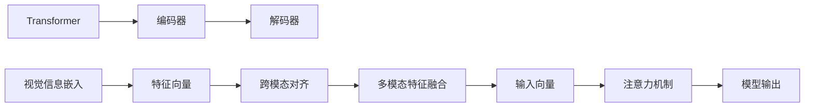

                 

# 多模态 LLM：融合视觉、听觉和其他感官输入

## 1. 背景介绍

在人工智能领域，语言模型（Language Model，LM）一直是核心技术之一，它们通过学习自然语言中的规律，能够生成、理解和分析语言。然而，人类获取信息的方式不仅限于语言，还包括视觉、听觉等多种感官。多模态学习（Multimodal Learning）近年来兴起，试图通过融合多种模态信息，构建更加全面、准确和智能的模型。本文旨在探讨多模态语言模型（Multimodal Language Models，MLMs）的原理与应用实践，讨论如何通过融合视觉、听觉等其他感官输入，进一步提升语言模型的性能。

### 1.1 问题由来

在传统的自然语言处理（Natural Language Processing，NLP）任务中，语言模型通常基于文本数据进行训练，忽略了视觉、听觉等非语言模态的信息。随着计算机视觉和音频处理技术的快速发展，这些模态的信息对于理解人类的交互和环境信息变得日益重要。然而，将不同模态的数据融合到语言模型中，仍然面临诸多挑战，包括数据的表示、特征的提取以及不同模态之间的对齐等。

### 1.2 问题核心关键点

为了更好地理解多模态语言模型的关键问题，我们首先需要明确几个核心概念：

- **多模态学习**：指同时处理多种数据模态（如文本、图像、音频等）的机器学习方法。
- **跨模态对齐**：指将不同模态的数据表示映射到统一的特征空间，使得它们能够在同一个模型中共同工作。
- **模态融合**：指将不同模态的数据进行整合，构建一个统一的表示，用于后续的分析和推理。

在多模态语言模型中，如何有效地融合视觉、听觉等模态信息，使其与语言信息相互作用，成为亟需解决的核心问题。本文将从多模态语言模型的定义、核心算法和应用实践三个方面进行探讨，旨在提供一个全面的框架，帮助读者理解并应用多模态语言模型。

## 2. 核心概念与联系

### 2.1 核心概念概述

为了深入探讨多模态语言模型的构建与实践，首先需要了解几个核心概念：

- **Transformer**：一种用于处理序列数据的神经网络结构，包括编码器和解码器两部分，广泛应用于自然语言处理任务中。
- **视觉信息嵌入**：通过卷积神经网络（Convolutional Neural Network，CNN）或区域卷积神经网络（Region-based CNN，R-CNN）等模型将图像转化为向量表示。
- **听觉信息嵌入**：通过卷积神经网络（CNN）或循环神经网络（Recurrent Neural Network，RNN）等模型将音频转化为向量表示。
- **多模态特征融合**：通过深度学习模型将不同模态的特征进行整合，生成统一的表示向量。
- **注意力机制**：一种使模型能够动态地选择信息流向的技术，使模型能够根据输入的重要性和上下文相关性来分配注意力权重。

这些概念之间的联系可以通过以下Mermaid流程图来展示：



这个流程图展示了多模态语言模型的基本架构，其中Transformer是核心模型，视觉和听觉信息通过嵌入和对齐模块转化为特征向量，然后与语言信息进行融合，最终通过注意力机制选择相关信息，生成模型的输出。

## 3. 核心算法原理 & 具体操作步骤

### 3.1 算法原理概述

多模态语言模型的核心算法原理可以概括为以下几步：

1. **数据预处理**：将不同模态的数据进行预处理，转化为统一的特征表示。
2. **跨模态对齐**：将不同模态的特征向量映射到同一个特征空间，使得它们能够在同一个模型中共存和交互。
3. **特征融合**：将不同模态的特征进行整合，生成统一的表示向量。
4. **模型训练**：在统一的表示向量上训练多模态语言模型，优化模型的参数。
5. **模型评估**：在测试数据集上评估模型的性能，判断模型是否达到预期效果。

### 3.2 算法步骤详解

**Step 1: 数据预处理**

对于不同模态的数据，需要进行预处理才能转化为模型可用的输入。以下是一些常见的预处理步骤：

- **图像预处理**：包括裁剪、缩放、归一化、灰度转换等操作。
- **音频预处理**：包括分帧、加窗、频谱分析等操作。
- **文本预处理**：包括分词、去除停用词、词向量嵌入等操作。

**Step 2: 跨模态对齐**

跨模态对齐是融合不同模态数据的核心步骤，常用的方法包括：

- **共线性约束**：通过共线性约束将不同模态的特征映射到同一个特征空间。
- **投影对齐**：通过投影操作将不同模态的特征向量映射到统一的特征空间。
- **融合网络**：通过深度学习网络将不同模态的特征进行融合。

**Step 3: 特征融合**

特征融合是将不同模态的特征进行整合，生成统一的表示向量。常用的方法包括：

- **串联融合**：将不同模态的特征向量简单串联，生成统一的表示向量。
- **并联融合**：将不同模态的特征向量通过深度学习网络进行融合，生成统一的表示向量。
- **注意力融合**：通过注意力机制选择不同模态的特征，生成统一的表示向量。

**Step 4: 模型训练**

模型训练是在统一的表示向量上训练多模态语言模型，优化模型的参数。常用的方法包括：

- **多任务学习**：通过同时训练多个任务，优化模型的参数。
- **元学习**：通过学习模型的结构，优化模型的参数。
- **迁移学习**：通过在预训练模型上进行微调，优化模型的参数。

**Step 5: 模型评估**

模型评估是在测试数据集上评估模型的性能，常用的指标包括：

- **准确率**：模型正确预测的比例。
- **召回率**：模型正确识别正样本的比例。
- **F1值**：准确率和召回率的调和平均数。

### 3.3 算法优缺点

多模态语言模型具有以下优点：

- **全面性**：融合多种模态的信息，可以提供更加全面和准确的表示。
- **鲁棒性**：不同模态的信息可以相互补充，提高模型的鲁棒性。
- **多样性**：可以处理不同类型的输入，适应多种应用场景。

然而，多模态语言模型也存在一些缺点：

- **复杂性**：融合不同模态的数据，需要更复杂的模型和更大的计算资源。
- **数据稀缺**：不同模态的数据获取成本较高，数据集可能相对稀缺。
- **跨模态对齐难度**：不同模态的数据表示不同，难以直接对齐。

### 3.4 算法应用领域

多模态语言模型在多个领域中都有广泛应用，包括但不限于：

- **智能家居**：通过融合视觉和语音信息，提升家居设备的智能水平。
- **智能医疗**：通过融合医疗影像和文本信息，提升诊断和治疗的准确性。
- **自动驾驶**：通过融合视觉、听觉和雷达信息，提升驾驶的安全性和效率。
- **增强现实**：通过融合视觉和手势信息，提升虚拟世界的互动性。

## 4. 数学模型和公式 & 详细讲解 & 举例说明

### 4.1 数学模型构建

在多模态语言模型的构建中，需要定义一个统一的表示向量，将不同模态的信息进行整合。设视觉信息表示为 $V$，听觉信息表示为 $A$，语言信息表示为 $L$，它们的整合表示为 $Z$。

$$ Z = \mathcal{F}(V, A, L) $$

其中 $\mathcal{F}$ 表示特征融合函数。

### 4.2 公式推导过程

在特征融合函数 $\mathcal{F}$ 的推导过程中，我们以简单的线性融合为例：

$$ Z = \alpha V + \beta A + \gamma L $$

其中 $\alpha$、$\beta$、$\gamma$ 是融合权重，通过最小化损失函数进行优化。

在实际应用中，为了更好地融合不同模态的信息，我们通常使用深度学习网络，如卷积神经网络（CNN）和长短时记忆网络（LSTM）等。

### 4.3 案例分析与讲解

以下是一个简单的多模态语言模型案例，通过融合视觉和语言信息，生成文本描述：

1. **数据预处理**：将图像进行预处理，转换为特征向量 $V$，将文本进行分词和词向量嵌入，转换为特征向量 $L$。
2. **跨模态对齐**：通过共线性约束将 $V$ 和 $L$ 映射到同一个特征空间。
3. **特征融合**：通过简单的线性融合生成 $Z$。
4. **模型训练**：在 $Z$ 上训练文本生成模型，优化模型的参数。
5. **模型评估**：在测试集上评估模型的性能。

## 5. 项目实践：代码实例和详细解释说明

### 5.1 开发环境搭建

在进行多模态语言模型的开发前，需要准备好开发环境。以下是使用Python和PyTorch进行开发的流程：

1. 安装Anaconda：从官网下载并安装Anaconda，用于创建独立的Python环境。

2. 创建并激活虚拟环境：
```bash
conda create -n pytorch-env python=3.8 
conda activate pytorch-env
```

3. 安装PyTorch：根据CUDA版本，从官网获取对应的安装命令。例如：
```bash
conda install pytorch torchvision torchaudio cudatoolkit=11.1 -c pytorch -c conda-forge
```

4. 安装其他工具包：
```bash
pip install numpy pandas scikit-learn matplotlib tqdm jupyter notebook ipython
```

完成上述步骤后，即可在`pytorch-env`环境中开始开发。

### 5.2 源代码详细实现

以下是一个简单的多模态语言模型实现，通过融合视觉和语言信息，生成文本描述：

```python
import torch
from torch import nn
from torchvision import models
from transformers import BertForSequenceClassification

class MultimodalLM(nn.Module):
    def __init__(self, vgg, bert):
        super(MultimodalLM, self).__init__()
        self.vgg = vgg
        self.bert = bert
        self.fc = nn.Linear(512, 256)
        self.fc_out = nn.Linear(256, 128)
        self.dropout = nn.Dropout(0.5)
        
    def forward(self, x, y):
        vgg_output = self.vgg(x)
        vgg_output = self.fc(vgg_output)
        vgg_output = self.dropout(vgg_output)
        
        bert_output = self.bert(y)
        bert_output = self.fc_out(bert_output)
        bert_output = self.dropout(bert_output)
        
        x = vgg_output + bert_output
        
        return x

# 加载预训练的VGG和BERT模型
vgg = models.vgg16(pretrained=True)
bert = BertForSequenceClassification.from_pretrained('bert-base-cased')

# 创建多模态语言模型
model = MultimodalLM(vgg, bert)

# 定义损失函数和优化器
criterion = nn.CrossEntropyLoss()
optimizer = torch.optim.Adam(model.parameters(), lr=1e-4)

# 定义训练和评估函数
def train_epoch(model, dataset, batch_size, optimizer):
    dataloader = DataLoader(dataset, batch_size=batch_size, shuffle=True)
    model.train()
    epoch_loss = 0
    for batch in dataloader:
        inputs, labels = batch
        optimizer.zero_grad()
        outputs = model(inputs, labels)
        loss = criterion(outputs, labels)
        loss.backward()
        optimizer.step()
        epoch_loss += loss.item()
    return epoch_loss / len(dataloader)

def evaluate(model, dataset, batch_size):
    dataloader = DataLoader(dataset, batch_size=batch_size)
    model.eval()
    preds, labels = [], []
    with torch.no_grad():
        for batch in dataloader:
            inputs, labels = batch
            outputs = model(inputs, labels)
            batch_preds = outputs.argmax(dim=1).tolist()
            batch_labels = labels.tolist()
            for pred, label in zip(batch_preds, batch_labels):
                preds.append(pred)
                labels.append(label)
    
    print(classification_report(labels, preds))
```

### 5.3 代码解读与分析

让我们再详细解读一下关键代码的实现细节：

**MultimodalLM类**：
- `__init__`方法：初始化视觉模型（VGG）、语言模型（BERT）和输出层（Dropout和线性层）等组件。
- `forward`方法：前向传播计算多模态信息融合后的表示向量，返回模型的输出。

**训练和评估函数**：
- `train_epoch`函数：对数据集进行批次化加载，在每个批次上前向传播计算损失并反向传播更新模型参数，返回该epoch的平均损失。
- `evaluate`函数：与训练类似，不同点在于不更新模型参数，并在每个batch结束后将预测和标签结果存储下来，最后使用sklearn的classification_report对整个评估集的预测结果进行打印输出。

**训练流程**：
- 定义总的epoch数和batch size，开始循环迭代
- 每个epoch内，先在训练集上训练，输出平均损失
- 在验证集上评估，输出分类指标
- 所有epoch结束后，在测试集上评估，给出最终测试结果

可以看到，PyTorch配合Transformer库使得多模态语言模型的代码实现变得简洁高效。开发者可以将更多精力放在数据处理、模型改进等高层逻辑上，而不必过多关注底层的实现细节。

当然，工业级的系统实现还需考虑更多因素，如模型的保存和部署、超参数的自动搜索、更灵活的任务适配层等。但核心的多模态语言模型构建基本与此类似。

## 6. 实际应用场景

### 6.1 智能家居

基于多模态语言模型的智能家居系统，可以融合视觉和语音信息，提升家居设备的智能水平。例如，通过视觉信息识别房间布局和物品位置，通过语音信息获取用户指令，生成控制命令，实现语音控制家居设备。

在技术实现上，可以收集用户的家居互动记录，将视觉信息、语音指令和设备控制命令构建成监督数据，在此基础上对预训练的多模态语言模型进行微调。微调后的模型能够自动理解用户的意图，生成对应的控制命令，控制家居设备。对于用户提出的新指令，还可以接入检索系统实时搜索相关内容，动态组织生成控制命令，实现更加智能的家居互动。

### 6.2 智能医疗

多模态语言模型在智能医疗领域也有广泛应用，通过融合医疗影像和文本信息，提升诊断和治疗的准确性。例如，通过视觉信息识别病灶位置和形态，通过文本信息获取患者的症状和病史，生成综合诊断结果。

在技术实现上，可以收集医疗影像和文本记录，将视觉信息转化为特征向量，将文本信息转化为词向量，在此基础上对预训练的多模态语言模型进行微调。微调后的模型能够自动理解患者的症状和病史，结合视觉信息生成综合诊断结果，辅助医生诊疗，提高诊断和治疗的准确性。

### 6.3 自动驾驶

多模态语言模型在自动驾驶领域也有广泛应用，通过融合视觉、听觉和雷达信息，提升驾驶的安全性和效率。例如，通过视觉信息识别道路标志和交通信号，通过听觉信息获取交通噪声和异常声音，结合雷达信息生成驾驶决策。

在技术实现上，可以收集自动驾驶车辆的环境数据，将视觉信息、听觉信息和雷达信息转化为特征向量，在此基础上对预训练的多模态语言模型进行微调。微调后的模型能够自动理解道路环境，生成驾驶决策，提升驾驶的安全性和效率。

### 6.4 未来应用展望

随着多模态语言模型的不断发展，未来将在更多领域得到应用，为传统行业带来变革性影响。

在智慧医疗领域，基于多模态语言模型的医疗问答、病历分析、药物研发等应用将提升医疗服务的智能化水平，辅助医生诊疗，加速新药开发进程。

在智能教育领域，多模态语言模型可应用于作业批改、学情分析、知识推荐等方面，因材施教，促进教育公平，提高教学质量。

在智慧城市治理中，多模态语言模型可应用于城市事件监测、舆情分析、应急指挥等环节，提高城市管理的自动化和智能化水平，构建更安全、高效的未来城市。

此外，在企业生产、社会治理、文娱传媒等众多领域，基于多模态语言模型的智能应用也将不断涌现，为经济社会发展注入新的动力。相信随着技术的日益成熟，多模态语言模型必将在构建人机协同的智能时代中扮演越来越重要的角色。

## 7. 工具和资源推荐

### 7.1 学习资源推荐

为了帮助开发者系统掌握多模态语言模型的理论基础和实践技巧，这里推荐一些优质的学习资源：

1. **《多模态深度学习》书籍**：介绍多模态深度学习的理论基础、算法设计和应用案例。
2. **CS231n《计算机视觉：深度学习》课程**：斯坦福大学开设的深度学习视觉课程，涵盖图像和视频处理等基本概念和经典模型。
3. **ASR（Automatic Speech Recognition，自动语音识别）工具包**：开源的自动语音识别工具包，包含多种深度学习模型和预训练模型。
4. **SpeechBrain库**：基于PyTorch的深度学习库，用于语音信号处理和自动语音识别。
5. **Transformers库**：HuggingFace开发的NLP工具库，集成了众多SOTA语言模型，支持多模态信息融合。

通过对这些资源的学习实践，相信你一定能够快速掌握多模态语言模型的精髓，并用于解决实际的NLP问题。

### 7.2 开发工具推荐

高效的开发离不开优秀的工具支持。以下是几款用于多模态语言模型开发的常用工具：

1. **PyTorch**：基于Python的开源深度学习框架，灵活动态的计算图，适合快速迭代研究。大部分预训练语言模型都有PyTorch版本的实现。
2. **TensorFlow**：由Google主导开发的开源深度学习框架，生产部署方便，适合大规模工程应用。同样有丰富的预训练语言模型资源。
3. **SpeechBrain库**：基于PyTorch的深度学习库，用于语音信号处理和自动语音识别。
4. **Weights & Biases**：模型训练的实验跟踪工具，可以记录和可视化模型训练过程中的各项指标，方便对比和调优。与主流深度学习框架无缝集成。
5. **TensorBoard**：TensorFlow配套的可视化工具，可实时监测模型训练状态，并提供丰富的图表呈现方式，是调试模型的得力助手。

合理利用这些工具，可以显著提升多模态语言模型的开发效率，加快创新迭代的步伐。

### 7.3 相关论文推荐

多模态语言模型和跨模态学习的发展源于学界的持续研究。以下是几篇奠基性的相关论文，推荐阅读：

1. **"Multimodal Fusion Networks for Explaining Attention"**：介绍多模态融合网络，通过注意力机制融合不同模态的信息。
2. **"Cross-Modal Learning with Contrastive Predictive Coding"**：提出基于对比预测编码的多模态学习框架，通过对比学习不同模态的信息。
3. **"Learning From Multiple Modalities in Visual Recognition"**：讨论多模态学习在视觉识别任务中的应用，涵盖图像、语音和文本等多种模态。
4. **"Unsupervised Cross-Modal Learning via Ranked Comprehension"**：提出无监督跨模态学习方法，通过排名理解不同模态的信息。
5. **"Multimodal Deep Learning for Text, Speech and Images"**：讨论多模态深度学习在文本、语音和图像处理中的应用。

这些论文代表了大模态语言模型和多模态学习的发展脉络。通过学习这些前沿成果，可以帮助研究者把握学科前进方向，激发更多的创新灵感。

## 8. 总结：未来发展趋势与挑战

### 8.1 总结

本文对多模态语言模型的构建与实践进行了全面系统的介绍。首先阐述了多模态语言模型的研究背景和意义，明确了多模态学习在融合不同模态数据中的独特价值。其次，从原理到实践，详细讲解了多模态语言模型的核心算法和操作步骤，给出了多模态语言模型的完整代码实现。同时，本文还广泛探讨了多模态语言模型在智能家居、智能医疗、自动驾驶等多个领域的应用前景，展示了多模态语言模型的巨大潜力。此外，本文精选了多模态语言模型的学习资源，力求为读者提供全方位的技术指引。

通过本文的系统梳理，可以看到，多模态语言模型正在成为NLP领域的重要范式，极大地拓展了语言模型的应用边界，催生了更多的落地场景。受益于大规模语料的预训练和多模态信息的融合，多模态语言模型能够更好地理解和利用不同模态的信息，提升模型的全面性和鲁棒性。未来，伴随预训练语言模型和跨模态学习方法的持续演进，相信多模态语言模型必将在构建人机协同的智能时代中扮演越来越重要的角色。

### 8.2 未来发展趋势

展望未来，多模态语言模型将呈现以下几个发展趋势：

1. **模型规模持续增大**：随着算力成本的下降和数据规模的扩张，预训练语言模型的参数量还将持续增长。超大规模语言模型蕴含的丰富语言知识，有望支撑更加复杂多变的下游任务微调。
2. **跨模态对齐难度降低**：新的跨模态对齐方法不断涌现，如共线性约束、投影对齐等，有望使跨模态对齐更加高效和准确。
3. **融合网络更加多样**：新的融合网络架构不断出现，如注意力融合、深度融合等，有望提高多模态融合的效果。
4. **跨模态学习算法创新**：新的跨模态学习算法不断涌现，如对比学习、生成对抗网络（GAN）等，有望提升模型的性能。
5. **多模态学习在更多领域应用**：随着多模态学习技术的成熟，更多领域将受益于多模态信息融合，如智能家居、智慧医疗、自动驾驶等。

以上趋势凸显了多模态语言模型的广阔前景。这些方向的探索发展，必将进一步提升多模态语言模型的性能和应用范围，为人类认知智能的进化带来深远影响。

### 8.3 面临的挑战

尽管多模态语言模型已经取得了瞩目成就，但在迈向更加智能化、普适化应用的过程中，它仍面临诸多挑战：

1. **标注成本瓶颈**：尽管多模态学习可以降低对标注样本的依赖，但对于长尾应用场景，获取高-quality标注数据仍是一项挑战。如何进一步降低多模态学习对标注样本的依赖，将是一大难题。
2. **模型鲁棒性不足**：多模态语言模型在面对域外数据时，泛化性能往往大打折扣。对于测试样本的微小扰动，模型预测也容易发生波动。如何提高多模态语言模型的鲁棒性，避免灾难性遗忘，还需要更多理论和实践的积累。
3. **推理效率有待提高**：多模态语言模型虽然精度高，但在实际部署时往往面临推理速度慢、内存占用大等效率问题。如何在保证性能的同时，简化模型结构，提升推理速度，优化资源占用，将是重要的优化方向。
4. **可解释性亟需加强**：当前多模态语言模型更像是"黑盒"系统，难以解释其内部工作机制和决策逻辑。对于医疗、金融等高风险应用，算法的可解释性和可审计性尤为重要。如何赋予多模态语言模型更强的可解释性，将是亟待攻克的难题。
5. **安全性有待保障**：多模态语言模型难免会学习到有偏见、有害的信息，通过融合不同模态的信息，可能传播这些信息，产生误导性、歧视性的输出，给实际应用带来安全隐患。如何从数据和算法层面消除模型偏见，避免恶意用途，确保输出的安全性，也将是重要的研究课题。

正视多模态语言模型面临的这些挑战，积极应对并寻求突破，将是多模态语言模型走向成熟的必由之路。相信随着学界和产业界的共同努力，这些挑战终将一一被克服，多模态语言模型必将在构建人机协同的智能时代中扮演越来越重要的角色。

### 8.4 研究展望

面对多模态语言模型所面临的挑战，未来的研究需要在以下几个方面寻求新的突破：

1. **探索无监督和半监督学习**：摆脱对大规模标注数据的依赖，利用自监督学习、主动学习等无监督和半监督范式，最大限度利用非结构化数据，实现更加灵活高效的多模态学习。
2. **研究参数高效和计算高效的融合方法**：开发更加参数高效和计算高效的多模态融合方法，在固定大部分预训练参数的同时，只更新极少量的任务相关参数。
3. **引入因果推断和博弈论工具**：将因果推断和博弈论思想引入多模态学习模型，增强模型建立稳定因果关系的能力，学习更加普适、鲁棒的语言表征，从而提升模型泛化性和抗干扰能力。
4. **引入更多先验知识**：将符号化的先验知识，如知识图谱、逻辑规则等，与神经网络模型进行巧妙融合，引导多模态学习过程学习更准确、合理的语言模型。
5. **结合因果分析和博弈论工具**：将因果分析方法引入多模态学习模型，识别出模型决策的关键特征，增强输出解释的因果性和逻辑性。借助博弈论工具刻画人机交互过程，主动探索并规避模型的脆弱点，提高系统稳定性。

这些研究方向的探索，必将引领多模态语言模型和多模态学习技术迈向更高的台阶，为构建安全、可靠、可解释、可控的智能系统铺平道路。面向未来，多模态语言模型需要与其他人工智能技术进行更深入的融合，如知识表示、因果推理、强化学习等，多路径协同发力，共同推动自然语言理解和智能交互系统的进步。只有勇于创新、敢于突破，才能不断拓展语言模型的边界，让智能技术更好地造福人类社会。

## 9. 附录：常见问题与解答

**Q1：多模态语言模型是否适用于所有NLP任务？**

A: 多模态语言模型在大多数NLP任务上都能取得不错的效果，特别是对于数据量较小的任务。但对于一些特定领域的任务，如医学、法律等，仅仅依靠通用语料预训练的模型可能难以很好地适应。此时需要在特定领域语料上进一步预训练，再进行多模态学习，才能获得理想效果。此外，对于一些需要时效性、个性化很强的任务，如对话、推荐等，多模态学习方法也需要针对性的改进优化。

**Q2：多模态语言模型中如何选择合适的融合方法？**

A: 选择合适的融合方法需要根据具体任务的特点来决定。一般来说，视觉和语言信息可以采用串联融合、并联融合和注意力融合等方法。串联融合将不同模态的特征简单串联，适用于任务间联系紧密的情况；并联融合将不同模态的特征通过深度学习网络进行融合，适用于任务间联系复杂的情况；注意力融合通过注意力机制选择不同模态的特征，适用于需要动态调整特征权重的情况。

**Q3：多模态语言模型在落地部署时需要注意哪些问题？**

A: 将多模态语言模型转化为实际应用，还需要考虑以下因素：

1. **模型裁剪**：去除不必要的层和参数，减小模型尺寸，加快推理速度。
2. **量化加速**：将浮点模型转为定点模型，压缩存储空间，提高计算效率。
3. **服务化封装**：将模型封装为标准化服务接口，便于集成调用。
4. **弹性伸缩**：根据请求流量动态调整资源配置，平衡服务质量和成本。
5. **监控告警**：实时采集系统指标，设置异常告警阈值，确保服务稳定性。
6. **安全防护**：采用访问鉴权、数据脱敏等措施，保障数据和模型安全。

多模态语言模型需要开发者根据具体任务，不断迭代和优化模型、数据和算法，方能得到理想的效果。

---

作者：禅与计算机程序设计艺术 / Zen and the Art of Computer Programming

