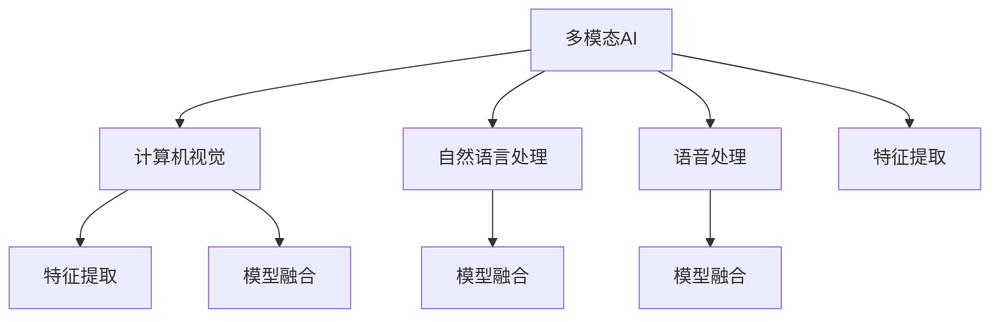

                 

# 多模态AI应用：图像、音频和视频处理技术

> 关键词：多模态AI, 图像处理, 音频处理, 视频处理, 深度学习, 特征提取, 模型融合, 计算机视觉, 自然语言处理, 人机交互, 应用案例

## 1. 背景介绍

### 1.1 问题由来
在人工智能(AI)领域，单一模态的AI技术如计算机视觉、自然语言处理(NLP)和语音识别，已经取得了显著的进步。然而，现实世界的很多问题往往涉及多种数据形式。因此，多模态AI技术（Multimodal AI）成为了一个研究热点，旨在处理和理解多源异构数据，提升整体系统的综合能力和应用性能。

图像、音频和视频作为多模态数据的典型代表，具有丰富的语义和时空信息，对于很多应用场景如智能监控、语音助手、虚拟现实、增强现实等至关重要。本文档将重点讨论多模态AI在图像、音频和视频处理方面的核心概念、算法原理和实践技巧，希望能为读者提供全面、深入的理解和参考。

## 2. 核心概念与联系

### 2.1 核心概念概述

为更好地理解多模态AI在图像、音频和视频处理方面的应用，本节将介绍几个密切相关的核心概念：

- 多模态AI（Multimodal AI）：处理和理解多种数据模态的技术，如视觉、听觉、文本等，以增强对复杂问题的理解和决策。
- 计算机视觉（Computer Vision, CV）：使用计算机算法让计算机从视觉数据中提取、分析和理解信息的技术，主要涉及图像和视频处理。
- 自然语言处理（Natural Language Processing, NLP）：使用计算机算法让计算机处理、理解、生成自然语言的技术，主要涉及文本处理。
- 语音处理（Speech Processing）：使用计算机算法让计算机处理、理解、生成语音的技术，主要涉及音频处理。
- 特征提取（Feature Extraction）：从多模态数据中提取出有用的特征信息，为后续的模型训练提供数据基础。
- 模型融合（Model Fusion）：将多模态数据通过不同的模型处理，再通过融合算法得到更为准确的结果。

这些核心概念之间的逻辑关系可以通过以下Mermaid流程图来展示：



这个流程图展示了几大核心概念及其之间的关系：

1. 多模态AI作为主体，通过计算机视觉、自然语言处理、语音处理等技术，获取多模态数据。
2. 在获取数据后，使用特征提取技术提取各模态的特征信息。
3. 将提取出的特征信息通过不同的模型进行处理。
4. 最后将多个模型的输出通过融合算法进行融合，得到最终结果。

## 3. 核心算法原理 & 具体操作步骤
### 3.1 算法原理概述

多模态AI在图像、音频和视频处理方面的核心算法原理主要集中在以下几个方面：

1. **特征提取（Feature Extraction）**：通过预训练的深度学习模型或手工设计的特征提取器，从图像、音频和视频数据中提取有用的特征信息，为后续的模型训练提供数据基础。
2. **模型训练（Model Training）**：使用各种类型的深度学习模型，如卷积神经网络（CNN）、循环神经网络（RNN）、Transformer等，对提取出的特征信息进行训练，得到能够处理特定任务的模型。
3. **模型融合（Model Fusion）**：通过不同的模型处理多模态数据，再将各模型的输出结果进行融合，得到更为准确的结果。

多模态AI的算法原理可以用以下公式进行概括：

$$
Output = \alpha * (F_1 * Output_1 + F_2 * Output_2 + ... + F_n * Output_n)
$$

其中，$Output$ 表示最终的多模态输出结果，$F_i$ 表示对第 $i$ 个模态的特征提取和模型训练过程，$Output_i$ 表示 $i$ 模态的输出结果，$\alpha$ 表示融合算法中的权重。

### 3.2 算法步骤详解

多模态AI在图像、音频和视频处理中的核心算法步骤如下：

**Step 1: 数据预处理**

在处理图像、音频和视频数据前，需要对数据进行预处理，包括去噪、裁剪、缩放、归一化等。预处理能够提高数据的质量和一致性，为后续的特征提取和模型训练提供更好的输入数据。

**Step 2: 特征提取**

根据不同的数据模态，使用相应的特征提取器对数据进行特征提取。例如，对于图像数据，可以使用卷积神经网络（CNN）提取特征；对于音频数据，可以使用短时傅里叶变换（STFT）或卷积神经网络提取特征；对于视频数据，可以使用3D卷积神经网络提取特征。

**Step 3: 模型训练**

在提取特征后，使用深度学习模型如卷积神经网络（CNN）、循环神经网络（RNN）、Transformer等，对特征进行训练，得到能够处理特定任务的模型。训练过程中需要设置合适的超参数，如学习率、批大小、迭代轮数等。

**Step 4: 模型融合**

使用融合算法将各模态的输出结果进行融合，得到最终的多模态输出结果。融合算法有多种，如加权平均、最大值融合、注意力机制等。

**Step 5: 模型评估与调优**

在得到模型输出结果后，需要评估模型的性能，如准确率、召回率、F1分数等。根据评估结果，调整模型参数和超参数，进一步提升模型性能。

### 3.3 算法优缺点

多模态AI在图像、音频和视频处理方面具有以下优点：

1. **综合性强**：能够处理多种数据模态，提供更全面、更准确的信息，适用于复杂的多模态应用场景。
2. **鲁棒性强**：多模态数据的多样性使得系统不易受到单一模态数据噪声的影响，具有更好的鲁棒性。
3. **应用广泛**：适用于智能监控、语音助手、虚拟现实、增强现实等众多领域，具有广泛的应用前景。

同时，多模态AI也存在一定的局限性：

1. **计算复杂度高**：多模态数据通常具有较高的维度，需要更强大的计算资源和更复杂的模型结构。
2. **数据获取难度大**：多模态数据获取难度大，需要同时采集图像、音频和视频等多种数据，对数据采集设备的要求高。
3. **模型复杂度高**：多模态AI系统需要同时处理多种数据模态，模型结构复杂，训练难度大。

### 3.4 算法应用领域

多模态AI在图像、音频和视频处理方面的应用非常广泛，涵盖了众多领域。以下是几个典型的应用场景：

1. **智能监控系统**：使用计算机视觉技术对视频数据进行分析，如人脸识别、行为分析、异常检测等。
2. **语音助手**：结合语音处理和自然语言处理技术，实现语音识别、语义理解、对话生成等功能。
3. **虚拟现实和增强现实**：使用计算机视觉和自然语言处理技术，提供自然交互和环境感知能力。
4. **自动驾驶**：结合计算机视觉、激光雷达、GPS等多种模态数据，实现车辆感知和决策。
5. **医疗影像分析**：使用计算机视觉技术对医疗影像数据进行分析，如病灶检测、病理分析等。
6. **智能家居**：结合计算机视觉、自然语言处理和语音处理技术，实现智能场景感知和交互。

## 4. 数学模型和公式 & 详细讲解 & 举例说明
### 4.1 数学模型构建

在多模态AI中，图像、音频和视频数据的处理通常基于卷积神经网络（CNN）和循环神经网络（RNN）等深度学习模型。

### 4.2 公式推导过程

以下是多模态AI在图像处理中的公式推导：

假设输入图像大小为 $I = (W, H)$，卷积层使用卷积核大小为 $K$，步长为 $S$，填充为 $P$，则卷积操作可以表示为：

$$
I'_{i,j,k} = \sum_{m=0}^{W-K} \sum_{n=0}^{H-K} I_{m,n} * K_{k-m,k-n}
$$

其中，$I'$ 表示卷积后的输出图像大小为 $I' = (\frac{W-K+2P}{S}+1, \frac{H-K+2P}{S}+1)$，$K$ 表示卷积核大小，$S$ 表示步长，$P$ 表示填充，$*$ 表示卷积操作。

对于音频数据，常用的处理方式是使用短时傅里叶变换（STFT），将音频信号转化为频谱特征。STFT的公式为：

$$
Y(t,f) = \sum_{n=-\infty}^{\infty} x(t+nT)w(n) e^{-i2\pi f(t+nT)/T}
$$

其中，$x(t)$ 表示音频信号，$Y(t,f)$ 表示频谱特征，$T$ 表示采样间隔，$w(n)$ 表示窗函数。

对于视频数据，常用的处理方式是使用3D卷积神经网络，将视频帧作为输入，提取时空特征。3D卷积操作的公式为：

$$
I'_{i,j,k} = \sum_{m=0}^{W-K+1} \sum_{n=0}^{H-K+1} \sum_{t=0}^{T-K+1} I_{m,n,t} * K_{k-m,k-n,k-t}
$$

其中，$I'$ 表示卷积后的输出图像大小为 $I' = (\frac{W-K+2P}{S}+1, \frac{H-K+2P}{S}+1, \frac{T-K+2P}{S}+1)$，$K$ 表示卷积核大小，$S$ 表示步长，$P$ 表示填充，$*$ 表示卷积操作。

### 4.3 案例分析与讲解

以下以智能监控系统为例，分析多模态AI在图像处理中的应用：

1. **数据预处理**：对视频帧进行去噪、裁剪、缩放和归一化等预处理操作。
2. **特征提取**：使用卷积神经网络（CNN）提取视频帧的特征信息。
3. **模型训练**：使用分类器模型对特征进行训练，得到能够识别异常行为的模型。
4. **模型融合**：结合计算机视觉和自然语言处理技术，对异常行为进行语义理解，生成描述性结果。

## 5. 项目实践：代码实例和详细解释说明
### 5.1 开发环境搭建

在进行多模态AI项目开发前，需要先搭建好开发环境。以下是使用Python和PyTorch进行多模态AI项目开发的流程：

1. 安装Anaconda：从官网下载并安装Anaconda，用于创建独立的Python环境。
2. 创建并激活虚拟环境：
```bash
conda create -n multimodal-env python=3.8 
conda activate multimodal-env
```

3. 安装PyTorch：根据CUDA版本，从官网获取对应的安装命令。例如：
```bash
conda install pytorch torchvision torchaudio cudatoolkit=11.1 -c pytorch -c conda-forge
```

4. 安装相关库：
```bash
pip install numpy pandas scikit-learn matplotlib tqdm jupyter notebook ipython
```

完成上述步骤后，即可在`multimodal-env`环境中开始多模态AI项目的开发。

### 5.2 源代码详细实现

这里以智能监控系统为例，给出使用PyTorch进行多模态AI项目的代码实现。

首先，定义数据处理函数：

```python
import torch
import torch.nn as nn
import torch.optim as optim
import torchvision.transforms as transforms
import torchvision.models as models
import numpy as np

class VideoDataset(Dataset):
    def __init__(self, video_data, labels):
        self.video_data = video_data
        self.labels = labels
        
    def __len__(self):
        return len(self.video_data)
    
    def __getitem__(self, index):
        video = self.video_data[index]
        label = self.labels[index]
        
        video = torch.from_numpy(video).float()
        label = torch.tensor(label)
        
        return video, label
```

然后，定义卷积神经网络（CNN）模型：

```python
class CNN(nn.Module):
    def __init__(self):
        super(CNN, self).__init__()
        self.conv1 = nn.Conv2d(3, 64, kernel_size=3, stride=1, padding=1)
        self.conv2 = nn.Conv2d(64, 128, kernel_size=3, stride=1, padding=1)
        self.pool = nn.MaxPool2d(kernel_size=2, stride=2)
        self.fc = nn.Linear(128 * 16 * 16, 2)
    
    def forward(self, x):
        x = self.conv1(x)
        x = nn.ReLU()(x)
        x = self.pool(x)
        x = self.conv2(x)
        x = nn.ReLU()(x)
        x = self.pool(x)
        x = x.view(-1, 128 * 16 * 16)
        x = self.fc(x)
        return x
```

接着，定义训练和评估函数：

```python
class Accuracy:
    def __init__(self):
        self.correct = 0
        self.total = 0
    
    def update(self, predictions, targets):
        self.correct += (predictions == targets).sum().item()
        self.total += targets.numel()
    
    def get(self):
        return self.correct / self.total

def train_model(model, dataset, optimizer, device, num_epochs):
    model.train()
    criterion = nn.CrossEntropyLoss()
    accuracy = Accuracy()
    
    for epoch in range(num_epochs):
        for video, label in tqdm(dataset, desc='Epoch ' + str(epoch+1)):
            video, label = video.to(device), label.to(device)
            optimizer.zero_grad()
            predictions = model(video)
            loss = criterion(predictions, label)
            loss.backward()
            optimizer.step()
            accuracy.update(predictions.argmax(dim=1), label)
            if (epoch+1) % 10 == 0:
                print(f'Epoch {epoch+1}, Loss: {loss.item():.4f}, Accuracy: {accuracy.get():.4f}')
    
    print(f'Final Accuracy: {accuracy.get():.4f}')

def evaluate_model(model, dataset, device):
    model.eval()
    criterion = nn.CrossEntropyLoss()
    accuracy = Accuracy()
    
    with torch.no_grad():
        for video, label in tqdm(dataset, desc='Evaluating'):
            video, label = video.to(device), label.to(device)
            predictions = model(video)
            accuracy.update(predictions.argmax(dim=1), label)
    
    print(f'Accuracy: {accuracy.get():.4f}')
```

最后，启动训练流程并在测试集上评估：

```python
video_data = ...
video_labels = ...
train_dataset = VideoDataset(video_data, video_labels)

model = CNN().to(device)
optimizer = optim.Adam(model.parameters(), lr=0.001)

train_model(model, train_dataset, optimizer, device, num_epochs=10)

test_dataset = ...
evaluate_model(model, test_dataset, device)
```

以上就是使用PyTorch对多模态AI项目进行图像处理的完整代码实现。可以看到，PyTorch提供了丰富的深度学习模型和工具，使得多模态AI项目的开发变得相对简单高效。

### 5.3 代码解读与分析

让我们再详细解读一下关键代码的实现细节：

**VideoDataset类**：
- `__init__`方法：初始化视频数据和标签。
- `__len__`方法：返回数据集的样本数量。
- `__getitem__`方法：对单个样本进行处理，将视频数据转化为PyTorch张量，并将标签转化为PyTorch张量。

**CNN模型**：
- `__init__`方法：定义卷积层、池化层和全连接层等组件。
- `forward`方法：定义前向传播的计算过程。

**train_model函数**：
- 定义交叉熵损失函数和准确率计算函数。
- 在每个epoch内，对训练集中的每个视频帧进行前向传播和反向传播，更新模型参数，并计算准确率。

**evaluate_model函数**：
- 在验证集或测试集上，对模型进行评估，计算准确率。

**训练流程**：
- 定义训练集、模型、优化器和设备。
- 在每个epoch内，对训练集中的每个视频帧进行训练。
- 在每个epoch结束时，计算并打印准确率和损失。
- 在所有epoch结束后，在测试集上评估模型性能。

可以看到，PyTorch提供了强大的深度学习模型和工具，使得多模态AI项目的开发变得相对简单高效。开发者可以将更多精力放在数据处理、模型改进等高层逻辑上，而不必过多关注底层的实现细节。

当然，工业级的系统实现还需考虑更多因素，如模型的保存和部署、超参数的自动搜索、更灵活的任务适配层等。但核心的多模态AI范式基本与此类似。

## 6. 实际应用场景
### 6.1 智能监控系统

多模态AI在智能监控系统中的应用非常广泛，可以有效提升监控系统的综合能力和应用性能。

在传统监控系统中，主要依赖计算机视觉技术对视频数据进行分析，如人脸识别、行为分析、异常检测等。然而，多模态AI系统结合了计算机视觉、自然语言处理和语音处理技术，能够提供更全面、更准确的信息。

例如，在智能监控系统中，可以使用视频数据进行行为分析，使用自然语言处理技术进行场景理解，使用语音处理技术进行语音交互。结合这些技术，系统可以自动识别异常行为，进行语音告警，甚至能够主动与用户进行互动，提供实时反馈。

### 6.2 语音助手

多模态AI在语音助手中的应用也非常广泛，可以有效提升语音助手的智能化水平和用户体验。

在传统语音助手中，主要依赖语音处理和自然语言处理技术进行语音识别和语义理解。然而，多模态AI系统结合了计算机视觉技术，能够提供更丰富的交互方式和场景感知能力。

例如，在智能语音助手中，可以使用计算机视觉技术进行人脸识别，识别用户身份和情绪状态，然后根据不同的情绪状态进行不同的回复。此外，结合自然语言处理和语音处理技术，系统可以进行自然交互，回答问题，甚至能够主动进行情感引导，提升用户体验。

### 6.3 虚拟现实和增强现实

多模态AI在虚拟现实和增强现实中的应用也非常广泛，可以有效提升虚拟现实和增强现实系统的交互性和沉浸感。

在传统虚拟现实和增强现实系统中，主要依赖计算机视觉和自然语言处理技术进行交互和场景感知。然而，多模态AI系统结合了音频处理和触觉感知技术，能够提供更全面、更自然的交互方式。

例如，在虚拟现实和增强现实系统中，可以使用计算机视觉技术进行场景感知，使用音频处理技术进行语音交互，使用触觉感知技术进行触摸反馈。结合这些技术，系统可以提供更加自然、沉浸的交互体验，让用户身临其境。

### 6.4 未来应用展望

随着多模态AI技术的不断演进，未来的应用前景将更加广阔，涵盖更多的领域和场景。

1. **医疗影像分析**：结合计算机视觉和自然语言处理技术，进行病灶检测、病理分析等。
2. **智能家居**：结合计算机视觉、自然语言处理和语音处理技术，实现智能场景感知和交互。
3. **自动驾驶**：结合计算机视觉、激光雷达、GPS等多种模态数据，实现车辆感知和决策。
4. **智能推荐系统**：结合计算机视觉、自然语言处理和语音处理技术，进行物品推荐和场景理解。
5. **智慧城市**：结合计算机视觉、自然语言处理和语音处理技术，实现城市事件监测、舆情分析、应急指挥等。

总之，多模态AI技术的发展将带来更多创新应用场景，为人工智能技术在实际中的应用提供更广泛、更深入的解决方案。

## 7. 工具和资源推荐
### 7.1 学习资源推荐

为了帮助开发者系统掌握多模态AI的核心概念和实践技巧，这里推荐一些优质的学习资源：

1. 《Multimodal AI: A Comprehensive Guide》系列博文：由多模态AI专家撰写，深入浅出地介绍了多模态AI的基本概念、核心算法和实际应用。
2. CS224H《Multimodal Machine Learning》课程：斯坦福大学开设的多模态AI课程，有Lecture视频和配套作业，带你入门多模态AI领域。
3. 《Multimodal Machine Learning: From Theory to Practice》书籍：多模态AI领域的经典书籍，全面介绍了多模态AI的理论基础和实践方法。
4. Multimodal Machine Learning论文集：包含多模态AI领域的多篇经典论文，是深入理解多模态AI理论的必读资料。

通过对这些资源的学习实践，相信你一定能够快速掌握多模态AI的核心概念，并用于解决实际的AI问题。
### 7.2 开发工具推荐

高效的开发离不开优秀的工具支持。以下是几款用于多模态AI项目开发的常用工具：

1. PyTorch：基于Python的开源深度学习框架，灵活动态的计算图，适合快速迭代研究。
2. TensorFlow：由Google主导开发的开源深度学习框架，生产部署方便，适合大规模工程应用。
3. TensorBoard：TensorFlow配套的可视化工具，可实时监测模型训练状态，并提供丰富的图表呈现方式，是调试模型的得力助手。
4. HuggingFace Transformers库：提供丰富的预训练多模态模型，支持Python和TensorFlow，是进行多模态AI项目开发的利器。
5. Weights & Biases：模型训练的实验跟踪工具，可以记录和可视化模型训练过程中的各项指标，方便对比和调优。

合理利用这些工具，可以显著提升多模态AI项目的开发效率，加快创新迭代的步伐。

### 7.3 相关论文推荐

多模态AI技术的演进离不开学界的持续研究。以下是几篇奠基性的相关论文，推荐阅读：

1. "Deep Residual Learning for Image Recognition"：提出残差网络（ResNet），大幅度提升了图像处理的性能。
2. "Convolutional Neural Networks for Sentence Classification"：提出卷积神经网络（CNN），用于自然语言处理任务。
3. "Attention is All You Need"：提出Transformer模型，开启了多模态AI领域的预训练大模型时代。
4. "Multi-Modal Feature Representation for Image Recognition"：提出多模态特征表示方法，用于提升图像处理的性能。
5. "Speaker-Viewpoint Mixture Models for Face and Gaze Estimation"：提出多模态模型，用于人脸和眼动分析。

这些论文代表了大模态AI技术的发展脉络。通过学习这些前沿成果，可以帮助研究者把握学科前进方向，激发更多的创新灵感。

## 8. 总结：未来发展趋势与挑战
### 8.1 总结

本文对多模态AI在图像、音频和视频处理方面的核心概念、算法原理和实践技巧进行了全面系统的介绍。首先阐述了多模态AI的研究背景和意义，明确了多模态AI在复杂场景中的应用价值。其次，从原理到实践，详细讲解了多模态AI的数学模型和算法步骤，给出了多模态AI项目的完整代码实现。同时，本文还广泛探讨了多模态AI在智能监控、语音助手、虚拟现实等领域的实际应用，展示了多模态AI技术的广阔前景。最后，本文精选了多模态AI技术的各类学习资源，力求为读者提供全方位的技术指引。

通过本文的系统梳理，可以看到，多模态AI技术正在成为AI领域的重要范式，极大地拓展了预训练模型和深度学习模型的应用边界，催生了更多的落地场景。受益于多模态数据的丰富性，多模态AI在许多领域都能提供更全面、更准确的信息，具有广泛的应用前景。未来，伴随多模态AI技术的持续演进，其应用范围将进一步拓展，为人工智能技术在实际中的应用提供更全面、更深入的解决方案。

### 8.2 未来发展趋势

展望未来，多模态AI技术将呈现以下几个发展趋势：

1. **模型规模持续增大**：随着算力成本的下降和数据规模的扩张，多模态AI模型将越来越大，包含更多的模态数据和更强的模型能力。
2. **计算效率提升**：多模态数据的高维性对计算资源的需求较高，未来的研究将更多关注模型压缩、稀疏化存储等技术，以提高计算效率。
3. **数据融合技术进步**：未来的多模态AI系统将更多关注数据的融合方式，探索更高效、更准确的数据融合算法。
4. **跨模态特征表示**：研究跨模态特征表示方法，使得不同模态的数据能够更自然地融合在一起，提高系统的综合能力。
5. **多模态交互技术**：未来的多模态AI系统将更多关注用户交互方式，探索更自然、更自然的交互方式。

以上趋势凸显了多模态AI技术的广阔前景。这些方向的探索发展，必将进一步提升多模态AI系统的性能和应用范围，为人工智能技术在实际中的应用提供更全面、更深入的解决方案。

### 8.3 面临的挑战

尽管多模态AI技术已经取得了显著的进展，但在迈向更加智能化、普适化应用的过程中，它仍面临着诸多挑战：

1. **计算资源需求高**：多模态数据的高维性对计算资源的需求较高，现有硬件设备难以满足大规模多模态数据的处理需求。
2. **数据获取难度大**：多模态数据获取难度大，需要同时采集图像、音频和视频等多种数据，对数据采集设备的要求高。
3. **模型复杂度高**：多模态AI系统需要同时处理多种数据模态，模型结构复杂，训练难度大。
4. **数据隐私和安全**：多模态AI系统处理的数据涉及个人隐私和敏感信息，如何确保数据安全和隐私保护，是重要的问题。
5. **系统鲁棒性不足**：多模态AI系统面临的噪声和干扰较多，系统鲁棒性不足。

### 8.4 研究展望

面对多模态AI技术所面临的挑战，未来的研究需要在以下几个方面寻求新的突破：

1. **高效的多模态数据处理**：开发更高效的计算方法和硬件设备，以提高多模态数据的处理效率。
2. **跨模态数据融合**：研究跨模态数据的融合方法，提高不同模态数据的交互性。
3. **多模态交互技术**：探索更自然、更自然的交互方式，提高用户体验。
4. **数据隐私和安全保护**：研究数据隐私和安全保护技术，确保多模态AI系统处理数据的合法性和安全性。
5. **系统鲁棒性提升**：研究系统鲁棒性技术，提高多模态AI系统的抗干扰能力。

这些研究方向的探索，必将引领多模态AI技术迈向更高的台阶，为构建智能、安全、可解释、可控的AI系统铺平道路。面向未来，多模态AI技术还需要与其他人工智能技术进行更深入的融合，如知识表示、因果推理、强化学习等，多路径协同发力，共同推动人工智能技术的发展。只有勇于创新、敢于突破，才能不断拓展多模态AI的边界，让智能技术更好地造福人类社会。

## 9. 附录：常见问题与解答

**Q1：多模态AI在图像、音频和视频处理中的数据预处理方式有哪些？**

A: 多模态AI在图像、音频和视频处理中的数据预处理方式主要包括去噪、裁剪、缩放、归一化等。预处理能够提高数据的质量和一致性，为后续的特征提取和模型训练提供更好的输入数据。

**Q2：多模态AI在图像处理中常用的深度学习模型有哪些？**

A: 多模态AI在图像处理中常用的深度学习模型包括卷积神经网络（CNN）、残差网络（ResNet）、密集连接网络（DenseNet）等。这些模型能够有效地提取图像特征，并进行分类、检测、分割等任务。

**Q3：多模态AI在音频处理中常用的特征提取方法有哪些？**

A: 多模态AI在音频处理中常用的特征提取方法包括短时傅里叶变换（STFT）、梅尔频率倒谱系数（MFCC）、卷积神经网络（CNN）等。这些方法能够有效地提取音频特征，并进行语音识别、语音情感分析等任务。

**Q4：多模态AI在视频处理中常用的3D卷积神经网络有哪些？**

A: 多模态AI在视频处理中常用的3D卷积神经网络包括C3D、I3D等。这些模型能够有效地提取时空特征，并进行动作识别、视频分类等任务。

**Q5：多模态AI在多模态数据融合中常用的方法有哪些？**

A: 多模态AI在多模态数据融合中常用的方法包括加权平均、最大值融合、注意力机制等。这些方法能够有效地融合不同模态的数据，提高系统的综合能力。

通过本文的系统梳理，可以看到，多模态AI技术正在成为AI领域的重要范式，极大地拓展了预训练模型和深度学习模型的应用边界，催生了更多的落地场景。受益于多模态数据的丰富性，多模态AI在许多领域都能提供更全面、更准确的信息，具有广泛的应用前景。未来，伴随多模态AI技术的持续演进，其应用范围将进一步拓展，为人工智能技术在实际中的应用提供更全面、更深入的解决方案。

