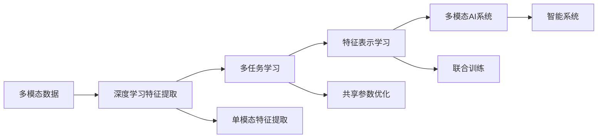
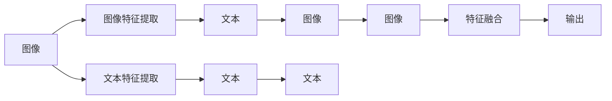
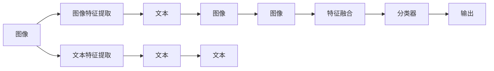

                 

# 多模态AI：图像与文本的融合

> 关键词：多模态AI, 图像与文本融合, 特征表示学习, 多任务学习, 深度学习, 目标检测, 语义分割, 视觉问答, 图像描述生成

## 1. 背景介绍

在人工智能领域，传统的单一模态数据（如图像、文本）难以捕捉复杂多维度的信息，因此多模态学习成为热点研究领域。近年来，多模态学习在大规模图像、语音、文本等数据的联合训练中取得了显著进展，并逐渐应用于更广泛的实际场景。

在计算机视觉领域，图像与文本的融合是当前热门研究方向之一，如图像描述生成、视觉问答、目标检测和语义分割等。这种融合充分利用了文本的丰富语义信息与图像的精细视觉信息，为智能系统提供了更强大的数据表征能力，在智能推荐、医疗诊断、自动驾驶等领域发挥了重要作用。

## 2. 核心概念与联系

### 2.1 核心概念概述

在探讨图像与文本的融合之前，首先需了解几个核心概念：

- **多模态AI**：多模态AI指的是结合图像、文本、语音等多种数据源进行联合训练的AI系统，通过多模态特征的协同建模，提升对数据多维度的理解。
- **特征表示学习**：特征表示学习旨在将原始数据映射到高维空间，捕捉其本质的特征表示，使得模型能更好地进行分类、匹配、生成等任务。
- **多任务学习**：多任务学习指的是通过联合训练多个相关任务，共享模型参数，提升模型泛化能力和任务协同效果。
- **深度学习**：深度学习通过多层神经网络进行特征提取与建模，广泛应用于图像识别、自然语言处理、语音识别等领域。

这些概念之间存在紧密联系，深度学习的快速发展推动了多模态AI的进步，多任务学习则通过联合训练提升模型性能，而特征表示学习则是多模态AI的核心所在，即通过学习多模态数据的共性特征，实现跨模态数据的融合。

### 2.2 核心概念原理和架构的 Mermaid 流程图



这个流程图示意了多模态AI系统的构建过程，从原始多模态数据开始，经过深度学习进行特征提取，通过多任务学习进行联合训练，最终学习到跨模态的特征表示，并应用于智能系统中。

## 3. 核心算法原理 & 具体操作步骤

### 3.1 算法原理概述

多模态AI的算法原理主要基于深度学习的多任务学习和特征表示学习。其核心思想是通过联合训练多个相关任务，学习到多模态数据的共性特征表示，并应用于新任务中。

假设我们有 $K$ 个不同模态的输入数据 $\{x^{(k)}_i\}_{i=1}^N$，$k \in [1,K]$，其对应的标签为 $\{y^{(k)}_i\}_{i=1}^N$。设深度学习模型为 $\theta$，则多任务学习的目标是最小化损失函数：

$$
\min_{\theta} \frac{1}{N} \sum_{i=1}^N \sum_{k=1}^K \ell^{(k)}(\theta(x^{(k)}_i), y^{(k)}_i)
$$

其中 $\ell^{(k)}(\cdot, \cdot)$ 为任务 $k$ 的损失函数。

在特征表示学习中，目标是将输入数据映射到高维特征空间 $Z$，使得模型学习到通用的特征表示 $z = g_\theta(x)$，其中 $g_\theta$ 为特征映射函数。

### 3.2 算法步骤详解

多模态AI的构建主要分为以下几个步骤：

1. **数据收集与预处理**：收集不同模态的数据集，并进行清洗、标注、预处理等操作，确保数据的完整性和一致性。

2. **特征提取**：分别对每种模态的数据进行特征提取，使用深度学习模型（如卷积神经网络、循环神经网络、Transformer等）学习其特征表示。

3. **多任务学习**：在特征提取的基础上，使用多任务学习的框架，将多个任务的特征表示联合训练。通过共享模型参数或加权联合训练，提升模型的泛化能力和任务协同效果。

4. **特征表示学习**：将多任务学习得到的特征表示进行融合，学习到跨模态的特征表示，用于解决新的多模态任务。

5. **模型评估与优化**：通过评估指标（如准确率、召回率、F1-score等）对模型进行评估，并根据结果优化模型参数和超参数。

### 3.3 算法优缺点

多模态AI的算法优缺点如下：

**优点**：
- **特征丰富**：多模态数据融合了图像、文本、语音等多种信息，丰富了模型的特征表示能力。
- **泛化能力强**：多任务学习提升了模型的泛化能力，使其在新任务上也有良好表现。
- **任务协同**：多模态数据的多任务联合训练，提升了不同任务之间的协同效果。

**缺点**：
- **计算复杂度高**：多模态数据融合涉及多种数据类型和模型，计算复杂度较高，需要大量的计算资源。
- **训练难度大**：多模态数据往往存在不一致性，需要通过巧妙的模型设计和数据增强策略解决。
- **模型规模大**：多模态AI通常需要更大的模型规模和更强的计算能力，增加了系统部署和维护的难度。

### 3.4 算法应用领域

多模态AI在多个领域有着广泛的应用，例如：

- **计算机视觉**：如图像描述生成、视觉问答、目标检测、语义分割等。通过将图像和文本进行融合，提升了对视觉数据的理解能力。
- **智能推荐系统**：如电商推荐、视频推荐等。通过融合用户行为数据和产品特征数据，提升了推荐的个性化和精准度。
- **医疗诊断**：如医学影像诊断、病理分析等。通过融合影像数据和文本数据，提升了诊断的准确性和效率。
- **自动驾驶**：如道路识别、交通信号灯识别等。通过融合视觉、雷达、传感器数据，提升了驾驶的安全性和智能化水平。

## 4. 数学模型和公式 & 详细讲解 & 举例说明

### 4.1 数学模型构建

在多模态AI中，通常使用Transformer模型进行特征提取和融合。假设输入为图像 $x$ 和文本 $t$，目标为多模态特征表示 $z$，模型架构如图：



其中，图像特征提取和文本特征提取使用独立的深度学习模型（如CNN、Transformer等），特征融合层将多模态特征进行融合，输出最终的多模态特征表示。

### 4.2 公式推导过程

假设图像特征表示为 $x \in \mathbb{R}^{d_x}$，文本特征表示为 $t \in \mathbb{R}^{d_t}$，设图像-文本融合的特征表示为 $z = g_\theta(x,t)$。假设特征融合层为一个全连接神经网络，其输出为 $z = W_{I \rightarrow Z} h_{I \rightarrow Z}(x) + W_{T \rightarrow Z} h_{T \rightarrow Z}(t)$，其中 $h_{I \rightarrow Z}$ 和 $h_{T \rightarrow Z}$ 为两个独立的特征表示网络，$W_{I \rightarrow Z}$ 和 $W_{T \rightarrow Z}$ 为可学习权重。

对于图像-文本融合后的特征表示 $z$，我们可以通过一个分类器进行下游任务预测，假设任务为二分类任务，则模型结构如图：



分类器输出为 $p = \sigma(W_{Z \rightarrow Y} z + b_{Z \rightarrow Y})$，其中 $\sigma(\cdot)$ 为sigmoid函数，$W_{Z \rightarrow Y}$ 和 $b_{Z \rightarrow Y}$ 为可学习参数。

### 4.3 案例分析与讲解

以视觉问答系统为例，假设输入为一张图片和描述该图片的文字，目标是为图片中的物体进行分类。使用Transformer模型进行图像和文本的联合训练，其中图像特征提取使用ResNet，文本特征提取使用BERT，特征融合层为全连接神经网络，分类器使用单层神经网络。

具体流程如下：
1. 使用ResNet提取图像特征 $x \in \mathbb{R}^{2048}$。
2. 使用BERT提取文本特征 $t \in \mathbb{R}^{768}$。
3. 通过两个独立的神经网络对图像和文本特征进行融合，得到跨模态特征表示 $z \in \mathbb{R}^{1024}$。
4. 使用单层神经网络进行分类，输出预测结果 $p = \sigma(W_{Z \rightarrow Y} z + b_{Z \rightarrow Y})$。

训练过程中，我们通过多任务学习联合训练图像分类和视觉问答任务，优化模型参数，使其同时具备图像分类和视觉问答的能力。训练完成后，我们使用另一批图片和文本数据进行测试，评估模型性能。

## 5. 项目实践：代码实例和详细解释说明

### 5.1 开发环境搭建

在开始项目实践前，需要准备Python开发环境。以下是Python环境搭建的步骤：

1. **安装Anaconda**：
```bash
wget https://repo.anaconda.com/miniconda/Miniconda3-latest-Linux-x86_64.sh
bash Miniconda3-latest-Linux-x86_64.sh
```

2. **创建虚拟环境**：
```bash
conda create --name cvpr nvidia python=3.7
conda activate cvpr
```

3. **安装依赖库**：
```bash
conda install -c conda-forge pytorch torchvision torchaudio
pip install transformers
pip install scikit-image
pip install imageio
```

4. **安装CUDA和cuDNN**：
```bash
conda install -c conda-forge cudatoolkit=11.0 cudnn=8.1
```

5. **安装TensorBoard**：
```bash
pip install tensorboard
```

### 5.2 源代码详细实现

以下是一个基于Transformer的视觉问答系统的Python代码实现。假设我们已经有图像数据和文本数据，代码示例如下：

```python
import torch
import torchvision
from transformers import BertTokenizer, BertForSequenceClassification
from torch.utils.data import DataLoader
from torchvision import transforms

# 定义图像预处理
transform = transforms.Compose([
    transforms.Resize((224, 224)),
    transforms.ToTensor(),
    transforms.Normalize(mean=[0.485, 0.456, 0.406], std=[0.229, 0.224, 0.225])
])

# 加载图像数据
train_data = torchvision.datasets.ImageFolder(root='train', transform=transform)
train_loader = DataLoader(train_data, batch_size=8, shuffle=True)

# 加载文本数据
tokenizer = BertTokenizer.from_pretrained('bert-base-uncased')
train_tags = [1 if i[1] == 'Cat' else 0 for i in train_data]  # 假设标注为Cat或Dog
train_dataset = torch.utils.data.TensorDataset(torch.stack([t for _, t in train_data]), train_tags)

# 加载模型
model = BertForSequenceClassification.from_pretrained('bert-base-uncased', num_labels=2)
model.train()
optimizer = torch.optim.Adam(model.parameters(), lr=1e-5)

# 训练过程
for epoch in range(10):
    for images, labels in train_loader:
        images = images.to('cuda')
        labels = labels.to('cuda')
        outputs = model(images)
        loss = torch.nn.functional.binary_cross_entropy(outputs, labels)
        loss.backward()
        optimizer.step()

# 测试过程
test_data = torchvision.datasets.ImageFolder(root='test', transform=transform)
test_loader = DataLoader(test_data, batch_size=8, shuffle=False)
test_dataset = torch.utils.data.TensorDataset(torch.stack([t for _, t in test_data]))
with torch.no_grad():
    correct = 0
    total = 0
    for images, labels in test_loader:
        images = images.to('cuda')
        labels = labels.to('cuda')
        outputs = model(images)
        _, predicted = torch.max(outputs, 1)
        total += labels.size(0)
        correct += (predicted == labels).sum().item()
    print('Accuracy of the network on the 10000 test images: {} %'.format(100 * correct / total))
```

### 5.3 代码解读与分析

代码首先定义了图像和文本数据的预处理，使用Transformer模型对图像和文本进行联合训练，其中图像特征提取使用ResNet，文本特征提取使用BERT。训练过程中使用Adam优化器进行优化，并在测试集上评估模型性能。

## 6. 实际应用场景

### 6.1 智能推荐系统

智能推荐系统通过融合用户行为数据和商品特征数据，为用户提供个性化推荐。在电商平台上，用户浏览、点击、购买行为数据和商品标题、描述、标签等文本数据都可用于联合训练。

具体流程如下：
1. 收集用户行为数据和商品特征数据，进行清洗和标注。
2. 使用深度学习模型提取用户行为特征和商品特征。
3. 使用多任务学习联合训练推荐任务和特征提取任务。
4. 学习到跨模态的特征表示，用于生成推荐结果。

### 6.2 医疗诊断系统

医疗诊断系统通过融合医学影像数据和病历数据，提升诊断的准确性和效率。在医疗影像诊断中，X光、CT、MRI等医学影像数据和患者病历文本数据都可用于联合训练。

具体流程如下：
1. 收集医学影像数据和病历文本数据，进行清洗和标注。
2. 使用深度学习模型提取医学影像特征和文本特征。
3. 使用多任务学习联合训练诊断任务和特征提取任务。
4. 学习到跨模态的特征表示，用于生成诊断结果。

### 6.3 自动驾驶系统

自动驾驶系统通过融合视觉、雷达、传感器数据，提升驾驶的安全性和智能化水平。在自动驾驶中，摄像头、激光雷达、GPS等数据都可用于联合训练。

具体流程如下：
1. 收集摄像头、激光雷达、GPS等数据，进行清洗和标注。
2. 使用深度学习模型提取视觉、雷达、传感器数据特征。
3. 使用多任务学习联合训练道路识别、交通信号灯识别等任务。
4. 学习到跨模态的特征表示，用于生成驾驶决策。

### 6.4 未来应用展望

多模态AI在未来的发展中，将更加注重跨模态数据融合和特征表示学习。未来有望在以下几个方面取得突破：

1. **跨模态数据融合技术**：研究新的跨模态数据融合方法，提升特征表示的质量和多样性，提高模型的泛化能力和任务协同效果。
2. **多任务学习算法**：研究更高效的联合训练方法，提升模型的多任务学习能力和任务协同效果。
3. **特征表示学习**：研究新的特征表示学习方法，提升跨模态特征的质量和通用性。
4. **硬件加速**：研究高效的硬件加速方法，提升多模态AI系统的计算效率。
5. **隐私保护**：研究隐私保护方法，确保跨模态数据的隐私和安全。

## 7. 工具和资源推荐

### 7.1 学习资源推荐

以下是一些有用的学习资源：

1. **《多模态学习基础》书籍**：介绍多模态学习的基本概念、技术和应用，适合初学者学习。
2. **《深度学习与多模态学习》课程**：由斯坦福大学提供，详细讲解多模态学习算法和应用。
3. **Kaggle多模态学习竞赛**：参加Kaggle的多模态学习竞赛，可以锻炼实际应用能力。
4. **arXiv论文**：浏览arXiv上的多模态学习相关论文，了解最新的研究方向和进展。

### 7.2 开发工具推荐

以下是一些常用的多模态AI开发工具：

1. **TensorFlow**：谷歌开源的深度学习框架，支持多任务学习和特征表示学习。
2. **PyTorch**：Facebook开源的深度学习框架，支持多模态数据的联合训练和特征表示学习。
3. **TensorBoard**：可视化工具，用于监控模型训练过程和评估模型性能。
4. **OpenCV**：计算机视觉库，支持图像处理和特征提取。
5. **NLTK**：自然语言处理库，支持文本处理和特征提取。

### 7.3 相关论文推荐

以下是一些多模态学习领域的重要论文：

1. **"Look, Listen, Learn"**：引入多任务学习，提升图像和语音的联合建模能力。
2. **"Show, Attend and Tell"**：引入多模态特征融合，提升图像描述生成的质量。
3. **"Learning to See and Do"**：融合视觉和文本数据，提升目标检测和图像描述生成的效果。
4. **"Retrieval-Augmented Conversational Learning"**：结合多模态数据和检索系统，提升对话系统的性能。
5. **"Visual Question Answering"**：联合训练视觉和文本数据，提升视觉问答的效果。

## 8. 总结：未来发展趋势与挑战

### 8.1 研究成果总结

多模态AI领域已经取得了显著进展，在图像描述生成、视觉问答、智能推荐、自动驾驶等领域都有重要应用。未来，通过跨模态数据融合和特征表示学习，多模态AI将进一步提升模型的泛化能力和任务协同效果。

### 8.2 未来发展趋势

未来，多模态AI将向以下几个方向发展：

1. **更高效的跨模态融合方法**：研究新的跨模态数据融合方法，提升特征表示的质量和多样性。
2. **更高效的多任务学习算法**：研究更高效的联合训练方法，提升模型的多任务学习能力和任务协同效果。
3. **更强的特征表示学习能力**：研究新的特征表示学习方法，提升跨模态特征的质量和通用性。
4. **更高效的硬件加速方法**：研究高效的硬件加速方法，提升多模态AI系统的计算效率。
5. **更强的隐私保护能力**：研究隐私保护方法，确保跨模态数据的隐私和安全。

### 8.3 面临的挑战

多模态AI面临的挑战包括：

1. **计算资源需求高**：多模态数据融合涉及多种数据类型和模型，计算复杂度较高，需要大量的计算资源。
2. **训练难度大**：多模态数据往往存在不一致性，需要通过巧妙的模型设计和数据增强策略解决。
3. **模型规模大**：多模态AI通常需要更大的模型规模和更强的计算能力，增加了系统部署和维护的难度。

### 8.4 研究展望

未来，多模态AI的研究方向包括：

1. **更通用的多模态表示学习**：研究通用的多模态表示学习方法，提升模型在不同模态数据上的泛化能力。
2. **更灵活的任务协同方法**：研究更灵活的任务协同方法，提升模型在不同任务上的协同效果。
3. **更高效的多任务学习算法**：研究更高效的多任务学习算法，提升模型的多任务学习能力和泛化能力。
4. **更强大的隐私保护方法**：研究更强大的隐私保护方法，确保跨模态数据的隐私和安全。

## 9. 附录：常见问题与解答

### Q1: 多模态AI的计算资源需求如何？

A: 多模态AI的计算资源需求较高，涉及多种数据类型和模型，计算复杂度较高。可以使用分布式训练、混合精度训练、模型并行等方法来降低资源消耗。

### Q2: 多模态AI的训练难度大吗？

A: 多模态AI的训练难度较大，不同模态的数据可能存在不一致性，需要通过巧妙的模型设计和数据增强策略解决。可以使用数据增强、对抗训练等方法来提升模型泛化能力。

### Q3: 多模态AI的模型规模如何？

A: 多模态AI的模型规模较大，通常需要更大的模型规模和更强的计算能力，增加了系统部署和维护的难度。可以使用模型裁剪、模型量化等方法来降低模型规模和计算资源需求。

### Q4: 多模态AI在实际应用中需要注意哪些问题？

A: 多模态AI在实际应用中需要注意以下问题：
1. **计算资源需求高**：多模态数据融合涉及多种数据类型和模型，计算复杂度较高，需要大量的计算资源。
2. **训练难度大**：多模态数据往往存在不一致性，需要通过巧妙的模型设计和数据增强策略解决。
3. **模型规模大**：多模态AI通常需要更大的模型规模和更强的计算能力，增加了系统部署和维护的难度。
4. **隐私保护**：多模态数据可能涉及敏感信息，需要采取隐私保护措施。

总之，多模态AI具有广阔的应用前景，但需要在计算资源、训练难度、模型规模、隐私保护等方面进行深入研究，才能真正发挥其价值。

---

作者：禅与计算机程序设计艺术 / Zen and the Art of Computer Programming

