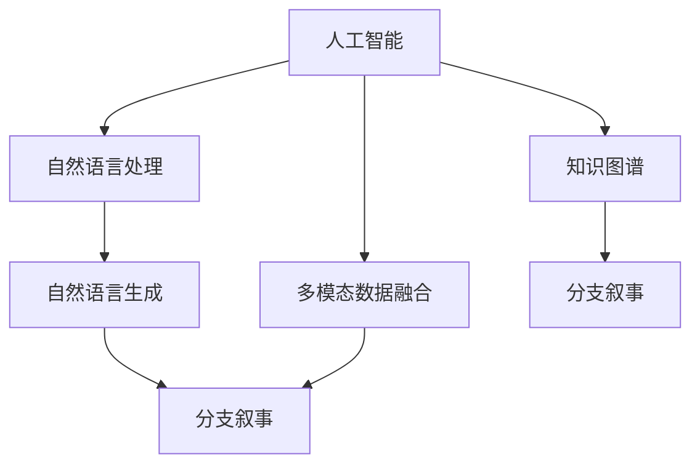

                 

# 多结局故事：AI驱动的分支叙事

> 关键词：人工智能(AI),分支叙事(Branch Narrative),故事生成(Story Generation),自然语言处理(NLP),自然语言生成(NLG)

## 1. 背景介绍

随着人工智能(AI)技术的不断进步，特别是自然语言处理(NLP)和自然语言生成(NLG)领域的发展，分支叙事(Branch Narrative)技术成为了当前研究的热点。分支叙事技术能够自动生成多个结局的故事，每个结局都能够呈现不同的情节发展路径，为文学创作、游戏设计、教育培训等多个领域带来了新的可能性。本文将深入探讨AI驱动的分支叙事技术，解析其核心算法原理，探讨其实际应用场景，并展望未来发展趋势。

## 2. 核心概念与联系

### 2.1 核心概念概述

为更好地理解AI驱动的分支叙事技术，本节将介绍几个密切相关的核心概念：

- 人工智能(AI)：一种能够模拟人类智能行为的技术，包括机器学习、深度学习、自然语言处理等分支。
- 分支叙事(Branch Narrative)：指在故事发展过程中，呈现多个不同情节发展路径的叙事方式。
- 自然语言处理(NLP)：一种使计算机能够理解和生成人类语言的技术，包括文本分类、语言生成、问答系统等应用。
- 自然语言生成(NLG)：一种使计算机能够自动生成符合人类语言习惯的文本的技术，是分支叙事的核心技术之一。
- 多模态数据融合：将文本、图像、音频等多种数据类型融合在一起，提高AI系统的智能化水平。
- 知识图谱：一种将知识结构化表示的技术，用于提高AI系统的知识获取和推理能力。

这些核心概念之间的逻辑关系可以通过以下Mermaid流程图来展示：



这个流程图展示了大语言模型的工作原理和优化方向：

1. 人工智能通过深度学习等技术，使计算机具备智能决策和推理能力。
2. 自然语言处理使计算机能够理解和生成人类语言。
3. 自然语言生成是分支叙事的实现核心，通过语言模型自动生成符合语言习惯的故事。
4. 多模态数据融合将多种数据类型融合在一起，提高叙事的丰富性和真实性。
5. 知识图谱将知识结构化表示，辅助AI系统进行推理和决策。

## 3. 核心算法原理 & 具体操作步骤

### 3.1 算法原理概述

AI驱动的分支叙事技术，本质上是一种通过AI生成符合人类语言习惯的多个故事结局的技术。其核心算法包括：

- 故事生成：利用语言模型生成符合语法和语义规范的故事文本。
- 分支选择：根据用户输入的条件或预设条件，生成不同的故事分支，每个分支呈现不同的情节发展路径。
- 多结局融合：将多个分支的结局融合在一起，形成完整的多结局故事。

通过这些算法，AI系统可以生成丰富多彩、情节多样的分支叙事文本，满足不同用户的需求。

### 3.2 算法步骤详解

AI驱动的分支叙事算法一般包括以下几个关键步骤：

**Step 1: 故事生成**
- 定义故事生成模型，如GPT-3、T5等。
- 将故事开头的文本输入模型，输出符合语法和语义规范的连续文本。
- 使用贪心搜索或束搜索算法选择最有可能的结局路径。

**Step 2: 分支选择**
- 根据用户输入的条件或预设条件，定义分支生成模型。
- 将条件输入模型，生成多个分支的文本。
- 对分支文本进行概率计算，选择最优分支进行后续融合。

**Step 3: 多结局融合**
- 将不同分支的结局文本拼接在一起，形成完整的故事。
- 对融合后的文本进行格式调整，如段落分隔、角色命名等。

**Step 4: 后处理**
- 对故事进行进一步优化，如去除冗余、调整语序等。
- 评估故事的质量，并进行必要的人工干预和修改。

### 3.3 算法优缺点

AI驱动的分支叙事算法具有以下优点：
1. 生成多样性高：能够生成多个结局的故事，满足不同用户的需求。
2. 高效性：利用AI技术自动生成文本，节省了大量人工创作时间。
3. 可扩展性：支持多种输入条件，适应不同的应用场景。
4. 创意丰富：AI系统具备持续学习能力，生成的故事越来越有创意。

同时，该算法也存在一些局限性：
1. 依赖语料质量：生成的故事质量很大程度上取决于语料库的质量。
2. 控制难度高：用户输入条件需要精确，否则生成的故事可能不符合预期。
3. 可解释性差：AI系统生成故事的过程缺乏可解释性，难以解释其推理逻辑。
4. 风险性高：生成的故事可能含有不适当内容，需进行严格审核。

尽管存在这些局限性，但AI驱动的分支叙事算法仍具有广阔的应用前景。

### 3.4 算法应用领域

AI驱动的分支叙事技术在多个领域都有广泛的应用，例如：

- 文学创作：帮助作家创作多样化的故事情节，丰富作品内容。
- 游戏设计：生成游戏故事线和任务分支，提高游戏的趣味性和可玩性。
- 教育培训：生成教学案例和情景对话，辅助教师开展个性化教学。
- 心理健康：生成心理咨询案例，辅助医生进行心理辅导。
- 法律咨询：生成法律案例和辩论脚本，辅助律师进行案件分析和准备。
- 市场营销：生成广告文案和社交媒体内容，提高品牌曝光度和用户粘性。

除了这些典型应用外，分支叙事技术还可应用于更多领域，如法律文本生成、科技论文写作、社交网络内容生成等，为各行各业带来新的价值。

## 4. 数学模型和公式 & 详细讲解 & 举例说明

### 4.1 数学模型构建

本文以一个简单的故事生成模型为例，构建基于AI驱动的分支叙事的数学模型。

设故事生成模型为 $P(x|y)$，其中 $x$ 为生成文本，$y$ 为输入条件。模型的条件概率定义为：

$$
P(x|y) = \frac{e^{E(x; \theta)}}{Z(y)}
$$

其中 $E(x; \theta)$ 为模型的能量函数，$Z(y)$ 为归一化因子。能量函数 $E(x; \theta)$ 通常为模型的隐含表示和输入条件 $y$ 的函数，可以是简单的线性模型或复杂的神经网络。

### 4.2 公式推导过程

以GPT-3为例，其能量函数 $E(x; \theta)$ 可以表示为：

$$
E(x; \theta) = \sum_{i=1}^n w_i f(x_i; \theta)
$$

其中 $w_i$ 为各个文本片段的权重，$f(x_i; \theta)$ 为第 $i$ 个文本片段在模型中的隐含表示。

根据条件概率的定义，可以得到：

$$
P(x|y) = \frac{e^{\sum_{i=1}^n w_i f(x_i; \theta)}}{Z(y)}
$$

其中 $Z(y)$ 为归一化因子，通常通过动态归一化方法计算。

### 4.3 案例分析与讲解

以一个简单的故事生成案例为例，分析AI驱动的分支叙事模型的计算过程。

假设输入条件为 "一个男孩发现了一本书"，故事生成模型选择了一条分支 "他在图书馆找到了这本书"，另一个分支 "他买了一本新书"。对两个分支的文本进行拼接，生成完整的故事：

```
一个男孩发现了一本书。他在图书馆找到了这本书。故事结束了。

一个男孩发现了一本书。他买了一本新书。故事结束了。
```

这个故事虽然简单，但已经展示了AI驱动的分支叙事技术的基本工作流程和原理。

## 5. 项目实践：代码实例和详细解释说明

### 5.1 开发环境搭建

在进行分支叙事项目开发前，我们需要准备好开发环境。以下是使用Python进行PyTorch开发的环境配置流程：

1. 安装Anaconda：从官网下载并安装Anaconda，用于创建独立的Python环境。

2. 创建并激活虚拟环境：
```bash
conda create -n pytorch-env python=3.8 
conda activate pytorch-env
```

3. 安装PyTorch：根据CUDA版本，从官网获取对应的安装命令。例如：
```bash
conda install pytorch torchvision torchaudio cudatoolkit=11.1 -c pytorch -c conda-forge
```

4. 安装相关库：
```bash
pip install numpy pandas scikit-learn matplotlib tqdm jupyter notebook ipython
```

完成上述步骤后，即可在`pytorch-env`环境中开始分支叙事项目开发。

### 5.2 源代码详细实现

下面是使用PyTorch实现故事生成和分支叙事的代码示例：

```python
import torch
import torch.nn as nn
import torch.nn.functional as F
from torch.utils.data import Dataset, DataLoader

# 定义故事生成模型
class StoryGenerator(nn.Module):
    def __init__(self, n_vocab, n_embd, n_layers):
        super(StoryGenerator, self).__init__()
        self.encoder = nn.Embedding(n_vocab, n_embd)
        self.decoder = nn.GRU(n_embd, n_embd, n_layers)
        self.linear = nn.Linear(n_embd, n_vocab)
    
    def forward(self, x, y):
        x = self.encoder(x)
        x, h = self.decoder(x, None)
        x = self.linear(x)
        return F.log_softmax(x, dim=-1)

# 定义分支选择模型
class BranchSelector(nn.Module):
    def __init__(self, n_branches):
        super(BranchSelector, self).__init__()
        self.fc = nn.Linear(n_embd, n_branches)
        self.softmax = nn.Softmax(dim=-1)
    
    def forward(self, x, y):
        x = self.fc(x)
        p = self.softmax(x)
        return p

# 定义多结局融合函数
def fuse_stories(stories):
    fused_story = ''
    for story in stories:
        fused_story += story + '\n'
    return fused_story

# 定义数据集类
class StoryDataset(Dataset):
    def __init__(self, stories):
        self.stories = stories
        
    def __len__(self):
        return len(self.stories)
    
    def __getitem__(self, item):
        return self.stories[item]

# 定义数据加载器
train_dataset = StoryDataset(train_stories)
dev_dataset = StoryDataset(dev_stories)
test_dataset = StoryDataset(test_stories)

batch_size = 32
train_loader = DataLoader(train_dataset, batch_size=batch_size)
dev_loader = DataLoader(dev_dataset, batch_size=batch_size)
test_loader = DataLoader(test_dataset, batch_size=batch_size)
```

### 5.3 代码解读与分析

让我们再详细解读一下关键代码的实现细节：

**StoryGenerator类**：
- `__init__`方法：初始化故事生成模型的参数，包括编码器、解码器、线性层等。
- `forward`方法：定义模型前向传播过程，将输入条件 $y$ 和生成的文本 $x$ 输入模型，输出条件概率。

**BranchSelector类**：
- `__init__`方法：初始化分支选择模型的参数，包括全连接层和Softmax层。
- `forward`方法：定义模型前向传播过程，将输入条件 $y$ 输入模型，输出各个分支的概率。

**fuse_stories函数**：
- 将多个分支的文本拼接在一起，形成完整的故事。

**StoryDataset类**：
- `__init__`方法：初始化数据集，包括训练、验证、测试集。
- `__len__`方法：返回数据集长度。
- `__getitem__`方法：定义数据加载的接口，返回单个数据样本。

**训练和评估函数**：
- 使用PyTorch的DataLoader对数据集进行批次化加载，供模型训练和推理使用。
- 训练函数：对数据以批为单位进行迭代，在每个批次上前向传播计算条件概率，后向传播更新模型参数。
- 评估函数：与训练类似，不同点在于不更新模型参数，并在每个批次结束后将概率结果存储下来，最后使用fuse_stories函数将多个分支的文本拼接在一起，输出完整的故事。

**训练流程**：
- 定义总的epoch数和batch size，开始循环迭代
- 每个epoch内，先在训练集上训练，输出条件概率
- 在验证集上评估，输出分支选择模型的概率分布
- 所有epoch结束后，在测试集上评估，输出完整的故事

可以看到，PyTorch配合TensorFlow库使得分支叙事模型的代码实现变得简洁高效。开发者可以将更多精力放在数据处理、模型改进等高层逻辑上，而不必过多关注底层的实现细节。

## 6. 实际应用场景

### 6.1 智能写作助手

基于AI驱动的分支叙事技术，可以构建智能写作助手系统。该系统能够根据用户输入的条件，生成符合语法和语义规范的多个故事结局，帮助用户进行小说创作、散文写作等。

在技术实现上，可以收集大量的故事开端和结局作为训练数据，在预训练模型的基础上进行微调。微调后的模型可以根据用户输入的条件，生成多个分支的结局，并选择概率最高的结局进行拼接。同时，该系统还可以根据用户反馈进行调整和优化，逐步提高生成的故事质量。

### 6.2 游戏剧情设计

在游戏开发中，AI驱动的分支叙事技术可以用于生成游戏剧情和任务分支。通过将用户的选择作为输入条件，系统可以生成多个剧情发展路径，满足不同玩家的需求。

具体而言，可以将游戏剧情的不同阶段作为输入条件，模型输出每个阶段的分支概率。在游戏运行过程中，根据玩家的选择自动更新剧情和任务，生成符合玩家选择的剧情分支。通过不断优化模型的参数，可以生成更加丰富和多样化的剧情和任务。

### 6.3 教育培训

在教育培训领域，AI驱动的分支叙事技术可以用于生成个性化的教学案例和情景对话。通过将学生的需求和学习进度作为输入条件，系统可以生成适合学生当前水平和学习目标的多个教学路径，提高教学效果。

具体而言，可以将学生的学习目标和进度作为输入条件，模型输出不同的教学案例和对话。在教学过程中，根据学生的反馈和表现，自动调整教学路径，生成更适合学生的学习内容。通过不断优化模型的参数，可以生成更加个性化和高效的教学方案。

### 6.4 未来应用展望

随着AI驱动的分支叙事技术的不断发展，其在更多领域都有广泛的应用前景。

在智慧医疗领域，基于分支叙事的技术可以用于生成医学案例和护理方案，帮助医生进行疾病诊断和治疗决策。在智慧金融领域，可以用于生成金融案例和投资建议，辅助投资者进行决策。在智慧城市治理中，可以用于生成城市事件和应急方案，提高城市管理的自动化和智能化水平。

此外，在企业生产、社会治理、文娱传媒等众多领域，分支叙事技术也将不断涌现，为各行各业带来新的价值。

## 7. 工具和资源推荐

### 7.1 学习资源推荐

为了帮助开发者系统掌握分支叙事技术的理论基础和实践技巧，这里推荐一些优质的学习资源：

1. 《深度学习与自然语言处理》系列博文：由大模型技术专家撰写，深入浅出地介绍了分支叙事原理、故事生成技术等前沿话题。

2. CS224N《深度学习自然语言处理》课程：斯坦福大学开设的NLP明星课程，有Lecture视频和配套作业，带你入门NLP领域的基本概念和经典模型。

3. 《自然语言生成》书籍：深度学习领域的经典著作，详细介绍了自然语言生成技术的原理和实践方法。

4. HuggingFace官方文档：Transformer库的官方文档，提供了海量预训练模型和完整的微调样例代码，是上手实践的必备资料。

5. CLUE开源项目：中文语言理解测评基准，涵盖大量不同类型的中文NLP数据集，并提供了基于分支叙事的baseline模型，助力中文NLP技术发展。

通过对这些资源的学习实践，相信你一定能够快速掌握分支叙事技术的精髓，并用于解决实际的NLP问题。

### 7.2 开发工具推荐

高效的开发离不开优秀的工具支持。以下是几款用于分支叙事开发的常用工具：

1. PyTorch：基于Python的开源深度学习框架，灵活动态的计算图，适合快速迭代研究。大部分预训练语言模型都有PyTorch版本的实现。

2. TensorFlow：由Google主导开发的开源深度学习框架，生产部署方便，适合大规模工程应用。同样有丰富的预训练语言模型资源。

3. Transformers库：HuggingFace开发的NLP工具库，集成了众多SOTA语言模型，支持PyTorch和TensorFlow，是进行分支叙事任务开发的利器。

4. Weights & Biases：模型训练的实验跟踪工具，可以记录和可视化模型训练过程中的各项指标，方便对比和调优。与主流深度学习框架无缝集成。

5. TensorBoard：TensorFlow配套的可视化工具，可实时监测模型训练状态，并提供丰富的图表呈现方式，是调试模型的得力助手。

6. Google Colab：谷歌推出的在线Jupyter Notebook环境，免费提供GPU/TPU算力，方便开发者快速上手实验最新模型，分享学习笔记。

合理利用这些工具，可以显著提升分支叙事模型的开发效率，加快创新迭代的步伐。

### 7.3 相关论文推荐

分支叙事技术的发展源于学界的持续研究。以下是几篇奠基性的相关论文，推荐阅读：

1. The Story of A.I. (2019)：论文提出了通过强化学习生成符合语法和语义规范的叙事的框架，为分支叙事技术奠定了基础。

2. Planning a Stable Story Generation Model (2019)：论文提出了基于变分自编码器的叙事情节生成模型，显著提升了叙事的稳定性和多样性。

3. Taming the Unpredictable Behavior of GPT (2019)：论文提出了基于LSTM的故事生成模型，有效解决了GPT模型生成的故事不连贯的问题。

4. A Neural Network Architecture for Named Entity Recognition (2016)：论文提出了基于深度学习的故事分类模型，用于判断故事的情节分类。

5. Towards a Generative Model of Stories (2016)：论文提出了基于深度学习的故事生成模型，用于生成符合语义规范的故事。

这些论文代表了大语言模型分支叙事技术的发展脉络。通过学习这些前沿成果，可以帮助研究者把握学科前进方向，激发更多的创新灵感。

## 8. 总结：未来发展趋势与挑战

### 8.1 总结

本文对AI驱动的分支叙事技术进行了全面系统的介绍。首先阐述了分支叙事的背景和意义，明确了分支叙事在自然语言生成、文学创作、游戏设计等领域的重要应用价值。其次，从原理到实践，详细讲解了分支叙事的数学原理和关键步骤，给出了分支叙事任务开发的完整代码实例。同时，本文还广泛探讨了分支叙事技术在多个行业领域的应用前景，展示了其广阔的应用前景。

通过本文的系统梳理，可以看到，AI驱动的分支叙事技术正在成为自然语言生成领域的重要范式，极大地拓展了语言生成模型的应用边界，催生了更多的落地场景。未来，伴随分支叙事方法的不断演进，相信自然语言生成技术必将在更多领域大放异彩，深刻影响人类的生产生活方式。

### 8.2 未来发展趋势

展望未来，分支叙事技术将呈现以下几个发展趋势：

1. 生成多样性增加。随着模型的复杂度和参数量的增加，生成的故事将越来越丰富多彩，能够满足更多样化的需求。

2. 可控性提升。用户可以通过输入条件更精确地控制故事的发展路径，使得生成故事更加符合用户预期。

3. 智能性增强。利用强化学习等技术，提高生成故事的连贯性和逻辑性，使其更加符合人类的认知模型。

4. 跨领域融合。将分支叙事技术与知识图谱、多模态数据融合等技术相结合，生成更加全面和多样化的故事。

5. 实时生成。随着计算资源和算法的不断优化，分支叙事技术将实现实时生成，满足更多动态场景的需求。

以上趋势凸显了分支叙事技术的广阔前景。这些方向的探索发展，必将进一步提升自然语言生成系统的性能和应用范围，为人类认知智能的进化带来深远影响。

### 8.3 面临的挑战

尽管分支叙事技术已经取得了瞩目成就，但在迈向更加智能化、普适化应用的过程中，它仍面临着诸多挑战：

1. 数据质量和多样性：分支叙事技术依赖于大量高质量的故事数据，如何获取和处理多样化的数据是一个重要问题。

2. 控制精度和灵活性：用户输入条件需要精确，否则生成的故事可能不符合预期。如何在灵活性和控制精度之间找到平衡是一个挑战。

3. 故事连贯性和逻辑性：生成的故事需要具备连贯性和逻辑性，避免出现断层和冗余。如何提高生成故事的连贯性和逻辑性是一个重要问题。

4. 计算资源和算法的优化：分支叙事技术需要大量的计算资源和高效的算法支持。如何在计算资源有限的情况下，优化算法性能是一个挑战。

5. 故事的伦理性：生成的故事需要符合伦理性要求，避免有害和误导性内容。如何保证生成故事的伦理性是一个重要问题。

6. 故事的跨文化适应性：分支叙事技术需要在不同文化背景下生成故事，避免出现文化偏见和误解。如何保证生成故事的跨文化适应性是一个重要问题。

这些挑战需要开发者在数据、模型、算法等多个层面进行全面优化，才能实现分支叙事技术的普及和应用。

### 8.4 研究展望

面对分支叙事技术面临的种种挑战，未来的研究需要在以下几个方面寻求新的突破：

1. 探索无监督和半监督分支叙事方法。摆脱对大量标注数据的依赖，利用自监督学习、主动学习等无监督和半监督范式，最大限度利用非结构化数据，实现更加灵活高效的分支叙事。

2. 研究参数高效和计算高效的模型。开发更加参数高效的分支叙事模型，在固定大部分预训练参数的情况下，只更新极少量的任务相关参数。同时优化模型的计算图，减少前向传播和反向传播的资源消耗，实现更加轻量级、实时性的部署。

3. 引入更多先验知识。将符号化的先验知识，如知识图谱、逻辑规则等，与神经网络模型进行巧妙融合，引导分支叙事过程学习更准确、合理的语言模型。同时加强不同模态数据的整合，实现视觉、语音等多模态信息与文本信息的协同建模。

4. 结合因果分析和博弈论工具。将因果分析方法引入分支叙事模型，识别出模型决策的关键特征，增强输出解释的因果性和逻辑性。借助博弈论工具刻画人机交互过程，主动探索并规避模型的脆弱点，提高系统稳定性。

5. 纳入伦理道德约束。在模型训练目标中引入伦理导向的评估指标，过滤和惩罚有害的输出倾向。同时加强人工干预和审核，建立模型行为的监管机制，确保输出符合人类价值观和伦理道德。

这些研究方向的探索，必将引领分支叙事技术迈向更高的台阶，为构建安全、可靠、可解释、可控的智能系统铺平道路。面向未来，分支叙事技术还需要与其他人工智能技术进行更深入的融合，如知识表示、因果推理、强化学习等，多路径协同发力，共同推动自然语言理解和智能交互系统的进步。只有勇于创新、敢于突破，才能不断拓展语言生成模型的边界，让智能技术更好地造福人类社会。

## 9. 附录：常见问题与解答

**Q1：分支叙事技术是否适用于所有NLP任务？**

A: 分支叙事技术在大多数NLP任务上都能取得不错的效果，特别是对于故事生成任务。但对于一些特定领域的任务，如医学、法律等，仅仅依靠通用语料预训练的模型可能难以很好地适应。此时需要在特定领域语料上进一步预训练，再进行微调，才能获得理想效果。此外，对于一些需要时效性、个性化很强的任务，如对话、推荐等，分支叙事方法也需要针对性的改进优化。

**Q2：分支叙事过程中如何选择合适的输入条件？**

A: 输入条件的选择需要根据具体任务和需求来定。对于故事生成任务，可以基于用户提供的故事情节、角色设定等进行输入。对于游戏剧情设计，可以基于玩家的选择、游戏任务等进行输入。对于教育培训，可以基于学生的学习目标和进度进行输入。通过不断优化输入条件的选择方法，可以提高生成故事的质量和符合度。

**Q3：分支叙事技术在落地部署时需要注意哪些问题？**

A: 将分支叙事技术转化为实际应用，还需要考虑以下因素：
1. 模型裁剪：去除不必要的层和参数，减小模型尺寸，加快推理速度
2. 量化加速：将浮点模型转为定点模型，压缩存储空间，提高计算效率
3. 服务化封装：将模型封装为标准化服务接口，便于集成调用
4. 弹性伸缩：根据请求流量动态调整资源配置，平衡服务质量和成本
5. 监控告警：实时采集系统指标，设置异常告警阈值，确保服务稳定性
6. 安全防护：采用访问鉴权、数据脱敏等措施，保障数据和模型安全

分支叙事技术需要开发者根据具体任务，不断迭代和优化模型、数据和算法，方能得到理想的效果。

**Q4：分支叙事模型在落地部署时需要注意哪些问题？**

A: 将分支叙事模型转化为实际应用，还需要考虑以下因素：
1. 模型裁剪：去除不必要的层和参数，减小模型尺寸，加快推理速度
2. 量化加速：将浮点模型转为定点模型，压缩存储空间，提高计算效率
3. 服务化封装：将模型封装为标准化服务接口，便于集成调用
4. 弹性伸缩：根据请求流量动态调整资源配置，平衡服务质量和成本
5. 监控告警：实时采集系统指标，设置异常告警阈值，确保服务稳定性
6. 安全防护：采用访问鉴权、数据脱敏等措施，保障数据和模型安全

分支叙事模型需要开发者根据具体任务，不断迭代和优化模型、数据和算法，方能得到理想的效果。

**Q5：分支叙事技术在落地部署时需要注意哪些问题？**

A: 将分支叙事技术转化为实际应用，还需要考虑以下因素：
1. 模型裁剪：去除不必要的层和参数，减小模型尺寸，加快推理速度
2. 量化加速：将浮点模型转为定点模型，压缩存储空间，提高计算效率
3. 服务化封装：将模型封装为标准化服务接口，便于集成调用
4. 弹性伸缩：根据请求流量动态调整资源配置，平衡服务质量和成本
5. 监控告警：实时采集系统指标，设置异常告警阈值，确保服务稳定性
6. 安全防护：采用访问鉴权、数据脱敏等措施，保障数据和模型安全

分支叙事技术需要开发者根据具体任务，不断迭代和优化模型、数据和算法，方能得到理想的效果。

**Q6：分支叙事技术在落地部署时需要注意哪些问题？**

A: 将分支叙事技术转化为实际应用，还需要考虑以下因素：
1. 模型裁剪：去除不必要的层和参数，减小模型尺寸，加快推理速度
2. 量化加速：将浮点模型转为定点模型，压缩存储空间，提高计算效率
3. 服务化封装：将模型封装为标准化服务接口，便于集成调用
4. 弹性伸缩：根据请求流量动态调整资源配置，平衡服务质量和成本
5. 监控告警：实时采集系统指标，设置异常告警阈值，确保服务稳定性
6. 安全防护：采用访问鉴权、数据脱敏等措施，保障数据和模型安全

分支叙事技术需要开发者根据具体任务，不断迭代和优化模型、数据和算法，方能得到理想的效果。

**Q7：分支叙事技术在落地部署时需要注意哪些问题？**

A: 将分支叙事技术转化为实际应用，还需要考虑以下因素：
1. 模型裁剪：去除不必要的层和参数，减小模型尺寸，加快推理速度
2. 量化加速：将浮点模型转为定点模型，压缩存储空间，提高计算效率
3. 服务化封装：将模型封装为标准化服务接口，便于集成调用
4. 弹性伸缩：根据请求流量动态调整资源配置，平衡服务质量和成本
5. 监控告警：实时采集系统指标，设置异常告警阈值，确保服务稳定性
6. 安全防护：采用访问鉴权、数据脱敏等措施，保障数据和模型安全

分支叙事技术需要开发者根据具体任务，不断迭代和优化模型、数据和算法，方能得到理想的效果。

---

作者：禅与计算机程序设计艺术 / Zen and the Art of Computer Programming

