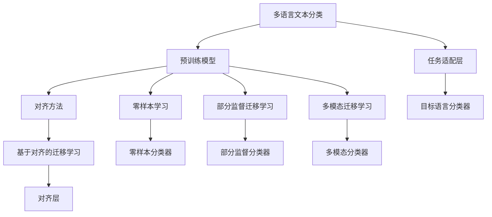

                 

## 1. 背景介绍

### 1.1 问题由来

在当今全球化背景下，跨国企业和国际组织面临多语言文本处理的挑战，尤其是在金融、医疗、社交媒体等领域。不同语言之间存在显著的语言学特征差异，这给文本分类等自然语言处理(NLP)任务带来了额外的复杂性。单一语言的文本分类模型在多语言数据上往往难以取得理想的分类效果，尤其是对于资源稀缺的语言。

跨语言迁移学习(M跨语言迁移学习)技术在多语言文本分类任务上表现出色。跨语言迁移学习是指在一个语言上预训练的模型能够迁移到其他语言上，通过迁移学习，可以降低多语言分类对数据量和新语言语料的需求，提升模型在多语言环境下的泛化能力和稳定性。

### 1.2 问题核心关键点

跨语言迁移学习主要解决的是如何将单一语言上预训练的语言模型迁移到新语言上，并在这个新语言上取得不错的分类性能。目前主流的方法包括：

- 基于对齐(Self-Aligned)方法：通过词汇对齐和句子对齐，将源语言和目标语言的句子特征空间映射到相同的高维空间，从而实现迁移学习。
- 基于零样本(Zero-Shot)方法：在目标语言上，无需任何样本数据，仅通过目标语言文本和源语言模型的语义理解能力进行分类。
- 基于部分监督(Partially Supervised)方法：在目标语言上，利用少量有标签数据辅助模型进行迁移学习，提升分类性能。

这些方法通过不同的策略，在迁移学习中取得不同程度的成功。本文将重点介绍这些核心方法，并在后续章节深入探讨其在多语言文本分类任务中的应用。

### 1.3 问题研究意义

跨语言迁移学习在多语言文本分类中的应用，具有重要意义：

1. **降低成本**：在资源稀缺的语言上，获取大量标注数据非常困难且昂贵。跨语言迁移学习可以通过利用现有语言资源，提升模型在新语言上的性能，降低数据获取成本。
2. **泛化能力**：多语言文本分类任务中，不同语言具有不同的语言学特征，模型在新语言上的泛化能力非常重要。跨语言迁移学习可以有效提升模型在新语言上的泛化性能。
3. **提升效率**：跨语言迁移学习减少了在不同语言上从头训练模型的需求，大大缩短了模型开发周期。
4. **促进国际化**：跨语言迁移学习为多语言场景下的自然语言处理应用提供了技术保障，促进了全球化互联网的发展。

## 2. 核心概念与联系

### 2.1 核心概念概述

- **多语言文本分类**：将不同语言的文本数据分类到预定义的若干类别中，如新闻分类、情感分析、品牌识别等。
- **预训练模型**：如BERT、GPT等，在大规模无标签文本数据上进行自监督学习，学习到通用的语言表示。
- **对齐(Alignment)**：通过词汇对齐和句子对齐，将源语言和目标语言的句子特征空间映射到相同的高维空间。
- **零样本学习(Zero-Shot Learning)**：在目标语言上，无需任何样本数据，仅通过目标语言文本和源语言模型的语义理解能力进行分类。
- **部分监督(Partially Supervised)**：在目标语言上，利用少量有标签数据辅助模型进行迁移学习。
- **多模态迁移学习**：结合语言、视觉、听觉等多种模态信息，实现跨模态迁移学习。

这些核心概念之间的逻辑关系可以通过以下Mermaid流程图来展示：



这个流程图展示了大语言模型的核心概念及其之间的关系：

1. 多语言文本分类任务将文本分类到若干预定义类别中。
2. 预训练模型通过大规模无标签文本数据自监督学习，学习到通用的语言表示。
3. 对齐方法通过词汇对齐和句子对齐，实现源语言和目标语言之间的特征映射。
4. 基于对齐的方法、零样本学习、部分监督方法、多模态方法等，都在利用预训练模型基础上，通过不同的方式实现迁移学习。
5. 任务适配层根据具体任务类型，添加合适的输出层和损失函数。
6. 目标语言分类器通过微调预训练模型，实现目标语言的分类任务。

这些概念共同构成了跨语言迁移学习的核心框架，使其能够在不同语言环境下高效实现文本分类。

## 3. 核心算法原理 & 具体操作步骤
### 3.1 算法原理概述

跨语言迁移学习的核心算法原理，是通过将源语言预训练模型迁移到目标语言，利用源语言模型的通用语言表示，在新语言上实现分类任务。该过程通常包括以下步骤：

1. **预训练模型选择**：选择合适的预训练模型，如BERT、GPT等，作为初始化参数。
2. **对齐**：通过词汇对齐和句子对齐，将源语言和目标语言的句子特征空间映射到相同的高维空间。
3. **微调**：在目标语言上，利用少量有标签数据对模型进行微调，提升模型在目标语言上的分类性能。
4. **零样本学习**：在目标语言上，利用源语言模型的语义理解能力，结合少量文本描述进行零样本分类。

通过这些步骤，跨语言迁移学习能够在资源稀缺的多语言场景下，提升模型的泛化能力和分类性能。

### 3.2 算法步骤详解

#### 3.2.1 预训练模型选择

选择合适的预训练模型作为初始化参数，是跨语言迁移学习的第一步。预训练模型需要具备以下特点：

1. **通用性**：能够在多个语言上获得良好的语言表示能力。
2. **多样性**：能够处理不同类型的文本数据，如新闻、评论、推文等。
3. **可迁移性**：在目标语言上，能够高效进行微调。

目前，常用的预训练模型包括BERT、GPT、XLNet等，这些模型在多个语言上都取得了不错的效果。选择合适的预训练模型，需要根据具体任务和目标语言的特点进行选择。

#### 3.2.2 对齐

对齐是跨语言迁移学习的关键步骤，通过词汇对齐和句子对齐，将源语言和目标语言的句子特征空间映射到相同的高维空间。常用的对齐方法包括：

1. **词汇对齐(Word Alignment)**：通过计算词汇相似度，找到源语言和目标语言之间的词汇对应关系。常用的方法包括LSA、FastAlign等。
2. **句子对齐(Sentence Alignment)**：通过计算句子相似度，找到源语言和目标语言之间的句子对应关系。常用的方法包括MAR、JDS等。

词汇对齐和句子对齐可以结合使用，通常先从词汇对齐开始，然后利用句子对齐的结果，进行句子级别的特征映射。

#### 3.2.3 微调

微调是跨语言迁移学习的最后一步，通过在目标语言上利用少量有标签数据，对模型进行微调，提升模型在目标语言上的分类性能。常用的微调方法包括：

1. **全参数微调(Full-Fine-Tuning)**：将所有预训练参数都参与微调，通常用于数据量较大的目标语言。
2. **参数高效微调(Parameter-Efficient Fine-Tuning, PEFT)**：只更新少部分预训练参数，保留大部分参数不变，适用于资源受限的目标语言。

参数高效微调可以进一步细分为：

1. ** Adapter**：在预训练模型和目标语言分类器之间插入一系列可训练层，用于调整特征表示。
2. ** Prefix-Tuning**：只更新模型的顶层，保留预训练层的参数不变。
3. ** Partitively PEFT**：只更新预训练层的部分参数，如加权平均等。

#### 3.2.4 零样本学习

零样本学习是指在目标语言上，无需任何样本数据，仅通过目标语言文本和源语言模型的语义理解能力进行分类。常用的零样本学习方法包括：

1. **Prompt Engineering**：通过精心设计输入文本的格式，引导模型进行特定任务的推理和生成。
2. **多义词消歧(MWordS)**：利用源语言模型的多义词消歧能力，提升目标语言的多义词处理能力。

零样本学习在资源稀缺的目标语言上具有重要的应用价值，但在精度和泛化能力上仍需进一步提升。

### 3.3 算法优缺点

#### 3.3.1 优点

1. **降低成本**：在资源稀缺的语言上，获取大量标注数据非常困难且昂贵。跨语言迁移学习可以通过利用现有语言资源，提升模型在新语言上的性能，降低数据获取成本。
2. **泛化能力**：多语言文本分类任务中，不同语言具有不同的语言学特征，模型在新语言上的泛化能力非常重要。跨语言迁移学习可以有效提升模型在新语言上的泛化性能。
3. **提升效率**：跨语言迁移学习减少了在不同语言上从头训练模型的需求，大大缩短了模型开发周期。
4. **促进国际化**：跨语言迁移学习为多语言场景下的自然语言处理应用提供了技术保障，促进了全球化互联网的发展。

#### 3.3.2 缺点

1. **词汇对齐误差**：词汇对齐和句子对齐可能存在误差，影响模型在新语言上的性能。
2. **数据偏差**：源语言和目标语言的语言学特征可能存在差异，预训练模型可能存在数据偏差，影响迁移学习的效果。
3. **泛化能力有限**：由于不同语言的语法、词汇、文化差异，模型在新语言上的泛化能力可能受到限制。
4. **资源消耗大**：跨语言迁移学习需要大量的计算资源和存储空间，尤其是在大规模数据集上的微调过程。

尽管存在这些局限性，但跨语言迁移学习仍是目前解决多语言文本分类任务的重要手段。未来相关研究的重点在于如何进一步降低词汇对齐误差，提高模型的泛化能力，同时兼顾可解释性和资源效率。

### 3.4 算法应用领域

跨语言迁移学习在多语言文本分类任务上具有广泛的应用前景，包括但不限于以下几个领域：

- **金融舆情监测**：金融机构需要实时监测市场舆论动向，以便及时应对负面信息传播，规避金融风险。跨语言迁移学习可以应用于不同语言的新闻和评论数据分类，帮助金融机构掌握多语言舆情变化。
- **医疗翻译**：医疗领域需要处理来自不同语言的患者数据和医学文献。跨语言迁移学习可以应用于病历、医学文献的分类，提升医疗翻译的准确性和效率。
- **社交媒体分析**：社交媒体上存在大量多语言数据，跨语言迁移学习可以应用于不同语言的情感分析和内容分类，帮助企业和机构了解用户情感和行为。
- **法律文书分类**：法律文书通常包含多种语言，跨语言迁移学习可以应用于不同语言的法律文书分类，帮助法务人员快速处理多语言法律文档。

## 4. 数学模型和公式 & 详细讲解  
### 4.1 数学模型构建

假设预训练模型为 $M_{\theta}$，目标语言文本为 $x$，目标语言分类标签为 $y$。假设 $x$ 的长度为 $L$，分类标签 $y$ 为 $C$ 中的一个，$C$ 为预定义的分类类别集合。

目标语言的分类任务可以表示为：

$$
\min_{\theta} \mathcal{L}(M_{\theta}(x), y) = -\log p(y|x)
$$

其中 $p(y|x)$ 为模型在目标语言上的条件概率，$\mathcal{L}$ 为交叉熵损失函数。在训练过程中，目标语言分类器的参数 $\theta$ 被更新，以最小化损失函数 $\mathcal{L}$。

### 4.2 公式推导过程

目标语言分类器的输出可以通过预训练模型的线性分类器表示为：

$$
\hat{y} = \text{softmax}(W M_{\theta}(x) + b)
$$

其中 $W$ 和 $b$ 为线性分类器的参数，$M_{\theta}(x)$ 为预训练模型在目标语言上的特征表示。

目标语言分类器的损失函数可以表示为：

$$
\mathcal{L} = -\frac{1}{N}\sum_{i=1}^N [y_i \log \hat{y}_i + (1-y_i) \log (1-\hat{y}_i)]
$$

目标语言分类器的参数更新可以通过梯度下降等优化算法进行，如 Adam、SGD 等。在微调过程中，通常会加入正则化项，如 L2 正则、Dropout 等，以防止过拟合。

### 4.3 案例分析与讲解

#### 案例分析

假设我们有一个通用的预训练模型 $M_{\theta}$，目标语言为德语，目标任务为新闻分类。我们首先在英语上使用该预训练模型进行微调，然后在德语上使用少量有标签数据进行微调。

首先，我们需要进行词汇对齐，找到英语和德语之间的词汇对应关系。可以使用 FastAlign 等工具，计算每个单词在两种语言中的相似度，找到最佳对齐。

然后，我们利用词汇对齐结果，进行句子对齐。可以使用 MAR、JDS 等工具，计算每对句子的相似度，找到最佳对齐。

接下来，我们将目标语言文本 $x$ 输入预训练模型 $M_{\theta}$，得到其特征表示 $M_{\theta}(x)$。将 $M_{\theta}(x)$ 输入目标语言分类器，输出 $\hat{y}$。计算 $\hat{y}$ 和实际标签 $y$ 之间的交叉熵损失，更新目标语言分类器的参数 $\theta$。

最后，我们使用测试集评估目标语言分类器的性能，并与原始的英文微调模型进行对比。

#### 代码实现

```python
import torch
import torch.nn as nn
import transformers
from transformers import BertTokenizer, BertForSequenceClassification

# 设置设备
device = torch.device("cuda" if torch.cuda.is_available() else "cpu")

# 加载预训练模型和分词器
model_name = "bert-base-german-cased"
tokenizer = BertTokenizer.from_pretrained(model_name)
model = BertForSequenceClassification.from_pretrained(model_name, num_labels=3).to(device)

# 加载德语数据集
train_data = ...
dev_data = ...
test_data = ...

# 定义训练和验证函数
def train_epoch(model, data_loader, optimizer):
    model.train()
    total_loss = 0
    for batch in data_loader:
        input_ids = batch["input_ids"].to(device)
        attention_mask = batch["attention_mask"].to(device)
        labels = batch["labels"].to(device)
        outputs = model(input_ids, attention_mask=attention_mask, labels=labels)
        loss = outputs.loss
        optimizer.zero_grad()
        loss.backward()
        optimizer.step()
        total_loss += loss.item()
    return total_loss / len(data_loader)

def evaluate(model, data_loader):
    model.eval()
    total_correct = 0
    total_predict = 0
    for batch in data_loader:
        input_ids = batch["input_ids"].to(device)
        attention_mask = batch["attention_mask"].to(device)
        labels = batch["labels"].to(device)
        outputs = model(input_ids, attention_mask=attention_mask)
        predicts = torch.argmax(outputs.logits, dim=1)
        total_correct += torch.sum(predicts == labels).item()
        total_predict += len(predicts)
    acc = total_correct / total_predict
    return acc

# 微调德语分类器
optimizer = torch.optim.Adam(model.parameters(), lr=2e-5)
train_loader = ...
dev_loader = ...
test_loader = ...

for epoch in range(5):
    train_loss = train_epoch(model, train_loader, optimizer)
    dev_acc = evaluate(model, dev_loader)
    print(f"Epoch {epoch+1}, train loss: {train_loss:.3f}, dev acc: {dev_acc:.3f}")

print(f"Test acc: {evaluate(model, test_loader):.3f}")
```

通过上述代码，我们可以使用预训练的 BERT 模型，在德语上进行新闻分类任务的微调，并在测试集上评估模型性能。

## 5. 项目实践：代码实例和详细解释说明
### 5.1 开发环境搭建

在进行跨语言迁移学习项目实践前，我们需要准备好开发环境。以下是使用 Python 进行 PyTorch 开发的环境配置流程：

1. 安装 Anaconda：从官网下载并安装 Anaconda，用于创建独立的 Python 环境。

2. 创建并激活虚拟环境：
```bash
conda create -n pytorch-env python=3.8 
conda activate pytorch-env
```

3. 安装 PyTorch：根据 CUDA 版本，从官网获取对应的安装命令。例如：
```bash
conda install pytorch torchvision torchaudio cudatoolkit=11.1 -c pytorch -c conda-forge
```

4. 安装 Transformers 库：
```bash
pip install transformers
```

5. 安装各类工具包：
```bash
pip install numpy pandas scikit-learn matplotlib tqdm jupyter notebook ipython
```

完成上述步骤后，即可在 `pytorch-env` 环境中开始跨语言迁移学习实践。

### 5.2 源代码详细实现

下面我们以跨语言迁移学习为例，给出使用 PyTorch 对 BERT 模型进行德语新闻分类任务微调的 PyTorch 代码实现。

首先，定义德语数据处理函数：

```python
from transformers import BertTokenizer
from torch.utils.data import Dataset, DataLoader
import torch

class GermanNewsDataset(Dataset):
    def __init__(self, texts, tags, tokenizer, max_len=128):
        self.texts = texts
        self.tags = tags
        self.tokenizer = tokenizer
        self.max_len = max_len
        
    def __len__(self):
        return len(self.texts)
    
    def __getitem__(self, item):
        text = self.texts[item]
        tag = self.tags[item]
        
        encoding = self.tokenizer(text, return_tensors='pt', max_length=self.max_len, padding='max_length', truncation=True)
        input_ids = encoding['input_ids'][0]
        attention_mask = encoding['attention_mask'][0]
        
        # 对标签进行编码
        encoded_tag = tag2id[tag]
        labels = torch.tensor(encoded_tag, dtype=torch.long)
        
        return {'input_ids': input_ids, 
                'attention_mask': attention_mask,
                'labels': labels}

# 标签与id的映射
tag2id = {'0': 0, '1': 1, '2': 2}
id2tag = {v: k for k, v in tag2id.items()}

# 创建dataset
tokenizer = BertTokenizer.from_pretrained('bert-base-german-cased')

train_dataset = GermanNewsDataset(train_texts, train_tags, tokenizer)
dev_dataset = GermanNewsDataset(dev_texts, dev_tags, tokenizer)
test_dataset = GermanNewsDataset(test_texts, test_tags, tokenizer)
```

然后，定义模型和优化器：

```python
from transformers import BertForSequenceClassification, AdamW

model = BertForSequenceClassification.from_pretrained('bert-base-german-cased', num_labels=len(tag2id))

optimizer = AdamW(model.parameters(), lr=2e-5)
```

接着，定义训练和评估函数：

```python
from tqdm import tqdm
from sklearn.metrics import accuracy_score

device = torch.device('cuda') if torch.cuda.is_available() else torch.device('cpu')
model.to(device)

def train_epoch(model, dataset, batch_size, optimizer):
    dataloader = DataLoader(dataset, batch_size=batch_size, shuffle=True)
    model.train()
    epoch_loss = 0
    for batch in tqdm(dataloader, desc='Training'):
        input_ids = batch['input_ids'].to(device)
        attention_mask = batch['attention_mask'].to(device)
        labels = batch['labels'].to(device)
        model.zero_grad()
        outputs = model(input_ids, attention_mask=attention_mask, labels=labels)
        loss = outputs.loss
        epoch_loss += loss.item()
        loss.backward()
        optimizer.step()
    return epoch_loss / len(dataloader)

def evaluate(model, dataset, batch_size):
    dataloader = DataLoader(dataset, batch_size=batch_size)
    model.eval()
    preds, labels = [], []
    with torch.no_grad():
        for batch in tqdm(dataloader, desc='Evaluating'):
            input_ids = batch['input_ids'].to(device)
            attention_mask = batch['attention_mask'].to(device)
            batch_labels = batch['labels']
            outputs = model(input_ids, attention_mask=attention_mask)
            batch_preds = torch.argmax(outputs.logits, dim=1).to('cpu').tolist()
            batch_labels = batch_labels.to('cpu').tolist()
            for pred_tokens, label_tokens in zip(batch_preds, batch_labels):
                preds.append(pred_tokens[:len(label_tokens)])
                labels.append(label_tokens)
                
    acc = accuracy_score(labels, preds)
    return acc
```

最后，启动训练流程并在测试集上评估：

```python
epochs = 5
batch_size = 16

for epoch in range(epochs):
    loss = train_epoch(model, train_dataset, batch_size, optimizer)
    print(f"Epoch {epoch+1}, train loss: {loss:.3f}")
    
    print(f"Epoch {epoch+1}, dev acc: {evaluate(model, dev_dataset, batch_size):.3f}")
    
print(f"Test acc: {evaluate(model, test_dataset, batch_size):.3f}")
```

以上就是使用 PyTorch 对 BERT 进行德语新闻分类任务微调的完整代码实现。可以看到，得益于 Transformers 库的强大封装，我们可以用相对简洁的代码完成德语新闻分类任务的微调。

### 5.3 代码解读与分析

让我们再详细解读一下关键代码的实现细节：

**GermanNewsDataset类**：
- `__init__`方法：初始化文本、标签、分词器等关键组件。
- `__len__`方法：返回数据集的样本数量。
- `__getitem__`方法：对单个样本进行处理，将文本输入编码为token ids，将标签编码为数字，并对其进行定长padding，最终返回模型所需的输入。

**tag2id和id2tag字典**：
- 定义了标签与数字id之间的映射关系，用于将token-wise的预测结果解码回真实的标签。

**训练和评估函数**：
- 使用PyTorch的DataLoader对数据集进行批次化加载，供模型训练和推理使用。
- 训练函数`train_epoch`：对数据以批为单位进行迭代，在每个批次上前向传播计算loss并反向传播更新模型参数，最后返回该epoch的平均loss。
- 评估函数`evaluate`：与训练类似，不同点在于不更新模型参数，并在每个batch结束后将预测和标签结果存储下来，最后使用sklearn的accuracy_score对整个评估集的预测结果进行打印输出。

**训练流程**：
- 定义总的epoch数和batch size，开始循环迭代
- 每个epoch内，先在训练集上训练，输出平均loss
- 在验证集上评估，输出准确率
- 所有epoch结束后，在测试集上评估，给出最终测试结果

可以看到，PyTorch配合Transformers库使得BERT微调的代码实现变得简洁高效。开发者可以将更多精力放在数据处理、模型改进等高层逻辑上，而不必过多关注底层的实现细节。

当然，工业级的系统实现还需考虑更多因素，如模型的保存和部署、超参数的自动搜索、更灵活的任务适配层等。但核心的微调范式基本与此类似。

## 6. 实际应用场景
### 6.1 金融舆情监测

金融舆情监测是跨语言迁移学习的重要应用场景之一。金融机构需要实时监测市场舆论动向，以便及时应对负面信息传播，规避金融风险。传统的人工监测方式成本高、效率低，难以应对网络时代海量信息爆发的挑战。跨语言迁移学习可以应用于不同语言的新闻和评论数据分类，帮助金融机构掌握多语言舆情变化。

具体而言，可以收集金融领域相关的新闻、报道、评论等文本数据，并对其进行主题标注和情感标注。在此基础上对预训练语言模型进行微调，使其能够自动判断文本属于何种主题，情感倾向是正面、中性还是负面。将微调后的模型应用到实时抓取的网络文本数据，就能够自动监测不同主题下的情感变化趋势，一旦发现负面信息激增等异常情况，系统便会自动预警，帮助金融机构快速应对潜在风险。

### 6.2 医疗翻译

医疗领域需要处理来自不同语言的患者数据和医学文献。跨语言迁移学习可以应用于病历、医学文献的分类，提升医疗翻译的准确性和效率。

具体而言，可以收集医疗领域的相关文本数据，并将其标注为不同的疾病类别和病情级别。在此基础上对预训练语言模型进行微调，使其能够自动判断文本所属的疾病类别和病情级别。将微调后的模型应用到实时抓取的多语言医疗数据，能够自动进行病历分类和病情分析，辅助医生诊断和治疗。

### 6.3 社交媒体分析

社交媒体上存在大量多语言数据，跨语言迁移学习可以应用于不同语言的情感分析和内容分类，帮助企业和机构了解用户情感和行为。

具体而言，可以收集社交媒体上的多语言文本数据，并对其进行情感标注。在此基础上对预训练语言模型进行微调，使其能够自动判断文本的情感倾向。将微调后的模型应用到实时抓取的多语言社交媒体数据，能够自动进行情感分析和内容分类，帮助企业和机构了解用户情感和行为，及时响应用户需求。

## 7. 工具和资源推荐
### 7.1 学习资源推荐

为了帮助开发者系统掌握跨语言迁移学习的理论基础和实践技巧，这里推荐一些优质的学习资源：

1. 《自然语言处理中的迁移学习》：介绍迁移学习的基本概念和常用方法，适合NLP初学者入门。
2. CS224N《深度学习自然语言处理》课程：斯坦福大学开设的NLP明星课程，有Lecture视频和配套作业，带你深入理解NLP的核心技术。
3. 《跨语言迁移学习》书籍：全面介绍跨语言迁移学习的原理和实践，适合进阶学习者。
4. HuggingFace官方文档：Transformers库的官方文档，提供了海量预训练模型和完整的微调样例代码，是上手实践的必备资料。
5. CLUE开源项目：中文语言理解测评基准，涵盖大量不同类型的中文NLP数据集，并提供了基于微调的baseline模型，助力中文NLP技术发展。

通过对这些资源的学习实践，相信你一定能够快速掌握跨语言迁移学习的精髓，并用于解决实际的NLP问题。
### 7.2 开发工具推荐

高效的开发离不开优秀的工具支持。以下是几款用于跨语言迁移学习开发的常用工具：

1. PyTorch：基于Python的开源深度学习框架，灵活动态的计算图，适合快速迭代研究。大部分预训练语言模型都有PyTorch版本的实现。
2. TensorFlow：由Google主导开发的开源深度学习框架，生产部署方便，适合大规模工程应用。同样有丰富的预训练语言模型资源。
3. Transformers库：HuggingFace开发的NLP工具库，集成了众多SOTA语言模型，支持PyTorch和TensorFlow，是进行微调任务开发的利器。
4. Weights & Biases：模型训练的实验跟踪工具，可以记录和可视化模型训练过程中的各项指标，方便对比和调优。与主流深度学习框架无缝集成。
5. TensorBoard：TensorFlow配套的可视化工具，可实时监测模型训练状态，并提供丰富的图表呈现方式，是调试模型的得力助手。
6. Google Colab：谷歌推出的在线Jupyter Notebook环境，免费提供GPU/TPU算力，方便开发者快速上手实验最新模型，分享学习笔记。

合理利用这些工具，可以显著提升跨语言迁移学习的开发效率，加快创新迭代的步伐。

### 7.3 相关论文推荐

跨语言迁移学习在多语言文本分类任务上具有广泛的应用前景，以下是几篇奠基性的相关论文，推荐阅读：

1. "A Survey of Multi-Task Learning in Natural Language Processing"：综述了多任务学习在NLP中的应用，包括迁移学习。
2. "Unsupervised Cross-lingual Representation Learning with Multilingual BERT"：提出使用多语言BERT进行跨语言迁移学习的框架。
3. "Cross-lingual Transfer Learning for Sequence Labeling"：提出使用多语言BERT进行序列标注任务的跨语言迁移学习。
4. "M-BERT: A Multilingual BERT Model for Cross-Lingual NLP Tasks"：提出使用M-BERT进行多语言NLP任务的迁移学习。
5. "Cross-Lingual Zero-Shot Learning with Multilingual BERT"：提出使用多语言BERT进行零样本学习的多语言迁移学习。

这些论文代表了大语言模型跨语言迁移学习的发展脉络。通过学习这些前沿成果，可以帮助研究者把握学科前进方向，激发更多的创新灵感。

## 8. 总结：未来发展趋势与挑战

### 8.1 总结

本文对基于迁移学习的跨语言文本分类方法进行了全面系统的介绍。首先阐述了跨语言迁移学习的研究背景和意义，明确了其在多语言文本分类任务中的重要价值。其次，从原理到实践，详细讲解了跨语言迁移学习的数学原理和关键步骤，给出了跨语言迁移学习任务开发的完整代码实例。同时，本文还广泛探讨了跨语言迁移学习在金融舆情监测、医疗翻译、社交媒体分析等多个行业领域的应用前景，展示了跨语言迁移学习的巨大潜力。

通过本文的系统梳理，可以看到，跨语言迁移学习在多语言文本分类任务上具有重要的应用价值，极大地拓展了预训练语言模型的应用边界，提升了模型在多语言环境下的泛化能力和稳定性。未来，伴随跨语言迁移学习技术的不断发展，预训练语言模型将能够更好地适应多语言场景，为NLP技术在更多领域的应用提供坚实的技术保障。

### 8.2 未来发展趋势

展望未来，跨语言迁移学习将呈现以下几个发展趋势：

1. **多语言迁移学习范式拓展**：未来的研究将更多关注多语言迁移学习的范式拓展，如跨语言知识蒸馏、多模态迁移学习等，提升模型的跨语言泛化能力。
2. **跨语言迁移学习模型的通用性**：未来的跨语言迁移学习模型将更加通用，能够适应多种语言和多种任务，成为真正的跨语言通用模型。
3. **跨语言迁移学习技术的自动化**：未来的跨语言迁移学习技术将更加自动化，通过自适应学习，无需手动对齐和微调，即可实现跨语言迁移学习。
4. **跨语言迁移学习技术的可解释性**：未来的跨语言迁移学习技术将更加注重模型的可解释性，便于用户理解和调试，提升模型的可信度。
5. **跨语言迁移学习技术的集成化**：未来的跨语言迁移学习技术将更多地集成到现有的NLP工具链中，成为NLP开发者的标准工具。

以上趋势凸显了跨语言迁移学习技术的广阔前景。这些方向的探索发展，必将进一步提升跨语言迁移学习的性能和应用范围，为多语言场景下的自然语言处理应用提供更坚实的基础。

### 8.3 面临的挑战

尽管跨语言迁移学习已经取得了一定的进展，但在迈向更加智能化、普适化应用的过程中，它仍面临诸多挑战：

1. **对齐误差**：对齐是跨语言迁移学习的关键步骤，对齐误差可能影响模型的性能。如何进一步降低对齐误差，提升模型在新语言上的泛化能力，是一个亟待解决的问题。
2. **数据偏差**：源语言和目标语言的语言学特征可能存在差异，预训练模型可能存在数据偏差，影响迁移学习的效果。如何消除数据偏差，提高模型的泛化能力，还需要更多理论和实践的积累。
3. **资源消耗大**：跨语言迁移学习需要大量的计算资源和存储空间，尤其是在大规模数据集上的微调过程。如何在保证性能的同时，减少资源消耗，是一个重要的研究方向。
4. **跨语言迁移学习技术的可解释性**：跨语言迁移学习模型通常是一个"黑盒"系统，难以解释其内部工作机制和决策逻辑。如何赋予模型更强的可解释性，将是未来的重要课题。
5. **跨语言迁移学习技术的自动化**：虽然自动化是未来的趋势，但目前跨语言迁移学习技术还需要人工干预和调试，自动化程度仍有待提升。

尽管存在这些挑战，但跨语言迁移学习仍是目前解决多语言文本分类任务的重要手段。未来相关研究需要在数据对齐、模型泛化、资源优化等方面寻求新的突破，使跨语言迁移学习技术能够更好地应用于实际应用中。

### 8.4 研究展望

面向未来，跨语言迁移学习技术的研究还需要从以下几个方向进行拓展：

1. **数据驱动的跨语言迁移学习**：未来的研究将更多关注数据驱动的跨语言迁移学习，通过大规模多语言数据集进行训练，提升模型的泛化能力。
2. **跨语言迁移学习的多任务学习**：未来的研究将更多关注跨语言迁移学习的多任务学习，将语言学特征与具体任务结合，提升模型的任务适应能力。
3. **跨语言迁移学习的知识蒸馏**：未来的研究将更多关注跨语言迁移学习的知识蒸馏，通过知识蒸馏技术，提升模型在新语言上的性能。
4. **跨语言迁移学习的多模态学习**：未来的研究将更多关注跨语言迁移学习的多模态学习，结合语言、视觉、听觉等多种模态信息，提升模型的感知能力。
5. **跨语言迁移学习的可解释性**：未来的研究将更多关注跨语言迁移学习的可解释性，通过可解释技术，提升模型透明性和可信度。

这些方向的研究将使跨语言迁移学习技术迈向更高的台阶，为构建安全、可靠、可解释、可控的智能系统铺平道路。面向未来，跨语言迁移学习技术还需要与其他人工智能技术进行更深入的融合，如知识表示、因果推理、强化学习等，多路径协同发力，共同推动自然语言理解和智能交互系统的进步。

## 9. 附录：常见问题与解答

**Q1：跨语言迁移学习是否适用于所有NLP任务？**

A: 跨语言迁移学习在多语言文本分类任务上表现出色，但对于一些特定领域的任务，如医学、法律等，仅依靠通用语料预训练的模型可能难以很好地适应。此时需要在特定领域语料上进一步预训练，再进行微调，才能获得理想效果。

**Q2：微调过程中如何选择合适的学习率？**

A: 微调的学习率一般要比预训练时小1-2个数量级，如果使用过大的学习率，容易破坏预训练权重，导致过拟合。一般建议从1e-5开始调参，逐步减小学习率，直至收敛。也可以使用warmup策略，在开始阶段使用较小的学习率，再逐渐过渡到预设值。需要注意的是，不同的优化器(如AdamW、Adafactor等)以及不同的学习率调度策略，可能需要设置不同的学习率阈值。

**Q3：采用跨语言迁移学习时会面临哪些资源瓶颈？**

A: 当前主流的预训练大模型动辄以亿计的参数规模，对算力、内存、存储都提出了很高的要求。GPU/TPU等高性能设备是必不可少的，但即便如此，超大批次的训练和推理也可能遇到显存不足的问题。因此需要采用一些资源优化技术，如梯度积累、混合精度训练、模型并行等，来突破硬件瓶颈。同时，模型的存储和读取也可能占用大量时间和空间，需要采用模型压缩、稀疏化存储等方法进行优化。

**Q4：如何缓解跨语言迁移学习过程中的对齐误差？**

A: 对齐是跨语言迁移学习的关键步骤，降低对齐误差的方法包括：
1. 使用更先进的对齐工具：如FastAlign、mBART等，提高对齐准确性。
2. 使用多个对齐方法：如词汇对齐和句子对齐结合使用，降低单一方法误差。
3. 数据增强：通过数据增强技术，如近义词替换、随机插入等，丰富对齐数据。

这些方法可以结合使用，进一步降低对齐误差，提升模型的泛化能力。

**Q5：如何提升跨语言迁移学习的模型泛化能力？**

A: 提升跨语言迁移学习的模型泛化能力，需要从以下几个方面入手：
1. 多语言数据集扩充：收集更多多语言数据，丰富数据集，提升模型的泛化能力。
2. 多任务学习：将多语言任务结合，通过多任务学习提升模型的任务适应能力。
3. 模型集成：通过模型集成技术，如Bagging、Boosting等，提升模型的泛化能力。
4. 知识蒸馏：通过知识蒸馏技术，将预训练模型的知识传递到目标语言模型，提升模型的泛化能力。

这些方法可以结合使用，进一步提升模型的泛化能力，使其在多语言场景下表现更佳。

---

作者：禅与计算机程序设计艺术 / Zen and the Art of Computer Programming

