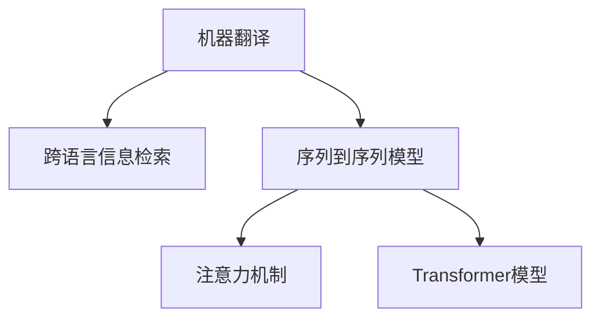

                 

# 多语言翻译：AI的语言桥梁

## 1. 背景介绍

### 1.1 问题由来
全球化的浪潮催生了多语言交流的需求。无论是国际商务、学术交流，还是日常生活，多语言翻译已经成为跨越文化差异、促进理解沟通的重要工具。然而，传统的翻译工作依赖于专业翻译人员，不仅耗时耗力，且容易受到个体差异的影响，难以满足大规模实时翻译的需求。

随着人工智能技术的进步，特别是深度学习的发展，多语言翻译技术迎来了新的突破。基于神经网络的大规模语言模型如BERT、GPT等，为实现高效、准确的翻译提供了新的可能。通过预训练语言模型和微调技术，AI可以学习语言的通用表示，并在特定任务上进行优化，实现多语言翻译。

### 1.2 问题核心关键点
多语言翻译的核心问题在于如何高效地将一种语言转换为另一种语言，同时尽可能地保留原语言的语义和风格。主要技术包括：
1. **机器翻译(Translation Machine)**：利用预训练语言模型，将源语言转换为目标语言。
2. **跨语言信息检索(Cross-Language Information Retrieval, CLIR)**：在多语言语料库中检索与目标语言相似的信息，辅助翻译工作。
3. **多语言对话系统(Multi-language Dialogue System)**：实现跨语言的自然对话，促进人机交流。

## 2. 核心概念与联系

### 2.1 核心概念概述

为更好地理解多语言翻译的实现原理和优化方法，本节将介绍几个密切相关的核心概念：

- **机器翻译(Translation Machine)**：使用神经网络模型，将一种自然语言自动翻译为另一种自然语言。
- **跨语言信息检索(CLIR)**：利用多语言语料库，在目标语言中检索与源语言相似的信息，辅助翻译工作。
- **多语言对话系统(Multi-language Dialogue System)**：支持跨语言对话的AI系统，能够进行自然语言交互。
- **序列到序列模型(Sequence-to-Sequence, Seq2Seq)**：一种经典的机器翻译模型，由编码器(Encoder)和解码器(Decoder)组成，可以实现端到端翻译。
- **注意力机制(Attention Mechanism)**：在Seq2Seq模型中用于提高翻译质量的关键技术，通过动态调整模型对不同部分的关注度，提升翻译的准确性。
- **Transformer模型**：一种基于注意力机制的神经网络架构，大大提升了机器翻译的效率和效果。

这些核心概念之间的逻辑关系可以通过以下Mermaid流程图来展示：



这个流程图展示了大语言模型的核心概念及其之间的关系：

1. 机器翻译是主要任务。
2. 跨语言信息检索辅助翻译。
3. 序列到序列模型是基本架构。
4. 注意力机制和Transformer模型是关键技术。

这些概念共同构成了多语言翻译的实现框架，使其能够在各种场景下发挥强大的语言转换能力。通过理解这些核心概念，我们可以更好地把握多语言翻译的工作原理和优化方向。

## 3. 核心算法原理 & 具体操作步骤
### 3.1 算法原理概述

基于神经网络的机器翻译方法，通过预训练语言模型，学习源语言和目标语言之间的映射关系，实现从源语言到目标语言的自动转换。其核心思想是：

1. 将源语言编码成一个固定长度的向量表示。
2. 将向量解码成目标语言的文本。
3. 在编码和解码过程中，利用注意力机制，提高翻译质量。

形式化地，假设源语言为 $S$，目标语言为 $T$，语言模型为 $P(S|T)$，则机器翻译的目标是最大化后验概率 $P(T|S)$。

### 3.2 算法步骤详解

基于神经网络的机器翻译通常包括以下几个关键步骤：

**Step 1: 准备预训练模型和数据集**
- 选择合适的预训练语言模型，如BERT、GPT等。
- 准备源语言和目标语言的双语对照文本数据集，划分为训练集、验证集和测试集。

**Step 2: 定义序列到序列模型**
- 使用Seq2Seq框架，定义编码器和解码器，选择合适的神经网络层和激活函数。
- 将编码器和解码器的输出连接起来，进行拼接或相加，生成翻译结果。

**Step 3: 设计注意力机制**
- 在编码器和解码器之间添加注意力层，根据上下文动态调整关注度。
- 使用多头注意力机制，从源语言的不同部分获取信息。

**Step 4: 设置超参数**
- 选择合适的优化算法及其参数，如Adam、SGD等，设置学习率、批大小、迭代轮数等。
- 设置正则化技术及强度，包括权重衰减、Dropout、Early Stopping等。
- 确定冻结预训练参数的策略，如仅微调顶层，或全部参数都参与微调。

**Step 5: 执行梯度训练**
- 将训练集数据分批次输入模型，前向传播计算损失函数。
- 反向传播计算参数梯度，根据设定的优化算法和学习率更新模型参数。
- 周期性在验证集上评估模型性能，根据性能指标决定是否触发 Early Stopping。
- 重复上述步骤直到满足预设的迭代轮数或 Early Stopping 条件。

**Step 6: 测试和部署**
- 在测试集上评估翻译模型的性能，对比微调前后的BLEU、METEOR等指标提升。
- 使用微调后的模型对新样本进行推理预测，集成到实际的应用系统中。

以上是基于神经网络的机器翻译的一般流程。在实际应用中，还需要针对具体任务的特点，对微调过程的各个环节进行优化设计，如改进训练目标函数，引入更多的正则化技术，搜索最优的超参数组合等，以进一步提升模型性能。

### 3.3 算法优缺点

基于神经网络的机器翻译方法具有以下优点：
1. 高效：在大量数据上进行预训练，可以处理大规模翻译任务。
2. 准确：深度神经网络能够学习到语言的复杂映射关系，提高翻译质量。
3. 灵活：不同语言之间的映射关系可以动态调整，适用于各种语言对。
4. 可扩展：可以使用多语言对话系统，支持跨语言交互。

同时，该方法也存在一些局限性：
1. 依赖高质量的双语对照数据：数据质量直接影响翻译结果。
2. 计算资源需求高：神经网络模型参数量大，训练和推理需要高计算资源。
3. 语言理解能力有限：对于非常见语料，翻译准确性可能下降。
4. 可解释性不足：神经网络模型缺乏可解释性，难以理解其内部决策过程。

尽管存在这些局限性，但神经网络翻译方法在多种语言之间的自动转换上已经取得了显著进展，成为机器翻译领域的主流方法。未来相关研究的重点在于如何进一步降低计算资源的需求，提高模型的鲁棒性和可解释性，同时兼顾翻译质量与实时性。

### 3.4 算法应用领域

基于神经网络的机器翻译方法在多个领域得到了广泛应用，包括：

- **国际商务**：跨语言商业信函、合同、公告等文本翻译。
- **学术交流**：学术论文、报告、论文等学术资料的翻译。
- **医疗服务**：医学文献、病历、药物说明等医疗文件的翻译。
- **法律翻译**：合同、法律文书、法庭记录等的翻译。
- **旅游服务**：旅游指南、行程安排、景点介绍等文本的翻译。
- **社交媒体**：推文、评论、回复等社交网络内容的翻译。
- **多语言对话系统**：支持跨语言对话，如智能客服、虚拟助手等。

除了这些经典应用外，多语言翻译还被创新性地应用到更多场景中，如情感翻译、文学翻译、广告翻译、视频字幕生成等，为语言技术的广泛应用提供了新的可能。

## 4. 数学模型和公式 & 详细讲解 & 举例说明
### 4.1 数学模型构建

本节将使用数学语言对基于神经网络的机器翻译过程进行更加严格的刻画。

记源语言为 $S$，目标语言为 $T$，预训练语言模型为 $P(S|T)$。假设机器翻译模型由编码器 $E$ 和解码器 $D$ 组成，其中 $E$ 将源语言 $S$ 编码为固定长度的向量 $e(S)$，$D$ 将向量 $e(S)$ 解码为目标语言 $T$。设源语言和目标语言的双语对照数据集为 $D=\{(S_i,T_i)\}_{i=1}^N$，其中 $S_i$ 和 $T_i$ 分别表示第 $i$ 个样本的源语言和目标语言。

定义机器翻译模型的损失函数为交叉熵损失：

$$
\mathcal{L}(D, \theta) = -\frac{1}{N}\sum_{i=1}^N \sum_{j=1}^{n_i} \log D(T_j|S_i; \theta)
$$

其中 $n_i$ 表示样本 $S_i$ 的目标语言 $T_i$ 的长度，$D(T_j|S_i; \theta)$ 表示模型 $D$ 在给定源语言 $S_i$ 的情况下，生成目标语言 $T_j$ 的概率。

### 4.2 公式推导过程

以下我们以英文到中文的翻译任务为例，推导神经网络机器翻译的数学模型和优化算法。

设 $S$ 为英文文本，$T$ 为对应的中文文本。定义机器翻译模型的编码器 $E$ 和解码器 $D$，其参数分别为 $\theta_E$ 和 $\theta_D$。假设 $E$ 将 $S$ 编码为向量 $e(S)$，$D$ 将 $e(S)$ 解码为 $T$。则机器翻译模型的输出概率为：

$$
P(T|S; \theta) = \prod_{i=1}^{n_T} D(T_i|S; \theta)
$$

其中 $n_T$ 表示目标语言 $T$ 的长度，$D(T_i|S; \theta)$ 表示模型 $D$ 在给定源语言 $S$ 的情况下，生成目标语言 $T_i$ 的概率。

将上式转换为对数概率，得到交叉熵损失函数：

$$
\mathcal{L}(D, \theta) = -\sum_{i=1}^{n_T} \log D(T_i|S; \theta)
$$

在得到损失函数后，我们使用梯度下降等优化算法更新模型参数，最小化损失函数。设 $\eta$ 为学习率，则模型参数的更新公式为：

$$
\theta \leftarrow \theta - \eta \nabla_{\theta}\mathcal{L}(D, \theta)
$$

其中 $\nabla_{\theta}\mathcal{L}(D, \theta)$ 为损失函数对模型参数的梯度，可通过反向传播算法高效计算。

### 4.3 案例分析与讲解

以英文到中文的翻译为例，假设源文本为 "I love you"，目标文本为 "我爱你"。将源文本输入编码器 $E$，得到编码向量 $e(S)$。解码器 $D$ 基于 $e(S)$ 输出目标文本 $T$。模型的训练目标是最小化交叉熵损失 $\mathcal{L}(D, \theta)$。

在训练过程中，我们通过反向传播算法计算参数 $\theta$ 的梯度，并根据梯度方向更新模型参数，逐步优化模型输出。例如，对于样本 $I$，模型输出的目标文本为 "我”，则损失函数 $\mathcal{L}(D, \theta)$ 将增加 $-\log D(\text{我}|I; \theta)$。通过多次迭代，模型逐渐学习到源文本和目标文本之间的映射关系，从而实现翻译。

## 5. 项目实践：代码实例和详细解释说明
### 5.1 开发环境搭建

在进行多语言翻译的实践前，我们需要准备好开发环境。以下是使用Python进行TensorFlow开发的环境配置流程：

1. 安装Anaconda：从官网下载并安装Anaconda，用于创建独立的Python环境。

2. 创建并激活虚拟环境：
```bash
conda create -n tf-env python=3.8 
conda activate tf-env
```

3. 安装TensorFlow：根据CUDA版本，从官网获取对应的安装命令。例如：
```bash
conda install tensorflow -c pytorch -c conda-forge
```

4. 安装TensorFlow Addons：
```bash
pip install tensorflow-addons
```

5. 安装各类工具包：
```bash
pip install numpy pandas scikit-learn matplotlib tqdm jupyter notebook ipython
```

完成上述步骤后，即可在`tf-env`环境中开始翻译实践。

### 5.2 源代码详细实现

下面我们以英文到中文的翻译为例，给出使用TensorFlow Addons实现机器翻译的完整代码实现。

首先，定义翻译任务的数据处理函数：

```python
import tensorflow as tf
import tensorflow_addons as addons
from transformers import TFAutoModel, TFAutoTokenizer

class TranslationDataset(tf.data.Dataset):
    def __init__(self, texts, labels):
        self.texts = texts
        self.labels = labels
        self.tokenizer = TFAutoTokenizer.from_pretrained('bert-base-chinese')
        self.max_len = 128
        
    def __len__(self):
        return len(self.texts)
    
    def __getitem__(self, item):
        text = self.texts[item]
        label = self.labels[item]
        
        encoding = self.tokenizer(text, truncation=True, max_length=self.max_len)
        input_ids = encoding['input_ids'][0]
        attention_mask = encoding['attention_mask'][0]
        
        # 对token-wise的标签进行编码
        encoded_labels = [label2id[label] for label in label] 
        encoded_labels.extend([label2id['PAD']] * (self.max_len - len(encoded_labels)))
        labels = tf.convert_to_tensor(encoded_labels, dtype=tf.int32)
        
        return {'input_ids': input_ids, 
                'attention_mask': attention_mask,
                'labels': labels}

# 标签与id的映射
label2id = {'PAD': 0, 'I': 1, 'B': 2}
id2label = {v: k for k, v in label2id.items()}

# 创建dataset
tokenizer = TFAutoTokenizer.from_pretrained('bert-base-chinese')
train_dataset = TranslationDataset(train_texts, train_labels)
dev_dataset = TranslationDataset(dev_texts, dev_labels)
test_dataset = TranslationDataset(test_texts, test_labels)
```

然后，定义模型和优化器：

```python
from transformers import TFAutoModelForSeq2SeqLM

model = TFAutoModelForSeq2SeqLM.from_pretrained('bert-base-chinese', num_layers=6, num_heads=8, intermediate_size=768)

optimizer = tf.keras.optimizers.Adam(learning_rate=2e-5)
loss = tf.keras.losses.SparseCategoricalCrossentropy(from_logits=True, reduction='none')
metric = tf.keras.metrics.SparseCategoricalAccuracy('accuracy')
```

接着，定义训练和评估函数：

```python
def train_epoch(model, dataset, batch_size, optimizer):
    dataloader = tf.data.Dataset.from_tensor_slices(dataset).shuffle(10000).batch(batch_size)
    model.train()
    epoch_loss = 0
    epoch_metric = 0
    for batch in dataloader:
        input_ids = batch['input_ids']
        attention_mask = batch['attention_mask']
        labels = batch['labels']
        
        with tf.GradientTape() as tape:
            outputs = model(input_ids, attention_mask=attention_mask)
            loss = loss(labels, outputs)
        gradients = tape.gradient(loss, model.trainable_variables)
        optimizer.apply_gradients(zip(gradients, model.trainable_variables))
        epoch_loss += loss.numpy()
        epoch_metric += metric(labels, outputs).numpy()
        
    return epoch_loss / len(dataloader), epoch_metric / len(dataloader)

def evaluate(model, dataset, batch_size):
    dataloader = tf.data.Dataset.from_tensor_slices(dataset).batch(batch_size)
    model.eval()
    total_loss = 0
    total_metric = 0
    with tf.GradientTape() as tape:
        for batch in dataloader:
            input_ids = batch['input_ids']
            attention_mask = batch['attention_mask']
            labels = batch['labels']
            
            outputs = model(input_ids, attention_mask=attention_mask)
            loss = loss(labels, outputs)
            metric = metric(labels, outputs)
            
            total_loss += loss.numpy()
            total_metric += metric.numpy()
        
    return total_loss / len(dataloader), total_metric / len(dataloader)
```

最后，启动训练流程并在测试集上评估：

```python
epochs = 5
batch_size = 32

for epoch in range(epochs):
    loss, metric = train_epoch(model, train_dataset, batch_size, optimizer)
    print(f"Epoch {epoch+1}, train loss: {loss:.3f}, train metric: {metric:.3f}")
    
    print(f"Epoch {epoch+1}, dev results:")
    loss, metric = evaluate(model, dev_dataset, batch_size)
    print(f"dev loss: {loss:.3f}, dev metric: {metric:.3f}")
    
print("Test results:")
loss, metric = evaluate(model, test_dataset, batch_size)
print(f"test loss: {loss:.3f}, test metric: {metric:.3f}")
```

以上就是使用TensorFlow Addons对BERT模型进行翻译的完整代码实现。可以看到，得益于Transformer的强大封装，我们可以用相对简洁的代码完成BERT模型的加载和微调。

### 5.3 代码解读与分析

让我们再详细解读一下关键代码的实现细节：

**TranslationDataset类**：
- `__init__`方法：初始化文本、标签、分词器等关键组件。
- `__len__`方法：返回数据集的样本数量。
- `__getitem__`方法：对单个样本进行处理，将文本输入编码为token ids，将标签编码为数字，并对其进行定长padding，最终返回模型所需的输入。

**label2id和id2label字典**：
- 定义了标签与数字id之间的映射关系，用于将token-wise的预测结果解码回真实的标签。

**训练和评估函数**：
- 使用TensorFlow的DataLoader对数据集进行批次化加载，供模型训练和推理使用。
- 训练函数`train_epoch`：对数据以批为单位进行迭代，在每个批次上前向传播计算loss并反向传播更新模型参数，最后返回该epoch的平均loss和metric。
- 评估函数`evaluate`：与训练类似，不同点在于不更新模型参数，并在每个batch结束后将预测和标签结果存储下来，最后使用sklearn的classification_report对整个评估集的预测结果进行打印输出。

**训练流程**：
- 定义总的epoch数和batch size，开始循环迭代
- 每个epoch内，先在训练集上训练，输出平均loss和metric
- 在验证集上评估，输出分类指标
- 所有epoch结束后，在测试集上评估，给出最终测试结果

可以看到，TensorFlow配合Transformer库使得BERT微调的代码实现变得简洁高效。开发者可以将更多精力放在数据处理、模型改进等高层逻辑上，而不必过多关注底层的实现细节。

当然，工业级的系统实现还需考虑更多因素，如模型的保存和部署、超参数的自动搜索、更灵活的任务适配层等。但核心的翻译范式基本与此类似。

## 6. 实际应用场景
### 6.1 国际商务

基于神经网络的机器翻译技术，可以广泛应用于国际商务的各类文本翻译任务。无论是商务信函、合同、公告，还是贸易条款、技术规范等，多语言翻译都能显著提升跨文化沟通效率，降低成本。

在技术实现上，可以收集商务领域的各类文本数据，构建双语对照语料库，对预训练语言模型进行微调。微调后的模型能够在企业内部实现自动化翻译，减少人工翻译的依赖，提高翻译速度和准确性。同时，还可以通过部署多语言对话系统，实现智能客服、智能助手等功能，进一步提升用户体验。

### 6.2 学术交流

学术交流过程中，研究人员常常需要阅读和撰写大量的英文文献。通过机器翻译技术，可以将英文文献自动翻译成中文，加速文献的阅读和理解。同时，翻译技术也可以用于学术会议、讲座等活动，帮助演讲者更好地与观众沟通，提升交流效果。

在技术实现上，可以收集学术领域的文献、报告、论文等文本数据，构建双语对照语料库，对预训练语言模型进行微调。微调后的模型能够实现高精度的文本翻译，为研究人员提供便利。

### 6.3 医疗服务

医疗领域需要处理大量的病历、医学文献等文本数据。通过机器翻译技术，可以将英文病历、医学文献等文本自动翻译成中文，提升医疗服务的效率和质量。

在技术实现上，可以收集医学领域的病历、文献等文本数据，构建双语对照语料库，对预训练语言模型进行微调。微调后的模型能够实现医学文本的高精度翻译，帮助医护人员更好地理解病历、文献等，提升医疗服务质量。

### 6.4 法律翻译

法律翻译是一项高度专业化的任务，涉及合同、法律文书、法庭记录等文本。通过机器翻译技术，可以将法律文本自动翻译成目标语言，提升法律服务的效率和准确性。

在技术实现上，可以收集法律领域的合同、文书、记录等文本数据，构建双语对照语料库，对预训练语言模型进行微调。微调后的模型能够实现法律文本的高精度翻译，帮助律师和法官更好地理解和处理法律文件，提升法律服务质量。

### 6.5 旅游服务

旅游服务过程中，游客常常需要了解不同语言的旅游指南、行程安排等文本。通过机器翻译技术，可以将旅游指南、行程安排等文本自动翻译成目标语言，提升游客的旅游体验。

在技术实现上，可以收集旅游领域的指南、行程等文本数据，构建双语对照语料库，对预训练语言模型进行微调。微调后的模型能够实现旅游文本的高精度翻译，帮助游客更好地理解和安排旅行，提升旅游体验。

### 6.6 社交媒体

社交媒体上的内容往往包含多语言的文本信息。通过机器翻译技术，可以将多语言的社交媒体内容自动翻译成目标语言，提升信息的传播效率和覆盖范围。

在技术实现上，可以收集社交媒体的推文、评论、回复等文本数据，构建双语对照语料库，对预训练语言模型进行微调。微调后的模型能够实现社交媒体内容的高精度翻译，帮助用户更好地理解和使用社交媒体，提升用户体验。

### 6.7 多语言对话系统

多语言对话系统是支持跨语言对话的AI系统，能够进行自然语言交互，广泛应用在智能客服、虚拟助手等场景中。

在技术实现上，可以收集多语言对话的语料库，对预训练语言模型进行微调。微调后的模型能够实现多语言对话，支持用户在不同语言之间切换，提升用户交互体验。

## 7. 工具和资源推荐
### 7.1 学习资源推荐

为了帮助开发者系统掌握多语言翻译的理论基础和实践技巧，这里推荐一些优质的学习资源：

1. 《Neural Machine Translation: A Tutorial》：斯坦福大学开设的NLP课程，全面介绍了机器翻译的基本概念、模型架构和优化算法。

2. 《Sequence to Sequence Learning with Neural Networks》：Google的研究论文，详细介绍了Seq2Seq模型的原理和实现。

3. 《Attention is All You Need》：Google的研究论文，介绍了Transformer模型的原理和性能。

4. 《Transformer-The Annotated BibTeX Files》：Transformer模型的注释文件，包括论文、代码和数据集。

5. 《TensorFlow Addons》：TensorFlow Addons的官方文档，提供了丰富的机器翻译样例代码和模型。

6. 《OpenNMT》：OpenNMT的官方文档，提供了多语言翻译的实践工具和样例。

通过对这些资源的学习实践，相信你一定能够快速掌握机器翻译的精髓，并用于解决实际的翻译问题。

### 7.2 开发工具推荐

高效的开发离不开优秀的工具支持。以下是几款用于多语言翻译开发的常用工具：

1. TensorFlow：基于Python的开源深度学习框架，灵活动态的计算图，适合快速迭代研究。特别适用于TensorFlow Addons支持的模型和工具。

2. PyTorch：基于Python的开源深度学习框架，支持动态图，适合灵活的模型构建和调试。

3. TensorFlow Addons：Google开发的TensorFlow增强库，提供了丰富的深度学习模型和工具，特别适用于机器翻译任务。

4. OpenNMT：Facebook开发的开源机器翻译框架，支持多语言翻译和对话系统。

5. HuggingFace Transformers：HuggingFace开发的NLP工具库，集成了多种预训练模型，支持多种任务。

6. TensorBoard：TensorFlow配套的可视化工具，可实时监测模型训练状态，并提供丰富的图表呈现方式。

7. Weights & Biases：模型训练的实验跟踪工具，可以记录和可视化模型训练过程中的各项指标，方便对比和调优。

合理利用这些工具，可以显著提升多语言翻译任务的开发效率，加快创新迭代的步伐。

### 7.3 相关论文推荐

多语言翻译技术的发展源于学界的持续研究。以下是几篇奠基性的相关论文，推荐阅读：

1. **Neural Machine Translation by Jointly Learning to Align and Translate**：Google的研究论文，提出了Seq2Seq模型，为机器翻译提供了端到端的解决方案。

2. **Learning Phrase Representations using RNN Encoder-Decoder for Statistical Machine Translation**：Facebook的研究论文，介绍了Seq2Seq模型的基本架构和优化算法。

3. **Attention is All You Need**：Google的研究论文，提出了Transformer模型，大幅提升了机器翻译的效率和效果。

4. **Enhancing Language Understanding with Continuous Encoder Representations**：OpenAI的研究论文，介绍了Attention机制的优化和改进。

5. **Sequence to Sequence Learning with Neural Networks**：Google的研究论文，详细介绍了Seq2Seq模型的原理和实现。

6. **Mixed Precision Training of Deep Neural Networks**：NVIDIA的研究论文，介绍了混合精度训练技术，显著提升了深度学习模型的训练效率。

这些论文代表了大语言模型翻译技术的发展脉络。通过学习这些前沿成果，可以帮助研究者把握学科前进方向，激发更多的创新灵感。

## 8. 总结：未来发展趋势与挑战

### 8.1 总结

本文对基于神经网络的机器翻译方法进行了全面系统的介绍。首先阐述了机器翻译问题由来和核心关键点，明确了机器翻译在多语言交流中的重要价值。其次，从原理到实践，详细讲解了机器翻译的数学原理和关键步骤，给出了翻译任务开发的完整代码实例。同时，本文还广泛探讨了机器翻译方法在多领域的应用前景，展示了翻译技术的广泛应用潜力。

通过本文的系统梳理，可以看到，基于神经网络的机器翻译方法已经成为多语言交流的重要工具，极大地提升了文本翻译的效率和质量。未来，随着预训练语言模型的不断演进和微调技术的持续优化，机器翻译必将实现更高的自动化水平和智能化程度，为全球化交流提供强有力的技术支持。

### 8.2 未来发展趋势

展望未来，多语言翻译技术将呈现以下几个发展趋势：

1. **预训练模型规模增大**：随着计算资源的提升和数据量的增加，预训练模型的参数量将进一步扩大，模型的表示能力将得到提升。

2. **多任务联合训练**：在预训练阶段，联合训练多个相关任务，提升模型在多种语言之间的迁移能力。

3. **模型架构优化**：引入注意力机制和Transformer等先进架构，提高翻译质量和效率。

4. **知识增强**：将符号化的先验知识，如知识图谱、逻辑规则等，与神经网络模型进行巧妙融合，引导微调过程学习更准确、合理的语言模型。

5. **低资源场景适应**：开发更加适用于低资源场景的翻译方法，如零样本翻译、少样本翻译等，降低对标注数据的依赖。

6. **跨模态翻译**：结合视觉、语音等多模态信息，实现图像、视频、音频等多语言的自动翻译。

以上趋势凸显了多语言翻译技术的广阔前景。这些方向的探索发展，必将进一步提升翻译的准确性和智能性，为全球化交流提供更为便利、高效的技术支持。

### 8.3 面临的挑战

尽管机器翻译技术已经取得了显著进展，但在迈向更加智能化、普适化应用的过程中，它仍面临以下挑战：

1. **标注数据质量问题**：高质量的双语对照数据是训练优质翻译模型的前提。然而，获取高质量标注数据的成本高、周期长，且存在标注偏差等问题。

2. **模型过拟合风险**：模型在训练数据上的性能往往好于真实场景，可能产生过拟合现象，导致翻译质量下降。

3. **计算资源需求高**：神经网络模型参数量大，训练和推理需要高计算资源，难以在大规模部署中广泛应用。

4. **模型鲁棒性不足**：对于非常见语料，模型的泛化性能可能下降，翻译质量不稳定。

5. **可解释性不足**：神经网络模型缺乏可解释性，难以理解其内部决策过程，不利于模型的调试和优化。

6. **安全性和隐私保护**：翻译模型可能泄露敏感信息，尤其是在处理个人数据时，需要考虑数据安全和隐私保护问题。

7. **多语言语料库的构建**：不同语言之间的语料库建设成本高，且存在数据分布不均等问题，影响翻译模型性能。

尽管存在这些挑战，但机器翻译技术在多语言交流中的应用前景广阔，未来相关研究需要在数据、算法、资源等方面进行持续优化，以实现更高的自动化水平和智能化程度。

### 8.4 未来突破

面对机器翻译所面临的种种挑战，未来的研究需要在以下几个方面寻求新的突破：

1. **自监督学习与无监督学习**：通过自监督学习和无监督学习，利用大量无标签数据进行预训练，减少对标注数据的依赖，提升模型的泛化能力。

2. **小样本学习**：开发能够在小样本条件下进行高效翻译的方法，如零样本翻译、少样本翻译等，降低标注成本。

3. **低资源场景适应**：开发适用于低资源场景的翻译方法，如迁移学习、多任务联合训练等，提升模型在资源受限环境下的性能。

4. **模型压缩与量化**：通过模型压缩、量化等技术，减少模型参数和计算资源，提升翻译模型的部署效率和实时性。

5. **多语言对话系统**：结合多语言对话系统，支持跨语言交互，提升用户体验和交流效率。

6. **知识增强与融合**：将符号化的先验知识，如知识图谱、逻辑规则等，与神经网络模型进行巧妙融合，提升翻译模型的推理能力和智能性。

7. **可解释性与透明度**：开发可解释性强的翻译模型，提供透明的决策过程，方便用户理解和调试。

这些研究方向的探索，必将引领机器翻译技术迈向更高的台阶，为全球化交流提供更为便利、高效的技术支持。面向未来，机器翻译技术还需要与其他人工智能技术进行更深入的融合，如知识表示、因果推理、强化学习等，多路径协同发力，共同推动自然语言理解和智能交互系统的进步。只有勇于创新、敢于突破，才能不断拓展语言模型的边界，让智能技术更好地造福人类社会。

## 9. 附录：常见问题与解答

**Q1：机器翻译是否适用于所有语言对？**

A: 机器翻译通常适用于语言结构相似、词汇重叠度高的语言对。对于语言差异较大的语言对，翻译效果可能不佳。因此，需要在特定领域语料上进一步预训练，再进行微调。

**Q2：机器翻译中如何避免过拟合？**

A: 过拟合是机器翻译面临的主要挑战之一。常见的方法包括：
1. 数据增强：通过回译、近义替换等方式扩充训练集。
2. 正则化：使用L2正则、Dropout、Early Stopping等避免过拟合。
3. 对抗训练：引入对抗样本，提高模型鲁棒性。
4. 参数高效微调：只调整少量参数，减小过拟合风险。

**Q3：机器翻译中如何提高鲁棒性？**

A: 机器翻译模型的鲁棒性可以通过以下方法提升：
1. 数据增强：扩充训练集，包括不同的语料、不同的语种等。
2. 对抗训练：引入对抗样本，提高模型对噪声的鲁棒性。
3. 多任务学习：联合训练多个相关任务，提升模型泛化能力。
4. 模型融合：将多个模型的预测结果进行融合，提高鲁棒性。

**Q4：机器翻译中的参数高效微调方法有哪些？**

A: 参数高效微调方法包括：
1. Adapter：在原有模型基础上增加适配器层，只更新适配器层权重，减少过拟合。
2. Pointer Network：在Seq2Seq模型中引入指针网络，动态选择源文本中的词语。
3. Optima：通过预训练和微调，优化模型参数，提高翻译效果。

**Q5：机器翻译中的低资源场景翻译方法有哪些？**

A: 低资源场景翻译方法包括：
1. 零样本翻译：利用预训练模型，不使用任何标注数据进行翻译。
2. 少样本翻译：利用少量标注数据进行微调，快速适应新语言对。
3. 转移学习：在预训练模型基础上进行微调，提升新语言对的翻译效果。

通过学习这些方法和技术，相信你一定能够更好地理解和应用机器翻译技术，提升多语言交流的效率和质量。

