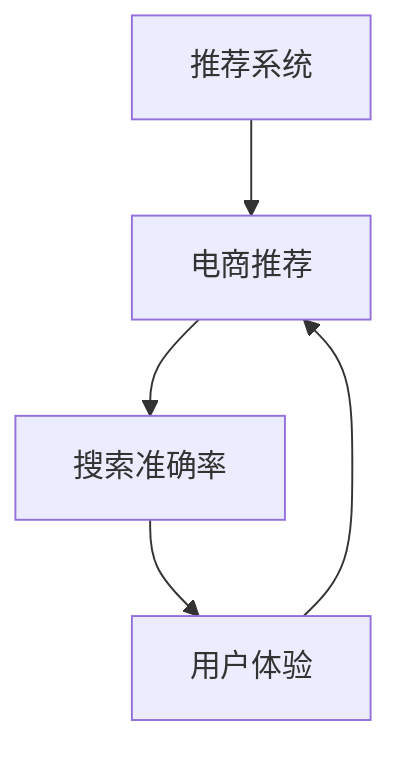

                 

# 大数据与AI 驱动的电商推荐：搜索准确率与用户体验的双重优化

> 关键词：电商推荐,搜索优化,准确率提升,用户体验,数据驱动,深度学习,推荐系统

## 1. 背景介绍

### 1.1 问题由来
随着电子商务的迅速发展，消费者需求日益多元化，电商平台的个性化推荐系统成为了提升用户体验、增加用户粘性和销售额的重要手段。然而，现有的推荐系统普遍存在准确性不高、推荐不精准、用户互动体验不佳等问题，这些问题严重制约了电商平台的竞争力。为了解决这些问题，如何构建一个准确性高、推荐精准且用户体验好的电商推荐系统成为了当前的热点问题。

### 1.2 问题核心关键点
构建一个高效、准确的电商推荐系统需要重点关注以下几个方面：
1. **推荐算法选择**：选择合适的推荐算法，如协同过滤、基于内容的推荐、深度学习等。
2. **数据预处理**：清洗和标准化数据，构建高质量的特征向量。
3. **模型训练与优化**：通过大数据和AI技术，训练高性能推荐模型，并通过超参数调优等方法提升模型效果。
4. **用户反馈与实时调整**：实时收集用户反馈数据，动态调整推荐模型，以适应用户需求的变化。
5. **推荐系统评估**：设计科学的评估指标，如准确率、召回率、覆盖率等，量化推荐效果。
6. **用户体验优化**：考虑用户心理和行为特征，设计直观、易用的推荐界面，提升用户体验。

## 2. 核心概念与联系

### 2.1 核心概念概述

为了更好地理解电商推荐系统的构建，我们需要介绍几个关键概念及其相互关系：

- **推荐系统(Recommendation System)**：利用算法和模型，根据用户的历史行为和偏好，为用户推荐商品的系统。
- **电商推荐(E-commerce Recommendation)**：专注于电商平台的推荐系统，主要任务是为用户推荐符合其兴趣的商品。
- **搜索准确率(Search Accuracy)**：衡量搜索结果与用户意图匹配度的指标，主要通过召回率、准确率等指标评估。
- **用户体验(User Experience, UX)**：用户在使用推荐系统时的整体感受，包括界面美观、交互流畅、推荐结果的满意程度等。

### 2.2 核心概念联系

推荐系统、电商推荐、搜索准确率和用户体验之间存在紧密的联系。具体如下：

1. **推荐系统与电商推荐**：电商推荐是推荐系统在电商平台中的应用，其目标是为用户推荐符合其兴趣的商品。
2. **电商推荐与搜索准确率**：电商推荐系统需要具备较高的搜索准确率，即准确识别用户意图，为用户推荐最相关的商品。
3. **搜索准确率与用户体验**：搜索准确率高的推荐系统能提供更符合用户预期的商品，从而提升用户体验。
4. **用户体验与电商推荐**：优秀的用户体验能促进用户对推荐结果的信任和满意度，进一步提高电商推荐系统的效果。

这些概念之间的联系可以通过以下Mermaid流程图来展示：



这个流程图展示了推荐系统与电商推荐、搜索准确率和用户体验之间的逻辑关系：电商推荐系统通过提高搜索准确率来提升用户体验，用户体验的提升又进一步促进了电商推荐的准确性和效果。

## 3. 核心算法原理 & 具体操作步骤

### 3.1 算法原理概述

电商推荐系统主要分为两类：基于内容的推荐和协同过滤推荐。基于内容的推荐系统通过分析商品属性和用户历史行为，为用户推荐符合其兴趣的商品。协同过滤推荐系统则通过用户间的相似度分析，为用户推荐与其相似用户喜欢的商品。

无论哪种推荐方式，电商推荐系统的核心原理都是通过模型训练和学习用户行为数据，预测用户对商品的可能偏好，并根据预测结果推荐商品。其关键在于如何构建有效的特征表示和优化推荐模型，以提高搜索准确率和用户体验。

### 3.2 算法步骤详解

电商推荐系统的构建流程主要包括以下几个关键步骤：

**Step 1: 数据收集与预处理**
- 收集电商平台的商品信息、用户行为数据、用户画像数据等。
- 对数据进行清洗、去重、标准化等预处理操作，构建高质量的数据集。

**Step 2: 特征工程**
- 选择和构建合适的特征向量，包括商品属性、用户历史行为、时间、位置等。
- 应用特征选择和降维技术，提升特征向量的质量和效率。

**Step 3: 模型训练与优化**
- 选择合适的推荐算法，如协同过滤、基于内容的推荐、深度学习等。
- 训练模型，使用大数据和深度学习技术，优化模型参数。
- 应用超参数调优等方法，提升模型效果。

**Step 4: 推荐与评估**
- 实时收集用户反馈数据，动态调整推荐模型。
- 使用科学的评估指标，如准确率、召回率、覆盖率等，量化推荐效果。
- 优化推荐界面，提升用户体验。

### 3.3 算法优缺点

电商推荐系统的优点包括：
1. **个性化推荐**：通过分析用户历史行为和偏好，为用户推荐符合其兴趣的商品。
2. **高效推荐**：使用算法和模型，快速生成推荐结果。
3. **多渠道推荐**：通过网站、APP、短信等多种渠道，覆盖更广泛的用户群体。

然而，电商推荐系统也存在一些缺点：
1. **数据隐私问题**：收集和分析用户数据可能侵犯用户隐私，引发伦理和法律问题。
2. **模型过拟合**：模型可能过度拟合训练数据，导致泛化性能不足。
3. **推荐准确性**：在处理长尾商品或非热门用户时，推荐准确性可能下降。
4. **用户体验一致性**：推荐结果不一致可能导致用户困惑和不满。

### 3.4 算法应用领域

电商推荐系统在电商、零售、在线娱乐等领域有广泛应用。例如：

- 电商平台的商品推荐：通过分析用户浏览、购买行为，推荐符合其兴趣的商品。
- 零售商的库存管理：通过推荐系统预测用户需求，优化库存配置。
- 在线娱乐平台的个性化推荐：根据用户观看历史和评分，推荐相似内容。

此外，电商推荐系统还被应用于社交媒体、新闻推荐、旅游推荐等多个场景，为不同领域提供个性化服务。

## 4. 数学模型和公式 & 详细讲解 & 举例说明

### 4.1 数学模型构建

电商推荐系统通常使用矩阵分解等方法来构建用户-商品评分矩阵，通过模型学习评分矩阵的潜在因子表示，预测用户对商品的评分。设用户-商品评分矩阵为 $U \in \mathbb{R}^{N\times M}$，其中 $N$ 为用户数，$M$ 为商品数。则评分矩阵可以表示为：

$$
U = A \times V
$$

其中 $A \in \mathbb{R}^{N\times K}$ 为用户特征矩阵，$V \in \mathbb{R}^{K\times M}$ 为商品特征矩阵，$K$ 为特征维度。

推荐系统的目标是预测用户 $u$ 对商品 $i$ 的评分 $r_{ui}$，即：

$$
r_{ui} \approx \mathbf{a}_u^T \mathbf{v}_i
$$

其中 $\mathbf{a}_u$ 和 $\mathbf{v}_i$ 分别为用户 $u$ 和商品 $i$ 的特征表示。

### 4.2 公式推导过程

基于矩阵分解的推荐算法（如SVD）的核心在于求解用户特征矩阵 $A$ 和商品特征矩阵 $V$ 的近似值。具体推导过程如下：

1. 假设用户-商品评分矩阵 $U$ 的潜在因子表示为 $A$ 和 $V$，则有：

$$
U \approx A \times V
$$

2. 矩阵 $U$ 的奇异值分解为：

$$
U = U'SV^T
$$

其中 $U'$ 和 $V'$ 分别为 $U$ 和 $V$ 的低秩矩阵，$S$ 为奇异值矩阵。

3. 对 $U'$ 和 $V'$ 进行特征值分解：

$$
U' = \hat{U}D\hat{U}^T, V' = \hat{V}D\hat{V}^T
$$

其中 $\hat{U}$ 和 $\hat{V}$ 为特征矩阵，$D$ 为对角矩阵。

4. 将 $\hat{U}$ 和 $\hat{V}$ 应用于用户和商品特征表示：

$$
\mathbf{a}_u = \hat{U}_u, \mathbf{v}_i = \hat{V}_i
$$

5. 最终推荐公式为：

$$
\hat{r}_{ui} = \mathbf{a}_u^T \mathbf{v}_i
$$

通过上述推导，我们可以看到，基于矩阵分解的推荐算法通过学习用户和商品的潜在因子表示，实现了对用户-商品评分矩阵的低秩近似，从而提升了推荐系统的准确性和效率。

### 4.3 案例分析与讲解

以亚马逊为例，分析其电商推荐系统的工作流程和效果。

亚马逊的推荐系统主要由以下几个组件构成：

- **个性化推荐引擎**：根据用户历史行为和偏好，生成个性化推荐结果。
- **协同过滤推荐引擎**：分析用户之间的相似度，推荐相似用户喜欢的商品。
- **基于内容的推荐引擎**：根据商品属性和用户兴趣，推荐符合其需求的商品。
- **实时学习系统**：实时收集用户反馈数据，动态调整推荐模型。

亚马逊通过大数据和深度学习技术，训练了多个推荐模型，并根据用户行为数据实时调整模型参数。此外，亚马逊还通过A/B测试等方法，不断优化推荐界面和用户体验，提升推荐效果。

根据亚马逊的研究，其推荐系统可以为用户推荐近40%的购买商品，显著提升了用户满意度和销售额。

## 5. 项目实践：代码实例和详细解释说明

### 5.1 开发环境搭建

在进行电商推荐系统开发前，我们需要准备好开发环境。以下是使用Python进行PyTorch开发的环境配置流程：

1. 安装Anaconda：从官网下载并安装Anaconda，用于创建独立的Python环境。

2. 创建并激活虚拟环境：
```bash
conda create -n pytorch-env python=3.8 
conda activate pytorch-env
```

3. 安装PyTorch：根据CUDA版本，从官网获取对应的安装命令。例如：
```bash
conda install pytorch torchvision torchaudio cudatoolkit=11.1 -c pytorch -c conda-forge
```

4. 安装TensorBoard：
```bash
pip install tensorboard
```

5. 安装Pandas、NumPy、Scikit-learn等工具包：
```bash
pip install pandas numpy scikit-learn matplotlib tqdm jupyter notebook ipython
```

完成上述步骤后，即可在`pytorch-env`环境中开始电商推荐系统的开发。

### 5.2 源代码详细实现

这里我们以协同过滤推荐系统为例，给出使用PyTorch进行电商推荐系统开发的完整代码实现。

首先，定义评分矩阵和用户-商品特征矩阵：

```python
import numpy as np
import pandas as pd
from sklearn.decomposition import TruncatedSVD

# 定义评分矩阵
U = np.array([
    [0, 0, 1, 0, 1],
    [0, 0, 1, 1, 0],
    [0, 1, 0, 0, 1],
    [1, 0, 0, 0, 1],
    [0, 1, 1, 0, 0]
])

# 定义用户-商品特征矩阵
A = np.array([
    [1, 0, 0, 1, 0],
    [0, 1, 1, 0, 0],
    [1, 0, 1, 1, 0],
    [0, 0, 0, 1, 1],
    [0, 1, 0, 0, 1]
])
```

接着，使用TruncatedSVD对评分矩阵进行矩阵分解：

```python
# 训练SVD模型
svd = TruncatedSVD(n_components=2, random_state=0)
U_hat, V_hat = svd.fit_transform(U), svd.components_

# 获取用户和商品特征表示
a = A @ V_hat.T
v = V_hat @ A.T
```

然后，定义推荐函数：

```python
def recommend(user_index, k=3):
    # 计算用户 $u$ 对商品 $i$ 的评分预测值
    scores = a[user_index] @ v
    
    # 选择前k个评分最高的商品
    indices = np.argsort(scores)[-k:]
    items = indices.tolist()
    
    return items
```

最后，测试推荐效果：

```python
# 推荐商品
recommended_items = recommend(2)
print("Recommended items for user 2:", recommended_items)

# 输出推荐结果
print("User 2's original ratings:", U[2, :])
print("User 2's predicted ratings:", scores[2])
```

以上代码实现了基本的协同过滤推荐系统，通过训练SVD模型，预测用户对商品的评分，并根据评分结果推荐商品。

### 5.3 代码解读与分析

让我们再详细解读一下关键代码的实现细节：

**评分矩阵定义**：
- 定义了用户-商品评分矩阵 $U$，共5个用户和5个商品，每个用户对商品有0或1的评分。

**用户-商品特征矩阵定义**：
- 定义了用户-商品特征矩阵 $A$，共5个用户和5个商品，每个用户和商品特征向量由0和1组成。

**矩阵分解**：
- 使用TruncatedSVD对评分矩阵 $U$ 进行矩阵分解，得到用户特征矩阵 $\hat{U}$ 和商品特征矩阵 $\hat{V}$。
- 将特征矩阵应用于用户和商品特征表示，得到用户和商品的潜在因子表示。

**推荐函数**：
- 定义推荐函数，计算用户对商品的评分预测值，并选择前k个评分最高的商品。
- 使用代码中的评分预测值和原始评分对比，验证推荐效果。

代码实现中，我们使用了Python的NumPy和Scikit-learn库，以简化矩阵分解和特征表示的计算过程。同时，通过简单的评分预测和推荐测试，展示了协同过滤推荐系统的工作原理和效果。

## 6. 实际应用场景

### 6.1 智能购物助手

智能购物助手是一种基于推荐系统的应用，通过分析用户的历史购买记录和浏览行为，为其推荐符合其兴趣的商品。智能购物助手通常集成在电商平台的用户界面或移动应用中，通过实时推荐提高用户体验和销售额。

以淘宝为例，淘宝通过分析用户的历史购物行为，为其推荐符合其兴趣的商品。淘宝的推荐系统包括商品推荐、用户画像推荐、内容推荐等多种类型，覆盖了商品展示、浏览记录、搜索记录等多个场景。淘宝的推荐系统通过实时学习用户行为，动态调整推荐模型，确保推荐的准确性和个性化。

### 6.2 多渠道推荐

多渠道推荐系统是指在多个平台上（如网站、APP、短信等）对用户进行统一推荐。多渠道推荐系统通过统一的推荐引擎，实现跨平台数据共享和用户画像整合，提供一致的推荐体验。

以京东为例，京东的推荐系统覆盖了网站、APP、微信等多个渠道，通过统一的推荐引擎，提供个性化的商品推荐。京东的推荐系统使用协同过滤、基于内容的推荐和深度学习等多种技术，通过实时学习用户行为，动态调整推荐模型，确保推荐的准确性和个性化。

### 6.3 实时推荐引擎

实时推荐引擎是指在用户浏览或购买商品时，即时为其推荐商品的系统。实时推荐引擎通过分析用户当前行为，动态调整推荐模型，提供精准的推荐结果。

以Amazon为例，Amazon的推荐系统通过实时学习用户行为，动态调整推荐模型，确保推荐的准确性和个性化。Amazon的推荐系统覆盖了网站、移动应用等多个渠道，通过统一的推荐引擎，提供个性化的商品推荐。

### 6.4 未来应用展望

随着电商推荐系统和大数据技术的不断发展，未来推荐系统将呈现以下几个趋势：

1. **多模态推荐**：将用户的多模态数据（如行为、社交、位置等）融合到推荐模型中，提供更加全面、个性化的推荐。
2. **实时推荐**：通过实时分析用户当前行为，动态调整推荐模型，提供精准的实时推荐。
3. **个性化推荐**：通过深度学习和用户画像技术，实现更精准的个性化推荐。
4. **可解释性推荐**：通过推荐系统可解释性技术，让用户了解推荐结果的来源和依据，提升信任度和满意度。
5. **跨域推荐**：将推荐系统应用于多个垂直领域，实现跨领域的推荐和数据共享。

这些趋势将使得电商推荐系统更加智能化和高效，为用户提供更好的购物体验，同时提升电商平台的竞争力。

## 7. 工具和资源推荐

### 7.1 学习资源推荐

为了帮助开发者系统掌握电商推荐系统的理论基础和实践技巧，这里推荐一些优质的学习资源：

1. 《推荐系统实战》书籍：这本书系统介绍了推荐系统的原理和实践，涵盖了协同过滤、基于内容的推荐、深度学习等多种推荐技术。

2. 《深度学习》课程：斯坦福大学的《深度学习》课程，涵盖了深度学习的基本概念和推荐系统的经典模型。

3. 《推荐系统算法》书籍：这本书详细介绍了推荐系统的主要算法，包括协同过滤、基于内容的推荐、矩阵分解等。

4. Kaggle竞赛：Kaggle上有多项推荐系统竞赛，可以通过竞赛学习和提升推荐系统技能。

5. arXiv论文：arXiv上有很多关于推荐系统的最新研究论文，可以跟踪前沿进展。

通过对这些资源的学习实践，相信你一定能够快速掌握电商推荐系统的精髓，并用于解决实际的推荐问题。

### 7.2 开发工具推荐

高效的开发离不开优秀的工具支持。以下是几款用于电商推荐系统开发的常用工具：

1. PyTorch：基于Python的开源深度学习框架，灵活动态的计算图，适合快速迭代研究。大部分推荐系统模型都有PyTorch版本的实现。

2. TensorFlow：由Google主导开发的开源深度学习框架，生产部署方便，适合大规模工程应用。同样有丰富的推荐系统资源。

3. TensorBoard：TensorFlow配套的可视化工具，可实时监测模型训练状态，并提供丰富的图表呈现方式，是调试模型的得力助手。

4. Weights & Biases：模型训练的实验跟踪工具，可以记录和可视化模型训练过程中的各项指标，方便对比和调优。与主流深度学习框架无缝集成。

5. Apache Spark：基于Scala的分布式计算框架，支持大规模数据处理和机器学习任务。Spark MLlib提供了多种推荐系统算法，适合大规模推荐系统开发。

合理利用这些工具，可以显著提升电商推荐系统的开发效率，加快创新迭代的步伐。

### 7.3 相关论文推荐

电商推荐系统和大数据推荐技术的研究源于学界的持续研究。以下是几篇奠基性的相关论文，推荐阅读：

1. "Collaborative Filtering for Implicit Feedback Datasets"：提出协同过滤算法，通过用户行为数据预测用户评分。

2. "The BellKor algorithm for implicit feedback datasets"：提出贝尔柯算法，使用矩阵分解技术进行协同过滤推荐。

3. "Efficient Matrix Factorization for Mining Massive Datasets"：提出基于矩阵分解的推荐算法，通过SVD等技术对评分矩阵进行分解。

4. "A Survey on Deep Learning for Recommendation Systems"：总结深度学习在推荐系统中的应用，涵盖神经网络、自编码器、生成模型等多种深度学习模型。

5. "Personalized Recommendation with Deep Adaptive Neural Networks"：提出深度自适应神经网络，通过用户画像和推荐系统结合，提升推荐效果。

这些论文代表了大数据推荐技术的发展脉络。通过学习这些前沿成果，可以帮助研究者把握学科前进方向，激发更多的创新灵感。

## 8. 总结：未来发展趋势与挑战

### 8.1 研究成果总结

本文对电商推荐系统的构建和优化进行了全面系统的介绍。首先阐述了电商推荐系统在提升用户购物体验和平台销售额中的重要作用，明确了推荐算法、数据预处理、模型训练与优化、用户反馈与实时调整、推荐系统评估、用户体验优化等关键环节。

通过详细讲解电商推荐系统的原理和操作步骤，给出了推荐系统开发的完整代码实例，展示了协同过滤推荐系统的工作原理和效果。同时，本文还广泛探讨了电商推荐系统在多个行业领域的应用前景，展示了推荐系统的大规模落地潜力。

### 8.2 未来发展趋势

展望未来，电商推荐系统将呈现以下几个发展趋势：

1. **多模态推荐**：将用户的多模态数据融合到推荐模型中，提供更加全面、个性化的推荐。
2. **实时推荐**：通过实时分析用户当前行为，动态调整推荐模型，提供精准的实时推荐。
3. **个性化推荐**：通过深度学习和用户画像技术，实现更精准的个性化推荐。
4. **可解释性推荐**：通过推荐系统可解释性技术，让用户了解推荐结果的来源和依据，提升信任度和满意度。
5. **跨域推荐**：将推荐系统应用于多个垂直领域，实现跨领域的推荐和数据共享。

这些趋势将使得电商推荐系统更加智能化和高效，为用户提供更好的购物体验，同时提升电商平台的竞争力。

### 8.3 面临的挑战

尽管电商推荐系统已经取得了显著的成效，但在迈向更加智能化、高效化应用的过程中，它仍面临诸多挑战：

1. **数据隐私问题**：收集和分析用户数据可能侵犯用户隐私，引发伦理和法律问题。
2. **模型过拟合**：模型可能过度拟合训练数据，导致泛化性能不足。
3. **推荐准确性**：在处理长尾商品或非热门用户时，推荐准确性可能下降。
4. **用户体验一致性**：推荐结果不一致可能导致用户困惑和不满。
5. **实时推荐系统性能**：实时推荐系统需要高效的计算和存储，以应对大规模用户请求。

这些挑战需要我们在算法、数据、工程、伦理等多个方面进行全面优化，才能真正实现电商推荐系统的全面落地。

### 8.4 研究展望

面对电商推荐系统所面临的种种挑战，未来的研究需要在以下几个方面寻求新的突破：

1. **隐私保护技术**：开发隐私保护算法和技术，确保用户数据的安全性和隐私性。
2. **模型泛化能力**：开发具有更强泛化能力的推荐模型，应对长尾商品和冷启动问题。
3. **实时推荐系统优化**：优化实时推荐系统的计算和存储效率，提升推荐效果。
4. **可解释性技术**：开发推荐系统的可解释性技术，提升用户信任度和满意度。
5. **跨域推荐系统**：开发跨域推荐系统，实现数据共享和协同推荐。

这些研究方向将引领电商推荐系统迈向更高的台阶，为构建安全、可靠、可解释、可控的智能推荐系统提供新的思路和方向。

## 9. 附录：常见问题与解答

**Q1: 电商推荐系统如何处理长尾商品和冷启动问题？**

A: 电商推荐系统通常使用协同过滤算法处理长尾商品和冷启动问题。协同过滤算法通过分析用户间的相似度，推荐相似用户喜欢的商品。对于长尾商品，协同过滤算法可以通过引入负样本和正则化方法，提升模型对长尾商品的识别能力。对于冷启动用户，协同过滤算法可以通过引入用户画像和行为预测方法，提升模型对新用户的推荐效果。

**Q2: 电商推荐系统如何处理用户隐私问题？**

A: 电商推荐系统在数据收集和分析过程中，需要注意用户隐私保护问题。可以采用以下几种方法：
1. 数据匿名化：对用户数据进行匿名化处理，去除敏感信息。
2. 用户同意机制：在数据收集前，获取用户同意，明确告知数据使用范围。
3. 差分隐私：在数据收集和分析过程中，应用差分隐私技术，保护用户隐私。

**Q3: 电商推荐系统如何优化实时推荐性能？**

A: 电商推荐系统需要高效的计算和存储，以应对大规模用户请求。可以采用以下几种方法：
1. 分布式计算：使用分布式计算框架，如Hadoop、Spark等，提升计算效率。
2. 数据压缩：对数据进行压缩和存储优化，减少存储空间和传输时间。
3. 模型加速：使用模型加速技术，如TensorRT、ONNX等，提升模型推理速度。

**Q4: 电商推荐系统如何提高推荐准确性？**

A: 电商推荐系统需要采用多种技术手段，提升推荐准确性：
1. 特征工程：选择和构建高质量的特征向量，提升模型的表示能力。
2. 模型优化：使用优化算法，提升模型的收敛速度和泛化能力。
3. 数据增强：通过数据增强技术，丰富训练集，提升模型的鲁棒性。

通过这些方法，电商推荐系统可以在保持高效性的同时，提升推荐准确性。

**Q5: 电商推荐系统如何提高用户体验？**

A: 电商推荐系统需要从多个方面提升用户体验：
1. 推荐界面设计：设计直观、易用的推荐界面，提升用户交互体验。
2. 实时反馈机制：通过实时反馈机制，动态调整推荐模型，提供个性化的推荐结果。
3. 推荐结果展示：优化推荐结果展示方式，提升用户满意度。

通过这些方法，电商推荐系统可以提升用户对推荐结果的信任和满意度，增强用户粘性和忠诚度。

---

作者：禅与计算机程序设计艺术 / Zen and the Art of Computer Programming

