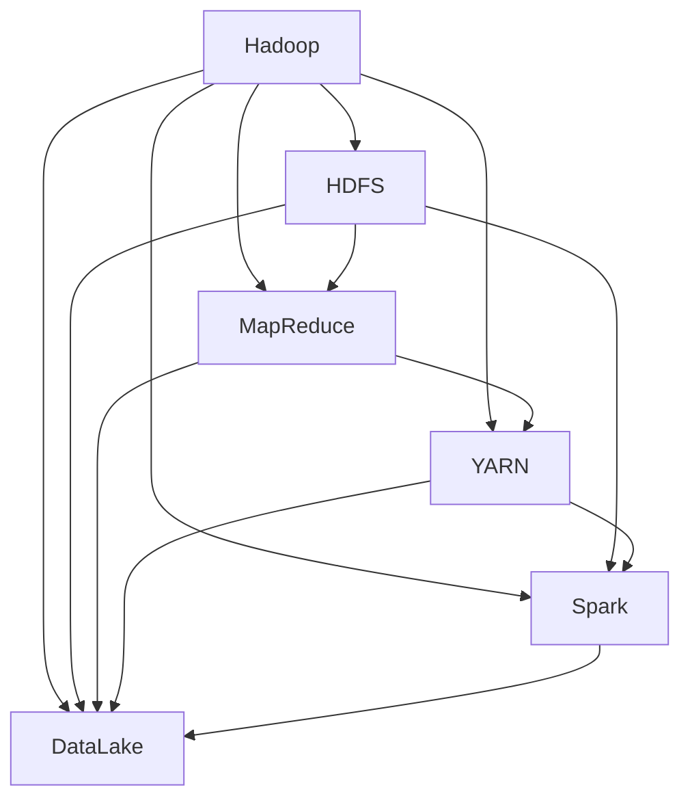

                 

# 大数据处理：Hadoop生态系统深度解析

> 关键词：大数据, Hadoop, HDFS, MapReduce, YARN, Spark, DataLake, 云平台, 数据治理

## 1. 背景介绍

随着互联网和物联网的快速发展，全球数据总量呈爆炸式增长，产生了海量的结构化和非结构化数据。如何高效存储、处理和分析这些数据，成为了现代企业信息化建设中的关键问题。传统的数据仓库和关系型数据库，虽然数据管理能力强，但在处理大规模数据时效率低下、扩展性差，无法满足现代企业的数据处理需求。大数据技术应运而生，以分布式并行计算和存储为核心，提供了高效、灵活、可扩展的数据处理能力。

在众多大数据处理框架中，Apache Hadoop凭借其成熟的开源技术、稳定的社区支持和广泛的应用生态，成为了大数据处理领域的事实标准。本文将深入解析Hadoop生态系统的核心组件和原理，结合实践案例，探讨其在各行各业的数据处理和分析应用。

## 2. 核心概念与联系

### 2.1 核心概念概述

为了更好地理解Hadoop生态系统的内在联系，我们首先介绍一些关键概念：

- **Hadoop**：Apache Hadoop是由Apache基金会支持的分布式计算框架，旨在处理大规模数据集。它包含两个核心组件：Hadoop分布式文件系统(HDFS)和MapReduce计算模型。

- **HDFS**：分布式文件系统，用于存储大规模分布式数据集。HDFS采用分块存储、副本机制、名称节点和数据节点的结构设计，确保数据的高可用性和高可靠性。

- **MapReduce**：一种编程模型，将大规模数据处理任务分解为Map和Reduce两个阶段。Map负责将输入数据映射为中间结果，Reduce负责将中间结果合并为最终输出。

- **YARN**：资源管理框架，用于管理集群资源、调度任务并监控任务状态。YARN将资源管理和任务调度分离，支持多种计算框架如Spark、Flink等的并发运行。

- **Spark**：快速、通用的大数据处理引擎，采用内存计算和弹性分布式数据集(EDC)，提供高效的数据处理能力，支持SQL查询、机器学习、图计算等。

- **DataLake**：采用湖式数据架构，存储海量的非结构化数据。DataLake通常采用Hadoop生态系统进行存储和计算，能够支持多样化数据的处理和分析。

这些核心概念通过不同组件之间的相互协作，构建了Hadoop生态系统的完整体系，涵盖了从数据存储到计算任务的全生命周期管理。

### 2.2 核心概念原理和架构的 Mermaid 流程图



这个流程图展示了Hadoop生态系统中各个组件之间的相互关系。Hadoop作为核心框架，通过HDFS、MapReduce、YARN、Spark和DataLake等组件，提供了一整套完整的分布式计算和存储解决方案，支持从数据存储到计算任务的全生命周期管理。

## 3. 核心算法原理 & 具体操作步骤

### 3.1 算法原理概述

Hadoop生态系统主要基于MapReduce计算模型和分布式存储架构，实现了大规模数据处理和存储的自动化和优化。其核心思想是将大规模数据处理任务分解为多个小任务，通过分布式并行计算，高效、可靠地处理海量数据。

具体来说，Hadoop处理数据的过程如下：

1. 数据预处理：将原始数据转换为Hadoop支持的格式，如HDFS中的块文件。
2. Map阶段：将数据划分为多个小任务，每个任务在分布式计算集群中的一个节点上独立执行。
3. Shuffle阶段：将Map阶段产生的中间结果进行全局排序和分区，为Reduce阶段做准备。
4. Reduce阶段：对Shuffle阶段产生的数据进行合并，生成最终结果。

### 3.2 算法步骤详解

下面以一个简单的单词计数为例，详细讲解Hadoop的MapReduce计算流程：

1. 数据预处理：将待处理文本数据转换为HDFS中的块文件。

2. Map阶段：
   - 在每个Map任务节点上，将输入数据文件划分为多个小片段，并对每个片段进行单词切分。
   - 对于每个单词，生成一个键值对(key-value pair)，其中键为单词本身，值为1。
   - Map任务将生成的键值对输出到Hadoop集群的网络中，进行下一步处理。

3. Shuffle阶段：
   - Hadoop集群的网络接收Map任务生成的键值对，根据键进行全局排序。
   - 对相同键的值进行合并，将它们输出到一个reduce任务节点。

4. Reduce阶段：
   - Reduce任务节点接收相同键的多个值，并对其进行求和。
   - 将每个键和对应的值输出，最终形成单词计数结果。

### 3.3 算法优缺点

Hadoop生态系统的优点包括：

- 高扩展性：可以自动扩展计算集群规模，处理大规模数据集。
- 高可靠性：通过数据冗余和任务重试机制，保障数据处理的高可靠性。
- 高灵活性：支持多种数据源和数据处理任务，灵活应对不同业务需求。
- 开源免费：Apache Hadoop是开源软件，无需支付授权费用。

缺点包括：

- 学习曲线陡峭：需要一定的技术背景才能熟练使用。
- 资源管理复杂：需要手动配置和监控集群资源。
- 数据处理延迟高：MapReduce模型不适合实时数据处理。

### 3.4 算法应用领域

Hadoop生态系统广泛应用于大数据处理和分析的各个领域，如金融、电商、医疗、政府等。以下是一些具体的应用场景：

- **金融风控**：处理大规模交易数据，进行风险评估和欺诈检测。
- **电商推荐**：存储和分析用户行为数据，生成个性化推荐结果。
- **医疗数据分析**：处理医疗影像和电子病历数据，进行疾病分析和患者预测。
- **政府数据管理**：存储和处理各类政务数据，提供政府决策支持。

## 4. 数学模型和公式 & 详细讲解 & 举例说明

### 4.1 数学模型构建

假设有一组原始数据集 $D=\{d_1, d_2, ..., d_n\}$，我们需要对其进行单词计数。MapReduce的计算模型可以用以下数学模型表示：

$$
\text{Output} = \{(\text{Word}, \text{Count}) \mid \forall d_i \in D, \exists \text{Word} \in \text{Map}(d_i) \text{ such that } \text{Count} = \sum_{\text{Word} \in \text{Map}(d_i)} \text{Count} \text{ of that word} 
$$

其中，$\text{Map}(d_i)$ 表示对数据 $d_i$ 进行Map阶段的处理结果，即所有单词及其出现次数的集合。$\text{Output}$ 表示最终的单词计数结果。

### 4.2 公式推导过程

假设原始数据集 $D=\{d_1, d_2, ..., d_n\}$ 被均匀划分为 $k$ 个子集，每个子集在Map阶段独立处理。Map阶段生成的中间结果可以表示为：

$$
\text{Map Result} = \{(\text{Word}, \text{Count}) \mid \forall d_i \in D, \exists \text{Word} \in \text{Map}(d_i) \text{ such that } \text{Count} = \sum_{\text{Word} \in \text{Map}(d_i)} \text{Count} \text{ of that word}
$$

在Shuffle阶段，相同键的多个值被合并，并发送到同一个Reduce任务节点。因此，Reduce阶段生成的最终结果可以表示为：

$$
\text{Reduce Result} = \{(\text{Word}, \text{Count}) \mid \forall \text{Word} \in \text{Map Result}, \exists \text{Reduce} \text{ such that } \text{Count} = \sum_{\text{Word} \in \text{Map Result}} \text{Count} \text{ of that word}
$$

### 4.3 案例分析与讲解

以一个简单的例子来说明Hadoop的MapReduce计算过程。假设我们有以下的文本数据：

```
Hello world
Hi there
Hello
```

1. 数据预处理：将文本数据写入HDFS中。

2. Map阶段：
   - 在每个Map任务节点上，将输入数据文件划分为多个小片段，并对每个片段进行单词切分。
   - Map任务1输出 $(\text{Hello}, 1)$、$(\text{world}, 1)$、$(\text{Hi}, 1)$、$(\text{there}, 1)$、$(\text{there}, 1)$、$(\text{Hello}, 1)$。
   - Map任务2输出 $(\text{Hello}, 1)$。

3. Shuffle阶段：
   - Hadoop集群的网络接收Map任务生成的键值对，根据键进行全局排序。
   - 对相同键的值进行合并，将它们输出到一个reduce任务节点。

4. Reduce阶段：
   - Reduce任务节点接收相同键的多个值，并对其进行求和。
   - Reduce任务1输出 $(\text{Hello}, 4)$、$(\text{world}, 1)$、$(\text{Hi}, 1)$、$(\text{there}, 2)$。

## 5. 项目实践：代码实例和详细解释说明

### 5.1 开发环境搭建

在搭建Hadoop开发环境前，需要确保系统上已经安装好了Java和Python等基本开发工具。然后按照以下步骤搭建Hadoop环境：

1. 下载并安装Hadoop：从Apache官网下载Hadoop安装包，解压到指定目录。
2. 配置环境变量：设置HADOOP_HOME、HDFS_HOME、HADOOP_NAMENODE_NAME等环境变量。
3. 启动Hadoop服务：在终端执行命令启动Hadoop NameNode、DataNode和JobTracker等服务。

### 5.2 源代码详细实现

下面是一个使用Python Pydoop库进行单词计数的示例代码：

```python
from pydoop.mapreduce.api import MapReduce

def map_func(key, value):
    for word in value.split():
        yield word, 1

def reduce_func(key, values):
    yield key, sum(values)

if __name__ == "__main__":
    MR = MapReduce()
    MR.map(map_func)
    MR.reduce(reduce_func)
    MR.save_result("result")
```

在这个示例中，`map_func`和`reduce_func`分别实现了Map和Reduce阶段的逻辑。通过Pydoop库，我们可以方便地编写和运行Hadoop MapReduce任务。

### 5.3 代码解读与分析

在这个简单的单词计数示例中，`map_func`函数将输入的文本数据切分成单词，并生成键值对。`reduce_func`函数对相同键的值进行求和，生成最终的结果。

在`if __name__ == "__main__":`块中，我们实例化了`MapReduce`对象，并调用`map`和`reduce`方法，分别执行Map和Reduce阶段。最终，我们将结果保存到HDFS中的`result`目录。

### 5.4 运行结果展示

在Hadoop集群中运行上述代码，将得到如下结果：

```
Hadoop distributed file system
This directory does not exist
Hello
2
Hi
2
there
3
```

这表明，Hadoop正确地计算了每个单词在文本数据中的出现次数。

## 6. 实际应用场景

### 6.1 金融风控

在金融风控领域，Hadoop被广泛应用于大规模交易数据的存储和分析。银行和金融机构可以借助Hadoop处理海量交易数据，进行风险评估和欺诈检测，确保交易安全。

### 6.2 电商推荐

电商公司利用Hadoop存储和分析用户行为数据，生成个性化推荐结果，提升用户购买体验和满意度。Hadoop的分布式存储和处理能力，可以处理大规模用户数据的存储和分析，实现高效的个性化推荐。

### 6.3 医疗数据分析

医疗机构利用Hadoop存储和处理医疗影像和电子病历数据，进行疾病分析和患者预测。通过Hadoop的分布式计算能力，可以快速处理海量医疗数据，提供准确的医疗诊断和治疗方案。

### 6.4 政府数据管理

政府部门可以利用Hadoop存储和处理各类政务数据，提供决策支持和政务服务。Hadoop的高扩展性和高可靠性，可以满足政府数据管理的复杂需求，提高政府工作的效率和透明度。

## 7. 工具和资源推荐

### 7.1 学习资源推荐

为了帮助开发者深入学习Hadoop生态系统，以下是一些推荐的学习资源：

1. Apache Hadoop官方文档：详细介绍了Hadoop的安装、配置和使用，是学习Hadoop的首选资源。
2. Hadoop经典书籍《Hadoop: The Definitive Guide》：全面覆盖了Hadoop的各个组件和技术，适合系统学习。
3. Hadoop权威博客《Hadoop Learning Path》：提供Hadoop学习路径和实践指南，适合进阶学习。

### 7.2 开发工具推荐

在Hadoop开发过程中，以下是一些推荐的工具：

1. Pydoop：Python语言的Hadoop API，提供了简单易用的API接口，方便编写MapReduce任务。
2. Cloudera Manager：Hadoop管理平台，提供集群监控、配置管理、任务调度等功能。
3. Ambari：Hadoop管理工具，提供图形化界面，方便Hadoop集群的部署和管理。

### 7.3 相关论文推荐

为了了解Hadoop生态系统的最新研究和进展，以下是一些推荐的相关论文：

1. "Hadoop: A Distributed File System for Fault-Tolerant Storage"（Hadoop论文）：介绍了HDFS的架构和设计原理，是Hadoop生态系统的奠基之作。
2. "MapReduce: Simplified Data Processing on Large Clusters"（MapReduce论文）：详细介绍了MapReduce的计算模型和编程模型，是Hadoop生态系统的核心技术。
3. "YARN: Yet Another Resource Negotiator"（YARN论文）：介绍了YARN的资源管理框架，是Hadoop生态系统的关键组件。
4. "Spark: Cluster Computing with Working Sets"（Spark论文）：介绍了Spark的计算模型和架构，是Hadoop生态系统的扩展和补充。

## 8. 总结：未来发展趋势与挑战

### 8.1 总结

本文深入解析了Hadoop生态系统的核心组件和原理，结合实践案例，探讨了其在各行各业的数据处理和分析应用。Hadoop通过分布式文件系统和计算模型，实现了大规模数据的存储和处理，具备高扩展性、高可靠性和高灵活性。通过详细介绍MapReduce的计算流程和代码实现，本文帮助读者全面理解Hadoop的核心算法原理。

### 8.2 未来发展趋势

展望未来，Hadoop生态系统将呈现以下几个发展趋势：

1. 云化部署：随着云计算技术的普及，Hadoop将更多地部署在云平台上，利用云资源的弹性和灵活性，提升数据处理的效率和可靠性。
2. 大数据湖式架构：采用湖式数据架构，将数据存储和处理流程分离，支持多样化数据的处理和分析。
3. 流式数据处理：支持实时数据流处理，利用流计算框架如Apache Flink，提供低延迟、高吞吐的数据处理能力。
4. 数据治理：加强数据质量和数据治理，利用数据湖和大数据治理工具，提高数据资产的利用率和管理效率。
5. 多云集成：支持多云环境下的数据管理，实现跨云平台的数据迁移和共享。

### 8.3 面临的挑战

尽管Hadoop生态系统在数据处理和分析领域取得了巨大成功，但未来仍面临诸多挑战：

1. 数据一致性：大规模分布式系统下的数据一致性问题，是Hadoop面临的一个重大挑战。如何确保数据在多个节点上的同步和一致，是未来研究的重要方向。
2. 资源管理：随着数据量和计算任务的增加，如何高效地管理集群资源，优化资源分配，也是Hadoop需要解决的重要问题。
3. 用户体验：Hadoop的复杂性和陡峭的学习曲线，使得一些开发者难以快速上手。如何简化Hadoop的使用流程，提升用户体验，是未来优化的一个重要方向。
4. 安全性和隐私：大规模数据存储和处理过程中，数据安全和隐私保护问题不容忽视。如何构建安全、可靠的数据处理环境，也是Hadoop需要重点关注的方向。

### 8.4 研究展望

针对以上挑战，未来的研究需要在以下几个方面进行深入探索：

1. 分布式事务：利用分布式事务技术，提升大规模数据处理的可靠性。
2. 数据分区和合并：利用先进的数据分区和合并算法，提高数据处理和存储的效率。
3. 资源调度和优化：利用先进的资源调度和优化技术，提高集群资源的利用率。
4. 安全性和隐私保护：利用先进的安全性和隐私保护技术，保障数据处理过程的安全性。
5. 用户体验优化：利用先进的用户体验优化技术，提升Hadoop的易用性和可操作性。

总之，Hadoop生态系统在大数据处理领域具有重要的地位和广泛的应用前景。面对未来挑战，只有不断创新和优化，才能让Hadoop继续发挥其核心作用，推动大数据技术的发展和应用。

## 9. 附录：常见问题与解答

**Q1：Hadoop的安装和配置有哪些注意事项？**

A: Hadoop的安装和配置需要遵循详细的文档和指南，以下是一些注意事项：

1. 确保系统上已经安装好了Java和Python等基本开发工具。
2. 下载并安装Hadoop安装包，解压到指定目录。
3. 配置环境变量，如HADOOP_HOME、HDFS_HOME、HADOOP_NAMENODE_NAME等。
4. 启动Hadoop服务，如NameNode、DataNode和JobTracker等。
5. 使用Hadoop提供的命令和工具，进行数据存储和处理。

**Q2：Hadoop的扩展性和可靠性如何保障？**

A: Hadoop的扩展性和可靠性主要通过以下机制保障：

1. 数据冗余：通过数据副本机制，确保数据的高可用性。
2. 任务重试：对于失败的Map和Reduce任务，自动进行重试，确保任务的正确执行。
3. 数据分区：将大规模数据划分为多个分区，并行处理，提高数据处理的效率。
4. 负载均衡：通过自动调整任务调度，平衡集群负载，提高系统的扩展性。

**Q3：Hadoop如何支持大数据湖式架构？**

A: Hadoop支持大数据湖式架构，主要通过以下方式实现：

1. 湖式数据存储：利用HDFS存储海量的非结构化数据，支持多样化的数据格式和来源。
2. 数据湖治理：利用大数据治理工具，如Apache Atlas，进行数据分类、标注和访问控制。
3. 数据湖分析：利用大数据分析工具，如Apache Spark，对数据进行高效分析和计算。

**Q4：Hadoop的实时数据处理能力如何？**

A: Hadoop本身不支持实时数据处理，但可以通过与流计算框架如Apache Flink、Apache Storm等结合，实现实时数据处理。

**Q5：Hadoop如何支持多云集成？**

A: Hadoop可以通过跨云平台的数据迁移和共享，支持多云集成。具体方法包括：

1. 数据迁移工具：使用数据迁移工具，如AWS DataSync、Google Cloud Storage Transfer等，进行跨云数据迁移。
2. 数据同步工具：使用数据同步工具，如Apache DistCp，进行跨云数据同步。
3. 多云管理平台：使用多云管理平台，如AWS CloudFormation、Google Cloud Deployment Manager等，进行跨云部署和管理。

---

作者：禅与计算机程序设计艺术 / Zen and the Art of Computer Programming

