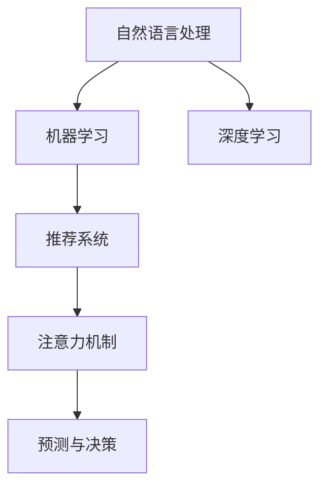

                 

## 1. 背景介绍

### 1.1 问题由来

随着互联网的普及和数据技术的进步，我们正处在一个大数据时代。在这个时代，注意力成为一种极其宝贵的资源。广告、新闻、社交媒体等平台都在争相争夺用户的注意力，试图通过精准的推荐和互动，吸引并留住用户。

### 1.2 问题核心关键点

大数据时代下，注意力争夺战的核心关键点在于：如何精准定位用户的兴趣和需求，并通过高效的技术手段，实现个性化的推荐和服务。这一问题涉及到多个领域，包括自然语言处理、机器学习、计算机视觉、数据挖掘等。其中，自然语言处理技术在大数据时代中，特别是文本数据的处理和分析中扮演了至关重要的角色。

## 2. 核心概念与联系

### 2.1 核心概念概述

为更好地理解注意力争夺战，本节将介绍几个密切相关的核心概念：

- 自然语言处理(NLP)：涉及计算机对人类语言的处理、分析和生成，旨在使计算机能够理解、解释和生成自然语言文本。
- 机器学习(ML)：通过数据驱动的方法，让计算机从数据中学习并做出预测或决策，广泛应用于推荐系统、搜索引擎等。
- 深度学习(Deep Learning)：基于神经网络的机器学习技术，在图像识别、语音处理、自然语言处理等领域取得了突破性进展。
- 注意力机制(Attention Mechanism)：一种特殊的机制，允许模型集中注意力于输入中最重要的部分，以提高模型的表示能力和性能。
- 推荐系统(Recommendation Systems)：通过分析用户的行为和偏好，为用户推荐个性化的内容或产品，广泛应用于电商、社交媒体、视频平台等。

这些核心概念之间的逻辑关系可以通过以下Mermaid流程图来展示：



这个流程图展示了大数据时代下注意力争夺战的主要技术路径：

1. 自然语言处理技术，通过对文本数据的处理和分析，提供输入给机器学习模型。
2. 机器学习模型，通过学习用户行为和偏好，生成预测或决策。
3. 深度学习模型，提供更加强大的表示能力和更准确的预测结果。
4. 注意力机制，帮助模型集中注意力于重要部分，提高模型的表示能力。
5. 推荐系统，基于预测结果，为用户推荐个性化的内容或产品。

## 3. 核心算法原理 & 具体操作步骤

### 3.1 算法原理概述

在大数据时代下，推荐系统是注意力争夺战的核心工具。其基本原理是通过分析用户的历史行为和偏好，预测用户未来的需求，从而实现个性化的推荐。这一过程通常分为离线模型训练和在线推荐两个阶段。

在离线模型训练阶段，推荐系统会根据历史数据和用户特征，构建模型并训练得到参数。在在线推荐阶段，推荐系统会根据用户的实时行为和当前环境，结合模型参数，实时计算并推荐内容。这一过程中，注意力机制起到了关键作用，帮助模型集中注意力于与用户最相关的部分，从而提高推荐的准确性和个性化程度。

### 3.2 算法步骤详解

#### 3.2.1 数据预处理

推荐系统首先需要对数据进行预处理，包括数据清洗、特征工程、分词、向量化等步骤。常用的数据预处理工具包括NLTK、SpaCy等。

#### 3.2.2 模型训练

模型训练是推荐系统的核心步骤。常用的推荐模型包括协同过滤、基于内容的推荐、深度学习模型等。深度学习模型通常使用神经网络结构，如多层感知机(MLP)、卷积神经网络(CNN)、循环神经网络(RNN)等。在训练过程中，注意力机制可以帮助模型识别出用户最感兴趣的内容部分。

#### 3.2.3 在线推荐

在线推荐是推荐系统的最终目标，即根据用户的实时行为，推荐最适合的内容。推荐系统的实时性、准确性和个性化程度决定了其竞争力。常用的在线推荐算法包括基于规则的推荐、基于内容的推荐、协同过滤推荐等。

### 3.3 算法优缺点

推荐系统的优点包括：

1. 个性化推荐：通过分析用户的历史行为和偏好，为用户推荐个性化的内容，提升用户体验。
2. 高准确性：深度学习模型的强大表示能力，能够更准确地预测用户需求。
3. 实时推荐：通过在线推荐算法，能够实时更新推荐内容，提高用户体验。

推荐系统的缺点包括：

1. 数据隐私问题：推荐系统需要收集和分析大量的用户数据，可能涉及用户隐私问题。
2. 推荐质量问题：推荐系统的推荐质量受限于数据质量和模型参数，可能存在误导性推荐。
3. 冷启动问题：对于新用户，推荐系统可能难以提供有效的推荐。
4. 计算资源消耗：推荐系统通常需要大量的计算资源进行模型训练和在线推荐，可能存在资源瓶颈。

### 3.4 算法应用领域

推荐系统在大数据时代中应用广泛，包括电商、社交媒体、视频平台等。以下是一些具体的应用场景：

- 电商推荐：根据用户的浏览、购买记录，推荐相关商品，提升销售额。
- 社交媒体推荐：根据用户的兴趣和行为，推荐新闻、视频等内容，提升用户粘性。
- 视频平台推荐：根据用户的观看记录，推荐相关视频，提升观看时长。
- 新闻推荐：根据用户的阅读记录，推荐相关新闻，提升阅读量。

## 4. 数学模型和公式 & 详细讲解 & 举例说明

### 4.1 数学模型构建

推荐系统的数学模型通常包括用户模型、物品模型和评分矩阵等。其中，用户模型描述了用户对物品的评分分布，物品模型描述了物品的特征分布，评分矩阵描述了用户和物品之间的评分关系。

- 用户模型：通常使用高斯分布或多项式分布等概率模型描述用户对物品的评分分布。
- 物品模型：通常使用稠密向量或稀疏向量等表示方法描述物品的特征分布。
- 评分矩阵：通常使用矩阵形式表示用户和物品之间的评分关系。

### 4.2 公式推导过程

#### 4.2.1 用户模型

假设用户 $u$ 对物品 $i$ 的评分 $r_{ui}$ 服从高斯分布，即：

$$
P(r_{ui} | u, i) = \mathcal{N}(r_{ui} | \mu_{ui}, \sigma_{ui})
$$

其中，$\mu_{ui}$ 为用户的期望评分，$\sigma_{ui}$ 为用户的评分标准差。

#### 4.2.2 物品模型

假设物品 $i$ 的特征向量 $\boldsymbol{x}_i$ 为稀疏向量，即：

$$
\boldsymbol{x}_i = (\mathbf{w}_{i1}, \mathbf{w}_{i2}, \ldots, \mathbf{w}_{iN})
$$

其中，$\mathbf{w}_{ij}$ 为物品 $i$ 的第 $j$ 个特征。

#### 4.2.3 评分矩阵

假设评分矩阵 $\mathbf{R}$ 为 $M \times N$ 的矩阵，其中 $M$ 为物品数量，$N$ 为用户数量。评分矩阵中的每个元素 $R_{ui}$ 为：

$$
R_{ui} = \sum_{j=1}^{N} \mathbf{w}_{ij} \cdot \mathbf{u}_j
$$

其中，$\mathbf{u}_j$ 为用户 $j$ 的特征向量。

### 4.3 案例分析与讲解

以电商推荐系统为例，假设用户 $u$ 对物品 $i$ 的评分服从高斯分布，物品 $i$ 的特征向量为 $\boldsymbol{x}_i$，用户 $u$ 的特征向量为 $\mathbf{u}_u$。则用户模型和物品模型可以表示为：

$$
P(r_{ui} | u, i) = \mathcal{N}(r_{ui} | \mathbf{u}_u^T \boldsymbol{x}_i, \sigma)
$$

假设评分矩阵 $\mathbf{R}$ 为 $M \times N$ 的矩阵，其中 $M$ 为物品数量，$N$ 为用户数量。评分矩阵中的每个元素 $R_{ui}$ 为：

$$
R_{ui} = \sum_{j=1}^{N} \mathbf{w}_{ij} \cdot \mathbf{u}_j
$$

其中，$\mathbf{u}_j$ 为用户 $j$ 的特征向量。

## 5. 项目实践：代码实例和详细解释说明

### 5.1 开发环境搭建

在进行推荐系统开发前，我们需要准备好开发环境。以下是使用Python进行推荐系统开发的环境配置流程：

1. 安装Anaconda：从官网下载并安装Anaconda，用于创建独立的Python环境。

2. 创建并激活虚拟环境：
```bash
conda create -n recsys-env python=3.8 
conda activate recsys-env
```

3. 安装PyTorch：根据CUDA版本，从官网获取对应的安装命令。例如：
```bash
conda install pytorch torchvision torchaudio cudatoolkit=11.1 -c pytorch -c conda-forge
```

4. 安装Scikit-Learn：
```bash
pip install scikit-learn
```

5. 安装Numpy：
```bash
pip install numpy
```

6. 安装TensorBoard：
```bash
pip install tensorboard
```

完成上述步骤后，即可在`recsys-env`环境中开始推荐系统开发。

### 5.2 源代码详细实现

以下是一个基于深度学习模型的推荐系统的PyTorch代码实现。

```python
import torch
import torch.nn as nn
import torch.optim as optim

class Recommender(nn.Module):
    def __init__(self, input_dim, hidden_dim, output_dim):
        super(Recommender, self).__init__()
        self.input_dim = input_dim
        self.hidden_dim = hidden_dim
        self.output_dim = output_dim
        
        self.emb_user = nn.Embedding(input_dim, hidden_dim)
        self.emb_item = nn.Embedding(input_dim, hidden_dim)
        self.fc = nn.Linear(hidden_dim * 2, output_dim)
        self.relu = nn.ReLU()
        
    def forward(self, user, item):
        emb_user = self.emb_user(user)
        emb_item = self.emb_item(item)
        
        x = torch.cat((emb_user, emb_item), dim=1)
        x = self.fc(x)
        x = self.relu(x)
        
        return x

# 定义模型和优化器
input_dim = 10000
hidden_dim = 64
output_dim = 1
model = Recommender(input_dim, hidden_dim, output_dim)
optimizer = optim.Adam(model.parameters(), lr=0.001)

# 训练模型
for epoch in range(100):
    for batch in train_loader:
        user, item = batch
        optimizer.zero_grad()
        output = model(user, item)
        loss = nn.MSELoss()(output, target)
        loss.backward()
        optimizer.step()
```

### 5.3 代码解读与分析

这里我们重点解读代码中的关键部分：

- `Recommender`类：定义了推荐模型的神经网络结构，包括嵌入层、全连接层和ReLU激活函数。
- `forward`方法：实现了模型前向传播，将用户和物品的嵌入向量拼接后，通过全连接层和ReLU激活函数得到最终输出。
- `train_loader`：定义了训练数据的迭代器，通过PyTorch的DataLoader实现批处理和数据增强。

## 6. 实际应用场景

### 6.1 电商平台推荐

电商平台的推荐系统是推荐系统的一个重要应用场景。推荐系统可以根据用户的历史购买记录、浏览记录和评分记录，为用户推荐感兴趣的商品。

具体实现时，可以使用协同过滤、基于内容的推荐、深度学习推荐等方法。协同过滤推荐通常使用矩阵分解技术，将评分矩阵分解为用户和物品的低秩矩阵，从而得到用户的兴趣表示和物品的特征表示。基于内容的推荐则通过分析物品的特征和用户的兴趣，实现个性化推荐。深度学习推荐则使用神经网络结构，如多层感知机(MLP)、卷积神经网络(CNN)、循环神经网络(RNN)等，实现更加准确的推荐。

### 6.2 视频平台推荐

视频平台的推荐系统通常使用基于内容的推荐和协同过滤推荐。基于内容的推荐通过分析视频的内容特征，如标题、标签、类别等，推荐相关的视频内容。协同过滤推荐则通过分析用户的历史观看记录和评分记录，为用户推荐感兴趣的视频内容。

### 6.3 新闻推荐

新闻推荐系统通常使用基于协同过滤的推荐和基于内容的推荐。协同过滤推荐通过分析用户的历史阅读记录和评分记录，推荐相关的新闻内容。基于内容的推荐则通过分析新闻的标题、摘要、关键词等，推荐相关的新闻内容。

## 7. 工具和资源推荐

### 7.1 学习资源推荐

为了帮助开发者系统掌握推荐系统的理论基础和实践技巧，这里推荐一些优质的学习资源：

1. 《推荐系统实战》系列博文：由推荐系统技术专家撰写，深入浅出地介绍了推荐系统的基础知识和应用案例。
2. 《Recommender Systems》课程：斯坦福大学开设的推荐系统明星课程，有Lecture视频和配套作业，带你入门推荐系统领域的基本概念和经典模型。
3. 《深度学习推荐系统》书籍：介绍了深度学习在推荐系统中的应用，包括神经网络、卷积神经网络、循环神经网络等。
4. Kaggle推荐系统竞赛：通过参与推荐系统竞赛，实践推荐系统算法和模型优化。
5. 《推荐系统》书籍：详细介绍了推荐系统的基本原理和算法，适合系统学习推荐系统理论。

通过对这些资源的学习实践，相信你一定能够快速掌握推荐系统的精髓，并用于解决实际的推荐问题。

### 7.2 开发工具推荐

高效的开发离不开优秀的工具支持。以下是几款用于推荐系统开发的常用工具：

1. PyTorch：基于Python的开源深度学习框架，灵活动态的计算图，适合快速迭代研究。
2. TensorFlow：由Google主导开发的开源深度学习框架，生产部署方便，适合大规模工程应用。
3. Weights & Biases：模型训练的实验跟踪工具，可以记录和可视化模型训练过程中的各项指标，方便对比和调优。
4. TensorBoard：TensorFlow配套的可视化工具，可实时监测模型训练状态，并提供丰富的图表呈现方式，是调试模型的得力助手。
5. Apache Spark：分布式计算框架，适合大规模推荐系统的数据处理和模型训练。

合理利用这些工具，可以显著提升推荐系统的开发效率，加快创新迭代的步伐。

### 7.3 相关论文推荐

推荐系统的发展源于学界的持续研究。以下是几篇奠基性的相关论文，推荐阅读：

1. Matrix Factorization Techniques for Recommender Systems（矩阵分解技术）：介绍了协同过滤推荐的基本原理和实现方法。
2. Deep Personalized Recommendation using Matrix Factorization（深度个性化推荐）：提出了基于深度神经网络的协同过滤推荐方法，提高了推荐系统的准确性。
3. Deep Collaborative Filtering Recommendation（深度协同过滤推荐）：介绍了深度神经网络在协同过滤推荐中的应用，提高了推荐系统的多样性和准确性。
4. Attention is All You Need（注意力机制）：提出了Transformer模型，提高了深度学习模型的表示能力和性能。
5. Multi-View Matrix Factorization for Recommendation（多视图矩阵分解）：提出了多视图矩阵分解方法，提高了推荐系统的表现。

这些论文代表了大数据时代下推荐系统的发展脉络。通过学习这些前沿成果，可以帮助研究者把握学科前进方向，激发更多的创新灵感。

## 8. 总结：未来发展趋势与挑战

### 8.1 总结

本文对大数据时代下的推荐系统进行了全面系统的介绍。首先阐述了推荐系统在大数据时代下的重要性和应用场景，明确了推荐系统在个性化推荐、高准确性、实时推荐等方面的独特价值。其次，从原理到实践，详细讲解了推荐系统的数学模型和关键步骤，给出了推荐系统开发的完整代码实例。同时，本文还广泛探讨了推荐系统在电商、视频、新闻等众多领域的应用前景，展示了推荐范式的巨大潜力。此外，本文精选了推荐系统的各类学习资源，力求为读者提供全方位的技术指引。

通过本文的系统梳理，可以看到，推荐系统在大数据时代中扮演了至关重要的角色，极大地提升了用户的个性化推荐和服务体验。未来，伴随深度学习、注意力机制等技术的不断发展，推荐系统的应用范围和表现将更加广泛和优秀。

### 8.2 未来发展趋势

展望未来，推荐系统的发展趋势主要包括以下几个方面：

1. 多模态融合：推荐系统将更加注重多模态数据的融合，如文本、图像、语音等，实现更加全面、准确的用户画像和推荐。
2. 实时推荐：推荐系统将更加注重实时性和即时反馈，通过在线推荐算法，实时更新推荐内容，提高用户体验。
3. 个性化推荐：推荐系统将更加注重个性化推荐，通过深度学习、注意力机制等技术，实现更加精准、多样化的推荐。
4. 稀疏推荐：推荐系统将更加注重稀疏数据的处理，通过深度学习、矩阵分解等技术，实现稀疏数据的有效推荐。
5. 跨领域推荐：推荐系统将更加注重跨领域推荐，通过多领域数据融合和迁移学习等技术，实现跨领域推荐。

以上趋势凸显了推荐系统的广阔前景。这些方向的探索发展，必将进一步提升推荐系统的性能和应用范围，为推荐系统技术的落地应用提供新的动力。

### 8.3 面临的挑战

尽管推荐系统已经取得了瞩目成就，但在迈向更加智能化、普适化应用的过程中，它仍面临着诸多挑战：

1. 数据隐私问题：推荐系统需要收集和分析大量的用户数据，可能涉及用户隐私问题。如何保护用户隐私，确保数据安全，还需要进一步研究。
2. 推荐质量问题：推荐系统的推荐质量受限于数据质量和模型参数，可能存在误导性推荐。如何提高推荐系统的准确性和多样性，还需要更多理论和实践的积累。
3. 计算资源消耗：推荐系统通常需要大量的计算资源进行模型训练和在线推荐，可能存在资源瓶颈。如何优化模型结构和算法，减少资源消耗，还需要进一步研究。
4. 冷启动问题：对于新用户，推荐系统可能难以提供有效的推荐。如何通过新用户画像和新物品特征，实现冷启动推荐，还需要进一步研究。

### 8.4 研究展望

面对推荐系统面临的挑战，未来的研究需要在以下几个方面寻求新的突破：

1. 探索新型的推荐算法：如基于注意力机制、图神经网络、自适应推荐等算法，提高推荐系统的表现。
2. 融合更多领域数据：如将推荐系统与其他领域的技术，如知识图谱、逻辑规则等，进行融合，提升推荐系统的表现。
3. 引入因果分析和博弈论工具：通过引入因果分析方法，识别出推荐系统决策的关键特征，增强推荐系统的稳定性。
4. 融合多模态数据：将推荐系统与其他领域的技术，如图像识别、语音处理等，进行融合，实现更加全面、准确的用户画像和推荐。
5. 引入伦理道德约束：在推荐系统的训练目标中引入伦理导向的评估指标，过滤和惩罚有害的推荐内容，确保推荐系统的公正性和公平性。

这些研究方向的研究，必将引领推荐系统技术迈向更高的台阶，为构建安全、可靠、可解释、可控的推荐系统提供新的思路。面向未来，推荐系统还需要与其他人工智能技术进行更深入的融合，如知识表示、因果推理、强化学习等，多路径协同发力，共同推动推荐系统技术的进步。只有勇于创新、敢于突破，才能不断拓展推荐系统的边界，让推荐系统更好地服务于用户，提升推荐系统的表现和应用范围。

## 9. 附录：常见问题与解答

**Q1：推荐系统如何处理冷启动问题？**

A: 推荐系统处理冷启动问题的方法包括：
1. 利用用户已有行为数据，进行相似性推荐。
2. 使用多视图矩阵分解方法，通过不同特征进行推荐。
3. 引入用户画像和物品画像，通过文本、图像等数据进行推荐。
4. 利用用户反馈数据，通过在线学习进行推荐。

**Q2：推荐系统如何处理数据稀疏问题？**

A: 推荐系统处理数据稀疏问题的方法包括：
1. 使用矩阵分解方法，将稀疏矩阵分解为低秩矩阵，进行推荐。
2. 使用深度学习模型，利用神经网络进行推荐。
3. 引入用户画像和物品画像，通过多视图数据进行推荐。
4. 使用多用户多物品推荐方法，通过协同过滤进行推荐。

**Q3：推荐系统如何保护用户隐私？**

A: 推荐系统保护用户隐私的方法包括：
1. 采用差分隐私技术，对用户数据进行扰动。
2. 对用户数据进行匿名化处理，保护用户隐私。
3. 对用户数据进行加密处理，保护用户隐私。
4. 对用户数据进行访问控制，只允许授权人员访问用户数据。

这些措施可以有效地保护用户隐私，确保推荐系统在处理用户数据时，不会泄露用户隐私。

---

作者：禅与计算机程序设计艺术 / Zen and the Art of Computer Programming

