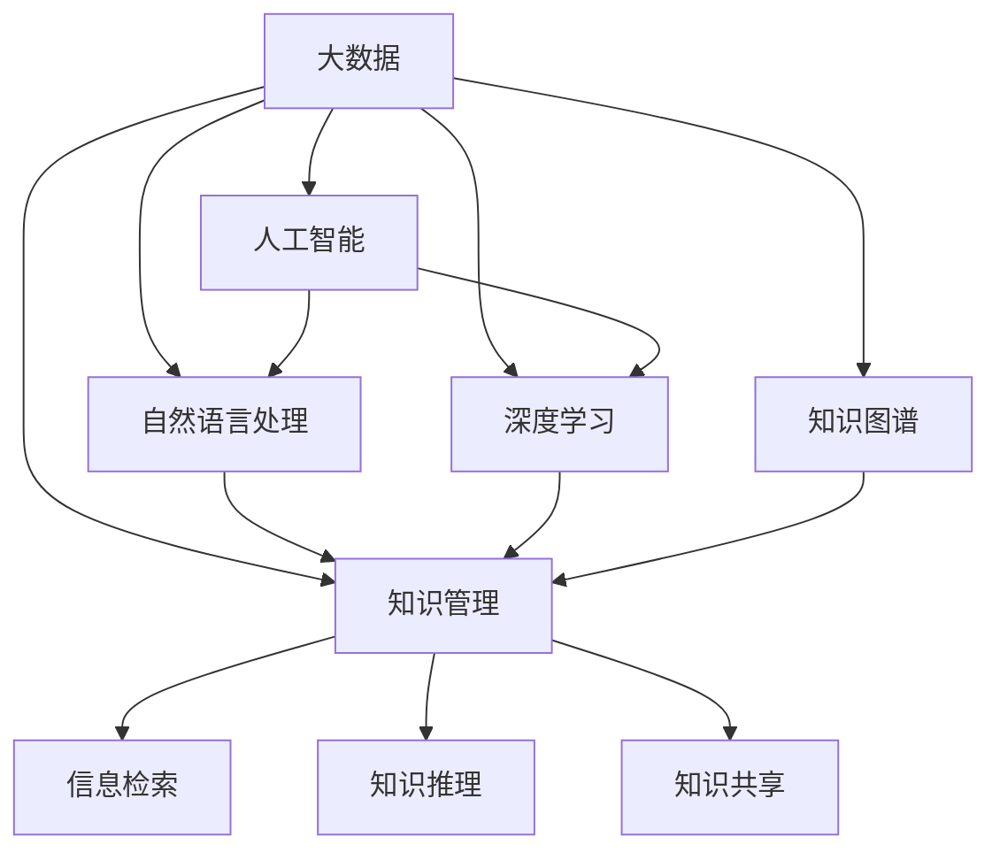

                 

# 大数据时代的知识管理革命

## 1. 背景介绍

### 1.1 问题由来

随着互联网和移动互联网的普及，人们生产、获取和分享信息的能力和频率达到了前所未有的高度。海量的数据生成和快速传播，为知识管理领域带来了深刻的变革。然而，这些数据虽然丰富，但缺乏有效的管理和利用，导致了知识碎片化、管理复杂化等问题。如何在海量数据中高效提取、整合、共享和应用知识，成为了知识管理领域面临的重要挑战。

### 1.2 问题核心关键点

当前的知识管理范式，包括文档管理、元数据标注、知识图谱、信息检索等技术，已经较为成熟。但这些技术更多关注的是数据的静态管理和检索，缺乏对动态知识变化的应对能力。大数据时代，知识的更新频率和来源日益多样化，传统知识管理技术已经无法满足需求。如何通过动态化、智能化的方式，实时监测、分析和处理数据，从中提取出有价值的知识，是未来知识管理技术的研究热点。

### 1.3 问题研究意义

在知识经济时代，知识的获取、管理和应用成为企业竞争的关键。通过智能化、动态化的知识管理技术，企业可以更快速地响应市场变化，提高决策效率，增强竞争力。此外，智能化的知识管理还能帮助个人高效地整理、学习和管理信息，提升工作和学习效率。因此，对大数据时代知识管理技术的研究，具有重要的理论和实践意义。

## 2. 核心概念与联系

### 2.1 核心概念概述

为更好地理解大数据时代知识管理的革命性变化，本节将介绍几个关键概念：

- 大数据(Big Data)：指那些超出传统数据处理工具采集、存储、管理和分析能力的数据集，具有规模大、类型多样、增长快等特点。
- 知识管理(Knowledge Management)：指通过技术手段，对组织和个人知识进行获取、存储、管理和应用的过程，旨在最大化知识价值。
- 人工智能(AI)：通过算法和计算，使机器具备人类智能的一种技术，包括感知、学习、推理等能力。
- 自然语言处理(NLP)：使用人工智能技术处理和理解自然语言的科学，广泛应用于文本分析、信息检索、智能问答等领域。
- 深度学习(Deep Learning)：一种基于神经网络的机器学习技术，能够自动从大量数据中学习复杂特征，并具有很强的泛化能力。
- 知识图谱(Knowledge Graph)：一种图形化的知识表示方法，通过节点和边的关系，表达实体和实体之间的关系，方便知识推理和查询。

这些概念之间相互关联，共同构成了大数据时代知识管理技术的基础。通过理解这些核心概念，我们可以更好地把握知识管理的变革方向。

### 2.2 核心概念原理和架构的 Mermaid 流程图



这个流程图展示了大数据、人工智能、自然语言处理、深度学习和知识图谱与知识管理的相互关系。其中，大数据是知识管理的原始数据来源；人工智能提供了处理大数据的技术手段；自然语言处理和深度学习使得知识提取和建模更加高效；知识图谱提供了知识的结构化表示；信息检索、知识推理和知识共享是知识管理的主要应用场景。这些概念和技术相互交织，共同推动知识管理的革命性变化。

## 3. 核心算法原理 & 具体操作步骤

### 3.1 算法原理概述

在大数据时代，知识管理技术的核心在于如何从海量数据中高效提取、存储和应用知识。传统的知识管理技术更多关注数据的静态存储和检索，难以应对动态知识变化的需求。而基于人工智能和大数据技术的知识管理方法，则能够实时监测、分析和处理数据，从中提取出有价值的知识。

具体来说，知识管理技术的核心算法可以概括为以下几个步骤：

1. **数据采集和清洗**：从各种数据源采集原始数据，并进行清洗、去重和预处理，以保证数据的质量和完整性。
2. **数据存储和管理**：将清洗后的数据存储在高效的分布式数据库中，进行有效的管理和检索。
3. **知识抽取和表示**：使用自然语言处理和深度学习技术，从文本、图像、语音等数据中自动抽取知识，并将其表示为结构化的知识图谱。
4. **知识推理和应用**：通过知识图谱进行知识推理，发现新的知识和关系，并将知识应用于决策支持、智能问答、个性化推荐等场景。
5. **知识共享和协作**：利用知识图谱和协同技术，促进知识的共享和协作，提升组织内部的知识流通效率。

### 3.2 算法步骤详解

#### 数据采集和清洗

数据采集是知识管理的第一步，需要从各种数据源中采集原始数据。这些数据源包括网页、社交媒体、文档、图像、音频等。数据采集通常使用爬虫、API接口等技术手段，确保数据来源的全面性和及时性。

数据清洗的目的是去除噪声和冗余，提高数据质量。常用的数据清洗方法包括去除重复数据、纠正错误、处理缺失值等。例如，可以使用TF-IDF等文本处理技术，去除文本中的停用词和噪音词。

#### 数据存储和管理

数据存储是知识管理的核心环节，需要设计高效的数据库架构，支持大数据的存储和管理。目前常用的分布式数据库包括Hadoop、Spark、Elasticsearch等，它们能够处理海量数据，并提供高可扩展性、高可用性和高可靠性。

数据管理通常包括数据元数据的标注、查询优化和备份恢复等。元数据标注是标记数据的基本属性和特征，如数据来源、时间戳、类别等，方便后续的数据分析和应用。查询优化则通过索引、缓存等技术手段，提高数据检索的效率。备份恢复则确保数据的安全性和可靠性。

#### 知识抽取和表示

知识抽取是从数据中自动抽取有用的信息，并将其表示为结构化的知识图谱。知识图谱是一种图形化的知识表示方法，通过节点和边的关系，表达实体和实体之间的关系。常用的知识抽取方法包括命名实体识别、关系抽取、语义角色标注等。

知识抽取的输入可以是文本、图像、音频等，常用的自然语言处理技术包括分词、句法分析、语义分析等。例如，使用BERT等预训练模型进行命名实体识别，使用LSTM或CNN等神经网络进行关系抽取。

#### 知识推理和应用

知识推理是利用知识图谱进行推理，发现新的知识和关系。常用的知识推理方法包括基于规则的推理、基于逻辑的推理、基于统计的推理等。例如，使用Prolog、DLV等逻辑推理引擎进行基于规则的推理，使用神经网络进行基于统计的推理。

知识应用是将抽取和推理出的知识应用于实际场景，如智能问答、个性化推荐、决策支持等。例如，使用智能问答系统，通过自然语言理解技术，将用户的问题转化为知识图谱中的查询，并给出答案。

#### 知识共享和协作

知识共享和协作是通过协同技术，促进知识的共享和协作，提升组织内部的知识流通效率。常用的知识共享方法包括知识共享平台、协作工具、文档管理系统等。例如，使用Confluence、Slack等协作工具，实现团队成员之间的知识共享和协作。

### 3.3 算法优缺点

#### 优点

1. **高效性**：基于人工智能和大数据技术的知识管理方法，能够从海量数据中高效提取和处理知识，提高知识管理效率。
2. **实时性**：能够实时监测和处理数据变化，及时发现新的知识，提升知识应用的实时性。
3. **可扩展性**：通过分布式数据库和人工智能技术，支持大规模数据的存储和管理，具有良好的可扩展性。
4. **智能化**：利用自然语言处理和深度学习技术，自动抽取和表示知识，减少人工干预，提高知识管理智能化水平。

#### 缺点

1. **技术复杂**：基于人工智能和大数据技术的知识管理方法，需要高水平的技术支持和复杂的技术实现，对开发者要求较高。
2. **数据隐私**：在数据采集和处理过程中，需要注意数据隐私和安全性，避免数据泄露和滥用。
3. **数据噪声**：数据采集过程中，不可避免地会产生噪声和冗余，需要进行数据清洗和预处理。
4. **计算资源**：大数据和深度学习技术需要大量计算资源，对硬件设备要求较高。

### 3.4 算法应用领域

基于大数据时代的知识管理技术，已经广泛应用于以下领域：

1. **智能问答系统**：通过自然语言处理和知识抽取技术，自动回答用户提出的问题。广泛应用于智能客服、在线教育、医疗咨询等领域。
2. **个性化推荐系统**：通过分析用户行为和偏好，提供个性化的内容推荐。广泛应用于电商、新闻、视频等领域。
3. **决策支持系统**：通过知识图谱和推理技术，辅助决策者进行数据分析和决策。广泛应用于金融、供应链、物流等领域。
4. **智能文档管理系统**：通过元数据标注和知识抽取技术，提升文档管理和检索的效率。广泛应用于企业文档管理、项目管理等领域。
5. **智能知识图谱**：通过知识抽取和推理技术，构建大规模的知识图谱，支持复杂的知识推理和应用。广泛应用于科学计算、知识发现、社会网络等领域。

以上应用领域展示了大数据时代知识管理技术的广泛应用前景，未来还将拓展到更多垂直行业。

## 4. 数学模型和公式 & 详细讲解

### 4.1 数学模型构建

在大数据时代的知识管理技术中，涉及许多数学模型和公式。本节将以知识图谱和智能问答系统为例，详细讲解其数学模型构建。

#### 知识图谱的数学模型

知识图谱是用于表示实体和关系的一种图形化结构，可以用节点和边来表示。例如，我们可以将知识图谱表示为一个无向图G(V,E)，其中V表示节点集，E表示边集。

- **节点**：表示实体或属性，如人、地点、组织、时间等。
- **边**：表示实体之间的关系，如“在……工作”、“与……合作”等。

知识图谱中的每个节点和边都对应着一些属性，如实体名称、实体类型、关系名称、关系类型等。这些属性可以用向量或矩阵来表示，方便后续的计算和推理。

#### 智能问答系统的数学模型

智能问答系统通常基于自然语言处理技术，将用户输入的问题转换为知识图谱中的查询，并返回最相关的答案。其数学模型可以概括为以下几个步骤：

1. **问题解析**：将用户输入的问题解析为自然语言处理模型中的特征向量，如TF-IDF、Word2Vec等。
2. **实体识别**：从特征向量中抽取命名实体，如人名、地名、机构名等，用于匹配知识图谱中的实体节点。
3. **关系抽取**：从特征向量中抽取实体之间的关系，如“工作”、“合作”、“属于”等，用于匹配知识图谱中的边节点。
4. **推理计算**：在知识图谱中搜索匹配的实体和关系，并使用推理算法进行计算，得到最相关的答案。
5. **答案生成**：将计算结果转换为自然语言，生成答案并返回给用户。

### 4.2 公式推导过程

#### 知识图谱的公式推导

知识图谱的节点和边可以用向量或矩阵来表示。例如，一个实体的向量可以表示为：

$$
\mathbf{e} = \begin{bmatrix}
    e_1 \\
    e_2 \\
    e_3 \\
    \vdots \\
    e_n
\end{bmatrix}
$$

其中，$e_i$表示实体的第i个属性值，如名称、类型等。一个边的向量可以表示为：

$$
\mathbf{r} = \begin{bmatrix}
    r_1 \\
    r_2 \\
    r_3 \\
    \vdots \\
    r_n
\end{bmatrix}
$$

其中，$r_i$表示边的第i个属性值，如关系名称、关系类型等。

知识图谱的推理通常使用基于规则或逻辑的算法，如Prolog、DLV等。例如，基于Prolog的推理算法可以表示为：

$$
\text{query}(\mathbf{e}, \mathbf{r}) \rightarrow \text{answer}
$$

其中，$\text{query}$表示查询条件，$\text{answer}$表示推理结果。

#### 智能问答系统的公式推导

智能问答系统的核心是自然语言处理和知识图谱的融合。以命名实体识别为例，我们可以使用基于BERT的模型进行解析，其公式可以表示为：

$$
\text{BERT}(x) = \begin{bmatrix}
    p_1 \\
    p_2 \\
    p_3 \\
    \vdots \\
    p_n
\end{bmatrix}
$$

其中，$x$表示用户输入的问题，$p_i$表示BERT模型对问题中第i个词的预测概率。通过阈值过滤，可以得到可能包含实体的词列表，用于实体识别。

### 4.3 案例分析与讲解

#### 案例一：智能问答系统的构建

假设我们要构建一个关于股票市场的智能问答系统，首先需要构建一个关于股票市场的知识图谱。知识图谱中的节点可以包括股票、公司、市场指数等实体，边可以包括“所属公司”、“股票代码”、“市场指数”等关系。

接着，我们需要收集用户输入的问题，如“特斯拉股票的市盈率是多少？”。通过自然语言处理技术，我们可以将问题转换为BERT模型中的特征向量，并进行命名实体识别和关系抽取。

然后，在知识图谱中进行匹配和推理计算，找到与问题相关的节点和边，并使用Prolog等算法进行推理。最终，系统返回包含特斯拉股票市盈率信息的答案。

#### 案例二：个性化推荐系统的构建

假设我们要构建一个个性化推荐系统，首先需要收集用户的历史行为数据，如浏览记录、购买记录等。将这些数据转换为知识图谱中的节点和边，节点表示物品和用户，边表示用户行为。

接着，我们需要使用自然语言处理技术，对用户浏览和购买的文本描述进行语义分析，并提取实体和关系。例如，用户浏览了一条关于“黑五”的评论，系统可以识别出“黑五”实体，并将其与“打折促销”关系关联起来。

然后，在知识图谱中进行匹配和推理计算，找到与用户行为相关联的物品节点，并使用协同过滤等算法进行推荐计算。最终，系统返回包含用户感兴趣物品的推荐列表。

## 5. 项目实践：代码实例和详细解释说明

### 5.1 开发环境搭建

在进行知识管理系统的开发前，我们需要准备好开发环境。以下是使用Python进行Spark开发的环境配置流程：

1. 安装Anaconda：从官网下载并安装Anaconda，用于创建独立的Python环境。

2. 创建并激活虚拟环境：
```bash
conda create -n spark-env python=3.8 
conda activate spark-env
```

3. 安装Spark：根据CUDA版本，从官网获取对应的安装命令。例如：
```bash
conda install pyspark=3.2.2 cudatoolkit=11.1 -c conda-forge
```

4. 安装相关的工具包：
```bash
pip install pyspark-nlp
pip install pyarrow
pip install pytorch
```

5. 安装各种依赖库：
```bash
pip install tqdm tabulate matplotlib
```

完成上述步骤后，即可在`spark-env`环境中开始知识管理系统开发。

### 5.2 源代码详细实现

下面我们以智能问答系统为例，给出使用PySpark进行知识图谱构建和查询的Python代码实现。

首先，定义知识图谱的节点和边：

```python
from pyspark.sql import SparkSession
from pyspark.sql.functions import col, array, explode
from pyspark.sql.types import StructType, StructField, StringType, IntegerType

spark = SparkSession.builder.appName('KnowledgeGraph').getOrCreate()

# 定义节点和边的数据类型
node_schema = StructType([
    StructField('id', IntegerType(), True),
    StructField('name', StringType(), True),
    StructField('type', StringType(), True)
])

edge_schema = StructType([
    StructField('src_id', IntegerType(), True),
    StructField('dst_id', IntegerType(), True),
    StructField('rel', StringType(), True)
])

# 定义知识图谱的节点和边数据
node_data = [
    {"id": 1, "name": "Apple Inc.", "type": "Company"},
    {"id": 2, "name": "Alphabet Inc.", "type": "Company"},
    {"id": 3, "name": "Microsoft Corporation", "type": "Company"}
]

edge_data = [
    {"src_id": 1, "dst_id": 2, "rel": "competitor"},
    {"src_id": 2, "dst_id": 3, "rel": "partner"}
]

# 创建节点和边的DataFrame
nodes_df = spark.createDataFrame([node_data], node_schema)
edges_df = spark.createDataFrame([edge_data], edge_schema)
```

然后，定义知识图谱的查询操作：

```python
# 定义查询函数，用于在知识图谱中搜索匹配的节点和边
def search_query(node_id, rel_type):
    query_df = nodes_df.join(edges_df, (nodes_df.id == edges_df.src_id) | (nodes_df.id == edges_df.dst_id))
    return query_df.filter((query_df.dst_id == node_id) & (query_df.rel == rel_type))

# 使用查询函数搜索匹配的节点和边
query_result = search_query(2, "partner")
query_result.show()
```

最后，启动查询流程并输出结果：

```python
query_result = search_query(2, "partner")
query_result.show()
```

以上就是使用PySpark构建知识图谱并进行查询的完整代码实现。可以看到，通过Spark和PySpark-NLP等工具，我们可以轻松构建和查询大规模的知识图谱，高效地处理复杂的知识推理任务。

### 5.3 代码解读与分析

让我们再详细解读一下关键代码的实现细节：

**node_data和edge_data**：
- 定义了知识图谱的节点和边数据，使用JSON格式进行表示。

**node_schema和edge_schema**：
- 定义了节点和边的数据类型，方便后续的数据处理和查询。

**nodes_df和edges_df**：
- 将节点和边的数据转换为Spark的DataFrame格式，并进行持久化存储。

**search_query函数**：
- 定义了在知识图谱中搜索匹配的节点和边的函数，使用join操作连接节点和边数据，并使用filter操作进行条件筛选。

**query_result**：
- 调用查询函数，获取匹配的节点和边，并进行显示。

可以看到，Spark和PySpark-NLP使得知识图谱的构建和查询变得简洁高效。开发者可以将更多精力放在业务逻辑和应用场景上，而不必过多关注底层的数据处理和计算细节。

当然，工业级的系统实现还需考虑更多因素，如数据存储和检索、查询优化、并发控制等。但核心的知识图谱构建和查询流程基本与此类似。

## 6. 实际应用场景

### 6.1 智能问答系统

基于知识管理技术，智能问答系统可以实时响应用户提出的问题，并提供准确、及时的答案。该技术已经被广泛应用于智能客服、在线教育、医疗咨询等领域，极大地提高了服务效率和用户体验。

在智能客服场景中，智能问答系统可以处理大量用户咨询，提升客服中心的工作效率。系统可以通过自然语言理解技术，将用户输入的问题转化为知识图谱中的查询，并返回最相关的答案。例如，用户咨询“怎么查询快递物流信息”，系统可以识别出“快递物流”实体，并搜索匹配的节点和关系，返回快递物流查询的步骤和链接。

在在线教育领域，智能问答系统可以回答学生的学习问题，提供个性化的学习建议。系统可以通过分析学生的历史学习数据，建立知识图谱，并提供智能化的学习支持。例如，学生在学习过程中遇到问题，可以通过自然语言输入问题，系统能够自动推荐相关课程和资料。

在医疗咨询场景中，智能问答系统可以提供医疗知识和健康建议，辅助医生诊断和治疗。系统可以通过知识图谱和推理技术，提供诊断和治疗方案，并实时更新最新的医疗知识。例如，用户咨询“感冒应该如何治疗”，系统可以搜索匹配的节点和关系，并给出相应的治疗建议。

### 6.2 个性化推荐系统

个性化推荐系统通过知识管理技术，分析用户行为和偏好，提供个性化的内容推荐。该技术已经被广泛应用于电商、新闻、视频等领域，极大地提升了用户体验和满意度。

在电商推荐场景中，个性化推荐系统可以通过分析用户浏览和购买记录，建立知识图谱，并提供个性化的商品推荐。例如，用户浏览了一条关于“黑五”的评论，系统可以识别出“黑五”实体，并将其与“打折促销”关系关联起来。根据用户的历史行为数据，系统可以生成个性化的推荐列表，提升用户的购物体验。

在新闻推荐场景中，个性化推荐系统可以通过分析用户阅读和分享记录，建立知识图谱，并提供个性化的新闻推荐。例如，用户阅读了一篇关于“AI发展”的新闻，系统可以识别出“AI发展”实体，并将其与“科技”关系关联起来。根据用户的阅读偏好，系统可以生成个性化的新闻推荐列表，提升用户的阅读体验。

在视频推荐场景中，个性化推荐系统可以通过分析用户观看和评分记录，建立知识图谱，并提供个性化的视频推荐。例如，用户观看了一部关于“人工智能”的电影，系统可以识别出“人工智能”实体，并将其与“科幻”关系关联起来。根据用户的观看偏好，系统可以生成个性化的视频推荐列表，提升用户的观看体验。

### 6.3 决策支持系统

决策支持系统通过知识管理技术，分析数据和知识，辅助决策者进行数据分析和决策。该技术已经被广泛应用于金融、供应链、物流等领域，极大地提升了决策效率和准确性。

在金融领域，决策支持系统可以通过知识图谱和推理技术，提供市场分析和投资建议。例如，分析师可以通过知识图谱查询历史交易数据和市场信息，获取投资机会和风险预警。系统可以提供实时市场分析和预测，辅助分析师进行投资决策。

在供应链管理领域，决策支持系统可以通过知识图谱和推理技术，优化供应链管理和物流决策。例如，企业可以通过知识图谱查询供应商和客户关系，优化采购和销售策略。系统可以提供实时物流监控和风险预警，辅助供应链管理人员进行决策。

在物流领域，决策支持系统可以通过知识图谱和推理技术，优化物流路线和库存管理。例如，物流公司可以通过知识图谱查询货物流通关系和交通状况，优化运输路线。系统可以提供实时货物流通监控和风险预警，辅助物流管理人员进行决策。

### 6.4 未来应用展望

随着知识管理技术的不断进步，其在各个领域的应用前景更加广阔。未来，知识管理技术将在更多垂直行业得到应用，带来更深远的变革。

在智慧城市治理中，知识管理技术可以用于城市事件监测、舆情分析、应急指挥等环节，提高城市管理的自动化和智能化水平，构建更安全、高效的未来城市。例如，通过知识图谱和推理技术，系统可以实时监测城市事件和舆情变化，提供决策支持和应急处理建议。

在智慧医疗领域，知识管理技术可以用于医疗知识和健康建议，辅助医生诊断和治疗。系统可以通过知识图谱和推理技术，提供最新的医疗知识和健康建议，提升医生的诊断和治疗水平。例如，医生可以通过知识图谱查询最新的医疗知识，获取精准的诊断和治疗方案。

在智能制造领域，知识管理技术可以用于生产计划和质量控制。系统可以通过知识图谱和推理技术，优化生产流程和质量控制，提高生产效率和产品质量。例如，企业可以通过知识图谱查询生产数据和设备信息，优化生产计划和质量控制。

## 7. 工具和资源推荐

### 7.1 学习资源推荐

为了帮助开发者系统掌握知识管理技术的理论基础和实践技巧，这里推荐一些优质的学习资源：

1. 《大数据与人工智能：构建知识管理系统》系列博文：由知识管理领域专家撰写，深入浅出地介绍了大数据与人工智能在知识管理中的应用。

2. 《深度学习与自然语言处理》课程：斯坦福大学开设的深度学习与自然语言处理课程，涵盖基础知识和经典模型，是入门大数据与人工智能知识管理的必备课程。

3. 《知识管理技术与应用》书籍：系统介绍了知识管理技术的理论基础和实践方法，涵盖知识图谱、信息检索、智能问答等领域。

4. HuggingFace官方文档：Transformers库的官方文档，提供了海量预训练模型和完整的微调样例代码，是进行知识管理任务开发的利器。

5. Google Knowledge Graph API：谷歌提供的知识图谱API，可以方便地构建和查询大规模的知识图谱，支持多语言和多种数据源。

通过对这些资源的学习实践，相信你一定能够快速掌握知识管理技术的精髓，并用于解决实际的业务问题。

### 7.2 开发工具推荐

高效的开发离不开优秀的工具支持。以下是几款用于知识管理任务开发的常用工具：

1. PySpark：基于Spark的Python API，支持分布式计算和数据处理，适合大规模数据处理任务。

2. PyTorch-NLP：基于PyTorch的NLP库，支持自然语言处理任务，提供了丰富的预训练模型和训练工具。

3. Apache Jena：基于RDF的知识图谱框架，支持知识图谱的构建、查询和推理。

4. Scikit-learn：用于数据预处理、特征提取、模型训练和评估的Python库，支持多种机器学习算法。

5. Apache Spark GraphX：用于图数据处理和分析的Spark组件，支持大规模知识图谱的处理和推理。

合理利用这些工具，可以显著提升知识管理任务开发的效率，加快创新迭代的步伐。

### 7.3 相关论文推荐

知识管理技术的发展源于学界的持续研究。以下是几篇奠基性的相关论文，推荐阅读：

1. "Knowledge Graphs: Concepts, Approaches, Applications and Technologies"：介绍了知识图谱的概念、方法和应用，是知识图谱领域的经典综述。

2. "A Survey on Knowledge Graph Embeddings"：综述了知识图谱嵌入技术的现状和未来发展方向，涵盖了多种知识图谱嵌入方法和应用场景。

3. "Deep Learning for Natural Language Processing"：介绍了深度学习在自然语言处理中的应用，包括命名实体识别、关系抽取、语义分析等任务。

4. "A Survey on Knowledge Management Technologies"：综述了知识管理技术的现状和未来发展方向，涵盖了多种知识管理技术和应用场景。

5. "AI for Knowledge Management"：综述了人工智能在知识管理中的应用，包括自然语言处理、知识图谱、智能问答等任务。

这些论文代表了大数据时代知识管理技术的研究进展。通过学习这些前沿成果，可以帮助研究者把握学科前进方向，激发更多的创新灵感。

## 8. 总结：未来发展趋势与挑战

### 8.1 总结

本文对大数据时代的知识管理技术进行了全面系统的介绍。首先阐述了知识管理范式的演变和研究背景，明确了知识管理在人工智能和大数据时代的变革方向。其次，从原理到实践，详细讲解了知识抽取、知识表示、知识推理和知识共享等关键技术，给出了知识管理任务开发的完整代码实例。同时，本文还广泛探讨了知识管理技术在智能问答、个性化推荐、决策支持等多个领域的应用前景，展示了知识管理技术的广泛应用前景。此外，本文精选了知识管理技术的各类学习资源，力求为读者提供全方位的技术指引。

通过本文的系统梳理，可以看到，基于大数据时代的知识管理技术正在成为NLP领域的重要范式，极大地拓展了知识管理技术的应用边界，催生了更多的落地场景。受益于大规模数据和深度学习技术的支持，知识管理技术能够从海量数据中高效提取和处理知识，实现实时监测、分析和处理数据，从中提取出有价值的知识。未来，伴随知识管理技术的持续演进，相信知识管理技术必将在更广阔的应用领域大放异彩，深刻影响人类的生产生活方式。

### 8.2 未来发展趋势

展望未来，知识管理技术将呈现以下几个发展趋势：

1. **智能化的知识管理**：基于人工智能和大数据技术的知识管理方法，能够从海量数据中高效提取和处理知识，实现实时监测、分析和处理数据，从中提取出有价值的知识。智能化的知识管理技术将成为未来知识管理的重要方向。

2. **跨领域知识整合**：知识管理技术将更多地与其他技术进行融合，如知识图谱、人工智能、自然语言处理等，实现知识的跨领域整合和应用。例如，知识图谱与语音识别、视觉识别等技术的结合，将进一步提升知识管理的智能化水平。

3. **知识图谱的普及**：知识图谱作为一种图形化的知识表示方法，具有结构化和语义化的特点，能够更好地支持知识的推理和应用。未来，知识图谱将被更多地应用于各个领域，成为知识管理的重要工具。

4. **多模态知识管理**：知识管理技术将更多地融合多模态数据，如文本、图像、语音等，实现多模态知识的整合和应用。例如，知识图谱与图像识别、语音识别等技术的结合，将进一步提升知识管理的智能化水平。

5. **知识管理的自动化**：知识管理技术将更多地利用自动化工具和算法，实现知识的自动抽取、标注和推理，减少人工干预，提高知识管理的效率。例如，自然语言处理和深度学习技术将进一步提升知识管理的智能化水平。

6. **知识共享和协作**：知识管理技术将更多地利用协同工具和平台，促进知识的共享和协作，提升知识流通效率。例如，知识共享平台、协作工具等将成为知识管理的重要手段。

以上趋势凸显了大数据时代知识管理技术的广阔前景。这些方向的探索发展，必将进一步提升知识管理的智能化水平，推动知识管理技术向更深入、更广泛的应用场景扩展。

### 8.3 面临的挑战

尽管大数据时代的知识管理技术已经取得了显著进展，但在迈向更加智能化、普适化应用的过程中，它仍面临诸多挑战：

1. **数据质量问题**：知识管理技术对数据质量的要求较高，需要保证数据的完整性、准确性和一致性。但在实际应用中，数据的噪声和冗余难以避免，需要进行有效的数据清洗和预处理。

2. **计算资源限制**：知识管理技术需要大量的计算资源，对硬件设备的要求较高。如何优化计算效率，提高知识管理的实时性，是未来需要解决的重要问题。

3. **知识图谱构建**：知识图谱的构建需要耗费大量的人力和时间，且复杂度较高。如何自动化构建知识图谱，提高知识图谱的质量和覆盖率，是未来需要解决的重要问题。

4. **知识推理精度**：知识推理是知识管理的核心环节，但如何提高知识推理的精度和可靠性，减少推理错误，是未来需要解决的重要问题。

5. **知识应用场景**：知识管理技术需要适配不同的应用场景，但如何设计灵活的知识管理框架，支持多场景的知识管理，是未来需要解决的重要问题。

6. **知识安全与隐私**：知识管理技术需要保证知识的安全和隐私，但如何在知识共享和应用过程中，保护用户隐私和数据安全，是未来需要解决的重要问题。

7. **知识更新与维护**：知识管理技术需要及时更新和维护，以保持知识的准确性和时效性，但如何在知识动态变化的情况下，保持知识的持续更新和维护，是未来需要解决的重要问题。

正视知识管理面临的这些挑战，积极应对并寻求突破，将是大数据时代知识管理技术走向成熟的必由之路。相信随着学界和产业界的共同努力，这些挑战终将一一被克服，知识管理技术必将在构建智能社会的道路上发挥重要作用。

### 8.4 研究展望

面对大数据时代知识管理所面临的挑战，未来的研究需要在以下几个方面寻求新的突破：

1. **知识图谱自动化构建**：利用自然语言处理和知识抽取技术，自动化构建知识图谱，提高知识图谱的覆盖率和质量。例如，使用深度学习技术自动标注实体和关系，减少人工干预。

2. **知识推理优化**：优化知识推理算法，提高知识推理的精度和效率，减少推理错误。例如，引入因果推断和对比学习思想，增强知识推理的稳定性和鲁棒性。

3. **知识应用场景拓展**：设计灵活的知识管理框架，支持多场景的知识管理，提高知识管理的普适性和可扩展性。例如，设计统一的API接口，支持多种知识管理任务。

4. **知识安全与隐私保护**：加强知识安全与隐私保护技术，确保知识共享和应用过程中的数据安全和用户隐私。例如，使用区块链技术进行知识认证和溯源，确保知识的真实性和可靠性。

5. **知识持续更新与维护**：设计知识持续更新与维护机制，保持知识的准确性和时效性。例如，利用增量学习技术，动态更新知识图谱，减少知识管理的维护成本。

这些研究方向的探索，必将引领知识管理技术迈向更高的台阶，为构建智能社会的知识管理需求提供更加强大的技术支持。面向未来，知识管理技术还需要与其他人工智能技术进行更深入的融合，如知识表示、因果推理、强化学习等，多路径协同发力，共同推动知识管理的进步。只有勇于创新、敢于突破，才能不断拓展知识管理的边界，让知识管理技术更好地服务于智能社会的建设。

## 9. 附录：常见问题与解答

**Q1：知识管理技术是否适用于所有领域？**

A: 知识管理技术适用于大部分领域，尤其是那些需要大量数据和知识支持的领域。例如，金融、医疗、教育、物流等。但对于一些特定的领域，如军事、情报等，由于数据隐私和安全等原因，可能难以直接应用知识管理技术。

**Q2：如何提高知识管理的实时性？**

A: 提高知识管理的实时性需要从多个方面进行优化，包括数据采集、数据存储、知识图谱构建和查询等环节。例如，使用分布式数据库和Spark等技术，提高数据存储和处理的效率。同时，利用自然语言处理和深度学习技术，自动构建知识图谱，提高知识图谱的构建效率和覆盖率。最后，使用高效的推理算法，提高知识推理的精度和效率。

**Q3：知识管理技术需要哪些计算资源？**

A: 知识管理技术需要大量的计算资源，特别是深度学习技术需要高性能的GPU/TPU设备。例如，构建大规模知识图谱和进行深度学习模型训练，需要强大的计算资源。在实际应用中，可以考虑使用云服务提供商提供的计算资源，如AWS、Google Cloud、Azure等，降低硬件成本。

**Q4：知识管理技术如何保证数据隐私和安全性？**

A: 知识管理技术需要保证数据隐私和安全性，主要从数据采集、存储和查询等环节进行控制。例如，在数据采集阶段，使用数据匿名化技术，去除敏感信息。在数据存储阶段，使用加密技术和访问控制策略，保护数据安全。在数据查询阶段，使用访问控制和数据脱敏技术，防止数据泄露。

**Q5：知识管理技术如何适配不同的应用场景？**

A: 知识管理技术需要适配不同的应用场景，主要通过设计灵活的知识管理框架和接口来实现。例如，设计统一的API接口，支持多种知识管理任务，方便在不同场景下使用。同时，根据不同场景的需求，选择合适的知识抽取、推理和应用方法，提高知识管理的普适性和可扩展性。

通过本文的系统梳理，可以看到，基于大数据时代的知识管理技术正在成为NLP领域的重要范式，极大地拓展了知识管理技术的应用边界，催生了更多的落地场景。受益于大规模数据和深度学习技术的支持，知识管理技术能够从海量数据中高效提取和处理知识，实现实时监测、分析和处理数据，从中提取出有价值的知识。未来，伴随知识管理技术的持续演进，相信知识管理技术必将在更广阔的应用领域大放异彩，深刻影响人类的生产生活方式。

