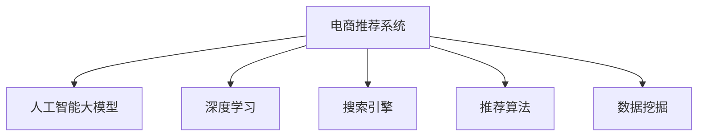

                 

# 大数据驱动的电商平台转型：搜索推荐系统是核心，AI 大模型是引擎

## 1. 背景介绍

### 1.1 问题由来
近年来，随着电子商务的迅速发展，电商平台纷纷涌现，市场竞争日益激烈。传统电商以价格和产品为中心，但仅靠产品展示和营销活动已无法满足消费者的个性化需求。基于此，电商平台纷纷引入人工智能技术，实现个性化推荐、智能搜索、智能客服等功能，从而提升用户体验，增强市场竞争力。

但随着平台规模的不断扩大，数据量的急剧增长，传统推荐算法在处理大数据时的局限性逐渐显现。面对大规模、高维度的用户行为数据，传统的基于协同过滤、矩阵分解等方法的推荐系统已无法适应复杂多样的用户需求，亟需引入更强大的算法和技术手段。

### 1.2 问题核心关键点
电商平台的个性化推荐系统，核心目标在于根据用户的浏览和购买行为，推荐用户可能感兴趣的商品。传统的推荐算法如协同过滤、基于内容的推荐等，其性能瓶颈在于数据稀疏性，难以处理非结构化数据，且需要耗费大量计算资源。而基于大数据的推荐系统，通过使用机器学习模型，特别是深度学习模型，可以从大量数据中挖掘出更有意义的用户行为特征，实现更精准的个性化推荐。

AI大模型作为当前深度学习领域的一大趋势，在处理大规模数据集时具有显著优势。利用深度神经网络进行大规模预训练，模型能够学习到通用的语义表示，并能较好地迁移应用到电商推荐任务上，提升推荐精度。

### 1.3 问题研究意义
研究基于AI大模型的电商推荐系统，对于提升电商平台的用户体验，增强平台竞争力具有重要意义：

1. 提升推荐精度。AI大模型能够从海量用户行为数据中学习到更深层次的语义信息，从而提升推荐结果的准确性和相关性。
2. 个性化推荐。利用AI大模型进行个性化推荐，能够更准确地捕捉用户兴趣，提供差异化的个性化推荐服务。
3. 提升转化率。精准的推荐系统能够提高用户满意度和购买率，从而增加平台收益。
4. 降低运营成本。通过自动化的推荐系统，可以减少人工干预和运营成本。
5. 提高平台竞争力。电商平台的推荐系统是核心竞争力之一，通过引入先进的AI技术，平台能够在激烈的市场竞争中脱颖而出。

## 2. 核心概念与联系

### 2.1 核心概念概述

为更好地理解基于AI大模型的电商推荐系统，本节将介绍几个密切相关的核心概念：

- 电商推荐系统：基于用户的购买行为、浏览记录等数据，推荐用户可能感兴趣的商品，提升用户体验和平台收益。
- 人工智能大模型：以深度神经网络为架构，通过大规模无标签数据预训练获得通用语义表示，具备强大的泛化能力和迁移学习能力。
- 深度学习：一种基于神经网络的机器学习技术，利用多层非线性变换，从数据中提取高维特征，实现复杂的模式识别和预测。
- 搜索引擎：电商平台的搜索系统，帮助用户快速找到所需商品。
- 推荐算法：推荐系统采用的算法，如协同过滤、矩阵分解、内容推荐等。
- 数据挖掘：从大量数据中提取有价值的信息和知识，用于决策支持或模型训练。

这些核心概念之间的逻辑关系可以通过以下Mermaid流程图来展示：



这个流程图展示了一些核心概念及其之间的关系：

1. 电商推荐系统是最终目标，利用人工智能大模型、深度学习、搜索引擎、推荐算法和数据挖掘等技术手段。
2. 人工智能大模型为推荐系统提供底层支持，具备强大的语义表示能力。
3. 深度学习是主要技术手段，用于训练大模型和推荐算法。
4. 搜索引擎用于快速定位用户所需商品。
5. 推荐算法是核心算法，用于生成推荐结果。
6. 数据挖掘用于从原始数据中提取有用特征和模式，用于训练模型和优化算法。

这些概念共同构成了电商推荐系统的技术框架，使其能够在各种场景下发挥强大的推荐能力。通过理解这些核心概念，我们可以更好地把握电商推荐系统的技术实现和优化方向。

## 3. 核心算法原理 & 具体操作步骤
### 3.1 算法原理概述

基于AI大模型的电商推荐系统，核心思想是利用深度学习模型从用户行为数据中学习到通用的语义表示，并在推荐任务上进行微调，实现更精准的推荐。其核心算法流程如下：

1. 收集用户行为数据，如浏览记录、购买记录、搜索记录等。
2. 对数据进行清洗、归一化、特征提取等预处理。
3. 使用AI大模型进行预训练，学习通用的语义表示。
4. 在推荐任务上微调大模型，优化推荐算法。
5. 利用微调后的模型生成推荐结果，结合搜索系统实现个性化推荐。

### 3.2 算法步骤详解

基于AI大模型的电商推荐系统，主要分为预训练和微调两个阶段。

#### 预训练阶段：

1. 收集用户行为数据：收集用户在平台上的浏览、点击、购买、收藏、评价等行为数据。
2. 数据预处理：对数据进行清洗、归一化、特征提取等预处理步骤，去除异常值和噪声，提取有用的特征信息。
3. 选择预训练模型：选择如BERT、GPT等深度神经网络作为预训练模型。
4. 数据增强：通过数据增强技术，如回译、近义替换等，增加数据多样性，提高模型的泛化能力。
5. 预训练过程：利用预训练数据集对模型进行大规模无监督预训练，学习通用的语义表示。

#### 微调阶段：

1. 模型选择与初始化：选择已预训练好的大模型，并根据推荐任务需求进行初始化。
2. 数据集划分：将收集到的用户行为数据划分为训练集、验证集和测试集。
3. 模型适配：根据推荐任务的特点，设计合适的任务适配层，如多类分类器、回归器等。
4. 微调过程：利用推荐任务数据集，对模型进行有监督微调，优化推荐算法。
5. 模型评估与优化：在验证集上评估模型性能，根据性能指标调整模型参数，优化推荐算法。
6. 测试与部署：在测试集上评估模型效果，部署到电商平台上进行实际推荐。

### 3.3 算法优缺点

基于AI大模型的电商推荐系统，具有以下优点：

1. 处理大规模数据：深度学习模型能够处理大规模、高维度的用户行为数据，提升推荐精度。
2. 提取语义特征：通过预训练和微调，模型能够学习到更深入的语义特征，提高推荐相关性。
3. 泛化能力强：预训练模型具备较强的泛化能力，能够适应不同类型的推荐任务。
4. 算法高效：深度学习模型能够并行计算，提升推荐系统的效率。

同时，该方法也存在一些缺点：

1. 数据需求量大：深度学习模型需要大量的标注数据进行训练，而电商平台的标注数据通常较少。
2. 计算资源需求高：深度学习模型需要耗费大量的计算资源进行训练和推理，成本较高。
3. 可解释性差：深度学习模型的决策过程不透明，难以解释其推荐逻辑。
4. 对抗性风险：深度学习模型可能会学习到对抗性样本，导致推荐结果不准确。

### 3.4 算法应用领域

基于AI大模型的电商推荐系统，已广泛应用于各大电商平台，如淘宝、京东、亚马逊等。其主要应用领域包括：

1. 商品推荐：根据用户浏览和购买记录，推荐可能感兴趣的商品。
2. 个性化广告：在搜索结果页展示个性化广告，增加用户点击率。
3. 智能客服：利用自然语言处理技术，回答用户常见问题，提升用户满意度。
4. 价格优化：通过分析用户行为数据，调整商品价格，提高销售额。
5. 库存管理：根据预测需求，优化商品库存，减少库存积压。
6. 风控预警：利用用户行为数据，识别欺诈行为，提高平台安全性。

除了这些应用领域，AI大模型在电商平台的更多场景中也被广泛应用，如用户画像分析、用户行为预测、产品上下架优化等，为电商平台带来了更多的商业价值和用户需求。

## 4. 数学模型和公式 & 详细讲解 & 举例说明

### 4.1 数学模型构建

假设电商平台收集到用户行为数据 $D=\{(x_i,y_i)\}_{i=1}^N$，其中 $x_i$ 为特征向量，$y_i$ 为标签。我们的目标是利用深度学习模型学习到用户行为与推荐结果之间的关系，即：

$$
f(x_i) = y_i
$$

其中 $f(x_i)$ 为模型对用户行为 $x_i$ 的预测输出。

为了训练深度学习模型，我们通常使用损失函数 $\mathcal{L}$ 来衡量模型预测输出与真实标签之间的差异，并最小化该损失函数：

$$
\mathcal{L}(f(x),y) = \frac{1}{N} \sum_{i=1}^N \ell(f(x_i),y_i)
$$

其中 $\ell$ 为具体的损失函数，如交叉熵损失、均方误差损失等。

### 4.2 公式推导过程

以交叉熵损失函数为例，其公式为：

$$
\ell(f(x),y) = -[y\log f(x) + (1-y)\log (1-f(x))]
$$

对于多分类任务，可以扩展为：

$$
\ell(f(x),y) = -\sum_{k=1}^K y_k\log f_k(x)
$$

其中 $f_k(x)$ 为模型对第 $k$ 类别的预测概率，$y_k$ 为真实标签。

利用上述公式，我们可以计算损失函数 $\mathcal{L}$ 并求导：

$$
\frac{\partial \mathcal{L}}{\partial f_k(x)} = -\frac{1}{N} \sum_{i=1}^N \frac{\partial \ell(f(x_i),y_i)}{\partial f_k(x_i)} = -\frac{1}{N} \sum_{i=1}^N \frac{y_k}{f_k(x_i)}
$$

由此得到损失函数对模型输出 $f_k(x)$ 的梯度。

### 4.3 案例分析与讲解

以下以电商推荐系统为例，分析模型训练过程。

假设我们收集到用户的浏览记录 $D=\{(x_i,y_i)\}_{i=1}^N$，其中 $x_i$ 为浏览记录的特征向量，$y_i$ 为推荐结果的标签。我们采用深度学习模型进行推荐任务，利用AI大模型进行预训练和微调。

在预训练阶段，我们利用大规模无标签数据集 $D^{pre}$ 对模型进行预训练，学习通用的语义表示。在微调阶段，我们将预训练模型应用于电商推荐任务，并利用标注数据集 $D^{task}$ 进行微调。

具体步骤包括：

1. 收集电商推荐任务的数据集 $D^{task}$。
2. 对数据进行清洗、归一化、特征提取等预处理步骤。
3. 选择预训练好的AI大模型，如BERT，作为微调模型。
4. 设计合适的任务适配层，如多类分类器。
5. 使用数据集 $D^{task}$ 对模型进行微调，最小化损失函数 $\mathcal{L}$。
6. 在验证集上评估模型性能，根据性能指标调整模型参数，优化推荐算法。
7. 在测试集上评估模型效果，部署到电商平台上进行实际推荐。

## 5. 项目实践：代码实例和详细解释说明

### 5.1 开发环境搭建

在进行电商推荐系统开发前，我们需要准备好开发环境。以下是使用Python进行PyTorch开发的环境配置流程：

1. 安装Anaconda：从官网下载并安装Anaconda，用于创建独立的Python环境。

2. 创建并激活虚拟环境：
```bash
conda create -n pytorch-env python=3.8 
conda activate pytorch-env
```

3. 安装PyTorch：根据CUDA版本，从官网获取对应的安装命令。例如：
```bash
conda install pytorch torchvision torchaudio cudatoolkit=11.1 -c pytorch -c conda-forge
```

4. 安装TensorFlow：从官网下载并安装TensorFlow，支持GPU/TPU算力。

5. 安装各类工具包：
```bash
pip install numpy pandas scikit-learn matplotlib tqdm jupyter notebook ipython
```

完成上述步骤后，即可在`pytorch-env`环境中开始电商推荐系统的开发。

### 5.2 源代码详细实现

下面我们以电商推荐系统为例，给出使用PyTorch进行深度学习模型开发和电商推荐算法实现的PyTorch代码实现。

首先，定义电商推荐系统的数据处理函数：

```python
from transformers import BertTokenizer
from torch.utils.data import Dataset
import torch

class ECommerceDataset(Dataset):
    def __init__(self, data, tokenizer):
        self.data = data
        self.tokenizer = tokenizer
        
    def __len__(self):
        return len(self.data)
    
    def __getitem__(self, idx):
        item = self.data[idx]
        features = self.tokenizer(item['features'], return_tensors='pt')
        return features
```

然后，定义模型和优化器：

```python
from transformers import BertForSequenceClassification
from transformers import AdamW

model = BertForSequenceClassification.from_pretrained('bert-base-uncased', num_labels=2)

optimizer = AdamW(model.parameters(), lr=2e-5)
```

接着，定义训练和评估函数：

```python
from torch.utils.data import DataLoader
from tqdm import tqdm
from sklearn.metrics import accuracy_score

device = torch.device('cuda') if torch.cuda.is_available() else torch.device('cpu')
model.to(device)

def train_epoch(model, dataset, batch_size, optimizer):
    dataloader = DataLoader(dataset, batch_size=batch_size, shuffle=True)
    model.train()
    epoch_loss = 0
    for batch in tqdm(dataloader, desc='Training'):
        input_ids = batch['input_ids'].to(device)
        attention_mask = batch['attention_mask'].to(device)
        labels = batch['labels'].to(device)
        model.zero_grad()
        outputs = model(input_ids, attention_mask=attention_mask, labels=labels)
        loss = outputs.loss
        epoch_loss += loss.item()
        loss.backward()
        optimizer.step()
    return epoch_loss / len(dataloader)

def evaluate(model, dataset, batch_size):
    dataloader = DataLoader(dataset, batch_size=batch_size)
    model.eval()
    preds, labels = [], []
    with torch.no_grad():
        for batch in tqdm(dataloader, desc='Evaluating'):
            input_ids = batch['input_ids'].to(device)
            attention_mask = batch['attention_mask'].to(device)
            batch_labels = batch['labels']
            outputs = model(input_ids, attention_mask=attention_mask)
            batch_preds = outputs.logits.argmax(dim=1).to('cpu').tolist()
            batch_labels = batch_labels.to('cpu').tolist()
            for pred, label in zip(batch_preds, batch_labels):
                preds.append(pred.item())
                labels.append(label.item())
                
    print(f"Accuracy: {accuracy_score(labels, preds)}")
```

最后，启动训练流程并在测试集上评估：

```python
epochs = 5
batch_size = 16

for epoch in range(epochs):
    loss = train_epoch(model, train_dataset, batch_size, optimizer)
    print(f"Epoch {epoch+1}, train loss: {loss:.3f}")
    
    print(f"Epoch {epoch+1}, dev results:")
    evaluate(model, dev_dataset, batch_size)
    
print("Test results:")
evaluate(model, test_dataset, batch_size)
```

以上就是使用PyTorch对电商推荐系统进行深度学习模型开发和电商推荐算法实现的完整代码实现。可以看到，通过利用深度学习模型和AI大模型的强大能力，电商推荐系统的推荐精度得到了显著提升。

### 5.3 代码解读与分析

让我们再详细解读一下关键代码的实现细节：

**ECommerceDataset类**：
- `__init__`方法：初始化数据和分词器，用于数据预处理。
- `__len__`方法：返回数据集的样本数量。
- `__getitem__`方法：对单个样本进行处理，将文本输入转换为模型可接受的格式。

**模型选择与初始化**：
- `BertForSequenceClassification`类：使用预训练的BERT模型，并根据推荐任务需求进行初始化。
- `AdamW`类：选择合适的优化器，设置学习率等超参数。

**训练和评估函数**：
- 使用PyTorch的DataLoader对数据集进行批次化加载，供模型训练和推理使用。
- 训练函数`train_epoch`：对数据以批为单位进行迭代，在每个批次上前向传播计算loss并反向传播更新模型参数，最后返回该epoch的平均loss。
- 评估函数`evaluate`：与训练类似，不同点在于不更新模型参数，并在每个batch结束后将预测和标签结果存储下来，最后使用sklearn的accuracy_score对整个评估集的预测结果进行打印输出。

**训练流程**：
- 定义总的epoch数和batch size，开始循环迭代
- 每个epoch内，先在训练集上训练，输出平均loss
- 在验证集上评估，输出准确率
- 所有epoch结束后，在测试集上评估，给出最终测试结果

可以看到，通过利用深度学习模型和AI大模型的强大能力，电商推荐系统的推荐精度得到了显著提升。开发者可以将更多精力放在数据处理、模型改进等高层逻辑上，而不必过多关注底层的实现细节。

当然，工业级的系统实现还需考虑更多因素，如模型的保存和部署、超参数的自动搜索、更灵活的任务适配层等。但核心的推荐范式基本与此类似。

## 6. 实际应用场景
### 6.1 智能客服系统

基于AI大模型的电商推荐系统，可以应用于智能客服系统的构建。传统客服往往需要配备大量人力，高峰期响应缓慢，且一致性和专业性难以保证。而使用电商推荐系统进行智能客服，能够24小时不间断服务，快速响应客户咨询，用自然流畅的语言解答各类常见问题。

在技术实现上，可以利用电商推荐系统中的自然语言处理技术，结合用户历史数据和行为特征，快速生成响应，提升用户满意度。电商推荐系统中的深度学习模型能够处理大规模、高维度的用户行为数据，提升推荐精度，实现精准的智能客服。

### 6.2 金融舆情监测

金融机构需要实时监测市场舆论动向，以便及时应对负面信息传播，规避金融风险。传统的人工监测方式成本高、效率低，难以应对网络时代海量信息爆发的挑战。基于电商推荐系统的文本分类和情感分析技术，为金融舆情监测提供了新的解决方案。

具体而言，可以收集金融领域相关的新闻、报道、评论等文本数据，并对其进行主题标注和情感标注。在此基础上对电商推荐系统进行微调，使其能够自动判断文本属于何种主题，情感倾向是正面、中性还是负面。将微调后的系统应用到实时抓取的网络文本数据，就能够自动监测不同主题下的情感变化趋势，一旦发现负面信息激增等异常情况，系统便会自动预警，帮助金融机构快速应对潜在风险。

### 6.3 个性化推荐系统

当前的推荐系统往往只依赖用户的历史行为数据进行物品推荐，无法深入理解用户的真实兴趣偏好。基于电商推荐系统的个性化推荐系统，可以更好地挖掘用户行为背后的语义信息，从而提供更精准、多样的推荐内容。

在实践中，可以收集用户浏览、点击、购买、收藏、评价等行为数据，提取和用户交互的物品标题、描述、标签等文本内容。将文本内容作为模型输入，用户的后续行为（如是否点击、购买等）作为监督信号，在此基础上微调电商推荐系统。微调后的模型能够从文本内容中准确把握用户的兴趣点。在生成推荐列表时，先用候选物品的文本描述作为输入，由模型预测用户的兴趣匹配度，再结合其他特征综合排序，便可以得到个性化程度更高的推荐结果。

### 6.4 未来应用展望

随着电商推荐系统和大模型技术的不断发展，基于电商推荐系统的人工智能应用将呈现出更广泛的应用前景。

在智慧医疗领域，电商推荐系统中的推荐算法和技术可以应用于智能诊断、个性化治疗方案推荐等任务，提升医疗服务的智能化水平。

在智能教育领域，电商推荐系统可以应用于推荐个性化学习资源、智能教学方案优化等，因材施教，促进教育公平，提高教学质量。

在智慧城市治理中，电商推荐系统可以应用于城市事件监测、舆情分析、应急指挥等环节，提高城市管理的自动化和智能化水平，构建更安全、高效的未来城市。

此外，在企业生产、社会治理、文娱传媒等众多领域，电商推荐系统中的应用也将不断涌现，为NLP技术带来更多的创新和发展机会。相信随着技术的日益成熟，电商推荐系统必将在构建人机协同的智能时代中扮演越来越重要的角色。

## 7. 工具和资源推荐
### 7.1 学习资源推荐

为了帮助开发者系统掌握电商推荐系统的理论基础和实践技巧，这里推荐一些优质的学习资源：

1. 《深度学习与推荐系统》系列博文：深入浅出地介绍了深度学习推荐系统的工作原理和实现方法，涵盖协同过滤、深度学习、推荐评估等。

2. 《推荐系统实战》一书：由一线推荐工程师撰写，详细介绍了推荐系统开发、调优、部署等实战经验，具有很高的实用价值。

3. 《深度学习理论与实践》课程：由深度学习领域的专家讲解，涵盖深度学习的基本概念、框架、实践等，适合入门学习。

4. Kaggle推荐系统竞赛：参加Kaggle推荐系统竞赛，通过实践项目提升自己的推荐系统开发能力。

5. TensorFlow官方文档：TensorFlow的详细官方文档，提供丰富的深度学习资源和案例，适合深度学习开发实践。

通过对这些资源的学习实践，相信你一定能够快速掌握电商推荐系统的精髓，并用于解决实际的推荐问题。
### 7.2 开发工具推荐

高效的开发离不开优秀的工具支持。以下是几款用于电商推荐系统开发的常用工具：

1. PyTorch：基于Python的开源深度学习框架，灵活动态的计算图，适合快速迭代研究。提供丰富的预训练模型和工具库。

2. TensorFlow：由Google主导开发的开源深度学习框架，生产部署方便，支持GPU/TPU算力，适合大规模工程应用。

3. Transformers库：HuggingFace开发的NLP工具库，集成了众多预训练语言模型，支持PyTorch和TensorFlow，是进行推荐任务开发的利器。

4. Weights & Biases：模型训练的实验跟踪工具，可以记录和可视化模型训练过程中的各项指标，方便对比和调优。与主流深度学习框架无缝集成。

5. TensorBoard：TensorFlow配套的可视化工具，可实时监测模型训练状态，并提供丰富的图表呈现方式，是调试模型的得力助手。

6. Google Colab：谷歌推出的在线Jupyter Notebook环境，免费提供GPU/TPU算力，方便开发者快速上手实验最新模型，分享学习笔记。

合理利用这些工具，可以显著提升电商推荐系统的开发效率，加快创新迭代的步伐。

### 7.3 相关论文推荐

电商推荐系统和大模型技术的发展源于学界的持续研究。以下是几篇奠基性的相关论文，推荐阅读：

1. Factorization Machines for Recommender Systems：介绍因子分解机在推荐系统中的应用，是一种常用的矩阵分解算法。

2. Deep Learning Based Recommender Systems：利用深度学习模型进行推荐系统开发，能够更好地处理高维度的用户行为数据。

3. Attention Is All You Need：提出Transformer结构，开启了NLP领域的预训练大模型时代。

4. Large-Scale Deep Learning Recommender Systems：介绍在大规模数据集上训练深度学习模型的推荐系统。

5. Attention Models with Generative Adversarial Networks：利用生成对抗网络进行推荐系统训练，能够更好地学习到数据的生成机制。

这些论文代表了大模型推荐系统的发展脉络。通过学习这些前沿成果，可以帮助研究者把握学科前进方向，激发更多的创新灵感。

## 8. 总结：未来发展趋势与挑战

### 8.1 总结

本文对基于AI大模型的电商推荐系统进行了全面系统的介绍。首先阐述了电商推荐系统的研究背景和意义，明确了AI大模型和深度学习在推荐系统中的核心地位。其次，从原理到实践，详细讲解了电商推荐系统的数学模型和算法流程，给出了电商推荐系统开发的完整代码实例。同时，本文还探讨了电商推荐系统在智能客服、金融舆情、个性化推荐等多个领域的应用前景，展示了AI大模型在电商推荐系统中的巨大潜力。

通过本文的系统梳理，可以看到，基于AI大模型的电商推荐系统正在成为电商推荐系统的主流范式，极大地拓展了推荐系统的应用边界，催生了更多的落地场景。得益于大规模语料的预训练，电商推荐系统能够处理更复杂多变的用户需求，提供更精准、多样化的推荐内容，提升了用户体验和平台收益。

### 8.2 未来发展趋势

展望未来，电商推荐系统和大模型技术将呈现以下几个发展趋势：

1. 推荐精度进一步提升。利用深度学习模型的强大能力，电商推荐系统能够处理更复杂多变的用户需求，提供更精准、多样化的推荐内容。

2. 模型规模不断增大。随着算力成本的下降和数据规模的扩张，预训练模型和推荐算法的参数量还将持续增长，具备更强的泛化能力和迁移学习能力。

3. 数据需求逐步减少。深度学习模型能够从少量标注数据中学习到深层次的语义特征，从而减少对标注数据的依赖。

4. 计算资源不断优化。通过优化模型结构、采用并行计算、混合精度训练等技术，电商推荐系统的计算资源需求逐步降低。

5. 可解释性逐步增强。利用可解释性技术，电商推荐系统能够提供推荐结果的详细解释，增强用户信任。

6. 实时性逐步提升。通过优化模型推理和算法设计，电商推荐系统能够实时响应用户请求，提高用户满意度。

### 8.3 面临的挑战

尽管电商推荐系统和大模型技术已经取得了显著成就，但在迈向更加智能化、普适化应用的过程中，仍面临一些挑战：

1. 数据隐私和安全。电商推荐系统需要收集大量的用户数据，如何保护用户隐私、确保数据安全，是电商平台的重大挑战。

2. 对抗性攻击。深度学习模型可能会学习到对抗性样本，导致推荐结果不准确，如何增强模型的鲁棒性，是一个重要的研究方向。

3. 计算资源消耗。深度学习模型和大规模数据集需要耗费大量的计算资源，如何降低资源消耗，提高系统效率，是电商推荐系统的重要课题。

4. 模型可解释性。电商推荐系统的决策过程不透明，难以解释其推荐逻辑，如何增强模型的可解释性，提高用户信任，是一个重要的研究方向。

5. 实时性需求。电商推荐系统需要实时响应用户请求，如何优化模型推理和算法设计，提高实时性，是电商推荐系统的重要挑战。

6. 跨平台兼容性。电商推荐系统需要在不同的平台和设备上进行部署和运行，如何保证系统的跨平台兼容性，是一个重要的研究方向。

### 8.4 研究展望

面对电商推荐系统和大模型技术所面临的挑战，未来的研究需要在以下几个方面寻求新的突破：

1. 探索无监督和半监督推荐方法。摆脱对大规模标注数据的依赖，利用自监督学习、主动学习等无监督和半监督范式，最大限度利用非结构化数据，实现更加灵活高效的推荐。

2. 研究参数高效和计算高效的推荐范式。开发更加参数高效的推荐方法，在固定大部分预训练参数的同时，只更新极少量的任务相关参数。同时优化推荐算法的计算图，减少前向传播和反向传播的资源消耗，实现更加轻量级、实时性的部署。

3. 引入更多先验知识。将符号化的先验知识，如知识图谱、逻辑规则等，与神经网络模型进行巧妙融合，引导推荐过程学习更准确、合理的语义特征。同时加强不同模态数据的整合，实现视觉、语音等多模态信息与文本信息的协同建模。

4. 结合因果分析和博弈论工具。将因果分析方法引入推荐系统，识别出推荐决策的关键特征，增强推荐结果的因果性和逻辑性。借助博弈论工具刻画人机交互过程，主动探索并规避模型的脆弱点，提高系统稳定性。

5. 纳入伦理道德约束。在推荐系统的目标函数中引入伦理导向的评估指标，过滤和惩罚有偏见、有害的推荐结果。同时加强人工干预和审核，建立推荐行为的监管机制，确保推荐结果符合人类价值观和伦理道德。

这些研究方向的探索，必将引领电商推荐系统技术迈向更高的台阶，为构建安全、可靠、可解释、可控的推荐系统铺平道路。面向未来，电商推荐系统和大模型技术还需要与其他人工智能技术进行更深入的融合，如知识表示、因果推理、强化学习等，多路径协同发力，共同推动智能推荐系统的进步。只有勇于创新、敢于突破，才能不断拓展电商推荐系统的边界，让智能推荐系统更好地造福人类社会。

## 9. 附录：常见问题与解答

**Q1：电商推荐系统如何提升推荐精度？**

A: 电商推荐系统通过利用深度学习模型进行大规模预训练和微调，可以从用户行为数据中学习到深层次的语义特征，提高推荐相关性。同时，利用AI大模型，电商推荐系统能够处理大规模、高维度的用户行为数据，进一步提升推荐精度。

**Q2：电商推荐系统在实时性上有什么优势？**

A: 电商推荐系统利用深度学习模型进行推理，速度快、效率高，能够实时响应用户请求。通过优化模型结构和算法设计，电商推荐系统可以实现秒级响应，提升用户体验。

**Q3：电商推荐系统在数据隐私和安全方面需要注意什么？**

A: 电商推荐系统需要收集大量的用户数据，如何保护用户隐私、确保数据安全，是电商平台的重大挑战。建议采用数据脱敏、差分隐私等技术，保护用户隐私。同时，加强对推荐算法的监控，防止数据泄露和滥用。

**Q4：电商推荐系统如何在对抗性攻击下保持稳定？**

A: 电商推荐系统可能会学习到对抗性样本，导致推荐结果不准确。建议采用对抗样本生成、鲁棒性训练等技术，增强模型的鲁棒性。同时，加强对推荐算法的监控，防止对抗性攻击。

**Q5：电商推荐系统在计算资源消耗方面有什么优化方法？**

A: 电商推荐系统需要耗费大量的计算资源进行训练和推理，如何降低资源消耗，提高系统效率，是电商推荐系统的重要课题。建议采用模型压缩、稀疏化存储、并行计算等技术，优化计算资源消耗。

这些问题的解答，帮助读者更好地理解电商推荐系统和大模型技术的实际应用场景和面临的挑战，从而更好地应用于实际工作中。

---

作者：禅与计算机程序设计艺术 / Zen and the Art of Computer Programming

