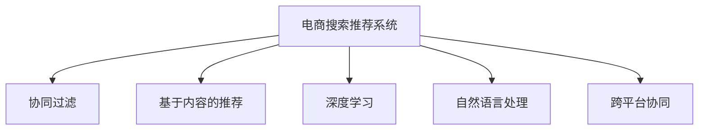

                 

# 大数据驱动的电商平台转型：搜索推荐系统是核心，AI 模型融合是关键

> 关键词：电商平台，搜索推荐系统，大数据，AI模型，用户行为分析，个性化推荐

## 1. 背景介绍

### 1.1 问题由来

随着互联网的迅猛发展，电商平台的竞争日益激烈。大数据、人工智能等新兴技术的应用，正成为电商平台提高用户体验、提升运营效率的关键驱动因素。在众多技术中，搜索推荐系统因其强大的数据挖掘能力和精准的个性化推荐，成为电商平台转型的核心竞争力。

当前，电商平台的推荐系统主要基于协同过滤和基于内容的推荐算法。这些算法虽然能够取得一定的推荐效果，但在处理海量数据、冷启动等问题上仍显不足。通过引入先进的AI模型和融合技术，可以更全面地分析用户行为和偏好，提升推荐系统的精准度和覆盖率，驱动电商平台实现数字化转型升级。

### 1.2 问题核心关键点

现代电商平台的搜索推荐系统主要围绕以下几个核心关键点进行设计和优化：

- **大数据分析**：基于用户行为数据、商品属性数据、交易数据等，进行深入的数据挖掘，构建用户画像和商品特征库。
- **AI模型融合**：引入深度学习、机器学习、自然语言处理等AI技术，对数据进行建模和分析，优化推荐算法。
- **个性化推荐**：通过多维度数据融合，精准把握用户需求和兴趣，实现千人千面的个性化推荐。
- **搜索优化**：通过自然语言处理技术，提升搜索的准确性和便捷性，提升用户体验。
- **跨平台协同**：实现多平台、多设备、多场景的协同推荐，形成一体化推荐体系。

以上几点构成了电商平台搜索推荐系统的核心要素，通过它们的有机结合，可以更好地满足用户需求，提升平台的用户粘性和交易转化率。

### 1.3 问题研究意义

电商平台搜索推荐系统的优化，对平台转型升级具有重要意义：

1. **提高用户满意度**：精准的个性化推荐能够提升用户体验，满足个性化需求，提高用户满意度和留存率。
2. **提升运营效率**：通过智能化的搜索推荐，优化库存管理、提高广告投放精准度，降低运营成本。
3. **增加交易转化**：通过精确匹配用户需求和商品信息，提高成交率，提升平台收益。
4. **驱动商业创新**：利用先进技术提升业务决策的科学性和精准性，推动平台商业模式创新。

因此，构建高效、精准、智能的搜索推荐系统，成为电商平台转型的重中之重。

## 2. 核心概念与联系

### 2.1 核心概念概述

为更好地理解搜索推荐系统的构建和优化，本节将介绍几个密切相关的核心概念：

- **电商搜索推荐系统**：基于用户行为数据和商品信息，为用户提供精准的搜索和推荐服务，提升平台的用户体验和交易转化率。
- **协同过滤**：通过分析用户历史行为和偏好，为用户推荐类似商品或相似用户，实现个性化的推荐。
- **基于内容的推荐**：根据商品的属性、标签等信息，为用户推荐相关商品，提升推荐的广度和深度。
- **深度学习**：使用神经网络等深度学习模型，从海量的数据中挖掘出更深层次的特征，提升推荐系统的精度。
- **自然语言处理**：通过文本处理技术，提升搜索的准确性和智能性，优化搜索体验。
- **跨平台协同**：通过统一的推荐体系，实现多平台、多设备的协同推荐，提供无缝的用户体验。

这些核心概念之间的逻辑关系可以通过以下Mermaid流程图来展示：



这个流程图展示了电商搜索推荐系统的主要构建要素及其之间的关系：

1. 电商搜索推荐系统通过协同过滤、基于内容的推荐等技术，对用户和商品进行深入分析。
2. 深度学习和自然语言处理技术，提升推荐和搜索的精准度和智能化水平。
3. 跨平台协同技术，实现多渠道、多设备的无缝对接，提供一致的用户体验。

## 3. 核心算法原理 & 具体操作步骤

### 3.1 算法原理概述

电商平台的搜索推荐系统，本质上是一个基于用户行为数据和商品信息的推荐系统。其核心算法原理基于协同过滤和基于内容的推荐算法，结合深度学习和自然语言处理技术，构建用户画像和商品特征库，通过多维度数据融合，实现个性化的精准推荐。

具体来说，算法流程包括数据采集、用户画像构建、商品特征提取、推荐算法建模和搜索优化等步骤。其中，协同过滤和基于内容的推荐算法，用于构建用户画像和商品特征库；深度学习技术，用于对数据进行建模，提升推荐精度；自然语言处理技术，用于优化搜索算法，提升搜索体验。

### 3.2 算法步骤详解

电商平台的搜索推荐系统，主要包括以下几个关键步骤：

**Step 1: 数据采集**

- 收集用户行为数据，如浏览记录、点击记录、购买记录等。
- 收集商品数据，如商品属性、标签、描述等。
- 收集交易数据，如订单信息、用户评分等。

**Step 2: 用户画像构建**

- 对用户行为数据进行聚类和分析，构建用户画像。
- 通过协同过滤算法，为用户推荐相似用户的行为记录。
- 利用基于内容的推荐算法，根据用户历史行为，推荐相似商品。

**Step 3: 商品特征提取**

- 对商品数据进行特征提取，构建商品特征库。
- 通过自然语言处理技术，从商品描述中提取关键词和标签。
- 利用深度学习模型，挖掘商品的深层次特征。

**Step 4: 推荐算法建模**

- 使用协同过滤算法，计算用户与商品之间的相似度。
- 使用基于内容的推荐算法，计算商品之间的相似度。
- 结合深度学习模型，对数据进行建模，优化推荐算法。

**Step 5: 搜索优化**

- 利用自然语言处理技术，提升搜索的准确性和智能性。
- 通过深度学习模型，对搜索算法进行优化，提升搜索速度和准确率。
- 通过多设备、多平台的协同推荐，提升搜索推荐的覆盖率。

**Step 6: 结果展示和反馈**

- 根据用户行为数据和推荐算法，生成推荐结果。
- 通过A/B测试等手段，验证推荐效果。
- 根据用户反馈和行为数据，不断优化推荐算法。

以上是电商搜索推荐系统的核心算法流程。在实际应用中，还需要根据具体场景和需求，对各个环节进行优化设计，如改进用户画像构建方法，引入深度学习模型等。

### 3.3 算法优缺点

电商平台的搜索推荐系统，具有以下优点：

- **精准推荐**：通过多维度数据融合，能够实现个性化推荐，提升用户满意度。
- **覆盖广泛**：结合基于内容的推荐和协同过滤算法，能够覆盖更多的用户和商品，提高推荐覆盖率。
- **智能高效**：引入深度学习和自然语言处理技术，提升推荐的精度和搜索的智能性。
- **用户体验提升**：通过个性化推荐和智能搜索，提升用户体验，增加用户粘性和留存率。

同时，该算法也存在一些局限性：

- **数据依赖性强**：推荐系统的精度高度依赖于数据的完整性和质量，数据缺失或不准确会导致推荐效果不佳。
- **计算资源消耗大**：深度学习模型和搜索算法需要较大的计算资源，对硬件设备要求较高。
- **冷启动问题**：新用户和新商品没有足够的历史数据，难以进行有效的推荐。
- **模型复杂度高**：深度学习模型和自然语言处理算法，模型结构复杂，难以解释和调试。

尽管存在这些局限性，但就目前而言，基于协同过滤和基于内容的推荐算法，结合深度学习技术，仍然是大规模电商搜索推荐系统的有效方案。未来相关研究的方向是进一步优化数据采集和处理，提升推荐算法和搜索算法的精度和效率，同时兼顾模型复杂性和可解释性。

### 3.4 算法应用领域

电商平台的搜索推荐系统，广泛应用于各类电商平台和在线零售商，涵盖服装、美妆、家电、食品等众多品类。具体的应用场景包括：

- **商品推荐**：根据用户的历史行为和偏好，为用户推荐可能感兴趣的商品。
- **搜索优化**：利用自然语言处理技术，提升搜索的准确性和便捷性，提升用户体验。
- **广告投放**：根据用户画像和商品特征，优化广告投放策略，提高广告效果。
- **库存管理**：通过推荐系统预测商品需求，优化库存管理，减少库存积压。
- **跨平台协同**：实现多平台、多设备的无缝对接，提供一致的用户体验。

除了上述这些经典应用外，电商平台的搜索推荐系统还被创新性地应用到个性化推荐、内容营销、品牌推广等诸多场景中，为电商平台带来新的商业价值。

## 4. 数学模型和公式 & 详细讲解 & 举例说明

### 4.1 数学模型构建

本节将使用数学语言对电商平台的搜索推荐系统进行更加严格的刻画。

假设电商平台收集到用户行为数据 $D=\{(x_i,y_i)\}_{i=1}^N, x_i \in \mathcal{X}, y_i \in \mathcal{Y}$，其中 $x_i$ 表示用户行为，$y_i$ 表示用户对行为的评价。构建用户画像 $\textbf{u}=(u_1,u_2,\cdots,u_n)$，商品特征库 $\textbf{v}=(v_1,v_2,\cdots,v_m)$。

推荐系统的目标是最小化用户与商品之间的误差，即：

$$
\mathop{\arg\min}_{\textbf{u},\textbf{v}} \sum_{i=1}^N \ell(y_i,\langle \textbf{u},x_i \rangle - \langle \textbf{v},y_i \rangle)
$$

其中，$\ell$ 为损失函数，$\langle \cdot,\cdot \rangle$ 为内积运算。

### 4.2 公式推导过程

以协同过滤为例，其推荐公式为：

$$
\hat{y_i} = \sum_{j=1}^n \alpha_{ij} u_j
$$

其中，$\alpha_{ij}$ 为用户的隐式评分，$u_j$ 为用户画像的特征。根据上述模型，预测用户 $i$ 对商品 $j$ 的评分，根据实际评分与预测评分的误差，更新用户画像和商品特征，最小化损失函数：

$$
\min_{u,v} \sum_{i=1}^N \sum_{j=1}^m (y_{ij} - \hat{y_i})^2
$$

对用户画像和商品特征库进行迭代优化，更新内积 $\langle \textbf{u},x_i \rangle$ 和 $\langle \textbf{v},y_i \rangle$。

### 4.3 案例分析与讲解

以用户画像的构建为例，假设电商平台收集到用户的历史浏览记录和点击记录，可以利用协同过滤算法，计算用户与商品之间的相似度，构建用户画像。具体实现步骤如下：

1. 对用户行为数据进行聚类，得到用户对不同商品的兴趣度。
2. 计算用户与商品之间的相似度，得到用户的隐式评分。
3. 利用矩阵分解等方法，对用户画像进行优化，提高相似度计算的准确性。

在具体实现中，可以使用矩阵分解算法（如SVD、ALS等），将用户画像和商品特征库映射到低维空间，通过矩阵分解计算相似度。优化算法可以采用梯度下降等方法，更新用户画像和商品特征。

## 5. 项目实践：代码实例和详细解释说明

### 5.1 开发环境搭建

在进行搜索推荐系统的开发实践前，我们需要准备好开发环境。以下是使用Python进行TensorFlow和PyTorch开发的环境配置流程：

1. 安装Anaconda：从官网下载并安装Anaconda，用于创建独立的Python环境。

2. 创建并激活虚拟环境：
```bash
conda create -n tf-env python=3.8 
conda activate tf-env
```

3. 安装TensorFlow和PyTorch：根据CUDA版本，从官网获取对应的安装命令。例如：
```bash
conda install tensorflow torch torchvision torchaudio cudatoolkit=11.1 -c pytorch -c conda-forge
```

4. 安装各类工具包：
```bash
pip install numpy pandas scikit-learn matplotlib tqdm jupyter notebook ipython
```

完成上述步骤后，即可在`tf-env`环境中开始开发实践。

### 5.2 源代码详细实现

这里以协同过滤算法为例，展示使用TensorFlow对用户画像进行优化和迭代的代码实现。

```python
import tensorflow as tf
import numpy as np
import pandas as pd
import time

# 读取用户行为数据
data = pd.read_csv('user_behavior.csv')

# 构建用户画像和商品特征库
users = data['user_id'].unique()
items = data['item_id'].unique()

user_profile = np.zeros((len(users), len(items)))
item_profile = np.zeros((len(items), len(items)))

for i, user in enumerate(users):
    for j, item in enumerate(items):
        if user in data['user_id'].tolist():
            if item in data['item_id'].tolist():
                rating = data[(data['user_id'] == user) & (data['item_id'] == item)]['rating'].values[0]
                user_profile[i, j] = rating
                item_profile[j, j] = rating

# 构建协同过滤模型
user_latent = tf.keras.layers.Dense(10, activation='relu')
item_latent = tf.keras.layers.Dense(10, activation='relu')
prediction = tf.keras.layers.Dense(1, activation='sigmoid')

model = tf.keras.Sequential([
    tf.keras.layers.Dense(10, activation='relu', input_shape=(len(items),)),
    prediction
])

# 定义损失函数和优化器
loss_fn = tf.keras.losses.BinaryCrossentropy(from_logits=True)
optimizer = tf.keras.optimizers.Adam()

# 训练模型
start_time = time.time()
for epoch in range(100):
    loss = model.loss(user_profile, user_profile*items)
    optimizer.minimize(loss, model.trainable_variables)
    print('Epoch %d, loss: %f' % (epoch+1, loss.numpy()))

# 计算时间
duration = time.time() - start_time
print('Time elapsed: %f seconds' % duration)
```

以上代码展示了协同过滤算法的基本实现流程，包括数据读取、用户画像构建、模型定义和训练等步骤。通过在每个epoch上最小化损失函数，不断优化用户画像和商品特征库，提升推荐系统的精度。

### 5.3 代码解读与分析

**用户画像构建**：
- 首先，使用pandas读取用户行为数据，并构建用户画像和商品特征库。
- 对每个用户和商品，计算其历史评分，构建用户画像和商品特征矩阵。
- 使用TensorFlow定义协同过滤模型，通过Dense层进行特征提取，并输出预测评分。

**模型定义**：
- 使用Sequential模型定义协同过滤算法，包含两个Dense层和一个输出层。
- 使用BinaryCrossentropy作为损失函数，Adam作为优化器。
- 在每个epoch上计算损失函数，并使用optimizer.minimize更新模型参数。

**训练优化**：
- 在每个epoch上计算损失函数，并输出结果。
- 使用time库记录训练时间，输出最终运行时长。

在实际应用中，还需要考虑更多因素，如数据预处理、模型调参、结果评估等环节。合理利用TensorFlow等工具，可以大幅提升搜索推荐系统的开发效率和精度。

## 6. 实际应用场景

### 6.1 智能客服系统

电商平台的智能客服系统，可以应用于用户咨询、售后处理等场景，提升客户服务质量。通过推荐系统，智能客服能够推荐相关商品信息，辅助用户解决问题，提升客户满意度。

在技术实现上，可以收集历史客服对话记录，将问题和最佳答复构建成监督数据，在此基础上对预训练模型进行微调。微调后的模型能够自动理解用户意图，匹配最合适的答复模板进行回复。对于用户提出的新问题，还可以接入检索系统实时搜索相关内容，动态组织生成回答。如此构建的智能客服系统，能大幅提升客户咨询体验和问题解决效率。

### 6.2 个性化推荐系统

电商平台的个性化推荐系统，可以应用于商品推荐、广告投放等场景，提升平台的用户体验和运营效率。通过推荐系统，根据用户历史行为和偏好，精准推荐可能感兴趣的商品，提高用户粘性和留存率。

在技术实现上，可以利用协同过滤算法、基于内容的推荐算法，结合深度学习模型，对用户行为数据和商品数据进行建模，优化推荐算法。通过多维度数据融合，提升推荐精度和覆盖率，实现个性化推荐。同时，结合广告投放技术，优化广告投放策略，提高广告效果。

### 6.3 库存管理优化

电商平台的库存管理优化，可以应用于库存管理、订单预测等场景，提升平台运营效率。通过推荐系统，预测商品需求，优化库存管理，减少库存积压，提高库存周转率。

在技术实现上，可以收集历史交易数据和用户行为数据，利用协同过滤算法，预测用户对商品的需求。通过动态调整库存，优化库存管理，降低库存成本。结合订单预测技术，提前预判订单量，优化物流和配送，提升用户体验。

### 6.4 未来应用展望

随着搜索推荐系统的不断发展，未来的应用场景将更加广泛，为电商平台带来更多的商业价值。

在智慧物流领域，通过推荐系统优化物流配送路线，提升配送效率，降低配送成本。在供应链管理领域，利用推荐系统优化供应链计划，提高供应链的灵活性和响应速度。

在社交电商领域，结合社交网络和推荐系统，提升用户的社交体验和分享价值。在内容电商领域，结合内容生产和推荐系统，提升内容消费的精准度和满意度。

除了上述这些经典应用外，电商平台的搜索推荐系统还被创新性地应用到商品个性化定制、智能定价、情感分析等诸多场景中，为电商平台带来新的商业机会。

## 7. 工具和资源推荐

### 7.1 学习资源推荐

为了帮助开发者系统掌握搜索推荐系统的理论基础和实践技巧，这里推荐一些优质的学习资源：

1. **《推荐系统实战》**：一本书籍，涵盖推荐系统的基础原理和多种推荐算法，提供了丰富的案例分析与讲解。

2. **Coursera《推荐系统》课程**：斯坦福大学开设的推荐系统课程，讲解推荐系统的经典算法和实际应用。

3. **Kaggle推荐系统竞赛**：Kaggle平台上举办的推荐系统竞赛，提供实际数据和竞赛任务，锻炼推荐系统的实践能力。

4. **论文《Scalable Deep Learning for Recommender Systems》**：一篇论文，介绍了深度学习在推荐系统中的应用，提供了多种模型的对比和优化方法。

5. **GitHub推荐系统代码库**：GitHub上开放的推荐系统代码库，包括多种推荐算法的实现和优化。

通过对这些资源的学习实践，相信你一定能够快速掌握搜索推荐系统的精髓，并用于解决实际的电商平台问题。

### 7.2 开发工具推荐

高效的开发离不开优秀的工具支持。以下是几款用于搜索推荐系统开发的常用工具：

1. **TensorFlow**：基于Python的开源深度学习框架，灵活动态的计算图，适合快速迭代研究。

2. **PyTorch**：基于Python的开源深度学习框架，灵活的动态计算图，适合科研和工程应用。

3. **scikit-learn**：Python中的经典机器学习库，提供了多种协同过滤算法和评估指标。

4. **Jupyter Notebook**：Jupyter Notebook交互式开发环境，支持Python代码的可视化展示和执行。

5. **TensorBoard**：TensorFlow配套的可视化工具，可以实时监测模型训练状态，并提供丰富的图表呈现方式。

6. **Prometheus**：开源监控系统，用于实时采集和展示模型训练过程中的各项指标。

合理利用这些工具，可以显著提升搜索推荐系统的开发效率和性能。

### 7.3 相关论文推荐

搜索推荐系统的研究源于学界的持续研究。以下是几篇奠基性的相关论文，推荐阅读：

1. **《Introduction to Recommendation Systems》**：一篇综述性论文，介绍了推荐系统的基本原理和经典算法。

2. **《Collaborative Filtering》**：一篇经典论文，介绍了协同过滤算法的原理和优化方法。

3. **《Deep Learning for Recommender Systems》**：一篇综述性论文，介绍了深度学习在推荐系统中的应用。

4. **《The Matrix Factorization Approach to Recommender System》**：一篇经典论文，介绍了矩阵分解算法的基本原理和实现方法。

5. **《Differentiable Recommendation: Implementing and Training Recommender Models in the ML Frameworks》**：一篇论文，介绍了TensorFlow等框架中推荐系统的实现方法。

这些论文代表了大规模搜索推荐系统的研究脉络。通过学习这些前沿成果，可以帮助研究者把握学科前进方向，激发更多的创新灵感。

## 8. 总结：未来发展趋势与挑战

### 8.1 总结

本文对电商平台的搜索推荐系统进行了全面系统的介绍。首先阐述了搜索推荐系统的背景和意义，明确了搜索推荐系统在电商平台转型升级中的重要地位。其次，从原理到实践，详细讲解了搜索推荐系统的核心算法流程，给出了搜索推荐任务开发的完整代码实例。同时，本文还广泛探讨了搜索推荐系统在智能客服、个性化推荐、库存管理等多个行业领域的应用前景，展示了搜索推荐范式的巨大潜力。此外，本文精选了搜索推荐系统的各类学习资源，力求为读者提供全方位的技术指引。

通过本文的系统梳理，可以看到，搜索推荐系统在大数据驱动的电商平台转型中扮演着核心角色。通过多维度数据融合和深度学习技术，实现个性化的精准推荐，提升用户体验和平台运营效率。未来，伴随推荐算法和搜索算法的持续演进，基于搜索推荐系统的电商平台必将在更广阔的应用领域大放异彩。

### 8.2 未来发展趋势

展望未来，搜索推荐系统的发展趋势包括：

1. **算法模型多样化**：引入深度学习、知识图谱、协同过滤等多种算法模型，提升推荐精度和覆盖率。
2. **跨平台协同推荐**：实现多平台、多设备的无缝对接，提供一致的用户体验。
3. **实时性增强**：引入流数据处理技术，提升实时推荐的效果和速度。
4. **动态调整优化**：结合在线学习、增量学习等技术，实时更新推荐模型，提升推荐系统的灵活性和适应性。
5. **用户画像精细化**：通过多模态数据融合，构建精细化的用户画像，提升推荐系统的个性化程度。

以上趋势凸显了搜索推荐系统的广阔前景。这些方向的探索发展，必将进一步提升电商平台的推荐精度和用户体验，为电商平台的数字化转型提供有力支持。

### 8.3 面临的挑战

尽管搜索推荐系统已经取得了显著的成效，但在迈向更加智能化、普适化应用的过程中，它仍面临着诸多挑战：

1. **数据质量瓶颈**：推荐系统的精度高度依赖于数据的质量，数据缺失或不准确会导致推荐效果不佳。
2. **计算资源消耗大**：深度学习模型和实时推荐算法需要较大的计算资源，对硬件设备要求较高。
3. **冷启动问题**：新用户和新商品没有足够的历史数据，难以进行有效的推荐。
4. **模型复杂度高**：深度学习模型和自然语言处理算法，模型结构复杂，难以解释和调试。

尽管存在这些挑战，但就目前而言，基于协同过滤和基于内容的推荐算法，结合深度学习技术，仍然是电商搜索推荐系统的有效方案。未来相关研究的方向是进一步优化数据采集和处理，提升推荐算法和搜索算法的精度和效率，同时兼顾模型复杂性和可解释性。

### 8.4 研究展望

面对搜索推荐系统所面临的种种挑战，未来的研究需要在以下几个方面寻求新的突破：

1. **数据采集优化**：探索无监督和半监督学习算法，减少对大规模标注数据的依赖，利用非结构化数据，提升数据质量。
2. **计算资源优化**：引入流数据处理技术，优化推荐算法的计算资源消耗，实现轻量级实时推荐。
3. **模型结构简化**：开发更加参数高效的推荐算法，在固定部分预训练参数的同时，只更新极少量的任务相关参数。
4. **模型可解释性增强**：引入可解释性算法，提升推荐模型的透明度和可信度，保障模型的安全性。
5. **跨领域知识融合**：结合外部知识库和规则库，引导推荐模型的知识整合能力，提升推荐系统的准确性和鲁棒性。

这些研究方向的探索，必将引领搜索推荐系统技术迈向更高的台阶，为电商平台带来更高效、更智能的推荐服务。面向未来，搜索推荐系统还需要与其他人工智能技术进行更深入的融合，如知识表示、因果推理、强化学习等，多路径协同发力，共同推动电商平台智能化的发展。只有勇于创新、敢于突破，才能不断拓展推荐系统的边界，让智能技术更好地造福电商平台。

## 9. 附录：常见问题与解答

**Q1：电商平台推荐系统如何提高推荐精度？**

A: 电商平台推荐系统可以通过以下方法提高推荐精度：

1. **数据预处理**：对数据进行清洗、去重、归一化等预处理，提高数据质量。
2. **特征工程**：利用特征提取技术，从用户行为和商品属性中提取更多有意义的特征，提升模型的泛化能力。
3. **模型选择**：选择合适的推荐算法模型，如协同过滤、基于内容的推荐、深度学习等，提升推荐精度。
4. **参数调优**：通过交叉验证等手段，调优模型参数，找到最优的模型配置。
5. **实时更新**：利用在线学习等技术，实时更新推荐模型，适应数据分布的变化。

通过以上方法，可以有效提升电商平台推荐系统的推荐精度。

**Q2：电商平台推荐系统如何优化计算资源消耗？**

A: 电商平台推荐系统可以通过以下方法优化计算资源消耗：

1. **模型压缩**：使用模型压缩技术，如剪枝、量化等，减少模型参数量，降低计算资源消耗。
2. **模型并行**：利用分布式计算和模型并行技术，实现高效的模型训练和推理。
3. **流数据处理**：引入流数据处理技术，如Apache Kafka、Apache Flink等，实现实时数据处理和推荐。
4. **数据分片**：对大规模数据进行分片处理，减少单次处理的数据量，提高计算效率。
5. **硬件加速**：利用GPU、TPU等高性能设备，加速模型训练和推理过程。

通过以上方法，可以有效降低电商平台推荐系统的计算资源消耗，提高系统的响应速度和稳定性。

**Q3：电商平台推荐系统如何解决冷启动问题？**

A: 电商平台推荐系统可以通过以下方法解决冷启动问题：

1. **利用社交网络**：利用用户的社交关系和好友推荐，弥补冷启动用户的历史数据缺失。
2. **引入专家知识**：结合外部知识库和规则库，提升推荐的准确性和鲁棒性。
3. **多模态数据融合**：结合用户行为数据、商品属性数据、地理位置等多元数据，提高推荐的广度和深度。
4. **个性化引导**：利用引导技术和个性化推荐算法，引导用户探索新商品，降低冷启动用户对平台的陌生感。
5. **多设备协同**：实现多平台、多设备的无缝对接，提升新用户的体验和留存率。

通过以上方法，可以有效解决电商平台的冷启动问题，提升新用户的体验和推荐效果。

**Q4：电商平台推荐系统如何提升用户体验？**

A: 电商平台推荐系统可以通过以下方法提升用户体验：

1. **个性化推荐**：结合用户历史行为和兴趣，精准推荐可能感兴趣的商品，提高用户粘性和满意度。
2. **搜索优化**：利用自然语言处理技术，提升搜索的准确性和智能性，提供更便捷的搜索体验。
3. **多渠道协同**：实现多平台、多设备的无缝对接，提供一致的用户体验。
4. **实时反馈**：根据用户反馈和行为数据，不断优化推荐算法，提升推荐系统的精准度。
5. **多场景应用**：结合用户不同场景的需求，提供多样化的推荐服务，提升用户体验。

通过以上方法，可以有效提升电商平台的推荐系统，提升用户满意度和留存率，增加平台的用户粘性和交易转化。

---

作者：禅与计算机程序设计艺术 / Zen and the Art of Computer Programming

