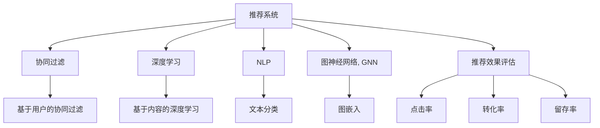

                 

# 大数据驱动的电商推荐系统：AI 模型融合技术在电商领域的应用

## 1. 背景介绍

### 1.1 问题由来
随着电子商务的迅猛发展，电商平台已成为用户获取商品信息、进行购物消费的主要渠道。为了提高用户体验和商家销售效率，推荐系统成为了电商平台的核心竞争力。推荐系统通过分析用户行为数据，智能推荐个性化商品，极大提升了电商平台的运营效果和用户满意度。

但传统的推荐系统，往往依赖于手工设计的特征工程和简单的协同过滤算法，难以适应复杂多样的用户需求和海量商品数据的挑战。大数据时代的到来，为推荐系统提供了全新的技术基础。随着深度学习、自然语言处理、图神经网络等AI技术的突破，基于AI的推荐系统逐渐成为新的发展趋势。

### 1.2 问题核心关键点
大数据驱动的AI推荐系统，其核心在于通过数据驱动、模型融合的方式，构建一个更加智能、精准、高效的推荐引擎。关键点包括：
- 数据挖掘与处理：从大规模电商数据中提取有价值的用户行为特征和商品属性信息。
- 模型选择与融合：选择合适的AI模型，融合多种算法，形成统一的推荐框架。
- 实时计算与优化：实现高效的实时计算和动态优化，满足用户即时需求。
- 推荐效果评估：通过点击率、转化率、留存率等指标评估推荐效果，持续优化模型。

本文将深入探讨大数据驱动的AI推荐系统在电商领域的应用，重点介绍AI模型融合技术，包括协同过滤、深度学习、自然语言处理、图神经网络等算法的融合方式，以期为电商平台的推荐系统建设提供技术参考。

## 2. 核心概念与联系

### 2.1 核心概念概述

为更好地理解AI模型融合在电商推荐系统中的应用，本节将介绍几个关键概念：

- 推荐系统(Recommendation System)：一种信息过滤系统，用于预测用户对商品的可能偏好，并据此推荐商品。推荐系统常应用于电商平台、内容平台、社交网络等场景。

- 协同过滤(Collaborative Filtering)：通过分析用户行为或商品间的相似性，推测用户可能感兴趣的商品。常分为基于用户的协同过滤和基于商品的协同过滤两种方式。

- 深度学习(Deep Learning)：一种基于多层神经网络的学习方法，可以自动提取数据特征，学习复杂模型。深度学习在图像、语音、自然语言处理等领域表现优异。

- 自然语言处理(Natural Language Processing, NLP)：研究如何让计算机理解、生成自然语言的技术。NLP在推荐系统中常用于解析用户评论、产品描述等信息。

- 图神经网络(Graph Neural Network, GNN)：一种专门处理图结构数据的深度学习方法，可以挖掘商品间的复杂关系，提升推荐效果。

这些概念之间的逻辑关系可以通过以下Mermaid流程图来展示：



这个流程图展示了一个电商推荐系统的核心组件及其之间的关系：

1. 推荐系统是核心，通过协同过滤、深度学习、NLP、GNN等算法构建推荐模型。
2. 协同过滤分为基于用户的和基于商品的两种方式，主要基于用户行为数据进行推荐。
3. 深度学习包括基于内容的推荐，常用文本分类等NLP技术挖掘商品属性。
4. NLP用于解析文本数据，提取情感、主题等语义信息。
5. 图神经网络通过分析商品间的复杂关系，进一步提升推荐效果。
6. 推荐效果通过点击率、转化率、留存率等指标评估，推动模型优化。

## 3. 核心算法原理 & 具体操作步骤

### 3.1 算法原理概述

AI推荐系统通常包括以下几个关键步骤：

1. **数据预处理**：清洗、合并、归一化电商数据，提取用户行为特征和商品属性信息。
2. **特征工程**：构建用户行为特征和商品属性特征，用于后续建模。
3. **模型选择与融合**：选择合适的AI模型，如协同过滤、深度学习、NLP、GNN等，通过融合多模型提升推荐效果。
4. **训练与评估**：使用历史数据训练模型，通过指标评估推荐效果，进行动态优化。
5. **推荐实施**：将训练好的模型应用于实时数据，生成个性化推荐。

### 3.2 算法步骤详解

**Step 1: 数据预处理**

- **数据清洗**：去除噪音、缺失、异常值，保证数据质量。
- **数据归一化**：将不同规模的数据归一化到[0,1]区间，避免某些特征对模型的过大影响。
- **特征提取**：从用户行为数据中提取用户ID、浏览历史、点击次数、购买记录等特征。
- **特征选择**：通过特征选择算法，如卡方检验、信息增益等，筛选对推荐效果有显著影响的高质量特征。

**Step 2: 特征工程**

- **用户特征**：基于用户行为数据，构建用户画像，如兴趣、年龄、性别、消费能力等。
- **商品特征**：提取商品属性信息，如价格、品牌、描述、评分等，用于商品匹配。
- **时间特征**：考虑时间因素，如季节、节假日、星期几等，加入时间特征，提升推荐的时效性。

**Step 3: 模型选择与融合**

- **协同过滤**：基于用户行为数据，推荐相似用户喜欢的商品。
- **深度学习**：使用深度神经网络模型，自动提取商品特征，进行分类或预测。
- **自然语言处理**：解析商品描述和用户评论，提取文本特征，用于情感分析或相似度计算。
- **图神经网络**：分析商品间的复杂关系，构建商品关系图，进行图嵌入或邻居采样。

**Step 4: 训练与评估**

- **模型训练**：使用历史数据，训练多个AI模型，得到初步推荐结果。
- **特征融合**：通过加权平均、线性混合等方式，融合多模型输出，提升推荐效果。
- **效果评估**：通过点击率、转化率、留存率等指标，评估推荐效果，进行动态优化。
- **模型更新**：根据新数据，持续更新模型参数，保证推荐模型的时效性和准确性。

**Step 5: 推荐实施**

- **实时计算**：使用流式计算框架，实时处理新数据，生成个性化推荐。
- **推荐展示**：将推荐结果展示给用户，如商品列表、商品详情页、搜索建议等。
- **反馈收集**：收集用户反馈数据，如点击、购买、评价等，用于模型优化。

### 3.3 算法优缺点

AI推荐系统融合多种算法，具有以下优点：
1. **提升推荐效果**：多模型融合能够利用不同算法的优势，全面覆盖用户需求和商品特征，提升推荐效果。
2. **增强泛化能力**：多模型融合能够处理复杂多样的用户行为和商品数据，提升模型的泛化能力。
3. **实现自动化**：AI推荐系统能够自动提取特征、训练模型、动态优化，减少人工干预。

但该方法也存在以下局限性：
1. **模型复杂性高**：多模型融合引入了更多参数，增加了模型复杂性，可能导致过拟合。
2. **训练成本高**：多模型训练需要更多计算资源和数据，可能导致训练时间较长。
3. **模型可解释性差**：多模型融合后的推荐模型，难以解释其决策过程，影响用户信任。
4. **数据依赖性强**：AI推荐系统高度依赖数据质量，数据偏差可能导致推荐结果偏差。

### 3.4 算法应用领域

AI推荐系统在电商领域有着广泛的应用，主要涵盖以下方面：

1. **商品推荐**：根据用户行为数据，推荐用户可能感兴趣的商品。
2. **内容推荐**：根据用户历史阅读数据，推荐用户可能喜欢的文章、视频、音乐等。
3. **个性化推荐**：根据用户画像，推荐个性化的商品、服务、营销活动等。
4. **跨品类推荐**：推荐与商品相关联的其他品类商品，增加用户消费粘性。
5. **新商品推荐**：推荐新产品或新上市商品，挖掘用户潜在需求。
6. **动态定价推荐**：根据市场供需，动态调整商品价格，提高销售收益。

## 4. 数学模型和公式 & 详细讲解  
### 4.1 数学模型构建

在AI推荐系统中，常用的数学模型包括协同过滤模型、深度神经网络、图嵌入模型等。以下分别介绍这些模型的数学模型构建。

### 4.2 公式推导过程

**协同过滤模型**

协同过滤模型基于用户行为数据，推荐相似用户喜欢的商品。其数学模型如下：

设用户集为 $U$，商品集为 $I$，用户行为矩阵为 $R$，其中 $R_{ui}=1$ 表示用户 $u$ 对商品 $i$ 有正向行为，$R_{ui}=0$ 表示没有行为。协同过滤模型可以表示为：

$$
\hat{R}_{ui} = \sum_{i' \in I} a_{iu}a_{iu'} \frac{\sum_{j \in U} R_{uj}R_{i'j}}{\sqrt{(\sum_{j \in U} R_{uj}^2)(\sum_{j \in U} R_{i'j}^2)}}
$$

其中 $a_{iu}$ 和 $a_{iu'}$ 分别表示用户 $u$ 对商品 $i$ 和 $i'$ 的评分，$\sqrt{(\sum_{j \in U} R_{uj}^2)(\sum_{j \in U} R_{i'j}^2)}$ 是归一化因子，用于规范化评分。

**深度神经网络模型**

深度神经网络模型用于自动提取商品特征，进行分类或预测。其数学模型如下：

设输入为 $x$，输出为 $y$，神经网络模型可以表示为：

$$
y = \sigma(Wx + b)
$$

其中 $W$ 为权重矩阵，$b$ 为偏置项，$\sigma$ 为激活函数，常用的激活函数包括 ReLU、Sigmoid、Tanh 等。

**图嵌入模型**

图嵌入模型用于分析商品间的复杂关系，构建商品关系图，进行图嵌入或邻居采样。其数学模型如下：

设商品集合为 $V$，商品间的关系集合为 $E$，图嵌入模型可以表示为：

$$
H = \min_{H \in R^{d \times |V|}} \frac{1}{2|E|} \sum_{(i,j) \in E} (H_i - H_j)^2
$$

其中 $H$ 为节点嵌入向量，$d$ 为向量维度，$|V|$ 为节点数量，$|E|$ 为边数量。

### 4.3 案例分析与讲解

以电商平台的商品推荐为例，介绍AI模型融合的实现步骤：

**Step 1: 数据预处理**

- **数据清洗**：去除无效数据、异常值，保证数据质量。
- **数据归一化**：将不同规模的数据归一化到[0,1]区间。
- **特征提取**：提取用户ID、浏览历史、点击次数、购买记录等特征。
- **特征选择**：通过卡方检验、信息增益等，筛选高质量特征。

**Step 2: 特征工程**

- **用户特征**：基于用户行为数据，构建用户画像。
- **商品特征**：提取商品属性信息，如价格、品牌、描述、评分等。
- **时间特征**：考虑时间因素，如季节、节假日、星期几等。

**Step 3: 模型选择与融合**

- **协同过滤**：基于用户行为数据，推荐相似用户喜欢的商品。
- **深度学习**：使用深度神经网络模型，自动提取商品特征，进行分类或预测。
- **自然语言处理**：解析商品描述和用户评论，提取文本特征，用于情感分析或相似度计算。
- **图神经网络**：分析商品间的复杂关系，构建商品关系图，进行图嵌入或邻居采样。

**Step 4: 训练与评估**

- **模型训练**：使用历史数据，训练多个AI模型，得到初步推荐结果。
- **特征融合**：通过加权平均、线性混合等方式，融合多模型输出，提升推荐效果。
- **效果评估**：通过点击率、转化率、留存率等指标，评估推荐效果，进行动态优化。
- **模型更新**：根据新数据，持续更新模型参数。

**Step 5: 推荐实施**

- **实时计算**：使用流式计算框架，实时处理新数据，生成个性化推荐。
- **推荐展示**：将推荐结果展示给用户，如商品列表、商品详情页、搜索建议等。
- **反馈收集**：收集用户反馈数据，如点击、购买、评价等，用于模型优化。

## 5. 项目实践：代码实例和详细解释说明

### 5.1 开发环境搭建

在进行AI推荐系统开发前，需要先准备好开发环境。以下是使用Python进行TensorFlow开发的环境配置流程：

1. 安装Anaconda：从官网下载并安装Anaconda，用于创建独立的Python环境。

2. 创建并激活虚拟环境：
```bash
conda create -n tf-env python=3.8 
conda activate tf-env
```

3. 安装TensorFlow：根据CUDA版本，从官网获取对应的安装命令。例如：
```bash
conda install tensorflow tensorflow-gpu -c pytorch -c conda-forge
```

4. 安装TensorBoard：用于可视化模型训练和推理结果。
```bash
pip install tensorboard
```

5. 安装其它工具包：
```bash
pip install pandas numpy scikit-learn matplotlib
```

完成上述步骤后，即可在`tf-env`环境中开始AI推荐系统开发。

### 5.2 源代码详细实现

下面以电商商品推荐系统为例，给出使用TensorFlow进行模型融合的PyTorch代码实现。

首先，定义数据处理函数：

```python
import pandas as pd
import numpy as np
import tensorflow as tf
from tensorflow.keras.layers import Input, Dense, Embedding, Concatenate, Dropout, Model
from tensorflow.keras.losses import MeanSquaredError
from tensorflow.keras.optimizers import Adam

# 定义数据加载函数
def load_data(file_path):
    data = pd.read_csv(file_path)
    user_ids = data['user_id'].values
    item_ids = data['item_id'].values
    rating_scores = data['rating_score'].values
    return user_ids, item_ids, rating_scores
```

然后，定义模型：

```python
# 定义用户嵌入层
user_input = Input(shape=(1,), name='user_input')
user_embedding = Embedding(input_dim=n_users, output_dim=64, name='user_embedding')(user_input)

# 定义商品嵌入层
item_input = Input(shape=(1,), name='item_input')
item_embedding = Embedding(input_dim=n_items, output_dim=64, name='item_embedding')(item_input)

# 定义深度学习模型
dnn_input = Concatenate()([user_embedding, item_embedding])
dnn_output = Dense(32, activation='relu')(dnn_input)
dnn_output = Dropout(0.2)(dnn_output)
dnn_output = Dense(1, activation='sigmoid')(dnn_output)

# 定义协同过滤模型
rating_input = Concatenate()([user_embedding, item_embedding])
rating_output = Dense(32, activation='relu')(rating_input)
rating_output = Dropout(0.2)(rating_output)
rating_output = Dense(1, activation='sigmoid')(rating_output)

# 定义模型融合层
fusion_output = Concatenate()([dnn_output, rating_output])
fusion_output = Dense(32, activation='relu')(fusion_output)
fusion_output = Dropout(0.2)(fusion_output)
fusion_output = Dense(1, activation='sigmoid')(fusion_output)

# 定义模型
model = Model(inputs=[user_input, item_input], outputs=fusion_output)

# 定义损失函数和优化器
loss = MeanSquaredError()
optimizer = Adam(lr=0.001)

# 编译模型
model.compile(loss=loss, optimizer=optimizer, metrics=['acc'])
```

接着，定义训练和评估函数：

```python
# 定义训练函数
def train(model, user_ids, item_ids, rating_scores, epochs=10, batch_size=64):
    model.fit([user_ids, item_ids], rating_scores, epochs=epochs, batch_size=batch_size, verbose=1)
```

最后，启动训练流程并在测试集上评估：

```python
# 加载数据
train_data_path = 'train.csv'
test_data_path = 'test.csv'

train_user_ids, train_item_ids, train_rating_scores = load_data(train_data_path)
test_user_ids, test_item_ids, test_rating_scores = load_data(test_data_path)

# 训练模型
train(model, train_user_ids, train_item_ids, train_rating_scores, epochs=10, batch_size=64)

# 在测试集上评估模型
test_loss, test_acc = model.evaluate([test_user_ids, test_item_ids], test_rating_scores)
print(f'Test Loss: {test_loss}, Test Accuracy: {test_acc}')
```

以上就是使用TensorFlow对电商商品推荐系统进行模型融合的完整代码实现。可以看到，得益于TensorFlow的强大封装，我们能够用相对简洁的代码实现多种AI模型的融合和训练。

### 5.3 代码解读与分析

让我们再详细解读一下关键代码的实现细节：

**定义数据处理函数**：
- `load_data`函数：读取电商数据文件，提取用户ID、商品ID、评分等关键特征。

**定义模型**：
- **用户嵌入层**：使用Embedding层将用户ID映射到低维空间。
- **商品嵌入层**：使用Embedding层将商品ID映射到低维空间。
- **深度学习模型**：使用Dense层和激活函数构建深度神经网络。
- **协同过滤模型**：使用Dense层和激活函数构建协同过滤模型。
- **模型融合层**：将深度学习模型和协同过滤模型的输出拼接，构建最终融合模型。

**定义损失函数和优化器**：
- **损失函数**：使用均方误差作为损失函数，用于衡量预测评分与真实评分之间的差异。
- **优化器**：使用Adam优化器进行模型训练，学习率设为0.001。

**训练函数**：
- **训练模型**：使用历史数据训练模型，设定训练轮数和批次大小，并输出训练过程中的日志信息。

**启动训练流程**：
- **加载数据**：分别加载训练数据和测试数据。
- **训练模型**：在训练数据上训练模型，设定训练轮数为10，批次大小为64。
- **评估模型**：在测试数据上评估模型性能，输出测试损失和准确率。

## 6. 实际应用场景

### 6.1 智能客服系统

基于AI推荐系统的智能客服系统，可以大大提升客服工作效率和用户满意度。传统的客服系统往往需要大量人力，高峰期响应缓慢，且一致性和专业性难以保证。而使用AI推荐系统构建的智能客服，能够24小时不间断服务，快速响应用户咨询，用自然流畅的语言解答各类常见问题。

在技术实现上，可以收集企业内部的历史客服对话记录，将问题和最佳答复构建成监督数据，在此基础上对预训练推荐模型进行微调。微调后的推荐模型能够自动理解用户意图，匹配最合适的答案模板进行回复。对于客户提出的新问题，还可以接入检索系统实时搜索相关内容，动态组织生成回答。如此构建的智能客服系统，能大幅提升客户咨询体验和问题解决效率。

### 6.2 金融舆情监测

金融机构需要实时监测市场舆论动向，以便及时应对负面信息传播，规避金融风险。传统的人工监测方式成本高、效率低，难以应对网络时代海量信息爆发的挑战。基于AI推荐系统的文本分类和情感分析技术，为金融舆情监测提供了新的解决方案。

具体而言，可以收集金融领域相关的新闻、报道、评论等文本数据，并对其进行主题标注和情感标注。在此基础上对预训练推荐模型进行微调，使其能够自动判断文本属于何种主题，情感倾向是正面、中性还是负面。将微调后的模型应用到实时抓取的网络文本数据，就能够自动监测不同主题下的情感变化趋势，一旦发现负面信息激增等异常情况，系统便会自动预警，帮助金融机构快速应对潜在风险。

### 6.3 个性化推荐系统

当前的推荐系统往往只依赖用户的历史行为数据进行物品推荐，无法深入理解用户的真实兴趣偏好。基于AI推荐系统的个性化推荐系统可以更好地挖掘用户行为背后的语义信息，从而提供更精准、多样的推荐内容。

在实践中，可以收集用户浏览、点击、评论、分享等行为数据，提取和用户交互的物品标题、描述、标签等文本内容。将文本内容作为模型输入，用户的后续行为（如是否点击、购买等）作为监督信号，在此基础上微调预训练推荐模型。微调后的推荐模型能够从文本内容中准确把握用户的兴趣点。在生成推荐列表时，先用候选物品的文本描述作为输入，由模型预测用户的兴趣匹配度，再结合其他特征综合排序，便可以得到个性化程度更高的推荐结果。

### 6.4 未来应用展望

随着AI推荐系统和大数据技术的不断发展，基于推荐系统的应用领域将更加广泛。

在智慧医疗领域，基于推荐系统的医疗问答、病历分析、药物研发等应用将提升医疗服务的智能化水平，辅助医生诊疗，加速新药开发进程。

在智能教育领域，推荐系统可应用于作业批改、学情分析、知识推荐等方面，因材施教，促进教育公平，提高教学质量。

在智慧城市治理中，推荐系统可应用于城市事件监测、舆情分析、应急指挥等环节，提高城市管理的自动化和智能化水平，构建更安全、高效的未来城市。

此外，在企业生产、社会治理、文娱传媒等众多领域，基于推荐系统的AI应用也将不断涌现，为传统行业带来变革性影响。相信随着技术的日益成熟，推荐系统必将在更广阔的应用领域大放异彩，深刻影响人类的生产生活方式。

## 7. 工具和资源推荐

### 7.1 学习资源推荐

为了帮助开发者系统掌握AI推荐系统的理论基础和实践技巧，这里推荐一些优质的学习资源：

1. 《深度学习入门》系列博文：深入浅出地介绍了深度学习的基本概念和常用算法，适合初学者。

2. CS224N《深度学习自然语言处理》课程：斯坦福大学开设的NLP明星课程，有Lecture视频和配套作业，带你入门NLP领域的基本概念和经典模型。

3. 《自然语言处理与深度学习》书籍：系统介绍了自然语言处理和深度学习的理论和应用，适合进阶学习。

4. 《推荐系统实战》书籍：详细介绍了推荐系统的原理、算法和实现，提供大量的代码实例，适合实战练习。

5. Kaggle竞赛平台：提供丰富的推荐系统竞赛数据集和案例，供开发者练习和挑战。

通过对这些资源的学习实践，相信你一定能够快速掌握AI推荐系统的精髓，并用于解决实际的推荐问题。

### 7.2 开发工具推荐

高效的开发离不开优秀的工具支持。以下是几款用于AI推荐系统开发的常用工具：

1. TensorFlow：由Google主导开发的开源深度学习框架，生产部署方便，适合大规模工程应用。

2. PyTorch：基于Python的开源深度学习框架，灵活动态的计算图，适合快速迭代研究。

3. Jupyter Notebook：开源的交互式计算环境，支持代码编写、执行和实时展示结果，方便调试和共享。

4. Weights & Biases：模型训练的实验跟踪工具，可以记录和可视化模型训练过程中的各项指标，方便对比和调优。

5. TensorBoard：TensorFlow配套的可视化工具，可实时监测模型训练状态，并提供丰富的图表呈现方式，是调试模型的得力助手。

6. Scikit-learn：开源的机器学习库，提供了丰富的数据预处理和模型评估工具，适合进行特征工程和模型优化。

合理利用这些工具，可以显著提升AI推荐系统的开发效率，加快创新迭代的步伐。

### 7.3 相关论文推荐

AI推荐系统和大数据驱动技术的研究源于学界的持续研究。以下是几篇奠基性的相关论文，推荐阅读：

1. The BellKor Algorithm for Learning to Rank：介绍了一种类库学习算法，用于推荐系统中的排序任务。

2. Deep Rank: Object-Ranking and Scaling-Up to Billion-Scale Recommendations：提出了一种基于深度神经网络的推荐系统，可以处理大规模推荐任务。

3. Neural Collaborative Filtering：介绍了一种基于神经网络的协同过滤推荐模型。

4. Attention Is All You Need：提出了Transformer模型，开创了自然语言处理和推荐系统的注意力机制。

5. Graph Neural Network for Recommendation Systems：介绍了基于图神经网络的推荐系统，可以处理复杂的关系数据。

这些论文代表了大数据驱动的AI推荐系统的发展脉络。通过学习这些前沿成果，可以帮助研究者把握学科前进方向，激发更多的创新灵感。

## 8. 总结：未来发展趋势与挑战

### 8.1 总结

本文对基于AI推荐系统的电商推荐系统进行了全面系统的介绍。首先阐述了AI推荐系统的研究背景和意义，明确了推荐系统在电商领域的重要价值。其次，从原理到实践，详细讲解了AI推荐系统的核心算法和关键步骤，给出了AI推荐系统开发的完整代码实例。同时，本文还广泛探讨了AI推荐系统在智能客服、金融舆情、个性化推荐等多个领域的应用前景，展示了AI推荐系统在电商领域的强大潜力。

通过本文的系统梳理，可以看到，基于AI推荐系统的电商推荐系统，正在成为电商平台的必备功能。AI推荐系统能够自动推荐个性化商品，提升用户购物体验和商家销售效率。AI推荐系统融合了协同过滤、深度学习、自然语言处理、图神经网络等算法，全面覆盖用户需求和商品特征，提升推荐效果。未来，伴随推荐系统和大数据技术的不断发展，推荐系统必将在更广泛的领域中发挥重要作用，深刻影响人类的生产生活方式。

### 8.2 未来发展趋势

展望未来，AI推荐系统的应用将呈现以下几个发展趋势：

1. 推荐模型更加智能：推荐模型将能够处理更多数据源，融合更多用户行为和商品特征，提升推荐效果。

2. 推荐场景更加多样化：推荐系统将应用于更多场景，如医疗、教育、金融等领域，提升这些领域的智能化水平。

3. 推荐实时化：推荐系统将能够实时处理新数据，动态更新推荐结果，提高推荐的时效性。

4. 推荐泛化能力更强：推荐模型将能够处理更多复杂关系，适应不同用户和商品数据分布，提升模型的泛化能力。

5. 推荐个性化更高：推荐系统将能够更好地理解用户需求和行为，提供更加个性化和多样化的推荐。

6. 推荐系统更加可信：推荐模型将能够解释推荐结果的逻辑和依据，提升用户对系统的信任度。

以上趋势凸显了AI推荐系统的广阔前景。这些方向的探索发展，必将进一步提升推荐系统的性能和应用范围，为电商平台的运营带来更大的价值。

### 8.3 面临的挑战

尽管AI推荐系统在电商领域取得了显著成效，但在迈向更加智能化、普适化应用的过程中，它仍面临着诸多挑战：

1. 数据质量问题：推荐系统高度依赖数据质量，数据偏差可能导致推荐结果偏差。如何保证数据质量，消除数据偏差，是一个重要的挑战。

2. 模型复杂性高：推荐模型引入了更多参数，增加了模型复杂性，可能导致过拟合。如何优化模型结构，提高模型的泛化能力，是一个重要的研究方向。

3. 计算资源需求大：推荐系统需要大量的计算资源，如何在保证推荐效果的同时，降低计算资源消耗，是一个重要的挑战。

4. 用户隐私保护：推荐系统涉及大量用户行为数据，如何保护用户隐私，防止数据泄露，是一个重要的课题。

5. 系统可解释性差：推荐系统通常被视为"黑盒"模型，难以解释其决策过程，影响用户信任。如何提高系统的可解释性，是一个重要的研究方向。

6. 推荐效果评估难度大：推荐系统的效果评估难以量化，如何设计更科学的评估指标，是一个重要的挑战。

面对这些挑战，未来的研究需要在数据质量、模型结构、计算资源、隐私保护、可解释性等方面进行持续优化，才能实现AI推荐系统的高效、智能、可信的推荐效果。

### 8.4 研究展望

未来，AI推荐系统将在大数据和AI技术的驱动下，不断发展演进，变得更加智能和高效。AI推荐系统将通过深度学习、自然语言处理、图神经网络等多种技术融合，构建更加全面、精准、个性化的推荐模型。同时，AI推荐系统将更加注重隐私保护和可解释性，提升系统的可靠性和用户信任度。伴随技术的不断进步，AI推荐系统必将在电商领域乃至更多领域发挥更大的作用，推动人类社会的智能化发展。

## 9. 附录：常见问题与解答

**Q1：如何构建高质量的电商推荐系统？**

A: 构建高质量的电商推荐系统，需要从以下几个方面进行优化：
1. **数据质量**：清洗、合并、归一化电商数据，提取有价值的用户行为特征和商品属性信息。
2. **特征工程**：构建用户画像，提取商品属性，考虑时间因素，提升特征质量。
3. **模型选择与融合**：选择合适的AI模型，如协同过滤、深度学习、NLP、GNN等，通过融合多模型提升推荐效果。
4. **训练与评估**：使用历史数据训练模型，通过点击率、转化率、留存率等指标评估推荐效果，进行动态优化。
5. **实时计算与优化**：使用流式计算框架，实时处理新数据，动态更新推荐结果。

**Q2：AI推荐系统如何处理长尾需求？**

A: 长尾需求指用户对冷门商品的购买需求，长尾需求的处理是电商推荐系统的一个难点。以下是几种处理长尾需求的方法：
1. **数据增强**：通过数据增强技术，扩充长尾商品的特征信息，提高长尾商品的推荐效果。
2. **多臂赌博机算法**：通过多臂赌博机算法，平衡热门商品和冷门商品的推荐，提升长尾商品的曝光率。
3. **用户兴趣转移**：通过分析用户历史行为，推荐相关长尾商品，激发用户对冷门商品的兴趣。
4. **个性化推荐**：通过个性化推荐算法，精准匹配长尾商品和用户需求，提升长尾商品的转化率。

**Q3：如何提高推荐系统的实时性？**

A: 推荐系统的实时性可以通过以下几个方面进行优化：
1. **流式计算**：使用流式计算框架，实时处理新数据，动态更新推荐结果。
2. **缓存技术**：使用缓存技术，减少数据读取和处理时间，提升推荐速度。
3. **模型压缩**：使用模型压缩技术，减小模型体积，加快推理速度。
4. **负载均衡**：使用负载均衡技术，均衡服务器负载，提升系统响应速度。

**Q4：推荐系统如何应对多品类推荐需求？**

A: 多品类推荐是电商推荐系统的核心需求之一，可以通过以下几种方法进行优化：
1. **商品关联分析**：通过商品关联分析，挖掘商品间的相关关系，提升跨品类推荐效果。
2. **用户兴趣转移**：通过分析用户历史行为，推荐相关品类商品，提升用户购物体验。
3. **个性化推荐**：通过个性化推荐算法，精准匹配用户需求和品类商品，提升推荐效果。
4. **商品标签提取**：通过提取商品标签，构建商品标签图，进行标签推荐。

这些技术措施可以提升电商推荐系统的实时性、准确性和个性化水平，满足多品类推荐的需求。

**Q5：如何优化推荐系统的可解释性？**

A: 推荐系统的可解释性可以通过以下几个方面进行优化：
1. **模型简化**：通过简化模型结构，降低模型的复杂度，提高可解释性。
2. **特征可解释**：通过可视化特征重要性，解释特征对推荐结果的影响。
3. **解释模型输出**：通过解释模型输出的依据，增强用户对系统的信任度。
4. **用户反馈**：通过用户反馈数据，优化推荐结果，增强可解释性。

通过这些优化措施，可以提升推荐系统的可解释性，增强用户对系统的信任度和满意度。

---

作者：禅与计算机程序设计艺术 / Zen and the Art of Computer Programming

