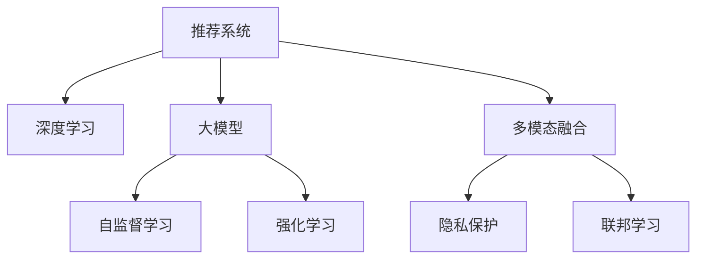

                 

# 大模型: 推荐系统的未来趋势

> 关键词：大模型,推荐系统,未来趋势,深度学习,强化学习,自监督学习,多模态融合,隐私保护,联邦学习

## 1. 背景介绍

推荐系统(Recommendation Systems)作为现代信息技术的核心，广泛应用于电商、社交、视频等众多领域，极大地提升了用户体验和运营效率。随着数据规模的不断扩大和用户需求的多样化，传统的基于协同过滤的推荐方法逐渐暴露出难以克服的缺陷，如冷启动问题、稀疏性问题、可扩展性问题等。为了应对这些挑战，深度学习在大规模推荐系统中的应用逐渐增多。特别是近年来，大模型技术在推荐领域的应用取得了显著进展，形成了推荐系统的新范式。

## 2. 核心概念与联系

### 2.1 核心概念概述

为更好地理解大模型在推荐系统中的应用，本节将介绍几个密切相关的核心概念：

- 推荐系统(Recommendation System)：通过分析用户的历史行为数据，预测其可能感兴趣的内容或服务，并推荐给用户的技术系统。推荐系统主要包括基于协同过滤的推荐和基于内容推荐的系统。

- 深度学习(Deep Learning)：以深度神经网络为代表的机器学习范式，能够高效处理非线性复杂数据，广泛应用于图像识别、语音识别、自然语言处理等领域。深度学习为推荐系统提供了强大的数据建模能力。

- 大模型(Large Model)：通过大规模数据训练得到的庞大神经网络模型，包含数十亿个参数，能够学习复杂的语言模型和表示。代表模型包括BERT、GPT、Transformer等。

- 自监督学习(Self-Supervised Learning)：一种无需人工标注数据的学习范式，通过在原始数据上设计伪标签，如掩码语言模型(Masked Language Modeling, MLM)、next sentence prediction等，让模型自主学习语言的特征。自监督学习为大模型提供了高效的预训练方法。

- 强化学习(Reinforcement Learning, RL)：通过与环境交互，模型在不断试错中学习最优策略，应用广泛，如AlphaGo、AlphaStar等。

- 多模态融合(Multimodal Fusion)：将视觉、音频、文本等不同模态的信息进行整合，提升模型的理解能力和推荐效果。

- 隐私保护(Privacy Preservation)：在推荐过程中，保护用户隐私，避免数据泄露和滥用。

- 联邦学习(Federated Learning)：在分布式环境中，通过多个设备端协同学习，既能保证数据隐私，又能充分利用边缘计算资源。

这些核心概念之间的逻辑关系可以通过以下Mermaid流程图来展示：



这个流程图展示了大模型在推荐系统中的应用框架，各个概念通过模型进行有机整合，共同驱动推荐系统的前进。

## 3. 核心算法原理 & 具体操作步骤
### 3.1 算法原理概述

基于深度学习的大模型在推荐系统中的应用，主要通过以下步骤：

1. **数据预处理**：将原始数据进行清洗、归一化等预处理，转化为模型可以处理的格式。
2. **特征提取**：使用预训练的大模型进行特征提取，获取丰富的语义表示。
3. **任务建模**：根据推荐任务的特点，设计合适的损失函数和优化目标。
4. **模型训练**：在标注数据集上进行监督学习或自监督学习，优化模型参数。
5. **推荐策略设计**：将训练好的模型应用于实际推荐任务，设计推荐策略。

深度学习模型的推荐过程可以大致分为三个阶段：模型训练、特征提取和推荐策略设计。其中，模型训练和特征提取是大模型在推荐系统中的核心应用。

### 3.2 算法步骤详解

**步骤 1: 数据预处理**

数据预处理是推荐系统的第一步，其目标是提高数据的输入质量，为模型的训练和推理提供良好的数据支持。具体步骤如下：

1. **数据清洗**：去除噪声数据、重复数据等无用信息，确保数据质量。
2. **特征归一化**：将数据进行归一化处理，如标准化、Min-Max归一化等，保证不同特征的输入值在相同量级上。
3. **缺失值处理**：处理数据中的缺失值，可以使用均值填充、中位数填充等方法。
4. **数据划分**：将数据划分为训练集、验证集和测试集，用于模型的训练、调参和性能评估。

**步骤 2: 特征提取**

特征提取是利用大模型将原始数据转换为模型的输入。具体步骤如下：

1. **选择合适的预训练模型**：根据推荐任务的特点，选择合适的大模型，如BERT、GPT等。
2. **数据编码**：将原始数据（文本、图像等）编码为模型可接受的格式。
3. **特征映射**：使用大模型将编码后的数据映射为特征表示，生成高维稠密向量。

**步骤 3: 模型训练**

模型训练是利用标注数据对大模型进行训练的过程。具体步骤如下：

1. **选择合适的损失函数**：根据推荐任务的特点，选择合适的损失函数，如均方误差、交叉熵等。
2. **设定优化算法和超参数**：如AdamW、SGD等优化算法，学习率、批大小等超参数的设置。
3. **模型训练**：在标注数据集上进行监督学习或自监督学习，优化模型参数。
4. **模型评估**：在验证集上评估模型性能，调整模型参数，避免过拟合。
5. **模型保存**：保存训练好的模型，用于后续的特征提取和推荐策略设计。

**步骤 4: 推荐策略设计**

推荐策略设计是利用训练好的模型进行实际推荐的过程。具体步骤如下：

1. **设计推荐算法**：根据推荐任务的特点，选择合适的推荐算法，如基于内容的推荐、协同过滤推荐等。
2. **融合多模态信息**：将视觉、音频、文本等不同模态的信息进行整合，提升推荐效果。
3. **加入个性化元素**：根据用户的历史行为数据，调整推荐策略，实现个性化推荐。
4. **保护用户隐私**：在推荐过程中，保护用户隐私，避免数据泄露和滥用。
5. **推荐系统部署**：将训练好的模型部署到生产环境中，实时提供推荐服务。

### 3.3 算法优缺点

基于深度学习的大模型在推荐系统中的应用具有以下优点：

1. **高效性**：大模型能够自动学习丰富的语义表示，避免手工特征工程，提高特征提取效率。
2. **泛化性**：大模型通常在大规模数据上预训练，具有较强的泛化能力，能够适应多种推荐场景。
3. **可解释性**：大模型可以生成可解释的特征表示，有助于理解推荐过程和改进推荐策略。
4. **自适应性**：大模型在动态数据上表现良好，能够适应数据分布的变化，提高推荐效果。

同时，大模型在推荐系统中的应用也存在一些缺点：

1. **计算资源消耗大**：大模型通常具有大量参数，训练和推理的计算资源消耗较大。
2. **存储开销高**：大模型需要存储大量的模型参数和中间变量，对存储资源的要求较高。
3. **可解释性不足**：大模型的决策过程较为复杂，难以解释和调试，可能存在“黑盒”问题。
4. **鲁棒性差**：大模型在处理噪声数据和异常数据时，可能出现鲁棒性不足的问题，影响推荐效果。

### 3.4 算法应用领域

基于深度学习的大模型在推荐系统中的应用，已经在电商、社交、视频等领域取得了显著的成效。以下是一些典型应用：

- **电商推荐**：基于用户浏览历史、点击记录等数据，推荐用户可能感兴趣的商品。
- **视频推荐**：根据用户观看历史和评分，推荐用户可能喜欢的视频内容。
- **社交推荐**：根据用户的社交网络和行为数据，推荐可能感兴趣的朋友或内容。
- **个性化推荐**：根据用户的个性化需求，推荐定制化的服务和内容。
- **实时推荐**：根据实时数据，动态调整推荐策略，提供个性化推荐服务。

## 4. 数学模型和公式 & 详细讲解 & 举例说明

### 4.1 数学模型构建

本节将使用数学语言对基于深度学习的大模型在推荐系统中的应用进行更加严格的刻画。

假设推荐系统为用户 $u$ 推荐物品 $i$，预测值为 $p(u, i)$，真实标签为 $y_{u,i} \in \{0,1\}$，表示用户是否对物品感兴趣。定义损失函数 $\ell(p(u, i), y_{u,i})$，则在数据集 $D$ 上的经验风险为：

$$
\mathcal{L} = \frac{1}{N}\sum_{u,i} \ell(p(u, i), y_{u,i})
$$

其中，损失函数可以有多种形式，如均方误差、交叉熵等。

### 4.2 公式推导过程

以下以交叉熵损失函数为例，推导大模型在推荐系统中的应用。

假设模型 $M_{\theta}$ 在输入 $x$ 上的输出为 $\hat{y}=M_{\theta}(x) \in [0,1]$，表示模型预测的概率。真实标签 $y \in \{0,1\}$。则交叉熵损失函数定义为：

$$
\ell(p(u, i), y_{u,i}) = -[y_{u,i}\log p(u, i)+(1-y_{u,i})\log (1-p(u, i))]
$$

将其代入经验风险公式，得：

$$
\mathcal{L} = -\frac{1}{N}\sum_{u,i} [y_{u,i}\log p(u, i)+(1-y_{u,i})\log(1-p(u, i))]
$$

根据链式法则，损失函数对参数 $\theta_k$ 的梯度为：

$$
\frac{\partial \mathcal{L}}{\partial \theta_k} = -\frac{1}{N}\sum_{u,i} (\frac{y_{u,i}}{p(u, i)}-\frac{1-y_{u,i}}{1-p(u, i)}) \frac{\partial p(u, i)}{\partial \theta_k}
$$

其中 $\frac{\partial p(u, i)}{\partial \theta_k}$ 可以进一步递归展开，利用自动微分技术完成计算。

### 4.3 案例分析与讲解

**案例 1: 电商推荐**

电商推荐系统通常需要处理大规模的日志数据，包括用户的浏览记录、点击记录、购买记录等。这些数据可以用于训练大模型，进行物品推荐。

1. **数据预处理**：对原始数据进行清洗和归一化，去除噪声和重复数据，确保数据质量。
2. **特征提取**：使用BERT等预训练模型对用户行为数据进行编码，生成高维稠密向量。
3. **模型训练**：在标注数据集上进行监督学习，优化模型参数。
4. **推荐策略设计**：根据用户的历史行为数据，设计推荐算法，实现个性化推荐。

**案例 2: 视频推荐**

视频推荐系统需要处理用户对视频的观看历史和评分数据，推荐用户可能感兴趣的视频内容。

1. **数据预处理**：对视频数据和用户评分数据进行清洗和归一化。
2. **特征提取**：使用GPT等预训练模型对视频内容和用户评分进行编码。
3. **模型训练**：在标注数据集上进行监督学习，优化模型参数。
4. **推荐策略设计**：根据用户的历史评分和观看记录，设计推荐算法，实现个性化推荐。

## 5. 项目实践：代码实例和详细解释说明

### 5.1 开发环境搭建

在进行推荐系统开发前，我们需要准备好开发环境。以下是使用Python进行TensorFlow开发的环境配置流程：

1. 安装Anaconda：从官网下载并安装Anaconda，用于创建独立的Python环境。

2. 创建并激活虚拟环境：
```bash
conda create -n tf-env python=3.8 
conda activate tf-env
```

3. 安装TensorFlow：根据CUDA版本，从官网获取对应的安装命令。例如：
```bash
conda install tensorflow==2.8 -c conda-forge
```

4. 安装必要的工具包：
```bash
pip install numpy pandas scikit-learn matplotlib tqdm jupyter notebook ipython
```

完成上述步骤后，即可在`tf-env`环境中开始推荐系统开发。

### 5.2 源代码详细实现

这里我们以电商推荐系统为例，给出使用TensorFlow和Keras进行电商推荐系统开发的PyTorch代码实现。

首先，定义电商推荐任务的数据处理函数：

```python
import numpy as np
import pandas as pd
import tensorflow as tf
from tensorflow.keras import layers, models, callbacks

def data_preprocess(df):
    # 数据清洗和归一化
    df = df.dropna()
    df = df.drop_duplicates()
    df = df.drop(['id', 'item_id', 'timestamp'], axis=1)
    df = pd.get_dummies(df, columns=['category', 'brand', 'price_level'])
    df['price_level'] = (df['price_level'] - df['price_level'].min()) / (df['price_level'].max() - df['price_level'].min())
    df = df.drop(['user_id', 'item_id'], axis=1)
    return df

def create_dataset(df, batch_size):
    # 划分训练集和验证集
    train_size = int(len(df) * 0.8)
    train_df = df[:train_size]
    dev_df = df[train_size:]
    # 编码输入和输出
    train_X, train_y = train_df.drop(['price', 'category'], axis=1).values, train_df['price'].values
    dev_X, dev_y = dev_df.drop(['price', 'category'], axis=1).values, dev_df['price'].values
    # 生成训练集和验证集
    train_dataset = tf.data.Dataset.from_tensor_slices((train_X, train_y)).shuffle(10000).batch(batch_size)
    dev_dataset = tf.data.Dataset.from_tensor_slices((dev_X, dev_y)).batch(batch_size)
    return train_dataset, dev_dataset

# 读取数据集
df = pd.read_csv('data.csv')
df = data_preprocess(df)
train_dataset, dev_dataset = create_dataset(df, batch_size=32)
```

然后，定义模型和优化器：

```python
from tensorflow.keras.layers import Input, Dense, Dropout
from tensorflow.keras.models import Model

# 定义输入和输出
input_layer = Input(shape=(num_features, ), name='input')
output_layer = Dense(1, activation='sigmoid', name='output')(input_layer)
model = Model(input_layer, output_layer)

# 定义优化器
optimizer = tf.keras.optimizers.Adam(learning_rate=0.001)

# 定义损失函数
loss_fn = tf.keras.losses.BinaryCrossentropy()

# 定义评估指标
metrics = [tf.keras.metrics.AUC(name='auc')]
```

接着，定义训练和评估函数：

```python
# 训练函数
def train_model(model, train_dataset, dev_dataset, batch_size, num_epochs, optimizer, loss_fn, metrics):
    # 定义 callbacks
    early_stopping = callbacks.EarlyStopping(patience=5, restore_best_weights=True)
    # 定义模型编译
    model.compile(optimizer=optimizer, loss=loss_fn, metrics=metrics)
    # 定义训练过程
    history = model.fit(train_dataset, epochs=num_epochs, validation_data=dev_dataset, callbacks=[early_stopping])
    # 输出训练结果
    print('Train loss:', history.history['loss'][-1])
    print('Validation loss:', history.history['val_loss'][-1])
    print('AUC:', history.history['auc'][-1])
    return history

# 评估函数
def evaluate_model(model, dev_dataset, batch_size, dev_steps):
    # 定义评估过程
    model.evaluate(dev_dataset, batch_size=batch_size, steps=dev_steps, verbose=0)
    # 输出评估结果
    print('AUC:', model.metrics_names[0], model.evaluate(dev_dataset, batch_size=batch_size, steps=dev_steps)[1])
```

最后，启动训练流程并在验证集上评估：

```python
# 定义模型参数
num_features = 15
num_epochs = 10
batch_size = 32
dev_steps = 500

# 训练模型
history = train_model(model, train_dataset, dev_dataset, batch_size, num_epochs, optimizer, loss_fn, metrics)

# 评估模型
evaluate_model(model, dev_dataset, batch_size, dev_steps)
```

以上就是使用TensorFlow和Keras进行电商推荐系统开发的完整代码实现。可以看到，得益于TensorFlow和Keras的强大封装，我们可以用相对简洁的代码完成电商推荐系统的开发。

### 5.3 代码解读与分析

让我们再详细解读一下关键代码的实现细节：

**data_preprocess函数**：
- 对数据进行清洗和归一化，去除噪声和重复数据。
- 将类别数据进行独热编码，转换为模型可接受的格式。
- 对数值数据进行归一化处理，保证不同特征的输入值在相同量级上。

**create_dataset函数**：
- 划分训练集和验证集。
- 将数据集转换为TensorFlow可接受的格式，生成训练集和验证集。
- 对输入和输出进行编码，准备好模型的输入和输出。

**model定义**：
- 定义输入和输出层，使用Dense层进行特征映射。
- 使用Sigmoid激活函数，适合二分类任务。

**train_model函数**：
- 定义EarlyStopping回调函数，避免过拟合。
- 使用Adam优化器，设定学习率、损失函数和评估指标。
- 使用fit方法进行模型训练，并记录训练过程中的损失和评估指标。

**evaluate_model函数**：
- 使用evaluate方法对模型在验证集上进行评估。
- 输出评估结果，包括AUC等指标。

## 6. 实际应用场景
### 6.1 电商推荐

电商推荐系统是深度学习在大模型推荐系统中的典型应用。传统的协同过滤推荐方法依赖用户行为数据，而深度学习能够自动从文本和图像数据中提取特征，从而提升推荐效果。

在实践中，电商推荐系统通常需要处理大量的用户浏览记录、点击记录和购买记录。使用预训练的大模型（如BERT）对这些数据进行特征提取，然后利用神经网络进行训练和推理。在训练过程中，通常使用交叉熵损失函数进行监督学习，并结合正则化技术（如Dropout、L2正则等）避免过拟合。

电商推荐系统的应用场景非常广泛，包括：

- 个性化推荐：根据用户的历史行为数据，推荐可能感兴趣的商品。
- 商品相似度推荐：根据用户浏览的商品，推荐相似的推荐商品。
- 价格调整推荐：根据用户购买记录和商品价格数据，推荐用户可能感兴趣的商品。

### 6.2 视频推荐

视频推荐系统是深度学习在大模型推荐系统中的另一重要应用。与电商推荐类似，视频推荐系统也通过预训练的大模型进行特征提取，然后利用神经网络进行训练和推理。

在实践中，视频推荐系统通常需要处理用户的观看历史和评分数据。使用预训练的大模型（如GPT）对视频内容和用户评分进行编码，然后利用神经网络进行训练和推理。在训练过程中，通常使用交叉熵损失函数进行监督学习，并结合正则化技术（如Dropout、L2正则等）避免过拟合。

视频推荐系统的应用场景包括：

- 个性化推荐：根据用户观看历史和评分数据，推荐可能感兴趣的视频内容。
- 视频相似度推荐：根据用户观看的视频，推荐相似的视频内容。
- 内容生成推荐：根据用户评论和评分，生成可能感兴趣的视频内容。

## 7. 工具和资源推荐
### 7.1 学习资源推荐

为了帮助开发者系统掌握大模型在推荐系统中的应用，这里推荐一些优质的学习资源：

1. 《Deep Learning with TensorFlow 2 and Keras》书籍：介绍TensorFlow和Keras的深度学习实战，适合初学者和进阶者。
2. 《TensorFlow官方文档》：TensorFlow的官方文档，提供了丰富的教程和示例代码，是学习TensorFlow的好资料。
3. 《推荐系统实战》书籍：介绍推荐系统的理论基础和实践技巧，涵盖协同过滤、深度学习等多种推荐方法。
4. Coursera《机器学习》课程：由斯坦福大学开设的机器学习课程，提供广泛的深度学习基础和推荐系统实践。
5. Kaggle：提供大量推荐系统竞赛和数据集，适合实战练习和社区交流。

通过对这些资源的学习实践，相信你一定能够快速掌握大模型在推荐系统中的应用，并用于解决实际的推荐问题。

### 7.2 开发工具推荐

高效的开发离不开优秀的工具支持。以下是几款用于大模型推荐系统开发的常用工具：

1. TensorFlow：由Google主导开发的开源深度学习框架，生产部署方便，适合大规模工程应用。
2. PyTorch：基于Python的开源深度学习框架，灵活动态的计算图，适合快速迭代研究。
3. Keras：高层神经网络API，提供简单易用的API，适合快速原型设计和实验验证。
4. Jupyter Notebook：交互式编程环境，支持多语言编程和实时可视化，适合实验和研究。
5. Weights & Biases：模型训练的实验跟踪工具，可以记录和可视化模型训练过程中的各项指标，方便对比和调优。

合理利用这些工具，可以显著提升大模型推荐系统开发的效率，加快创新迭代的步伐。

### 7.3 相关论文推荐

大模型和推荐系统的发展源于学界的持续研究。以下是几篇奠基性的相关论文，推荐阅读：

1. Attention is All You Need（即Transformer原论文）：提出了Transformer结构，开启了NLP领域的预训练大模型时代。
2. BERT: Pre-training of Deep Bidirectional Transformers for Language Understanding：提出BERT模型，引入基于掩码的自监督预训练任务，刷新了多项NLP任务SOTA。
3. How to Train Your Recommender System（Web-scale Matrix Factorization Techniques）：提出Web-scale矩阵分解方法，解决推荐系统的稀疏性和冷启动问题。
4. Neural Collaborative Filtering（NCF）：提出神经网络协同过滤方法，提高推荐系统的性能。
5. Adaptive Low-Rank Adaptation for Parameter-Efficient Fine-Tuning（ALBERT）：提出Adaptive Low-Rank Adaptation方法，减小大模型的参数量。

这些论文代表了大模型和推荐系统的发展脉络。通过学习这些前沿成果，可以帮助研究者把握学科前进方向，激发更多的创新灵感。

## 8. 总结：未来发展趋势与挑战

### 8.1 总结

本文对基于深度学习的大模型在推荐系统中的应用进行了全面系统的介绍。首先阐述了大模型和推荐系统的发展背景和意义，明确了深度学习在推荐系统中的强大功能和应用前景。其次，从原理到实践，详细讲解了大模型在推荐系统中的核心算法，给出了完整的推荐系统开发代码实现。同时，本文还广泛探讨了大模型推荐系统在电商、视频、社交等多个领域的应用，展示了深度学习在推荐系统中的广泛应用。此外，本文精选了深度学习推荐系统的各类学习资源，力求为读者提供全方位的技术指引。

通过本文的系统梳理，可以看到，大模型在推荐系统中的应用为推荐系统带来了新的生命力，极大提升了推荐系统的性能和可解释性。未来，伴随着深度学习技术的不断演进和优化，大模型推荐系统必将在推荐领域大放异彩，推动推荐系统迈向更高的台阶。

### 8.2 未来发展趋势

展望未来，大模型在推荐系统中的应用将呈现以下几个发展趋势：

1. **自监督学习的应用**：未来的推荐系统将更多地采用自监督学习方法，以减少对标注数据的依赖，提升模型泛化能力。
2. **多模态融合**：多模态信息的整合将使推荐系统更加全面，提升对复杂场景的理解和推荐效果。
3. **联邦学习**：分布式环境下的联邦学习将使推荐系统更加高效，同时保护用户隐私。
4. **强化学习**：基于强化学习的推荐系统将通过与环境的交互，不断优化推荐策略，提升推荐效果。
5. **个性化推荐**：更加个性化的推荐算法将进一步提升用户体验，同时提高推荐系统的转化率。
6. **实时推荐**：实时推荐系统将能够根据用户实时行为数据，动态调整推荐策略，提供更符合用户需求的推荐。

### 8.3 面临的挑战

尽管大模型在推荐系统中的应用已经取得了显著进展，但在迈向更加智能化、普适化应用的过程中，它仍面临诸多挑战：

1. **计算资源消耗大**：大模型的训练和推理计算资源消耗较大，对硬件和网络环境的要求较高。
2. **可解释性不足**：大模型的决策过程较为复杂，难以解释和调试，可能存在“黑盒”问题。
3. **鲁棒性差**：大模型在处理噪声数据和异常数据时，可能出现鲁棒性不足的问题，影响推荐效果。
4. **隐私保护**：推荐系统需要处理大量的用户数据，如何保护用户隐私，避免数据泄露和滥用，是一个重要问题。
5. **公平性和公正性**：推荐系统可能存在偏见和歧视，如何保证推荐算法的公平性和公正性，是一个重要课题。

### 8.4 研究展望

面对大模型在推荐系统中的应用所面临的挑战，未来的研究需要在以下几个方面寻求新的突破：

1. **自适应优化算法**：开发更加高效的优化算法，提高训练和推理的效率。
2. **模型压缩与量化**：开发模型压缩和量化技术，减小模型参数量和计算资源消耗。
3. **多模态融合方法**：开发更加高效的多模态融合方法，提升推荐系统的泛化能力。
4. **联邦学习算法**：开发更加高效的联邦学习算法，保护用户隐私，同时提升推荐系统的性能。
5. **公平性算法**：开发更加公平、公正的推荐算法，消除偏见和歧视，提升用户体验。
6. **可解释性方法**：开发可解释性方法，提高推荐系统的透明度和可信度。

这些研究方向的探索，必将引领大模型推荐系统技术迈向更高的台阶，为推荐系统带来更多的创新和发展。面向未来，大模型推荐系统需要与其他人工智能技术进行更深入的融合，如知识表示、因果推理、强化学习等，多路径协同发力，共同推动推荐系统的前进。只有勇于创新、敢于突破，才能不断拓展推荐系统的边界，让智能技术更好地服务于人类社会。

## 9. 附录：常见问题与解答

**Q1：大模型在推荐系统中的作用是什么？**

A: 大模型在推荐系统中的作用是利用大规模数据进行预训练，提取丰富的语义特征，然后在推荐任务上进行微调，提升推荐系统的性能和效果。

**Q2：如何选择合适的预训练模型？**

A: 选择合适的预训练模型需要考虑推荐任务的特点和数据分布。一般来说，BERT适用于电商推荐和视频推荐等文本任务，GPT适用于新闻推荐和社交推荐等生成任务。同时，还需要考虑模型的参数量、计算资源消耗等实际因素。

**Q3：推荐系统中的特征工程和模型训练有什么区别？**

A: 推荐系统中的特征工程是指从原始数据中提取有用的特征，以便于模型进行训练。而模型训练是指在标注数据集上，利用特征进行监督学习或自监督学习，优化模型参数。特征工程是模型训练的基础，模型训练是特征工程的应用。

**Q4：推荐系统中的推荐算法有哪些？**

A: 推荐系统中的推荐算法包括基于协同过滤的推荐和基于内容的推荐。基于协同过滤的推荐算法包括矩阵分解、用户模型、物品模型等。基于内容的推荐算法包括基于用户画像的推荐、基于物品属性的推荐等。

**Q5：推荐系统中的用户画像和物品画像有什么区别？**

A: 推荐系统中的用户画像和物品画像是指对用户和物品进行特征提取和编码，以便于模型进行训练和推理。用户画像通常包含用户的基本信息、行为数据、历史评分等，物品画像通常包含物品的基本信息、属性、评分等。用户画像和物品画像的不同组合方式，可以生成不同的推荐策略。

总之，大模型在推荐系统中的应用为推荐系统带来了新的生命力，通过深度学习技术，推荐系统能够更好地理解和推荐用户感兴趣的内容。未来，伴随着深度学习技术的不断演进和优化，推荐系统必将迈向更高的台阶，为人类生活带来更多便利和智慧。

