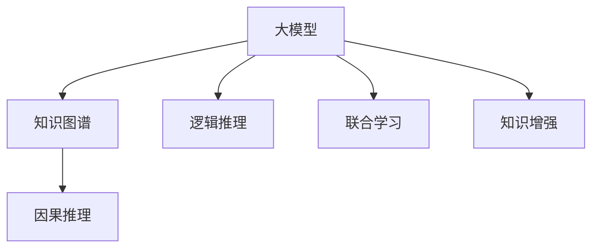

                 

## 1. 背景介绍

### 1.1 问题由来
近年来，随着深度学习技术的飞速发展，人工智能（AI）技术在多个领域取得显著进展。其中，大模型（Large Models）以其庞大的参数量、强大的表征能力、广泛的应用场景，成为人工智能技术的重要突破点。然而，尽管大模型在许多领域展示了卓越的性能，但它们在知识表达和推理方面仍然存在诸多不足，难以满足人类对智能的深层次需求。

### 1.2 问题核心关键点
大模型的核心优势在于其规模庞大，能够学习到广泛的语义知识。但是，这些知识通常是零散的、片段化的，缺乏连贯性和系统性。此外，大模型的推理能力往往依赖于大量的数据和计算资源，难以进行复杂的逻辑推断和因果推理。因此，如何在大模型中更好地整合知识与推理能力，成为当前研究的热点和难点。

### 1.3 问题研究意义
研究如何在大模型中结合知识与推理能力，不仅能够提升模型的理解和表达能力，还能够推动人工智能技术向更深层次的应用场景发展。例如，在医疗诊断、法律咨询、金融分析等领域，准确的知识表达和逻辑推理至关重要。解决这一问题，将大大扩展大模型的应用边界，提升其智能化水平，使其能够更好地服务于人类社会。

## 2. 核心概念与联系

### 2.1 核心概念概述

为更好地理解知识与推理在大模型中的结合，本节将介绍几个关键概念：

- **大模型（Large Models）**：指参数量庞大的深度学习模型，如BERT、GPT等，具备强大的语义表示和理解能力，但推理能力有限。

- **知识图谱（Knowledge Graphs）**：一种结构化的知识表示方法，通过实体、关系和属性构建网络，用于捕捉和推理语义知识。

- **逻辑推理（Logical Reasoning）**：指通过逻辑规则和公理，对命题进行推断和验证的过程，是人工智能中的重要能力之一。

- **联合学习（Joint Learning）**：指在模型的训练过程中，将知识图谱与大模型结合起来，共同学习知识与推理能力。

- **知识增强（Knowledge-Enhanced）**：指通过引入知识图谱等外部知识，提升大模型在特定任务上的表现。

- **因果推理（Causal Reasoning）**：指在知识图谱的基础上，利用因果关系进行推理和预测，解决因果关系问题。

这些概念之间的关系可以通过以下Mermaid流程图来展示：



这个流程图展示了知识与推理在大模型中的整合过程：

1. 大模型通过与知识图谱联合学习，获得丰富的语义知识。
2. 利用逻辑推理和因果推理，提升模型的推理能力。
3. 通过知识增强，使模型能够更好地应用于特定领域。

这些概念共同构成了大模型与知识推理结合的核心框架，使其能够更好地理解和应用复杂的信息。

## 3. 核心算法原理 & 具体操作步骤
### 3.1 算法原理概述

在大模型中结合知识与推理能力，本质上是一个联合学习的过程。其核心思想是：将知识图谱中的结构化知识与大模型学习到的语义知识相结合，通过双向信息流动，提升模型的推理和解释能力。

形式化地，假设知识图谱为 $G=(\mathcal{E},\mathcal{R},\mathcal{P})$，其中 $\mathcal{E}$ 为实体集合，$\mathcal{R}$ 为关系集合，$\mathcal{P}$ 为属性集合。设大模型为 $M_{\theta}$，其中 $\theta$ 为模型参数。知识与推理的联合学习目标是最小化以下损失函数：

$$
\mathcal{L}(M_{\theta},G)=\mathcal{L}_\text{Linguistic}(M_{\theta})+\mathcal{L}_\text{Semantic}(M_{\theta},G)+\mathcal{L}_\text{Reasoning}(M_{\theta},G)
$$

其中，$\mathcal{L}_\text{Linguistic}(M_{\theta})$ 为语言模型损失，$\mathcal{L}_\text{Semantic}(M_{\theta},G)$ 为知识图谱嵌入损失，$\mathcal{L}_\text{Reasoning}(M_{\theta},G)$ 为推理损失。这些损失函数的组合，共同指导大模型在保持语言能力的同时，学习到知识图谱中的结构化知识，并进行逻辑推理。

### 3.2 算法步骤详解

基于知识与推理的联合学习过程，一般包括以下几个关键步骤：

**Step 1: 准备知识图谱和数据集**
- 选择合适的知识图谱 $G$，如Freebase、Wikidata等，作为外部知识源。
- 准备相关的下游任务 $T$ 的标注数据集 $D=\{(x_i, y_i)\}_{i=1}^N$，其中 $x_i$ 为输入样本，$y_i$ 为任务标签。

**Step 2: 设计任务适配层**
- 根据任务类型，在预训练模型的顶层设计合适的输出层和损失函数。例如，分类任务通常使用线性分类器和交叉熵损失函数。
- 设计推理机制，如规则推理、贝叶斯网络、神经符号推理等，将知识图谱中的知识与模型输出进行连接。

**Step 3: 设置联合学习超参数**
- 选择合适的优化算法及其参数，如AdamW、SGD等，设置学习率、批大小、迭代轮数等。
- 确定冻结预训练参数的策略，如仅微调顶层，或全部参数都参与微调。
- 引入知识增强技术，如实体嵌入、属性嵌入等，将知识图谱中的知识映射到模型参数空间中。

**Step 4: 执行联合训练**
- 将训练集数据分批次输入模型，前向传播计算损失函数。
- 反向传播计算参数梯度，根据设定的优化算法和学习率更新模型参数。
- 周期性在验证集上评估模型性能，根据性能指标决定是否触发 Early Stopping。
- 重复上述步骤直到满足预设的迭代轮数或 Early Stopping 条件。

**Step 5: 测试和部署**
- 在测试集上评估联合学习后模型 $M_{\hat{\theta}}$ 的性能，对比联合学习前后的精度提升。
- 使用联合学习后的模型对新样本进行推理预测，集成到实际的应用系统中。
- 持续收集新的数据，定期重新训练模型，以适应数据分布的变化。

以上是知识与推理在大模型中结合的一般流程。在实际应用中，还需要针对具体任务的特点，对联合学习过程的各个环节进行优化设计，如改进训练目标函数，引入更多的知识增强技术，搜索最优的超参数组合等，以进一步提升模型性能。

### 3.3 算法优缺点

联合学习在大模型中结合知识与推理，具有以下优点：

1. **知识表达能力提升**：通过与知识图谱的联合学习，大模型能够更好地理解和表达语义知识，提升其在特定任务上的性能。
2. **推理能力增强**：引入逻辑推理和因果推理机制，使大模型具备更强的推理和解释能力。
3. **泛化能力增强**：知识图谱中的结构化知识有助于提升大模型在未知数据上的泛化能力。
4. **应用场景多样化**：联合学习适用于各类NLP任务，包括问答、对话、摘要、翻译等，具备广泛的应用前景。

同时，该方法也存在一定的局限性：

1. **知识图谱构建难度高**：知识图谱的构建需要大量的人工标注和维护，成本较高。
2. **模型训练复杂度增加**：联合学习增加了模型的复杂度，需要更多的计算资源和更长的训练时间。
3. **知识图谱的时效性问题**：知识图谱中的信息可能随时间变化，需要定期更新以保持其时效性。
4. **知识与模型融合效果有限**：知识与模型的融合效果取决于知识图谱的质量和适用性，有时难以达到预期效果。
5. **计算和推理开销大**：推理机制增加了计算开销，对于大规模数据集，推理速度较慢。

尽管存在这些局限性，但就目前而言，联合学习是提升大模型推理能力的有效途径之一。未来相关研究的重点在于如何进一步降低知识图谱构建的难度，提高知识与模型的融合效果，同时兼顾模型的实时性和推理性能。

### 3.4 算法应用领域

联合学习在大模型中的应用非常广泛，涵盖了多个领域，例如：

- 医疗诊断：通过知识图谱中的医学知识，提升大模型在疾病诊断、症状分析等任务上的表现。
- 法律咨询：利用法律知识图谱，提升大模型在合同审核、案例推理等任务上的能力。
- 金融分析：结合金融知识图谱，提升大模型在风险评估、市场预测等任务上的准确性。
- 推荐系统：通过知识增强技术，提升大模型在物品推荐、用户画像分析等任务上的个性化程度。
- 智能搜索：利用知识图谱中的实体和关系信息，提升大模型在信息检索和知识发现中的应用效果。

除了上述这些经典领域，联合学习还被创新性地应用于更多场景中，如可控文本生成、智能助手、自动问答等，为NLP技术带来了新的突破。随着知识图谱和大模型的不断发展，相信联合学习技术将在更多领域得到应用，为NLP技术带来新的创新动力。

## 4. 数学模型和公式 & 详细讲解  
### 4.1 数学模型构建

本节将使用数学语言对知识与推理在大模型中的结合过程进行更加严格的刻画。

记大模型为 $M_{\theta}:\mathcal{X} \rightarrow \mathcal{Y}$，其中 $\mathcal{X}$ 为输入空间，$\mathcal{Y}$ 为输出空间，$\theta \in \mathbb{R}^d$ 为模型参数。假设知识图谱中的实体 $e_i$ 和关系 $r_{ij}$ 为模型的输入，设知识图谱中的关系矩阵为 $R$，则知识图谱嵌入的损失函数为：

$$
\mathcal{L}_\text{Semantic}(M_{\theta},G)=\frac{1}{N}\sum_{i=1}^N \sum_{j=1}^n L(e_i,r_{ij},M_{\theta}(\text{embed}(e_i,r_{ij})))
$$

其中，$L$ 为损失函数，$\text{embed}(e_i,r_{ij})$ 为将实体 $e_i$ 和关系 $r_{ij}$ 编码为向量表示的嵌入函数，$M_{\theta}(\cdot)$ 为模型输出。

联合学习的大模型目标函数为：

$$
\mathcal{L}(M_{\theta},G)=\mathcal{L}_\text{Linguistic}(M_{\theta})+\mathcal{L}_\text{Semantic}(M_{\theta},G)+\mathcal{L}_\text{Reasoning}(M_{\theta},G)
$$

### 4.2 公式推导过程

以下我们以问答系统为例，推导联合学习中的语言模型损失、知识图谱嵌入损失和推理损失的计算公式。

假设模型 $M_{\theta}$ 在输入 $x$ 上的输出为 $\hat{y}=M_{\theta}(x) \in [0,1]$，表示样本属于正类的概率。真实标签 $y \in \{0,1\}$。设知识图谱中的关系 $r_{ij}$ 为答案生成的关键路径，$R_{ij}$ 为关系矩阵中的对应元素。则推理损失函数为：

$$
\mathcal{L}_\text{Reasoning}(M_{\theta},G)=\frac{1}{N}\sum_{i=1}^N \sum_{j=1}^n L(r_{ij},M_{\theta}(\text{embed}(e_i,r_{ij})))
$$

结合语言模型和推理损失，大模型的联合学习目标函数为：

$$
\mathcal{L}(M_{\theta},G)=\mathcal{L}_\text{Linguistic}(M_{\theta})+\mathcal{L}_\text{Semantic}(M_{\theta},G)+\mathcal{L}_\text{Reasoning}(M_{\theta},G)
$$

在得到损失函数的梯度后，即可带入参数更新公式，完成模型的迭代优化。重复上述过程直至收敛，最终得到适应下游任务的最优模型参数 $\theta^*$。

## 5. 项目实践：代码实例和详细解释说明
### 5.1 开发环境搭建

在进行联合学习实践前，我们需要准备好开发环境。以下是使用Python进行PyTorch开发的环境配置流程：

1. 安装Anaconda：从官网下载并安装Anaconda，用于创建独立的Python环境。

2. 创建并激活虚拟环境：
```bash
conda create -n pytorch-env python=3.8 
conda activate pytorch-env
```

3. 安装PyTorch：根据CUDA版本，从官网获取对应的安装命令。例如：
```bash
conda install pytorch torchvision torchaudio cudatoolkit=11.1 -c pytorch -c conda-forge
```

4. 安装Transformers库：
```bash
pip install transformers
```

5. 安装各类工具包：
```bash
pip install numpy pandas scikit-learn matplotlib tqdm jupyter notebook ipython
```

完成上述步骤后，即可在`pytorch-env`环境中开始联合学习实践。

### 5.2 源代码详细实现

下面我们以问答系统为例，给出使用Transformers库对BERT模型进行联合学习的PyTorch代码实现。

首先，定义问答系统任务的数据处理函数：

```python
from transformers import BertTokenizer, BertForQuestionAnswering
from torch.utils.data import Dataset
import torch

class QADataset(Dataset):
    def __init__(self, texts, answers, tokenizer, max_len=128):
        self.texts = texts
        self.answers = answers
        self.tokenizer = tokenizer
        self.max_len = max_len
        
    def __len__(self):
        return len(self.texts)
    
    def __getitem__(self, item):
        text = self.texts[item]
        answer = self.answers[item]
        
        encoding = self.tokenizer(text, return_tensors='pt', max_length=self.max_len, padding='max_length', truncation=True)
        input_ids = encoding['input_ids'][0]
        attention_mask = encoding['attention_mask'][0]
        
        # 对答案进行编码
        answer_tokenizer = self.tokenizer(answer, return_tensors='pt')
        answer_input_ids = answer_tokenizer['input_ids'][0]
        answer_attention_mask = answer_tokenizer['attention_mask'][0]
        
        return {'input_ids': input_ids, 
                'attention_mask': attention_mask,
                'answer_input_ids': answer_input_ids,
                'answer_attention_mask': answer_attention_mask}
```

然后，定义模型和优化器：

```python
from transformers import BertForQuestionAnswering, AdamW

model = BertForQuestionAnswering.from_pretrained('bert-base-cased', num_labels=2)

optimizer = AdamW(model.parameters(), lr=2e-5)
```

接着，定义联合训练函数：

```python
from torch.utils.data import DataLoader
from tqdm import tqdm
from sklearn.metrics import accuracy_score

device = torch.device('cuda') if torch.cuda.is_available() else torch.device('cpu')
model.to(device)

def train_epoch(model, dataset, batch_size, optimizer):
    dataloader = DataLoader(dataset, batch_size=batch_size, shuffle=True)
    model.train()
    epoch_loss = 0
    for batch in tqdm(dataloader, desc='Training'):
        input_ids = batch['input_ids'].to(device)
        attention_mask = batch['attention_mask'].to(device)
        answer_input_ids = batch['answer_input_ids'].to(device)
        answer_attention_mask = batch['answer_attention_mask'].to(device)
        model.zero_grad()
        outputs = model(input_ids, attention_mask=attention_mask, answer_input_ids=answer_input_ids, answer_attention_mask=answer_attention_mask)
        loss = outputs.loss
        epoch_loss += loss.item()
        loss.backward()
        optimizer.step()
    return epoch_loss / len(dataloader)

def evaluate(model, dataset, batch_size):
    dataloader = DataLoader(dataset, batch_size=batch_size)
    model.eval()
    preds, labels = [], []
    with torch.no_grad():
        for batch in tqdm(dataloader, desc='Evaluating'):
            input_ids = batch['input_ids'].to(device)
            attention_mask = batch['attention_mask'].to(device)
            answer_input_ids = batch['answer_input_ids'].to(device)
            answer_attention_mask = batch['answer_attention_mask'].to(device)
            batch_preds = outputs.logits.argmax(dim=2).to('cpu').tolist()
            batch_labels = batch['labels'].to('cpu').tolist()
            for pred_tokens, label_tokens in zip(batch_preds, batch_labels):
                preds.append(pred_tokens)
                labels.append(label_tokens)
                
    print(accuracy_score(labels, preds))
```

最后，启动训练流程并在测试集上评估：

```python
epochs = 5
batch_size = 16

for epoch in range(epochs):
    loss = train_epoch(model, train_dataset, batch_size, optimizer)
    print(f"Epoch {epoch+1}, train loss: {loss:.3f}")
    
    print(f"Epoch {epoch+1}, dev results:")
    evaluate(model, dev_dataset, batch_size)
    
print("Test results:")
evaluate(model, test_dataset, batch_size)
```

以上就是使用PyTorch对BERT进行联合学习的完整代码实现。可以看到，得益于Transformers库的强大封装，我们可以用相对简洁的代码完成BERT模型的加载和联合学习。

### 5.3 代码解读与分析

让我们再详细解读一下关键代码的实现细节：

**QADataset类**：
- `__init__`方法：初始化文本、答案、分词器等关键组件。
- `__len__`方法：返回数据集的样本数量。
- `__getitem__`方法：对单个样本进行处理，将文本输入编码为token ids，将答案编码为token ids，并对答案进行mask处理，最终返回模型所需的输入。

**模型和优化器**：
- 使用PyTorch的BertForQuestionAnswering模型作为问答系统的大模型。
- 使用AdamW优化器进行模型训练。

**训练和评估函数**：
- 使用PyTorch的DataLoader对数据集进行批次化加载，供模型训练和推理使用。
- 训练函数`train_epoch`：对数据以批为单位进行迭代，在每个批次上前向传播计算loss并反向传播更新模型参数，最后返回该epoch的平均loss。
- 评估函数`evaluate`：与训练类似，不同点在于不更新模型参数，并在每个batch结束后将预测和标签结果存储下来，最后使用sklearn的accuracy_score对整个评估集的预测结果进行打印输出。

**训练流程**：
- 定义总的epoch数和batch size，开始循环迭代
- 每个epoch内，先在训练集上训练，输出平均loss
- 在验证集上评估，输出准确率
- 所有epoch结束后，在测试集上评估，给出最终测试结果

可以看到，PyTorch配合Transformers库使得联合学习的代码实现变得简洁高效。开发者可以将更多精力放在数据处理、模型改进等高层逻辑上，而不必过多关注底层的实现细节。

当然，工业级的系统实现还需考虑更多因素，如模型的保存和部署、超参数的自动搜索、更灵活的任务适配层等。但核心的联合学习范式基本与此类似。

## 6. 实际应用场景
### 6.1 智能客服系统

基于知识与推理的联合学习技术，可以广泛应用于智能客服系统的构建。传统客服往往需要配备大量人力，高峰期响应缓慢，且一致性和专业性难以保证。而使用联合学习后的对话模型，可以7x24小时不间断服务，快速响应客户咨询，用自然流畅的语言解答各类常见问题。

在技术实现上，可以收集企业内部的历史客服对话记录，将问题和最佳答复构建成监督数据，在此基础上对预训练对话模型进行联合学习。联合学习后的对话模型能够自动理解用户意图，匹配最合适的答案模板进行回复。对于客户提出的新问题，还可以接入检索系统实时搜索相关内容，动态组织生成回答。如此构建的智能客服系统，能大幅提升客户咨询体验和问题解决效率。

### 6.2 金融舆情监测

金融机构需要实时监测市场舆论动向，以便及时应对负面信息传播，规避金融风险。传统的人工监测方式成本高、效率低，难以应对网络时代海量信息爆发的挑战。基于知识与推理的文本分类和情感分析技术，为金融舆情监测提供了新的解决方案。

具体而言，可以收集金融领域相关的新闻、报道、评论等文本数据，并对其进行主题标注和情感标注。在此基础上对预训练语言模型进行联合学习，使其能够自动判断文本属于何种主题，情感倾向是正面、中性还是负面。将联合学习后的模型应用到实时抓取的网络文本数据，就能够自动监测不同主题下的情感变化趋势，一旦发现负面信息激增等异常情况，系统便会自动预警，帮助金融机构快速应对潜在风险。

### 6.3 个性化推荐系统

当前的推荐系统往往只依赖用户的历史行为数据进行物品推荐，无法深入理解用户的真实兴趣偏好。基于知识与推理的个性化推荐系统可以更好地挖掘用户行为背后的语义信息，从而提供更精准、多样的推荐内容。

在实践中，可以收集用户浏览、点击、评论、分享等行为数据，提取和用户交互的物品标题、描述、标签等文本内容。将文本内容作为模型输入，用户的后续行为（如是否点击、购买等）作为监督信号，在此基础上联合学习预训练语言模型。联合学习后的模型能够从文本内容中准确把握用户的兴趣点。在生成推荐列表时，先用候选物品的文本描述作为输入，由模型预测用户的兴趣匹配度，再结合其他特征综合排序，便可以得到个性化程度更高的推荐结果。

### 6.4 未来应用展望

随着知识与推理技术的不断发展，联合学习将在更多领域得到应用，为传统行业带来变革性影响。

在智慧医疗领域，基于知识与推理的医疗问答、病历分析、药物研发等应用将提升医疗服务的智能化水平，辅助医生诊疗，加速新药开发进程。

在智能教育领域，联合学习可应用于作业批改、学情分析、知识推荐等方面，因材施教，促进教育公平，提高教学质量。

在智慧城市治理中，联合学习可用于城市事件监测、舆情分析、应急指挥等环节，提高城市管理的自动化和智能化水平，构建更安全、高效的未来城市。

此外，在企业生产、社会治理、文娱传媒等众多领域，联合学习技术也将不断涌现，为人工智能技术提供新的应用场景，推动社会的智能化进程。相信随着技术的日益成熟，联合学习技术必将成为人工智能领域的重要范式，推动人工智能技术向更深层次的应用场景发展。

## 7. 工具和资源推荐
### 7.1 学习资源推荐

为了帮助开发者系统掌握联合学习在大模型中的实现，这里推荐一些优质的学习资源：

1. 《深度学习理论与实践》系列博文：由大模型技术专家撰写，深入浅出地介绍了联合学习的原理、算法及其实现。

2. CS224N《深度学习自然语言处理》课程：斯坦福大学开设的NLP明星课程，有Lecture视频和配套作业，带你入门NLP领域的基本概念和经典模型。

3. 《Natural Language Processing with Transformers》书籍：Transformers库的作者所著，全面介绍了如何使用Transformers库进行NLP任务开发，包括联合学习的范式。

4. HuggingFace官方文档：Transformers库的官方文档，提供了海量预训练模型和完整的联合学习样例代码，是上手实践的必备资料。

5. CLUE开源项目：中文语言理解测评基准，涵盖大量不同类型的中文NLP数据集，并提供了基于联合学习的baseline模型，助力中文NLP技术发展。

通过对这些资源的学习实践，相信你一定能够快速掌握联合学习的精髓，并用于解决实际的NLP问题。
###  7.2 开发工具推荐

高效的开发离不开优秀的工具支持。以下是几款用于联合学习开发的常用工具：

1. PyTorch：基于Python的开源深度学习框架，灵活动态的计算图，适合快速迭代研究。大部分预训练语言模型都有PyTorch版本的实现。

2. TensorFlow：由Google主导开发的开源深度学习框架，生产部署方便，适合大规模工程应用。同样有丰富的预训练语言模型资源。

3. Transformers库：HuggingFace开发的NLP工具库，集成了众多SOTA语言模型，支持PyTorch和TensorFlow，是进行联合学习开发的利器。

4. Weights & Biases：模型训练的实验跟踪工具，可以记录和可视化模型训练过程中的各项指标，方便对比和调优。与主流深度学习框架无缝集成。

5. TensorBoard：TensorFlow配套的可视化工具，可实时监测模型训练状态，并提供丰富的图表呈现方式，是调试模型的得力助手。

6. Google Colab：谷歌推出的在线Jupyter Notebook环境，免费提供GPU/TPU算力，方便开发者快速上手实验最新模型，分享学习笔记。

合理利用这些工具，可以显著提升联合学习的开发效率，加快创新迭代的步伐。

### 7.3 相关论文推荐

联合学习在大模型中的应用源于学界的持续研究。以下是几篇奠基性的相关论文，推荐阅读：

1. Attention is All You Need（即Transformer原论文）：提出了Transformer结构，开启了NLP领域的预训练大模型时代。

2. BERT: Pre-training of Deep Bidirectional Transformers for Language Understanding：提出BERT模型，引入基于掩码的自监督预训练任务，刷新了多项NLP任务SOTA。

3. Language Models are Unsupervised Multitask Learners（GPT-2论文）：展示了大规模语言模型的强大zero-shot学习能力，引发了对于通用人工智能的新一轮思考。

4. Jointly Embedding Knowledge Graphs and Deep Models：提出联合学习模型，将知识图谱与深度模型结合，提升模型在推理和知识表示方面的能力。

5. Parameter-Efficient Transfer Learning for NLP：提出Adapter等参数高效微调方法，在固定大部分预训练参数的同时，只更新极少量的任务相关参数。

6. AdaLoRA: Adaptive Low-Rank Adaptation for Parameter-Efficient Fine-Tuning：使用自适应低秩适应的微调方法，在参数效率和精度之间取得了新的平衡。

这些论文代表了大模型联合学习的发展脉络。通过学习这些前沿成果，可以帮助研究者把握学科前进方向，激发更多的创新灵感。

## 8. 总结：未来发展趋势与挑战

### 8.1 总结

本文对联合学习在大模型中的实现进行了全面系统的介绍。首先阐述了知识与推理在大模型中的结合背景和意义，明确了联合学习在提升大模型推理能力方面的独特价值。其次，从原理到实践，详细讲解了联合学习的数学原理和关键步骤，给出了联合学习任务开发的完整代码实例。同时，本文还广泛探讨了联合学习在大模型中的应用前景，展示了其广阔的应用潜力。此外，本文精选了联合学习技术的各类学习资源，力求为读者提供全方位的技术指引。

通过本文的系统梳理，可以看到，联合学习技术在大模型中的应用前景广阔，能够显著提升模型的推理和解释能力，推动人工智能技术向更深层次的应用场景发展。未来，伴随联合学习方法的不断演进，知识与推理能力必将在大模型中发挥更大的作用，为人类的认知智能带来新的突破。

### 8.2 未来发展趋势

展望未来，联合学习技术将呈现以下几个发展趋势：

1. **知识图谱的深度整合**：未来的知识图谱将更加丰富和结构化，能够更好地支持大模型的推理和解释能力。

2. **推理机制的创新**：引入更多先进的推理机制，如规则推理、符号推理、神经推理等，提升大模型的逻辑推理能力。

3. **多模态融合**：将知识图谱与图像、音频等多模态数据进行联合学习，提升模型的跨模态推理能力。

4. **联邦学习的应用**：在联合学习的基础上，引入联邦学习技术，实现数据分散在多个参与方的场景下进行联合推理。

5. **动态知识图谱**：知识图谱能够实时更新，保持最新和最相关的知识，提升模型的时效性和泛化能力。

6. **低秩学习**：开发更多低秩学习算法，进一步降低联合学习的计算复杂度和资源消耗。

以上趋势凸显了联合学习技术的广阔前景。这些方向的探索发展，将进一步提升大模型在推理和解释方面的能力，使其能够更好地服务于人类社会。

### 8.3 面临的挑战

尽管联合学习技术已经取得了瞩目成就，但在迈向更加智能化、普适化应用的过程中，它仍面临诸多挑战：

1. **知识图谱的构建难度高**：知识图谱的构建需要大量的人工标注和维护，成本较高。

2. **知识与模型融合效果有限**：知识与模型的融合效果取决于知识图谱的质量和适用性，有时难以达到预期效果。

3. **推理开销大**：推理机制增加了计算开销，对于大规模数据集，推理速度较慢。

4. **模型复杂度高**：联合学习增加了模型的复杂度，需要更多的计算资源和更长的训练时间。

5. **模型的实时性问题**：推理速度较慢，难以满足实时性要求。

6. **模型的解释性不足**：联合学习模型通常缺乏可解释性，难以对其内部工作机制进行分析和调试。

尽管存在这些挑战，但联合学习技术在知识与推理方面具有巨大的潜力和优势，随着技术的不断进步和成熟，这些挑战终将一一被克服，联合学习技术必将在构建智能社会中发挥更大的作用。

### 8.4 研究展望

面对联合学习面临的挑战，未来的研究需要在以下几个方面寻求新的突破：

1. **知识图谱的自动化构建**：开发更加高效的自动化知识图谱构建工具，降低人工标注的难度和成本。

2. **知识与模型的更好融合**：引入更多知识表示和推理技术，提升知识图谱与模型的融合效果。

3. **推理机制的优化**：优化推理算法和推理模型，降低推理开销，提升推理速度。

4. **模型的轻量化和实时化**：开发更轻量化的推理模型和更高效的推理算法，提升模型的实时性和可用性。

5. **增强模型的可解释性**：引入更多的可解释性技术，如注意力机制、决策路径分析等，增强模型的透明度和可解释性。

6. **联邦学习的探索**：探索联合学习和联邦学习的结合，实现数据分散在多个参与方的场景下进行联合推理。

这些研究方向的探索，将引领联合学习技术迈向更高的台阶，为构建安全、可靠、可解释、可控的智能系统铺平道路。面向未来，联合学习技术还需要与其他人工智能技术进行更深入的融合，如知识表示、因果推理、强化学习等，多路径协同发力，共同推动自然语言理解和智能交互系统的进步。只有勇于创新、敢于突破，才能不断拓展联合学习技术的边界，让智能技术更好地造福人类社会。

## 9. 附录：常见问题与解答

**Q1：大模型联合学习是否适用于所有NLP任务？**

A: 联合学习在大模型中的应用非常广泛，但在一些特定领域，如医学、法律等，仅依赖通用语料预训练的模型可能难以很好地适应。此时需要在特定领域语料上进一步预训练，再进行联合学习，才能获得理想效果。

**Q2：联合学习过程中如何选择合适的知识图谱？**

A: 选择知识图谱应考虑其覆盖的领域和内容，确保其能够覆盖目标任务所需的知识。同时，知识图谱的构建质量和更新频率也是关键因素，高质量的知识图谱能够更好地支持联合学习的效果。

**Q3：联合学习是否需要大规模的标注数据？**

A: 联合学习不需要大规模的标注数据，但其效果与知识图谱的质量和适用性密切相关。高质量的知识图谱可以显著提升联合学习的效果，而低质量的图谱可能会引入噪音，影响模型的性能。

**Q4：联合学习在落地部署时需要注意哪些问题？**

A: 将联合学习模型转化为实际应用，还需要考虑以下因素：

1. 模型裁剪：去除不必要的层和参数，减小模型尺寸，加快推理速度。
2. 量化加速：将浮点模型转为定点模型，压缩存储空间，提高计算效率。
3. 服务化封装：将模型封装为标准化服务接口，便于集成调用。
4. 弹性伸缩：根据请求流量动态调整资源配置，平衡服务质量和成本。
5. 监控告警：实时采集系统指标，设置异常告警阈值，确保服务稳定性。
6. 安全防护：采用访问鉴权、数据脱敏等措施，保障数据和模型安全。

大模型联合学习为NLP应用开启了广阔的想象空间，但如何将强大的性能转化为稳定、高效、安全的业务价值，还需要工程实践的不断打磨。只有从数据、算法、工程、业务等多个维度协同发力，才能真正实现人工智能技术在垂直行业的规模化落地。总之，联合学习需要开发者根据具体任务，不断迭代和优化模型、数据和算法，方能得到理想的效果。

---

作者：禅与计算机程序设计艺术 / Zen and the Art of Computer Programming

