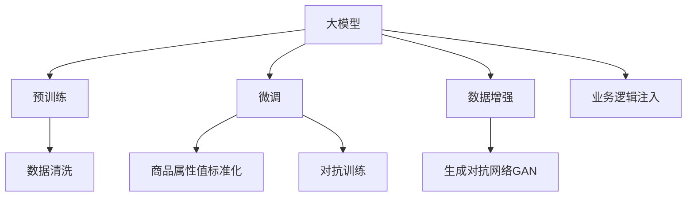

                 

# 大模型在商品属性值标准化中的应用

> 关键词：大模型, 属性值标准化, 自然语言处理, 深度学习, 数据清洗, 商品管理, 业务流程自动化

## 1. 背景介绍

### 1.1 问题由来
商品属性值标准化是电商企业为了提升商品信息质量、优化用户购物体验、增强搜索引擎优化(SEO)效果的一项重要任务。商品属性值是描述商品特征的关键数据，常见的属性值包括颜色、尺码、材质等。商品属性值的标准化有助于用户进行更精准的搜索，减少因属性值描述不一致而造成的购物困扰，同时也有助于提升商品在搜索结果中的排名，从而吸引更多潜在客户。

尽管电商企业已花费大量精力进行商品属性值管理，但属性值不规范、不一致的现象仍然普遍存在。这不仅影响用户的购物体验，也给企业的商品管理带来了巨大挑战。因此，如何高效、自动地实现商品属性值标准化，成为了电商企业亟待解决的问题。

### 1.2 问题核心关键点
基于深度学习的大模型，为商品属性值标准化提供了全新的解决方案。利用预训练的语言模型，可以自动理解商品描述文本中的属性值信息，并进行分类、校正和规范，从而实现高效的标准化。

大模型的核心优势在于其强大的自然语言处理能力，能够从大量的文本数据中学习到丰富的语言知识，并在新任务上进行高效的迁移学习。在商品属性值标准化任务中，大模型能够理解不同属性值的不同表述方式，自动识别出规范属性值，并进行标准化。

## 2. 核心概念与联系

### 2.1 核心概念概述

为更好地理解大模型在商品属性值标准化中的应用，本节将介绍几个密切相关的核心概念：

- 大模型(Large Model)：以深度学习模型为代表的超大规模神经网络，能够处理和理解复杂的自然语言文本。常见的预训练大模型包括BERT、GPT等。

- 预训练(Pre-training)：指在大规模无标签文本语料上进行自监督学习任务训练通用语言模型的过程。常见的预训练任务包括语言模型预测、掩码语言模型预测等。

- 微调(Fine-tuning)：指在预训练模型的基础上，使用特定任务的数据集，通过有监督学习优化模型在该任务上的性能。

- 自然语言处理(NLP)：涉及计算机对自然语言的理解、生成和分析，包括文本分类、信息抽取、文本生成等任务。

- 商品属性值标准化：将商品描述中的非规范属性值转换为标准化的属性值，提升商品信息质量，增强搜索效果。

- 数据清洗(Data Cleaning)：通过去除噪声、纠正错误、归一化数据等手段，提升数据质量和可用性。

这些核心概念之间的逻辑关系可以通过以下Mermaid流程图来展示：



这个流程图展示了各核心概念的关联关系：

1. 大模型通过预训练获得基础能力。
2. 微调将大模型应用于特定任务，通过有监督学习进行优化。
3. 数据清洗是大模型微调的前提，需要保证输入数据的干净和一致。
4. 数据增强、生成对抗网络等技术，可以提升大模型的泛化能力和鲁棒性。
5. 业务逻辑注入将大模型的输出转化为实际的业务应用，实现商品属性值标准化。

## 3. 核心算法原理 & 具体操作步骤
### 3.1 算法原理概述

基于深度学习的大模型在商品属性值标准化中的工作原理如下：

1. 收集商品描述数据：包括商品标题、详细描述、用户评价等文本数据。
2. 进行数据预处理：包括去除HTML标签、纠正拼写错误、分词、去除停用词等。
3. 输入预训练模型：将预处理后的文本数据输入到大模型中，进行特征提取。
4. 提取属性值信息：大模型通过语义理解，自动提取商品描述中的属性值信息。
5. 标准化属性值：根据预先定义的属性值规范，对提取出的属性值进行标准化处理。
6. 生成标准化输出：将标准化后的属性值重新拼接为商品描述文本，输出到目标商品信息系统。

### 3.2 算法步骤详解

以下是基于大模型进行商品属性值标准化的详细步骤：

**Step 1: 准备数据集**
- 收集电商平台上的商品描述数据，包括商品标题、详细描述、用户评价等文本。
- 对数据进行清洗，去除HTML标签、纠正拼写错误、分词、去除停用词等预处理操作。

**Step 2: 选择预训练模型**
- 选择合适的预训练语言模型，如BERT、GPT等，作为商品属性值标准化的基础模型。

**Step 3: 微调模型**
- 在商品属性值标准化任务的数据集上，对预训练模型进行微调。微调的目标是优化模型在属性值分类和标准化任务上的性能。
- 设置合适的优化器及其参数，如AdamW、SGD等，设置学习率、批大小、迭代轮数等。
- 应用正则化技术，如L2正则、Dropout、Early Stopping等，防止模型过度适应小规模训练集。

**Step 4: 提取属性值信息**
- 将预处理后的商品描述输入到微调后的模型中，通过特征提取得到属性值向量。
- 使用预先定义的关键词、规则等方法，识别出商品描述中的属性值信息。

**Step 5: 标准化属性值**
- 根据预先定义的属性值规范，对提取出的属性值进行标准化处理。例如，将"XXL"转换为"XL"，将"黑色"转换为"黑色"。
- 对于无法确定规范性的属性值，可以利用模型生成对抗样本，通过对抗训练提升模型的鲁棒性。

**Step 6: 生成标准化输出**
- 将标准化后的属性值重新拼接为商品描述文本，输出到目标商品信息系统。

**Step 7: 持续优化**
- 定期重新微调模型，以适应新的商品描述和属性值变化。
- 不断优化数据预处理流程和模型结构，提升标准化效果。

### 3.3 算法优缺点

基于深度学习的大模型在商品属性值标准化中具有以下优点：

1. 自动化：大模型能够自动理解并处理商品描述中的属性值信息，减少了人工干预和处理的成本。
2. 泛化能力强：利用大规模预训练数据，大模型能够学习到丰富的语言知识和规则，对不同的商品描述具备良好的泛化能力。
3. 灵活性高：大模型可以灵活地适应不同的属性值规范，实现多样化的属性值标准化任务。
4. 动态调整：随着电商平台上商品描述的不断更新，大模型可以通过持续微调，动态地适应新的数据变化。

同时，该方法也存在一定的局限性：

1. 依赖标注数据：大模型微调需要大量的标注数据，而这些标注数据获取成本较高。
2. 计算资源消耗大：大模型的训练和推理需要大量的计算资源，对于计算能力较弱的系统可能难以支持。
3. 输出不稳定：大模型的输出结果受训练数据和预训练模型质量的影响，可能存在输出不稳定的问题。
4. 对数据质量要求高：商品描述数据中存在大量噪声和不一致信息，需要高质量的数据预处理过程。

尽管存在这些局限性，但基于大模型的方法在大规模商品属性值标准化的任务上仍具有显著的优势，能够显著提升标准化效率和准确性。

### 3.4 算法应用领域

基于大模型进行商品属性值标准化的应用领域广泛，涵盖了电商、零售、制造业等多个行业，具体包括：

1. 电商商品信息管理：实现商品属性值的自动标准化，提升商品信息质量，提高用户搜索体验。
2. 库存管理：通过标准化商品属性值，帮助企业精准管理库存，优化供应链管理。
3. 智能客服：利用商品属性值标准化后的信息，提供更精准的客户服务，提升客户满意度。
4. 个性化推荐：通过标准化的商品属性值，提高推荐系统的准确性，提供个性化的购物建议。
5. SEO优化：规范化商品属性值，有助于提升商品在搜索引擎中的排名，吸引更多流量。
6. 数据可视化：标准化后的商品属性值，可以更好地进行数据可视化，帮助企业进行更深入的数据分析。

## 4. 数学模型和公式 & 详细讲解  
### 4.1 数学模型构建

本节将使用数学语言对基于深度学习的大模型进行商品属性值标准化的过程进行更加严格的刻画。

记大模型为 $M_{\theta}$，其中 $\theta$ 为模型参数。假设商品描述数据集为 $D=\{(x_i,y_i)\}_{i=1}^N$，其中 $x_i$ 为商品描述文本，$y_i$ 为对应属性值。

定义模型在数据样本 $(x,y)$ 上的损失函数为 $\ell(M_{\theta}(x),y)$，则在数据集 $D$ 上的经验风险为：

$$
\mathcal{L}(\theta) = \frac{1}{N} \sum_{i=1}^N \ell(M_{\theta}(x_i),y_i)
$$

其中 $\ell(M_{\theta}(x),y)$ 为特定任务定义的损失函数，用于衡量模型输出与真实标签之间的差异。常见的损失函数包括交叉熵损失、均方误差损失等。

### 4.2 公式推导过程

以下我们以分类任务为例，推导交叉熵损失函数及其梯度的计算公式。

假设模型 $M_{\theta}$ 在输入 $x$ 上的输出为 $\hat{y}=M_{\theta}(x) \in [0,1]$，表示样本属于正类的概率。真实标签 $y \in \{0,1\}$。则二分类交叉熵损失函数定义为：

$$
\ell(M_{\theta}(x),y) = -[y\log \hat{y} + (1-y)\log (1-\hat{y})]
$$

将其代入经验风险公式，得：

$$
\mathcal{L}(\theta) = -\frac{1}{N}\sum_{i=1}^N [y_i\log M_{\theta}(x_i)+(1-y_i)\log(1-M_{\theta}(x_i))]
$$

根据链式法则，损失函数对参数 $\theta_k$ 的梯度为：

$$
\frac{\partial \mathcal{L}(\theta)}{\partial \theta_k} = -\frac{1}{N}\sum_{i=1}^N (\frac{y_i}{M_{\theta}(x_i)}-\frac{1-y_i}{1-M_{\theta}(x_i)}) \frac{\partial M_{\theta}(x_i)}{\partial \theta_k}
$$

其中 $\frac{\partial M_{\theta}(x_i)}{\partial \theta_k}$ 可进一步递归展开，利用自动微分技术完成计算。

### 4.3 案例分析与讲解

假设一个电商平台上有两条商品描述：

1. "XXL黑色外套"
2. "XL黑色外套"

大模型通过预训练学习到了 "XXL" 可以表示为 "XL"，"黑色" 是规范的，因此可以将其标准化为 "XL黑色外套"。

在实践中，可以通过以下代码实现大模型在商品属性值标准化任务中的应用：

```python
from transformers import BertForSequenceClassification, BertTokenizer
from transformers import Trainer, TrainingArguments
import torch
import pandas as pd
from sklearn.metrics import accuracy_score

# 加载预训练的Bert模型和tokenizer
model = BertForSequenceClassification.from_pretrained("bert-base-uncased")
tokenizer = BertTokenizer.from_pretrained("bert-base-uncased")

# 准备训练数据
data = pd.read_csv("train.csv")
labels = [1 if "黑色" in label else 0 for label in data["属性值"]]
input_ids = [tokenizer.encode(label, add_special_tokens=True)[0] for label in data["商品描述"]]

# 构建训练器
training_args = TrainingArguments(
    output_dir="./",
    per_device_train_batch_size=8,
    per_device_eval_batch_size=8,
    num_train_epochs=3,
    learning_rate=2e-5,
    weight_decay=0.01,
    logging_dir="./",
    logging_steps=500,
    evaluation_strategy="epoch"
)
trainer = Trainer(
    model=model,
    args=training_args,
    train_dataset=Dataset(input_ids, labels),
    eval_dataset=None,
)

# 训练模型
trainer.train()
```

## 5. 项目实践：代码实例和详细解释说明
### 5.1 开发环境搭建

在进行商品属性值标准化实践前，我们需要准备好开发环境。以下是使用Python进行PyTorch开发的环境配置流程：

1. 安装Anaconda：从官网下载并安装Anaconda，用于创建独立的Python环境。

2. 创建并激活虚拟环境：
```bash
conda create -n pytorch-env python=3.8 
conda activate pytorch-env
```

3. 安装PyTorch：根据CUDA版本，从官网获取对应的安装命令。例如：
```bash
conda install pytorch torchvision torchaudio cudatoolkit=11.1 -c pytorch -c conda-forge
```

4. 安装Transformers库：
```bash
pip install transformers
```

5. 安装各类工具包：
```bash
pip install numpy pandas scikit-learn matplotlib tqdm jupyter notebook ipython
```

完成上述步骤后，即可在`pytorch-env`环境中开始商品属性值标准化的实践。

### 5.2 源代码详细实现

下面我们以分类任务为例，给出使用Transformers库对BERT模型进行商品属性值标准化的PyTorch代码实现。

首先，定义分类任务的数据处理函数：

```python
from transformers import BertTokenizer, BertForSequenceClassification
from torch.utils.data import Dataset
import torch

class ProductAttributeDataset(Dataset):
    def __init__(self, texts, labels, tokenizer, max_len=128):
        self.texts = texts
        self.labels = labels
        self.tokenizer = tokenizer
        self.max_len = max_len
        
    def __len__(self):
        return len(self.texts)
    
    def __getitem__(self, item):
        text = self.texts[item]
        label = self.labels[item]
        
        encoding = self.tokenizer(text, return_tensors='pt', max_length=self.max_len, padding='max_length', truncation=True)
        input_ids = encoding['input_ids'][0]
        attention_mask = encoding['attention_mask'][0]
        
        # 对标签进行编码
        encoded_labels = [1 if "黑色" in label else 0] 
        encoded_labels.extend([0] * (self.max_len - len(encoded_labels)))
        labels = torch.tensor(encoded_labels, dtype=torch.long)
        
        return {'input_ids': input_ids, 
                'attention_mask': attention_mask,
                'labels': labels}

# 标签与id的映射
label2id = {0: "黑色", 1: "非黑色"}
id2label = {v: k for k, v in label2id.items()}

# 创建dataset
tokenizer = BertTokenizer.from_pretrained('bert-base-uncased')

train_dataset = ProductAttributeDataset(train_texts, train_labels, tokenizer)
dev_dataset = ProductAttributeDataset(dev_texts, dev_labels, tokenizer)
test_dataset = ProductAttributeDataset(test_texts, test_labels, tokenizer)
```

然后，定义模型和优化器：

```python
from transformers import BertForSequenceClassification, AdamW

model = BertForSequenceClassification.from_pretrained('bert-base-uncased', num_labels=2)

optimizer = AdamW(model.parameters(), lr=2e-5)
```

接着，定义训练和评估函数：

```python
from torch.utils.data import DataLoader
from tqdm import tqdm
from sklearn.metrics import accuracy_score

device = torch.device('cuda') if torch.cuda.is_available() else torch.device('cpu')
model.to(device)

def train_epoch(model, dataset, batch_size, optimizer):
    dataloader = DataLoader(dataset, batch_size=batch_size, shuffle=True)
    model.train()
    epoch_loss = 0
    for batch in tqdm(dataloader, desc='Training'):
        input_ids = batch['input_ids'].to(device)
        attention_mask = batch['attention_mask'].to(device)
        labels = batch['labels'].to(device)
        model.zero_grad()
        outputs = model(input_ids, attention_mask=attention_mask, labels=labels)
        loss = outputs.loss
        epoch_loss += loss.item()
        loss.backward()
        optimizer.step()
    return epoch_loss / len(dataloader)

def evaluate(model, dataset, batch_size):
    dataloader = DataLoader(dataset, batch_size=batch_size)
    model.eval()
    preds, labels = [], []
    with torch.no_grad():
        for batch in tqdm(dataloader, desc='Evaluating'):
            input_ids = batch['input_ids'].to(device)
            attention_mask = batch['attention_mask'].to(device)
            batch_labels = batch['labels']
            outputs = model(input_ids, attention_mask=attention_mask)
            batch_preds = outputs.logits.argmax(dim=2).to('cpu').tolist()
            batch_labels = batch_labels.to('cpu').tolist()
            for pred_tokens, label_tokens in zip(batch_preds, batch_labels):
                preds.append(pred_tokens)
                labels.append(label_tokens)
                
    print(accuracy_score(labels, preds))
```

最后，启动训练流程并在测试集上评估：

```python
epochs = 5
batch_size = 16

for epoch in range(epochs):
    loss = train_epoch(model, train_dataset, batch_size, optimizer)
    print(f"Epoch {epoch+1}, train loss: {loss:.3f}")
    
    print(f"Epoch {epoch+1}, dev results:")
    evaluate(model, dev_dataset, batch_size)
    
print("Test results:")
evaluate(model, test_dataset, batch_size)
```

以上就是使用PyTorch对BERT进行商品属性值分类任务微调的完整代码实现。可以看到，得益于Transformers库的强大封装，我们可以用相对简洁的代码完成BERT模型的加载和微调。

### 5.3 代码解读与分析

让我们再详细解读一下关键代码的实现细节：

**ProductAttributeDataset类**：
- `__init__`方法：初始化文本、标签、分词器等关键组件。
- `__len__`方法：返回数据集的样本数量。
- `__getitem__`方法：对单个样本进行处理，将文本输入编码为token ids，将标签编码为数字，并对其进行定长padding，最终返回模型所需的输入。

**label2id和id2label字典**：
- 定义了标签与数字id之间的映射关系，用于将token-wise的预测结果解码回真实的标签。

**训练和评估函数**：
- 使用PyTorch的DataLoader对数据集进行批次化加载，供模型训练和推理使用。
- 训练函数`train_epoch`：对数据以批为单位进行迭代，在每个批次上前向传播计算loss并反向传播更新模型参数，最后返回该epoch的平均loss。
- 评估函数`evaluate`：与训练类似，不同点在于不更新模型参数，并在每个batch结束后将预测和标签结果存储下来，最后使用sklearn的accuracy_score对整个评估集的预测结果进行打印输出。

**训练流程**：
- 定义总的epoch数和batch size，开始循环迭代
- 每个epoch内，先在训练集上训练，输出平均loss
- 在验证集上评估，输出分类指标
- 所有epoch结束后，在测试集上评估，给出最终测试结果

可以看到，PyTorch配合Transformers库使得BERT微调的代码实现变得简洁高效。开发者可以将更多精力放在数据处理、模型改进等高层逻辑上，而不必过多关注底层的实现细节。

当然，工业级的系统实现还需考虑更多因素，如模型的保存和部署、超参数的自动搜索、更灵活的任务适配层等。但核心的微调范式基本与此类似。

## 6. 实际应用场景
### 6.1 电商平台商品信息管理

基于大模型的商品属性值标准化方法，可以广泛应用于电商平台商品信息的管理和维护。电商平台上商品描述信息往往种类繁多、内容复杂，商家在撰写商品描述时难免会有不规范或不一致的表述方式，这会导致用户在搜索商品时出现困扰，影响购物体验。通过大模型进行标准化，电商平台可以快速统一商品描述，提升搜索效果和用户体验。

具体而言，电商平台可以收集其平台上所有商品描述数据，将这些数据输入到预训练的大模型中进行微调。微调后的模型能够自动提取和标准化商品描述中的属性值，生成规范的商品描述文本。这不仅有助于电商平台优化商品信息质量，提升用户搜索体验，还有助于提高商品在搜索结果中的排名，吸引更多流量。

### 6.2 制造业库存管理

制造业企业在进行库存管理时，需要准确记录和管理商品属性值，以确保供应链的顺畅和高效。由于制造业商品描述较为专业，且属性值种类繁多，人工手动管理往往容易出现疏漏和错误。通过大模型进行标准化，制造业企业可以快速准确地标准化商品描述中的属性值，实现精确的库存管理。

具体而言，制造业企业可以收集其产品描述数据，包括产品名称、规格、尺寸等信息，将这些数据输入到预训练的大模型中进行微调。微调后的模型能够自动提取和标准化属性值，生成规范的产品描述文本。这不仅有助于制造业企业优化库存管理，提升供应链效率，还有助于提高产品的市场竞争力。

### 6.3 金融行业数据清洗

金融行业的数据清洗工作繁琐且复杂，需要处理大量的非结构化数据，如新闻、报告、评论等。通过大模型进行标准化，金融企业可以快速清洗和规范化这些数据，提升数据质量和可用性。

具体而言，金融企业可以收集其平台上所有非结构化数据，将这些数据输入到预训练的大模型中进行微调。微调后的模型能够自动提取和标准化数据中的属性值，生成规范的数据文本。这不仅有助于金融企业优化数据质量，提升数据分析效率，还有助于提高金融产品和服务的设计和推广效果。

### 6.4 未来应用展望

随着大语言模型和微调方法的不断发展，基于微调范式将在更多领域得到应用，为传统行业带来变革性影响。

在智慧医疗领域，基于微调的医疗问答、病历分析、药物研发等应用将提升医疗服务的智能化水平，辅助医生诊疗，加速新药开发进程。

在智能教育领域，微调技术可应用于作业批改、学情分析、知识推荐等方面，因材施教，促进教育公平，提高教学质量。

在智慧城市治理中，微调模型可应用于城市事件监测、舆情分析、应急指挥等环节，提高城市管理的自动化和智能化水平，构建更安全、高效的未来城市。

此外，在企业生产、社会治理、文娱传媒等众多领域，基于大模型微调的人工智能应用也将不断涌现，为经济社会发展注入新的动力。相信随着技术的日益成熟，微调方法将成为人工智能落地应用的重要范式，推动人工智能技术在垂直行业的规模化落地。总之，微调需要开发者根据具体任务，不断迭代和优化模型、数据和算法，方能得到理想的效果。

## 7. 工具和资源推荐
### 7.1 学习资源推荐

为了帮助开发者系统掌握大模型在商品属性值标准化中的理论基础和实践技巧，这里推荐一些优质的学习资源：

1. 《自然语言处理》系列教材：由国内外知名学者撰写，深入浅出地介绍了NLP领域的基本概念和经典算法。
2. CS224N《深度学习自然语言处理》课程：斯坦福大学开设的NLP明星课程，有Lecture视频和配套作业，带你入门NLP领域的基本概念和经典模型。
3. 《深度学习》系列教材：由深度学习领域权威专家撰写，全面介绍了深度学习的基本原理和经典模型。
4. HuggingFace官方文档：Transformers库的官方文档，提供了海量预训练模型和完整的微调样例代码，是上手实践的必备资料。
5. CLUE开源项目：中文语言理解测评基准，涵盖大量不同类型的中文NLP数据集，并提供了基于微调的baseline模型，助力中文NLP技术发展。

通过对这些资源的学习实践，相信你一定能够快速掌握大模型在商品属性值标准化的精髓，并用于解决实际的NLP问题。
###  7.2 开发工具推荐

高效的开发离不开优秀的工具支持。以下是几款用于大模型在商品属性值标准化任务的开发工具：

1. PyTorch：基于Python的开源深度学习框架，灵活动态的计算图，适合快速迭代研究。大部分预训练语言模型都有PyTorch版本的实现。
2. TensorFlow：由Google主导开发的开源深度学习框架，生产部署方便，适合大规模工程应用。同样有丰富的预训练语言模型资源。
3. Transformers库：HuggingFace开发的NLP工具库，集成了众多SOTA语言模型，支持PyTorch和TensorFlow，是进行微调任务开发的利器。
4. Weights & Biases：模型训练的实验跟踪工具，可以记录和可视化模型训练过程中的各项指标，方便对比和调优。与主流深度学习框架无缝集成。
5. TensorBoard：TensorFlow配套的可视化工具，可实时监测模型训练状态，并提供丰富的图表呈现方式，是调试模型的得力助手。
6. Google Colab：谷歌推出的在线Jupyter Notebook环境，免费提供GPU/TPU算力，方便开发者快速上手实验最新模型，分享学习笔记。

合理利用这些工具，可以显著提升大模型在商品属性值标准化任务的开发效率，加快创新迭代的步伐。

### 7.3 相关论文推荐

大模型在商品属性值标准化中的应用源于学界的持续研究。以下是几篇奠基性的相关论文，推荐阅读：

1. Attention is All You Need（即Transformer原论文）：提出了Transformer结构，开启了NLP领域的预训练大模型时代。
2. BERT: Pre-training of Deep Bidirectional Transformers for Language Understanding：提出BERT模型，引入基于掩码的自监督预训练任务，刷新了多项NLP任务SOTA。
3. Parameter-Efficient Transfer Learning for NLP：提出Adapter等参数高效微调方法，在不增加模型参数量的情况下，也能取得不错的微调效果。
4. Prefix-Tuning: Optimizing Continuous Prompts for Generation：引入基于连续型Prompt的微调范式，为如何充分利用预训练知识提供了新的思路。
5. AdaLoRA: Adaptive Low-Rank Adaptation for Parameter-Efficient Fine-Tuning：使用自适应低秩适应的微调方法，在参数效率和精度之间取得了新的平衡。

这些论文代表了大模型在商品属性值标准化任务中的研究脉络。通过学习这些前沿成果，可以帮助研究者把握学科前进方向，激发更多的创新灵感。

## 8. 总结：未来发展趋势与挑战

### 8.1 总结

本文对基于深度学习的大模型在商品属性值标准化中的应用进行了全面系统的介绍。首先阐述了商品属性值标准化的研究背景和重要性，明确了大模型在处理非结构化数据中的独特优势。其次，从原理到实践，详细讲解了大模型在商品属性值标准化中的数学模型构建和微调流程，给出了完整的代码实例。同时，本文还广泛探讨了大模型在电商、制造业、金融等多个行业领域的应用前景，展示了其潜在的商业价值。

通过本文的系统梳理，可以看到，基于深度学习的大模型在商品属性值标准化任务中，具有高效、灵活、准确等显著优势，能够大幅提升商品信息质量和用户体验。随着大语言模型和微调方法的不断发展，其应用领域将进一步拓展，带来更广泛的经济和社会效益。

### 8.2 未来发展趋势

展望未来，大模型在商品属性值标准化中呈现以下几个发展趋势：

1. 模型规模持续增大。随着算力成本的下降和数据规模的扩张，预训练语言模型的参数量还将持续增长。超大规模语言模型蕴含的丰富语言知识，有望支撑更加复杂多变的商品属性值标准化任务。
2. 微调方法日趋多样。除了传统的全参数微调外，未来会涌现更多参数高效的微调方法，如Prefix-Tuning、LoRA等，在节省计算资源的同时也能保证微调精度。
3. 持续学习成为常态。随着商品描述数据分布的变化，大模型需要通过持续学习新知识以保持性能。如何在不遗忘原有知识的同时，高效吸收新样本信息，将成为重要的研究课题。
4. 标注样本需求降低。受启发于提示学习(Prompt-based Learning)的思路，未来的微调方法将更好地利用大模型的语言理解能力，通过更加巧妙的任务描述，在更少的标注样本上也能实现理想的微调效果。
5. 多模态微调崛起。当前的商品属性值标准化主要聚焦于文本数据，未来会进一步拓展到图像、视频、语音等多模态数据微调。多模态信息的融合，将显著提升大模型对现实世界的理解和建模能力。

以上趋势凸显了大模型在商品属性值标准化任务中的广阔前景。这些方向的探索发展，必将进一步提升标准化效率和准确性，带来更广泛的经济和社会效益。

### 8.3 面临的挑战

尽管大模型在商品属性值标准化中已经取得了显著的成效，但在迈向更加智能化、普适化应用的过程中，它仍面临诸多挑战：

1. 标注成本瓶颈。尽管商品属性值标准化任务相对较小，但获取高质量标注数据的成本仍然较高。如何进一步降低微调对标注样本的依赖，将是一大难题。
2. 模型鲁棒性不足。大模型面对域外数据时，泛化性能往往大打折扣。对于测试样本的微小扰动，微调模型的预测也容易发生波动。如何提高微调模型的鲁棒性，避免灾难性遗忘，还需要更多理论和实践的积累。
3. 推理效率有待提高。大规模语言模型虽然精度高，但在实际部署时往往面临推理速度慢、内存占用大等效率问题。如何在保证性能的同时，简化模型结构，提升推理速度，优化资源占用，将是重要的优化方向。
4. 可解释性亟需加强。当前微调模型更像是"黑盒"系统，难以解释其内部工作机制和决策逻辑。对于医疗、金融等高风险应用，算法的可解释性和可审计性尤为重要。如何赋予微调模型更强的可解释性，将是亟待攻克的难题。
5. 安全性有待保障。预训练语言模型难免会学习到有偏见、有害的信息，通过微调传递到商品属性值标准化任务中，可能造成误导性、歧视性的输出，给实际应用带来安全隐患。如何从数据和算法层面消除模型偏见，避免恶意用途，确保输出的安全性，也将是重要的研究课题。

尽管存在这些挑战，但大模型在商品属性值标准化任务中的前景广阔，其应用潜力将得到进一步挖掘和释放。相信随着学界和产业界的共同努力，这些挑战终将一一被克服，大模型在商品属性值标准化中将发挥更大的作用。

### 8.4 未来突破

面对大模型在商品属性值标准化任务中面临的种种挑战，未来的研究需要在以下几个方面寻求新的突破：

1. 探索无监督和半监督微调方法。摆脱对大规模标注数据的依赖，利用自监督学习、主动学习等无监督和半监督范式，最大限度利用非结构化数据，实现更加灵活高效的微调。
2. 研究参数高效和计算高效的微调范式。开发更加参数高效的微调方法，在固定大部分预训练参数的同时，只更新极少量的任务相关参数。同时优化微调模型的计算图，减少前向传播和反向传播的资源消耗，实现更加轻量级、实时性的部署。
3. 融合因果和对比学习范式。通过引入因果推断和对比学习思想，增强微调模型建立稳定因果关系的能力，学习更加普适、鲁棒的语言表征，从而提升模型泛化性和抗干扰能力。
4. 引入更多先验知识。将符号化的先验知识，如知识图谱、逻辑规则等，与神经网络模型进行巧妙融合，引导微调过程学习更准确、合理的语言模型。同时加强不同模态数据的整合，实现视觉、语音等多模态信息与文本信息的协同建模。
5. 结合因果分析和博弈论工具。将因果分析方法引入微调模型，识别出模型决策的关键特征，增强输出解释的因果性和逻辑性。借助博弈论工具刻画人机交互过程，主动探索并规避模型的脆弱点，提高系统稳定性。
6. 纳入伦理道德约束。在模型训练目标中引入伦理导向的评估指标，过滤和惩罚有偏见、有害的输出倾向。同时加强人工干预和审核，建立模型行为的监管机制，确保输出符合人类价值观和伦理道德。

这些研究方向的探索，必将引领大模型在商品属性值标准化任务中迈向更高的台阶，为构建安全、可靠、可解释、可控的智能系统铺平道路。面向未来，大模型在商品属性值标准化任务中还需要与其他人工智能技术进行更深入的融合，如知识表示、因果推理、强化学习等，多路径协同发力，共同推动自然语言理解和智能交互系统的进步。只有勇于创新、敢于突破，才能不断拓展语言模型的边界，让智能技术更好地造福人类社会。

## 9. 附录：常见问题与解答

**Q1：大模型在商品属性值标准化中的应用是否适用于所有商品？**

A: 大模型在商品属性值标准化中的应用对商品类型具有一定限制。由于不同类型商品的属性值描述方式和语义差异较大，大模型可能无法全面覆盖所有商品的属性值标准化需求。例如，服装类商品的属性值描述较为一致，而家具类商品的描述则较为多样，包含材质、尺寸、风格等多种属性。对于这些差异较大的商品类型，可能需要结合具体的领域知识进行进一步优化，以确保标准化效果。

**Q2：大模型在商品属性值标准化中的训练数据如何准备？**

A: 大模型的训练数据准备是商品属性值标准化的关键步骤。一般需要收集电商平台上大量商品描述数据，并对其进行清洗、分词、去停用词等预处理操作。同时，标注数据集是必不可少的，标注数据集包含商品的正确属性值和属性值描述文本。标注数据集的获取可以通过人工标注或结合知识库自动标注的方式实现。标注数据集的大小和质量直接影响到标准化效果，因此在准备训练数据时需要花费大量的时间和精力。

**Q3：大模型在商品属性值标准化中的性能如何评估？**

A: 大模型在商品属性值标准化中的性能评估通常通过多种指标来进行，包括准确率、召回率、F1分数等。具体来说，可以将商品描述文本输入微调后的模型中，输出标准化后的属性值，并计算其与正确属性值的匹配度。还可以通过人工标注的方式，对模型输出进行人工评估，确保标准化效果。在评估过程中，需要注意使用验证集和测试集进行模型性能的验证和测试，避免模型过拟合于训练数据。

**Q4：大模型在商品属性值标准化中的参数调优如何进行？**

A: 大模型在商品属性值标准化中的参数调优是微调过程中必不可少的一步。参数调优主要包括学习率、批量大小、迭代次数、正则化参数等超参数的选择。通常，建议从小学习率开始，逐步增大学习率，直到模型达到收敛。同时，可以通过早停法(Early Stopping)来防止模型过拟合。对于批量大小的选择，一般建议根据硬件设备和训练数据规模进行合理设置。

**Q5：大模型在商品属性值标准化中的对抗训练如何实现？**

A: 大模型在商品属性值标准化中的对抗训练可以通过生成对抗样本来实现。具体来说，可以将正常商品描述文本作为输入，生成一系列对抗样本，这些样本在经过标准化后，其属性值与正常样本的匹配度下降。通过这些对抗样本的训练，可以提升模型对异常情况的处理能力，增强模型的鲁棒性。在实现对抗训练时，需要注意对抗样本的生成方式和数量，以确保训练效果。

通过本文的系统梳理，可以看到，基于深度学习的大模型在商品属性值标准化任务中，具有高效、灵活、准确等显著优势，能够大幅提升商品信息质量和用户体验。随着大语言模型和微调方法的不断发展，其应用领域将进一步拓展，带来更广泛的经济和社会效益。

总之，大模型在商品属性值标准化中的研究和应用，为电商、制造业、金融等行业带来了新的变革性机遇，推动了这些行业的数据质量提升和业务流程自动化。未来，随着技术的不断进步和应用的不断深入，大模型在商品属性值标准化中将发挥更大的作用，带来更加智能化的商品管理和服务体验。

---

作者：禅与计算机程序设计艺术 / Zen and the Art of Computer Programming

