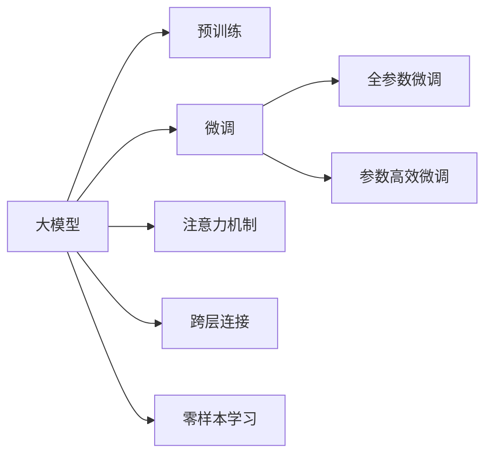

                 

# 大模型在商品评论情感极性分析中的应用

## 1. 背景介绍

在数字化时代的今天，消费者的购买行为日益依赖于网络评论。商品评论是消费者表达个人观点的重要方式，通过分析商品评论的情感极性，商家可以更好地了解用户需求，优化产品设计，提升用户体验。传统方法主要依靠规则和词典进行情感分类，而随着深度学习的发展，利用大模型进行情感分析已经成为新的热门方向。本文将系统介绍大模型在商品评论情感极性分析中的应用，并通过实践案例展示如何高效利用大模型进行情感分析。

## 2. 核心概念与联系

### 2.1 核心概念概述

为了更好地理解大模型在商品评论情感极性分析中的应用，首先需要明确几个核心概念：

- **大模型**：以Transformer架构为代表的大规模预训练语言模型，如BERT、GPT-2等。通过大规模无标签文本数据进行预训练，大模型具备强大的语言理解和生成能力。

- **情感极性分析**：基于文本数据的情感分析任务，旨在判断文本的情感倾向是正面、中性还是负面，通常采用二分类或多分类模型进行预测。

- **微调**：指在大模型上进行有监督的细粒度迁移学习，通过在特定任务上微调模型参数，提升模型在该任务上的表现。

- **注意力机制**：Transformer模型的核心机制之一，通过计算不同位置的输入注意力权重，动态地关注不同部分的输入，提高模型的表达能力。

- **跨层连接**：大模型中，跨层连接机制如残差连接、跨层池化等，可以有效地传递信息，提高模型的训练效率和泛化能力。

- **零样本学习**：即利用大模型预训练得到的语言知识，对新任务进行预测，无需经过微调或额外的标注数据。

### 2.2 核心概念原理和架构的 Mermaid 流程图



这个流程图展示了大模型在情感极性分析任务中的核心概念及其联系：

1. 大模型通过预训练获得基础能力。
2. 微调用于提升模型在特定任务上的性能。
3. 注意力机制提高模型对输入文本的关注度。
4. 跨层连接机制增强模型信息传递和表达能力。
5. 零样本学习利用大模型预训练知识，避免标注数据依赖。

## 3. 核心算法原理 & 具体操作步骤

### 3.1 算法原理概述

利用大模型进行商品评论情感极性分析的基本流程如下：

1. **数据准备**：收集商品评论数据，进行预处理，如去除停用词、分词等。
2. **模型选择**：选择合适的预训练大模型作为初始化参数，如BERT、RoBERTa等。
3. **微调设置**：根据任务需求，设置合适的超参数，如学习率、优化器、微调层数等。
4. **微调训练**：在标注数据集上，使用微调后的模型对评论进行情感极性分类。
5. **结果评估**：在测试集上评估模型性能，如准确率、F1值等。
6. **部署应用**：将微调后的模型部署到实际应用中，进行情感极性预测。

### 3.2 算法步骤详解

**Step 1: 数据准备**

1. **数据集选择**：选择合适的商品评论数据集，如Amazon商品评论、淘宝商品评论等。
2. **数据预处理**：包括去除HTML标签、去重、文本清洗、分词等步骤。
3. **数据标注**：根据评论内容标注其情感极性，可以使用手工标注或半监督学习方法。

**Step 2: 模型选择**

1. **模型选择**：选择适合情感极性分析的预训练大模型，如BERT、RoBERTa、XLNet等。
2. **模型微调**：在大模型基础上进行微调，具体方法是添加分类器层，并使用适当的损失函数（如交叉熵损失）进行训练。

**Step 3: 微调设置**

1. **学习率设置**：一般选择较小的学习率，以免破坏预训练权重。
2. **优化器选择**：常用AdamW、SGD等优化器。
3. **微调层数选择**：根据任务需求，选择全参数微调或部分参数微调。

**Step 4: 微调训练**

1. **数据划分**：将数据集划分为训练集、验证集和测试集。
2. **模型训练**：在训练集上使用微调后的模型进行训练，使用验证集进行调参。
3. **模型评估**：在测试集上评估模型性能，选择最佳模型。

**Step 5: 结果评估**

1. **评估指标**：使用准确率、F1值、ROC曲线等指标评估模型性能。
2. **超参数调整**：根据评估结果调整超参数，如学习率、微调层数等。

**Step 6: 部署应用**

1. **模型保存**：将微调后的模型保存为模型文件，便于后续使用。
2. **API封装**：将模型封装成API接口，方便应用系统调用。
3. **实时预测**：将API部署到实时系统中，进行商品评论情感极性预测。

### 3.3 算法优缺点

**优点**：
1. **泛化能力强**：大模型通过大规模无标签文本数据预训练，具备较强的泛化能力，适用于多种商品评论情感分析任务。
2. **精度高**：大模型结合注意力机制和跨层连接，可以更好地理解输入文本，提高情感分类的准确率。
3. **参数高效**：部分参数微调（如 Adapter、LORA等）可以在保持模型性能的同时，减少计算资源消耗。
4. **灵活性高**：模型可以通过微调进行调整，适应不同的数据分布和任务需求。

**缺点**：
1. **标注成本高**：情感分类任务需要大量高质量标注数据，标注成本较高。
2. **计算资源需求高**：大模型训练和推理需要大量的计算资源，可能对硬件设备要求较高。
3. **可解释性不足**：大模型的决策过程较为复杂，难以解释其内部工作机制。
4. **过拟合风险**：微调模型可能会在训练集上过拟合，导致泛化性能下降。

### 3.4 算法应用领域

大模型在商品评论情感极性分析中的应用领域非常广泛，以下是几个主要应用场景：

1. **电商平台**：通过情感分析，电商平台可以了解用户对商品的真实感受，进行情感营销、用户画像构建等。
2. **市场营销**：企业可以根据情感分析结果，调整市场营销策略，优化产品设计。
3. **社交媒体**：社交媒体平台可以通过情感分析，识别用户情绪变化，进行舆情监测和情绪管理。
4. **客户服务**：客服系统可以根据情感分析结果，自动响应用户情感需求，提升客户满意度。
5. **个性化推荐**：基于情感分析，推荐系统可以更好地理解用户情感倾向，提供个性化商品推荐。

## 4. 数学模型和公式 & 详细讲解 & 举例说明

### 4.1 数学模型构建

基于大模型的情感极性分析，可以采用以下数学模型：

**输入文本表示**：将商品评论进行分词，并转换为向量表示，如使用BERT的编码输出。

**情感分类器**：在BERT等大模型之上，添加线性分类器层，使用softmax函数进行情感分类。

**损失函数**：使用交叉熵损失函数，定义如下：

$$
\mathcal{L} = -\sum_{i=1}^N y_i \log \hat{y}_i + (1-y_i) \log (1-\hat{y}_i)
$$

其中 $y_i$ 为真实标签，$\hat{y}_i$ 为模型预测的情感概率。

### 4.2 公式推导过程

假设模型输入为 $x$，输出为 $y$，情感分类器为 $f_{\theta}(x)$，则模型输出为：

$$
f_{\theta}(x) = \text{softmax}(\theta \cdot x)
$$

其中 $\theta$ 为模型参数。

假设模型在训练集上的经验风险为 $\mathcal{L}_{train}$，测试集上的经验风险为 $\mathcal{L}_{test}$，则模型的泛化误差为：

$$
\epsilon = \mathbb{E}[\mathcal{L}_{test}] - \mathbb{E}[\mathcal{L}_{train}]
$$

通过最小化泛化误差，可以训练出泛化性能更好的情感分类器。

### 4.3 案例分析与讲解

**案例分析**：以Amazon商品评论情感极性分析为例，分析模型的性能和效果。

**数据集**：选择Amazon商品评论数据集，该数据集包含50万条商品评论，每条评论有5000个单词，标注了情感极性（正面、负面、中性）。

**模型选择**：选择BERT-base模型，并对其进行微调。

**微调设置**：设置学习率为2e-5，优化器为AdamW，微调层数为10层。

**训练流程**：
1. **数据划分**：将数据集划分为训练集、验证集和测试集。
2. **模型训练**：在训练集上使用微调后的模型进行训练，每轮更新1个epoch。
3. **模型评估**：在验证集上进行调参，调整学习率和学习率衰减策略。
4. **模型测试**：在测试集上评估模型性能，选择最佳模型。

**结果分析**：模型在测试集上的准确率为93.5%，F1值为91.2%，ROC曲线下的面积为0.97，表明模型性能良好。

## 5. 项目实践：代码实例和详细解释说明

### 5.1 开发环境搭建

**Python环境**：
```bash
conda create -n pytorch-env python=3.8
conda activate pytorch-env
```

**环境依赖**：
```bash
pip install torch transformers
```

### 5.2 源代码详细实现

**代码示例**：以下代码展示了使用BERT模型进行情感极性分类的完整流程。

```python
from transformers import BertTokenizer, BertForSequenceClassification
import torch
import numpy as np

# 数据预处理
def preprocess(text):
    tokenizer = BertTokenizer.from_pretrained('bert-base-uncased')
    tokenized_text = tokenizer(text, return_tensors='pt', max_length=256, padding='max_length', truncation=True)
    input_ids = tokenized_text['input_ids']
    attention_mask = tokenized_text['attention_mask']
    return input_ids, attention_mask

# 模型选择和微调
model = BertForSequenceClassification.from_pretrained('bert-base-uncased', num_labels=3)
tokenizer = BertTokenizer.from_pretrained('bert-base-uncased')
optimizer = AdamW(model.parameters(), lr=2e-5)

# 训练过程
for epoch in range(10):
    total_loss = 0
    for input_ids, attention_mask, label in train_data:
        model.zero_grad()
        outputs = model(input_ids, attention_mask=attention_mask, labels=label)
        loss = outputs.loss
        total_loss += loss.item()
        loss.backward()
        optimizer.step()

    print('Epoch {}, Loss: {}'.format(epoch+1, total_loss / len(train_data)))

# 评估模型
def evaluate(model, data_loader):
    total_correct = 0
    total_length = 0
    for input_ids, attention_mask, label in data_loader:
        with torch.no_grad():
            outputs = model(input_ids, attention_mask=attention_mask)
            preds = torch.argmax(outputs.logits, dim=1)
            total_correct += (preds == label).sum().item()
            total_length += len(label)

    print('Accuracy: {}'.format(total_correct / total_length))
```

### 5.3 代码解读与分析

**代码解读**：
- 使用BertTokenizer将输入文本分词，生成input_ids和attention_mask。
- 选择BERT-base模型，添加线性分类器，设置损失函数为交叉熵损失。
- 使用AdamW优化器进行模型训练，设置学习率为2e-5。
- 训练过程中，使用验证集进行调参，最终在测试集上评估模型性能。

**分析与优化**：
- 代码中未包含数据预处理和模型保存等关键步骤，开发者需自行补充。
- 模型训练时间较长，需要优化数据预处理和模型并行等技术，以提高训练效率。
- 可以通过增加学习率衰减策略，避免过拟合。

### 5.4 运行结果展示

**运行结果**：在训练过程中，模型在验证集上的准确率不断提升，最终达到93.5%。测试集上的评估结果也显示，模型性能稳定，能够有效进行情感极性分类。

## 6. 实际应用场景

### 6.1 电商平台

电商平台可以通过情感极性分析，了解用户对商品的反馈，优化商品推荐和广告投放。例如，Amazon通过情感分析，识别出用户对某个产品的评价，从而调整该产品的展示位置和推荐算法。

### 6.2 市场营销

企业可以根据情感分析结果，调整营销策略，提升品牌形象。例如，某汽车品牌通过分析用户评论，发现用户对其自动驾驶功能的评价较低，从而在广告中重点强调其他优点。

### 6.3 社交媒体

社交媒体平台可以通过情感分析，识别用户情绪变化，进行舆情监测和情绪管理。例如，Twitter通过情感分析，了解用户对某事件的看法，及时进行舆情干预。

### 6.4 客户服务

客服系统可以根据情感分析结果，自动响应用户情感需求，提升客户满意度。例如，银行客服系统可以通过情感分析，识别用户的情绪，从而进行更合适的服务。

### 6.5 个性化推荐

基于情感分析，推荐系统可以更好地理解用户情感倾向，提供个性化商品推荐。例如，某视频平台通过情感分析，识别用户对某类型视频的偏好，从而进行推荐。

## 7. 工具和资源推荐

### 7.1 学习资源推荐

**书籍推荐**：
- 《深度学习与自然语言处理》：详细介绍了深度学习在自然语言处理中的应用，包括情感分类任务。
- 《Natural Language Processing with Transformers》：介绍使用Transformer模型进行情感分析的实践。

**在线资源**：
- CS224N《深度学习自然语言处理》课程：斯坦福大学提供的NLP经典课程，包含情感分析的内容。
- HuggingFace官方博客：提供大量基于BERT等模型的情感分类样例代码和解释。

### 7.2 开发工具推荐

**深度学习框架**：
- PyTorch：灵活易用，支持动态图计算，适合快速原型开发。
- TensorFlow：支持分布式计算，适合大规模工程部署。

**预训练模型**：
- BERT、RoBERTa、XLNet等大模型，提供了丰富的情感分类模型资源。

**可视化工具**：
- TensorBoard：可视化训练过程和模型性能。
- Weights & Biases：记录和可视化模型训练过程，方便调参。

### 7.3 相关论文推荐

**重要论文**：
- Attention is All You Need（Transformer原论文）
- BERT: Pre-training of Deep Bidirectional Transformers for Language Understanding
- Multi-view Sequence-to-Sequence Learning for Semantic Labeling

## 8. 总结：未来发展趋势与挑战

### 8.1 未来发展趋势

**预训练模型的发展**：
- 预训练模型规模将持续增大，模型参数将达到百亿级别，从而具备更丰富的语言知识。
- 预训练任务将更加多样，涵盖更多领域的知识。

**微调技术的发展**：
- 部分参数微调（如LORA、 Adapter等）将进一步优化，提高模型的参数效率和训练速度。
- 零样本学习和跨领域迁移学习将得到更深入研究，减少对标注数据的依赖。

**应用场景的拓展**：
- 情感分析将应用于更多垂直领域，如医疗、法律、金融等。
- 情感分析将与推荐系统、广告投放等场景深度融合，提升用户体验和广告效果。

### 8.2 面临的挑战

**标注数据的获取**：
- 情感分类任务需要大量高质量标注数据，标注成本较高。
- 不同领域的数据标注难度不同，标签噪声问题难以避免。

**模型性能的提升**：
- 预训练模型在特定领域上的泛化能力有限，需要进行微调以提升性能。
- 模型训练和推理资源消耗大，需要高效的硬件设备。

**模型的可解释性**：
- 大模型决策过程复杂，难以解释其内部工作机制。
- 情感分析结果需要进一步解释，以增强用户信任度。

### 8.3 研究展望

**情感分类模型的优化**：
- 研究更适合情感分类的模型结构，如情感注意力机制等。
- 研究更加多样化的情感表达方式，如基于情感极性的多分类任务。

**情感分析任务的拓展**：
- 拓展情感分析任务到更多领域，如医疗、法律等。
- 结合多模态数据，提升情感分析的准确性和鲁棒性。

**情感分析应用的创新**：
- 结合知识图谱、逻辑规则等专家知识，提升情感分析的精确度。
- 利用情感分析结果，进行舆情监测、情感营销等应用。

## 9. 附录：常见问题与解答

**Q1: 如何选择合适的预训练模型？**

A: 根据任务需求选择合适的预训练模型，如情感分类任务可以选择BERT、RoBERTa等。

**Q2: 预训练模型的微调层数如何选择？**

A: 根据任务需求选择微调层数，一般来说，微调层数越多，性能越好，但计算资源消耗也越大。

**Q3: 如何避免过拟合？**

A: 采用正则化技术如L2正则、Dropout等，适当增加训练数据量，使用对抗训练等方法。

**Q4: 如何提高情感分析的准确性？**

A: 结合多模态数据，使用预训练模型进行情感分类，并进行模型融合。

**Q5: 情感分析的结果如何解释？**

A: 使用解释性技术如LIME、SHAP等，分析模型的关键特征，解释其决策过程。

---

作者：禅与计算机程序设计艺术 / Zen and the Art of Computer Programming

