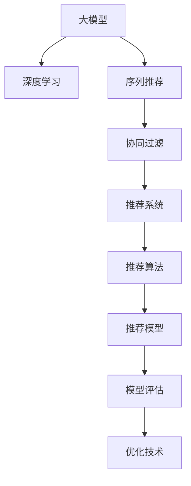

                 

# 大模型在序列推荐中的应用

> 关键词：大模型, 序列推荐, 深度学习, 协同过滤, 推荐系统, 召回率, 精度, 效果评估

## 1. 背景介绍

### 1.1 问题由来
随着互联网和电子商务的蓬勃发展，个性化推荐系统成为用户获取信息的重要工具。传统的协同过滤和基于内容的推荐算法面临着数据稀疏性和扩展性的挑战。因此，基于深度学习的推荐算法逐渐受到关注，通过神经网络模型来挖掘用户与商品之间的隐含关联，为每个用户推荐更符合其兴趣的商品。大模型的引入为推荐系统带来了新的突破，利用其强大的表示学习能力和泛化能力，可以显著提升推荐效果，实现用户、商品和上下文的多维关联建模。

### 1.2 问题核心关键点
本节将阐述大模型在推荐系统中的应用原理，并给出详细的数学推导和代码实现。具体来说，主要包括以下几个关键点：

- 大模型在推荐系统中的角色
- 推荐系统的主要框架和算法
- 推荐模型的数学建模和训练方法
- 模型评估与优化技术
- 具体应用实例与代码实现

## 2. 核心概念与联系

### 2.1 核心概念概述

为更好地理解大模型在推荐系统中的应用，本节将介绍几个密切相关的核心概念：

- 大模型(Large Model)：指具有大规模参数的深度学习模型，如BERT、GPT等，能够捕捉复杂的语义和关联特征。
- 序列推荐(Sequence Recommendation)：指基于用户行为序列进行推荐，如点击序列、浏览序列等，以捕捉用户兴趣变化和隐式关联。
- 深度学习(Deep Learning)：指利用神经网络进行复杂模式识别的机器学习方法，能够自动提取特征、进行分类、回归等任务。
- 协同过滤(Collaborative Filtering)：指通过用户-商品矩阵或商品-商品矩阵来推荐相似商品，典型算法包括基于用户的协同过滤和基于项目的协同过滤。
- 推荐系统(Recommendation System)：指通过分析用户行为数据，为用户推荐感兴趣的物品的系统，是电子商务、社交网络等领域的重要应用。

这些核心概念之间的逻辑关系可以通过以下Mermaid流程图来展示：



这个流程图展示了大模型在推荐系统中的应用框架：

1. 大模型通过深度学习技术进行训练，学习复杂语义和关联特征。
2. 序列推荐利用用户行为序列信息，进行推荐建模。
3. 协同过滤算法通过用户-商品或商品-商品矩阵，推荐相似物品。
4. 推荐系统结合深度学习和协同过滤技术，构建完整的推荐系统框架。
5. 推荐模型应用深度学习技术，自动提取用户、商品和上下文的多维关联。
6. 模型评估和优化技术，用于衡量推荐效果，进行模型调优。

## 3. 核心算法原理 & 具体操作步骤

### 3.1 算法原理概述

基于大模型的推荐系统，主要通过学习用户-商品序列的复杂关联模式，来预测用户未来可能感兴趣的商品。具体来说，模型通过分析用户的历史行为序列，如点击、浏览、购买等，挖掘其中的隐含模式，并利用这些模式预测用户对商品的评分或点击概率。

形式化地，设用户 $u$ 在 $t$ 时刻访问的商品为 $i$，那么推荐模型 $M$ 的目标是最大化预测用户 $u$ 在 $t+1$ 时刻访问商品 $j$ 的概率 $P(j|i_t)$，其中 $i_t$ 是用户 $u$ 在 $t$ 时刻访问的商品序列，$j$ 是推荐候选集中的商品。

假设模型 $M$ 的形式为 $M_\theta$，其中 $\theta$ 为模型参数，则目标函数可以定义为：

$$
\max_\theta \mathcal{L}(\theta) = \sum_{u \in U} \sum_{i_t \in I_t} \sum_{j \in I_j} P(j|i_t)
$$

其中 $U$ 为用户集合，$I_t$ 为时间步 $t$ 用户的行为序列，$I_j$ 为推荐候选集。目标函数 $\mathcal{L}(\theta)$ 为模型预测的概率与真实标签之间的差异。

### 3.2 算法步骤详解

基于大模型的推荐系统，通常包括以下几个关键步骤：

**Step 1: 准备数据集**
- 收集用户的行为序列数据，包括点击、浏览、评分等。
- 构建用户-商品矩阵 $\mathbf{Y}$，其中 $\mathbf{Y}_{ui}$ 表示用户 $u$ 对商品 $i$ 的评分或点击概率。

**Step 2: 构建推荐模型**
- 设计推荐模型 $M_\theta$，常见模型包括序列自编码器(Seq2Seq)、长短时记忆网络(LSTM)、循环神经网络(RNN)等。
- 定义模型的输入 $x$ 为当前访问的商品序列，输出 $y$ 为下一个可能访问的商品。
- 定义损失函数 $\mathcal{L}(\theta)$ 为模型预测的概率与真实标签之间的差异。

**Step 3: 训练模型**
- 使用梯度下降等优化算法，最小化损失函数 $\mathcal{L}(\theta)$。
- 设置合适的学习率、批大小、迭代轮数等超参数。
- 在训练集上迭代训练，直至收敛。

**Step 4: 模型评估与优化**
- 在验证集上评估模型预测的准确性、召回率等指标。
- 调整模型超参数，优化模型性能。
- 采用A/B测试等方法，评估推荐效果。

### 3.3 算法优缺点

基于大模型的推荐系统具有以下优点：

- 可以处理多维特征：大模型可以自动学习用户、商品和上下文的多维关联，挖掘更为丰富的特征信息。
- 能够捕捉动态变化：通过学习用户行为序列，可以捕捉用户兴趣的变化和动态关联，提高推荐的实时性。
- 泛化能力强：大模型具有强大的泛化能力，能够在不同用户和商品上取得较好的推广效果。

同时，该方法也存在一些局限性：

- 计算资源消耗大：大模型需要大量的计算资源进行训练和推理，对硬件要求较高。
- 数据隐私问题：用户行为数据可能包含敏感信息，如何保护用户隐私成为一个重要问题。
- 模型复杂度高：大模型结构复杂，难以解释其内部决策过程，可能存在黑盒问题。

### 3.4 算法应用领域

基于大模型的推荐系统，已经被广泛应用于电商、社交网络、视频网站等多个领域，取得了显著的效果。例如：

- 电商推荐系统：利用用户浏览、购买历史，为用户推荐感兴趣的商品。
- 社交网络推荐系统：根据用户发布的内容、点赞、分享等行为，为用户推荐相关内容。
- 视频网站推荐系统：根据用户观看历史、评分，为用户推荐相似视频。

除了这些传统应用外，基于大模型的推荐系统还在更多场景中得到了应用，如智能广告投放、个性化新闻推荐等，为用户的个性化信息获取提供了新的解决方案。

## 4. 数学模型和公式 & 详细讲解 & 举例说明

### 4.1 数学模型构建

本节将使用数学语言对基于大模型的推荐系统进行更加严格的刻画。

设用户 $u$ 在 $t$ 时刻访问的商品为 $i$，那么推荐模型 $M_{\theta}$ 可以表示为：

$$
\hat{P}(j|i_t) = \sigma(\mathbf{W}_M\mathbf{h}(i_t) + \mathbf{b}_M)
$$

其中 $\mathbf{W}_M, \mathbf{b}_M$ 为模型参数，$\sigma$ 为激活函数，$\mathbf{h}(i_t)$ 为商品序列 $i_t$ 的表示。

定义目标函数 $\mathcal{L}(\theta)$ 为模型预测的概率与真实标签之间的交叉熵损失：

$$
\mathcal{L}(\theta) = -\sum_{u \in U} \sum_{i_t \in I_t} \sum_{j \in I_j} [y_{uj}\log \hat{P}(j|i_t) + (1-y_{uj})\log(1-\hat{P}(j|i_t))]
$$

其中 $y_{uj}$ 表示用户 $u$ 对商品 $j$ 的真实标签。

### 4.2 公式推导过程

以简单的序列自编码器(Seq2Seq)模型为例，推导模型训练的公式。

设序列自编码器模型的输入为 $x = (i_1,i_2,...,i_t)$，输出为 $y = (i_{t+1},i_{t+2},...,i_n)$，其中 $n$ 为序列长度。模型的表示为：

$$
\mathbf{h}(i_t) = \tanh(\mathbf{W}_h\mathbf{x} + \mathbf{b}_h)
$$

模型的预测概率为：

$$
\hat{P}(y|x) = \sigma(\mathbf{W}_O\mathbf{h}(i_t) + \mathbf{b}_O)
$$

将上述公式代入目标函数 $\mathcal{L}(\theta)$，得到：

$$
\mathcal{L}(\theta) = -\sum_{u \in U} \sum_{i_t \in I_t} \sum_{j \in I_j} [y_{uj}\log \hat{P}(j|i_t) + (1-y_{uj})\log(1-\hat{P}(j|i_t))]
$$

利用链式法则，目标函数对模型参数 $\theta$ 的梯度为：

$$
\frac{\partial \mathcal{L}(\theta)}{\partial \theta} = -\sum_{u \in U} \sum_{i_t \in I_t} \sum_{j \in I_j} [\frac{y_{uj}}{\hat{P}(j|i_t)} - \frac{1-y_{uj}}{1-\hat{P}(j|i_t)}] \frac{\partial \hat{P}(y|x)}{\partial \theta}
$$

其中 $\frac{\partial \hat{P}(y|x)}{\partial \theta}$ 可以进一步递归展开，利用自动微分技术完成计算。

在得到损失函数的梯度后，即可带入参数更新公式，完成模型的迭代优化。重复上述过程直至收敛，最终得到适应推荐任务的最优模型参数 $\theta^*$。

## 5. 项目实践：代码实例和详细解释说明

### 5.1 开发环境搭建

在进行推荐系统开发前，我们需要准备好开发环境。以下是使用Python进行TensorFlow开发的环境配置流程：

1. 安装Anaconda：从官网下载并安装Anaconda，用于创建独立的Python环境。

2. 创建并激活虚拟环境：
```bash
conda create -n recommendation-env python=3.8 
conda activate recommendation-env
```

3. 安装TensorFlow：从官网获取对应的安装命令。例如：
```bash
conda install tensorflow -c tf -c conda-forge
```

4. 安装其他相关库：
```bash
pip install numpy pandas sklearn torch torchtext
```

完成上述步骤后，即可在`recommendation-env`环境中开始推荐系统开发。

### 5.2 源代码详细实现

下面我们以序列推荐为例，给出使用TensorFlow构建基于大模型的推荐系统的PyTorch代码实现。

首先，定义推荐模型：

```python
import tensorflow as tf
from tensorflow.keras.layers import Input, LSTM, Dense

# 定义输入层
user_input = Input(shape=(max_seq_len,))
item_input = Input(shape=(max_seq_len,))

# 定义LSTM层
lstm = LSTM(units=128, return_sequences=True)([user_input, item_input])

# 定义全连接层
dense = Dense(1, activation='sigmoid')(lstm)

# 构建模型
model = tf.keras.Model(inputs=[user_input, item_input], outputs=dense)
```

然后，定义损失函数和优化器：

```python
# 定义损失函数
def loss_function(y_true, y_pred):
    return tf.keras.losses.binary_crossentropy(y_true, y_pred)

# 定义优化器
optimizer = tf.keras.optimizers.Adam(learning_rate=0.001)
```

接着，定义训练和评估函数：

```python
# 定义训练函数
def train_model(model, train_dataset, validation_dataset, epochs):
    # 编译模型
    model.compile(optimizer=optimizer, loss=loss_function, metrics=['accuracy'])
    # 训练模型
    history = model.fit(train_dataset, validation_data=validation_dataset, epochs=epochs, batch_size=32)

# 定义评估函数
def evaluate_model(model, test_dataset):
    # 评估模型
    loss, accuracy = model.evaluate(test_dataset, verbose=0)
    print('Test Loss: {}'.format(loss))
    print('Test Accuracy: {}'.format(accuracy))
```

最后，启动训练流程并在测试集上评估：

```python
# 准备数据集
train_dataset = ...
val_dataset = ...
test_dataset = ...

# 训练模型
epochs = 10
train_model(model, train_dataset, val_dataset, epochs)

# 评估模型
evaluate_model(model, test_dataset)
```

以上就是使用TensorFlow构建基于大模型的推荐系统的完整代码实现。可以看到，使用TensorFlow的Keras API可以很方便地实现复杂模型的构建和训练。

### 5.3 代码解读与分析

让我们再详细解读一下关键代码的实现细节：

**定义输入层**：
- `Input`层用于定义模型的输入，`shape`参数指定输入张量的形状。

**定义LSTM层**：
- `LSTM`层用于定义循环神经网络层，`units`参数指定隐藏层神经元数量，`return_sequences`参数指定是否返回所有时间步的输出。

**定义全连接层**：
- `Dense`层用于定义全连接层，`units`参数指定输出神经元数量，`activation`参数指定激活函数。

**定义损失函数**：
- `binary_crossentropy`函数用于定义二分类问题的损失函数，与交叉熵损失类似，但针对二分类问题进行了调整。

**定义优化器**：
- `Adam`优化器用于最小化损失函数，`learning_rate`参数指定学习率。

**定义训练函数**：
- `compile`方法用于编译模型，指定优化器、损失函数和评估指标。
- `fit`方法用于训练模型，指定训练数据集、验证数据集、轮数和批大小。

**定义评估函数**：
- `evaluate`方法用于评估模型，指定测试数据集。

**训练流程**：
- `epochs`参数指定轮数，`train_model`函数用于训练模型，并记录训练历史。

**评估流程**：
- `evaluate_model`函数用于评估模型性能，输出损失和准确率。

可以看到，TensorFlow的Keras API为模型构建和训练提供了极大的便利。开发者可以通过简洁的代码实现复杂模型的构建，同时利用TensorBoard等工具进行模型调试和可视化。

当然，工业级的系统实现还需考虑更多因素，如模型保存和部署、超参数搜索、多模型集成等。但核心的推荐范式基本与此类似。

## 6. 实际应用场景

### 6.1 智能推荐系统

基于大模型的推荐系统已经在电商、社交网络、视频网站等多个领域得到了广泛的应用，提升了用户的个性化体验和平台的用户粘性。

以电商推荐系统为例，利用用户浏览、购买历史，为用户推荐感兴趣的商品。该系统通过分析用户行为序列，挖掘用户兴趣的动态变化，提高了推荐的实时性和准确性，实现了用户的个性化购物体验。

### 6.2 个性化广告投放

广告平台通过分析用户的历史行为数据，为用户推荐感兴趣的广告内容。利用基于大模型的推荐系统，广告平台能够更好地理解用户的兴趣和需求，实现精准投放，提升广告的点击率和转化率。

例如，Facebook利用用户点赞、分享、评论等行为数据，为用户推荐相关的广告内容。通过分析用户的兴趣变化和动态关联，广告平台实现了广告的个性化推荐，提高了广告的投放效果。

### 6.3 推荐系统优化

传统的推荐系统通常只考虑用户的历史行为数据，缺乏对上下文信息的利用。基于大模型的推荐系统，可以更好地利用用户、商品和上下文的多维关联信息，提升推荐的全面性和准确性。

例如，Netflix利用用户观看历史、评分等数据，结合电影、电视剧的详细描述、演员表等信息，为用户推荐相似内容。通过综合考虑多种特征信息，Netflix的推荐系统能够更好地满足用户的多样化需求，提高了用户的观看体验。

### 6.4 未来应用展望

随着大模型和推荐技术的不断发展，基于大模型的推荐系统将在更多领域得到应用，为用户的个性化信息获取提供新的解决方案。

在智慧医疗领域，推荐系统可以根据用户的历史就医记录、处方信息等数据，为用户推荐合适的医疗产品和服务。通过综合考虑用户的健康状况、生活习惯等信息，推荐系统能够更好地满足用户的个性化需求，提高医疗服务的效率和质量。

在智能交通领域，推荐系统可以根据用户的出行历史、路线偏好等信息，为用户推荐最佳的出行方案。通过分析用户的实时位置、天气等信息，推荐系统能够更好地满足用户的出行需求，提高出行的效率和舒适度。

此外，在金融、旅游、教育等众多领域，基于大模型的推荐系统也将不断涌现，为各行各业提供新的智能化解决方案，提升用户体验，推动行业发展。相信随着技术的不断进步，大模型在推荐系统中的应用将日益广泛，为人们的生活带来更多的便利和价值。

## 7. 工具和资源推荐

### 7.1 学习资源推荐

为了帮助开发者系统掌握大模型在推荐系统中的应用原理和实践技巧，这里推荐一些优质的学习资源：

1. 《深度学习推荐系统》书籍：李泽宇等著，全面介绍了深度学习在推荐系统中的应用，包括基于大模型的推荐系统。

2. CS448《Recommender Systems》课程：斯坦福大学开设的推荐系统课程，有Lecture视频和配套作业，带你深入了解推荐系统的前沿技术。

3. PyTorch官方文档：PyTorch官方文档提供了丰富的教程和样例代码，帮助你快速上手TensorFlow等深度学习框架。

4. TensorFlow官方文档：TensorFlow官方文档提供了详细的API文档和示例代码，帮助你深入理解TensorFlow的深度学习框架。

5. Coursera《Deep Learning Specialization》课程：由深度学习领域知名专家Andrew Ng主讲的深度学习课程，涵盖深度学习基础、应用等内容。

通过对这些资源的学习实践，相信你一定能够快速掌握大模型在推荐系统中的应用原理，并用于解决实际的推荐问题。

### 7.2 开发工具推荐

高效的开发离不开优秀的工具支持。以下是几款用于大模型推荐系统开发的常用工具：

1. TensorFlow：由Google主导开发的开源深度学习框架，生产部署方便，适合大规模工程应用。

2. PyTorch：基于Python的开源深度学习框架，灵活动态的计算图，适合快速迭代研究。

3. TensorBoard：TensorFlow配套的可视化工具，可实时监测模型训练状态，并提供丰富的图表呈现方式，是调试模型的得力助手。

4. Jupyter Notebook：一个强大的交互式编程环境，适合快速编写和测试代码，可以导出HTML格式的文件。

5. Git和GitHub：版本控制和代码托管工具，方便团队协作和代码共享。

合理利用这些工具，可以显著提升大模型推荐系统的开发效率，加快创新迭代的步伐。

### 7.3 相关论文推荐

大模型和推荐技术的发展源于学界的持续研究。以下是几篇奠基性的相关论文，推荐阅读：

1. Deep Recurrent Neural Networks for Sequential Recommendation（论文1）：提出基于LSTM的推荐系统，利用用户行为序列信息进行推荐建模。

2. Attention Is All You Need（论文2）：提出Transformer模型，引入自注意力机制，提升序列建模的效率和效果。

3. Factorization Machines for Recommender Systems（论文3）：提出基于矩阵分解的推荐系统，通过隐式特征提取提升推荐效果。

4. Neural Collaborative Filtering（论文4）：提出基于神经网络的协同过滤方法，利用隐式特征进行推荐建模。

5. A Multi-Task Learning Framework for Recommendation System（论文5）：提出基于多任务学习的推荐系统，利用多个任务间的共享特征提升推荐效果。

这些论文代表了大模型推荐技术的发展脉络。通过学习这些前沿成果，可以帮助研究者把握学科前进方向，激发更多的创新灵感。

## 8. 总结：未来发展趋势与挑战

### 8.1 总结

本文对基于大模型的推荐系统进行了全面系统的介绍。首先阐述了大模型在推荐系统中的应用原理，并给出详细的数学推导和代码实现。具体来说，主要包括以下几个关键点：

- 大模型在推荐系统中的角色
- 推荐系统的主要框架和算法
- 推荐模型的数学建模和训练方法
- 模型评估与优化技术
- 具体应用实例与代码实现

通过本文的系统梳理，可以看到，基于大模型的推荐系统已经广泛应用在电商、社交网络、视频网站等多个领域，取得了显著的效果。未来，伴随大模型和推荐技术的不断发展，基于大模型的推荐系统将在更多领域得到应用，为用户的个性化信息获取提供新的解决方案。

### 8.2 未来发展趋势

展望未来，大模型在推荐系统中的应用将呈现以下几个发展趋势：

1. 模型规模持续增大。随着算力成本的下降和数据规模的扩张，预训练语言模型的参数量还将持续增长。超大规模语言模型蕴含的丰富语义和关联特征，有望支撑更加复杂多变的推荐任务。

2. 推荐算法多样化。除了基于序列的推荐算法，未来还将涌现更多基于内容的推荐方法，如基于矩阵分解、多任务学习的推荐系统，进一步提升推荐的全面性和多样性。

3. 实时推荐成为常态。通过利用流式数据，实时推荐系统能够及时捕捉用户行为变化，提升推荐的实时性和用户体验。

4. 个性化推荐智能化。基于大模型的推荐系统将利用自然语言处理、知识图谱等技术，实现更加智能化、个性化、情境化的推荐。

5. 跨领域推荐应用广泛。跨领域推荐系统将利用多模态数据，将推荐任务拓展到更多场景，如医疗、金融、教育等领域，提升各领域的推荐效果。

这些趋势凸显了大模型在推荐系统中的应用前景，未来将在更多领域得到推广和应用。相信随着技术的不断进步，大模型推荐系统将带来更多的创新突破，为用户提供更加丰富、精准、个性化的信息获取服务。

### 8.3 面临的挑战

尽管大模型在推荐系统中的应用已经取得了显著效果，但在迈向更加智能化、普适化应用的过程中，它仍面临着诸多挑战：

1. 数据隐私保护。用户行为数据可能包含敏感信息，如何保护用户隐私成为一个重要问题。需要采用匿名化、差分隐私等技术，保护用户隐私。

2. 计算资源消耗大。大模型需要大量的计算资源进行训练和推理，对硬件要求较高。需要采用模型压缩、量化加速等技术，优化资源消耗。

3. 模型复杂度高。大模型结构复杂，难以解释其内部决策过程，可能存在黑盒问题。需要采用模型解释技术，提升模型的可解释性和可理解性。

4. 泛化能力不足。大模型面临域外数据的泛化性能不足的问题，需要进一步研究模型的泛化能力提升方法。

5. 推荐效果不均衡。大模型推荐系统可能存在冷启动、偏差等问题，需要进一步优化推荐模型，提升推荐效果的均衡性。

6. 公平性问题。大模型推荐系统可能存在推荐偏见，需要进一步研究公平性评估和优化方法。

正视推荐系统面临的这些挑战，积极应对并寻求突破，将是大模型推荐系统走向成熟的必由之路。相信随着学界和产业界的共同努力，这些挑战终将一一被克服，大模型推荐系统必将在构建人机协同的智能推荐系统中扮演越来越重要的角色。

### 8.4 研究展望

面对大模型推荐系统所面临的挑战，未来的研究需要在以下几个方面寻求新的突破：

1. 探索无监督和半监督推荐方法。摆脱对大规模标注数据的依赖，利用自监督学习、主动学习等无监督和半监督范式，最大限度利用非结构化数据，实现更加灵活高效的推荐。

2. 研究参数高效和计算高效的推荐范式。开发更加参数高效的推荐方法，在固定大部分预训练参数的同时，只更新极少量的任务相关参数。同时优化推荐模型的计算图，减少前向传播和反向传播的资源消耗，实现更加轻量级、实时性的部署。

3. 引入更多先验知识。将符号化的先验知识，如知识图谱、逻辑规则等，与神经网络模型进行巧妙融合，引导推荐过程学习更准确、合理的推荐结果。同时加强不同模态数据的整合，实现视觉、语音等多模态信息与文本信息的协同建模。

4. 结合因果分析和博弈论工具。将因果分析方法引入推荐模型，识别出推荐决策的关键特征，增强推荐输出的因果性和逻辑性。借助博弈论工具刻画人机交互过程，主动探索并规避推荐模型的脆弱点，提高系统稳定性。

5. 纳入伦理道德约束。在推荐模型训练目标中引入伦理导向的评估指标，过滤和惩罚有偏见、有害的推荐输出，确保推荐系统的公平性和安全性。

这些研究方向的探索，必将引领大模型推荐系统迈向更高的台阶，为构建安全、可靠、可解释、可控的智能推荐系统铺平道路。面向未来，大模型推荐技术还需要与其他人工智能技术进行更深入的融合，如知识表示、因果推理、强化学习等，多路径协同发力，共同推动智能推荐系统的进步。只有勇于创新、敢于突破，才能不断拓展推荐系统的边界，让智能技术更好地造福人类社会。

## 9. 附录：常见问题与解答

**Q1：大模型在推荐系统中的应用与传统方法有何不同？**

A: 大模型在推荐系统中的应用与传统方法相比，具有以下几个不同之处：

1. 能够处理多维特征。大模型可以自动学习用户、商品和上下文的多维关联特征，挖掘更丰富的信息。

2. 能够捕捉动态变化。通过学习用户行为序列，大模型可以捕捉用户兴趣的动态变化，提高推荐的实时性和准确性。

3. 泛化能力强。大模型具有强大的泛化能力，能够在不同用户和商品上取得较好的推广效果。

4. 可以融合多种数据。大模型可以利用文本、图像、语音等多模态数据进行推荐建模，提升推荐的全面性和多样性。

5. 可以融合外部知识。大模型可以融合外部知识库、规则库等专家知识，实现更加智能化、个性化的推荐。

这些特点使得大模型在推荐系统中的应用更具优势，能够更好地满足用户的个性化需求，提升推荐系统的整体效果。

**Q2：大模型推荐系统的训练过程需要注意哪些细节？**

A: 大模型推荐系统的训练过程需要注意以下几个细节：

1. 选择合适的损失函数。推荐系统通常使用交叉熵损失，但对于多标签推荐问题，需要使用多标签交叉熵损失。

2. 设置合适的学习率。推荐系统的学习率通常比一般深度学习模型小，以避免破坏预训练权重。

3. 使用正则化技术。如L2正则、Dropout等，防止模型过拟合。

4. 调整模型超参数。如批大小、迭代轮数、优化器等，优化训练效果。

5. 引入数据增强。通过回译、近义替换等方式扩充训练集，提高模型的泛化能力。

6. 进行模型评估。在验证集上评估模型性能，调整超参数和模型结构，提高推荐效果。

7. 优化推理速度。通过模型裁剪、量化加速等技术，优化模型的推理速度，提高推荐系统的实时性。

通过合理的训练策略，可以最大限度地发挥大模型在推荐系统中的应用效果，提升推荐系统的整体性能。

**Q3：大模型推荐系统如何保护用户隐私？**

A: 大模型推荐系统在保护用户隐私方面，可以采取以下措施：

1. 数据匿名化。对用户行为数据进行匿名化处理，保护用户隐私。

2. 差分隐私。在数据采样和模型训练过程中，加入噪声，保护用户隐私。

3. 联邦学习。在分布式环境中，通过联邦学习技术，在本地训练模型，保护用户隐私。

4. 数据访问控制。对用户行为数据进行严格的访问控制，防止未经授权的访问。

5. 隐私保护算法。采用隐私保护算法，如差分隐私算法、联邦学习算法等，保护用户隐私。

通过这些措施，可以有效保护用户隐私，防止数据泄露和滥用，保障用户的个人信息安全。

**Q4：如何评估大模型推荐系统的推荐效果？**

A: 评估大模型推荐系统的推荐效果通常使用以下几个指标：

1. 准确率(Precision)：预测正确的推荐数量占预测总数量的比例。

2. 召回率(Recall)：预测正确的推荐数量占实际正确推荐数量的比例。

3. F1-score：综合考虑准确率和召回率的指标，是准确率和召回率的调和平均数。

4. AUC-ROC曲线：评估模型在不同阈值下的准确率与召回率，用于衡量模型的分类性能。

5. NDCG和DCG：用于评估推荐系统的排序性能，NDCG表示排名前K的推荐数量占实际正确推荐数量的比例，DCG表示推荐系统的前K个推荐物品的总价值。

通过这些指标，可以全面评估大模型推荐系统的推荐效果，并进行优化改进。

**Q5：大模型推荐系统的实时推荐是如何实现的？**

A: 大模型推荐系统的实时推荐可以通过以下步骤实现：

1. 实时数据收集。通过API接口或日志记录，实时获取用户行为数据。

2. 数据预处理。对实时数据进行去重、清洗、过滤等预处理，生成可用的推荐输入。

3. 模型推理。通过API接口或模型部署服务，实时对输入数据进行模型推理，生成推荐结果。

4. 推荐输出。将推荐结果通过API接口或页面展示，推送给用户。

5. 反馈采集。通过用户反馈、行为数据等，对推荐结果进行评估和优化。

通过这些步骤，大模型推荐系统可以实现实时推荐，提高推荐的实时性和用户体验。

---

作者：禅与计算机程序设计艺术 / Zen and the Art of Computer Programming

