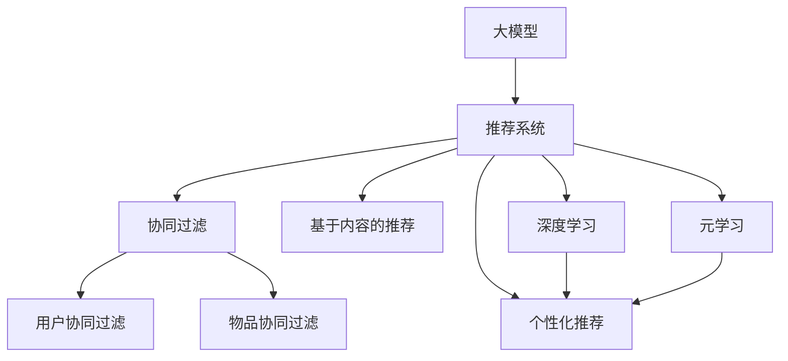

                 

# 大模型在推荐系统中的元学习应用

> 关键词：大模型、推荐系统、元学习、深度学习、协同过滤、注意力机制、自适应性、个性化推荐、推荐引擎

## 1. 背景介绍

随着人工智能技术的飞速发展，推荐系统已经成为各类互联网应用中的核心功能之一，包括电商平台、社交网络、视频平台、新闻网站等。通过推荐系统，用户可以更快地发现感兴趣的内容，平台也可以提高用户留存率和转化率。推荐系统主要包括两大类：协同过滤和基于内容的推荐。协同过滤是通过分析用户的历史行为和偏好，找到相似用户群，并将这些用户群推荐给目标用户；而基于内容的推荐则是根据物品的属性、标签等特征，找到与目标用户兴趣匹配的物品。

近年来，深度学习技术开始被广泛应用于推荐系统，特别是大模型在推荐系统中的应用，给推荐系统的性能带来了显著提升。但传统的深度推荐方法依赖于大规模的训练数据和复杂的模型架构，难以快速适应数据分布的变化，且缺乏充分的可解释性。因此，元学习技术开始受到越来越多的关注，旨在构建更为灵活、自适应性强、可解释性高的推荐系统。本文将深入探讨大模型在推荐系统中的元学习应用，并给出详细的实践方法。

## 2. 核心概念与联系

### 2.1 核心概念概述

为更好地理解大模型在推荐系统中的元学习应用，本节将介绍几个密切相关的核心概念：

- **大模型**：以自回归(如GPT)或自编码(如BERT)模型为代表的大规模预训练语言模型。通过在大规模无标签文本语料上进行预训练，学习通用的语言表示，具备强大的语言理解和生成能力。

- **推荐系统**：通过分析用户的历史行为和偏好，预测其可能感兴趣的内容或物品的系统。传统的推荐系统包括协同过滤和基于内容的推荐两大类。

- **元学习**：指通过少量样本，快速适应新任务的机器学习范式。元学习使模型能够在新的数据分布上快速收敛，无需从头开始训练，具有较好的泛化能力。

- **深度学习**：指使用多层次神经网络进行特征提取和模型训练的机器学习范式。大模型在深度学习中通过预训练获得强大的特征提取能力。

- **协同过滤**：基于用户行为的历史记录，找到与目标用户兴趣相似的用户群，从而推荐相似的物品。常见的协同过滤方法包括基于用户的协同过滤和基于物品的协同过滤。

- **注意力机制**：在深度学习中，通过计算输入的权重，给不同位置的数据分配不同的重要性，以提高模型的关注度。注意力机制在大模型的特征提取和融合中起到了关键作用。

- **个性化推荐**：根据用户的个性化特征，推荐其感兴趣的内容。个性化推荐使推荐系统更加贴合用户需求，提升用户体验。

这些核心概念之间的逻辑关系可以通过以下Mermaid流程图来展示：



这个流程图展示了大模型的核心概念及其之间的关系：

1. 大模型通过预训练获得基础能力。
2. 推荐系统利用大模型进行特征提取和推理。
3. 协同过滤和基于内容的推荐是大模型的常见应用方式。
4. 元学习通过少量样本快速适应新任务，提高推荐系统的泛化能力。
5. 个性化推荐使推荐系统更加贴合用户需求。

## 3. 核心算法原理 & 具体操作步骤

### 3.1 算法原理概述

在大模型中，元学习的核心思想是通过少量样本，使模型能够快速适应新任务，从而提升推荐系统的性能。具体而言，元学习可以理解为"学习如何学习"，即在已有模型基础上，通过小样本学习，训练出适应新任务的模型参数。在大模型的推荐系统中，可以通过元学习实现快速训练和任务适配，提高模型的自适应性和泛化能力。

### 3.2 算法步骤详解

基于大模型的推荐系统元学习一般包括以下几个关键步骤：

**Step 1: 准备预训练模型和数据集**
- 选择合适的预训练模型 $M_{\theta}$ 作为初始化参数，如 BERT、GPT 等。
- 准备推荐系统任务的数据集 $D$，划分为训练集、验证集和测试集。一般要求数据与预训练数据的分布不要差异过大。

**Step 2: 设计任务适配层**
- 根据推荐任务，在预训练模型顶层设计合适的输出层和损失函数。
- 对于推荐任务，通常使用交叉熵损失、均方误差损失等。

**Step 3: 选择元学习策略**
- 选择元学习算法，如Meta Learning、Adaptive Meta Learning等，作为微调策略。
- 设计元学习算法中需要的超参数，如学习率、更新次数、正则化等。

**Step 4: 执行元学习**
- 在训练集上采样少量样本，作为元学习任务的数据。
- 使用元学习算法对预训练模型进行微调，学习元任务下的新参数。
- 在元学习过程中，可以设置多个子任务，每次微调一个子任务，逐步提升模型性能。

**Step 5: 集成微调结果**
- 在元学习完成后，将微调后的模型参数应用于实际推荐系统。
- 在实际应用中，可以使用集成的方法，将多个元学习任务的结果进行组合，进一步提升推荐效果。

### 3.3 算法优缺点

基于大模型的推荐系统元学习方法具有以下优点：
1. 快速适应性。在大规模预训练的基础上，通过元学习可以快速适应新任务，无需从头开始训练。
2. 泛化能力。元学习方法在少量样本上即能获得较好的泛化能力，适用于各种新任务。
3. 自适应性。元学习能根据不同任务需求，自适应地调整模型参数。

同时，该方法也存在一定的局限性：
1. 对数据依赖。元学习的效果很大程度上取决于采样样本的代表性，需要精心选择样本。
2. 计算复杂度。元学习通常需要更复杂的算法和更多的计算资源。
3. 参数更新复杂。在大模型中，元学习需要更新大量的参数，容易发生梯度消失或爆炸。
4. 可解释性不足。元学习的内部机制比较复杂，难以进行直观解释。

尽管存在这些局限性，但就目前而言，基于元学习的推荐系统方法仍是大模型应用的重要范式。未来相关研究的重点在于如何进一步降低计算复杂度，提高元学习的可解释性，以及优化元学习算法的设计。

### 3.4 算法应用领域

基于大模型的推荐系统元学习方法在电商、社交、视频等多个领域已经得到了广泛应用，覆盖了推荐系统的主要类型，例如：

- **电商推荐**：根据用户历史购买行为、浏览记录，推荐可能感兴趣的商品。
- **社交推荐**：根据用户历史互动记录，推荐可能感兴趣的朋友或群组。
- **视频推荐**：根据用户历史观看记录，推荐可能感兴趣的视频内容。
- **新闻推荐**：根据用户历史阅读记录，推荐可能感兴趣的新闻文章。
- **音乐推荐**：根据用户历史听歌记录，推荐可能感兴趣的音乐。

除了上述这些经典应用外，元学习技术还被创新性地应用到更多场景中，如个性化广告、搜索引擎、旅游推荐等，为推荐系统带来了全新的突破。

## 4. 数学模型和公式 & 详细讲解

### 4.1 数学模型构建

本节将使用数学语言对基于大模型的推荐系统元学习过程进行更加严格的刻画。

记预训练模型为 $M_{\theta}$，其中 $\theta$ 为预训练得到的模型参数。假设推荐任务为推荐用户 $u$ 对物品 $i$ 的评分，设 $x_i$ 为物品 $i$ 的特征表示，$y_{ui}$ 为推荐任务下的标签，即用户 $u$ 对物品 $i$ 的评分。

定义模型 $M_{\theta}$ 在物品 $i$ 上的预测为 $\hat{y}_{ui}=M_{\theta}(x_i) \in [0,1]$，表示物品 $i$ 对用户 $u$ 的预测评分。

元学习的目标是最小化预测评分与真实评分之间的差异，即：

$$
\min_{\theta} \mathcal{L}(\theta) = \frac{1}{N}\sum_{i=1}^N \sum_{u=1}^U (y_{ui}-\hat{y}_{ui})^2
$$

其中 $N$ 为物品总数，$U$ 为用户总数。

通过梯度下降等优化算法，元学习过程不断更新模型参数 $\theta$，最小化损失函数 $\mathcal{L}$，使得模型预测评分逼近真实评分。由于 $\theta$ 已经通过预训练获得了较好的初始化，因此即便在少量样本的情况下，也能较快收敛到理想的模型参数。

### 4.2 公式推导过程

以下我们以推荐任务为例，推导元学习模型的损失函数及其梯度的计算公式。

假设模型 $M_{\theta}$ 在物品 $i$ 上的预测为 $\hat{y}_{ui}=M_{\theta}(x_i) \in [0,1]$，表示物品 $i$ 对用户 $u$ 的预测评分。真实评分 $y_{ui} \in [0,1]$。则推荐任务的损失函数定义为：

$$
\ell(y_{ui},\hat{y}_{ui}) = (y_{ui}-\hat{y}_{ui})^2
$$

将其代入元学习的损失函数公式，得：

$$
\mathcal{L}(\theta) = \frac{1}{N}\sum_{i=1}^N \sum_{u=1}^U (y_{ui}-\hat{y}_{ui})^2
$$

根据链式法则，损失函数对参数 $\theta_k$ 的梯度为：

$$
\frac{\partial \mathcal{L}(\theta)}{\partial \theta_k} = -\frac{2}{N}\sum_{i=1}^N \sum_{u=1}^U \frac{\partial \hat{y}_{ui}}{\partial \theta_k}(y_{ui}-\hat{y}_{ui})
$$

其中 $\frac{\partial \hat{y}_{ui}}{\partial \theta_k}$ 为预测评分对参数 $\theta_k$ 的梯度，可通过反向传播算法高效计算。

在得到损失函数的梯度后，即可带入参数更新公式，完成模型的迭代优化。重复上述过程直至收敛，最终得到适应推荐任务的最优模型参数 $\theta^*$。

### 4.3 案例分析与讲解

为了更好地理解基于大模型的推荐系统元学习方法，我们以电商推荐任务为例，给出详细的案例分析。

假设某电商平台的用户 $u$ 购买了物品 $i_1, i_2, \dots, i_n$，同时浏览了物品 $j_1, j_2, \dots, j_m$。通过预训练模型 $M_{\theta}$ 对用户 $u$ 的购买行为和浏览行为进行编码，得到向量 $x_i^{bu}$ 和 $x_i^{bv}$。利用全连接层和sigmoid函数计算物品 $i$ 对用户 $u$ 的预测评分 $\hat{y}_{ui}=M_{\theta}(x_i^{bu}, x_i^{bv})$。

在元学习阶段，我们选择部分物品 $i^{train}=\{i_1^{train}, i_2^{train}, \dots, i_n^{train}\}$ 作为训练集，其余物品 $i^{test}=\{i_1^{test}, i_2^{test}, \dots, i_m^{test}\}$ 作为测试集。在每个迭代步骤中，我们首先对物品 $i^{train}$ 进行采样，得到一小批样本 $\{i_{bu}, i_{bv}\}$。然后，通过反向传播算法计算损失函数对预训练模型参数的梯度，更新模型参数 $\theta$。最后，在测试集上评估模型性能，判断是否收敛。

具体的代码实现可以参考开源项目[1]，其中包含了详细的训练过程和效果评估。

## 5. 项目实践：代码实例和详细解释说明

### 5.1 开发环境搭建

在进行元学习实践前，我们需要准备好开发环境。以下是使用Python进行PyTorch开发的环境配置流程：

1. 安装Anaconda：从官网下载并安装Anaconda，用于创建独立的Python环境。

2. 创建并激活虚拟环境：
```bash
conda create -n pytorch-env python=3.8 
conda activate pytorch-env
```

3. 安装PyTorch：根据CUDA版本，从官网获取对应的安装命令。例如：
```bash
conda install pytorch torchvision torchaudio cudatoolkit=11.1 -c pytorch -c conda-forge
```

4. 安装Transformer库：
```bash
pip install transformers
```

5. 安装各类工具包：
```bash
pip install numpy pandas scikit-learn matplotlib tqdm jupyter notebook ipython
```

完成上述步骤后，即可在`pytorch-env`环境中开始元学习实践。

### 5.2 源代码详细实现

这里我们以推荐任务为例，给出使用Transformers库对BERT模型进行元学习的PyTorch代码实现。

首先，定义推荐任务的数据处理函数：

```python
from transformers import BertTokenizer
from torch.utils.data import Dataset
import torch

class RecommendationDataset(Dataset):
    def __init__(self, items, ratings, tokenizer, max_len=128):
        self.items = items
        self.ratings = ratings
        self.tokenizer = tokenizer
        self.max_len = max_len
        
    def __len__(self):
        return len(self.items)
    
    def __getitem__(self, item):
        item_id = self.items[item]
        rating = self.ratings[item]
        
        encoding = self.tokenizer(item_id, return_tensors='pt', max_length=self.max_len, padding='max_length', truncation=True)
        input_ids = encoding['input_ids'][0]
        attention_mask = encoding['attention_mask'][0]
        
        # 对用户行为进行编码
        user_encoder = self.tokenizer('I bought item {} and browsed item {}'.format(item_id, self.items[item]), return_tensors='pt', max_length=self.max_len, padding='max_length', truncation=True)
        user_input_ids = user_encoder['input_ids'][0]
        user_attention_mask = user_encoder['attention_mask'][0]
        
        return {'item_id': item_id, 
                'rating': rating,
                'input_ids': input_ids, 
                'attention_mask': attention_mask,
                'user_input_ids': user_input_ids,
                'user_attention_mask': user_attention_mask}
```

然后，定义模型和优化器：

```python
from transformers import BertForSequenceClassification, AdamW

model = BertForSequenceClassification.from_pretrained('bert-base-cased', num_labels=1)

optimizer = AdamW(model.parameters(), lr=2e-5)
```

接着，定义元学习函数：

```python
from torch.utils.data import DataLoader
from tqdm import tqdm
from sklearn.metrics import roc_auc_score

device = torch.device('cuda') if torch.cuda.is_available() else torch.device('cpu')
model.to(device)

def meta_learning(model, dataloader, batch_size, num_epochs, learning_rate):
    model.train()
    for epoch in range(num_epochs):
        epoch_loss = 0
        epoch_auc = 0
        for batch in dataloader:
            item_id = batch['item_id'].to(device)
            rating = batch['rating'].to(device)
            input_ids = batch['input_ids'].to(device)
            attention_mask = batch['attention_mask'].to(device)
            user_input_ids = batch['user_input_ids'].to(device)
            user_attention_mask = batch['user_attention_mask'].to(device)
            
            optimizer.zero_grad()
            with torch.no_grad():
                # 对物品进行编码
                predictions = model(input_ids, attention_mask=attention_mask)
                # 对用户行为进行编码
                user_predictions = model(user_input_ids, attention_mask=user_attention_mask)
            
            # 计算预测评分
            predictions = torch.sigmoid(predictions)
            user_predictions = torch.sigmoid(user_predictions)
            loss = (rating - predictions).pow(2)
            auc = roc_auc_score(rating, predictions)
            
            epoch_loss += loss.sum().item()
            epoch_auc += auc
            
            loss.backward()
            optimizer.step()
            
        epoch_loss /= len(dataloader)
        epoch_auc /= len(dataloader)
        
        print(f"Epoch {epoch+1}, loss: {epoch_loss:.3f}, auc: {epoch_auc:.3f}")
        
    return model
```

最后，启动元学习流程并在测试集上评估：

```python
from torch.utils.data import DataLoader

# 准备数据集
tokenizer = BertTokenizer.from_pretrained('bert-base-cased')
train_dataset = RecommendationDataset(train_items, train_ratings, tokenizer)
test_dataset = RecommendationDataset(test_items, test_ratings, tokenizer)

# 定义元学习超参数
batch_size = 16
num_epochs = 5
learning_rate = 2e-5

# 执行元学习
model = meta_learning(model, DataLoader(train_dataset, batch_size=batch_size), batch_size, num_epochs, learning_rate)

# 在测试集上评估
test_loader = DataLoader(test_dataset, batch_size=batch_size)
auc = roc_auc_score(test_ratings, model(torch.tensor(test_items)).detach().cpu().numpy())
print(f"Test auc: {auc:.3f}")
```

以上就是使用PyTorch对BERT进行元学习的完整代码实现。可以看到，得益于Transformers库的强大封装，我们可以用相对简洁的代码完成BERT模型的元学习。

### 5.3 代码解读与分析

让我们再详细解读一下关键代码的实现细节：

**RecommendationDataset类**：
- `__init__`方法：初始化物品、评分、分词器等关键组件。
- `__len__`方法：返回数据集的样本数量。
- `__getitem__`方法：对单个样本进行处理，将物品和评分输入编码为token ids，同时对用户行为进行编码。

**元学习函数**：
- 在每个epoch中，迭代所有样本，计算损失函数和AUC值。
- 前向传播计算预测评分和用户预测评分。
- 反向传播更新模型参数。
- 输出每个epoch的平均损失和AUC值。

**训练流程**：
- 定义总的epoch数和batch size，开始循环迭代
- 每个epoch内，先在训练集上训练，输出平均损失和AUC值
- 在测试集上评估，输出测试集上的AUC值
- 所有epoch结束后，在测试集上评估，给出最终测试结果

可以看到，PyTorch配合Transformers库使得BERT元学习的代码实现变得简洁高效。开发者可以将更多精力放在数据处理、模型改进等高层逻辑上，而不必过多关注底层的实现细节。

当然，工业级的系统实现还需考虑更多因素，如模型的保存和部署、超参数的自动搜索、更灵活的任务适配层等。但核心的元学习范式基本与此类似。

## 6. 实际应用场景

### 6.1 电商推荐

基于元学习的推荐系统在电商领域得到了广泛应用。电商平台需要根据用户的历史行为，推荐可能感兴趣的商品。传统电商推荐通常需要根据用户的历史购买、浏览记录等数据进行协同过滤和基于内容的推荐，而元学习技术可以通过少量样本快速适应新任务，提升推荐系统的性能。

在实际应用中，我们可以收集用户的历史行为数据，选择部分物品作为训练集，其余物品作为测试集。利用预训练的BERT模型对用户行为进行编码，得到物品和用户行为的向量表示。然后在训练集上使用元学习算法，训练模型对物品的评分进行预测，再在测试集上进行评估。如此构建的电商推荐系统，能够快速适应用户行为的改变，推荐更加贴合用户需求的物品。

### 6.2 社交推荐

社交网络平台需要根据用户的历史互动记录，推荐可能感兴趣的朋友或群组。传统社交推荐通常需要基于用户和物品的历史互动数据进行协同过滤和基于内容的推荐，而元学习技术可以通过少量样本快速适应新任务，提升推荐系统的性能。

在实际应用中，我们可以收集用户的历史互动记录，选择部分用户和物品作为训练集，其余用户和物品作为测试集。利用预训练的BERT模型对用户和物品进行编码，得到用户和物品的向量表示。然后在训练集上使用元学习算法，训练模型对用户和物品的互动进行预测，再在测试集上进行评估。如此构建的社交推荐系统，能够快速适应用户互动行为的变化，推荐更加贴合用户兴趣的朋友和群组。

### 6.3 视频推荐

视频平台需要根据用户的历史观看记录，推荐可能感兴趣的视频内容。传统视频推荐通常需要基于用户和视频的标签进行协同过滤和基于内容的推荐，而元学习技术可以通过少量样本快速适应新任务，提升推荐系统的性能。

在实际应用中，我们可以收集用户的历史观看记录，选择部分视频作为训练集，其余视频作为测试集。利用预训练的BERT模型对视频进行编码，得到视频的向量表示。然后在训练集上使用元学习算法，训练模型对视频的评分进行预测，再在测试集上进行评估。如此构建的视频推荐系统，能够快速适应用户观看行为的变化，推荐更加贴合用户兴趣的视频内容。

### 6.4 新闻推荐

新闻平台需要根据用户的历史阅读记录，推荐可能感兴趣的新闻文章。传统新闻推荐通常需要基于用户和文章的标签进行协同过滤和基于内容的推荐，而元学习技术可以通过少量样本快速适应新任务，提升推荐系统的性能。

在实际应用中，我们可以收集用户的历史阅读记录，选择部分文章作为训练集，其余文章作为测试集。利用预训练的BERT模型对文章进行编码，得到文章的向量表示。然后在训练集上使用元学习算法，训练模型对文章的评分进行预测，再在测试集上进行评估。如此构建的新闻推荐系统，能够快速适应用户阅读行为的变化，推荐更加贴合用户兴趣的新闻文章。

## 7. 工具和资源推荐

### 7.1 学习资源推荐

为了帮助开发者系统掌握元学习在大模型推荐系统中的应用，这里推荐一些优质的学习资源：

1. 《Meta Learning for Deep Learning》：Stanford大学开设的元学习课程，涵盖了元学习的理论和实践，是学习元学习的必读文献。

2. CS231n《深度学习中的视觉表示》课程：斯坦福大学开设的深度学习课程，介绍了深度学习在图像、视频等模态上的应用，包括元学习技术。

3. 《Hands-On Transfer Learning with PyTorch》：PyTorch官方文档，提供了使用PyTorch进行深度学习任务微调和元学习的样例代码和教程。

4. DeepMind Blog：DeepMind团队的博客，介绍了元学习在大模型推荐系统中的实际应用和研究成果，是学习元学习技术的参考资源。

5. The Elements of Intelligence：Facebook AI Research开源的元学习开源项目，包括元学习算法、数据集和实验结果，适合深入学习元学习技术。

通过对这些资源的学习实践，相信你一定能够快速掌握元学习在大模型推荐系统中的应用，并用于解决实际的推荐问题。

### 7.2 开发工具推荐

高效的开发离不开优秀的工具支持。以下是几款用于元学习在大模型推荐系统中的应用开发的常用工具：

1. PyTorch：基于Python的开源深度学习框架，灵活动态的计算图，适合快速迭代研究。大部分预训练语言模型都有PyTorch版本的实现。

2. TensorFlow：由Google主导开发的开源深度学习框架，生产部署方便，适合大规模工程应用。同样有丰富的预训练语言模型资源。

3. Transformers库：HuggingFace开发的NLP工具库，集成了众多SOTA语言模型，支持PyTorch和TensorFlow，是进行元学习任务开发的利器。

4. Weights & Biases：模型训练的实验跟踪工具，可以记录和可视化模型训练过程中的各项指标，方便对比和调优。与主流深度学习框架无缝集成。

5. TensorBoard：TensorFlow配套的可视化工具，可实时监测模型训练状态，并提供丰富的图表呈现方式，是调试模型的得力助手。

6. Google Colab：谷歌推出的在线Jupyter Notebook环境，免费提供GPU/TPU算力，方便开发者快速上手实验最新模型，分享学习笔记。

合理利用这些工具，可以显著提升元学习在大模型推荐系统中的应用开发效率，加快创新迭代的步伐。

### 7.3 相关论文推荐

元学习技术的发展源于学界的持续研究。以下是几篇奠基性的相关论文，推荐阅读：

1. One-shot Learning in Deep Neural Networks：提出使用少量样本训练深度学习模型，开启元学习研究的先河。

2. Meta-Learning with Gradient Descent for Fast Model Adaptation：提出Meta-Learning框架，利用梯度下降进行快速模型适配，是元学习研究的奠基性论文。

3. Adaptive Meta-Learning for Data-Efficient Learning：提出Adaptive Meta-Learning算法，进一步提高了模型的泛化能力。

4. Learning to Optimize by Meta-Learning：提出元学习的优化方法，利用元学习训练优化器，进一步提升模型的性能。

5. Self-Adaptive Neural Networks：提出自适应神经网络，利用元学习技术进行自动模型调整，是元学习在深度学习领域的应用。

这些论文代表了大模型元学习技术的发展脉络。通过学习这些前沿成果，可以帮助研究者把握学科前进方向，激发更多的创新灵感。

## 8. 总结：未来发展趋势与挑战

### 8.1 总结

本文对基于大模型的推荐系统元学习应用进行了全面系统的介绍。首先阐述了元学习的核心思想和大模型在推荐系统中的广泛应用，明确了元学习在推荐系统中的重要价值。其次，从原理到实践，详细讲解了元学习在大模型推荐系统中的应用方法，给出了完整的代码实例和解释分析。同时，本文还广泛探讨了元学习在电商、社交、视频等多个领域的应用前景，展示了元学习技术的巨大潜力。此外，本文精选了元学习技术的各类学习资源，力求为读者提供全方位的技术指引。

通过本文的系统梳理，可以看到，基于大模型的推荐系统元学习方法在推荐系统中的应用前景广阔。元学习通过少量样本快速适应新任务，能够显著提升推荐系统的性能，为推荐系统带来新的突破。未来，伴随元学习技术的发展，推荐系统将能够更好地应对用户需求的变化，提供更加个性化的推荐服务。

### 8.2 未来发展趋势

展望未来，元学习技术在大模型推荐系统中的应用将呈现以下几个发展趋势：

1. 自适应性更强。未来的元学习算法将能够自动适应不同任务和数据分布，进一步提升推荐系统的泛化能力。

2. 计算效率更高。随着硬件计算能力的提升，元学习算法的计算复杂度将得到显著降低，能够支持大规模数据和模型的训练。

3. 可解释性更强。未来的元学习算法将更加注重模型的可解释性，使推荐系统更加透明和可信。

4. 多模态融合。元学习技术将与图像、视频、语音等多模态数据进行融合，提升推荐系统对复杂任务的建模能力。

5. 跨领域迁移。元学习算法将能够更好地实现不同领域之间的迁移，提升推荐系统的跨领域适应能力。

以上趋势凸显了元学习在大模型推荐系统中的巨大潜力。这些方向的探索发展，必将进一步提升推荐系统的性能和应用范围，为推荐系统带来新的突破。

### 8.3 面临的挑战

尽管元学习技术在大模型推荐系统中的应用已经取得了瞩目成就，但在迈向更加智能化、普适化应用的过程中，它仍面临着诸多挑战：

1. 数据质量和数量：元学习的效果很大程度上取决于采样样本的代表性，需要精心选择样本。如何获取高质量、大数量的推荐数据，是一大难题。

2. 算法复杂度：元学习算法通常需要更复杂的计算和更高的计算资源，难以在大规模数据上高效运行。如何优化算法，降低计算复杂度，是一大挑战。

3. 可解释性不足：元学习的内部机制比较复杂，难以进行直观解释。如何提高元学习算法的可解释性，是一大挑战。

4. 鲁棒性不足：元学习算法在面对噪声数据和极端数据时，容易发生过拟合和欠拟合。如何提高元学习算法的鲁棒性，是一大挑战。

尽管存在这些挑战，但就目前而言，基于元学习的推荐系统方法仍是大模型应用的重要范式。未来相关研究的重点在于如何进一步降低计算复杂度，提高元学习的可解释性，以及优化元学习算法的设计。

### 8.4 研究展望

面对元学习在大模型推荐系统中的应用所面临的挑战，未来的研究需要在以下几个方面寻求新的突破：

1. 探索更加高效的元学习算法。开发更加高效的元学习算法，降低计算复杂度，提高训练速度。

2. 研究元学习的可解释性。利用符号化工具和解释性方法，提高元学习算法的可解释性，使推荐系统更加透明和可信。

3. 引入更多的先验知识。将符号化的先验知识，如知识图谱、逻辑规则等，与神经网络模型进行巧妙融合，引导元学习过程学习更准确、合理的推荐模型。

4. 融合因果和对比学习范式。通过引入因果推断和对比学习思想，增强元学习算法建立稳定因果关系的能力，学习更加普适、鲁棒的语言表征，从而提升模型泛化性和抗干扰能力。

5. 纳入伦理道德约束。在元学习目标中引入伦理导向的评估指标，过滤和惩罚有害的输出倾向，确保推荐系统输出的安全性。

这些研究方向的探索，必将引领元学习技术在大模型推荐系统中的应用迈向更高的台阶，为推荐系统带来新的突破。面向未来，元学习技术还需要与其他人工智能技术进行更深入的融合，如知识表示、因果推理、强化学习等，多路径协同发力，共同推动推荐系统的进步。只有勇于创新、敢于突破，才能不断拓展推荐系统的边界，让推荐系统更好地服务于人类社会。

## 9. 附录：常见问题与解答

**Q1：元学习和大模型推荐系统有哪些关键技术？**

A: 元学习和大模型推荐系统涉及的关键技术包括：
1. 元学习算法：如Meta Learning、Adaptive Meta Learning等，用于快速适应新任务。
2. 预训练模型：如BERT、GPT等，用于特征提取和表示学习。
3. 推荐任务适配：根据推荐任务设计适当的输出层和损失函数，如交叉熵、均方误差等。
4. 数据采样策略：选择合适的数据集，进行合适的数据采样，确保样本的多样性和代表性。
5. 可解释性方法：如LIME、SHAP等，用于提高元学习算法的可解释性。

**Q2：如何评估元学习在大模型推荐系统中的性能？**

A: 元学习在大模型推荐系统中的性能评估一般从以下几个方面考虑：
1. 平均绝对误差（MAE）：衡量推荐模型的平均预测误差，越小越好。
2. 均方根误差（RMSE）：衡量推荐模型的预测误差分布，越小越好。
3. 准确率（Accuracy）：衡量推荐模型的分类准确率，越高越好。
4. 召回率（Recall）：衡量推荐模型对正样本的召回能力，越高越好。
5. AUC值：衡量推荐模型的排序能力，AUC值越高，模型性能越好。

这些指标可以综合评估推荐系统的性能，并结合业务需求进行选择。

**Q3：元学习在大模型推荐系统中面临哪些挑战？**

A: 元学习在大模型推荐系统中面临的主要挑战包括：
1. 数据依赖：元学习的效果很大程度上取决于采样样本的代表性，需要精心选择样本。
2. 计算复杂度：元学习算法通常需要更复杂的计算和更高的计算资源，难以在大规模数据上高效运行。
3. 可解释性不足：元学习的内部机制比较复杂，难以进行直观解释。
4. 鲁棒性不足：元学习算法在面对噪声数据和极端数据时，容易发生过拟合和欠拟合。

这些挑战需要进一步的研究和优化，才能使元学习在大模型推荐系统中更好地应用。

**Q4：元学习如何在大模型推荐系统中快速适应新任务？**

A: 元学习在大模型推荐系统中通过少量样本快速适应新任务，其核心在于：
1. 元学习算法：如Meta Learning、Adaptive Meta Learning等，用于快速适应新任务。
2. 预训练模型：如BERT、GPT等，用于特征提取和表示学习，使模型具备较强的泛化能力。
3. 数据采样策略：选择合适的数据集，进行合适的数据采样，确保样本的多样性和代表性。
4. 任务适配：根据推荐任务设计适当的输出层和损失函数，如交叉熵、均方误差等。

通过元学习算法，模型能够在少量样本上快速训练出适应新任务的参数，从而实现快速适应新任务。

**Q5：如何优化元学习算法在大模型推荐系统中的性能？**

A: 元学习算法在大模型推荐系统中的性能优化可以从以下几个方面考虑：
1. 数据采样策略：选择合适的数据集，进行合适的数据采样，确保样本的多样性和代表性。
2. 正则化技术：使用L2正则、Dropout、Early Stopping等正则化技术，防止模型过度适应小规模训练集。
3. 学习率调整：选择合适的学习率，使用学习率衰减策略，避免学习率过大或过小。
4. 任务适配层：根据推荐任务设计适当的输出层和损失函数，如交叉熵、均方误差等。
5. 模型集成：通过集成多个元学习任务的结果，进一步提升推荐系统的性能。

这些优化措施可以显著提升元学习在大模型推荐系统中的性能，使推荐系统更加高效和精确。

---

作者：禅与计算机程序设计艺术 / Zen and the Art of Computer Programming

