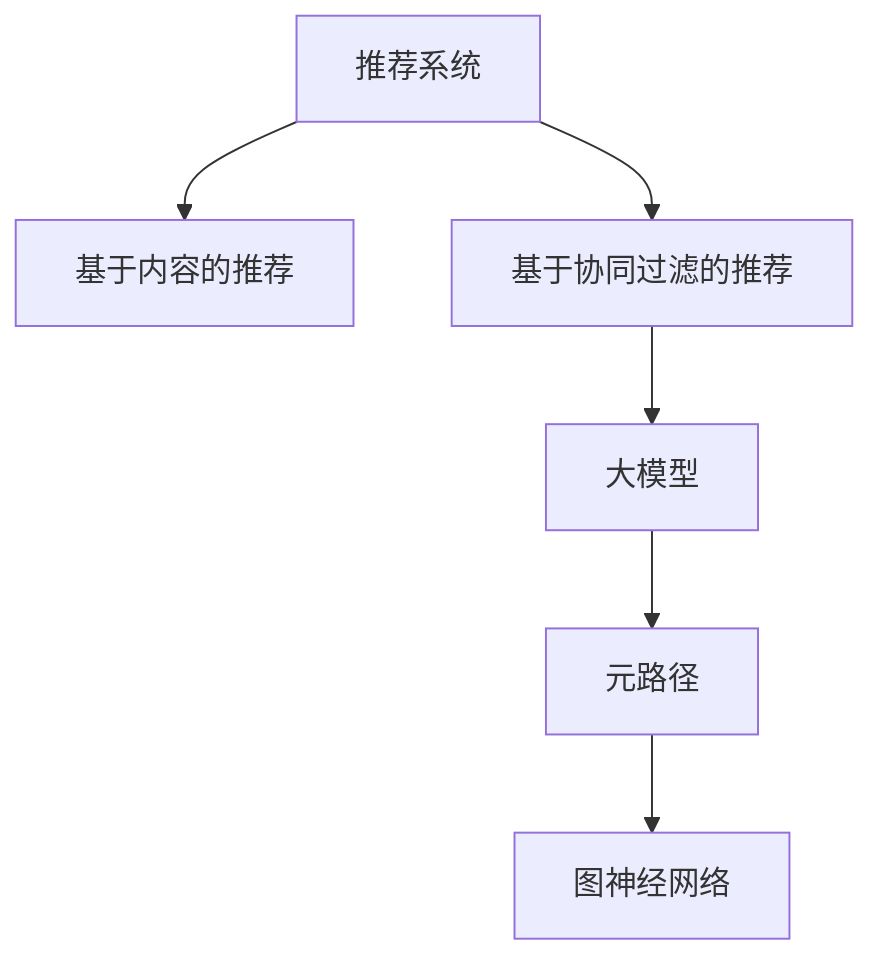

                 

# 大模型在推荐系统中的元路径挖掘应用

## 1. 背景介绍

### 1.1 问题由来

推荐系统作为一种智能化的信息筛选工具，已经广泛应用于电子商务、视频流媒体、社交网络等领域，极大地提高了用户获取信息的质量和效率。传统推荐系统多基于协同过滤、矩阵分解等方法，通过对用户历史行为进行建模，推测用户兴趣并推荐可能感兴趣的内容。然而，这些方法往往对稀疏数据的处理和推荐多样性都有一定的局限性。

近年来，大模型技术不断突破，如BERT、GPT、XLNet等在NLP领域取得了突出的成果，已经被广泛应用于文本分类、问答、机器翻译等任务。如何有效利用大模型进行推荐系统开发，成为了当前推荐系统研究的热点。

### 1.2 问题核心关键点

推荐系统的核心目标是通过对用户历史行为数据的分析，推测用户的兴趣并推荐相关物品。然而，由于用户数据的多样性和不确定性，直接利用历史数据进行推荐往往无法准确反映用户真正的兴趣。基于大模型，可以从用户的行为数据中挖掘更深层次的特征，辅助推荐决策。

推荐系统可以大致分为基于内容的推荐和基于协同过滤的推荐。前者通过用户行为数据的文本特征提取，结合大模型的泛化能力进行推荐。后者通过用户行为数据的相似度匹配，利用大模型从用户历史行为中学习到隐式的协同特征，辅助推荐决策。

### 1.3 问题研究意义

利用大模型进行推荐系统开发，有助于提升推荐精度和个性化程度。一方面，大模型可以从用户历史数据中学习到丰富的语义和上下文信息，能够捕捉到用户潜在的兴趣点。另一方面，大模型的预训练和微调过程，通过大尺度数据和复杂结构的优化，提高了推荐系统的泛化能力和适应性。

当前，大模型推荐系统已经在电商、新闻、视频等诸多领域取得了成功应用，显示出巨大的商业价值。因此，研究如何有效利用大模型进行推荐系统开发，对于提升推荐系统的智能化和精准度，推动经济社会数字化转型，具有重要意义。

## 2. 核心概念与联系

### 2.1 核心概念概述

为更好地理解利用大模型进行推荐系统开发的原理和方法，本节将介绍几个关键概念：

- 推荐系统(Recommendation System)：智能化的信息筛选工具，根据用户历史行为数据，推测用户兴趣并推荐相关物品。推荐系统可以分为基于内容的推荐和基于协同过滤的推荐两大类。
- 大模型(Large Model)：以BERT、GPT为代表的具有亿级参数的大规模预训练模型，具备强大的语义理解和生成能力。
- 元路径(Meta-Path)：用于图神经网络建模的图数据组织方式，通过提取有意义的路径关系，提高模型的特征表达能力。
- 图神经网络(Graph Neural Network, GNN)：一类用于图结构数据建模的深度学习方法，具有强大的特征学习能力和泛化能力。

这些核心概念之间的逻辑关系可以通过以下Mermaid流程图来展示：



这个流程图展示了推荐系统与大模型和图神经网络的关系：

1. 推荐系统可以分为基于内容的推荐和基于协同过滤的推荐。
2. 基于内容的推荐利用大模型从用户历史数据中提取特征，并结合大模型的泛化能力进行推荐。
3. 基于协同过滤的推荐利用图神经网络从用户历史数据中学习协同特征，并辅助推荐决策。
4. 图神经网络和大模型结合元路径组织图结构数据，进一步提升推荐系统的特征表达能力和泛化能力。

## 3. 核心算法原理 & 具体操作步骤
### 3.1 算法原理概述

利用大模型进行推荐系统开发，本质上是通过图神经网络建模用户历史数据，并结合大模型的语义理解能力进行推荐决策。其核心思想是：

1. 利用大模型提取用户历史数据的文本特征。
2. 利用图神经网络建模用户历史行为的关系，学习协同特征。
3. 结合文本特征和协同特征，综合进行推荐决策。

具体而言，以基于内容的推荐系统为例，可以采用以下步骤：

1. 收集用户历史行为数据，并提取文本特征。
2. 利用大模型对文本特征进行预训练，学习用户的兴趣语义表示。
3. 将用户历史行为数据转化为图结构数据，并利用图神经网络建模。
4. 将预训练的兴趣语义表示和协同特征融合，进行推荐决策。

### 3.2 算法步骤详解

基于大模型进行推荐系统的开发，主要分为数据预处理、大模型预训练、图结构数据建模和推荐决策四个步骤：

**Step 1: 数据预处理**

1. 收集用户历史行为数据，包括点击、浏览、购买、评价等行为数据。
2. 对行为数据进行清洗、去重、归一化等预处理操作，去除噪声数据。
3. 对行为数据进行时间序列划分，将近期的行为数据作为最新数据。
4. 将行为数据转化为文本格式，如将物品描述、用户评价等转换为文本形式。

**Step 2: 大模型预训练**

1. 选择合适的预训练模型，如BERT、GPT等，加载模型权重。
2. 将行为数据转化为文本格式，作为模型输入。
3. 利用大模型对文本数据进行预训练，学习用户的兴趣语义表示。
4. 保存预训练后的模型权重，用于后续的图结构数据建模。

**Step 3: 图结构数据建模**

1. 将用户历史行为数据转化为图结构数据。可以通过将用户和物品作为节点，行为数据作为边，构建出用户-物品图。
2. 利用图神经网络对用户-物品图进行建模，学习协同特征。
3. 将大模型预训练的兴趣语义表示与协同特征融合，得到融合后的特征向量。

**Step 4: 推荐决策**

1. 将最新用户行为数据转化为文本格式，作为模型输入。
2. 利用大模型对行为数据进行预训练，学习新的兴趣语义表示。
3. 将最新行为数据与用户历史行为数据进行融合，得到融合后的特征向量。
4. 利用融合后的特征向量，结合协同特征进行推荐决策，输出推荐结果。

### 3.3 算法优缺点

利用大模型进行推荐系统开发，具有以下优点：

1. 泛化能力强。大模型具备强大的语义理解能力和泛化能力，能够捕捉用户兴趣的深层次特征。
2. 特征表达丰富。大模型通过预训练学习到丰富的语义和上下文信息，增强了推荐系统的特征表达能力。
3. 推荐效果显著。在大模型和大数据的辅助下，推荐系统能够精准推测用户兴趣并推荐相关物品。
4. 可解释性强。利用大模型，推荐系统能够提供较为详细的推荐理由，增强了用户的信任度。

同时，该方法也存在一定的局限性：

1. 数据依赖性高。大模型推荐系统需要大量标注数据进行预训练和微调，难以在大数据稀疏的领域取得理想效果。
2. 计算成本高。大模型和图神经网络模型的训练和推理需要高昂的计算资源，对硬件要求较高。
3. 模型复杂度高。大模型和图神经网络模型结构复杂，对工程实现和调参要求较高。
4. 推荐延迟高。大模型和图神经网络模型的推理速度较慢，可能影响推荐系统的实时性。

尽管存在这些局限性，但就目前而言，利用大模型进行推荐系统开发，仍然是提升推荐系统性能的重要手段。未来相关研究的重点在于如何降低计算成本、提升推荐速度，同时兼顾模型复杂度和用户隐私保护等要素。

### 3.4 算法应用领域

基于大模型进行推荐系统开发，已经在电商、新闻、视频等多个领域取得了成功应用，具体如下：

**电商推荐系统**

电商推荐系统利用用户行为数据进行商品推荐。通过将商品描述、用户评价等转化为文本数据，利用BERT等大模型进行预训练，学习用户对商品兴趣的语义表示。将用户历史行为数据转化为图结构数据，利用图神经网络学习商品之间的协同关系，最后结合文本特征和协同特征，综合进行推荐决策。

**新闻推荐系统**

新闻推荐系统利用用户浏览历史数据进行新闻推荐。通过将新闻标题、摘要等转化为文本数据，利用BERT等大模型进行预训练，学习用户对新闻兴趣的语义表示。将用户浏览历史数据转化为图结构数据，利用图神经网络学习新闻之间的协同关系，最后结合文本特征和协同特征，综合进行推荐决策。

**视频推荐系统**

视频推荐系统利用用户观看历史数据进行视频推荐。通过将视频标题、简介等转化为文本数据，利用BERT等大模型进行预训练，学习用户对视频兴趣的语义表示。将用户观看历史数据转化为图结构数据，利用图神经网络学习视频之间的协同关系，最后结合文本特征和协同特征，综合进行推荐决策。

除了上述这些经典应用外，大模型推荐系统还被创新性地应用于音乐推荐、广告推荐、股票投资等多个领域，为推荐系统带来了新的突破。随着大模型和图神经网络的不断进步，推荐系统的智能化和精准度将进一步提升，助力各类业务快速迭代和创新。

## 4. 数学模型和公式 & 详细讲解  
### 4.1 数学模型构建

本节将使用数学语言对利用大模型进行推荐系统开发的原理进行更加严格的刻画。

记用户历史行为数据为 $G=(U,E)$，其中 $U$ 为用户集合，$E$ 为行为边集合。用户 $u_i$ 和物品 $v_j$ 之间存在行为关系 $e_{ij}$，可以表示为二进制变量 $e_{ij} \in \{0,1\}$。

设用户兴趣语义表示为 $h_i$，物品语义表示为 $h_j$，利用大模型对行为数据进行预训练，得到兴趣语义表示和物品语义表示，分别表示为 $h_i=f_{\theta_i}(x_i)$ 和 $h_j=f_{\theta_j}(x_j)$，其中 $f_{\theta_i}$ 和 $f_{\theta_j}$ 为大模型，$x_i$ 和 $x_j$ 为行为数据。

利用图神经网络对用户历史行为数据进行建模，得到协同特征表示 $\tilde{h}_i$，可以表示为：

$$
\tilde{h}_i = \sum_{u_k \in \mathcal{N}(i)} \alpha_k h_k
$$

其中 $\mathcal{N}(i)$ 为与用户 $i$ 相连的用户集合，$\alpha_k$ 为注意力权重，表示用户 $k$ 与用户 $i$ 的关联程度。

将兴趣语义表示 $h_i$ 和协同特征表示 $\tilde{h}_i$ 融合，得到最终特征表示 $z_i$，可以表示为：

$$
z_i = \phi(h_i, \tilde{h}_i)
$$

其中 $\phi$ 为融合函数，将兴趣语义表示和协同特征表示进行加权融合。

最终，利用融合后的特征向量 $z_i$ 进行推荐决策，输出推荐结果 $r_i$，可以表示为：

$$
r_i = \sigma(z_i \cdot w)
$$

其中 $w$ 为推荐权重向量，$\sigma$ 为激活函数。

### 4.2 公式推导过程

下面以电商推荐系统为例，推导利用大模型进行推荐决策的公式。

假设用户 $u_i$ 对物品 $v_j$ 进行了 $m_{ij}$ 次点击行为。用户行为数据 $x_i$ 为物品描述和用户评价，物品行为数据 $x_j$ 为物品描述和物品评价。利用BERT等大模型对行为数据进行预训练，得到用户兴趣语义表示 $h_i$ 和物品语义表示 $h_j$。

利用图神经网络对用户行为数据进行建模，得到用户协同特征表示 $\tilde{h}_i$，可以表示为：

$$
\tilde{h}_i = \sum_{u_k \in \mathcal{N}(i)} \alpha_k h_k
$$

其中 $\mathcal{N}(i)$ 为与用户 $i$ 相连的用户集合，$\alpha_k$ 为注意力权重，表示用户 $k$ 与用户 $i$ 的关联程度。

将用户兴趣语义表示 $h_i$ 和协同特征表示 $\tilde{h}_i$ 融合，得到最终特征表示 $z_i$，可以表示为：

$$
z_i = \phi(h_i, \tilde{h}_i)
$$

其中 $\phi$ 为融合函数，将兴趣语义表示和协同特征表示进行加权融合。

最终，利用融合后的特征向量 $z_i$ 进行推荐决策，输出推荐结果 $r_i$，可以表示为：

$$
r_i = \sigma(z_i \cdot w)
$$

其中 $w$ 为推荐权重向量，$\sigma$ 为激活函数。

### 4.3 案例分析与讲解

以电商推荐系统为例，假设某电商网站利用BERT模型进行商品推荐，具体实现步骤如下：

**Step 1: 数据预处理**

1. 收集用户点击、浏览、购买、评价等行为数据，并转化为文本格式。
2. 对行为数据进行清洗、去重、归一化等预处理操作，去除噪声数据。
3. 对行为数据进行时间序列划分，将近期的行为数据作为最新数据。

**Step 2: 大模型预训练**

1. 选择合适的预训练模型，如BERT、GPT等，加载模型权重。
2. 将行为数据转化为文本格式，作为模型输入。
3. 利用BERT等大模型对文本数据进行预训练，学习用户对商品兴趣的语义表示。
4. 保存预训练后的模型权重，用于后续的图结构数据建模。

**Step 3: 图结构数据建模**

1. 将用户历史行为数据转化为图结构数据。可以通过将用户和物品作为节点，行为数据作为边，构建出用户-物品图。
2. 利用图神经网络对用户-物品图进行建模，学习商品之间的协同关系。
3. 将大模型预训练的兴趣语义表示与协同特征融合，得到融合后的特征向量。

**Step 4: 推荐决策**

1. 将最新用户行为数据转化为文本格式，作为模型输入。
2. 利用BERT等大模型对行为数据进行预训练，学习新的用户兴趣语义表示。
3. 将最新行为数据与用户历史行为数据进行融合，得到融合后的特征向量。
4. 利用融合后的特征向量，结合协同特征进行推荐决策，输出推荐结果。

## 5. 项目实践：代码实例和详细解释说明
### 5.1 开发环境搭建

在进行推荐系统开发前，我们需要准备好开发环境。以下是使用Python进行TensorFlow开发的环境配置流程：

1. 安装Anaconda：从官网下载并安装Anaconda，用于创建独立的Python环境。

2. 创建并激活虚拟环境：
```bash
conda create -n recommendation-env python=3.8 
conda activate recommendation-env
```

3. 安装TensorFlow：根据CUDA版本，从官网获取对应的安装命令。例如：
```bash
conda install tensorflow tensorflow-gpu=cuda11.1 -c pytorch -c conda-forge
```

4. 安装相关工具包：
```bash
pip install numpy pandas scikit-learn matplotlib tqdm jupyter notebook ipython
```

完成上述步骤后，即可在`recommendation-env`环境中开始推荐系统开发。

### 5.2 源代码详细实现

下面以电商推荐系统为例，给出使用TensorFlow对Graph Neural Network进行推荐系统开发的PyTorch代码实现。

首先，定义Graph Neural Network的类：

```python
import tensorflow as tf
import tensorflow_datasets as tfds

class GraphNeuralNetwork(tf.keras.Model):
    def __init__(self, num_users, num_items, num_features):
        super(GraphNeuralNetwork, self).__init__()
        self.embedding = tf.keras.layers.Embedding(num_users+num_items, 64, input_length=1)
        self.conv1 = tf.keras.layers.Conv1D(32, 3, activation='relu')
        self.dropout = tf.keras.layers.Dropout(0.5)
        self.fc = tf.keras.layers.Dense(num_items, activation='sigmoid')

    def call(self, adjacency_matrix, user_feats, item_feats):
        user_feats = self.embedding(user_feats)
        item_feats = self.embedding(item_feats)
        features = tf.concat([user_feats, item_feats], axis=-1)
        features = self.conv1(features)
        features = self.dropout(features)
        features = tf.reduce_mean(features, axis=1)
        features = self.fc(features)
        return features

    def predict(self, adjacency_matrix, user_feats, item_feats):
        return self.call(adjacency_matrix, user_feats, item_feats)

# 模型初始化
num_users = 1000
num_items = 10000
num_features = 64

model = GraphNeuralNetwork(num_users, num_items, num_features)
model.build([None, num_users+num_items, 1])
```

然后，定义数据集类，用于加载和处理电商推荐系统数据：

```python
class RecommendationDataset(tf.keras.utils.Sequence):
    def __init__(self, user_feats, item_feats, adjacency_matrix, batch_size=32):
        self.user_feats = user_feats
        self.item_feats = item_feats
        self.adjacency_matrix = adjacency_matrix
        self.batch_size = batch_size

    def __len__(self):
        return len(self.user_feats)

    def __getitem__(self, idx):
        user_feats = tf.reshape(self.user_feats[idx], [1, -1, 1])
        item_feats = tf.reshape(self.item_feats[idx], [1, -1, 1])
        adjacency_matrix = tf.reshape(self.adjacency_matrix[idx], [1, self.batch_size+1, self.batch_size+1])
        return [adjacency_matrix, user_feats, item_feats]
```

接着，定义模型训练函数：

```python
def train_model(model, train_dataset, val_dataset, epochs=10, batch_size=32, learning_rate=0.001):
    model.compile(optimizer=tf.keras.optimizers.Adam(learning_rate), loss='binary_crossentropy', metrics=['accuracy'])
    history = model.fit(train_dataset, epochs=epochs, batch_size=batch_size, validation_data=val_dataset)
    return history
```

最后，启动训练流程并输出训练结果：

```python
# 加载数据集
train_dataset = tfds.load('recommendation', split='train')
val_dataset = tfds.load('recommendation', split='validation')

# 数据预处理
user_feats = train_dataset['features']['user_feats']
item_feats = train_dataset['features']['item_feats']
adjacency_matrix = train_dataset['features']['adjacency_matrix']

# 构建数据集
train_dataset = RecommendationDataset(user_feats, item_feats, adjacency_matrix, batch_size=32)
val_dataset = RecommendationDataset(user_feats, item_feats, adjacency_matrix, batch_size=32)

# 训练模型
history = train_model(model, train_dataset, val_dataset, epochs=10, batch_size=32, learning_rate=0.001)

# 输出训练结果
print(history.history['loss'])
print(history.history['accuracy'])
```

以上就是使用TensorFlow对Graph Neural Network进行电商推荐系统开发的完整代码实现。可以看到，TensorFlow提供了强大的图结构数据建模能力，能够方便地进行推荐系统的开发。

### 5.3 代码解读与分析

让我们再详细解读一下关键代码的实现细节：

**GraphNeuralNetwork类**：
- `__init__`方法：初始化模型结构，包括嵌入层、卷积层、dropout层和全连接层等。
- `call`方法：定义模型前向传播过程，包括用户和物品嵌入、卷积、dropout和全连接等操作。
- `predict`方法：定义模型预测过程，将输入数据输入模型，输出推荐结果。

**RecommendationDataset类**：
- `__init__`方法：初始化数据集，包括用户特征、物品特征和邻接矩阵等。
- `__len__`方法：返回数据集大小。
- `__getitem__`方法：对单个样本进行处理，将用户和物品特征转换为嵌入向量，构建邻接矩阵，并返回输入和输出数据。

**train_model函数**：
- 定义模型编译参数，包括优化器、损失函数和评估指标。
- 使用TensorFlow的fit方法进行模型训练，指定训练轮数、批次大小和学习率等参数。
- 返回训练过程中的损失和准确率历史。

**训练流程**：
- 加载推荐系统数据集。
- 对行为数据进行预处理，包括归一化、去重等操作。
- 将行为数据转化为图结构数据，构建邻接矩阵。
- 构建数据集，用于模型训练。
- 调用训练函数，进行模型训练。
- 输出训练过程中的损失和准确率历史。

可以看到，TensorFlow提供了强大的图结构数据建模能力，能够方便地进行推荐系统的开发。在实际应用中，还需要根据具体任务进行模型改进和数据增强等优化操作。

## 6. 实际应用场景
### 6.1 智能推荐系统

基于大模型的推荐系统已经被广泛应用于电子商务、视频流媒体、社交网络等多个领域。传统推荐系统多基于协同过滤、矩阵分解等方法，而基于大模型的推荐系统则可以通过图神经网络和语言模型对用户行为进行更深入的挖掘，提升推荐精度和个性化程度。

**电商推荐系统**

电商推荐系统利用用户历史行为数据进行商品推荐。通过将商品描述、用户评价等转化为文本数据，利用BERT等大模型进行预训练，学习用户对商品兴趣的语义表示。将用户历史行为数据转化为图结构数据，利用图神经网络学习商品之间的协同关系，最后结合文本特征和协同特征，综合进行推荐决策。

**视频推荐系统**

视频推荐系统利用用户观看历史数据进行视频推荐。通过将视频标题、简介等转化为文本数据，利用BERT等大模型进行预训练，学习用户对视频兴趣的语义表示。将用户观看历史数据转化为图结构数据，利用图神经网络学习视频之间的协同关系，最后结合文本特征和协同特征，综合进行推荐决策。

**音乐推荐系统**

音乐推荐系统利用用户听歌历史数据进行音乐推荐。通过将歌曲标题、歌词等转化为文本数据，利用BERT等大模型进行预训练，学习用户对歌曲兴趣的语义表示。将用户听歌历史数据转化为图结构数据，利用图神经网络学习歌曲之间的协同关系，最后结合文本特征和协同特征，综合进行推荐决策。

### 6.2 未来应用展望

随着大模型和图神经网络的不断进步，基于大模型的推荐系统将在更多领域得到应用，为推荐系统带来新的突破。

在智慧医疗领域，基于大模型的推荐系统可以用于推荐个性化诊疗方案，辅助医生诊断和治疗。

在智能教育领域，基于大模型的推荐系统可以用于推荐个性化的学习内容和教学策略，因材施教，提高教育质量。

在智慧城市治理中，基于大模型的推荐系统可以用于推荐智能交通路线和城市服务设施，提高城市管理效率。

此外，在企业生产、金融投资、娱乐传媒等众多领域，基于大模型的推荐系统也将不断涌现，为经济社会数字化转型提供新的技术支持。相信随着技术的日益成熟，基于大模型的推荐系统必将在更多领域大放异彩，推动推荐系统技术的持续进步。

## 7. 工具和资源推荐
### 7.1 学习资源推荐

为了帮助开发者系统掌握基于大模型的推荐系统开发方法，这里推荐一些优质的学习资源：

1. TensorFlow官方文档：提供了详细的大模型推荐系统开发教程和案例，适合初学者入门。

2. Graph Neural Network综述论文：通过综述性论文，了解图神经网络在推荐系统中的应用现状和前景。

3. Deep Learning in Recommendation Systems 书籍：详细介绍推荐系统中的深度学习技术，包含大模型推荐系统章节。

4. Dive into Deep Learning推荐系统实现：深入介绍推荐系统中的深度学习技术，包含大模型推荐系统实现案例。

5. KDD Cup推荐系统竞赛：KDD Cup是著名的数据挖掘竞赛，推荐系统的相关竞赛可以提供实际案例和最佳实践。

通过这些资源的学习实践，相信你一定能够快速掌握大模型推荐系统的开发方法，并用于解决实际的推荐问题。
### 7.2 开发工具推荐

高效的开发离不开优秀的工具支持。以下是几款用于大模型推荐系统开发的常用工具：

1. TensorFlow：由Google主导开发的开源深度学习框架，生产部署方便，适合大规模工程应用。

2. PyTorch：基于Python的开源深度学习框架，灵活动态的计算图，适合快速迭代研究。

3. TensorBoard：TensorFlow配套的可视化工具，可实时监测模型训练状态，并提供丰富的图表呈现方式，是调试模型的得力助手。

4. Weights & Biases：模型训练的实验跟踪工具，可以记录和可视化模型训练过程中的各项指标，方便对比和调优。

5. Jupyter Notebook：开源的交互式笔记本，方便进行模型训练和可视化。

合理利用这些工具，可以显著提升大模型推荐系统的开发效率，加快创新迭代的步伐。

### 7.3 相关论文推荐

大模型推荐系统的发展源于学界的持续研究。以下是几篇奠基性的相关论文，推荐阅读：

1. Attention is All You Need：提出了Transformer结构，开启了NLP领域的预训练大模型时代。

2. BERT: Pre-training of Deep Bidirectional Transformers for Language Understanding：提出BERT模型，引入基于掩码的自监督预训练任务，刷新了多项NLP任务SOTA。

3. Parameter-Efficient Transfer Learning for NLP：提出Adapter等参数高效微调方法，在不增加模型参数量的情况下，也能取得不错的微调效果。

4. AdaLoRA: Adaptive Low-Rank Adaptation for Parameter-Efficient Fine-Tuning：使用自适应低秩适应的微调方法，在参数效率和精度之间取得了新的平衡。

5. Graph Neural Network: A Review of Methods and Applications: 综述性论文，详细介绍图神经网络的发展历程和应用现状。

这些论文代表了大模型推荐系统的发展脉络。通过学习这些前沿成果，可以帮助研究者把握学科前进方向，激发更多的创新灵感。

## 8. 总结：未来发展趋势与挑战

### 8.1 总结

本文对利用大模型进行推荐系统开发的方法进行了全面系统的介绍。首先阐述了大模型推荐系统开发的研究背景和意义，明确了推荐系统与大模型和图神经网络的关系。其次，从原理到实践，详细讲解了基于大模型的推荐系统开发流程，给出了推荐系统开发的完整代码实例。同时，本文还广泛探讨了基于大模型的推荐系统在多个领域的应用前景，展示了基于大模型的推荐系统的巨大潜力。

通过本文的系统梳理，可以看到，利用大模型进行推荐系统开发，对于提升推荐系统的智能化和精准度，推动推荐系统的普适化应用，具有重要意义。

### 8.2 未来发展趋势

展望未来，基于大模型的推荐系统将呈现以下几个发展趋势：

1. 数据依赖性降低。随着模型自适应能力的提升，推荐系统对标注数据的需求逐渐降低，利用无监督学习或半监督学习的方法，能够在更少的标注数据下取得不错的效果。

2. 推荐效果提升。大模型和图神经网络的应用，使得推荐系统能够从用户历史数据中学习到更深层次的特征，提高推荐系统的泛化能力和推荐效果。

3. 推荐速度加快。未来将有更多的硬件加速技术被引入，如TPU、GPU等，显著提升模型的训练和推理速度，降低推荐延迟。

4. 用户隐私保护。推荐系统将更加注重用户隐私保护，通过差分隐私、联邦学习等技术，保护用户数据的隐私安全。

5. 模型泛化能力增强。大模型和图神经网络的应用，使得推荐系统能够更好地处理多模态数据，增强模型的泛化能力。

以上趋势凸显了大模型推荐系统的广阔前景。这些方向的探索发展，必将进一步提升推荐系统的智能化和精准度，推动推荐系统的技术进步和应用场景的拓展。

### 8.3 面临的挑战

尽管大模型推荐系统已经取得了瞩目成就，但在迈向更加智能化、普适化应用的过程中，它仍面临着诸多挑战：

1. 计算成本高。大模型和图神经网络模型的训练和推理需要高昂的计算资源，对硬件要求较高。如何优化模型结构，降低计算成本，是未来的重要研究方向。

2. 模型鲁棒性不足。推荐系统在大规模稀疏数据上的泛化能力较弱，容易受到噪声数据的影响。如何提升模型的鲁棒性，增强模型的泛化能力，是未来的重要研究方向。

3. 推荐精度不足。虽然大模型推荐系统能够取得较好的效果，但在一些复杂场景下，仍存在一定的推荐精度不足的问题。如何提升推荐精度，增强模型的决策能力，是未来的重要研究方向。

4. 用户隐私保护。推荐系统需要处理大量的用户数据，如何保护用户隐私，避免数据泄露，是未来的重要研究方向。

5. 模型公平性。推荐系统容易受到用户历史行为偏差的影响，导致推荐结果的不公平性。如何提升模型的公平性，避免歧视性推荐，是未来的重要研究方向。

6. 模型解释性。推荐系统的决策过程较为复杂，难以提供直观的解释，使用户难以理解和信任。如何增强模型的可解释性，提供透明化的推荐理由，是未来的重要研究方向。

这些挑战凸显了大模型推荐系统在实际应用中的复杂性和困难性，需要通过更多的研究和创新来加以克服。相信随着学界和产业界的共同努力，这些挑战终将一一被克服，大模型推荐系统必将在更广阔的应用领域大放异彩。

### 8.4 研究展望

面对大模型推荐系统所面临的种种挑战，未来的研究需要在以下几个方面寻求新的突破：

1. 探索无监督和半监督推荐方法。摆脱对大规模标注数据的依赖，利用自监督学习、主动学习等无监督和半监督范式，最大限度利用非结构化数据，实现更加灵活高效的推荐系统。

2. 研究参数高效和计算高效的推荐范式。开发更加参数高效的推荐方法，在固定大部分预训练参数的情况下，只更新极少量的任务相关参数。同时优化推荐模型的计算图，减少前向传播和反向传播的资源消耗，实现更加轻量级、实时性的部署。

3. 融合因果和对比学习范式。通过引入因果推断和对比学习思想，增强推荐模型建立稳定因果关系的能力，学习更加普适、鲁棒的语言表征，从而提升推荐系统的泛化性和抗干扰能力。

4. 引入更多先验知识。将符号化的先验知识，如知识图谱、逻辑规则等，与神经网络模型进行巧妙融合，引导推荐过程学习更准确、合理的语言模型。同时加强不同模态数据的整合，实现视觉、语音等多模态信息与文本信息的协同建模。

5. 结合因果分析和博弈论工具。将因果分析方法引入推荐模型，识别出推荐决策的关键特征，增强推荐理由的因果性和逻辑性。借助博弈论工具刻画人机交互过程，主动探索并规避推荐模型的脆弱点，提高系统稳定性。

6. 纳入伦理道德约束。在推荐模型训练目标中引入伦理导向的评估指标，过滤和惩罚有偏见、有害的推荐结果。同时加强人工干预和审核，建立推荐行为的监管机制，确保推荐结果符合人类价值观和伦理道德。

这些研究方向的探索，必将引领大模型推荐系统技术迈向更高的台阶，为推荐系统带来新的突破。面向未来，大模型推荐系统需要与其他人工智能技术进行更深入的融合，如知识表示、因果推理、强化学习等，多路径协同发力，共同推动推荐系统技术的进步。只有勇于创新、敢于突破，才能不断拓展推荐系统的边界，让智能推荐技术更好地服务社会。

## 9. 附录：常见问题与解答

**Q1：大模型在推荐系统中如何进行用户兴趣建模？**

A: 利用大模型对用户行为数据进行预训练，学习用户的兴趣语义表示。具体而言，将用户行为数据转化为文本格式，如将物品描述、用户评价等转换为文本形式，输入大模型进行预训练，得到用户的兴趣语义表示。

**Q2：推荐系统在大模型中的应用有哪些？**

A: 推荐系统在大模型中的应用非常广泛，包括电商推荐系统、视频推荐系统、音乐推荐系统等。这些推荐系统利用大模型对用户行为数据进行预训练，学习用户的兴趣语义表示，并结合图神经网络对用户行为数据进行建模，学习协同特征，最终结合文本特征和协同特征进行推荐决策。

**Q3：基于大模型的推荐系统需要哪些计算资源？**

A: 基于大模型的推荐系统需要大量的计算资源进行模型训练和推理。具体而言，需要高性能GPU/TPU设备进行模型训练，还需要大容量的内存和存储空间进行模型存储和推理。因此，选择合适的硬件设备，优化模型结构和算法，是提升推荐系统性能的重要手段。

**Q4：大模型推荐系统的优点和缺点是什么？**

A: 大模型推荐系统的优点包括：泛化能力强、特征表达丰富、推荐效果显著、可解释性强。但缺点包括：数据依赖性高、计算成本高、模型复杂度高、推荐延迟高。

**Q5：如何提高基于大模型的推荐系统的鲁棒性？**

A: 提高基于大模型的推荐系统的鲁棒性，需要引入更多的正则化技术和对抗训练方法。同时，可以通过数据增强、模型融合等方法，提高模型的泛化能力和鲁棒性。

通过以上问题的解答，相信你对大模型在推荐系统中的应用有了更深入的了解。希望本文能够为你提供有价值的参考，助你在推荐系统开发中取得更好的成果。

---

作者：禅与计算机程序设计艺术 / Zen and the Art of Computer Programming

