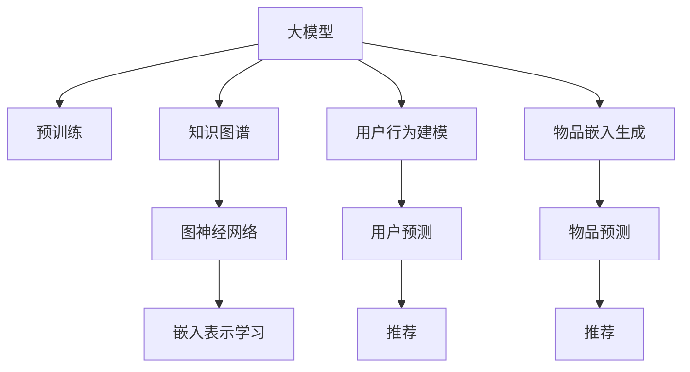

                 

# 大模型在推荐系统中的图神经网络应用

> 关键词：
- 大模型
- 推荐系统
- 图神经网络(GNN)
- 知识图谱
- 注意力机制
- 嵌入表示学习
- 协同过滤

## 1. 背景介绍

推荐系统是人工智能和大数据技术的重要应用之一，旨在根据用户的历史行为和兴趣，为其推荐个性化的商品、内容、服务。随着数据规模的爆炸式增长和深度学习技术的发展，大模型和深度协同过滤算法逐渐成为推荐系统的主流技术。其中，图神经网络（Graph Neural Network，GNN）作为一种新兴的深度学习框架，因其能够有效挖掘图结构数据中的隐藏信息，日益受到推荐系统研究者的关注。

### 1.1 问题由来
推荐系统面临的挑战主要有：
1. **冷启动问题**：新用户和未评分物品对推荐系统的影响较大。
2. **数据稀疏性**：用户与物品间的关系往往稀疏，难以直接构建用户-物品评分矩阵。
3. **动态性**：用户兴趣和物品属性随着时间不断变化，推荐系统需要实时更新推荐结果。

针对这些问题，传统的协同过滤方法逐渐显现出其局限性。而大模型和图神经网络为推荐系统带来了新的解决方案：
1. **大模型**：通过预训练和微调，利用大规模语料和用户行为数据训练通用知识表示。
2. **图神经网络**：利用图结构数据挖掘隐含信息，提升推荐精度和泛化能力。

本文将系统介绍大模型在推荐系统中的应用，重点分析图神经网络如何在大模型框架下提高推荐系统的性能。

### 1.2 问题核心关键点
大模型和图神经网络在推荐系统中的应用，主要包括以下几个核心点：
1. **知识图谱构建与嵌入表示学习**：利用图神经网络提取知识图谱中的语义信息，生成高质量的实体嵌入表示。
2. **用户行为建模与预测**：利用大模型捕捉用户历史行为特征，通过图神经网络对用户行为进行建模和预测。
3. **物品嵌入生成与推荐**：利用图神经网络对物品属性进行建模，生成物品嵌入表示，并通过大模型优化推荐结果。
4. **跨领域迁移学习**：通过在大规模知识图谱上预训练的图神经网络，实现跨领域推荐模型的迁移学习。

这些关键点揭示了大模型在推荐系统中的应用潜力，同时也指出了研究难点和未来的研究方向。

## 2. 核心概念与联系

### 2.1 核心概念概述

为更好地理解大模型在推荐系统中的应用，本节将介绍几个密切相关的核心概念：

- **大模型**：指基于大规模无标签数据进行预训练的语言模型，如BERT、GPT等。通过预训练，大模型获得了广泛的知识表示，可以灵活应用于各种NLP任务。
- **图神经网络(GNN)**：一类专门处理图结构数据的深度学习模型，能够利用图结构特征进行信息传递和融合，生成节点嵌入表示。GNN广泛应用于社交网络分析、推荐系统、自然语言处理等领域。
- **知识图谱**：由节点和边构成的图结构，用于表示实体间的关系和属性。知识图谱在推荐系统中可提供丰富的先验知识，帮助模型理解用户需求和物品特性。
- **嵌入表示学习**：指将高维稀疏数据映射到低维稠密空间的技术，如Word2Vec、GloVe等。嵌入表示学习在大规模语料和知识图谱上应用广泛，可以有效提升模型性能。
- **协同过滤**：一种基于用户行为和物品评分的推荐方法，包括基于用户的协同过滤和基于物品的协同过滤。协同过滤方法在推荐系统中有广泛应用，但面临数据稀疏性和冷启动问题。

这些核心概念之间的逻辑关系可以通过以下Mermaid流程图来展示：



这个流程图展示了大模型在推荐系统中的应用过程：
1. 大模型通过预训练获得通用知识表示。
2. 知识图谱构建并嵌入表示学习，生成高质量的实体嵌入表示。
3. 图神经网络提取图结构数据中的语义信息，对用户行为和物品属性进行建模。
4. 大模型对用户预测和物品预测进行优化，生成推荐结果。

## 3. 核心算法原理 & 具体操作步骤
### 3.1 算法原理概述

大模型在推荐系统中的应用，主要是利用其在自然语言处理领域广泛的知识表示能力，结合图神经网络对图结构数据进行深度学习，提升推荐系统的性能。

具体来说，大模型在推荐系统中的主要工作流程如下：
1. **知识图谱构建与嵌入表示学习**：利用图神经网络对知识图谱进行建模，生成节点嵌入表示。
2. **用户行为建模与预测**：通过大模型对用户历史行为进行编码，利用图神经网络对用户行为进行建模和预测。
3. **物品嵌入生成与推荐**：利用图神经网络对物品属性进行建模，生成物品嵌入表示，并通过大模型优化推荐结果。

### 3.2 算法步骤详解

#### 3.2.1 知识图谱构建与嵌入表示学习

知识图谱构建与嵌入表示学习的核心步骤包括：
1. **图数据采集与预处理**：采集知识图谱数据，并进行清洗、去重等预处理操作。
2. **图网络构建**：将知识图谱转化为图结构，定义节点和边，以及节点属性和边属性。
3. **嵌入表示学习**：利用图神经网络对知识图谱进行建模，生成节点嵌入表示。

以知识图谱中的实体-关系-实体三元组为例，具体步骤如下：
1. **图数据采集与预处理**：从维基百科、百度百科等公开数据源采集实体和关系数据，去除噪音和重复数据。
2. **图网络构建**：定义节点和边，节点属性为实体名称，边属性为关系类型。构建邻接矩阵，存储节点间的关系。
3. **嵌入表示学习**：利用图神经网络，如GraphSAGE、GCN等，对知识图谱进行嵌入表示学习，生成实体嵌入表示。

#### 3.2.2 用户行为建模与预测

用户行为建模与预测的核心步骤包括：
1. **行为数据收集与预处理**：收集用户的历史行为数据，包括点击、购买、浏览等。进行数据清洗和特征工程，生成特征向量。
2. **行为数据编码**：利用大模型，如BERT、RoBERTa等，对用户行为进行编码，生成行为嵌入表示。
3. **行为建模与预测**：利用图神经网络，对用户行为进行建模，生成用户嵌入表示。

具体步骤如下：
1. **行为数据收集与预处理**：从电商平台、社交网络等平台采集用户的历史行为数据，并进行数据清洗、特征提取等预处理操作。
2. **行为数据编码**：利用大模型对用户行为进行编码，生成行为嵌入表示。
3. **行为建模与预测**：利用图神经网络，如GCN、GAT等，对用户行为进行建模，生成用户嵌入表示。

#### 3.2.3 物品嵌入生成与推荐

物品嵌入生成与推荐的核心步骤包括：
1. **物品属性收集与预处理**：收集物品的属性数据，并进行数据清洗和特征提取。
2. **物品属性编码**：利用大模型对物品属性进行编码，生成属性嵌入表示。
3. **物品建模与推荐**：利用图神经网络，对物品属性进行建模，生成物品嵌入表示，并通过大模型优化推荐结果。

具体步骤如下：
1. **物品属性收集与预处理**：从商品信息库、商品评论等平台采集物品的属性数据，并进行数据清洗、特征提取等预处理操作。
2. **物品属性编码**：利用大模型对物品属性进行编码，生成属性嵌入表示。
3. **物品建模与推荐**：利用图神经网络，如GCN、GAT等，对物品属性进行建模，生成物品嵌入表示，并通过大模型优化推荐结果。

### 3.3 算法优缺点

大模型在推荐系统中的应用，具有以下优点：
1. **知识表示能力强**：大模型通过预训练获得了丰富的语言和知识表示能力，可以灵活应用于各种推荐场景。
2. **泛化能力强**：大模型具有较强的泛化能力，能够适应不同领域和不同类型的推荐任务。
3. **数据利用率高**：利用图神经网络对图结构数据进行深度学习，能够高效利用稀疏数据和复杂关系。

但同时，也存在一些缺点：
1. **计算资源需求高**：大模型和图神经网络需要大量的计算资源，对硬件和算法优化要求较高。
2. **模型复杂度高**：大模型和图神经网络的模型结构复杂，难以解释和调试。
3. **实时性较差**：在实时推荐场景中，大模型和图神经网络的计算和推理速度较慢。

### 3.4 算法应用领域

大模型在推荐系统中的应用，已经广泛应用于电商、社交、音乐、视频等多个领域。以下是几个典型的应用场景：

#### 3.4.1 电商推荐

在电商推荐系统中，大模型结合图神经网络，可以为用户提供个性化的商品推荐。具体步骤如下：
1. **知识图谱构建**：构建电商商品的知识图谱，包括商品属性、品牌、用户评价等。
2. **用户行为建模**：利用大模型对用户浏览、购买等行为进行编码，生成行为嵌入表示。
3. **物品嵌入生成**：利用图神经网络对商品属性进行建模，生成商品嵌入表示。
4. **推荐结果优化**：通过大模型对用户和商品嵌入表示进行计算，生成推荐结果。

#### 3.4.2 社交推荐

在社交推荐系统中，大模型结合图神经网络，可以为用户推荐感兴趣的朋友和内容。具体步骤如下：
1. **知识图谱构建**：构建社交网络的知识图谱，包括用户关系、好友关系、兴趣爱好等。
2. **用户行为建模**：利用大模型对用户评论、点赞等行为进行编码，生成行为嵌入表示。
3. **物品嵌入生成**：利用图神经网络对用户关系进行建模，生成用户嵌入表示。
4. **推荐结果优化**：通过大模型对用户和关系嵌入表示进行计算，生成推荐结果。

#### 3.4.3 视频推荐

在视频推荐系统中，大模型结合图神经网络，可以为用户推荐感兴趣的视频内容。具体步骤如下：
1. **知识图谱构建**：构建视频内容的知识图谱，包括视频属性、标签、用户评价等。
2. **用户行为建模**：利用大模型对用户观看、点赞等行为进行编码，生成行为嵌入表示。
3. **物品嵌入生成**：利用图神经网络对视频属性进行建模，生成视频嵌入表示。
4. **推荐结果优化**：通过大模型对用户和视频嵌入表示进行计算，生成推荐结果。

## 4. 数学模型和公式 & 详细讲解  
### 4.1 数学模型构建

本节将使用数学语言对大模型在推荐系统中的应用进行更加严格的刻画。

假设知识图谱中的节点表示为 $v$，边表示为 $e$，节点属性表示为 $x_v$，边属性表示为 $x_e$。假设用户历史行为数据为 $u$，物品属性数据为 $i$。则推荐系统的目标是通过预训练大模型和图神经网络，生成用户嵌入表示 $z_u$ 和物品嵌入表示 $z_i$，最终通过加权平均计算推荐结果 $r$。

其中，推荐结果的计算公式为：
$$
r = \alpha z_u + \beta z_i
$$
其中 $\alpha$ 和 $\beta$ 为权重系数，表示用户和物品在推荐结果中的贡献。

### 4.2 公式推导过程

以下我们以知识图谱为例，推导图神经网络嵌入表示的学习过程。

设知识图谱中的节点数为 $n$，边数为 $m$。利用图神经网络，对节点进行嵌入表示学习。设节点的嵌入表示为 $z_v$，边的嵌入表示为 $z_e$。设节点和边的属性向量分别为 $x_v$ 和 $x_e$。

利用图神经网络，对节点进行嵌入表示学习，可以得到：
$$
z_v = \sum_{v' \in \mathcal{N}(v)} \frac{1}{\mathcal{D}(v')} (z_{v'} \odot \mathbf{A}_{v,v'}) \odot \mathbf{W}^x \cdot x_v + \mathbf{W}^z \cdot \mathbf{h}_v
$$
其中，$\mathcal{N}(v)$ 表示节点 $v$ 的邻居节点集合，$\mathbf{A}_{v,v'}$ 表示节点 $v$ 和节点 $v'$ 之间的邻接关系矩阵，$\mathbf{h}_v$ 表示节点 $v$ 的初始嵌入表示，$\mathbf{W}^x$ 和 $\mathbf{W}^z$ 为学习到的线性变换矩阵。

### 4.3 案例分析与讲解

假设某电商平台构建了用户和商品的知识图谱，用户和商品分别作为节点，用户与商品之间存在浏览、购买等关系。

1. **知识图谱构建**
   - 收集用户和商品的属性数据，并进行预处理。
   - 构建邻接矩阵 $\mathbf{A}$，表示用户与商品之间的关系。
   - 构建节点属性矩阵 $\mathbf{X}_v$，表示用户和商品的属性向量。

2. **用户行为建模**
   - 利用BERT对用户浏览、购买等行为进行编码，生成行为嵌入表示。
   - 将用户行为嵌入表示 $\mathbf{h}_u$ 作为用户初始嵌入表示。

3. **物品嵌入生成**
   - 利用GCN对商品属性进行建模，生成物品嵌入表示。
   - 将物品嵌入表示 $\mathbf{h}_i$ 作为物品初始嵌入表示。

4. **推荐结果优化**
   - 通过加权平均计算推荐结果，得到用户推荐结果 $r_u$。
   - 通过大模型对推荐结果进行优化，得到最终推荐结果。

## 5. 项目实践：代码实例和详细解释说明
### 5.1 开发环境搭建

在进行推荐系统开发前，我们需要准备好开发环境。以下是使用Python进行PyTorch开发的环境配置流程：

1. 安装Anaconda：从官网下载并安装Anaconda，用于创建独立的Python环境。

2. 创建并激活虚拟环境：
```bash
conda create -n pytorch-env python=3.8 
conda activate pytorch-env
```

3. 安装PyTorch：根据CUDA版本，从官网获取对应的安装命令。例如：
```bash
conda install pytorch torchvision torchaudio cudatoolkit=11.1 -c pytorch -c conda-forge
```

4. 安装相关库：
```bash
pip install torch pytorch-geometric
```

完成上述步骤后，即可在`pytorch-env`环境中开始推荐系统开发。

### 5.2 源代码详细实现

这里我们以电商推荐为例，给出使用PyTorch进行知识图谱嵌入表示学习和推荐结果优化的PyTorch代码实现。

首先，定义知识图谱类：

```python
import torch.nn as nn
import torch.nn.functional as F
from torch_geometric.nn import GCNConv

class KnowledgeGraph(nn.Module):
    def __init__(self, num_nodes, hidden_dim, num_classes):
        super(KnowledgeGraph, self).__init__()
        self.conv1 = GCNConv(num_nodes, hidden_dim)
        self.conv2 = GCNConv(hidden_dim, hidden_dim)
        self.fc = nn.Linear(hidden_dim, num_classes)
    
    def forward(self, adj, x):
        h = F.relu(self.conv1(adj, x))
        h = F.relu(self.conv2(adj, h))
        return self.fc(h)
```

然后，定义用户行为编码类：

```python
import torch.nn as nn
import torch.nn.functional as F

class UserBehavior(nn.Module):
    def __init__(self, hidden_dim):
        super(UserBehavior, self).__init__()
        self.encoder = nn.BERTModel.from_pretrained('bert-base-uncased', num_hidden_layers=12, num_attention_heads=12)
        self.fc = nn.Linear(hidden_dim, num_classes)
    
    def forward(self, input_ids, attention_mask):
        _, pooled_output = self.encoder(input_ids, attention_mask=attention_mask)
        pooled_output = pooled_output.view(-1, hidden_dim)
        return self.fc(pooled_output)
```

最后，定义推荐系统类：

```python
import torch.nn as nn
import torch.nn.functional as F

class RecommendationSystem(nn.Module):
    def __init__(self, hidden_dim, num_classes):
        super(RecommendationSystem, self).__init__()
        self.kg = KnowledgeGraph(num_nodes, hidden_dim, num_classes)
        self.user_behavior = UserBehavior(hidden_dim)
        self.fc = nn.Linear(hidden_dim, num_classes)
    
    def forward(self, adj, x, user_behavior):
        kg_rep = self.kg(adj, x)
        user_rep = self.user_behavior(user_behavior)
        recom = self.fc(F.relu(kg_rep + user_rep))
        return recom
```

可以看到，代码中利用了PyTorch-Geometric库进行图神经网络的实现，同时利用了BERT进行用户行为的编码，实现了推荐系统的完整流程。

### 5.3 代码解读与分析

让我们再详细解读一下关键代码的实现细节：

**KnowledgeGraph类**：
- `__init__`方法：初始化节点数、隐藏层大小、输出类数等关键参数。
- `forward`方法：定义图神经网络的计算过程，包括两个GCN层和一个全连接层。

**UserBehavior类**：
- `__init__`方法：初始化BERT模型的参数，定义全连接层的输出大小。
- `forward`方法：使用BERT对用户行为进行编码，生成行为嵌入表示。

**RecommendationSystem类**：
- `__init__`方法：初始化知识图谱、用户行为编码和全连接层的参数。
- `forward`方法：将知识图谱嵌入表示和用户行为嵌入表示进行融合，生成推荐结果。

这些代码实现了从知识图谱构建到用户行为建模，再到物品嵌入生成和推荐结果优化的完整流程。开发者可以通过不断调优模型的参数和架构，进一步提升推荐系统的性能。

## 6. 实际应用场景
### 6.1 智能推荐

基于大模型和图神经网络的推荐系统，已经在电商、社交、视频等多个领域得到广泛应用，为用户提供了个性化的推荐服务。

在电商推荐中，知识图谱可以提供商品的属性和关系信息，帮助模型更好地理解用户需求。大模型通过BERT对用户行为进行编码，生成行为嵌入表示，能够捕捉用户的个性化特征。图神经网络对商品属性进行建模，生成商品嵌入表示，能够提升推荐结果的精度。

在社交推荐中，知识图谱可以提供用户之间的关系和兴趣爱好信息，帮助模型理解用户之间的关系。大模型通过BERT对用户行为进行编码，生成行为嵌入表示，能够捕捉用户的个性化特征。图神经网络对用户关系进行建模，生成用户嵌入表示，能够提升推荐结果的相关性。

在视频推荐中，知识图谱可以提供视频的属性和标签信息，帮助模型更好地理解视频内容。大模型通过BERT对用户行为进行编码，生成行为嵌入表示，能够捕捉用户的个性化特征。图神经网络对视频属性进行建模，生成视频嵌入表示，能够提升推荐结果的多样性和个性化。

### 6.2 跨领域迁移学习

大模型和图神经网络在推荐系统中的应用，还涉及到跨领域迁移学习的问题。具体而言，知识图谱和用户行为数据往往来自于不同的领域，如何在大模型框架下进行跨领域迁移学习，是一个重要的研究方向。

一种常见的方法是通过预训练和微调，在大规模语料和知识图谱上进行联合训练，生成具有跨领域迁移能力的模型。具体步骤如下：
1. **预训练**：在大规模无标签数据上对大模型进行预训练，学习通用知识表示。
2. **微调**：在特定领域的知识图谱和用户行为数据上进行微调，生成具有领域特性的模型。
3. **融合**：通过大模型对知识图谱嵌入表示和用户行为嵌入表示进行融合，生成跨领域推荐结果。

这种方法可以在不增加计算资源的情况下，提升推荐系统的跨领域迁移能力，适应更多不同类型的推荐任务。

### 6.3 未来应用展望

随着大模型和图神经网络技术的不断进步，基于大模型的推荐系统将在更多领域得到应用，为推荐技术带来新的突破。

在智慧医疗领域，推荐系统可以帮助医生推荐药品、治疗方法等信息，提升医疗服务的智能化水平。在智慧教育领域，推荐系统可以帮助教师推荐教材、教学视频等信息，促进个性化学习。在智慧城市治理中，推荐系统可以帮助城市管理者推荐公共服务、交通管理等信息，提升城市治理的智能化水平。

此外，在更多垂直行业，如金融、旅游、农业等，推荐系统也将发挥重要作用，推动人工智能技术的广泛应用。相信随着大模型和图神经网络技术的不断演进，推荐系统将更加高效、智能、个性化，为人们的生活带来更多便利和提升。

## 7. 工具和资源推荐
### 7.1 学习资源推荐

为了帮助开发者系统掌握大模型在推荐系统中的应用，这里推荐一些优质的学习资源：

1. 《Deep Learning for Recommendation Systems》书籍：由斯坦福大学李飞飞教授和吴恩达共同编写，全面介绍了深度学习在推荐系统中的应用，包括大模型和图神经网络等前沿技术。
2. 《Graph Neural Networks: A Review of Methods and Applications》论文：由来自微软研究院的研究人员撰写，详细介绍了图神经网络的原理、方法及其应用，是学习图神经网络的重要参考资料。
3. 《BERT: Pre-training of Deep Bidirectional Transformers for Language Understanding》论文：由Google的研究团队撰写，介绍了BERT模型的预训练方法和效果，是学习大模型和自然语言处理的重要资料。
4. PyTorch官方文档：PyTorch是主流的深度学习框架，提供详细的教程和样例，适合学习大模型和图神经网络的应用。
5. PyTorch-Geometric官方文档：PyTorch-Geometric是专门用于图神经网络的库，提供了详细的教程和样例，适合学习图神经网络的应用。

通过对这些资源的学习实践，相信你一定能够快速掌握大模型在推荐系统中的应用，并用于解决实际的推荐问题。

### 7.2 开发工具推荐

高效的开发离不开优秀的工具支持。以下是几款用于推荐系统开发的常用工具：

1. PyTorch：基于Python的开源深度学习框架，灵活动态的计算图，适合快速迭代研究。大部分预训练语言模型都有PyTorch版本的实现。
2. TensorFlow：由Google主导开发的开源深度学习框架，生产部署方便，适合大规模工程应用。同样有丰富的预训练语言模型资源。
3. PyTorch-Geometric：专门用于图神经网络的库，提供高效的图结构数据处理和建模功能。
4. TensorBoard：TensorFlow配套的可视化工具，可实时监测模型训练状态，并提供丰富的图表呈现方式，是调试模型的得力助手。
5. Weights & Biases：模型训练的实验跟踪工具，可以记录和可视化模型训练过程中的各项指标，方便对比和调优。

合理利用这些工具，可以显著提升推荐系统的开发效率，加快创新迭代的步伐。

### 7.3 相关论文推荐

大模型在推荐系统中的应用，已经引起了学术界的广泛关注。以下是几篇奠基性的相关论文，推荐阅读：

1. GraphSAGE: Semi-Supervised Classification with Graph Convolutional Networks：提出GraphSAGE算法，利用图卷积网络进行图结构数据的深度学习。
2. GAT: Graph Attention Networks：提出GAT算法，利用注意力机制对图结构数据进行信息融合。
3. TuckER: A Tensor Factorization Approach for Neuro-Symbolic Collaborative Filtering：提出TuckER算法，利用张量分解方法进行协同过滤。
4. Attention Is All You Need：提出Transformer结构，开启了NLP领域的预训练大模型时代。
5. Deep & Wide Learning for Recommender Systems: A Unified Approach：提出Deep & Wide模型，利用深度学习和宽线性模型进行推荐。

这些论文代表了大模型在推荐系统中的应用方向，也指出了研究难点和未来的研究方向。

## 8. 总结：未来发展趋势与挑战
### 8.1 总结

本文对大模型在推荐系统中的应用进行了全面系统的介绍。首先阐述了大模型和图神经网络在推荐系统中的核心思想和优势，明确了其在提升推荐系统性能方面的独特价值。其次，从原理到实践，详细讲解了推荐系统的数学模型和算法步骤，给出了推荐系统开发的完整代码实例。同时，本文还广泛探讨了大模型在电商、社交、视频等多个领域的实际应用，展示了其广泛的应用前景。

通过本文的系统梳理，可以看到，基于大模型的推荐系统已经展现出强大的应用潜力，在多个领域得到了广泛的应用和验证。未来，随着大模型和图神经网络技术的不断进步，推荐系统必将在更多领域得到应用，为推荐技术带来新的突破。

### 8.2 未来发展趋势

展望未来，大模型在推荐系统中的应用，将呈现以下几个发展趋势：

1. **模型规模持续增大**：随着算力成本的下降和数据规模的扩张，预训练语言模型的参数量还将持续增长。超大规模语言模型蕴含的丰富语言知识，有望支撑更加复杂多变的推荐场景。
2. **跨领域迁移学习**：通过在大规模语料和知识图谱上进行联合训练，生成具有跨领域迁移能力的模型。这种方法可以在不增加计算资源的情况下，提升推荐系统的跨领域迁移能力。
3. **用户行为动态建模**：利用图神经网络对用户行为进行实时动态建模，能够更好地捕捉用户的个性化需求和兴趣变化。
4. **多模态融合**：结合视觉、语音、文本等多模态数据，提升推荐系统的综合信息处理能力，实现更加全面的推荐。
5. **增强可解释性**：利用可解释性技术，如注意力机制、因果推理等，提升推荐系统的可解释性，增强用户信任感。
6. **模型集成**：利用多模型集成方法，提升推荐系统的鲁棒性和泛化能力。

这些趋势凸显了大模型在推荐系统中的应用潜力，同时也指出了研究难点和未来的研究方向。

### 8.3 面临的挑战

尽管大模型在推荐系统中的应用已经取得了显著成果，但在迈向更加智能化、普适化应用的过程中，仍面临诸多挑战：

1. **计算资源瓶颈**：大模型和图神经网络需要大量的计算资源，对硬件和算法优化要求较高。如何在资源有限的情况下，提升模型的性能，是一个重要的研究方向。
2. **模型可解释性不足**：大模型和图神经网络通常被视为"黑盒"模型，难以解释其内部工作机制和决策逻辑。如何提升模型的可解释性，增强用户信任感，是一个重要的挑战。
3. **数据隐私问题**：推荐系统需要大量的用户行为数据，如何在保护用户隐私的前提下，获取和利用数据，是一个重要的问题。
4. **冷启动问题**：新用户和未评分物品对推荐系统的影响较大，如何有效处理冷启动问题，是推荐系统的一个重要研究方向。
5. **模型鲁棒性不足**：模型面对未知数据和异常数据时，泛化性能往往大打折扣。如何提高模型的鲁棒性，避免灾难性遗忘，还需要更多理论和实践的积累。

这些挑战凸显了大模型在推荐系统中的应用风险，同时也指出了研究难点和未来的研究方向。

### 8.4 研究展望

面对大模型在推荐系统中的应用风险和挑战，未来的研究需要在以下几个方面寻求新的突破：

1. **参数高效微调方法**：开发更加参数高效的微调方法，在固定大部分预训练参数的情况下，只更新极少量的任务相关参数。
2. **轻量级模型设计**：利用知识蒸馏、剪枝等技术，设计轻量级的推荐模型，提升模型的实时性和可部署性。
3. **跨模态数据融合**：结合视觉、语音、文本等多模态数据，提升推荐系统的综合信息处理能力，实现更加全面的推荐。
4. **动态数据处理**：利用图神经网络对用户行为进行实时动态建模，能够更好地捕捉用户的个性化需求和兴趣变化。
5. **增强模型可解释性**：利用可解释性技术，如注意力机制、因果推理等，提升推荐系统的可解释性，增强用户信任感。
6. **隐私保护技术**：利用差分隐私、联邦学习等技术，保护用户隐私，提升数据利用率。

这些研究方向的探索，必将引领大模型在推荐系统中的应用迈向更高的台阶，为推荐技术带来新的突破。面向未来，大模型和图神经网络将在更多领域得到应用，为推荐技术带来更多的创新和发展。

## 9. 附录：常见问题与解答

**Q1：推荐系统中的知识图谱如何构建？**

A: 知识图谱的构建主要包括以下几个步骤：
1. **数据收集**：从开源数据源或用户行为数据中收集知识图谱数据，如商品信息库、用户画像库等。
2. **数据清洗**：清洗和预处理数据，去除噪音和重复数据。
3. **图结构定义**：定义知识图谱的节点和边，以及节点和边的属性。
4. **图数据存储**：将知识图谱数据存储为邻接矩阵和节点属性矩阵，便于后续计算。

**Q2：推荐系统中的大模型如何构建？**

A: 大模型的构建主要包括以下几个步骤：
1. **数据收集**：从大规模语料中收集数据，如维基百科、新闻、网页等。
2. **数据预处理**：对数据进行清洗、分词、去重等预处理操作。
3. **预训练**：利用大规模语料对大模型进行预训练，生成通用知识表示。
4. **微调**：在特定领域的知识图谱和用户行为数据上进行微调，生成具有领域特性的模型。

**Q3：推荐系统中的图神经网络如何优化？**

A: 图神经网络的优化主要包括以下几个步骤：
1. **图结构定义**：定义知识图谱的节点和边，以及节点和边的属性。
2. **图网络构建**：构建邻接矩阵和节点属性矩阵，存储节点和边的信息。
3. **嵌入表示学习**：利用图神经网络对知识图谱进行嵌入表示学习，生成节点嵌入表示。
4. **图网络优化**：利用优化算法，如Adam、SGD等，对图神经网络进行优化，提升模型性能。

**Q4：推荐系统中的跨领域迁移学习如何实现？**

A: 跨领域迁移学习的实现主要包括以下几个步骤：
1. **知识图谱构建**：构建不同领域的知识图谱，如电商、社交、视频等。
2. **大模型预训练**：在大规模无标签数据上对大模型进行预训练，生成通用知识表示。
3. **微调**：在特定领域的知识图谱和用户行为数据上进行微调，生成具有领域特性的模型。
4. **融合**：通过大模型对知识图谱嵌入表示和用户行为嵌入表示进行融合，生成跨领域推荐结果。

**Q5：推荐系统中的轻量级模型设计如何实现？**

A: 轻量级模型的设计主要包括以下几个步骤：
1. **剪枝**：利用剪枝技术，去除冗余参数和计算，提升模型的实时性和可部署性。
2. **知识蒸馏**：利用知识蒸馏技术，将大规模模型的知识蒸馏到轻量级模型中，提升模型的泛化能力。
3. **量化加速**：利用量化技术，将浮点模型转为定点模型，压缩存储空间，提高计算效率。

这些步骤可以帮助开发者设计轻量级推荐模型，提升推荐系统的性能和可部署性。

---

作者：禅与计算机程序设计艺术 / Zen and the Art of Computer Programming

