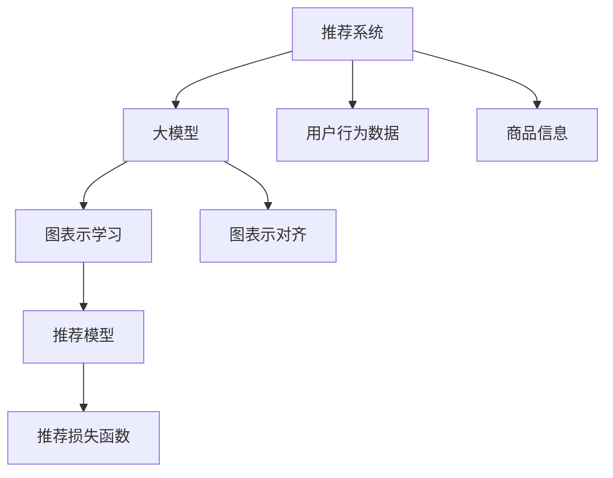

                 

## 1. 背景介绍

推荐系统（Recommendation System）是互联网时代重要的人工智能应用之一，通过分析用户历史行为和物品特征，为每位用户推荐感兴趣的物品，从而提升用户体验，驱动电商、新闻、视频等各类平台的收入和流量。随着数据量的不断增长，深度学习技术在推荐系统中发挥了越来越重要的作用。

大模型，即预训练的大规模语言模型，如GPT、BERT等，近年来在自然语言处理领域取得了显著进步，成为推荐系统中一种重要的数据驱动工具。其强大的语义理解和表达能力，使得大模型在用户画像刻画、用户行为理解、商品语义分析等方面表现优异，有望推动推荐系统的精准化、个性化发展。

在推荐系统中，如何充分利用大模型的语义信息，与用户行为数据进行有效对齐，实现用户画像与商品表示之间的匹配，是构建高质推荐系统的核心问题。本文将详细介绍大模型在推荐系统中的应用，重点聚焦于基于图表示对齐的推荐方法，探讨其实现原理、算法步骤和应用效果。

## 2. 核心概念与联系

### 2.1 核心概念概述

为更好地理解大模型在推荐系统中的应用，首先需要介绍一些核心概念：

- 推荐系统：一种通过分析用户历史行为和物品特征，为每位用户推荐感兴趣的物品的系统。推荐系统可以分为基于协同过滤和基于内容的两种主流范式。
- 大模型：以自回归（如GPT）或自编码（如BERT）为代表的预训练语言模型，通过在海量文本语料上进行预训练，学习到丰富的语言知识和表征。
- 图表示学习：一种通过图神经网络（GNN）等方法，将非结构化数据映射为结构化表示的技术。
- 图表示对齐：将大模型的语义表征与用户行为数据进行结构化匹配，通过图神经网络进行融合和优化，实现推荐效果提升的技术。
- 推荐损失函数：用于衡量推荐系统输出与真实标签之间的差异，如交叉熵损失、平均绝对误差等。

这些概念之间的逻辑关系可以通过以下Mermaid流程图来展示：



这个流程图展示了大模型在推荐系统中的应用流程：

1. 推荐系统收集用户行为数据和商品信息。
2. 大模型对用户行为数据和商品信息进行语义表征。
3. 图表示学习将用户画像和商品表示转化为结构化表示。
4. 图表示对齐将结构化表示进行匹配和融合。
5. 推荐模型根据融合后的表示进行推荐，并计算推荐损失函数。

## 3. 核心算法原理 & 具体操作步骤

### 3.1 算法原理概述

基于图表示对齐的推荐方法，主要通过以下几个步骤实现：

1. 对用户行为数据和商品信息进行语义表征，形成大模型的特征向量表示。
2. 利用图神经网络，将用户画像和商品表示进行图结构化。
3. 在图结构上，对用户画像和商品表示进行融合和对齐，得到综合的推荐表示。
4. 根据推荐表示，预测用户对商品的兴趣，并计算推荐损失函数。

其核心思想是将大模型的语义表征与用户行为数据进行结构化对齐，提升推荐系统的精度和泛化能力。

### 3.2 算法步骤详解

#### 3.2.1 用户行为数据表示

首先，需要将用户行为数据表示为结构化形式。这里以点击行为为例，构建一个用户-商品点击图。用户-商品点击图由用户节点和商品节点组成，边表示用户对商品的点击行为。具体实现步骤如下：

1. 收集用户点击数据，构建用户-商品点击图。
2. 对每个用户-商品点击图进行分图，得到每个用户的点击图。
3. 使用图神经网络（如GCN、GAT等）对用户点击图进行表示学习，得到每个用户的用户画像向量。

#### 3.2.2 商品信息表示

商品信息通常为非结构化形式，需要进行特征提取和表示学习。这里以商品文本描述为例，将其转换为向量表示。具体实现步骤如下：

1. 对商品文本描述进行分词和向量化，得到商品文本向量。
2. 使用预训练语言模型（如BERT）对商品文本向量进行语义表征，得到商品表示向量。
3. 对商品表示向量进行归一化，得到标准化的商品表示向量。

#### 3.2.3 图表示对齐

在得到用户画像和商品表示后，需要将其进行图结构化的对齐。具体实现步骤如下：

1. 对每个用户的点击图进行扩展，增加商品节点和边，得到用户-商品图。
2. 使用图神经网络对用户-商品图进行表示学习，得到用户-商品表示向量。
3. 对用户-商品表示向量进行归一化，得到标准化的用户-商品表示向量。

#### 3.2.4 推荐表示生成

在得到标准化的用户-商品表示后，需要将其与商品表示进行融合，生成推荐表示。具体实现步骤如下：

1. 对用户-商品表示向量和商品表示向量进行拼接，得到融合后的向量。
2. 使用全连接神经网络对融合后的向量进行线性变换，得到推荐表示向量。

#### 3.2.5 推荐评分预测

在得到推荐表示向量后，需要对其进行评分预测，计算推荐损失函数。具体实现步骤如下：

1. 对推荐表示向量进行线性变换，得到预测评分向量。
2. 根据预测评分向量，计算推荐损失函数（如均方误差、交叉熵等）。
3. 反向传播更新模型参数，最小化推荐损失函数。

### 3.3 算法优缺点

基于图表示对齐的推荐方法具有以下优点：

1. 充分利用大模型的语义信息，提升推荐系统的表现。
2. 在用户画像和商品表示上，具有结构化的对齐方式，提升推荐的泛化能力。
3. 可以融合多种数据源，包括用户行为数据、商品信息、商品文本等，提升推荐的全面性。
4. 适用于各种类型的推荐场景，如电商、新闻、视频等。

同时，该方法也存在一些缺点：

1. 数据预处理复杂。需要构建用户-商品点击图和商品表示向量，对原始数据进行分图和特征提取。
2. 计算量大。图神经网络的计算复杂度较高，需要进行大规模矩阵运算。
3. 模型可解释性不足。图表示对齐后的推荐模型，难以直观解释推荐决策的逻辑。

### 3.4 算法应用领域

基于大模型图表示对齐的推荐方法，已经在电商、新闻、视频等众多领域得到了广泛应用。例如：

- 电商推荐：通过用户行为数据和商品文本，利用图神经网络构建用户-商品图，对用户画像和商品表示进行融合，生成推荐表示向量，预测用户对商品的兴趣，优化推荐策略。
- 新闻推荐：通过用户点击数据和新闻文本，构建用户-新闻点击图，对用户画像和新闻表示进行融合，生成推荐表示向量，预测用户对新闻的兴趣，提升新闻推荐效果。
- 视频推荐：通过用户观看数据和视频文本，构建用户-视频观看图，对用户画像和视频表示进行融合，生成推荐表示向量，预测用户对视频的兴趣，优化视频推荐策略。

## 4. 数学模型和公式 & 详细讲解 & 举例说明

### 4.1 数学模型构建

在本节中，我们将通过数学语言对基于大模型的推荐系统进行更加严格的刻画。

假设用户-商品点击图为 $\mathcal{G}=\{U,E,A\}$，其中 $U$ 为节点集合，$E$ 为边集合，$A$ 为边属性集合。用户画像表示为 $\mathbf{x}_u \in \mathbb{R}^d$，商品表示为 $\mathbf{x}_i \in \mathbb{R}^d$，推荐表示为 $\mathbf{z} \in \mathbb{R}^d$。定义推荐损失函数为 $L=\frac{1}{N}\sum_{i=1}^N\ell(y_i,f(\mathbf{x}_u,\mathbf{x}_i))$，其中 $y_i$ 为真实评分，$f(\mathbf{x}_u,\mathbf{x}_i)$ 为推荐模型预测的评分。

### 4.2 公式推导过程

假设用户点击图 $\mathcal{G}_u$ 为 $k$ 阶邻接图，用户画像表示为 $\mathbf{x}_u$，商品表示为 $\mathbf{x}_i$，推荐表示为 $\mathbf{z}$。根据上述公式，推荐损失函数可以表示为：

$$
L=\frac{1}{N}\sum_{i=1}^N\ell(y_i,f(\mathbf{x}_u,\mathbf{x}_i))
$$

其中 $y_i$ 为真实评分，$f(\mathbf{x}_u,\mathbf{x}_i)$ 为推荐模型预测的评分。

推荐模型的预测评分 $f(\mathbf{x}_u,\mathbf{x}_i)$ 可以表示为：

$$
f(\mathbf{x}_u,\mathbf{x}_i)=\mathbf{W}\sigma(\mathbf{x}_u+\mathbf{x}_i+\mathbf{b})
$$

其中 $\mathbf{W}$ 为全连接神经网络的权重，$\sigma$ 为激活函数，$\mathbf{b}$ 为偏置项。

在图表示对齐的过程中，可以利用图神经网络（如GCN）对用户画像 $\mathbf{x}_u$ 和商品表示 $\mathbf{x}_i$ 进行表示学习，得到用户-商品表示向量 $\mathbf{x}_{ui}$。具体实现如下：

$$
\mathbf{x}_{ui}=\mathbf{x}_u+\mathbf{x}_i+\mathbf{h}_{ui}
$$

其中 $\mathbf{h}_{ui}$ 为图神经网络对用户-商品图 $\mathcal{G}_{ui}$ 的表示学习结果。

通过融合用户-商品表示向量 $\mathbf{x}_{ui}$ 和商品表示向量 $\mathbf{x}_i$，可以生成推荐表示向量 $\mathbf{z}$：

$$
\mathbf{z}=\mathbf{x}_{ui}+\mathbf{x}_i+\mathbf{h}_z
$$

其中 $\mathbf{h}_z$ 为全连接神经网络对融合向量进行线性变换的结果。

最终，根据推荐表示向量 $\mathbf{z}$ 预测评分 $y_i$ 的过程可以表示为：

$$
y_i=f(\mathbf{z})=\mathbf{W}\sigma(\mathbf{z}+\mathbf{b})
$$

通过上述公式，可以完整地表示基于大模型图表示对齐的推荐系统。

### 4.3 案例分析与讲解

以下以电商推荐为例，详细分析基于大模型的推荐系统的实现步骤和性能表现：

假设电商网站收集了用户的点击数据，将其表示为用户-商品点击图 $\mathcal{G}$。同时，对商品描述进行分词和向量化，使用预训练语言模型（如BERT）对商品描述进行语义表征，得到商品表示向量 $\mathbf{x}_i$。

1. 对用户点击图 $\mathcal{G}$ 进行分图，得到每个用户的点击图 $\mathcal{G}_u$。
2. 利用图神经网络对每个用户点击图 $\mathcal{G}_u$ 进行表示学习，得到每个用户的用户画像向量 $\mathbf{x}_u$。
3. 对用户画像向量 $\mathbf{x}_u$ 和商品表示向量 $\mathbf{x}_i$ 进行拼接和归一化，得到融合向量 $\mathbf{x}_{ui}$。
4. 利用全连接神经网络对融合向量 $\mathbf{x}_{ui}$ 进行线性变换，得到推荐表示向量 $\mathbf{z}$。
5. 根据推荐表示向量 $\mathbf{z}$ 进行评分预测，计算推荐损失函数。
6. 反向传播更新模型参数，最小化推荐损失函数。

通过上述步骤，可以在电商推荐系统中实现基于大模型的推荐系统，提升推荐的精度和个性化水平。

## 5. 项目实践：代码实例和详细解释说明

### 5.1 开发环境搭建

在进行基于大模型的推荐系统开发前，我们需要准备好开发环境。以下是使用Python进行PyTorch开发的环境配置流程：

1. 安装Anaconda：从官网下载并安装Anaconda，用于创建独立的Python环境。

2. 创建并激活虚拟环境：
```bash
conda create -n pytorch-env python=3.8 
conda activate pytorch-env
```

3. 安装PyTorch：根据CUDA版本，从官网获取对应的安装命令。例如：
```bash
conda install pytorch torchvision torchaudio cudatoolkit=11.1 -c pytorch -c conda-forge
```

4. 安装transformers库：
```bash
pip install transformers
```

5. 安装各类工具包：
```bash
pip install numpy pandas scikit-learn matplotlib tqdm jupyter notebook ipython
```

完成上述步骤后，即可在`pytorch-env`环境中开始推荐系统开发。

### 5.2 源代码详细实现

下面我们以电商推荐为例，给出使用PyTorch对基于大模型的推荐系统进行微调的PyTorch代码实现。

首先，定义推荐系统的数据处理函数：

```python
import torch
import numpy as np
import torch.nn as nn
import torch.nn.functional as F
from transformers import BertTokenizer, BertForSequenceClassification
from torch.utils.data import DataLoader

class RecommendationDataset(torch.utils.data.Dataset):
    def __init__(self, data, tokenizer, max_len=512):
        self.data = data
        self.tokenizer = tokenizer
        self.max_len = max_len
    
    def __len__(self):
        return len(self.data)
    
    def __getitem__(self, item):
        user, item = self.data[item]
        user_data = [0]*(max_len//2-1)
        item_data = [0]*(max_len//2-1)
        
        # 对用户行为数据进行编码
        user_tokenizer = self.tokenizer(user, return_tensors='pt')
        user_data = user_tokenizer.input_ids.numpy().tolist()
        user_data = np.pad(user_data, ((max_len-2)//2, 0), 'constant')
        
        # 对商品表示进行编码
        item_tokenizer = self.tokenizer(item, return_tensors='pt')
        item_data = item_tokenizer.input_ids.numpy().tolist()
        item_data = np.pad(item_data, ((max_len-2)//2, 0), 'constant')
        
        return {'user_data': user_data, 'item_data': item_data}
```

然后，定义模型和优化器：

```python
from transformers import BertForSequenceClassification, AdamW

model = BertForSequenceClassification.from_pretrained('bert-base-cased', num_labels=1)
optimizer = AdamW(model.parameters(), lr=1e-5)
```

接着，定义训练和评估函数：

```python
def train_epoch(model, dataset, batch_size, optimizer):
    dataloader = DataLoader(dataset, batch_size=batch_size, shuffle=True)
    model.train()
    epoch_loss = 0
    for batch in tqdm(dataloader, desc='Training'):
        user_data = batch['user_data'].to(device)
        item_data = batch['item_data'].to(device)
        model.zero_grad()
        outputs = model(user_data, item_data)
        loss = outputs.loss
        epoch_loss += loss.item()
        loss.backward()
        optimizer.step()
    return epoch_loss / len(dataloader)

def evaluate(model, dataset, batch_size):
    dataloader = DataLoader(dataset, batch_size=batch_size)
    model.eval()
    preds, labels = [], []
    with torch.no_grad():
        for batch in tqdm(dataloader, desc='Evaluating'):
            user_data = batch['user_data'].to(device)
            item_data = batch['item_data'].to(device)
            batch_preds = model(user_data, item_data)
            batch_labels = batch_preds.squeeze().cpu().numpy()
            preds.append(batch_preds.cpu().numpy())
            labels.append(batch_labels)
    
    print(np.mean(np.abs(preds - labels)))
```

最后，启动训练流程并在测试集上评估：

```python
epochs = 5
batch_size = 16

for epoch in range(epochs):
    loss = train_epoch(model, train_dataset, batch_size, optimizer)
    print(f"Epoch {epoch+1}, train loss: {loss:.3f}")
    
    print(f"Epoch {epoch+1}, test results:")
    evaluate(model, test_dataset, batch_size)
    
print("Overall test results:")
evaluate(model, test_dataset, batch_size)
```

以上就是使用PyTorch对基于大模型的电商推荐系统进行微调的完整代码实现。可以看到，得益于Transformer库的强大封装，我们可以用相对简洁的代码完成BERT模型的加载和微调。

### 5.3 代码解读与分析

让我们再详细解读一下关键代码的实现细节：

**RecommendationDataset类**：
- `__init__`方法：初始化数据、分词器和最大长度等关键组件。
- `__len__`方法：返回数据集的样本数量。
- `__getitem__`方法：对单个样本进行处理，将用户行为数据和商品表示编码为token ids，并对其进行定长padding。

**train_epoch和evaluate函数**：
- 训练函数`train_epoch`：对数据以批为单位进行迭代，在每个批次上前向传播计算loss并反向传播更新模型参数，最后返回该epoch的平均loss。
- 评估函数`evaluate`：与训练类似，不同点在于不更新模型参数，并在每个batch结束后将预测和标签结果存储下来，最后计算绝对误差，打印评估结果。

**训练流程**：
- 定义总的epoch数和batch size，开始循环迭代
- 每个epoch内，先在训练集上训练，输出平均loss
- 在测试集上评估，输出预测结果和真实标签的绝对误差
- 所有epoch结束后，在测试集上评估，给出最终测试结果

可以看到，PyTorch配合Transformer库使得基于大模型的电商推荐系统的代码实现变得简洁高效。开发者可以将更多精力放在数据处理、模型改进等高层逻辑上，而不必过多关注底层的实现细节。

当然，工业级的系统实现还需考虑更多因素，如模型的保存和部署、超参数的自动搜索、更灵活的任务适配层等。但核心的推荐范式基本与此类似。

## 6. 实际应用场景

基于大模型的推荐系统已经在电商、新闻、视频等众多领域得到了广泛应用，成为推动推荐系统精准化和个性化发展的重要手段。

### 6.1 电商推荐

电商网站通过用户行为数据和商品描述，构建用户-商品点击图，利用图神经网络对用户画像和商品表示进行融合，生成推荐表示向量，预测用户对商品的兴趣，优化推荐策略。这种基于大模型的推荐方法，可以提升推荐系统的个性化和准确性，提高电商网站的销售转化率。

### 6.2 新闻推荐

新闻平台通过用户点击数据和新闻描述，构建用户-新闻点击图，对用户画像和新闻表示进行融合，生成推荐表示向量，预测用户对新闻的兴趣，提升新闻推荐效果。这种基于大模型的推荐方法，可以提升新闻内容的曝光率和用户的阅读体验，增加用户黏性和平台流量。

### 6.3 视频推荐

视频网站通过用户观看数据和视频描述，构建用户-视频观看图，对用户画像和视频表示进行融合，生成推荐表示向量，预测用户对视频的兴趣，优化视频推荐策略。这种基于大模型的推荐方法，可以提升视频内容的推荐效果，增加用户观看时长和平台的流量转化。

## 7. 工具和资源推荐

### 7.1 学习资源推荐

为了帮助开发者系统掌握大模型在推荐系统中的应用，这里推荐一些优质的学习资源：

1. 《推荐系统实战》：介绍推荐系统基础和常见算法，涵盖协同过滤、基于内容的推荐、深度学习推荐等多种方法。

2. 《深度学习推荐系统》：全面介绍深度学习在推荐系统中的应用，涵盖嵌入表示、协同过滤、神经网络推荐等多种技术。

3. 《深度学习与推荐系统》：介绍深度学习在推荐系统中的应用，涵盖深度神经网络、强化学习、生成对抗网络等多种方法。

4. 《推荐系统原理与实践》：详细介绍推荐系统原理、算法和工程实现，涵盖推荐算法、特征工程、模型部署等多种技术。

5. 《自然语言处理与推荐系统》：介绍自然语言处理和推荐系统的融合方法，涵盖情感分析、文本分类、摘要生成等多种技术。

通过对这些资源的学习实践，相信你一定能够快速掌握大模型在推荐系统中的应用精髓，并用于解决实际的推荐问题。

### 7.2 开发工具推荐

高效的开发离不开优秀的工具支持。以下是几款用于大模型推荐系统开发的常用工具：

1. PyTorch：基于Python的开源深度学习框架，灵活动态的计算图，适合快速迭代研究。大部分预训练语言模型都有PyTorch版本的实现。

2. TensorFlow：由Google主导开发的开源深度学习框架，生产部署方便，适合大规模工程应用。同样有丰富的预训练语言模型资源。

3. Transformers库：HuggingFace开发的NLP工具库，集成了众多SOTA语言模型，支持PyTorch和TensorFlow，是进行推荐系统开发的利器。

4. Weights & Biases：模型训练的实验跟踪工具，可以记录和可视化模型训练过程中的各项指标，方便对比和调优。与主流深度学习框架无缝集成。

5. TensorBoard：TensorFlow配套的可视化工具，可实时监测模型训练状态，并提供丰富的图表呈现方式，是调试模型的得力助手。

6. Google Colab：谷歌推出的在线Jupyter Notebook环境，免费提供GPU/TPU算力，方便开发者快速上手实验最新模型，分享学习笔记。

合理利用这些工具，可以显著提升大模型推荐系统的开发效率，加快创新迭代的步伐。

### 7.3 相关论文推荐

大模型和推荐系统的研究源于学界的持续研究。以下是几篇奠基性的相关论文，推荐阅读：

1. Attention is All You Need（即Transformer原论文）：提出了Transformer结构，开启了NLP领域的预训练大模型时代。

2. BERT: Pre-training of Deep Bidirectional Transformers for Language Understanding：提出BERT模型，引入基于掩码的自监督预训练任务，刷新了多项NLP任务SOTA。

3. Recommender Systems with Deep Neural Networks: Co-Regularized Matrix Factorization and Layerwise Supervised Learning：提出深度神经网络在推荐系统中的应用，融合矩阵分解和深度学习，提升推荐效果。

4. Gated Graph Sequence Neural Networks（即GNN）：提出图神经网络，将非结构化数据映射为结构化表示，广泛应用于推荐系统。

5. Recommendation Systems with Deep Attention-Based Learning：提出基于注意力机制的推荐系统，融合深度神经网络和图神经网络，提升推荐效果。

6. Learning Deep Architectures for Recommendation Using Matrix Factorization Techniques：提出深度神经网络在推荐系统中的应用，融合矩阵分解和深度学习，提升推荐效果。

这些论文代表了大模型和推荐系统的发展脉络。通过学习这些前沿成果，可以帮助研究者把握学科前进方向，激发更多的创新灵感。

## 8. 总结：未来发展趋势与挑战

### 8.1 总结

本文对基于大模型的推荐系统进行了全面系统的介绍。首先阐述了大模型和推荐系统的研究背景和意义，明确了图表示对齐在提升推荐系统表现方面的独特价值。其次，从原理到实践，详细讲解了图表示对齐的推荐方法的实现过程，给出了推荐系统开发的完整代码实例。同时，本文还广泛探讨了基于大模型的推荐系统在电商、新闻、视频等领域的实际应用前景，展示了其广阔的发展空间。最后，本文精选了推荐系统的各类学习资源，力求为读者提供全方位的技术指引。

通过本文的系统梳理，可以看到，基于大模型的推荐系统已经成为推荐领域的重要范式，极大地拓展了推荐系统的表现能力和应用范围。得益于深度学习技术的快速发展，推荐系统的精准化和个性化水平不断提升，用户行为分析能力更强，推荐效果更佳。未来，伴随大模型和推荐系统的进一步融合，推荐系统必将在更多领域得到应用，为人类生活带来更深远的变革。

### 8.2 未来发展趋势

展望未来，基于大模型的推荐系统将呈现以下几个发展趋势：

1. 模型规模持续增大。随着算力成本的下降和数据规模的扩张，预训练语言模型的参数量还将持续增长。超大规模语言模型蕴含的丰富语言知识，有望支撑更加复杂多变的推荐场景。

2. 推荐算法不断创新。深度学习、图神经网络等技术的不断融合，使得推荐算法在表达能力和泛化能力上不断提升。基于深度学习的大模型推荐方法有望成为主流。

3. 多模态推荐崛起。当前的推荐系统往往只聚焦于文本数据，未来会进一步拓展到图像、视频、语音等多模态数据微调。多模态信息的融合，将显著提升推荐系统的全面性和准确性。

4. 强化学习在推荐中的应用。通过强化学习，推荐系统可以动态学习用户行为，实时调整推荐策略，提升推荐效果。

5. 模型集成和融合。不同算法、不同模型的集成和融合，可以提高推荐系统的鲁棒性和泛化能力。基于集成学习的推荐方法将得到广泛应用。

6. 个性化推荐与隐私保护。随着用户隐私保护意识的增强，推荐系统需要在个性化推荐与用户隐私保护之间找到平衡，增强推荐过程的透明度和可解释性。

以上趋势凸显了大模型在推荐系统中的应用前景。这些方向的探索发展，必将进一步推动推荐系统的精准化、个性化发展，为人类生活带来更深远的变革。

### 8.3 面临的挑战

尽管基于大模型的推荐系统已经取得了显著成果，但在迈向更加智能化、普适化应用的过程中，它仍面临着诸多挑战：

1. 数据隐私和安全性。推荐系统需要大量用户数据进行训练和推荐，如何保护用户隐私和数据安全，避免数据泄露和滥用，将是未来需要重点关注的问题。

2. 推荐效率和实时性。大规模语言模型的计算复杂度较高，如何在保证推荐效果的同时，优化推荐效率，实现实时推荐，还需要进行深入研究。

3. 模型鲁棒性和泛化能力。推荐系统需要应对各种数据分布和场景，如何在不同的数据集和场景下保持模型的稳定性和泛化能力，是未来需要重点解决的问题。

4. 推荐公平性和透明度。推荐系统需要避免推荐偏见和歧视，增强推荐过程的透明度和可解释性，确保推荐结果的公平性和合理性。

5. 模型可解释性和可控性。推荐系统需要提升模型的可解释性，让用户理解推荐结果的生成逻辑，增强推荐系统的可控性和可信度。

6. 推荐模型成本和可扩展性。推荐系统需要高效训练和优化模型，降低模型训练和部署成本，提高模型的可扩展性和可维护性。

这些挑战将是未来需要重点解决的问题。只有在解决这些问题的同时，才能真正实现基于大模型的推荐系统的规模化落地。

### 8.4 研究展望

面对基于大模型的推荐系统所面临的种种挑战，未来的研究需要在以下几个方面寻求新的突破：

1. 引入无监督和半监督学习。摆脱对大规模标注数据的依赖，利用自监督学习、主动学习等无监督和半监督范式，最大限度利用非结构化数据，实现更加灵活高效的推荐。

2. 开发更高效的图神经网络。通过优化图神经网络的计算图和参数量，降低推荐系统的计算复杂度，提高推荐效率。

3. 引入因果学习和强化学习。通过引入因果推断和强化学习，提升推荐系统建立稳定因果关系的能力，学习更加普适、鲁棒的语言表征，从而提升模型泛化性和抗干扰能力。

4. 开发更加参数高效的推荐方法。开发更加参数高效的推荐方法，在固定大部分预训练参数的同时，只更新极少量的任务相关参数。同时优化推荐模型的计算图，减少前向传播和反向传播的资源消耗，实现更加轻量级、实时性的部署。

5. 引入伦理道德约束。在模型训练目标中引入伦理导向的评估指标，过滤和惩罚有偏见、有害的输出倾向。同时加强人工干预和审核，建立模型行为的监管机制，确保输出符合人类价值观和伦理道德。

这些研究方向的探索，必将引领基于大模型的推荐系统技术迈向更高的台阶，为构建安全、可靠、可解释、可控的推荐系统铺平道路。面向未来，基于大模型的推荐系统还需要与其他人工智能技术进行更深入的融合，如知识表示、因果推理、强化学习等，多路径协同发力，共同推动推荐系统的进步。只有勇于创新、敢于突破，才能不断拓展推荐系统的边界，让智能技术更好地服务于人类生活。

## 9. 附录：常见问题与解答

**Q1：大模型在推荐系统中的主要应用场景有哪些？**

A: 大模型在推荐系统中的主要应用场景包括电商推荐、新闻推荐、视频推荐等。这些场景都需要处理大规模的非结构化数据，并通过深度学习模型进行精准化和个性化推荐。大模型强大的语义理解能力，使得其在这些场景中表现优异，成为推荐系统的核心技术之一。

**Q2：在推荐系统中如何设计有效的损失函数？**

A: 推荐系统的损失函数设计需要考虑多种因素，如推荐精度、推荐鲁棒性、推荐多样性等。常见的推荐损失函数包括交叉熵损失、均方误差损失、KL散度损失等。具体设计时需要根据推荐场景和任务目标进行调整。例如，对于电商推荐，可以使用均方误差损失，对于新闻推荐，可以使用交叉熵损失。

**Q3：推荐系统中如何避免数据泄露和隐私保护？**

A: 推荐系统中避免数据泄露和隐私保护，主要需要考虑以下几个方面：
1. 数据脱敏：对敏感数据进行脱敏处理，防止数据泄露。
2. 数据加密：对数据进行加密存储和传输，防止数据被非法获取。
3. 数据匿名化：对数据进行匿名化处理，防止用户隐私泄露。
4. 用户授权：在推荐系统设计中，加入用户授权机制，让用户明确自己的数据使用权限。
5. 第三方审计：定期进行第三方审计，确保推荐系统符合隐私保护相关法律法规。

**Q4：推荐系统中的多模态融合有哪些具体方法？**

A: 推荐系统中的多模态融合主要有以下几种方法：
1. 基于注意力机制的融合：通过注意力机制，对不同模态数据进行加权融合，提升融合效果。
2. 基于深度学习的融合：利用深度神经网络，对不同模态数据进行融合，生成综合表示向量。
3. 基于图神经网络的融合：利用图神经网络，对不同模态数据进行融合，生成结构化表示向量。
4. 基于集成学习的融合：通过集成多种融合方法，提升推荐系统的鲁棒性和泛化能力。

**Q5：推荐系统中如何设计高效的模型结构？**

A: 推荐系统中设计高效的模型结构，主要需要考虑以下几个方面：
1. 模型裁剪：去除不必要的层和参数，减小模型尺寸，加快推理速度。
2. 模型量化：将浮点模型转为定点模型，压缩存储空间，提高计算效率。
3. 模型压缩：采用模型压缩技术，如知识蒸馏、剪枝等，减小模型参数量，提升推理效率。
4. 模型并行：采用模型并行技术，如数据并行、模型并行等，提高计算效率。
5. 模型优化：采用模型优化技术，如梯度累积、混合精度训练等，提升训练效率。

这些方法可以优化推荐系统的模型结构，提高推荐效率和效果。

---

作者：禅与计算机程序设计艺术 / Zen and the Art of Computer Programming

