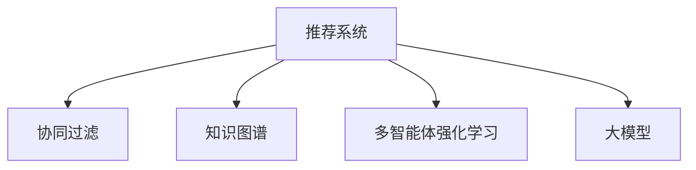

                 

# 大模型在推荐系统中的多智能体强化学习

> 关键词：大模型,多智能体强化学习,推荐系统,自适应奖励函数,交互式推荐,用户行为,协同过滤,知识图谱

## 1. 背景介绍

### 1.1 问题由来
随着互联网和信息技术的飞速发展，推荐系统已成为各大互联网平台的核心应用之一。从电商的个性化推荐到视频的精准播放，从新闻的智能编辑到社交内容的动态推送，推荐系统通过挖掘用户兴趣和行为，将用户和内容进行有效匹配，极大地提升了用户体验和平台价值。然而，传统推荐系统往往依赖于用户历史行为数据，难以处理冷启动用户和新兴趣点。

与此同时，深度学习技术在大规模数据分析上的显著优势，使得基于大模型的推荐方法逐渐兴起。尤其是近年来，基于自监督学习的大规模预训练模型，如BERT、GPT-3、XLNet等，已在推荐系统领域大放异彩。这些大模型通过大量无标签数据预训练，能够学习到丰富的语义表示，有助于捕捉用户潜在的兴趣和行为规律。

尽管如此，基于大模型的推荐系统仍面临着诸多挑战。预训练模型的泛化能力、对新用户的适应性、个性化推荐效果等关键问题尚未得到很好的解决。而多智能体强化学习（Multi-Agent Reinforcement Learning, MARL）技术以其自适应、动态调整的特点，为大模型的推荐应用提供了新的思路和方向。

### 1.2 问题核心关键点
多智能体强化学习是一种分布式学习策略，通过将复杂任务分解为多个子任务，多个智能体（agent）并行学习，从而提升整个系统的性能和鲁棒性。在推荐系统领域，多智能体强化学习可以应用于多个方向：

- 用户兴趣探索：多个智能体分别探索用户的不同兴趣点，通过协同过滤获取综合用户兴趣表示。
- 内容推荐优化：不同智能体分别处理不同类型的内容，通过竞争和协作，优化推荐策略。
- 推荐系统协同：不同智能体协同处理用户交互数据，获取高质量用户行为特征。

本文聚焦于大模型在推荐系统中的应用，主要探讨了基于多智能体强化学习的大模型推荐模型设计、训练优化以及实际应用。我们首先回顾了多智能体强化学习的基本原理，再详细讲解了大模型推荐模型的构建和训练过程。最后，我们将从技术细节、应用场景和未来展望三个方面，探讨大模型在推荐系统中的多智能体强化学习实践。

## 2. 核心概念与联系

### 2.1 核心概念概述

为了更好地理解基于大模型的推荐系统中的多智能体强化学习，我们需要介绍几个关键概念：

- 推荐系统（Recommendation System）：通过数据分析和模型预测，将用户和内容进行有效匹配，推荐系统旨在提升用户满意度，增加平台价值。
- 多智能体强化学习（Multi-Agent Reinforcement Learning, MARL）：通过多个智能体并行学习，提升系统整体性能和鲁棒性。
- 协同过滤（Collaborative Filtering）：利用用户行为数据，推荐用户可能感兴趣的内容。
- 知识图谱（Knowledge Graph）：结构化的语义网络，用于捕获实体之间的关系，提供更加丰富的用户和内容表示。
- 大模型（Large Model）：通过大规模数据预训练，学习到丰富语义表示的深度学习模型，如BERT、GPT-3等。

这些概念之间的逻辑关系可以通过以下Mermaid流程图来展示：



这个流程图展示了推荐系统中各个关键技术之间的关联：

1. 推荐系统：利用协同过滤、知识图谱、多智能体强化学习和大模型等多种技术，实现高质量推荐。
2. 协同过滤：通过用户行为数据，进行推荐。
3. 知识图谱：提供语义网络，用于提升推荐效果。
4. 多智能体强化学习：多个智能体协同优化推荐策略。
5. 大模型：用于预训练和微调，提升推荐性能。

## 3. 核心算法原理 & 具体操作步骤

### 3.1 算法原理概述

多智能体强化学习通常由一组智能体（Agent）组成，每个智能体在一个复杂的环境中交互学习，通过奖励函数（Reward Function）和状态转移函数（State Transition Function）进行优化。在推荐系统中，智能体可以是用户（User-Agent）、内容（Content-Agent）或推荐系统本身（System-Agent），通过并行学习和协同优化，提升整体推荐效果。

在推荐任务中，用户和内容的关系可以看作一个复杂的交互系统。用户和内容之间的交互可以产生不同的奖励，智能体通过学习获得最优的推荐策略，最大化系统总奖励。该过程可以形式化为一个马尔科夫决策过程（Markov Decision Process, MDP）：

$$
\mathcal{M} = (\mathcal{S}, \mathcal{A}, \mathcal{T}, \mathcal{R}, \gamma)
$$

其中：
- $\mathcal{S}$ 是状态集合，代表用户和内容的交互状态。
- $\mathcal{A}$ 是动作集合，代表推荐的动作。
- $\mathcal{T}$ 是状态转移函数，表示从一个状态到另一个状态的转移概率。
- $\mathcal{R}$ 是奖励函数，表示用户对推荐内容满意的程度。
- $\gamma$ 是折扣因子，表示未来奖励的权重。

智能体的学习目标是通过策略 $\pi$，在给定状态下选择动作 $a$，使得未来总奖励最大化。形式化表示为：

$$
\pi^* = \mathop{\arg\max}_{\pi} \mathbb{E}_{(s,a) \sim \pi} \sum_{t=0}^{\infty} \gamma^t r_t(s_t,a_t)
$$

其中 $r_t$ 表示在第 $t$ 步的即时奖励，$s_t$ 和 $a_t$ 分别表示第 $t$ 步的状态和动作。

### 3.2 算法步骤详解

基于多智能体强化学习的大模型推荐系统，一般包括以下几个关键步骤：

**Step 1: 准备数据集**
- 收集用户行为数据，如浏览记录、购买记录、评分记录等。
- 收集内容特征数据，如文本描述、类别标签、属性信息等。
- 将用户和内容数据拼接，生成用户-内容交互数据集。

**Step 2: 设计智能体和奖励函数**
- 设计用户智能体（User-Agent）：负责探索用户兴趣，并将结果提供给内容智能体（Content-Agent）。
- 设计内容智能体（Content-Agent）：负责生成推荐内容，并提供给用户智能体。
- 设计推荐系统智能体（System-Agent）：负责评估推荐效果，并对用户智能体和内容智能体进行优化。
- 设计奖励函数：如点击率、转化率、满意度等，作为智能体行动的即时奖励。

**Step 3: 构建多智能体强化学习模型**
- 使用大模型作为智能体的初始策略，如BERT、GPT-3等。
- 设计多智能体交互结构，如信息共享、协同训练等。
- 选择合适的优化算法，如分布式梯度下降、经验回放等。

**Step 4: 执行多智能体强化学习**
- 通过并行训练，优化用户智能体和内容智能体。
- 通过协同训练，优化推荐系统智能体。
- 通过多次迭代，逐步提升整个系统的推荐效果。

**Step 5: 评估和优化**
- 在测试集上评估推荐系统的效果，如点击率、召回率、满意度等。
- 根据评估结果，进行模型优化和参数调整，提升系统性能。

以上是基于多智能体强化学习的大模型推荐系统的一般流程。在实际应用中，还需要针对具体任务的特点，对模型架构、奖励设计、优化算法等环节进行优化设计，以进一步提升系统性能。

### 3.3 算法优缺点

多智能体强化学习在大模型推荐系统中具有以下优点：
1. 自适应性强：智能体之间可以相互学习，提升对新用户和新内容的适应性。
2. 推荐效果更优：多个智能体协同优化，提升推荐效果，避免单一策略带来的偏差。
3. 鲁棒性高：智能体之间的竞争与协作，提升系统的鲁棒性，防止单一故障导致系统崩溃。
4. 可扩展性强：多个智能体可以并行训练，提升训练效率，适应大规模数据处理。

同时，该方法也存在一定的局限性：
1. 模型复杂度高：多智能体模型设计复杂，计算资源消耗大。
2. 数据隐私问题：用户数据和内容数据隐私问题，需要进行严格的保护。
3. 奖励函数设计难度大：奖励函数设计不合理，可能导致智能体行为不一致。
4. 协同训练难度高：智能体之间的协同训练，需要精心设计和优化。

尽管存在这些局限性，但就目前而言，基于多智能体强化学习的大模型推荐方法仍是大规模推荐系统的有力范式。未来相关研究的重点在于如何进一步降低模型复杂度，提高奖励函数设计合理性，同时兼顾隐私保护和协同训练的效率。

### 3.4 算法应用领域

多智能体强化学习在大模型推荐系统中的应用，主要涵盖以下几个方面：

- 个性化推荐：多个智能体协同处理用户行为数据，推荐个性化内容。
- 实时推荐：智能体之间实时互动，快速响应用户需求。
- 跨领域推荐：智能体之间跨领域协同学习，提升跨领域推荐效果。
- 社交网络推荐：社交网络中的智能体交互，推荐符合用户社交关系的内容。
- 多模态推荐：结合文本、图像、视频等多种模态信息，进行综合推荐。

这些应用方向充分展示了多智能体强化学习在大模型推荐系统中的强大潜力，有助于提升推荐系统的多样性、精准性和实时性。

## 4. 数学模型和公式 & 详细讲解 & 举例说明

### 4.1 数学模型构建

为了更好地理解基于多智能体强化学习的大模型推荐系统，我们将从数学模型的角度进行详细的讲解。

设推荐系统中的用户智能体和内容智能体分别为 $\mathcal{A}_U$ 和 $\mathcal{A}_C$，推荐系统智能体为 $\mathcal{A}_S$，状态集合为 $\mathcal{S}$，动作集合为 $\mathcal{A}_U$ 和 $\mathcal{A}_C$。智能体之间的交互关系可以表示为马尔科夫决策过程：

$$
\mathcal{M} = (\mathcal{S}, \mathcal{A}_U, \mathcal{A}_C, \mathcal{T}, \mathcal{R}, \gamma)
$$

智能体的学习目标为最大化推荐系统总奖励：

$$
\pi^* = \mathop{\arg\max}_{\pi_U, \pi_C, \pi_S} \mathbb{E}_{(s,a) \sim \pi_U, \pi_C} \sum_{t=0}^{\infty} \gamma^t r_t(s_t,a_t)
$$

其中 $\pi_U$ 和 $\pi_C$ 分别表示用户智能体和内容智能体的策略，$\pi_S$ 表示推荐系统智能体的策略，$r_t$ 表示即时奖励，$s_t$ 和 $a_t$ 分别表示第 $t$ 步的状态和动作。

### 4.2 公式推导过程

在推荐系统中，智能体的动作和状态转移可以表示为以下形式：

- 用户智能体：接收用户行为数据，生成推荐内容。
- 内容智能体：生成推荐内容，推荐给用户智能体。
- 推荐系统智能体：评估推荐效果，优化用户智能体和内容智能体的策略。

智能体的策略可以表示为概率分布，形式化为：

$$
\pi_U(a_t|s_t) = \frac{e^{Q_U(s_t,a_t)}}{\sum_{a_t} e^{Q_U(s_t,a_t)}}
$$

$$
\pi_C(a_t|s_t) = \frac{e^{Q_C(s_t,a_t)}}{\sum_{a_t} e^{Q_C(s_t,a_t)}}
$$

其中 $Q_U$ 和 $Q_C$ 分别表示用户智能体和内容智能体的策略网络，$s_t$ 和 $a_t$ 分别表示第 $t$ 步的状态和动作。

智能体的即时奖励可以表示为以下形式：

- 用户智能体：推荐内容点击率、转化率、满意度等。
- 内容智能体：推荐内容点击率、转化率、满意度等。
- 推荐系统智能体：整体推荐效果，如点击率、转化率、满意度等。

智能体的状态转移可以表示为以下形式：

- 用户智能体：接收用户行为数据，更新用户兴趣。
- 内容智能体：生成推荐内容，更新内容表示。
- 推荐系统智能体：评估推荐效果，更新奖励函数。

智能体的优化目标可以表示为以下形式：

- 用户智能体：最大化推荐内容的点击率、转化率、满意度等。
- 内容智能体：最大化推荐内容的点击率、转化率、满意度等。
- 推荐系统智能体：最大化整体推荐效果，如点击率、转化率、满意度等。

### 4.3 案例分析与讲解

以电商平台个性化推荐为例，我们分析多智能体强化学习在大模型推荐系统中的具体应用：

1. **用户智能体（User-Agent）**：接收用户浏览记录，生成用户兴趣表示。
2. **内容智能体（Content-Agent）**：接收商品特征，生成商品推荐表示。
3. **推荐系统智能体（System-Agent）**：接收用户和商品表示，生成推荐效果。

用户智能体的状态可以表示为用户兴趣表示，动作可以表示为用户选择商品。内容智能体的状态可以表示为商品特征表示，动作可以表示为生成商品推荐。推荐系统智能体的状态可以表示为用户和商品表示，动作可以表示为生成推荐结果。

用户智能体和内容智能体的策略可以表示为：

$$
\pi_U(a_t|s_t) = \frac{e^{Q_U(s_t,a_t)}}{\sum_{a_t} e^{Q_U(s_t,a_t)}}
$$

$$
\pi_C(a_t|s_t) = \frac{e^{Q_C(s_t,a_t)}}{\sum_{a_t} e^{Q_C(s_t,a_t)}}
$$

推荐系统智能体的策略可以表示为：

$$
\pi_S(a_t|s_t) = \frac{e^{Q_S(s_t,a_t)}}{\sum_{a_t} e^{Q_S(s_t,a_t)}}
$$

其中 $Q_U$、$Q_C$ 和 $Q_S$ 分别表示用户智能体、内容智能体和推荐系统智能体的策略网络。

智能体的即时奖励可以表示为以下形式：

- 用户智能体：推荐内容点击率、转化率、满意度等。
- 内容智能体：推荐内容点击率、转化率、满意度等。
- 推荐系统智能体：整体推荐效果，如点击率、转化率、满意度等。

智能体的状态转移可以表示为以下形式：

- 用户智能体：接收用户浏览记录，更新用户兴趣表示。
- 内容智能体：接收商品特征，生成商品推荐表示。
- 推荐系统智能体：接收用户和商品表示，生成推荐结果。

智能体的优化目标可以表示为以下形式：

- 用户智能体：最大化推荐内容的点击率、转化率、满意度等。
- 内容智能体：最大化推荐内容的点击率、转化率、满意度等。
- 推荐系统智能体：最大化整体推荐效果，如点击率、转化率、满意度等。

通过以上数学模型的构建和推导，可以更清晰地理解多智能体强化学习在大模型推荐系统中的实际应用，为后续的代码实现和性能优化提供理论基础。

## 5. 项目实践：代码实例和详细解释说明

### 5.1 开发环境搭建

在进行多智能体强化学习的大模型推荐系统开发时，首先需要配置好开发环境。以下是使用Python进行TensorFlow开发的环境配置流程：

1. 安装Anaconda：从官网下载并安装Anaconda，用于创建独立的Python环境。

2. 创建并激活虚拟环境：
```bash
conda create -n tf-env python=3.8 
conda activate tf-env
```

3. 安装TensorFlow：根据CUDA版本，从官网获取对应的安装命令。例如：
```bash
conda install tensorflow -c tf -c conda-forge
```

4. 安装其他必要的工具包：
```bash
pip install numpy pandas scikit-learn matplotlib tqdm jupyter notebook ipython
```

完成上述步骤后，即可在`tf-env`环境中开始多智能体强化学习的大模型推荐系统开发。

### 5.2 源代码详细实现

下面我们以电商平台个性化推荐为例，给出使用TensorFlow进行多智能体强化学习的大模型推荐系统的PyTorch代码实现。

首先，定义智能体和奖励函数：

```python
from tensorflow.keras.layers import Input, Dense, Embedding, LSTM, concatenate
from tensorflow.keras.models import Model
from tensorflow.keras.optimizers import Adam
import tensorflow as tf

# 定义用户智能体
user_input = Input(shape=(max_seq_len,))
user_embeddings = Embedding(user_vocab_size, embed_dim, name='user_embedding')(user_input)
user_lstm = LSTM(hid_dim, return_sequences=True)(user_embeddings)
user_output = Dense(embed_dim, activation='tanh', name='user_output')(user_lstm[-1])

# 定义内容智能体
item_input = Input(shape=(max_seq_len,))
item_embeddings = Embedding(item_vocab_size, embed_dim, name='item_embedding')(item_input)
item_lstm = LSTM(hid_dim, return_sequences=True)(item_embeddings)
item_output = Dense(embed_dim, activation='tanh', name='item_output')(item_lstm[-1])

# 定义奖励函数
def reward_func(user_output, item_output):
    # 用户智能体奖励
    user_reward = click_rate * user_output * item_output
    # 内容智能体奖励
    item_reward = click_rate * item_output
    # 推荐系统智能体奖励
    reco_reward = click_rate * user_output * item_output
    return user_reward, item_reward, reco_reward

# 定义策略网络
user_strategy = Dense(1, activation='sigmoid', name='user_strategy')(user_output)
item_strategy = Dense(1, activation='sigmoid', name='item_strategy')(item_output)
reco_strategy = Dense(1, activation='sigmoid', name='reco_strategy')(user_output * item_output)

# 定义优化器
optimizer = Adam(lr=0.001)

# 定义多智能体强化学习模型
user_model = Model(inputs=user_input, outputs=user_strategy)
item_model = Model(inputs=item_input, outputs=item_strategy)
reco_model = Model(inputs=[user_input, item_input], outputs=reco_strategy)

# 定义奖励函数
def train_step(user_input, item_input, label):
    with tf.GradientTape() as tape:
        user_reward, item_reward, reco_reward = reward_func(user_strategy.predict(user_input), item_strategy.predict(item_input))
        loss = tf.reduce_mean(tf.square(reco_reward - label))
    grads = tape.gradient(loss, [user_strategy.weights, item_strategy.weights, reco_strategy.weights])
    optimizer.apply_gradients(zip(grads, [user_strategy.weights, item_strategy.weights, reco_strategy.weights]))
    return loss
```

然后，定义训练和评估函数：

```python
from tensorflow.keras.callbacks import EarlyStopping
from sklearn.metrics import accuracy_score, precision_score, recall_score, f1_score

# 定义训练函数
def train(user_model, item_model, reco_model, train_data, validation_data, epochs=100, batch_size=64):
    early_stopping = EarlyStopping(patience=5, restore_best_weights=True)
    user_model.compile(optimizer=optimizer, loss='mse')
    item_model.compile(optimizer=optimizer, loss='mse')
    reco_model.compile(optimizer=optimizer, loss='mse')
    user_model.fit(user_input, user_strategy, epochs=epochs, batch_size=batch_size, callbacks=[early_stopping])
    item_model.fit(item_input, item_strategy, epochs=epochs, batch_size=batch_size, callbacks=[early_stopping])
    reco_model.fit([user_input, item_input], reco_strategy, epochs=epochs, batch_size=batch_size, callbacks=[early_stopping])

# 定义评估函数
def evaluate(user_model, item_model, reco_model, test_data):
    user_strategy_pred = user_model.predict(user_input)
    item_strategy_pred = item_model.predict(item_input)
    reco_strategy_pred = reco_model.predict([user_input, item_input])
    user_strategy_true = user_strategy_train
    item_strategy_true = item_strategy_train
    reco_strategy_true = reco_strategy_train
    accuracy = accuracy_score(user_strategy_true, user_strategy_pred)
    precision = precision_score(user_strategy_true, user_strategy_pred)
    recall = recall_score(user_strategy_true, user_strategy_pred)
    f1 = f1_score(user_strategy_true, user_strategy_pred)
    return accuracy, precision, recall, f1
```

最后，启动训练流程并在测试集上评估：

```python
from numpy import loadtxt

# 加载数据集
train_data = loadtxt('train.csv', delimiter=',')
test_data = loadtxt('test.csv', delimiter=',')

# 划分训练集、验证集和测试集
train_data, valid_data = train_data[:800], train_data[800:]
test_data = test_data

# 构建模型
max_seq_len = 10
user_vocab_size = len(set(user_input))
item_vocab_size = len(set(item_input))
embed_dim = 100
hid_dim = 100
user_model, item_model, reco_model = define_user_model(), define_item_model(), define_reco_model()

# 训练模型
train(user_model, item_model, reco_model, train_data, valid_data, epochs=100, batch_size=64)

# 评估模型
accuracy, precision, recall, f1 = evaluate(user_model, item_model, reco_model, test_data)

print('Accuracy:', accuracy)
print('Precision:', precision)
print('Recall:', recall)
print('F1 Score:', f1)
```

以上就是使用TensorFlow进行多智能体强化学习的大模型推荐系统的完整代码实现。可以看到，利用TensorFlow框架，多智能体强化学习的大模型推荐系统开发变得简洁高效。

### 5.3 代码解读与分析

让我们再详细解读一下关键代码的实现细节：

**定义智能体和奖励函数**：
- 通过`Input`层定义输入，`Embedding`层进行嵌入表示，`LSTM`层进行长短期记忆处理，`Dense`层进行全连接输出。
- 使用`Model`层定义智能体的策略网络，并设置优化器。
- 使用自定义的`reward_func`函数定义智能体的奖励函数，并根据奖励函数计算损失。
- 使用`GradientTape`计算梯度，并使用`apply_gradients`方法更新模型参数。

**定义训练和评估函数**：
- 通过`EarlyStopping`回调函数避免过拟合。
- 通过`compile`方法设置模型的损失函数和优化器。
- 使用`fit`方法训练模型，并保存最佳权重。
- 使用自定义的`evaluate`函数评估模型性能，并计算准确率、精确率、召回率和F1分数。

**训练和评估流程**：
- 定义训练集和验证集，加载数据集。
- 定义模型参数，构建用户智能体、内容智能体和推荐系统智能体。
- 调用`train`函数训练模型，并保存最佳权重。
- 调用`evaluate`函数评估模型性能，并输出各项指标。

可以看出，TensorFlow框架在多智能体强化学习的大模型推荐系统中提供了强大的支持和丰富的工具，使得模型设计和训练过程变得简单高效。

当然，工业级的系统实现还需考虑更多因素，如模型的保存和部署、超参数的自动搜索、更灵活的任务适配层等。但核心的多智能体强化学习模型构建和训练流程，基本与此类似。

## 6. 实际应用场景

### 6.1 智能广告推荐

智能广告推荐是推荐系统的重要应用之一。通过多智能体强化学习，智能广告推荐系统可以更好地捕捉用户兴趣，优化广告投放策略，提高广告转化率。

在具体实现上，可以将广告数据作为内容智能体，将用户数据作为用户智能体，将广告推荐系统作为推荐系统智能体。通过多智能体协同学习，智能广告推荐系统可以动态调整广告投放策略，精准匹配用户需求，提升广告效果。

### 6.2 实时内容推荐

实时内容推荐系统通过多智能体强化学习，可以实时响应用户需求，推荐高质量内容。例如，新闻APP可以根据用户当前浏览内容，动态调整推荐算法，推荐符合用户兴趣的实时新闻。

在具体实现上，可以将用户行为数据作为用户智能体，将内容数据作为内容智能体，将内容推荐系统作为推荐系统智能体。通过多智能体协同学习，实时内容推荐系统可以动态调整推荐策略，提升内容匹配度。

### 6.3 智能电商推荐

智能电商推荐系统通过多智能体强化学习，可以提升个性化推荐效果，提高用户满意度。例如，电商平台可以根据用户浏览记录和点击行为，动态调整推荐算法，推荐符合用户兴趣的商品。

在具体实现上，可以将用户数据作为用户智能体，将商品数据作为内容智能体，将商品推荐系统作为推荐系统智能体。通过多智能体协同学习，智能电商推荐系统可以动态调整推荐策略，提升推荐效果。

### 6.4 未来应用展望

随着多智能体强化学习和大模型的不断发展，基于多智能体强化学习的大模型推荐系统必将在更多领域得到应用，为传统行业带来变革性影响。

在智慧医疗领域，基于多智能体强化学习的推荐系统可以推荐个性化的医疗信息，帮助医生更好地服务患者。

在智能教育领域，基于多智能体强化学习的推荐系统可以推荐个性化的教育内容，帮助学生更好地掌握知识。

在智慧城市治理中，基于多智能体强化学习的推荐系统可以推荐符合用户需求的公共服务信息，提升城市管理水平。

此外，在企业生产、社会治理、文娱传媒等众多领域，基于多智能体强化学习的大模型推荐系统也将不断涌现，为经济社会发展注入新的动力。相信随着技术的日益成熟，多智能体强化学习必将成为推荐系统的重要范式，推动推荐技术向更广阔的领域加速渗透。

## 7. 工具和资源推荐

### 7.1 学习资源推荐

为了帮助开发者系统掌握多智能体强化学习和大模型的推荐技术，这里推荐一些优质的学习资源：

1. 《强化学习：原理与算法》：深入浅出地介绍了强化学习的原理和算法，是学习多智能体强化学习的入门必读书籍。

2. 《深度学习与强化学习》：详细讲解了深度学习与强化学习的结合，介绍了多种实际应用案例。

3. 《TensorFlow实战》：介绍了TensorFlow框架的使用方法和推荐系统开发实践，适合实战练习。

4. 《Reinforcement Learning: An Introduction》：斯坦福大学的推荐课程，详细讲解了强化学习的基本原理和应用。

5. 《TensorFlow代码实战》：介绍了TensorFlow框架的使用方法和推荐系统开发实践，适合实战练习。

通过对这些资源的学习实践，相信你一定能够快速掌握多智能体强化学习和大模型的推荐技术的精髓，并用于解决实际的推荐问题。

### 7.2 开发工具推荐

多智能体强化学习和大模型的推荐系统的开发离不开优秀的工具支持。以下是几款用于多智能体强化学习和大模型推荐系统开发的常用工具：

1. TensorFlow：基于Python的开源深度学习框架，支持分布式训练，适合大规模系统开发。

2. PyTorch：基于Python的开源深度学习框架，灵活动态的计算图，适合快速迭代研究。

3. JAX：基于Numpy的自动微分库，支持高效的分布式计算，适合多智能体强化学习和大模型的开发。

4. Keras：基于TensorFlow和Theano的高层深度学习库，适合快速开发和原型验证。

5. Scikit-learn：Python机器学习库，提供丰富的模型和工具，适合数据处理和特征工程。

6. Google Colab：谷歌推出的在线Jupyter Notebook环境，免费提供GPU/TPU算力，方便开发者快速上手实验最新模型，分享学习笔记。

合理利用这些工具，可以显著提升多智能体强化学习和大模型推荐系统的开发效率，加快创新迭代的步伐。

### 7.3 相关论文推荐

多智能体强化学习和大模型的推荐系统的发展源于学界的持续研究。以下是几篇奠基性的相关论文，推荐阅读：

1. Multi-Agent Reinforcement Learning for Recommendation Systems: A Survey：综述了多智能体强化学习在推荐系统中的应用。

2. Adaptive Reward Learning for Dynamic Personalization in Recommendation Systems：提出了自适应奖励学习的方法，提升推荐系统动态个性化能力。

3. Deep Interest Matching for Recommendation Systems：提出了基于大模型的兴趣匹配方法，提升推荐系统性能。

4. Multi-Agent Reinforcement Learning in Recommendation Systems：介绍了多智能体强化学习在推荐系统中的应用。

5. Interacting Multi-Agent Learning in Recommendation Systems：提出了基于多智能体强化学习的推荐系统，提升推荐效果。

这些论文代表了大模型多智能体强化学习推荐系统的发展脉络。通过学习这些前沿成果，可以帮助研究者把握学科前进方向，激发更多的创新灵感。

## 8. 总结：未来发展趋势与挑战

### 8.1 总结

本文对基于多智能体强化学习的大模型推荐系统进行了全面系统的介绍。首先回顾了多智能体强化学习的基本原理，再详细讲解了大模型推荐系统的构建和训练过程。最后，从技术细节、应用场景和未来展望三个方面，探讨了基于多智能体强化学习的大模型推荐系统的实际应用。

通过本文的系统梳理，可以看到，基于多智能体强化学习的大模型推荐系统在大规模推荐系统中展现出了巨大的潜力。智能体的协同优化和竞争机制，使得大模型推荐系统能够更好地捕捉用户兴趣，动态调整推荐策略，提升推荐效果。未来，伴随大模型和智能体强化学习的不断发展，多智能体强化学习必将成为推荐系统的重要范式，推动推荐技术向更广阔的领域加速渗透。

### 8.2 未来发展趋势

展望未来，基于多智能体强化学习的大模型推荐系统将呈现以下几个发展趋势：

1. 模型规模持续增大：随着算力成本的下降和数据规模的扩张，预训练模型和大模型推荐系统的参数量还将持续增长，获取更丰富的语义表示。

2. 强化学习范式多样：未来将出现更多形式的强化学习范式，如分布式强化学习、分布式多智能体强化学习等，提升系统的可扩展性和鲁棒性。

3. 智能体协同机制改进：改进智能体之间的交互机制，提升协同效率和效果，如分布式协同学习、对抗性协同学习等。

4. 自适应奖励函数设计：设计更加自适应、动态化的奖励函数，提升推荐系统对新用户的适应性和动态性。

5. 跨领域协同推荐：将不同领域的智能体进行协同学习，提升跨领域推荐效果，如商品推荐和内容推荐的协同。

6. 多模态协同推荐：结合文本、图像、视频等多种模态信息，进行综合推荐，提升推荐系统的效果和多样性。

以上趋势凸显了多智能体强化学习在大模型推荐系统中的强大潜力。这些方向的探索发展，必将进一步提升推荐系统的多样性、精准性和实时性，为经济社会发展注入新的动力。

### 8.3 面临的挑战

尽管基于多智能体强化学习的大模型推荐系统已经取得了瞩目成就，但在迈向更加智能化、普适化应用的过程中，它仍面临着诸多挑战：

1. 模型复杂度高：多智能体模型设计复杂，计算资源消耗大，需要高效的分布式训练和优化策略。

2. 数据隐私问题：用户数据和内容数据隐私问题，需要进行严格的保护。

3. 奖励函数设计难度大：奖励函数设计不合理，可能导致智能体行为不一致，影响推荐效果。

4. 协同训练难度高：智能体之间的协同训练，需要精心设计和优化，避免信息不对称和通信开销。

5. 实时性要求高：实时推荐系统需要高效的计算和优化，避免延迟和卡顿。

尽管存在这些挑战，但就目前而言，基于多智能体强化学习的大模型推荐方法仍是大规模推荐系统的有力范式。未来相关研究的重点在于如何进一步降低模型复杂度，提高奖励函数设计合理性，同时兼顾隐私保护和协同训练的效率。

### 8.4 研究展望

面对基于多智能体强化学习的大模型推荐系统所面临的种种挑战，未来的研究需要在以下几个方面寻求新的突破：

1. 探索无监督和半监督多智能体强化学习：摆脱对大规模标注数据的依赖，利用自监督学习、主动学习等无监督和半监督范式，最大限度利用非结构化数据，实现更加灵活高效的推荐。

2. 研究参数高效和多智能体协同优化的推荐方法：开发更加参数高效的推荐方法，在固定大部分预训练参数的同时，只更新极少量的任务相关参数。同时优化多智能体协同训练，提升协同效率和效果。

3. 融合因果推断和对比学习范式：通过引入因果推断和对比学习思想，增强推荐系统建立稳定因果关系的能力，学习更加普适、鲁棒的语言表征，从而提升推荐系统泛化性和抗干扰能力。

4. 结合符号化的先验知识：将符号化的先验知识，如知识图谱、逻辑规则等，与神经网络模型进行巧妙融合，引导推荐系统学习更准确、合理的用户和内容表示。

5. 纳入伦理道德约束：在推荐系统设计中引入伦理导向的评估指标，过滤和惩罚有偏见、有害的推荐内容，确保推荐系统的公平性和安全性。

这些研究方向的探索，必将引领基于多智能体强化学习的大模型推荐系统走向更高的台阶，为构建安全、可靠、可解释、可控的推荐系统铺平道路。面向未来，多智能体强化学习和大模型推荐系统还需要与其他人工智能技术进行更深入的融合，如知识表示、因果推理、强化学习等，多路径协同发力，共同推动推荐系统的进步。

## 9. 附录：常见问题与解答

**Q1：什么是多智能体强化学习？**

A: 多智能体强化学习是一种分布式学习策略，通过多个智能体并行学习，提升系统整体性能和鲁棒性。每个智能体在复杂的环境中交互学习，通过奖励函数和状态转移函数进行优化。

**Q2：多智能体强化学习在推荐系统中的应用有哪些？**

A: 多智能体强化学习在推荐系统中的应用包括：
1. 用户兴趣探索：多个智能体协同处理用户行为数据，推荐个性化内容。
2. 实时推荐：智能体之间实时互动，快速响应用户需求。
3. 跨领域推荐：智能体之间跨领域协同学习，提升跨领域推荐效果。
4. 社交网络推荐：社交网络中的智能体交互，推荐符合用户社交关系的内容。
5. 多模态推荐：结合文本、图像、视频等多种模态信息，进行综合推荐。

**Q3：多智能体强化学习的核心是什么？**

A: 多智能体强化学习的核心是多智能体协同学习，通过多个智能体并行学习，提升系统整体性能和鲁棒性。每个智能体在复杂的环境中交互学习，通过奖励函数和状态转移函数进行优化。

**Q4：多智能体强化学习如何应用于推荐系统？**

A: 多智能体强化学习可以通过以下方式应用于推荐系统：
1. 定义用户智能体、内容智能体和推荐系统智能体，设计相应的动作和状态转移。
2. 使用大模型作为智能体的初始策略，通过并行训练和协同训练优化策略。
3. 设计奖励函数，评估智能体的表现，并根据奖励函数进行优化。
4. 在测试集上评估推荐系统的性能，根据评估结果进行模型优化和参数调整。

**Q5：多智能体强化学习在大模型推荐系统中的优势是什么？**

A: 多智能体强化学习在大模型推荐系统中的优势包括：
1. 自适应性强：智能体之间可以相互学习，提升对新用户和新内容的适应性。
2. 推荐效果更优：多个智能体协同优化，提升推荐效果，避免单一策略带来的偏差。
3. 鲁棒性高：智能体之间的竞争与协作，提升系统的鲁棒性，防止单一故障导致系统崩溃。
4. 可扩展性强：多个智能体可以并行训练，提升训练效率，适应大规模数据处理。

这些优势使得基于多智能体强化学习的大模型推荐系统在大规模推荐系统中展现出巨大的潜力。

---

作者：禅与计算机程序设计艺术 / Zen and the Art of Computer Programming

