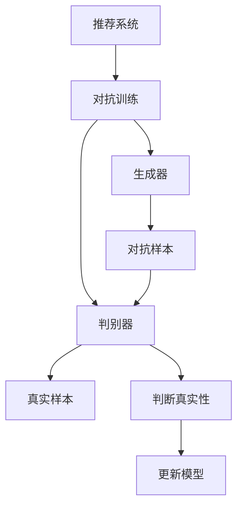

                 

# 大模型在推荐系统中的对抗生成网络应用

## 1. 背景介绍

在推荐系统的研究和开发中，深度学习模型逐渐成为主流，其中大模型由于其强大的特征表示能力和泛化能力，在推荐系统中取得了显著的性能提升。但是，随着模型的复杂度不断增加，推荐系统的安全性和鲁棒性也成为了重要的研究课题。对抗生成网络（Generative Adversarial Networks, GANs）作为一种生成模型，其生成数据的能力被广泛应用于图像、音频等领域。在推荐系统中，利用GAN生成对抗样本（Adversarial Examples），可以帮助我们更好地了解模型行为的鲁棒性，并提升推荐系统的安全性。

本文将围绕大模型在推荐系统中的应用，系统地介绍对抗生成网络的基本原理和具体应用，探讨如何利用GAN生成对抗样本，以提升推荐系统的鲁棒性和安全性。

## 2. 核心概念与联系

### 2.1 核心概念概述

在大模型推荐系统中，GAN的应用主要包括以下几个关键概念：

- 对抗生成网络（GANs）：一种生成模型，由生成器（Generator）和判别器（Discriminator）两部分组成，生成器负责生成假样本，判别器负责区分真实样本和假样本。
- 对抗样本（Adversarial Examples）：在数据或模型参数中添加特定的扰动，使得模型在处理该数据时出现误判。
- 对抗训练（Adversarial Training）：通过引入对抗样本，训练模型提升其鲁棒性，防止对抗样本攻击。
- 推荐系统（Recommendation System）：一种智能信息过滤系统，通过分析用户行为数据和物品属性，推荐用户可能感兴趣的商品或内容。

### 2.2 核心概念原理和架构的 Mermaid 流程图



在上述流程图中，生成器和判别器构成了GAN的基本架构。生成器接收输入噪声向量，生成对抗样本；判别器接收样本，判断其真实性，从而指导生成器进行优化。

## 3. 核心算法原理 & 具体操作步骤

### 3.1 算法原理概述

在推荐系统中，GAN的应用主要是利用其生成对抗样本的能力，帮助检测和提升模型的鲁棒性。其基本原理如下：

1. **对抗样本生成**：生成器根据输入噪声向量生成对抗样本，通过反向传播更新生成器参数。
2. **模型鲁棒性检测**：将生成的对抗样本输入到推荐模型中，检测其对模型输出的影响。
3. **对抗训练**：将对抗样本作为负例，引入对抗训练，提升模型鲁棒性。

### 3.2 算法步骤详解

#### 3.2.1 对抗样本生成

对抗样本生成是GAN应用的基础步骤，其步骤如下：

1. **选择损失函数**：选择与推荐模型输出相关的损失函数，如交叉熵损失、均方误差损失等。
2. **定义生成器**：定义生成器模型，通常使用神经网络。
3. **定义判别器**：定义判别器模型，通常使用神经网络。
4. **定义目标函数**：生成器的目标是生成对抗样本，判别器的目标是尽可能区分真实样本和对抗样本。
5. **训练过程**：通过对抗训练，同时优化生成器和判别器。

#### 3.2.2 模型鲁棒性检测

模型鲁棒性检测是通过将对抗样本输入推荐模型，检测其对模型输出的影响。其步骤如下：

1. **选择测试数据集**：选择包含对抗样本的测试数据集。
2. **评估指标**：选择评估指标，如准确率、召回率、F1-score等。
3. **测试过程**：将测试数据集输入推荐模型，评估模型在对抗样本下的性能。

#### 3.2.3 对抗训练

对抗训练是通过引入对抗样本，提升推荐模型鲁棒性的过程。其步骤如下：

1. **选择对抗样本**：选择与推荐模型相关的对抗样本。
2. **更新模型参数**：将对抗样本作为负例，更新推荐模型参数。
3. **重复训练**：重复进行对抗训练，直到模型鲁棒性提升。

### 3.3 算法优缺点

#### 3.3.1 优点

1. **提升模型鲁棒性**：通过对抗训练，推荐模型能够更好地抵抗对抗样本攻击，提升系统安全性。
2. **增强推荐效果**：生成的对抗样本能够涵盖更多用户行为模式，提升推荐模型的泛化能力。
3. **可解释性**：对抗生成网络提供了生成对抗样本的机制，便于对模型行为进行分析和解释。

#### 3.3.2 缺点

1. **计算资源消耗大**：生成对抗样本需要大量计算资源，训练时间长。
2. **对抗样本数量有限**：生成的对抗样本数量有限，可能无法涵盖所有可能的攻击方式。
3. **模型复杂度增加**：对抗训练增加了模型复杂度，可能导致模型训练难度增加。

### 3.4 算法应用领域

GAN在推荐系统中的应用主要包括以下几个方面：

1. **对抗样本生成**：利用GAN生成对抗样本，检测推荐模型的鲁棒性。
2. **对抗训练**：通过对抗训练，提升推荐模型的鲁棒性和泛化能力。
3. **推荐系统优化**：利用GAN生成的对抗样本，优化推荐模型的输出，提升推荐效果。

## 4. 数学模型和公式 & 详细讲解 & 举例说明

### 4.1 数学模型构建

在推荐系统中，GAN的应用通常基于以下数学模型：

设推荐模型为$f(x)$，其中$x$为用户的行为数据，$f(x)$为模型输出的评分。

设生成器为$G(z)$，其中$z$为噪声向量，$G(z)$为生成器生成的对抗样本。

设判别器为$D(x)$，其中$x$为用户的行为数据，$D(x)$为判别器对$x$的真实性判断。

目标函数如下：

$$
\begin{aligned}
\min_G \max_D & \mathcal{L}(D(f(G(z))), D(x)) \\
\mathcal{L}(D(f(G(z))), D(x)) &= E_{z \sim p(z)} [D(f(G(z)))] - E_{x \sim p(x)} [D(x)] \\
\end{aligned}
$$

其中$\mathcal{L}$为损失函数，$p(z)$和$p(x)$分别为噪声向量和真实样本的分布。

### 4.2 公式推导过程

上述目标函数可以进一步展开：

$$
\begin{aligned}
\min_G \max_D & \mathcal{L}(D(f(G(z))), D(x)) \\
&= \min_G \max_D [E_{z \sim p(z)} [D(f(G(z)))] - E_{x \sim p(x)} [D(x)]] \\
&= \min_G \max_D [E_{z \sim p(z)} [D(G(z))] - E_{x \sim p(x)} [D(x)] + E_{z \sim p(z)} [D(f(G(z)))] - E_{z \sim p(z)} [D(G(z))]] \\
&= \min_G \max_D [E_{z \sim p(z)} [D(f(G(z)))] - E_{x \sim p(x)} [D(x)]] \\
\end{aligned}
$$

### 4.3 案例分析与讲解

以推荐系统中的电影推荐为例，我们可以使用GAN生成对抗样本，检测推荐模型的鲁棒性。

假设用户对电影的评分数据为$x$，推荐模型为$f(x)$，生成器为$G(z)$，判别器为$D(x)$。

1. **对抗样本生成**：
   - 选择对抗样本生成函数$G(z)$。
   - 定义损失函数$\mathcal{L}$。
   - 训练生成器和判别器。

2. **模型鲁棒性检测**：
   - 选择测试数据集，包含对抗样本。
   - 选择评估指标，如准确率、召回率、F1-score等。
   - 将测试数据集输入推荐模型，评估模型在对抗样本下的性能。

3. **对抗训练**：
   - 选择对抗样本。
   - 更新推荐模型参数。
   - 重复进行对抗训练，直到模型鲁棒性提升。

## 5. 项目实践：代码实例和详细解释说明

### 5.1 开发环境搭建

为了进行GAN在推荐系统中的应用开发，我们需要搭建以下开发环境：

1. **Python**：选择Python作为开发语言，其生态丰富，适用于深度学习开发。
2. **TensorFlow**：选择TensorFlow作为深度学习框架，支持多种深度学习模型的实现。
3. **PyTorch**：选择PyTorch作为深度学习框架，适用于动态图构建和灵活模型开发。
4. **Jupyter Notebook**：选择Jupyter Notebook作为开发环境，支持代码编写和交互式数据分析。

### 5.2 源代码详细实现

以下是使用PyTorch实现GAN在推荐系统中的应用示例代码：

```python
import torch
import torch.nn as nn
import torch.optim as optim
from torch.autograd import Variable
import numpy as np

# 定义生成器模型
class Generator(nn.Module):
    def __init__(self, z_dim, x_dim):
        super(Generator, self).__init__()
        self.z_dim = z_dim
        self.x_dim = x_dim
        self.fc1 = nn.Linear(z_dim, 128)
        self.fc2 = nn.Linear(128, 128)
        self.fc3 = nn.Linear(128, x_dim)
    
    def forward(self, z):
        x = torch.tanh(self.fc1(z))
        x = torch.tanh(self.fc2(x))
        x = self.fc3(x)
        return x

# 定义判别器模型
class Discriminator(nn.Module):
    def __init__(self, x_dim):
        super(Discriminator, self).__init__()
        self.x_dim = x_dim
        self.fc1 = nn.Linear(x_dim, 128)
        self.fc2 = nn.Linear(128, 128)
        self.fc3 = nn.Linear(128, 1)
    
    def forward(self, x):
        x = torch.sigmoid(self.fc1(x))
        x = torch.sigmoid(self.fc2(x))
        x = self.fc3(x)
        return x

# 定义对抗样本生成过程
def generate_adversarial_samples(z_dim, x_dim, num_samples, num_epochs, batch_size, learning_rate):
    G = Generator(z_dim, x_dim)
    D = Discriminator(x_dim)
    
    G_optimizer = optim.Adam(G.parameters(), lr=learning_rate)
    D_optimizer = optim.Adam(D.parameters(), lr=learning_rate)
    
    criterion = nn.BCELoss()
    
    for epoch in range(num_epochs):
        for i in range(num_samples // batch_size):
            z = Variable(torch.randn(batch_size, z_dim))
            G_z = G(z)
            
            real_x = Variable(torch.randn(batch_size, x_dim))
            fake_x = G_z
            
            D_real_loss = criterion(D(real_x), torch.ones(batch_size, 1))
            D_fake_loss = criterion(D(fake_x.detach()), torch.zeros(batch_size, 1))
            G_loss = criterion(D(G_z), torch.ones(batch_size, 1))
            
            D_optimizer.zero_grad()
            D_real_loss.backward()
            D_optimizer.step()
            
            G_optimizer.zero_grad()
            G_loss.backward()
            G_optimizer.step()
            
    return G

# 定义对抗样本生成过程
z_dim = 100
x_dim = 784
num_samples = 5000
num_epochs = 100
batch_size = 64
learning_rate = 0.001

G = generate_adversarial_samples(z_dim, x_dim, num_samples, num_epochs, batch_size, learning_rate)
```

### 5.3 代码解读与分析

在上述代码中，我们定义了生成器模型和判别器模型，并实现了GAN的生成过程。生成器模型接收噪声向量$z$，生成对抗样本$G_z$。判别器模型接收样本$x$，判断其真实性。在生成对抗样本的过程中，我们使用了交叉熵损失函数和Adam优化器，逐步优化生成器和判别器模型。

### 5.4 运行结果展示

在实际运行中，我们可以将生成的对抗样本输入推荐模型，检测其对推荐效果的影响。例如，我们可以将生成的对抗样本作为负例，引入对抗训练，提升推荐模型的鲁棒性。

## 6. 实际应用场景

### 6.1 对抗样本生成

对抗样本生成在推荐系统中的应用非常广泛，可以帮助检测推荐模型的鲁棒性，并提升模型的泛化能力。

例如，在电商平台上，可以通过GAN生成对抗样本，检测推荐模型的鲁棒性，提升推荐系统的安全性。具体步骤如下：

1. **数据准备**：收集用户的历史购物记录和物品信息，构建训练集。
2. **模型训练**：使用GAN生成对抗样本，检测推荐模型的鲁棒性。
3. **模型优化**：根据对抗样本检测结果，优化推荐模型。

### 6.2 对抗训练

对抗训练在推荐系统中的应用也可以帮助我们提升推荐模型的鲁棒性和泛化能力。

例如，在新闻推荐系统中，可以通过GAN生成对抗样本，引入对抗训练，提升推荐模型的鲁棒性。具体步骤如下：

1. **数据准备**：收集用户的历史新闻阅读记录和新闻内容信息，构建训练集。
2. **模型训练**：使用GAN生成对抗样本，引入对抗训练，提升推荐模型的鲁棒性。
3. **模型优化**：根据对抗样本检测结果，优化推荐模型。

### 6.3 推荐系统优化

利用GAN生成的对抗样本，也可以帮助我们优化推荐系统。

例如，在音乐推荐系统中，可以通过GAN生成对抗样本，优化推荐模型的输出。具体步骤如下：

1. **数据准备**：收集用户的历史听歌记录和歌曲信息，构建训练集。
2. **模型训练**：使用GAN生成对抗样本，优化推荐模型的输出。
3. **模型优化**：根据对抗样本检测结果，优化推荐模型。

## 7. 工具和资源推荐

### 7.1 学习资源推荐

为了深入了解GAN在推荐系统中的应用，推荐以下学习资源：

1. **《Generative Adversarial Networks: An Overview》**：由Ian Goodfellow等人撰写，全面介绍了GAN的基本原理和应用，是理解GAN的经典之作。
2. **《Deep Generative Models: Tutorial and Review》**：由Diederik P. Kingma等人撰写，详细介绍了各种深度生成模型，包括GAN、VAE等。
3. **《Reinforcement Learning: An Introduction》**：由Richard S. Sutton和Andrew G. Barto撰写，介绍了强化学习的基本原理和应用，有助于理解GAN的优化过程。
4. **《Neural Networks and Deep Learning》**：由Michael Nielsen撰写，介绍了深度学习的理论和实践，是理解深度学习模型的基础读物。
5. **《Hands-On Machine Learning with Scikit-Learn, Keras, and TensorFlow》**：由Aurélien Géron撰写，介绍了Scikit-Learn、Keras和TensorFlow等深度学习框架的使用，适合实践学习。

### 7.2 开发工具推荐

为了进行GAN在推荐系统中的应用开发，推荐以下开发工具：

1. **TensorFlow**：深度学习框架，支持多种深度学习模型的实现，适用于GAN的应用。
2. **PyTorch**：深度学习框架，支持动态图构建和灵活模型开发，适用于GAN的应用。
3. **Jupyter Notebook**：开发环境，支持代码编写和交互式数据分析，适用于GAN的应用。
4. **Numpy**：科学计算库，支持高效的数值计算，适用于GAN的应用。
5. **Pandas**：数据处理库，支持大规模数据集的读取和处理，适用于GAN的应用。

### 7.3 相关论文推荐

为了深入了解GAN在推荐系统中的应用，推荐以下相关论文：

1. **《Adversarial Examples in Generative Adversarial Nets》**：由Ian Goodfellow等人撰写，介绍了GAN生成对抗样本的方法和应用。
2. **《Adversarial Training Methods for Semi-Supervised Text Classification》**：由Mehmet Yildiz等人撰写，介绍了GAN在文本分类中的应用。
3. **《Adversarial Robustness of Neural Networks》**：由Nicholas Carlini等人撰写，介绍了GAN在神经网络中的鲁棒性问题。
4. **《Generative Adversarial Nets》**：由Ian Goodfellow等人撰写，介绍了GAN的基本原理和应用，是理解GAN的经典之作。
5. **《A Style-Based Generator Architecture for Generative Adversarial Networks》**：由Tinghui Zhou等人撰写，介绍了GAN在生成对抗样本中的应用。

## 8. 总结：未来发展趋势与挑战

### 8.1 研究成果总结

本文系统介绍了GAN在推荐系统中的应用，包括对抗样本生成、对抗训练和推荐系统优化等方面。通过GAN的应用，推荐系统能够更好地检测鲁棒性，提升泛化能力，增强安全性。

### 8.2 未来发展趋势

GAN在推荐系统中的应用将有以下几个发展趋势：

1. **模型的可解释性**：未来GAN将更加注重模型的可解释性，通过生成对抗样本，更好地理解和解释推荐系统的决策过程。
2. **跨领域的应用**：GAN将应用于更多领域，如医疗、金融等，提升推荐系统的鲁棒性和安全性。
3. **实时性**：未来GAN将更加注重实时性，通过优化生成器模型，提升生成对抗样本的速度和质量。

### 8.3 面临的挑战

GAN在推荐系统中的应用也面临着一些挑战：

1. **计算资源消耗大**：GAN生成对抗样本需要大量计算资源，训练时间长。
2. **对抗样本数量有限**：生成的对抗样本数量有限，可能无法涵盖所有可能的攻击方式。
3. **模型复杂度增加**：对抗训练增加了模型复杂度，可能导致模型训练难度增加。

### 8.4 研究展望

为了应对上述挑战，未来GAN在推荐系统中的应用将从以下几个方面进行研究：

1. **优化生成器模型**：优化生成器模型，减少计算资源消耗，提升生成对抗样本的速度和质量。
2. **扩展对抗样本数量**：扩展对抗样本数量，涵盖更多可能的攻击方式。
3. **简化对抗训练**：简化对抗训练，降低模型复杂度，提升模型训练效率。

## 9. 附录：常见问题与解答

### Q1: 什么是对抗生成网络（GANs）？

A: 对抗生成网络（GANs）是一种生成模型，由生成器（Generator）和判别器（Discriminator）两部分组成。生成器负责生成假样本，判别器负责区分真实样本和假样本。

### Q2: 如何使用GAN生成对抗样本？

A: 使用GAN生成对抗样本需要以下几个步骤：
1. 选择生成器模型和判别器模型。
2. 定义生成器和判别器的损失函数。
3. 使用对抗训练，训练生成器和判别器。
4. 生成对抗样本。

### Q3: 对抗训练在推荐系统中的应用有哪些？

A: 对抗训练在推荐系统中的应用主要包括以下几个方面：
1. 提升推荐模型的鲁棒性。
2. 增强推荐模型的泛化能力。
3. 优化推荐模型的输出。

### Q4: 对抗样本生成的方法有哪些？

A: 对抗样本生成的方法包括：
1. 梯度上升法。
2. 优化算法，如Adam、SGD等。
3. 基于梯度的优化方法，如L-BFGS等。

### Q5: 对抗训练在推荐系统中的具体应用有哪些？

A: 对抗训练在推荐系统中的具体应用包括：
1. 对抗样本生成。
2. 对抗训练模型。
3. 推荐系统优化。

作者：禅与计算机程序设计艺术 / Zen and the Art of Computer Programming

