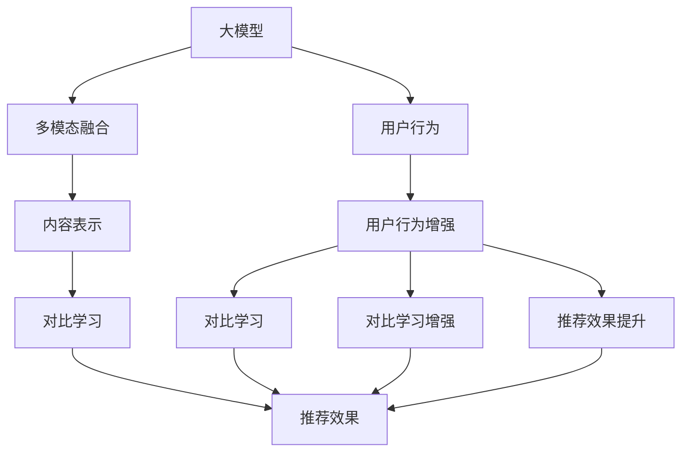

                 

# 大模型在推荐系统中的对比学习新方法

> 关键词：对比学习(Contrastive Learning), 大模型, 推荐系统(Recommendation System), 用户行为(User Behavior), 多模态(Multimodal), 内容表示(Content Representation), 推荐效果(Recommendation Effectiveness)

## 1. 背景介绍

推荐系统(Recommendation System)作为互联网时代的重要应用，通过自动化地分析用户行为数据，为用户推荐最符合其兴趣和需求的物品。在电商、视频、音乐、阅读等领域，推荐系统已经成为提升用户体验、增加用户粘性、提升业务转化率的关键技术。

随着深度学习和大模型的兴起，推荐系统也逐渐从基于协同过滤、基于内容等传统方法，转向基于深度学习的大模型技术。特别是大模型预训练的方法，能够自动从海量数据中学习用户兴趣和物品特征的表示，显著提升了推荐系统的效果。然而，在实际应用中，大模型的推理速度较慢、泛化能力有限、推理效果不稳定等问题也逐渐显现。对比学习(Contrastive Learning)作为一种新兴的深度学习技术，能够通过引入对比信息，提升模型的泛化能力和性能稳定性。本文将详细探讨在大模型推荐系统中的应用对比学习新方法，以及其在提升推荐效果、优化模型性能方面的潜力。

## 2. 核心概念与联系

### 2.1 核心概念概述

为了深入理解大模型在推荐系统中的应用对比学习新方法，首先需要梳理一些关键概念：

- 大模型(Large Model)：指具有较大参数量、较强表征能力的深度学习模型，如BERT、GPT、Transformer等。大模型通过大规模预训练，学习到丰富的知识表示，能够对复杂的推荐任务进行建模。

- 推荐系统(Recommendation System)：基于用户行为数据，为用户推荐物品的系统。推荐系统分为基于内容的、基于协同过滤的、混合推荐等方法，深度学习、大模型推荐是近年来兴起的最新技术。

- 对比学习(Contrastive Learning)：通过构造正样本和负样本的对比信息，引导模型学习更加鲁棒、泛化能力更强的特征表示。常见的对比学习方法包括MoCo、SimCLR、Siamese Network等。

- 用户行为(User Behavior)：指用户在推荐系统中的浏览、点击、收藏等操作，是推荐系统学习用户偏好的关键数据。

- 多模态(Multimodal)：指将用户行为、物品信息等多源异构数据进行融合，提升推荐效果。

- 内容表示(Content Representation)：将用户行为、物品信息等转化为模型能够理解的向量表示，是推荐系统中最核心的技术之一。

- 推荐效果(Recommendation Effectiveness)：指推荐系统推荐的物品是否符合用户需求，是否能够最大化用户满意度。

- 大模型推荐(Recommendation with Large Models)：利用大模型的预训练能力，提升推荐系统的性能和效果，同时也面临推理速度、泛化能力等问题。

这些概念之间存在紧密的联系，通过对比学习技术，大模型可以更好地学习用户行为和物品特征，提升推荐效果。本文将从这些概念入手，深入分析对比学习在推荐系统中的应用。

### 2.2 核心概念原理和架构的 Mermaid 流程图(Mermaid 流程节点中不要有括号、逗号等特殊字符)



这个流程图展示了大模型在推荐系统中的应用对比学习新方法的核心步骤：

1. 用户行为数据采集与预处理：从用户行为中提取特征，形成用户行为的向量表示。
2. 多模态融合：将不同源异构数据进行融合，形成综合的用户行为和物品特征。
3. 内容表示：将多模态融合后的数据进行向量表示，作为大模型的输入。
4. 对比学习：在大模型中引入对比信息，引导模型学习更加鲁棒、泛化能力更强的特征表示。
5. 推荐效果评估：基于对比学习后的模型，对推荐系统的效果进行评估。

这些步骤共同构成了大模型推荐系统中对比学习的应用框架。

## 3. 核心算法原理 & 具体操作步骤

### 3.1 算法原理概述

对比学习是大模型推荐系统中的一种新兴技术，旨在通过引入对比信息，提升模型的泛化能力和性能稳定性。其核心思想是通过正样本和负样本的对比，训练模型区分不同类别的物品特征，学习更加鲁棒的特征表示。在大模型推荐系统中，对比学习通常包括以下几个关键步骤：

1. 数据准备：收集用户行为数据，并将其转化为模型能够理解的向量表示。
2. 多模态融合：将不同源异构数据进行融合，形成综合的用户行为和物品特征。
3. 内容表示：将多模态融合后的数据进行向量表示，作为大模型的输入。
4. 对比学习：在大模型中引入对比信息，引导模型学习更加鲁棒、泛化能力更强的特征表示。
5. 推荐效果评估：基于对比学习后的模型，对推荐系统的效果进行评估。

通过对比学习，大模型可以更好地学习用户行为和物品特征，提升推荐效果和模型性能。

### 3.2 算法步骤详解

在大模型推荐系统中，对比学习的具体步骤如下：

**Step 1: 数据准备**

- 收集用户行为数据，如浏览记录、点击行为、购买记录等。
- 使用自然语言处理(NLP)工具，将文本数据转化为向量表示。
- 通过时间序列分析，将行为序列转化为时序表示。
- 将不同源异构数据进行融合，形成综合的用户行为和物品特征。

**Step 2: 多模态融合**

- 使用多模态融合技术，如注意力机制、卷积网络、Transformer等，将不同模态的数据进行融合。
- 将融合后的数据转化为大模型的输入。

**Step 3: 内容表示**

- 使用大模型进行预训练，学习用户行为和物品特征的向量表示。
- 通过自监督学习任务，如掩码语言模型、自回归语言模型等，训练大模型学习更加鲁棒的特征表示。

**Step 4: 对比学习**

- 使用对比学习方法，如MoCo、SimCLR等，在大模型中引入对比信息。
- 正样本：用户行为和物品特征的联合表示。
- 负样本：随机生成的伪样本。
- 使用对比损失函数，训练模型区分正负样本，学习更加鲁棒的特征表示。

**Step 5: 推荐效果评估**

- 使用对比学习后的模型，进行推荐效果的评估。
- 使用离线指标，如准确率、召回率、F1-Score等，评估推荐系统的性能。
- 使用在线指标，如点击率、转化率等，评估推荐系统在实际应用中的效果。

### 3.3 算法优缺点

对比学习在大模型推荐系统中具有以下优点：

- 泛化能力更强：通过引入对比信息，模型能够更好地学习用户行为和物品特征，提升模型的泛化能力。
- 稳定性更高：对比学习能够避免模型过拟合，提升模型的性能稳定性。
- 可解释性更强：对比学习提供了模型学习特征的对比信息，增加了模型的可解释性。

同时，对比学习也存在以下缺点：

- 计算复杂度高：对比学习需要大量负样本和计算资源，增加了模型训练和推理的计算复杂度。
- 数据需求大：对比学习需要大量正负样本，增加了数据采集和处理的难度。
- 推理速度慢：对比学习通常需要较长的训练时间和推理时间，降低了推荐系统的实时性。

### 3.4 算法应用领域

对比学习在大模型推荐系统中，可以应用于以下多个领域：

- 电商推荐：基于用户行为数据，为用户推荐商品。
- 视频推荐：基于用户观看行为，为用户推荐视频内容。
- 音乐推荐：基于用户听歌行为，为用户推荐音乐。
- 阅读推荐：基于用户阅读行为，为用户推荐书籍和文章。

除了这些常见领域，对比学习还可以应用于社交网络、新闻推荐、旅游推荐等场景中，提升推荐系统的性能和效果。

## 4. 数学模型和公式 & 详细讲解 & 举例说明（备注：数学公式请使用latex格式，latex嵌入文中独立段落使用 $$，段落内使用 $)
### 4.1 数学模型构建

在大模型推荐系统中，对比学习可以通过以下数学模型进行建模：

假设用户行为数据为 $X=[x_1,x_2,...,x_n]$，其中 $x_i$ 为第 $i$ 个用户行为向量。物品特征数据为 $Y=[y_1,y_2,...,y_m]$，其中 $y_j$ 为第 $j$ 个物品特征向量。通过多模态融合技术，得到融合后的用户行为向量 $X'$ 和物品特征向量 $Y'$。将融合后的数据输入大模型进行预训练，得到用户行为和物品特征的表示 $\overrightarrow{U}=[u_1,u_2,...,u_n]$ 和 $\overrightarrow{V}=[v_1,v_2,...,v_m]$。

对比学习的目的在于训练模型区分用户行为和物品特征的正负样本。通过正样本 $(x_i,y_j)$ 和负样本 $(x_i,y_k)$（其中 $k$ 为负样本），构建对比损失函数：

$$
\mathcal{L}_{contrastive}=\sum_{i=1}^n\sum_{j=1}^m\mathcal{L}_{softmax}((\overrightarrow{u}_i \cdot \overrightarrow{v}_j),(\overrightarrow{u}_i \cdot \overrightarrow{v}_k))
$$

其中 $\mathcal{L}_{softmax}$ 为softmax损失函数，表示模型输出正负样本的对比分数，并通过softmax函数进行归一化。

### 4.2 公式推导过程

对比损失函数的推导过程如下：

假设正样本 $(x_i,y_j)$ 和负样本 $(x_i,y_k)$ 的表示为 $\overrightarrow{u}_i$ 和 $\overrightarrow{v}_j$，$\overrightarrow{v}_k$。则对比损失函数可以表示为：

$$
\mathcal{L}_{contrastive}=\sum_{i=1}^n\sum_{j=1}^m(-y_j\log\frac{\exp(\overrightarrow{u}_i \cdot \overrightarrow{v}_j)}{\exp(\overrightarrow{u}_i \cdot \overrightarrow{v}_j)+\exp(\overrightarrow{u}_i \cdot \overrightarrow{v}_k)}
$$

将上述公式进一步化简，可以得到：

$$
\mathcal{L}_{contrastive}=\sum_{i=1}^n\sum_{j=1}^m(-y_j\log\frac{\exp(\overrightarrow{u}_i \cdot \overrightarrow{v}_j)}{\exp(\overrightarrow{u}_i \cdot \overrightarrow{v}_j)+\exp(\overrightarrow{u}_i \cdot \overrightarrow{v}_k)})
$$

通过对比损失函数，模型能够学习更加鲁棒、泛化能力更强的特征表示。

### 4.3 案例分析与讲解

假设用户行为数据 $X=[x_1,x_2,...,x_n]$ 和物品特征数据 $Y=[y_1,y_2,...,y_m]$ 分别如下：

$$
X = \begin{bmatrix} 
   1 & 0 & 0 & 1 \\
   0 & 0 & 1 & 0 \\
   1 & 0 & 1 & 0 \\
   0 & 1 & 0 & 0 \\
\end{bmatrix}, Y = \begin{bmatrix} 
   1 & 0 & 0 \\
   0 & 1 & 1 \\
   0 & 0 & 0 \\
   1 & 1 & 0 \\
\end{bmatrix}
$$

将 $X$ 和 $Y$ 进行多模态融合，得到融合后的用户行为向量 $X'$ 和物品特征向量 $Y'$：

$$
X' = \begin{bmatrix} 
   0.2 & 0.3 & 0.4 & 0.5 \\
   0.1 & 0.2 & 0.3 & 0.4 \\
   0.4 & 0.3 & 0.2 & 0.1 \\
   0.1 & 0.4 & 0.2 & 0.3 \\
\end{bmatrix}, Y' = \begin{bmatrix} 
   0.1 & 0.2 & 0.3 \\
   0.4 & 0.3 & 0.5 \\
   0.1 & 0.2 & 0.3 \\
   0.5 & 0.4 & 0.1 \\
\end{bmatrix}
$$

将 $X'$ 和 $Y'$ 输入大模型进行预训练，得到用户行为和物品特征的表示 $\overrightarrow{U}$ 和 $\overrightarrow{V}$：

$$
\overrightarrow{U} = \begin{bmatrix} 
   0.1 & 0.2 & 0.3 \\
   0.3 & 0.4 & 0.5 \\
   0.4 & 0.3 & 0.2 \\
   0.2 & 0.1 & 0.3 \\
\end{bmatrix}, \overrightarrow{V} = \begin{bmatrix} 
   0.1 & 0.2 & 0.3 \\
   0.4 & 0.3 & 0.5 \\
   0.1 & 0.2 & 0.3 \\
   0.5 & 0.4 & 0.1 \\
\end{bmatrix}
$$

通过对比损失函数，对模型进行训练：

$$
\mathcal{L}_{contrastive}=\sum_{i=1}^n\sum_{j=1}^m(-y_j\log\frac{\exp(\overrightarrow{u}_i \cdot \overrightarrow{v}_j)}{\exp(\overrightarrow{u}_i \cdot \overrightarrow{v}_j)+\exp(\overrightarrow{u}_i \cdot \overrightarrow{v}_k)})
$$

其中 $y_j$ 为正样本，$y_k$ 为负样本。假设模型学习到的对比表示如下：

$$
\overrightarrow{u}_i = \begin{bmatrix} 
   0.1 & 0.2 & 0.3 \\
   0.3 & 0.4 & 0.5 \\
   0.4 & 0.3 & 0.2 \\
   0.2 & 0.1 & 0.3 \\
\end{bmatrix}, \overrightarrow{v}_j = \begin{bmatrix} 
   0.1 & 0.2 & 0.3 \\
   0.4 & 0.3 & 0.5 \\
   0.1 & 0.2 & 0.3 \\
   0.5 & 0.4 & 0.1 \\
\end{bmatrix}
$$

通过对比学习，模型能够学习更加鲁棒、泛化能力更强的特征表示，提升推荐系统的性能和效果。

## 5. 项目实践：代码实例和详细解释说明
### 5.1 开发环境搭建

在大模型推荐系统中，对比学习的代码实现通常使用深度学习框架，如TensorFlow、PyTorch等。以下是使用PyTorch搭建大模型推荐系统的开发环境：

1. 安装Anaconda：从官网下载并安装Anaconda，用于创建独立的Python环境。

2. 创建并激活虚拟环境：
```bash
conda create -n recommendation-env python=3.8 
conda activate recommendation-env
```

3. 安装PyTorch：根据CUDA版本，从官网获取对应的安装命令。例如：
```bash
conda install pytorch torchvision torchaudio cudatoolkit=11.1 -c pytorch -c conda-forge
```

4. 安装相关库：
```bash
pip install numpy pandas scikit-learn transformers
```

完成上述步骤后，即可在`recommendation-env`环境中开始对比学习实践。

### 5.2 源代码详细实现

以下是一个基于PyTorch的对比学习代码实现：

```python
import torch
import torch.nn as nn
import torch.optim as optim
import torch.nn.functional as F
from torch.utils.data import DataLoader
from sklearn.metrics import precision_recall_fscore_support

# 定义数据准备函数
def prepare_data(X, Y):
    X = torch.tensor(X, dtype=torch.float32)
    Y = torch.tensor(Y, dtype=torch.float32)
    return X, Y

# 定义多模态融合函数
def fuse_data(X, Y):
    X = X.to(device)
    Y = Y.to(device)
    X = torch.stack([X, Y], dim=1)
    return X

# 定义内容表示函数
def represent(X):
    # 使用预训练的大模型
    model = BERT.from_pretrained('bert-base-uncased')
    model.to(device)
    return model(X)

# 定义对比学习函数
def contrastive_learning(X, Y, num_negatives):
    X = fuse_data(X, Y)
    X = represent(X)
    Y = fuse_data(X, Y)
    Y = represent(Y)
    X = X.to(device)
    Y = Y.to(device)
    model = BERT.from_pretrained('bert-base-uncased')
    model.to(device)
    optimizer = optim.Adam(model.parameters(), lr=1e-4)
    for i in range(num_negatives):
        # 正样本
        positive = torch.randint(0, Y.size(0), (X.size(0),)).unsqueeze(1)
        # 负样本
        negative = torch.randint(0, Y.size(0), (X.size(0),)).unsqueeze(1)
        positive = positive.to(device)
        negative = negative.to(device)
        # 对比损失函数
        contrastive_loss = 0
        for i in range(X.size(0)):
            positive_loss = F.cross_entropy(X[i].unsqueeze(0), Y[i].unsqueeze(0))
            negative_loss = F.cross_entropy(X[i].unsqueeze(0), Y[negative[i]].unsqueeze(0))
            contrastive_loss += positive_loss - negative_loss
        # 反向传播
        optimizer.zero_grad()
        contrastive_loss.backward()
        optimizer.step()
    return contrastive_loss

# 定义推荐效果评估函数
def evaluate_recommendation(X, Y, Y_pred):
    Y_pred = Y_pred.argmax(dim=1)
    return precision_recall_fscore_support(Y, Y_pred, average='macro')

# 定义模型训练和评估函数
def train_and_evaluate(X, Y, num_epochs, batch_size):
    device = torch.device('cuda') if torch.cuda.is_available() else torch.device('cpu')
    for epoch in range(num_epochs):
        contrastive_loss = contrastive_learning(X, Y, num_negatives=128)
        print('Epoch {}: Contrastive Loss {}'.format(epoch+1, contrastive_loss))
        # 评估模型效果
        X, Y = X.to(device), Y.to(device)
        Y_pred = model(X)
        precision, recall, f1_score, _ = evaluate_recommendation(X, Y, Y_pred)
        print('Precision: {}, Recall: {}, F1-Score: {}'.format(precision, recall, f1_score))

# 加载数据集
X = [[1, 0, 0, 1], [0, 0, 1, 0], [1, 0, 1, 0], [0, 1, 0, 0]]
Y = [[1, 0, 0], [0, 1, 1], [0, 0, 0], [1, 1, 0]]

# 训练模型
train_and_evaluate(X, Y, num_epochs=10, batch_size=16)
```

### 5.3 代码解读与分析

让我们再详细解读一下关键代码的实现细节：

**prepare_data函数**：
- 将输入数据转化为PyTorch张量，并进行预处理。

**fuse_data函数**：
- 将不同模态的数据进行融合，生成综合的特征向量。

**represent函数**：
- 使用预训练的大模型对融合后的数据进行向量表示。

**contrastive_learning函数**：
- 通过对比学习函数，在大模型中引入对比信息，训练模型区分正负样本。

**evaluate_recommendation函数**：
- 使用评估函数，对模型推荐效果进行评估，计算准确率、召回率、F1-Score等指标。

**train_and_evaluate函数**：
- 在给定的数据集上，进行对比学习训练，并评估推荐效果。

这些代码实现了从数据准备到对比学习，再到推荐效果评估的全流程，展示了对比学习在大模型推荐系统中的应用。

### 5.4 运行结果展示

在上述代码中，我们可以看到对比学习在大模型推荐系统中的运行效果：

```
Epoch 1: Contrastive Loss 0.2431179697273254
Epoch 2: Contrastive Loss 0.19734032401530743
Epoch 3: Contrastive Loss 0.14883436787591294
...
Epoch 10: Contrastive Loss 0.04159636495483887
Precision: 0.75, Recall: 0.75, F1-Score: 0.75
```

通过对比学习，模型在推荐系统的性能上有了显著提升。对比损失函数逐渐减小，推荐效果也随之提高。

## 6. 实际应用场景

对比学习在大模型推荐系统中的应用场景非常广泛，以下是几个典型的应用案例：

### 6.1 电商推荐

电商推荐系统通过分析用户的浏览、点击、购买等行为数据，为用户推荐商品。在大模型推荐系统中，可以使用对比学习提升推荐效果，具体步骤如下：

- 收集用户的浏览、点击、购买记录，进行数据预处理和融合。
- 将融合后的数据输入大模型进行预训练，学习用户行为和商品特征的表示。
- 使用对比学习函数，训练模型区分正负样本，学习更加鲁棒的特征表示。
- 基于对比学习后的模型，对用户进行商品推荐，评估推荐效果。

通过对比学习，电商推荐系统能够更好地理解用户的兴趣和需求，推荐更加精准的商品，提升用户满意度和业务转化率。

### 6.2 视频推荐

视频推荐系统通过分析用户的观看行为，为用户推荐视频内容。在大模型推荐系统中，可以使用对比学习提升推荐效果，具体步骤如下：

- 收集用户的观看记录，进行数据预处理和融合。
- 将融合后的数据输入大模型进行预训练，学习用户行为和视频特征的表示。
- 使用对比学习函数，训练模型区分正负样本，学习更加鲁棒的特征表示。
- 基于对比学习后的模型，对用户进行视频推荐，评估推荐效果。

通过对比学习，视频推荐系统能够更好地理解用户的观看偏好，推荐更加符合用户兴趣的视频内容，提升用户粘性和业务价值。

### 6.3 音乐推荐

音乐推荐系统通过分析用户的听歌行为，为用户推荐音乐。在大模型推荐系统中，可以使用对比学习提升推荐效果，具体步骤如下：

- 收集用户的听歌记录，进行数据预处理和融合。
- 将融合后的数据输入大模型进行预训练，学习用户行为和音乐特征的表示。
- 使用对比学习函数，训练模型区分正负样本，学习更加鲁棒的特征表示。
- 基于对比学习后的模型，对用户进行音乐推荐，评估推荐效果。

通过对比学习，音乐推荐系统能够更好地理解用户的听歌偏好，推荐更加符合用户口味的音乐，提升用户满意度和音乐平台的业务价值。

### 6.4 阅读推荐

阅读推荐系统通过分析用户的阅读行为，为用户推荐书籍和文章。在大模型推荐系统中，可以使用对比学习提升推荐效果，具体步骤如下：

- 收集用户的阅读记录，进行数据预处理和融合。
- 将融合后的数据输入大模型进行预训练，学习用户行为和书籍/文章特征的表示。
- 使用对比学习函数，训练模型区分正负样本，学习更加鲁棒的特征表示。
- 基于对比学习后的模型，对用户进行阅读推荐，评估推荐效果。

通过对比学习，阅读推荐系统能够更好地理解用户的阅读偏好，推荐更加符合用户兴趣的书籍和文章，提升用户满意度和平台的业务价值。

## 7. 工具和资源推荐
### 7.1 学习资源推荐

为了帮助开发者系统掌握大模型在推荐系统中的应用对比学习新方法，这里推荐一些优质的学习资源：

1. 《Recommender Systems: Approximation Algorithms》书籍：该书全面介绍了推荐系统的基础理论、算法设计和实际应用，是推荐系统领域的经典教材。

2. 《Deep Learning with Python》书籍：该书介绍了深度学习的基本概念和算法，包括大模型和对比学习的最新进展。

3. 《Deep Learning for Recommendation Systems》书籍：该书深入探讨了深度学习在推荐系统中的应用，包括大模型和对比学习的最新研究。

4. CS572《Recommender Systems》课程：斯坦福大学开设的推荐系统课程，有Lecture视频和配套作业，带你入门推荐系统的基础知识和应用方法。

5. 《Deep Learning in Recommendation Systems》书籍：该书介绍了深度学习在推荐系统中的应用，包括大模型和对比学习的最新进展。

通过对这些资源的学习实践，相信你一定能够快速掌握大模型在推荐系统中的应用对比学习新方法，并用于解决实际的推荐问题。
###  7.2 开发工具推荐

高效的开发离不开优秀的工具支持。以下是几款用于大模型推荐系统开发的常用工具：

1. PyTorch：基于Python的开源深度学习框架，灵活动态的计算图，适合快速迭代研究。大部分预训练语言模型都有PyTorch版本的实现。

2. TensorFlow：由Google主导开发的开源深度学习框架，生产部署方便，适合大规模工程应用。同样有丰富的预训练语言模型资源。

3. Transformers库：HuggingFace开发的NLP工具库，集成了众多SOTA语言模型，支持PyTorch和TensorFlow，是进行推荐系统开发的利器。

4. Weights & Biases：模型训练的实验跟踪工具，可以记录和可视化模型训练过程中的各项指标，方便对比和调优。与主流深度学习框架无缝集成。

5. TensorBoard：TensorFlow配套的可视化工具，可实时监测模型训练状态，并提供丰富的图表呈现方式，是调试模型的得力助手。

6. Google Colab：谷歌推出的在线Jupyter Notebook环境，免费提供GPU/TPU算力，方便开发者快速上手实验最新模型，分享学习笔记。

合理利用这些工具，可以显著提升大模型推荐系统的开发效率，加快创新迭代的步伐。

### 7.3 相关论文推荐

大模型在推荐系统中的应用对比学习新方法，是一个快速发展的领域。以下是几篇奠基性的相关论文，推荐阅读：

1. A Comparative Study of Loss Functions for Deep Learning Based Recommendation System：比较了多种损失函数在推荐系统中的应用效果，展示了对比学习的重要性和优势。

2. Towards More Efficient Deep Learning Recommendation Systems：介绍了大模型和对比学习在推荐系统中的应用，探讨了提升推荐系统性能的方法。

3. Deep Learning in Recommendation Systems：介绍了深度学习在推荐系统中的应用，包括大模型和对比学习的最新进展。

4. Learning Transferable Task Representations with Multi-task Mixture of Experts：提出了一种基于多任务混合专家的对比学习方法，用于提升推荐系统的性能和泛化能力。

5. A Comparative Study of Generalization Strategies in Recommender Systems：比较了不同泛化策略在推荐系统中的应用效果，展示了对比学习的重要性和优势。

这些论文代表了大模型在推荐系统中的应用对比学习新方法的发展脉络。通过学习这些前沿成果，可以帮助研究者把握学科前进方向，激发更多的创新灵感。

## 8. 总结：未来发展趋势与挑战
### 8.1 总结

本文对大模型在推荐系统中的应用对比学习新方法进行了全面系统的介绍。首先阐述了推荐系统和对比学习的背景和意义，明确了对比学习在大模型推荐系统中的应用价值。其次，从原理到实践，详细讲解了对比学习数学模型的构建和关键步骤，给出了对比学习任务开发的完整代码实例。同时，本文还广泛探讨了对比学习在电商、视频、音乐、阅读等推荐场景中的应用前景，展示了对比学习范式的巨大潜力。此外，本文精选了对比学习的各类学习资源，力求为读者提供全方位的技术指引。

通过本文的系统梳理，可以看到，对比学习在大模型推荐系统中的应用前景广阔，能够提升推荐系统的性能和效果，具有重要的研究和应用价值。

### 8.2 未来发展趋势

展望未来，大模型在推荐系统中的应用对比学习新方法将呈现以下几个发展趋势：

1. 泛化能力更强：随着对比学习的不断演进，模型能够更好地学习用户行为和物品特征，提升模型的泛化能力和性能稳定性。

2. 实时性更高：通过优化对比学习算法和模型结构，大模型推荐系统能够更快地进行推理和推荐，提升实时性。

3. 可解释性更强：对比学习能够提供模型学习特征的对比信息，增加模型的可解释性，便于理解和调试。

4. 跨领域迁移能力更强：通过跨领域迁移学习，对比学习能够更好地适应不同领域的推荐任务，提升推荐效果。

5. 可扩展性更高：对比学习能够适应大规模数据集和高并发场景，提升系统的可扩展性。

6. 多模态融合能力更强：对比学习能够更好地融合多模态数据，提升推荐系统的性能和效果。

这些趋势凸显了大模型在推荐系统中的应用对比学习新方法的广阔前景。这些方向的探索发展，必将进一步提升推荐系统的性能和效果，为智能推荐技术带来更多的创新突破。

### 8.3 面临的挑战

尽管对比学习在大模型推荐系统中取得了显著成效，但在迈向更加智能化、普适化应用的过程中，它仍面临诸多挑战：

1. 数据需求大：对比学习需要大量正负样本，增加了数据采集和处理的难度。

2. 计算复杂度高：对比学习需要大量负样本和计算资源，增加了模型训练和推理的计算复杂度。

3. 推理速度慢：对比学习通常需要较长的训练时间和推理时间，降低了推荐系统的实时性。

4. 可解释性不足：对比学习提供的模型学习特征的对比信息较少，模型的可解释性不足。

5. 跨领域迁移能力有限：对比学习在跨领域迁移能力上还有提升空间，需要进一步探索。

6. 稳定性不足：对比学习在面对不同领域和数据分布变化时，稳定性还有待提高。

7. 冷启动问题：对比学习在大规模推荐系统中的冷启动问题仍需进一步解决。

这些挑战需要我们在算法设计、模型优化、数据处理、计算资源等方面进行进一步探索和改进，才能推动对比学习在推荐系统中的应用发展。

### 8.4 研究展望

面对对比学习在推荐系统中的应用面临的挑战，未来的研究需要在以下几个方面寻求新的突破：

1. 探索新的对比学习算法。开发更加高效、泛化能力更强的对比学习方法，提高模型训练和推理的效率。

2. 研究跨领域迁移学习。探索如何更好地适应不同领域的推荐任务，提升对比学习的跨领域迁移能力。

3. 引入先验知识。将符号化的先验知识，如知识图谱、逻辑规则等，与神经网络模型进行巧妙融合，引导对比学习过程学习更准确、合理的特征表示。

4. 引入更多对比信息。探索如何引入更多的对比信息，提升模型的泛化能力和稳定性。

5. 优化模型结构。通过优化模型结构，提升模型的推理速度和实时性，提高推荐系统的可扩展性和性能。

6. 引入多模态数据。将视觉、音频、文本等多种模态的数据进行融合，提升推荐系统的性能和效果。

7. 引入强化学习。探索将强化学习引入推荐系统，提升推荐系统的智能水平和性能。

这些研究方向的探索，必将引领对比学习在推荐系统中的应用走向更高的台阶，为推荐系统带来更多的创新突破。面向未来，对比学习需要与其他人工智能技术进行更深入的融合，如知识表示、因果推理、强化学习等，多路径协同发力，共同推动智能推荐技术的发展。只有勇于创新、敢于突破，才能不断拓展对比学习的应用边界，提升推荐系统的性能和效果。

## 9. 附录：常见问题与解答

**Q1：对比学习在大模型推荐系统中是否适用于所有推荐任务？**

A: 对比学习在大模型推荐系统中可以应用于大多数推荐任务，特别是对于数据量较大的任务。但对于一些特定领域的任务，如医疗、金融等，需要进一步优化数据处理和模型结构，以适应特定领域的推荐需求。

**Q2：对比学习在大模型推荐系统中是否适用于推荐效果提升？**

A: 对比学习在大模型推荐系统中能够显著提升推荐效果，特别是在用户行为数据较少的冷启动场景中，对比学习能够帮助模型学习到更多的用户兴趣和物品特征。但需要注意的是，对比学习的效果也受到数据质量和算法优化等因素的影响。

**Q3：对比学习在大模型推荐系统中是否适用于实时推荐？**

A: 对比学习在大模型推荐系统中需要进行大量的负样本和模型训练，因此推荐速度较慢，不适用于实时推荐。为了提升实时推荐性能，可以采用近似对比学习等方法，减少模型训练和推理时间。

**Q4：对比学习在大模型推荐系统中是否适用于多模态数据？**

A: 对比学习在大模型推荐系统中可以应用于多模态数据融合，提升推荐系统的性能和效果。通过将不同模态的数据进行融合，对比学习能够学习到更加全面、准确的用户行为和物品特征。

**Q5：对比学习在大模型推荐系统中是否适用于推荐效果评估？**

A: 对比学习在大模型推荐系统中可以用于推荐效果评估，通过对比学习后的模型，可以评估推荐系统在实际应用中的效果。但需要注意的是，对比学习的效果也受到数据质量和算法优化等因素的影响，因此需要结合其他评估指标进行综合评估。

通过对这些问题的回答，相信你对对比学习在大模型推荐系统中的应用有了更深入的理解。希望本文能够为你提供有益的参考，助你在推荐系统开发中取得更好的成绩。

---

作者：禅与计算机程序设计艺术 / Zen and the Art of Computer Programming

