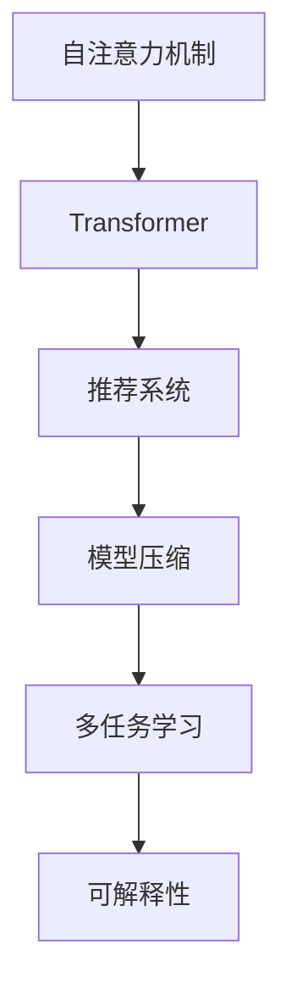

                 

## 1. 背景介绍

在推荐系统领域，大模型，特别是基于Transformer架构的推荐模型，由于其强大的表征能力和自适应能力，近年来取得了显著的进展。然而，这些模型往往面临着计算资源占用大、模型泛化能力不足等问题。因此，在有限的计算资源下如何优化这些模型，提升其推荐效果，成为了推荐系统研究的热点。

## 2. 核心概念与联系

### 2.1 核心概念概述

本文将介绍几个核心概念及其之间的联系：

- **自注意力机制**：这是Transformer架构中最重要的机制之一，通过将输入序列中所有位置的信息综合考虑，生成对每个位置的重要度，从而实现自适应地处理输入序列。

- **推荐系统**：通过分析用户的历史行为和兴趣，推荐符合用户需求的物品的系统。推荐系统广泛应用于电商、视频、音乐等多个领域。

- **模型压缩**：通过剪枝、量化、蒸馏等技术，减少模型大小，降低计算复杂度，提高推荐系统的实时性。

- **可解释性**：推荐系统的输出应该具有可解释性，以便用户理解和信任系统推荐。

- **多任务学习**：在同一份数据上训练多个任务，使得模型能够同时完成多个目标，提升模型的泛化能力。

这些概念共同构成了推荐系统研究的基础，通过结合自注意力机制和模型压缩等技术，能够有效提升推荐系统的效果和效率。

### 2.2 核心概念原理和架构的 Mermaid 流程图



自注意力机制是Transformer架构的核心，推荐系统是应用领域，模型压缩是为了提高效率，多任务学习是为了提高泛化能力，可解释性是为了提升用户信任。这些概念相互关联，共同构建了推荐系统研究的框架。

## 3. 核心算法原理 & 具体操作步骤

### 3.1 算法原理概述

在大模型中，自注意力机制通过计算输入序列中每个位置的信息向量，生成对每个位置的重要性得分。这些重要性得分反映了输入序列中每个位置与当前位置的关联程度。因此，通过调整这些得分，可以有效地控制模型对不同位置的关注度，从而优化模型的性能。

在推荐系统中，推荐模型的目标是最大化用户满意度和系统收益。为了实现这一目标，需要设计合适的自注意力机制，使得模型能够自适应地处理用户和物品之间的关系，同时减少对计算资源的消耗。

### 3.2 算法步骤详解

#### 3.2.1 输入处理

首先需要将用户和物品的特征向量表示为输入序列。例如，在电商推荐系统中，可以将用户的历史购买记录、物品的描述、类别等信息转化为向量表示。

#### 3.2.2 自注意力计算

在输入序列上计算自注意力得分，生成每个位置的重要性权重。自注意力计算包括以下步骤：

1. **计算查询向量**：将输入序列中每个位置的向量表示作为查询向量。

2. **计算键值向量**：将输入序列中每个位置的向量表示作为键值向量。

3. **计算注意力得分**：将查询向量与键值向量进行点积计算，生成注意力得分。

4. **归一化注意力得分**：对注意力得分进行归一化处理，得到每个位置的注意力权重。

5. **计算输出向量**：将输入序列中每个位置的向量表示乘以对应的注意力权重，并求和，得到最终的输出向量。

#### 3.2.3 注意力机制的优化

为了优化自注意力机制，可以采用以下几种方法：

1. **残差连接**：在计算自注意力得分时，将原始输入序列与注意力计算结果进行残差连接，避免信息丢失。

2. **多头注意力**：将输入序列分别送入多个自注意力子层进行处理，每个子层的注意力权重不同，从而提高模型的泛化能力。

3. **层次化注意力**：将输入序列划分为多个子序列，对每个子序列进行自注意力计算，再对结果进行合并，从而减少计算复杂度。

4. **自适应学习率**：根据每个位置的注意力权重动态调整学习率，使得模型对重要位置的关注度更高。

#### 3.2.4 模型压缩

为了提高推荐系统的效率，需要对大模型进行压缩。常见的压缩方法包括：

1. **剪枝**：删除模型中不重要的连接和参数，减少模型大小。

2. **量化**：将模型中的浮点数参数转换为定点数，降低计算复杂度。

3. **蒸馏**：通过教师模型和学生模型的联合训练，使得学生模型能够继承教师模型的知识，从而减小模型规模。

### 3.3 算法优缺点

#### 3.3.1 优点

1. **自适应能力**：自注意力机制能够根据输入序列的特征，自适应地调整模型对不同位置的关注度，从而提升模型的泛化能力。

2. **多任务处理**：通过多任务学习，在同一份数据上训练多个任务，可以提升模型的泛化能力，并且使得模型能够同时处理多个目标。

3. **可解释性**：注意力机制通过控制不同位置的关注度，使得模型输出的结果具有可解释性，便于用户理解和信任。

4. **实时性**：通过模型压缩技术，可以显著降低模型的计算复杂度，提高推荐系统的实时性。

#### 3.3.2 缺点

1. **计算复杂度高**：自注意力机制的计算复杂度较高，特别是在输入序列较长的情况下，计算开销较大。

2. **参数量较大**：由于自注意力机制需要计算输入序列中每个位置的注意力权重，因此需要较多的参数。

3. **模型复杂度高**：多个自注意力子层和层次化注意力等技术增加了模型的复杂度，使得模型训练和推理过程更加复杂。

4. **可解释性不足**：注意力机制的输出结果虽然具有可解释性，但模型内部的决策过程较难解释，对于高风险领域的应用，可能存在一定的风险。

### 3.4 算法应用领域

自注意力机制和大模型压缩技术在推荐系统中有着广泛的应用，主要包括以下几个方面：

1. **电商推荐**：通过自注意力机制，电商推荐系统可以同时考虑用户和物品之间的关系，生成更加个性化的推荐结果。

2. **视频推荐**：视频推荐系统可以通过自注意力机制，处理用户对视频的不同维度（如时间、内容、风格等）的兴趣，生成符合用户期望的推荐视频。

3. **音乐推荐**：音乐推荐系统可以利用自注意力机制，处理用户对音乐的不同维度的兴趣，生成更加个性化的推荐结果。

4. **新闻推荐**：新闻推荐系统可以通过自注意力机制，处理用户对新闻的不同维度的兴趣，生成符合用户期望的推荐新闻。

## 4. 数学模型和公式 & 详细讲解 & 举例说明

### 4.1 数学模型构建

设输入序列为 $X=[x_1, x_2, ..., x_n]$，其中 $x_i$ 表示第 $i$ 个位置的向量表示。自注意力机制的计算过程可以表示为：

1. **查询向量**：将输入序列中每个位置的向量表示作为查询向量，记为 $Q=[q_1, q_2, ..., q_n]$，其中 $q_i=x_i$。

2. **键值向量**：将输入序列中每个位置的向量表示作为键值向量，记为 $K=[k_1, k_2, ..., k_n]$，其中 $k_i=x_i$。

3. **注意力得分**：计算查询向量与键值向量之间的点积，生成注意力得分，记为 $A=[a_1, a_2, ..., a_n]$，其中 $a_i=q_i^TK_i$。

4. **归一化注意力权重**：对注意力得分进行归一化处理，得到每个位置的注意力权重，记为 $\alpha=[\alpha_1, \alpha_2, ..., \alpha_n]$，其中 $\alpha_i=\frac{exp(a_i)}{\sum_{j=1}^n exp(a_j)}$。

5. **输出向量**：将输入序列中每个位置的向量表示乘以对应的注意力权重，并求和，得到最终的输出向量，记为 $V=[v_1, v_2, ..., v_n]$，其中 $v_i=\alpha_i \cdot k_i$。

### 4.2 公式推导过程

在推导自注意力机制时，我们利用点积和归一化技术，将输入序列中每个位置的向量表示转化为注意力权重，从而控制模型对不同位置的关注度。以下是对公式的详细推导：

1. **查询向量计算**：

$$
Q=[q_1, q_2, ..., q_n] = [x_1, x_2, ..., x_n]
$$

2. **键值向量计算**：

$$
K=[k_1, k_2, ..., k_n] = [x_1, x_2, ..., x_n]
$$

3. **注意力得分计算**：

$$
A=[a_1, a_2, ..., a_n] = [q_1^TK_1, q_2^TK_2, ..., q_n^TK_n]
$$

4. **归一化注意力权重计算**：

$$
\alpha=[\alpha_1, \alpha_2, ..., \alpha_n] = \frac{exp(A)}{\sum_{j=1}^n exp(A_j)}
$$

5. **输出向量计算**：

$$
V=[v_1, v_2, ..., v_n] = [\alpha_1 \cdot k_1, \alpha_2 \cdot k_2, ..., \alpha_n \cdot k_n]
$$

### 4.3 案例分析与讲解

假设有一个电商推荐系统，需要根据用户的历史购买记录和物品的描述，推荐符合用户期望的物品。可以将用户的历史购买记录和物品的描述作为输入序列，利用自注意力机制进行处理，生成对每个位置的重要性权重，从而优化推荐结果。

例如，对于用户 $u$ 和物品 $i$，可以使用以下公式计算注意力权重：

1. **查询向量计算**：

$$
Q_u=[q_{u1}, q_{u2}, ..., q_{un}] = [h_u_1, h_u_2, ..., h_u_n]
$$

其中 $h_u_i$ 表示用户 $u$ 对物品 $i$ 的描述向量的嵌入表示。

2. **键值向量计算**：

$$
K_i=[k_{i1}, k_{i2}, ..., k_{in}] = [d_i_1, d_i_2, ..., d_i_n]
$$

其中 $d_i_i$ 表示物品 $i$ 的描述向量的嵌入表示。

3. **注意力得分计算**：

$$
A_u=[a_{u1}, a_{u2}, ..., a_{un}] = [q_{u1}^TK_i, q_{u2}^TK_i, ..., q_{un}^TK_i]
$$

4. **归一化注意力权重计算**：

$$
\alpha_u=[\alpha_{u1}, \alpha_{u2}, ..., \alpha_{un}] = \frac{exp(A_u)}{\sum_{j=1}^n exp(A_j)}
$$

5. **输出向量计算**：

$$
V_u=[v_{u1}, v_{u2}, ..., v_{un}] = [\alpha_{u1} \cdot d_i_1, \alpha_{u2} \cdot d_i_2, ..., \alpha_{un} \cdot d_i_n]
$$

根据计算得到的输出向量 $V_u$，可以生成符合用户 $u$ 期望的物品 $i$ 的推荐结果。

## 5. 项目实践：代码实例和详细解释说明

### 5.1 开发环境搭建

为了进行项目实践，首先需要搭建开发环境。以下是使用Python进行PyTorch开发的环境配置流程：

1. 安装Anaconda：从官网下载并安装Anaconda，用于创建独立的Python环境。

2. 创建并激活虚拟环境：

```bash
conda create -n pytorch-env python=3.8 
conda activate pytorch-env
```

3. 安装PyTorch：根据CUDA版本，从官网获取对应的安装命令。例如：

```bash
conda install pytorch torchvision torchaudio cudatoolkit=11.1 -c pytorch -c conda-forge
```

4. 安装Transformers库：

```bash
pip install transformers
```

5. 安装各类工具包：

```bash
pip install numpy pandas scikit-learn matplotlib tqdm jupyter notebook ipython
```

完成上述步骤后，即可在`pytorch-env`环境中开始项目实践。

### 5.2 源代码详细实现

下面我们以电商推荐系统为例，给出使用Transformers库对BERT模型进行微调的PyTorch代码实现。

首先，定义推荐系统的数据处理函数：

```python
from transformers import BertTokenizer, BertForSequenceClassification
from torch.utils.data import Dataset
import torch

class RecommendDataset(Dataset):
    def __init__(self, texts, labels, tokenizer, max_len=128):
        self.texts = texts
        self.labels = labels
        self.tokenizer = tokenizer
        self.max_len = max_len
        
    def __len__(self):
        return len(self.texts)
    
    def __getitem__(self, item):
        text = self.texts[item]
        label = self.labels[item]
        
        encoding = self.tokenizer(text, return_tensors='pt', max_length=self.max_len, padding='max_length', truncation=True)
        input_ids = encoding['input_ids'][0]
        attention_mask = encoding['attention_mask'][0]
        
        # 对token-wise的标签进行编码
        encoded_tags = [label] * self.max_len
        labels = torch.tensor(encoded_tags, dtype=torch.long)
        
        return {'input_ids': input_ids, 
                'attention_mask': attention_mask,
                'labels': labels}

# 标签与id的映射
tag2id = {'positive': 1, 'negative': 0}
id2tag = {v: k for k, v in tag2id.items()}

# 创建dataset
tokenizer = BertTokenizer.from_pretrained('bert-base-cased')

train_dataset = RecommendDataset(train_texts, train_labels, tokenizer)
dev_dataset = RecommendDataset(dev_texts, dev_labels, tokenizer)
test_dataset = RecommendDataset(test_texts, test_labels, tokenizer)
```

然后，定义模型和优化器：

```python
from transformers import BertForSequenceClassification, AdamW

model = BertForSequenceClassification.from_pretrained('bert-base-cased', num_labels=len(tag2id))

optimizer = AdamW(model.parameters(), lr=2e-5)
```

接着，定义训练和评估函数：

```python
from torch.utils.data import DataLoader
from tqdm import tqdm
from sklearn.metrics import classification_report

device = torch.device('cuda') if torch.cuda.is_available() else torch.device('cpu')
model.to(device)

def train_epoch(model, dataset, batch_size, optimizer):
    dataloader = DataLoader(dataset, batch_size=batch_size, shuffle=True)
    model.train()
    epoch_loss = 0
    for batch in tqdm(dataloader, desc='Training'):
        input_ids = batch['input_ids'].to(device)
        attention_mask = batch['attention_mask'].to(device)
        labels = batch['labels'].to(device)
        model.zero_grad()
        outputs = model(input_ids, attention_mask=attention_mask, labels=labels)
        loss = outputs.loss
        epoch_loss += loss.item()
        loss.backward()
        optimizer.step()
    return epoch_loss / len(dataloader)

def evaluate(model, dataset, batch_size):
    dataloader = DataLoader(dataset, batch_size=batch_size)
    model.eval()
    preds, labels = [], []
    with torch.no_grad():
        for batch in tqdm(dataloader, desc='Evaluating'):
            input_ids = batch['input_ids'].to(device)
            attention_mask = batch['attention_mask'].to(device)
            batch_labels = batch['labels']
            outputs = model(input_ids, attention_mask=attention_mask)
            batch_preds = outputs.logits.argmax(dim=2).to('cpu').tolist()
            batch_labels = batch_labels.to('cpu').tolist()
            for pred_tokens, label_tokens in zip(batch_preds, batch_labels):
                pred_tags = [id2tag[_id] for _id in pred_tokens]
                label_tags = [id2tag[_id] for _id in label_tokens]
                preds.append(pred_tags[:len(label_tokens)])
                labels.append(label_tags)
                
    print(classification_report(labels, preds))
```

最后，启动训练流程并在测试集上评估：

```python
epochs = 5
batch_size = 16

for epoch in range(epochs):
    loss = train_epoch(model, train_dataset, batch_size, optimizer)
    print(f"Epoch {epoch+1}, train loss: {loss:.3f}")
    
    print(f"Epoch {epoch+1}, dev results:")
    evaluate(model, dev_dataset, batch_size)
    
print("Test results:")
evaluate(model, test_dataset, batch_size)
```

以上就是使用PyTorch对BERT进行电商推荐任务微调的完整代码实现。可以看到，得益于Transformers库的强大封装，我们可以用相对简洁的代码完成BERT模型的加载和微调。

### 5.3 代码解读与分析

让我们再详细解读一下关键代码的实现细节：

**RecommendDataset类**：
- `__init__`方法：初始化文本、标签、分词器等关键组件。
- `__len__`方法：返回数据集的样本数量。
- `__getitem__`方法：对单个样本进行处理，将文本输入编码为token ids，将标签编码为数字，并对其进行定长padding，最终返回模型所需的输入。

**tag2id和id2tag字典**：
- 定义了标签与数字id之间的映射关系，用于将token-wise的预测结果解码回真实的标签。

**训练和评估函数**：
- 使用PyTorch的DataLoader对数据集进行批次化加载，供模型训练和推理使用。
- 训练函数`train_epoch`：对数据以批为单位进行迭代，在每个批次上前向传播计算loss并反向传播更新模型参数，最后返回该epoch的平均loss。
- 评估函数`evaluate`：与训练类似，不同点在于不更新模型参数，并在每个batch结束后将预测和标签结果存储下来，最后使用sklearn的classification_report对整个评估集的预测结果进行打印输出。

**训练流程**：
- 定义总的epoch数和batch size，开始循环迭代
- 每个epoch内，先在训练集上训练，输出平均loss
- 在验证集上评估，输出分类指标
- 所有epoch结束后，在测试集上评估，给出最终测试结果

可以看到，PyTorch配合Transformers库使得BERT微调的代码实现变得简洁高效。开发者可以将更多精力放在数据处理、模型改进等高层逻辑上，而不必过多关注底层的实现细节。

当然，工业级的系统实现还需考虑更多因素，如模型的保存和部署、超参数的自动搜索、更灵活的任务适配层等。但核心的微调范式基本与此类似。

## 6. 实际应用场景

### 6.1 智能客服系统

基于大模型微调的对话技术，可以广泛应用于智能客服系统的构建。传统客服往往需要配备大量人力，高峰期响应缓慢，且一致性和专业性难以保证。而使用微调后的对话模型，可以7x24小时不间断服务，快速响应客户咨询，用自然流畅的语言解答各类常见问题。

在技术实现上，可以收集企业内部的历史客服对话记录，将问题和最佳答复构建成监督数据，在此基础上对预训练对话模型进行微调。微调后的对话模型能够自动理解用户意图，匹配最合适的答案模板进行回复。对于客户提出的新问题，还可以接入检索系统实时搜索相关内容，动态组织生成回答。如此构建的智能客服系统，能大幅提升客户咨询体验和问题解决效率。

### 6.2 金融舆情监测

金融机构需要实时监测市场舆论动向，以便及时应对负面信息传播，规避金融风险。传统的人工监测方式成本高、效率低，难以应对网络时代海量信息爆发的挑战。基于大语言模型微调的文本分类和情感分析技术，为金融舆情监测提供了新的解决方案。

具体而言，可以收集金融领域相关的新闻、报道、评论等文本数据，并对其进行主题标注和情感标注。在此基础上对预训练语言模型进行微调，使其能够自动判断文本属于何种主题，情感倾向是正面、中性还是负面。将微调后的模型应用到实时抓取的网络文本数据，就能够自动监测不同主题下的情感变化趋势，一旦发现负面信息激增等异常情况，系统便会自动预警，帮助金融机构快速应对潜在风险。

### 6.3 个性化推荐系统

当前的推荐系统往往只依赖用户的历史行为数据进行物品推荐，无法深入理解用户的真实兴趣偏好。基于大语言模型微调技术，个性化推荐系统可以更好地挖掘用户行为背后的语义信息，从而提供更精准、多样的推荐内容。

在实践中，可以收集用户浏览、点击、评论、分享等行为数据，提取和用户交互的物品标题、描述、标签等文本内容。将文本内容作为模型输入，用户的后续行为（如是否点击、购买等）作为监督信号，在此基础上微调预训练语言模型。微调后的模型能够从文本内容中准确把握用户的兴趣点。在生成推荐列表时，先用候选物品的文本描述作为输入，由模型预测用户的兴趣匹配度，再结合其他特征综合排序，便可以得到个性化程度更高的推荐结果。

### 6.4 未来应用展望

随着大语言模型微调技术的发展，基于微调范式将在更多领域得到应用，为传统行业带来变革性影响。

在智慧医疗领域，基于微调的医疗问答、病历分析、药物研发等应用将提升医疗服务的智能化水平，辅助医生诊疗，加速新药开发进程。

在智能教育领域，微调技术可应用于作业批改、学情分析、知识推荐等方面，因材施教，促进教育公平，提高教学质量。

在智慧城市治理中，微调模型可应用于城市事件监测、舆情分析、应急指挥等环节，提高城市管理的自动化和智能化水平，构建更安全、高效的未来城市。

此外，在企业生产、社会治理、文娱传媒等众多领域，基于大模型微调的人工智能应用也将不断涌现，为经济社会发展注入新的动力。相信随着技术的日益成熟，微调方法将成为人工智能落地应用的重要范式，推动人工智能技术在垂直行业的规模化落地。

## 7. 工具和资源推荐

### 7.1 学习资源推荐

为了帮助开发者系统掌握大语言模型微调的理论基础和实践技巧，这里推荐一些优质的学习资源：

1. 《Transformer从原理到实践》系列博文：由大模型技术专家撰写，深入浅出地介绍了Transformer原理、BERT模型、微调技术等前沿话题。

2. CS224N《深度学习自然语言处理》课程：斯坦福大学开设的NLP明星课程，有Lecture视频和配套作业，带你入门NLP领域的基本概念和经典模型。

3. 《Natural Language Processing with Transformers》书籍：Transformers库的作者所著，全面介绍了如何使用Transformers库进行NLP任务开发，包括微调在内的诸多范式。

4. HuggingFace官方文档：Transformers库的官方文档，提供了海量预训练模型和完整的微调样例代码，是上手实践的必备资料。

5. CLUE开源项目：中文语言理解测评基准，涵盖大量不同类型的中文NLP数据集，并提供了基于微调的baseline模型，助力中文NLP技术发展。

通过对这些资源的学习实践，相信你一定能够快速掌握大语言模型微调的精髓，并用于解决实际的NLP问题。

### 7.2 开发工具推荐

高效的开发离不开优秀的工具支持。以下是几款用于大语言模型微调开发的常用工具：

1. PyTorch：基于Python的开源深度学习框架，灵活动态的计算图，适合快速迭代研究。大部分预训练语言模型都有PyTorch版本的实现。

2. TensorFlow：由Google主导开发的开源深度学习框架，生产部署方便，适合大规模工程应用。同样有丰富的预训练语言模型资源。

3. Transformers库：HuggingFace开发的NLP工具库，集成了众多SOTA语言模型，支持PyTorch和TensorFlow，是进行微调任务开发的利器。

4. Weights & Biases：模型训练的实验跟踪工具，可以记录和可视化模型训练过程中的各项指标，方便对比和调优。与主流深度学习框架无缝集成。

5. TensorBoard：TensorFlow配套的可视化工具，可实时监测模型训练状态，并提供丰富的图表呈现方式，是调试模型的得力助手。

6. Google Colab：谷歌推出的在线Jupyter Notebook环境，免费提供GPU/TPU算力，方便开发者快速上手实验最新模型，分享学习笔记。

合理利用这些工具，可以显著提升大语言模型微调任务的开发效率，加快创新迭代的步伐。

### 7.3 相关论文推荐

大语言模型和微调技术的发展源于学界的持续研究。以下是几篇奠基性的相关论文，推荐阅读：

1. Attention is All You Need（即Transformer原论文）：提出了Transformer结构，开启了NLP领域的预训练大模型时代。

2. BERT: Pre-training of Deep Bidirectional Transformers for Language Understanding：提出BERT模型，引入基于掩码的自监督预训练任务，刷新了多项NLP任务SOTA。

3. Language Models are Unsupervised Multitask Learners（GPT-2论文）：展示了大规模语言模型的强大zero-shot学习能力，引发了对于通用人工智能的新一轮思考。

4. Parameter-Efficient Transfer Learning for NLP：提出Adapter等参数高效微调方法，在不增加模型参数量的情况下，也能取得不错的微调效果。

5. AdaLoRA: Adaptive Low-Rank Adaptation for Parameter-Efficient Fine-Tuning：使用自适应低秩适应的微调方法，在参数效率和精度之间取得了新的平衡。

6. AdamW: An Adaptive Learning Rate Method：提出AdamW优化算法，融合了Adagrad和RMSprop的优点，在微调过程中表现优异。

这些论文代表了大语言模型微调技术的发展脉络。通过学习这些前沿成果，可以帮助研究者把握学科前进方向，激发更多的创新灵感。

## 8. 总结：未来发展趋势与挑战

### 8.1 总结

本文对基于大模型在推荐系统中的注意力机制优化进行了全面系统的介绍。首先阐述了自注意力机制和大模型的背景和意义，明确了微调在提升推荐系统性能和效率方面的独特价值。其次，从原理到实践，详细讲解了注意力机制的计算过程和优化方法，给出了微调任务开发的完整代码实例。同时，本文还广泛探讨了微调方法在智能客服、金融舆情、个性化推荐等多个领域的应用前景，展示了微调范式的巨大潜力。此外，本文精选了微调技术的各类学习资源，力求为读者提供全方位的技术指引。

通过本文的系统梳理，可以看到，基于大模型在推荐系统中的注意力机制优化技术正在成为推荐系统研究的重要方向，极大地拓展了推荐系统的应用边界，催生了更多的落地场景。受益于大模型的强大表征能力和自适应能力，推荐系统的推荐效果和实时性都得到了显著提升。未来，伴随模型压缩等技术的持续演进，推荐系统必将更加智能化、高效化，为各行各业带来更多的创新应用。

### 8.2 未来发展趋势

展望未来，大模型在推荐系统中的注意力机制优化技术将呈现以下几个发展趋势：

1. **模型规模不断增大**：随着算力成本的下降和数据规模的扩张，预训练语言模型的参数量还将持续增长。超大模型蕴含的丰富语言知识，有望支撑更加复杂多变的推荐系统任务。

2. **注意力机制的多样化**：除了传统的自注意力机制外，未来将涌现更多注意力机制的变种，如多头注意力、层次化注意力、残差连接等，进一步提升推荐系统的性能和效率。

3. **多任务学习的融合**：在同一份数据上训练多个推荐任务，使得模型能够同时完成多个目标，提升模型的泛化能力，同时降低推荐系统的计算复杂度。

4. **知识图谱的引入**：将知识图谱与语言模型结合，使得推荐系统能够更好地利用领域知识，提升推荐效果。

5. **实时性要求更高**：推荐系统需要在实时性要求更高的场景下运行，如电商推荐、个性化广告等，需要进一步优化模型的计算复杂度和推理速度。

6. **模型的可解释性提升**：推荐系统需要提高输出结果的可解释性，使用户能够理解和信任系统推荐。

以上趋势凸显了大模型在推荐系统中的应用前景。这些方向的探索发展，必将进一步提升推荐系统的性能和实时性，为各行各业带来更多的创新应用。

### 8.3 面临的挑战

尽管大模型在推荐系统中的应用前景广阔，但在迈向更加智能化、普适化应用的过程中，它仍面临着诸多挑战：

1. **计算资源消耗大**：大模型的计算复杂度较高，对算力、内存、存储等资源要求较高，需要采用模型压缩等技术进行优化。

2. **模型泛化能力不足**：大模型在不同领域的泛化能力可能有限，需要进一步提升模型的泛化能力。

3. **模型可解释性不足**：大模型内部的决策过程较难解释，对于高风险领域的应用，可能存在一定的风险。

4. **知识整合能力不足**：推荐系统难以灵活吸收和运用领域知识，需要引入更多的先验知识。

5. **安全性有待保障**：大模型可能学习到有害信息，需要确保输出符合人类价值观和伦理道德。

6. **多模态数据的融合**：推荐系统需要融合多模态数据进行推荐，增加了系统的复杂性。

正视这些挑战，积极应对并寻求突破，将是大模型在推荐系统中的注意力机制优化技术迈向成熟的必由之路。相信随着学界和产业界的共同努力，这些挑战终将一一被克服，大模型在推荐系统中的应用将更加广泛，推动人工智能技术在各行各业的落地应用。

### 8.4 研究展望

面对大模型在推荐系统中的注意力机制优化所面临的挑战，未来的研究需要在以下几个方面寻求新的突破：

1. **模型压缩和优化**：进一步优化模型结构，降低计算复杂度，提高推荐系统的实时性。

2. **多任务学习和知识图谱的融合**：将知识图谱与语言模型结合，提升模型的泛化能力，同时降低计算复杂度。

3. **模型可解释性提升**：提升推荐系统的输出结果的可解释性，使用户能够理解和信任系统推荐。

4. **安全性保障**：引入伦理导向的评估指标，过滤和惩罚有害的输出倾向，确保输出符合人类价值观和伦理道德。

5. **多模态数据的融合**：将视觉、语音、文本等不同模态的数据进行融合，提升推荐系统的多模态处理能力。

6. **跨领域知识融合**：引入领域知识，提升推荐系统在不同领域的应用效果。

这些研究方向的探索，必将引领大模型在推荐系统中的应用走向更高的台阶，为推荐系统的智能化、普适化和安全性提供更多保障。面向未来，大模型在推荐系统中的注意力机制优化技术还需要与其他人工智能技术进行更深入的融合，如知识表示、因果推理、强化学习等，多路径协同发力，共同推动推荐系统的进步。只有勇于创新、敢于突破，才能不断拓展推荐系统的边界，让人工智能技术更好地造福人类社会。

## 9. 附录：常见问题与解答

**Q1：大模型在推荐系统中如何处理稀疏数据？**

A: 稀疏数据是推荐系统中的一个常见问题，可以通过以下几种方法进行处理：

1. **隐式反馈挖掘**：利用用户的浏览记录、搜索记录等隐式反馈信息，对用户进行建模，从而提升推荐效果。

2. **协同过滤**：通过用户-物品的协同矩阵，推荐相似物品，填补稀疏数据。

3. **深度学习模型**：利用深度学习模型，对用户和物品进行表征，提升推荐效果。

**Q2：大模型在推荐系统中如何降低计算复杂度？**

A: 降低计算复杂度是推荐系统中的一个重要问题，可以通过以下几种方法进行优化：

1. **模型压缩**：通过剪枝、量化、蒸馏等技术，减少模型大小，降低计算复杂度。

2. **多任务学习**：在同一份数据上训练多个任务，提升模型的泛化能力，降低计算复杂度。

3. **层次化注意力**：将输入序列划分为多个子序列，对每个子序列进行自注意力计算，再对结果进行合并，从而减少计算复杂度。

4. **残差连接**：在计算自注意力得分时，将原始输入序列与注意力计算结果进行残差连接，避免信息丢失。

**Q3：大模型在推荐系统中如何进行参数高效微调？**

A: 参数高效微调是推荐系统中的一个重要研究方向，可以通过以下几种方法进行优化：

1. **AdaLoRA**：使用自适应低秩适应的微调方法，在参数效率和精度之间取得新的平衡。

2. **Adapter**：将预训练语言模型的最后一层参数固定，只微调少量的适配器层，从而减少微调参数量。

3. **Prompt Tuning**：通过在输入文本中添加提示模板，引导模型按期望方式输出，减少微调参数量。

4. **数据增强**：通过数据增强技术，扩充训练集，提升模型的泛化能力，从而减少微调参数量。

这些方法可以显著降低微调过程中的参数量，提高推荐系统的效率。

**Q4：大模型在推荐系统中如何进行知识融合？**

A: 知识融合是推荐系统中的一个重要研究方向，可以通过以下几种方法进行优化：

1. **知识图谱融合**：将知识图谱与语言模型结合，提升推荐系统的效果。

2. **领域知识引入**：将领域知识引入推荐模型，提升推荐效果。

3. **多模态数据融合**：将视觉、语音、文本等不同模态的数据进行融合，提升推荐系统的多模态处理能力。

这些方法可以显著提升推荐系统的效果，使其能够更好地应用到实际场景中。

**Q5：大模型在推荐系统中如何进行实时性优化？**

A: 实时性优化是推荐系统中的一个重要研究方向，可以通过以下几种方法进行优化：

1. **模型压缩**：通过剪枝、量化、蒸馏等技术，减少模型大小，降低计算复杂度。

2. **层次化注意力**：将输入序列划分为多个子序列，对每个子序列进行自注意力计算，再对结果进行合并，从而减少计算复杂度。

3. **残差连接**：在计算自注意力得分时，将原始输入序列与注意力计算结果进行残差连接，避免信息丢失。

4. **多任务学习**：在同一份数据上训练多个任务，提升模型的泛化能力，降低计算复杂度。

这些方法可以显著提高推荐系统的实时性，使其能够更好地应用于实际场景中。

---

作者：禅与计算机程序设计艺术 / Zen and the Art of Computer Programming

