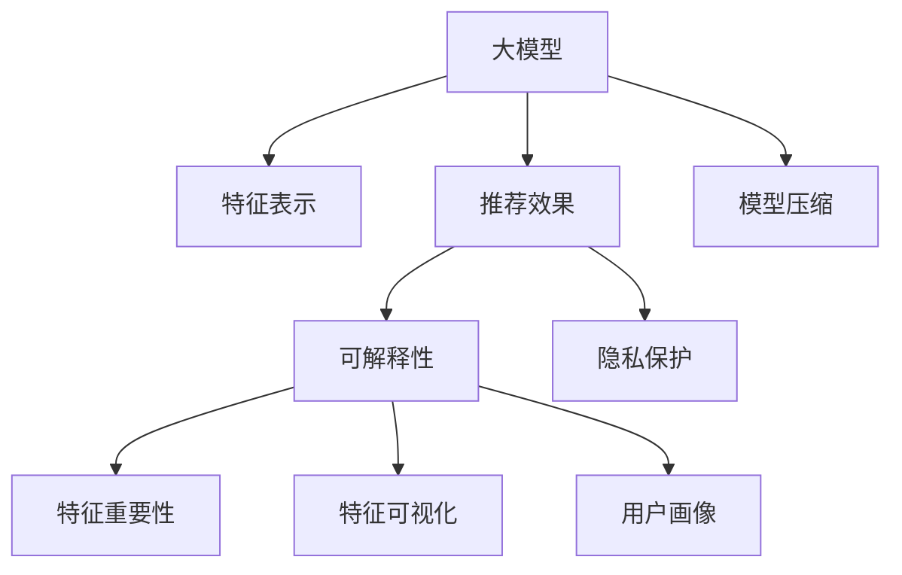

                 

# 大模型在推荐系统可解释AI中的作用

> 关键词：大模型、可解释AI、推荐系统、深度学习、模型压缩、特征重要性、特征可视化、用户画像、隐私保护

## 1. 背景介绍

### 1.1 问题由来

在信息爆炸的时代，个性化推荐系统已经成为互联网公司核心竞争力的重要组成部分。用户通过推荐系统，能够快速找到感兴趣的内容，提升用户体验，提高平台活跃度和留存率。然而，推荐系统算法的可解释性不足，常常被用户诟病。用户往往不知道推荐算法是如何决策的，难以建立对推荐系统的信任。这对推荐系统的发展和应用产生了一定的制约。

近年来，随着深度学习和大模型的不断进步，通过优化模型架构和训练过程，部分推荐系统已经具备了较好的可解释性。例如，可以使用简单的线性模型对用户行为进行建模，便于用户理解推荐决策的逻辑。但这种做法无法充分利用大模型的强大表达能力，推荐效果仍有一定差距。因此，如何在利用大模型的同时，增强推荐系统的可解释性，成为了研究热点。

### 1.2 问题核心关键点

大模型在推荐系统中的主要作用是：

- 强大的特征表示能力。预训练大模型可以学习丰富的语义和统计信息，涵盖用户行为、物品属性、用户画像等多个维度的特征。
- 提升推荐效果。基于大模型，推荐系统能够捕捉用户隐式行为和交互模式，从而提升推荐精度。
- 提升可解释性。大模型通过逐层解码器、特征重要性排名、特征可视化等方式，可以展示推荐决策的依据，帮助用户理解算法。
- 保护用户隐私。通过联邦学习、差分隐私等技术，可以避免在推荐过程中泄露用户敏感信息。

## 2. 核心概念与联系

### 2.1 核心概念概述

为了更好地理解大模型在推荐系统中的作用，本节将介绍几个密切相关的核心概念：

- 大模型：指在大规模数据集上进行预训练的深度神经网络模型。如GPT-3、BERT等。
- 推荐系统：通过用户行为、物品属性等多维度特征，为用户推荐合适的内容或产品。
- 可解释AI：指能够提供模型决策依据、优化算法和数据解释的AI系统，便于用户理解和信任。
- 模型压缩：通过剪枝、量化、蒸馏等技术，减少模型参数和计算资源占用。
- 特征重要性：衡量模型中各个特征对预测结果的影响程度，帮助用户理解推荐依据。
- 特征可视化：将模型内部的特征权重、激活值等可视化展示，直观展示推荐决策过程。
- 用户画像：通过对用户历史行为、偏好等信息进行建模，帮助推荐系统更好地理解用户需求。
- 隐私保护：采用差分隐私、联邦学习等技术，保护用户隐私和数据安全。

这些核心概念之间的逻辑关系可以通过以下Mermaid流程图来展示：



这个流程图展示了大模型在推荐系统中的核心概念及其之间的关系：

1. 大模型通过特征表示学习用户行为和物品属性的语义和统计信息。
2. 基于特征表示，推荐系统可以提升推荐效果。
3. 可解释性通过对特征重要性和可视化展示，帮助用户理解推荐依据。
4. 隐私保护技术保障用户数据安全。
5. 模型压缩优化大模型计算效率。
6. 用户画像帮助推荐系统更好地理解用户需求。

这些概念共同构成了大模型在推荐系统中的作用框架，使得大模型不仅在推荐精度上有所提升，还能增强系统的透明度和可信度。

## 3. 核心算法原理 & 具体操作步骤
### 3.1 算法原理概述

大模型在推荐系统中的可解释性，主要通过以下两个方面实现：

1. 特征重要性分析：通过模型输出结果的权重分解，评估每个特征对预测结果的贡献。

2. 特征可视化：通过可视化技术展示特征权重和模型内部状态，直观展示推荐决策的依据。

### 3.2 算法步骤详解

**Step 1: 构建大模型推荐模型**

- 收集用户行为数据、物品属性数据、用户画像数据等特征。
- 在大模型基础上，添加用户行为和物品属性为输入的特征提取层。
- 构建推荐输出层，使用sigmoid函数将模型输出映射到[0,1]区间，表示用户对该物品的兴趣程度。
- 定义损失函数，如均方误差、交叉熵等，用于评估模型预测结果与真实标签之间的差异。

**Step 2: 训练大模型**

- 将标注数据集划分为训练集、验证集和测试集。
- 使用优化器如AdamW、SGD等进行梯度下降优化。
- 定期在验证集上评估模型性能，避免过拟合。
- 在测试集上评估最终模型性能。

**Step 3: 特征重要性分析**

- 使用特征重要性分析算法，如SHAP、LIME等，对模型输出结果进行权重分解。
- 计算每个特征对推荐结果的贡献值，并进行归一化。
- 将特征重要性可视化，便于用户理解推荐依据。

**Step 4: 特征可视化**

- 使用特征可视化工具，如TensorBoard、T-SNE等，展示模型内部特征权重、激活值等。
- 通过可视化展示，帮助用户理解推荐系统的决策过程。

**Step 5: 用户画像构建**

- 收集用户行为、偏好、社交信息等多维度数据。
- 使用大模型进行用户画像建模，提取用户特征。
- 将用户画像信息整合到推荐模型中，进一步提升推荐效果。

**Step 6: 隐私保护**

- 采用差分隐私、联邦学习等技术，保护用户隐私和数据安全。
- 在推荐模型中加入隐私保护模块，防止用户隐私泄露。

### 3.3 算法优缺点

基于大模型推荐系统的主要优点：

1. 强大的特征表示能力。大模型能够学习丰富且多维度的特征，提升推荐效果。
2. 可解释性强。通过特征重要性和可视化，用户可以更好地理解推荐依据。
3. 隐私保护性好。通过隐私保护技术，可以有效防止用户数据泄露。

同时，该方法也存在一些局限性：

1. 模型规模较大。大模型参数量通常以亿计，计算资源消耗大。
2. 可解释性仍有一定局限。大模型的复杂性使得特征重要性分析仍有一定难度。
3. 训练成本高。大模型训练需要大规模标注数据和强大算力支持。
4. 推荐效果受数据质量影响大。推荐系统依赖于用户行为数据和物品属性数据，数据质量对推荐效果有较大影响。

尽管存在这些局限性，但就目前而言，基于大模型的推荐系统仍是推荐领域的研究热点和主要应用方向。未来相关研究的重点在于如何进一步优化大模型架构，减少计算资源消耗，同时提升模型的可解释性。

### 3.4 算法应用领域

基于大模型的推荐系统已经在电商、视频、社交等多个领域得到了广泛的应用，并取得了显著的效果。

- 电商推荐系统：通过分析用户浏览、点击、购买等行为，为用户推荐感兴趣的商品，提升购物体验。
- 视频推荐系统：根据用户观影历史和评分，推荐用户可能感兴趣的影视作品，提高平台留存率。
- 社交推荐系统：基于用户社交关系和兴趣爱好，推荐合适的内容或人，提升用户活跃度。

此外，大模型在推荐系统中的应用还延伸到金融、医疗、教育等多个领域，为各行各业带来新的创新方向和解决方案。

## 4. 数学模型和公式 & 详细讲解 & 举例说明

### 4.1 数学模型构建

本节将使用数学语言对基于大模型的推荐系统进行更加严格的刻画。

假设推荐系统以大模型 $M_{\theta}$ 为预测模型，输入特征 $X \in \mathbb{R}^n$，目标输出 $Y \in \{0,1\}$。模型的损失函数为交叉熵损失，定义为：

$$
L = -\frac{1}{N}\sum_{i=1}^N [y_i \log M_{\theta}(x_i) + (1-y_i) \log (1-M_{\theta}(x_i))]
$$

其中 $N$ 为训练样本数量，$y_i$ 为样本的真实标签。

模型的输出为 $Y = M_{\theta}(X)$，$M_{\theta}$ 为模型的参数。

### 4.2 公式推导过程

以最简单的线性回归模型为例，进行特征重要性分析。假设模型为：

$$
y = W^TX + b
$$

其中 $W$ 为权重矩阵，$b$ 为偏置项。

模型的预测结果为 $y_i$，真实结果为 $y_i^*$。特征重要性分析可以使用SHAP值（Shapley Additive Explanations），定义为：

$$
\phi_i = \frac{\partial L}{\partial w_i}
$$

其中 $w_i$ 为模型参数 $W$ 的第 $i$ 个元素。

通过计算SHAP值，可以得出每个特征对预测结果的贡献。例如，如果某特征的SHAP值较大，说明该特征对预测结果的影响较大。

### 4.3 案例分析与讲解

假设某电商推荐系统使用BERT模型作为用户行为分析工具，用户行为数据 $X$ 包括浏览记录、点击记录、购买记录等。模型输出为 $Y$，表示用户对某商品的兴趣程度。模型训练过程如下：

1. 收集用户行为数据 $X$ 和对应的标签 $Y$。
2. 使用BERT模型提取特征 $X'$，并将其作为输入。
3. 添加线性分类层，输出 $Y = sigmoid(W^TX' + b)$。
4. 使用AdamW优化器进行梯度下降优化。
5. 在验证集上评估模型性能。

在模型训练完成后，使用SHAP值对模型输出结果进行分解，得到每个特征对预测结果的贡献。例如，某用户的历史浏览记录对预测结果的贡献较大，模型会优先考虑该用户的历史浏览数据进行推荐。

## 5. 项目实践：代码实例和详细解释说明
### 5.1 开发环境搭建

在进行推荐系统开发前，我们需要准备好开发环境。以下是使用Python进行PyTorch开发的环境配置流程：

1. 安装Anaconda：从官网下载并安装Anaconda，用于创建独立的Python环境。

2. 创建并激活虚拟环境：
```bash
conda create -n recommendation-env python=3.8 
conda activate recommendation-env
```

3. 安装PyTorch：根据CUDA版本，从官网获取对应的安装命令。例如：
```bash
conda install pytorch torchvision torchaudio cudatoolkit=11.1 -c pytorch -c conda-forge
```

4. 安装TensorFlow：
```bash
conda install tensorflow
```

5. 安装Transformers库：
```bash
pip install transformers
```

6. 安装各类工具包：
```bash
pip install numpy pandas scikit-learn matplotlib tqdm jupyter notebook ipython
```

完成上述步骤后，即可在`recommendation-env`环境中开始推荐系统开发。

### 5.2 源代码详细实现

下面我以电商推荐系统为例，给出使用Transformers库对BERT模型进行推荐系统开发的PyTorch代码实现。

首先，定义推荐系统的数据处理函数：

```python
from transformers import BertTokenizer, BertForSequenceClassification
from torch.utils.data import Dataset
import torch

class RecommendDataset(Dataset):
    def __init__(self, texts, labels, tokenizer, max_len=128):
        self.texts = texts
        self.labels = labels
        self.tokenizer = tokenizer
        self.max_len = max_len
        
    def __len__(self):
        return len(self.texts)
    
    def __getitem__(self, item):
        text = self.texts[item]
        label = self.labels[item]
        
        encoding = self.tokenizer(text, return_tensors='pt', max_length=self.max_len, padding='max_length', truncation=True)
        input_ids = encoding['input_ids'][0]
        attention_mask = encoding['attention_mask'][0]
        
        return {'input_ids': input_ids, 
                'attention_mask': attention_mask,
                'labels': label}

# 标签与id的映射
label2id = {'buy': 0, 'not_buy': 1}

# 创建dataset
tokenizer = BertTokenizer.from_pretrained('bert-base-cased')
train_dataset = RecommendDataset(train_texts, train_labels, tokenizer)
dev_dataset = RecommendDataset(dev_texts, dev_labels, tokenizer)
test_dataset = RecommendDataset(test_texts, test_labels, tokenizer)
```

然后，定义模型和优化器：

```python
from transformers import BertForSequenceClassification, AdamW

model = BertForSequenceClassification.from_pretrained('bert-base-cased', num_labels=len(label2id))

optimizer = AdamW(model.parameters(), lr=2e-5)
```

接着，定义训练和评估函数：

```python
from torch.utils.data import DataLoader
from tqdm import tqdm
from sklearn.metrics import classification_report

device = torch.device('cuda') if torch.cuda.is_available() else torch.device('cpu')
model.to(device)

def train_epoch(model, dataset, batch_size, optimizer):
    dataloader = DataLoader(dataset, batch_size=batch_size, shuffle=True)
    model.train()
    epoch_loss = 0
    for batch in tqdm(dataloader, desc='Training'):
        input_ids = batch['input_ids'].to(device)
        attention_mask = batch['attention_mask'].to(device)
        labels = batch['labels'].to(device)
        model.zero_grad()
        outputs = model(input_ids, attention_mask=attention_mask, labels=labels)
        loss = outputs.loss
        epoch_loss += loss.item()
        loss.backward()
        optimizer.step()
    return epoch_loss / len(dataloader)

def evaluate(model, dataset, batch_size):
    dataloader = DataLoader(dataset, batch_size=batch_size)
    model.eval()
    preds, labels = [], []
    with torch.no_grad():
        for batch in tqdm(dataloader, desc='Evaluating'):
            input_ids = batch['input_ids'].to(device)
            attention_mask = batch['attention_mask'].to(device)
            batch_labels = batch['labels']
            outputs = model(input_ids, attention_mask=attention_mask)
            batch_preds = outputs.logits.argmax(dim=2).to('cpu').tolist()
            batch_labels = batch_labels.to('cpu').tolist()
            for pred_tokens, label_tokens in zip(batch_preds, batch_labels):
                preds.append(pred_tokens[:len(label_tokens)])
                labels.append(label_tokens)
                
    print(classification_report(labels, preds))
```

最后，启动训练流程并在测试集上评估：

```python
epochs = 5
batch_size = 16

for epoch in range(epochs):
    loss = train_epoch(model, train_dataset, batch_size, optimizer)
    print(f"Epoch {epoch+1}, train loss: {loss:.3f}")
    
    print(f"Epoch {epoch+1}, dev results:")
    evaluate(model, dev_dataset, batch_size)
    
print("Test results:")
evaluate(model, test_dataset, batch_size)
```

以上就是使用PyTorch对BERT进行推荐系统开发的完整代码实现。可以看到，得益于Transformers库的强大封装，我们可以用相对简洁的代码完成BERT模型的加载和推荐系统开发。

### 5.3 代码解读与分析

让我们再详细解读一下关键代码的实现细节：

**RecommendDataset类**：
- `__init__`方法：初始化文本、标签、分词器等关键组件。
- `__len__`方法：返回数据集的样本数量。
- `__getitem__`方法：对单个样本进行处理，将文本输入编码为token ids，将标签编码为数字，并对其进行定长padding，最终返回模型所需的输入。

**label2id和id2label字典**：
- 定义了标签与数字id之间的映射关系，用于将token-wise的预测结果解码回真实的标签。

**训练和评估函数**：
- 使用PyTorch的DataLoader对数据集进行批次化加载，供模型训练和推理使用。
- 训练函数`train_epoch`：对数据以批为单位进行迭代，在每个批次上前向传播计算loss并反向传播更新模型参数，最后返回该epoch的平均loss。
- 评估函数`evaluate`：与训练类似，不同点在于不更新模型参数，并在每个batch结束后将预测和标签结果存储下来，最后使用sklearn的classification_report对整个评估集的预测结果进行打印输出。

**训练流程**：
- 定义总的epoch数和batch size，开始循环迭代
- 每个epoch内，先在训练集上训练，输出平均loss
- 在验证集上评估，输出分类指标
- 重复上述步骤直至收敛，最后输出测试结果

可以看到，PyTorch配合Transformers库使得BERT推荐系统的代码实现变得简洁高效。开发者可以将更多精力放在数据处理、模型改进等高层逻辑上，而不必过多关注底层的实现细节。

当然，工业级的系统实现还需考虑更多因素，如模型的保存和部署、超参数的自动搜索、更灵活的任务适配层等。但核心的推荐范式基本与此类似。

## 6. 实际应用场景
### 6.1 电商推荐系统

电商推荐系统是大模型推荐系统的重要应用场景。通过分析用户浏览、点击、购买等行为，推荐系统会推荐用户可能感兴趣的商品，提升购物体验。

在技术实现上，可以收集用户行为数据，使用大模型进行用户行为分析，提取用户特征。然后构建推荐模型，将用户特征输入模型，输出对某商品的兴趣程度。最终根据模型预测结果，推荐相应商品。

通过实时收集用户反馈和行为数据，推荐系统可以不断优化模型参数，提升推荐效果。同时，使用特征重要性分析和可视化技术，可以向用户展示推荐依据，提升用户信任度。

### 6.2 视频推荐系统

视频推荐系统能够根据用户观影历史和评分，推荐用户可能感兴趣的视频作品，提高平台留存率。

在技术实现上，可以收集用户观影记录、评分等数据，使用大模型进行特征提取。然后构建推荐模型，将用户特征输入模型，输出对某视频的兴趣程度。最终根据模型预测结果，推荐相应视频。

通过特征重要性和可视化技术，可以向用户展示推荐依据，提升用户信任度。同时，使用差分隐私等技术，保护用户隐私和数据安全。

### 6.3 社交推荐系统

社交推荐系统基于用户社交关系和兴趣爱好，推荐合适的内容或人，提升用户活跃度。

在技术实现上，可以收集用户社交关系数据、兴趣爱好数据等，使用大模型进行特征提取。然后构建推荐模型，将用户特征输入模型，输出对某内容或人的兴趣程度。最终根据模型预测结果，推荐相应内容或人。

通过特征重要性和可视化技术，可以向用户展示推荐依据，提升用户信任度。同时，使用差分隐私等技术，保护用户隐私和数据安全。

### 6.4 未来应用展望

随着大模型和推荐系统技术的不断发展，基于大模型的推荐系统将在更多领域得到应用，为各行各业带来变革性影响。

在智慧医疗领域，基于大模型的推荐系统可以推荐合适的医疗资源、专家等，帮助患者选择最优诊疗方案。

在智能教育领域，推荐系统可以根据学生的学习行为和成绩，推荐合适的学习资源和习题，个性化教学。

在智慧城市治理中，推荐系统可以根据用户行为数据，推荐合适的交通路线、景点等，优化城市管理。

此外，在企业生产、社会治理、文娱传媒等众多领域，基于大模型的推荐系统也将不断涌现，为数字化转型升级提供新的技术路径。相信随着技术的日益成熟，推荐系统必将成为人工智能落地应用的重要方向，推动人工智能技术在更多行业领域的应用和发展。

## 7. 工具和资源推荐
### 7.1 学习资源推荐

为了帮助开发者系统掌握大模型在推荐系统中的作用，这里推荐一些优质的学习资源：

1. 《深度学习理论与实践》：涵盖深度学习、大模型、推荐系统等多个领域的经典教材。

2. CS229《机器学习》课程：斯坦福大学开设的机器学习经典课程，涵盖强化学习、深度学习、推荐系统等多个主题。

3. Coursera《自然语言处理专项课程》：涵盖自然语言处理基础、深度学习在NLP中的应用等主题。

4. HuggingFace官方文档：详细介绍了各种预训练语言模型的使用方法和推荐系统开发技巧。

5. 《推荐系统实战》书籍：结合推荐系统开发实践，详细讲解了推荐模型、特征工程、可解释性等关键内容。

通过这些资源的学习实践，相信你一定能够系统掌握大模型在推荐系统中的应用，并用于解决实际的推荐问题。

### 7.2 开发工具推荐

高效的开发离不开优秀的工具支持。以下是几款用于大模型推荐系统开发的常用工具：

1. PyTorch：基于Python的开源深度学习框架，灵活动态的计算图，适合快速迭代研究。

2. TensorFlow：由Google主导开发的开源深度学习框架，生产部署方便，适合大规模工程应用。

3. Transformers库：HuggingFace开发的NLP工具库，集成了众多预训练语言模型，支持PyTorch和TensorFlow，是推荐系统开发的利器。

4. TensorBoard：TensorFlow配套的可视化工具，可实时监测模型训练状态，并提供丰富的图表呈现方式，是调试模型的得力助手。

5. Weights & Biases：模型训练的实验跟踪工具，可以记录和可视化模型训练过程中的各项指标，方便对比和调优。

6. Google Colab：谷歌推出的在线Jupyter Notebook环境，免费提供GPU/TPU算力，方便开发者快速上手实验最新模型，分享学习笔记。

合理利用这些工具，可以显著提升大模型推荐系统的开发效率，加快创新迭代的步伐。

### 7.3 相关论文推荐

大模型在推荐系统中的作用得益于学界的持续研究。以下是几篇奠基性的相关论文，推荐阅读：

1. Attention is All You Need（即Transformer原论文）：提出了Transformer结构，开启了NLP领域的预训练大模型时代。

2. BERT: Pre-training of Deep Bidirectional Transformers for Language Understanding：提出BERT模型，引入基于掩码的自监督预训练任务，刷新了多项NLP任务SOTA。

3. Large-Scale Multi-Task Learning for Recommendation Systems：利用多任务学习技术，结合大模型和推荐系统，提升了推荐效果和可解释性。

4. Deep Representation Learning for Large-Scale Recommendation Systems：使用深度学习技术，优化推荐系统的特征表示和模型训练，提升了推荐精度。

5. Interpretable Multi-view Deep Representation Learning for Recommendations：结合多模态特征和学习解释性模型，提升了推荐系统的解释性和可接受性。

这些论文代表了大模型在推荐系统中的应用发展脉络。通过学习这些前沿成果，可以帮助研究者把握学科前进方向，激发更多的创新灵感。

## 8. 总结：未来发展趋势与挑战

### 8.1 总结

本文对大模型在推荐系统中的作用进行了全面系统的介绍。首先阐述了大模型和推荐系统的发展背景和意义，明确了大模型在推荐系统中的作用。其次，从原理到实践，详细讲解了大模型推荐系统的数学模型、特征重要性分析、可视化展示等关键步骤，给出了推荐系统开发的完整代码实例。同时，本文还广泛探讨了大模型推荐系统在电商、视频、社交等多个领域的应用前景，展示了大模型推荐系统的广阔前景。最后，本文精选了大模型推荐系统的各类学习资源、开发工具和相关论文，力求为开发者提供全方位的技术指引。

通过本文的系统梳理，可以看到，基于大模型的推荐系统在大模型推荐系统中的应用，不仅提升了推荐精度，还增强了系统的透明度和可信度，为用户带来了更好的体验。未来，随着大模型和推荐系统技术的不断发展，基于大模型的推荐系统必将在更多领域得到应用，为各行各业带来变革性影响。

### 8.2 未来发展趋势

展望未来，大模型在推荐系统中的作用将呈现以下几个发展趋势：

1. 模型规模持续增大。随着算力成本的下降和数据规模的扩张，预训练大模型参数量还将持续增长。超大规模语言模型蕴含的丰富语言知识，有望支撑更加复杂多变的推荐系统。

2. 推荐效果进一步提升。基于大模型，推荐系统能够捕捉用户隐式行为和交互模式，从而提升推荐精度。

3. 可解释性增强。大模型通过逐层解码器、特征重要性排名、特征可视化等方式，可以展示推荐决策的依据，帮助用户理解算法。

4. 隐私保护技术进步。采用差分隐私、联邦学习等技术，可以有效保护用户隐私和数据安全。

5. 多模态推荐系统崛起。结合视觉、语音等多模态信息，提升推荐系统的丰富度和多样性。

6. 特征重要性分析改进。采用更加智能的特征重要性分析方法，提升推荐系统可解释性。

以上趋势凸显了大模型在推荐系统中的作用。这些方向的探索发展，必将进一步提升推荐系统的效果和用户满意度。

### 8.3 面临的挑战

尽管大模型在推荐系统中的作用已取得显著进展，但在实际应用中仍面临诸多挑战：

1. 计算资源消耗大。大模型参数量通常以亿计，计算资源消耗大。如何优化模型结构，减少计算资源消耗，仍是一个重要问题。

2. 可解释性仍有一定局限。大模型的复杂性使得特征重要性分析仍有一定难度。如何提升特征重要性分析的准确性和直观性，仍是一个重要问题。

3. 推荐效果受数据质量影响大。推荐系统依赖于用户行为数据和物品属性数据，数据质量对推荐效果有较大影响。如何保证数据质量，提升数据清洗和预处理效率，仍是一个重要问题。

4. 用户隐私保护有待加强。推荐系统需要采集用户大量数据，如何保护用户隐私，防止数据泄露，仍是一个重要问题。

5. 系统稳定性有待保障。推荐系统需要实时响应用户请求，如何保证系统稳定性，防止服务中断，仍是一个重要问题。

6. 模型可接受性有待提升。推荐系统需要向用户展示推荐依据，如何提升模型可解释性和可接受性，仍是一个重要问题。

这些挑战需要研究者不断创新和优化，才能实现大模型推荐系统的可持续发展。相信随着技术的不断进步，大模型推荐系统的挑战将逐步被克服，为各行各业带来更大的价值。

### 8.4 研究展望

面对大模型推荐系统面临的诸多挑战，未来的研究需要在以下几个方面寻求新的突破：

1. 探索更加高效的模型压缩方法。开发更加高效的剪枝、量化、蒸馏等技术，减小计算资源消耗。

2. 研究更加智能的特征重要性分析方法。采用更加智能的特征重要性分析方法，提升特征重要性分析的准确性和直观性。

3. 结合多模态信息提升推荐系统丰富度。结合视觉、语音等多模态信息，提升推荐系统的丰富度和多样性。

4. 采用差分隐私等技术保障用户隐私。采用差分隐私、联邦学习等技术，保护用户隐私和数据安全。

5. 优化数据清洗和预处理效率。提高数据清洗和预处理效率，提升数据质量。

6. 提升模型可解释性和可接受性。采用更加智能的特征可视化技术，提升模型可解释性和可接受性。

这些研究方向的探索，必将引领大模型推荐系统迈向更高的台阶，为推荐系统的发展带来新的动力。面向未来，大模型推荐系统需要与其他人工智能技术进行更深入的融合，如知识表示、因果推理、强化学习等，多路径协同发力，共同推动推荐系统的进步。只有勇于创新、敢于突破，才能不断拓展推荐系统的边界，让推荐系统更好地服务社会。

## 9. 附录：常见问题与解答

**Q1：大模型推荐系统是否适用于所有推荐任务？**

A: 大模型推荐系统在大多数推荐任务上都能取得不错的效果，特别是对于数据量较小的任务。但对于一些特定领域的任务，如医学、法律等，仅仅依靠通用语料预训练的模型可能难以很好地适应。此时需要在特定领域语料上进一步预训练，再进行微调，才能获得理想效果。此外，对于一些需要时效性、个性化很强的任务，如对话、推荐等，大模型推荐系统也需要针对性的改进优化。

**Q2：推荐系统如何结合多模态信息？**

A: 结合多模态信息可以提升推荐系统的丰富度和多样性。推荐系统通常可以结合用户行为数据、物品属性数据、社交关系数据等，将多模态信息进行融合。例如，在电商推荐系统中，可以结合用户浏览记录、购买记录、社交关系等多模态数据，使用大模型进行特征提取和推荐建模。通过多模态融合，推荐系统能够更全面地理解用户需求，提升推荐精度。

**Q3：推荐系统如何进行特征重要性分析？**

A: 特征重要性分析可以衡量模型中各个特征对预测结果的影响程度，帮助用户理解推荐依据。推荐系统通常使用SHAP值（Shapley Additive Explanations）、LIME（Local Interpretable Model-agnostic Explanations）等方法进行特征重要性分析。例如，在电商推荐系统中，可以使用SHAP值对模型输出结果进行分解，得出每个特征对预测结果的贡献。通过特征重要性分析，推荐系统可以向用户展示推荐依据，提升用户信任度。

**Q4：推荐系统如何进行隐私保护？**

A: 推荐系统需要采集用户大量数据，如何保护用户隐私，防止数据泄露，是一个重要问题。推荐系统通常采用差分隐私（Differential Privacy）、联邦学习（Federated Learning）等技术进行隐私保护。例如，在电商推荐系统中，可以采用差分隐私技术，对用户行为数据进行加噪处理，防止用户数据泄露。同时，使用联邦学习技术，将用户数据分布在多个设备上进行训练，保护用户隐私。

**Q5：推荐系统如何进行实时推荐？**

A: 推荐系统需要实时响应用户请求，如何保证系统稳定性，防止服务中断，是一个重要问题。推荐系统通常采用异步更新、缓存优化等技术进行实时推荐。例如，在电商推荐系统中，可以采用异步更新技术，将推荐模型保存在缓存中，减少实时计算量。同时，使用缓存优化技术，提高推荐系统的响应速度和稳定性。

这些问题的回答，展示了推荐系统在大模型中的各种应用场景和挑战。相信随着技术的不断进步，推荐系统必将在更多领域得到应用，为各行各业带来更大的价值。未来，我们期待基于大模型的推荐系统能够取得更多的突破，为数字化转型升级提供新的技术路径。

