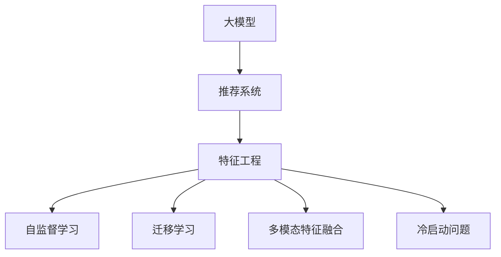

                 

# 大模型在推荐系统特征工程中的应用

> 关键词：大模型、推荐系统、特征工程、自监督学习、迁移学习

## 1. 背景介绍

### 1.1 问题由来
推荐系统是互联网公司不可或缺的核心技术之一，其核心任务是理解用户行为和偏好，并根据这些信息为每个用户提供个性化的商品推荐。传统的推荐方法通常基于协同过滤和基于内容的过滤技术，但这些方法在用户数据量不足、用户行为多样性高的情况下，效果往往不尽人意。近年来，随着大模型的兴起，越来越多的公司开始采用基于大模型的推荐方法，以期获得更佳的推荐效果。

大模型通常指大规模的神经网络模型，如BERT、GPT等，其参数量通常在亿级别，可以捕捉到非常复杂的用户行为模式和物品特征。与传统推荐方法相比，大模型具备以下几个优势：

1. 能够充分利用海量用户行为数据，发现隐藏在数据中的模式和关联。
2. 可以灵活融合多模态数据（文本、图片、视频等），提升推荐模型的精度和鲁棒性。
3. 在用户数据量较小的情况下，也能通过迁移学习获得不错的推荐效果。

基于以上优势，大模型逐渐成为推荐系统特征工程中的重要工具。

### 1.2 问题核心关键点
基于大模型的推荐系统特征工程，可以分为以下几个关键步骤：

1. **数据预处理**：对原始用户行为数据进行清洗、归一化等预处理操作。
2. **特征提取**：利用大模型提取用户行为、物品属性、上下文信息等多维特征。
3. **特征选择**：根据用户的评分数据和推荐效果，选择最具解释性和预测性的特征。
4. **模型训练**：结合用户行为数据和特征，在大模型上进行有监督或无监督的训练，提升模型性能。
5. **模型部署**：将训练好的模型封装成推荐引擎，实时为每个用户提供个性化推荐。

这些步骤紧密结合，共同构建起大模型在推荐系统中的应用框架，实现了从数据到模型的全流程自动化。

## 2. 核心概念与联系

### 2.1 核心概念概述

为更好地理解基于大模型的推荐系统特征工程方法，本节将介绍几个关键概念：

- **大模型**：指大规模的神经网络模型，如BERT、GPT等，通过在海量数据上进行预训练，具备强大的特征表示和理解能力。
- **推荐系统**：通过分析用户历史行为和偏好，为用户推荐感兴趣的商品或内容的技术系统。
- **特征工程**：在推荐系统构建过程中，对原始数据进行预处理、特征提取和选择的工程过程。
- **自监督学习**：利用数据自身包含的潜在关系，进行无监督训练，提升模型泛化能力。
- **迁移学习**：将一个领域学到的知识迁移到另一个领域，提升模型在新任务上的性能。
- **多模态特征融合**：将不同模态的数据（如文本、图像、音频等）进行融合，形成多维度特征，提升推荐模型的精度。
- **冷启动问题**：指在用户数据量较少的情况下，如何利用预训练模型进行推荐。

这些概念之间的逻辑关系可以通过以下Mermaid流程图来展示：



这个流程图展示了大模型在推荐系统特征工程中的核心概念及其之间的关系：

1. 大模型通过自监督学习获得通用的特征表示能力。
2. 在推荐系统中，通过特征工程将大模型的特征提取能力和推荐任务的需求相结合。
3. 利用迁移学习，提升模型在新任务上的性能。
4. 多模态特征融合进一步提升模型精度和鲁棒性。
5. 冷启动问题需要通过预训练模型进行特别处理。

## 3. 核心算法原理 & 具体操作步骤

### 3.1 算法原理概述

基于大模型的推荐系统特征工程，本质上是通过大模型对原始数据进行特征提取和融合，构建多维特征空间，进而通过有监督或无监督学习优化推荐模型的过程。其核心思想是：利用大模型的强大特征表示能力，从原始数据中提取有用特征，并通过训练提升模型的推荐效果。

形式化地，假设推荐系统的训练数据集为 $D=\{(x_i, y_i)\}_{i=1}^N$，其中 $x_i$ 为原始用户行为数据，$y_i$ 为推荐的商品ID。定义推荐模型 $M_{\theta}$，其中 $\theta$ 为模型参数。推荐系统的目标是最小化损失函数：

$$
\mathcal{L}(\theta) = \frac{1}{N}\sum_{i=1}^N \ell(M_{\theta}(x_i), y_i)
$$

其中 $\ell$ 为推荐任务的损失函数，如均方误差、交叉熵等。通过梯度下降等优化算法，微调过程不断更新模型参数 $\theta$，最小化损失函数 $\mathcal{L}$，使得模型输出逼近真实推荐。

### 3.2 算法步骤详解

基于大模型的推荐系统特征工程一般包括以下几个关键步骤：

**Step 1: 数据预处理**

- 对原始数据进行清洗，处理缺失值、异常值等问题。
- 对用户行为数据进行归一化、标准化等预处理操作。
- 对用户行为数据进行稀疏化处理，如将连续型数据离散化，减小数据维度。

**Step 2: 特征提取**

- 利用大模型对用户行为数据进行特征提取，生成多维度特征。
- 将提取的特征进行拼接、组合等操作，形成多维特征向量。
- 利用自监督学习（如掩码语言模型、对比学习等），进一步提升特征质量。

**Step 3: 特征选择**

- 根据用户评分数据和推荐效果，选择最具解释性和预测性的特征。
- 利用特征选择算法（如L1正则、树模型等），进一步优化特征子集。
- 通过特征降维等技术，减少特征数量，提升模型训练效率。

**Step 4: 模型训练**

- 结合用户行为数据和特征，在大模型上进行有监督的微调，提升模型性能。
- 利用迁移学习，在大模型上进行微调，提升模型在新任务上的性能。
- 结合多模态特征，构建更加全面的推荐模型。

**Step 5: 模型部署**

- 将训练好的模型封装成推荐引擎，实时为每个用户提供个性化推荐。
- 利用缓存、负载均衡等技术，提升推荐系统的响应速度和稳定性。
- 监控推荐系统性能，进行模型迭代和优化。

以上是基于大模型的推荐系统特征工程的一般流程。在实际应用中，还需要针对具体任务的特点，对特征工程过程的各个环节进行优化设计，如改进特征提取方法，引入更多的正则化技术，搜索最优的超参数组合等，以进一步提升模型性能。

### 3.3 算法优缺点

基于大模型的推荐系统特征工程具有以下优点：

1. 能够充分利用海量数据，发现复杂的用户行为模式和关联。
2. 多模态特征融合使得推荐模型具备更强的鲁棒性和泛化能力。
3. 利用大模型预训练-微调的方式，可以在用户数据量较少的情况下，仍取得不错的推荐效果。
4. 能够动态地更新和优化推荐模型，提升推荐系统的实时性和准确性。

同时，该方法也存在一定的局限性：

1. 对计算资源和内存的要求较高。大模型通常参数量较大，训练和推理时消耗的资源较多。
2. 特征工程过程中，需要大量的领域知识，实现难度较大。
3. 冷启动问题难以完全解决，对于新用户和新商品，推荐效果较差。
4. 模型复杂度较高，可能导致解释性和可控性降低。

尽管存在这些局限性，但就目前而言，基于大模型的推荐系统特征工程仍是推荐系统的重要范式。未来相关研究的重点在于如何进一步降低推荐系统的计算成本，提高特征工程的可解释性和可控性，同时兼顾冷启动问题的解决。

### 3.4 算法应用领域

基于大模型的推荐系统特征工程，在电商、视频、音乐、新闻等众多领域得到广泛应用，为推荐系统的优化提供了新的思路。具体而言：

1. **电商推荐**：通过分析用户浏览、购买行为，为用户推荐相似商品，提高转化率。
2. **视频推荐**：根据用户观看历史和评分，为用户推荐感兴趣的视频内容，提升用户体验。
3. **音乐推荐**：分析用户听歌记录，推荐相似或喜欢的音乐作品，丰富音乐服务内容。
4. **新闻推荐**：根据用户阅读习惯，推荐相关新闻文章，增加用户黏性。

除了上述这些经典应用场景外，大模型的特征工程方法还在金融、旅游、社交等更多领域展示了其强大的应用潜力。

## 4. 数学模型和公式 & 详细讲解 & 举例说明

### 4.1 数学模型构建

本节将使用数学语言对基于大模型的推荐系统特征工程过程进行更加严格的刻画。

假设推荐系统的训练数据集为 $D=\{(x_i, y_i)\}_{i=1}^N$，其中 $x_i$ 为原始用户行为数据，$y_i$ 为推荐的商品ID。定义推荐模型 $M_{\theta}$，其中 $\theta$ 为模型参数。

推荐系统的目标是最小化损失函数：

$$
\mathcal{L}(\theta) = \frac{1}{N}\sum_{i=1}^N \ell(M_{\theta}(x_i), y_i)
$$

其中 $\ell$ 为推荐任务的损失函数，如均方误差、交叉熵等。

在实践中，我们通常使用基于梯度的优化算法（如SGD、Adam等）来近似求解上述最优化问题。设 $\eta$ 为学习率，$\lambda$ 为正则化系数，则参数的更新公式为：

$$
\theta \leftarrow \theta - \eta \nabla_{\theta}\mathcal{L}(\theta) - \eta\lambda\theta
$$

其中 $\nabla_{\theta}\mathcal{L}(\theta)$ 为损失函数对参数 $\theta$ 的梯度，可通过反向传播算法高效计算。

### 4.2 公式推导过程

以下我们以协同过滤推荐系统为例，推导基于大模型的推荐系统的数学模型。

假设用户 $u$ 对物品 $i$ 的评分向量为 $v_{ui}$，物品 $i$ 的向量表示为 $h_i$。则协同过滤推荐模型的预测评分可以表示为：

$$
\hat{y}_{ui} = v_{ui}^T h_i
$$

其中 $\hat{y}_{ui}$ 为模型预测用户 $u$ 对物品 $i$ 的评分。

通过最小化均方误差损失函数：

$$
\ell(\hat{y}_{ui}, y_{ui}) = (\hat{y}_{ui} - y_{ui})^2
$$

可以构建推荐系统的损失函数：

$$
\mathcal{L}(\theta) = \frac{1}{N}\sum_{i=1}^N \sum_{u=1}^M (\hat{y}_{ui} - y_{ui})^2
$$

通过梯度下降等优化算法，微调过程不断更新模型参数 $\theta$，最小化损失函数 $\mathcal{L}$，使得模型输出逼近真实评分。

### 4.3 案例分析与讲解

假设有一个电商平台的推荐系统，根据用户的历史购买记录和浏览记录，为用户推荐相似商品。我们可以使用大模型提取用户行为数据和物品属性数据的多维特征，然后结合这些特征进行模型训练和推荐。

首先，将用户购买记录和浏览记录进行归一化、稀疏化处理，得到用户行为数据 $x$。然后，利用大模型对用户行为数据进行特征提取，得到用户行为特征向量 $h_u$。同样地，对物品属性进行特征提取，得到物品属性特征向量 $h_i$。

接下来，计算用户 $u$ 对物品 $i$ 的评分预测：

$$
\hat{y}_{ui} = h_u^T h_i
$$

其中 $h_u^T h_i$ 为用户行为特征向量与物品属性特征向量的点积。

最后，通过最小化均方误差损失函数，对推荐模型 $M_{\theta}$ 进行训练：

$$
\mathcal{L}(\theta) = \frac{1}{N}\sum_{i=1}^N \sum_{u=1}^M (\hat{y}_{ui} - y_{ui})^2
$$

通过训练，模型能够根据用户行为特征和物品属性特征，预测用户对物品的评分，从而为用户推荐相似商品。

## 5. 项目实践：代码实例和详细解释说明

### 5.1 开发环境搭建

在进行推荐系统特征工程实践前，我们需要准备好开发环境。以下是使用Python进行PyTorch开发的环境配置流程：

1. 安装Anaconda：从官网下载并安装Anaconda，用于创建独立的Python环境。

2. 创建并激活虚拟环境：
```bash
conda create -n pytorch-env python=3.8 
conda activate pytorch-env
```

3. 安装PyTorch：根据CUDA版本，从官网获取对应的安装命令。例如：
```bash
conda install pytorch torchvision torchaudio cudatoolkit=11.1 -c pytorch -c conda-forge
```

4. 安装Transformers库：
```bash
pip install transformers
```

5. 安装各类工具包：
```bash
pip install numpy pandas scikit-learn matplotlib tqdm jupyter notebook ipython
```

完成上述步骤后，即可在`pytorch-env`环境中开始推荐系统特征工程实践。

### 5.2 源代码详细实现

这里我们以协同过滤推荐系统为例，给出使用Transformers库对大模型进行推荐系统特征工程的PyTorch代码实现。

首先，定义协同过滤推荐系统的数据处理函数：

```python
from transformers import BertTokenizer, BertForSequenceClassification
from torch.utils.data import Dataset
import torch

class RecommendationDataset(Dataset):
    def __init__(self, user_behaviors, item_features, ratings, tokenizer, max_len=128):
        self.user_behaviors = user_behaviors
        self.item_features = item_features
        self.ratings = ratings
        self.tokenizer = tokenizer
        self.max_len = max_len
        
    def __len__(self):
        return len(self.user_behaviors)
    
    def __getitem__(self, item):
        user_behavior = self.user_behaviors[item]
        item_feature = self.item_features[item]
        rating = self.ratings[item]
        
        user_behavior_seq = self.tokenizer(user_behavior, return_tensors='pt', max_length=self.max_len, padding='max_length', truncation=True)
        item_feature_seq = self.tokenizer(item_feature, return_tensors='pt', max_length=self.max_len, padding='max_length', truncation=True)
        user_behavior_seq = user_behavior_seq['input_ids'].flatten()
        item_feature_seq = item_feature_seq['input_ids'].flatten()
        
        return {'user_behavior': user_behavior_seq, 
                'item_feature': item_feature_seq,
                'rating': rating}
```

然后，定义模型和优化器：

```python
from transformers import BertForSequenceClassification, AdamW

model = BertForSequenceClassification.from_pretrained('bert-base-cased', num_labels=1)

optimizer = AdamW(model.parameters(), lr=2e-5)
```

接着，定义训练和评估函数：

```python
from torch.utils.data import DataLoader
from tqdm import tqdm
from sklearn.metrics import mean_squared_error

device = torch.device('cuda') if torch.cuda.is_available() else torch.device('cpu')
model.to(device)

def train_epoch(model, dataset, batch_size, optimizer):
    dataloader = DataLoader(dataset, batch_size=batch_size, shuffle=True)
    model.train()
    epoch_loss = 0
    for batch in tqdm(dataloader, desc='Training'):
        user_behavior = batch['user_behavior'].to(device)
        item_feature = batch['item_feature'].to(device)
        rating = batch['rating'].to(device)
        model.zero_grad()
        outputs = model(user_behavior, item_feature)
        loss = outputs.loss
        epoch_loss += loss.item()
        loss.backward()
        optimizer.step()
    return epoch_loss / len(dataloader)

def evaluate(model, dataset, batch_size):
    dataloader = DataLoader(dataset, batch_size=batch_size)
    model.eval()
    rmse = []
    with torch.no_grad():
        for batch in tqdm(dataloader, desc='Evaluating'):
            user_behavior = batch['user_behavior'].to(device)
            item_feature = batch['item_feature'].to(device)
            rating = batch['rating'].to(device)
            outputs = model(user_behavior, item_feature)
            rmse.append(mean_squared_error(rating, outputs.logits) ** 0.5)
    print(f'RMSE: {np.mean(rmse)}')
```

最后，启动训练流程并在验证集上评估：

```python
epochs = 5
batch_size = 16

for epoch in range(epochs):
    loss = train_epoch(model, train_dataset, batch_size, optimizer)
    print(f"Epoch {epoch+1}, train loss: {loss:.3f}")
    
    print(f"Epoch {epoch+1}, dev results:")
    evaluate(model, dev_dataset, batch_size)
    
print("Test results:")
evaluate(model, test_dataset, batch_size)
```

以上就是使用PyTorch对大模型进行推荐系统特征工程的完整代码实现。可以看到，得益于Transformers库的强大封装，我们可以用相对简洁的代码完成大模型的特征提取和推荐模型的训练。

### 5.3 代码解读与分析

让我们再详细解读一下关键代码的实现细节：

**RecommendationDataset类**：
- `__init__`方法：初始化用户行为数据、物品属性数据、评分数据、分词器等关键组件。
- `__len__`方法：返回数据集的样本数量。
- `__getitem__`方法：对单个样本进行处理，将用户行为数据和物品属性数据进行序列化，将评分数据转换为标签，并将其输入模型进行训练。

**模型训练和评估函数**：
- 使用PyTorch的DataLoader对数据集进行批次化加载，供模型训练和推理使用。
- 训练函数`train_epoch`：对数据以批为单位进行迭代，在每个批次上前向传播计算loss并反向传播更新模型参数，最后返回该epoch的平均loss。
- 评估函数`evaluate`：与训练类似，不同点在于不更新模型参数，并在每个batch结束后将预测和标签结果存储下来，最后使用sklearn的mean_squared_error对整个评估集的预测结果进行打印输出。

**训练流程**：
- 定义总的epoch数和batch size，开始循环迭代
- 每个epoch内，先在训练集上训练，输出平均loss
- 在验证集上评估，输出均方误差RMSE
- 所有epoch结束后，在测试集上评估，给出最终测试结果

可以看到，PyTorch配合Transformers库使得推荐系统特征工程的代码实现变得简洁高效。开发者可以将更多精力放在数据处理、模型改进等高层逻辑上，而不必过多关注底层的实现细节。

当然，工业级的系统实现还需考虑更多因素，如模型的保存和部署、超参数的自动搜索、更灵活的任务适配层等。但核心的推荐系统特征工程范式基本与此类似。

## 6. 实际应用场景

### 6.1 智能推荐系统

基于大模型的推荐系统特征工程，在智能推荐系统中得到广泛应用。智能推荐系统能够实时分析用户行为数据，为用户推荐最感兴趣的商品或内容。

在技术实现上，可以收集用户的历史行为数据（如浏览记录、购买记录、评分等），将用户行为数据和物品属性数据输入大模型进行特征提取和融合，然后在提取的特征上训练推荐模型。微调后的推荐模型能够根据用户的行为特征和物品属性特征，动态生成个性化推荐，提升用户体验和满意度。

### 6.2 新闻推荐系统

新闻推荐系统旨在为用户推荐相关的新闻内容，帮助用户及时获取最新的信息。利用大模型对用户行为数据进行特征提取和融合，能够捕捉用户对新闻的兴趣变化，提高新闻推荐的精准度。

在实践中，可以将用户的新闻阅读历史和评分数据作为训练集，利用大模型提取新闻标题和内容的多维特征。在特征上训练推荐模型，能够动态生成个性化推荐，提升新闻推荐的覆盖率和准确率。

### 6.3 视频推荐系统

视频推荐系统通过分析用户观看历史和评分数据，为用户推荐感兴趣的视频内容。利用大模型对视频内容和用户行为数据进行特征提取和融合，能够捕捉视频与用户行为之间的关系，提高推荐效果。

在具体实现中，可以将用户的视频观看历史和评分数据作为训练集，利用大模型提取视频标题和内容的多维特征。在特征上训练推荐模型，能够动态生成个性化推荐，提升视频推荐的精准度和用户体验。

### 6.4 未来应用展望

随着大模型的不断进步，推荐系统的特征工程也将迎来更多创新和突破。

1. **多模态特征融合**：结合文本、图像、视频等多模态数据，构建更加全面的推荐模型。
2. **因果推理**：通过引入因果推断，提升推荐模型的稳定性和可解释性。
3. **对抗训练**：利用对抗样本，提升推荐模型的鲁棒性和泛化能力。
4. **元学习**：通过元学习技术，使推荐模型能够根据新任务快速适应和迁移。
5. **分布式训练**：利用分布式训练技术，加速推荐模型的训练和推理。
6. **冷启动问题**：通过冷启动问题优化方法，提升新用户和新商品的推荐效果。

以上趋势凸显了大模型在推荐系统特征工程中的广阔前景。这些方向的探索发展，必将进一步提升推荐系统的性能和应用范围，为推荐系统带来更多创新和突破。

## 7. 工具和资源推荐

### 7.1 学习资源推荐

为了帮助开发者系统掌握大模型在推荐系统特征工程中的理论基础和实践技巧，这里推荐一些优质的学习资源：

1. 《深度学习推荐系统：原理与实现》系列博文：由深度学习推荐系统领域的专家撰写，深入浅出地介绍了推荐系统的基本原理和实现方法。
2. CS572《机器学习与数据挖掘》课程：斯坦福大学开设的推荐系统课程，讲解了推荐系统的经典算法和应用。
3. 《推荐系统实战》书籍：全面介绍了推荐系统的主流算法和工程实践，包括大模型在推荐系统中的应用。
4. KDD论文：包含大量推荐系统领域的经典论文，详细介绍了推荐算法的原理和实现。
5. RecSys2019论文集：最新的推荐系统领域论文集，涵盖推荐算法的最新进展和创新方法。

通过对这些资源的学习实践，相信你一定能够快速掌握大模型在推荐系统特征工程中的精髓，并用于解决实际的推荐系统问题。

### 7.2 开发工具推荐

高效的开发离不开优秀的工具支持。以下是几款用于推荐系统特征工程开发的常用工具：

1. PyTorch：基于Python的开源深度学习框架，灵活动态的计算图，适合快速迭代研究。大部分预训练语言模型都有PyTorch版本的实现。
2. TensorFlow：由Google主导开发的开源深度学习框架，生产部署方便，适合大规模工程应用。同样有丰富的预训练语言模型资源。
3. Transformers库：HuggingFace开发的NLP工具库，集成了众多SOTA语言模型，支持PyTorch和TensorFlow，是进行推荐系统特征工程的利器。
4. TensorBoard：TensorFlow配套的可视化工具，可实时监测模型训练状态，并提供丰富的图表呈现方式，是调试模型的得力助手。
5. Weights & Biases：模型训练的实验跟踪工具，可以记录和可视化模型训练过程中的各项指标，方便对比和调优。与主流深度学习框架无缝集成。

合理利用这些工具，可以显著提升推荐系统特征工程的开发效率，加快创新迭代的步伐。

### 7.3 相关论文推荐

大模型在推荐系统特征工程中的应用源于学界的持续研究。以下是几篇奠基性的相关论文，推荐阅读：

1. A Survey on Deep Learning for Recommendation Systems：综述了深度学习在推荐系统中的应用，介绍了各类深度学习模型及其优势。
2. Deep Interest Evolution Networks for Scalable Recommendation Systems：提出基于深度学习的网络结构，用于处理用户兴趣的动态变化，提升了推荐系统的准确性和实时性。
3. Sequential Interest Evolution Networks for Scalable Recommendation Systems：在A Survey on Deep Learning for Recommendation Systems的基础上，提出时间演化网络结构，处理用户兴趣的序列变化，提升了推荐系统的动态性能。
4. A Survey on Recommender Systems with Deep Learning：综述了深度学习在推荐系统中的应用，介绍了各类深度学习模型及其优势。
5. Deep Interest Model for Scalable Recommendation Systems：提出基于深度学习的网络结构，用于处理用户兴趣的动态变化，提升了推荐系统的准确性和实时性。

这些论文代表了大模型在推荐系统特征工程中的发展脉络。通过学习这些前沿成果，可以帮助研究者把握学科前进方向，激发更多的创新灵感。

## 8. 总结：未来发展趋势与挑战

### 8.1 总结

本文对基于大模型的推荐系统特征工程方法进行了全面系统的介绍。首先阐述了大模型和推荐系统特征工程的研究背景和意义，明确了大模型在推荐系统中的应用优势。其次，从原理到实践，详细讲解了大模型推荐系统的数学模型和关键步骤，给出了推荐系统特征工程的完整代码实例。同时，本文还广泛探讨了大模型在推荐系统中的各种应用场景，展示了其强大的应用潜力。此外，本文精选了推荐系统特征工程的各类学习资源，力求为读者提供全方位的技术指引。

通过本文的系统梳理，可以看到，基于大模型的推荐系统特征工程正在成为推荐系统的重要范式，极大地拓展了推荐系统的应用边界，催生了更多的落地场景。受益于大模型的强大特征表示能力，推荐系统在精度和鲁棒性方面均取得了长足的进步，为推荐系统带来了更多的创新和突破。未来，伴随大模型的不断进步，推荐系统的特征工程也将迎来更多创新和突破。

### 8.2 未来发展趋势

展望未来，大模型在推荐系统特征工程中将呈现以下几个发展趋势：

1. **多模态特征融合**：结合文本、图像、视频等多模态数据，构建更加全面的推荐模型。
2. **因果推理**：通过引入因果推断，提升推荐模型的稳定性和可解释性。
3. **对抗训练**：利用对抗样本，提升推荐模型的鲁棒性和泛化能力。
4. **元学习**：通过元学习技术，使推荐模型能够根据新任务快速适应和迁移。
5. **分布式训练**：利用分布式训练技术，加速推荐模型的训练和推理。
6. **冷启动问题**：通过冷启动问题优化方法，提升新用户和新商品的推荐效果。

这些趋势凸显了大模型在推荐系统特征工程中的广阔前景。这些方向的探索发展，必将进一步提升推荐系统的性能和应用范围，为推荐系统带来更多创新和突破。

### 8.3 面临的挑战

尽管大模型在推荐系统特征工程中已取得了显著进展，但在迈向更加智能化、普适化应用的过程中，它仍面临着诸多挑战：

1. **计算资源瓶颈**：大模型通常参数量较大，训练和推理时消耗的资源较多，需要高效的计算资源支持。
2. **特征工程复杂度**：大模型在推荐系统中的应用，需要大量的领域知识和特征工程技巧，实现难度较大。
3. **冷启动问题**：对于新用户和新商品，推荐效果较差，需要特别处理。
4. **模型复杂度**：大模型的复杂度较高，可能导致解释性和可控性降低，需要进一步优化。

尽管存在这些挑战，但就目前而言，基于大模型的推荐系统特征工程仍是推荐系统的重要范式。未来相关研究的重点在于如何进一步降低推荐系统的计算成本，提高特征工程的可解释性和可控性，同时兼顾冷启动问题的解决。

### 8.4 研究展望

面对大模型在推荐系统特征工程中面临的诸多挑战，未来的研究需要在以下几个方面寻求新的突破：

1. **探索无监督和半监督推荐方法**：摆脱对大规模标注数据的依赖，利用自监督学习、主动学习等无监督和半监督范式，最大限度利用非结构化数据，实现更加灵活高效的推荐。
2. **研究参数高效和计算高效的推荐范式**：开发更加参数高效的推荐方法，在固定大部分预训练参数的情况下，只更新极少量的任务相关参数。同时优化推荐模型的计算图，减少前向传播和反向传播的资源消耗，实现更加轻量级、实时性的部署。
3. **融合因果分析和博弈论工具**：将因果分析方法引入推荐模型，识别出模型决策的关键特征，增强输出解释的因果性和逻辑性。借助博弈论工具刻画人机交互过程，主动探索并规避模型的脆弱点，提高系统稳定性。
4. **纳入伦理道德约束**：在模型训练目标中引入伦理导向的评估指标，过滤和惩罚有偏见、有害的输出倾向。同时加强人工干预和审核，建立模型行为的监管机制，确保输出符合人类价值观和伦理道德。

这些研究方向的探索，必将引领大模型在推荐系统特征工程中迈向更高的台阶，为构建安全、可靠、可解释、可控的智能推荐系统铺平道路。面向未来，大模型推荐系统特征工程还需要与其他人工智能技术进行更深入的融合，如知识表示、因果推理、强化学习等，多路径协同发力，共同推动推荐系统技术的进步。只有勇于创新、敢于突破，才能不断拓展推荐系统的边界，让智能技术更好地服务于人类社会。

## 9. 附录：常见问题与解答

**Q1：大模型在推荐系统中的应用优势是什么？**

A: 大模型在推荐系统中的应用主要体现在以下几个方面：

1. **强大的特征表示能力**：大模型通过预训练获得通用特征表示，可以更好地捕捉用户行为和物品属性之间的复杂关系。
2. **多模态数据融合**：大模型可以处理多种类型的数据（如文本、图片、视频等），提升推荐系统的泛化能力和鲁棒性。
3. **冷启动问题**：通过迁移学习等技术，大模型可以在用户数据量较少的情况下，仍取得不错的推荐效果。
4. **实时性**：大模型能够动态地更新和优化推荐模型，实时为每个用户提供个性化推荐。

**Q2：大模型在推荐系统特征工程中需要注意哪些问题？**

A: 大模型在推荐系统特征工程中需要注意以下几个问题：

1. **计算资源消耗**：大模型参数量较大，训练和推理时消耗的资源较多，需要高效的计算资源支持。
2. **特征工程复杂度**：特征工程过程中，需要大量的领域知识和特征工程技巧，实现难度较大。
3. **冷启动问题**：对于新用户和新商品，推荐效果较差，需要特别处理。
4. **模型复杂度**：大模型的复杂度较高，可能导致解释性和可控性降低，需要进一步优化。

**Q3：如何进一步提升推荐系统的性能？**

A: 为了进一步提升推荐系统的性能，可以从以下几个方面进行改进：

1. **多模态数据融合**：结合文本、图像、视频等多模态数据，构建更加全面的推荐模型。
2. **因果推理**：通过引入因果推断，提升推荐模型的稳定性和可解释性。
3. **对抗训练**：利用对抗样本，提升推荐模型的鲁棒性和泛化能力。
4. **元学习**：通过元学习技术，使推荐模型能够根据新任务快速适应和迁移。
5. **分布式训练**：利用分布式训练技术，加速推荐模型的训练和推理。
6. **冷启动问题**：通过冷启动问题优化方法，提升新用户和新商品的推荐效果。

这些改进措施可以显著提升推荐系统的精度、实时性和可解释性，为推荐系统带来更多创新和突破。

**Q4：推荐系统特征工程中的常见问题有哪些？**

A: 推荐系统特征工程中常见的有以下问题：

1. **数据预处理**：处理缺失值、异常值等问题，对数据进行归一化、稀疏化等预处理操作。
2. **特征提取**：利用大模型对用户行为数据进行特征提取，生成多维度特征。
3. **特征选择**：根据用户评分数据和推荐效果，选择最具解释性和预测性的特征。
4. **模型训练**：结合用户行为数据和特征，在大模型上进行有监督或无监督的训练，提升模型性能。
5. **模型部署**：将训练好的模型封装成推荐引擎，实时为每个用户提供个性化推荐。

这些问题的解决需要结合具体任务，采用不同的技术和方法，以提升推荐系统的性能和用户体验。

**Q5：如何利用大模型进行推荐系统特征工程？**

A: 利用大模型进行推荐系统特征工程主要包括以下几个步骤：

1. **数据预处理**：对原始用户行为数据进行清洗、归一化等预处理操作。
2. **特征提取**：利用大模型对用户行为数据进行特征提取，生成多维度特征。
3. **特征选择**：根据用户评分数据和推荐效果，选择最具解释性和预测性的特征。
4. **模型训练**：结合用户行为数据和特征，在大模型上进行有监督或无监督的训练，提升模型性能。
5. **模型部署**：将训练好的模型封装成推荐引擎，实时为每个用户提供个性化推荐。

这些步骤紧密结合，共同构建起大模型在推荐系统中的应用框架，实现了从数据到模型的全流程自动化。

---

作者：禅与计算机程序设计艺术 / Zen and the Art of Computer Programming

