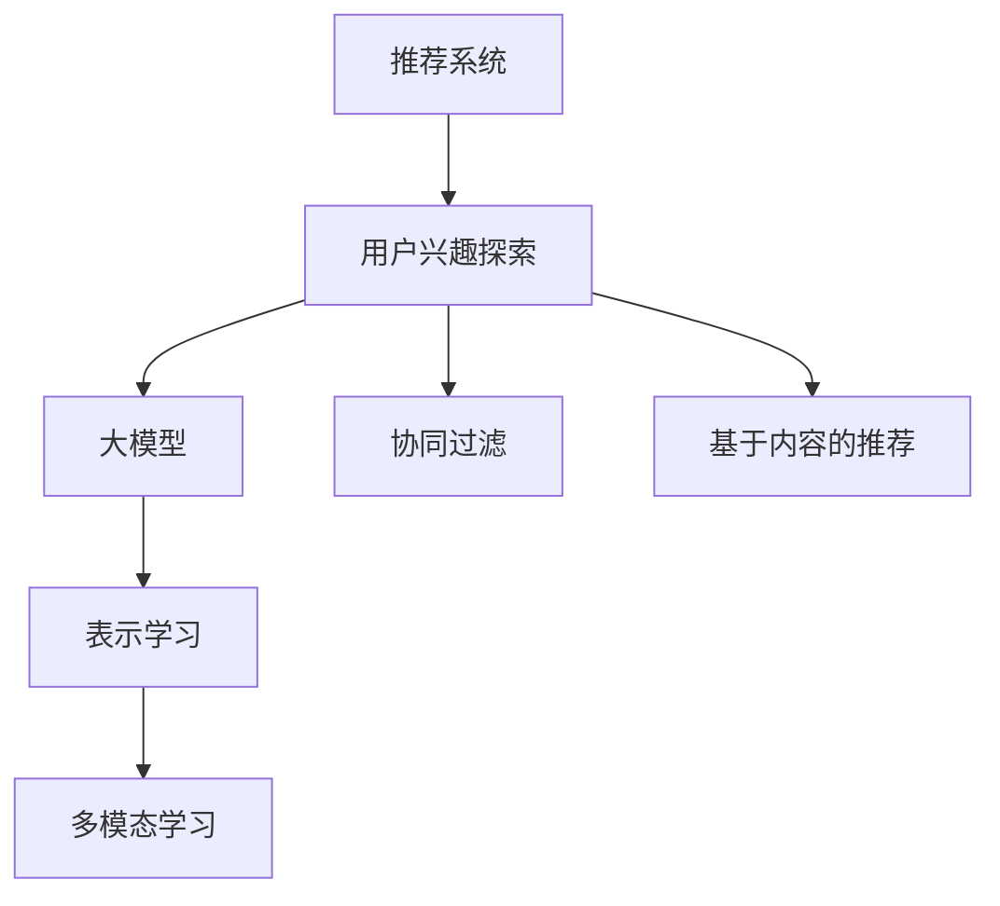

                 

# 大模型在推荐系统用户兴趣探索中的作用

## 1. 背景介绍

随着互联网的迅猛发展，信息爆炸已经成为一个普遍现象。用户获取信息的渠道更加多样化，如何从海量数据中快速准确地找到所需信息，成为了一个亟待解决的问题。推荐系统正是应对这一挑战的产物，它能够根据用户的历史行为和偏好，智能推荐符合用户兴趣的内容。在大数据时代，推荐系统已经成为互联网应用不可或缺的重要组件，如电商网站的产品推荐、视频网站的影视推荐、新闻网站的个性化推送等。

然而，传统的推荐系统往往依赖于用户历史行为的显式反馈（如浏览记录、购买记录等）进行推荐，无法捕捉用户的隐性偏好和潜在的兴趣点。这使得推荐系统在用户兴趣探索和推荐效果优化上存在一定局限性。近年来，随着深度学习和大模型的兴起，推荐系统开始引入基于用户兴趣的探索方法，通过大模型对用户的多模态信息进行深度建模，挖掘用户的潜在兴趣，实现更加精准、个性化的推荐。本文将聚焦于大模型在推荐系统中用户兴趣探索的作用，探讨其原理、应用、挑战及未来趋势。

## 2. 核心概念与联系

### 2.1 核心概念概述

为了深入理解大模型在推荐系统中用户兴趣探索的应用，本节将介绍几个关键概念：

- **推荐系统(Recommendation System)**：根据用户的历史行为和特征，推荐符合用户兴趣的商品、内容、信息等的技术系统。
- **用户兴趣探索(User Interest Exploration)**：通过分析用户的多模态数据（如行为数据、社交数据、文本数据等），挖掘用户潜在兴趣和偏好，以提升推荐系统的个性化程度。
- **大模型(Large Model)**：以深度神经网络为代表的大规模预训练模型，如BERT、GPT、Transformer等。
- **表示学习(Representation Learning)**：通过深度学习模型对数据进行自动编码，学习出低维度的数据表示，用于捕捉数据的特征和语义信息。
- **多模态学习(Multimodal Learning)**：融合不同模态的数据特征（如文本、图像、音频等）进行联合建模，提升数据表示的质量和准确性。
- **协同过滤(Collaborative Filtering)**：通过用户历史行为和兴趣的协同关系，进行相似度计算和推荐。
- **基于内容的推荐(Content-Based Recommendation)**：根据物品的特征，如标签、属性、描述等，进行物品推荐。

这些概念之间的联系可以通过以下Mermaid流程图来展示：



这个流程图展示了推荐系统与用户兴趣探索之间的关系：

1. 推荐系统通过用户兴趣探索获取用户的兴趣点，包括显式反馈和隐式反馈。
2. 用户兴趣探索中使用了大模型进行表示学习，学习用户和物品的语义表示。
3. 通过多模态学习融合不同模态的数据，提升数据表示的质量。
4. 用户兴趣探索的结果可以结合协同过滤和基于内容的推荐进行推荐。

## 3. 核心算法原理 & 具体操作步骤

### 3.1 算法原理概述

大模型在推荐系统中用户兴趣探索的作用，主要体现在以下几个方面：

1. **语义表示学习**：大模型通过预训练学习得到语言、视觉等多模态数据的语义表示，能够捕捉数据的深层次特征和语义关系。

2. **用户兴趣建模**：大模型通过学习用户的多模态数据，能够挖掘用户的潜在兴趣和隐性偏好，进行用户兴趣建模。

3. **物品多维表示**：大模型能够学习物品的多种特征表示，如语言描述、视觉特征、音频特征等，形成多维的物品表示。

4. **推荐特征提取**：大模型提取出的用户和物品的表示可以用于推荐特征的生成，提升推荐系统的准确性和个性化。

5. **交叉模态推荐**：大模型能够融合不同模态的特征，进行跨模态推荐，实现更加精准的推荐。

### 3.2 算法步骤详解

基于大模型在推荐系统中用户兴趣探索的应用，其算法步骤如下：

**Step 1: 数据收集与预处理**

1. **多模态数据收集**：收集用户行为数据、社交数据、文本数据等，构建多模态数据集。
2. **数据清洗与标注**：对收集的数据进行清洗，去除噪声和异常值，标注用户兴趣标签。
3. **数据标准化**：对不同模态的数据进行标准化处理，使其具有可比性。

**Step 2: 大模型训练与表示学习**

1. **选择合适的预训练模型**：选择适合推荐系统的预训练模型，如BERT、GPT、Transformer等。
2. **模型微调**：在多模态数据上微调预训练模型，学习用户和物品的语义表示。
3. **表示提取**：通过微调后的模型提取用户和物品的表示。

**Step 3: 用户兴趣建模**

1. **兴趣标签提取**：通过大模型学习用户兴趣标签，提取用户兴趣特征。
2. **兴趣向量生成**：将兴趣标签转换为高维兴趣向量，用于用户兴趣建模。

**Step 4: 物品多维表示**

1. **物品特征提取**：提取物品的多模态特征，如语言描述、视觉特征、音频特征等。
2. **多维表示学习**：使用大模型学习物品的多维表示，融合不同模态的特征。

**Step 5: 推荐特征生成**

1. **用户物品特征匹配**：将用户和物品的表示进行匹配，生成推荐特征。
2. **推荐模型训练**：训练推荐模型，根据推荐特征进行推荐。

**Step 6: 推荐结果输出**

1. **相似度计算**：计算用户和物品的相似度，排序推荐结果。
2. **推荐列表生成**：生成符合用户兴趣的推荐列表。

### 3.3 算法优缺点

大模型在推荐系统中用户兴趣探索的应用，具有以下优点：

1. **语义表示能力强**：大模型能够学习到数据的深层次语义信息，提升数据表示的质量。
2. **跨模态融合能力强**：大模型能够融合不同模态的数据特征，提升推荐系统的多样性和个性化。
3. **数据利用率高**：大模型能够有效利用多模态数据，挖掘用户的潜在兴趣和隐性偏好。
4. **推荐效果显著**：通过大模型的深度表示学习，推荐系统的准确性和个性化得到了显著提升。

同时，大模型在推荐系统中用户兴趣探索的应用也存在一些缺点：

1. **模型复杂度高**：大模型的参数量庞大，训练和推理耗时较长，对计算资源要求高。
2. **数据标注成本高**：大模型需要大量的标注数据进行训练，标注成本较高。
3. **模型解释性差**：大模型的内部机制复杂，难以解释其决策过程，影响模型的可解释性和可信度。
4. **数据隐私问题**：大模型需要大量的用户隐私数据进行训练，数据隐私和安全问题值得关注。

### 3.4 算法应用领域

大模型在推荐系统中用户兴趣探索的应用，已经广泛覆盖了多个领域，包括但不限于：

- **电商推荐**：通过分析用户的浏览、购买、评价等行为数据，推荐符合用户兴趣的商品。
- **视频推荐**：通过分析用户的观看历史、评分、评论等数据，推荐符合用户兴趣的视频内容。
- **音乐推荐**：通过分析用户的听歌历史、评分、分享等数据，推荐符合用户兴趣的音乐作品。
- **新闻推荐**：通过分析用户的阅读历史、点击、分享等数据，推荐符合用户兴趣的新闻内容。
- **社交推荐**：通过分析用户的社交关系、互动数据等，推荐符合用户兴趣的朋友或内容。

## 4. 数学模型和公式 & 详细讲解 & 举例说明

### 4.1 数学模型构建

假设用户为 $U$，物品为 $I$，推荐系统为 $R$。用户和物品的特征表示分别为 $X \in \mathbb{R}^{D_x}$ 和 $Y \in \mathbb{R}^{D_y}$，其中 $D_x$ 和 $D_y$ 分别为用户和物品特征向量的维度。推荐系统通过用户和物品的特征表示，生成推荐特征 $Z \in \mathbb{R}^{D_z}$，其中 $D_z$ 为推荐特征的维度。推荐模型的损失函数为 $\mathcal{L}$，用于衡量推荐结果与真实标签 $Y$ 之间的差异。

**用户兴趣建模**：
1. **兴趣标签提取**：通过大模型学习用户兴趣标签，提取用户兴趣特征 $Z_u \in \mathbb{R}^{D_u}$。
2. **兴趣向量生成**：将兴趣标签转换为高维兴趣向量 $V_u \in \mathbb{R}^{D_u}$。

**物品多维表示**：
1. **物品特征提取**：通过大模型提取物品的多模态特征，如语言描述、视觉特征、音频特征等，生成物品特征表示 $X_i \in \mathbb{R}^{D_x}$。
2. **多维表示学习**：使用大模型学习物品的多维表示 $V_i \in \mathbb{R}^{D_y}$。

**推荐特征生成**：
1. **用户物品特征匹配**：将用户和物品的表示进行匹配，生成推荐特征 $Z_{ui} \in \mathbb{R}^{D_z}$。
2. **推荐模型训练**：训练推荐模型 $R_{ui} \in \mathbb{R}^{D_z}$，根据推荐特征进行推荐。

**推荐结果输出**：
1. **相似度计算**：计算用户和物品的相似度 $S_{ui} \in \mathbb{R}^{D_z}$。
2. **推荐列表生成**：根据相似度排序推荐列表。

### 4.2 公式推导过程

以下以电商推荐系统为例，推导推荐特征生成和推荐结果输出的公式。

**用户兴趣建模**：
1. **兴趣标签提取**：通过大模型学习用户兴趣标签 $L_u \in \{1,2,\dots,K\}$，其中 $K$ 为兴趣标签的种类。
2. **兴趣向量生成**：将兴趣标签转换为高维兴趣向量 $V_u \in \mathbb{R}^{D_u}$。

$$
V_u = \text{Embedding}(L_u)
$$

**物品多维表示**：
1. **物品特征提取**：通过大模型提取物品的多模态特征 $X_i \in \mathbb{R}^{D_x}$。
2. **多维表示学习**：使用大模型学习物品的多维表示 $V_i \in \mathbb{R}^{D_y}$。

$$
V_i = \text{Embedding}(X_i)
$$

**推荐特征生成**：
1. **用户物品特征匹配**：将用户和物品的表示进行匹配，生成推荐特征 $Z_{ui} \in \mathbb{R}^{D_z}$。

$$
Z_{ui} = \text{DotProduct}(V_u, V_i)
$$

**推荐模型训练**：
1. **推荐模型训练**：训练推荐模型 $R_{ui} \in \mathbb{R}^{D_z}$，根据推荐特征进行推荐。

$$
R_{ui} = \text{Linear}(V_u, V_i)
$$

**推荐结果输出**：
1. **相似度计算**：计算用户和物品的相似度 $S_{ui} \in \mathbb{R}^{D_z}$。

$$
S_{ui} = \text{CosineSimilarity}(V_u, V_i)
$$

2. **推荐列表生成**：根据相似度排序推荐列表。

$$
R_i = \text{TopK}(S_{ui}, K)
$$

以上公式展示了用户兴趣建模、物品多维表示、推荐特征生成和推荐结果输出的全过程。通过大模型的深度表示学习，推荐系统的准确性和个性化得到了显著提升。

### 4.3 案例分析与讲解

以电商平台推荐系统为例，分析大模型在用户兴趣探索中的具体应用。

**数据准备**：
1. **用户数据**：包括用户的浏览记录、购买记录、评价记录等。
2. **物品数据**：包括物品的描述、价格、类别、评分等。
3. **用户物品交互数据**：包括用户的点击、购买、收藏、评价等行为数据。

**用户兴趣建模**：
1. **兴趣标签提取**：通过大模型学习用户兴趣标签 $L_u \in \{1,2,\dots,K\}$，其中 $K$ 为兴趣标签的种类。
2. **兴趣向量生成**：将兴趣标签转换为高维兴趣向量 $V_u \in \mathbb{R}^{D_u}$。

**物品多维表示**：
1. **物品特征提取**：通过大模型提取物品的多模态特征 $X_i \in \mathbb{R}^{D_x}$。
2. **多维表示学习**：使用大模型学习物品的多维表示 $V_i \in \mathbb{R}^{D_y}$。

**推荐特征生成**：
1. **用户物品特征匹配**：将用户和物品的表示进行匹配，生成推荐特征 $Z_{ui} \in \mathbb{R}^{D_z}$。

**推荐模型训练**：
1. **推荐模型训练**：训练推荐模型 $R_{ui} \in \mathbb{R}^{D_z}$，根据推荐特征进行推荐。

**推荐结果输出**：
1. **相似度计算**：计算用户和物品的相似度 $S_{ui} \in \mathbb{R}^{D_z}$。

2. **推荐列表生成**：根据相似度排序推荐列表。

通过上述过程，电商平台推荐系统能够根据用户的兴趣和行为数据，推荐符合用户偏好的商品，提升用户体验和销售转化率。

## 5. 项目实践：代码实例和详细解释说明

### 5.1 开发环境搭建

在进行推荐系统用户兴趣探索的开发实践前，我们需要准备好开发环境。以下是使用Python进行PyTorch开发的环境配置流程：

1. 安装Anaconda：从官网下载并安装Anaconda，用于创建独立的Python环境。

2. 创建并激活虚拟环境：
```bash
conda create -n pytorch-env python=3.8 
conda activate pytorch-env
```

3. 安装PyTorch：根据CUDA版本，从官网获取对应的安装命令。例如：
```bash
conda install pytorch torchvision torchaudio cudatoolkit=11.1 -c pytorch -c conda-forge
```

4. 安装Transformers库：
```bash
pip install transformers
```

5. 安装各类工具包：
```bash
pip install numpy pandas scikit-learn matplotlib tqdm jupyter notebook ipython
```

完成上述步骤后，即可在`pytorch-env`环境中开始推荐系统用户兴趣探索的开发实践。

### 5.2 源代码详细实现

下面以电商推荐系统为例，给出使用Transformers库进行用户兴趣探索的PyTorch代码实现。

首先，定义用户和物品特征提取器：

```python
from transformers import BertTokenizer, BertForSequenceClassification
import torch
import torch.nn as nn

class UserFeatureExtractor(nn.Module):
    def __init__(self, tokenizer, model):
        super(UserFeatureExtractor, self).__init__()
        self.tokenizer = tokenizer
        self.model = model

    def forward(self, input_ids):
        encoding = self.tokenizer(input_ids, return_tensors='pt', padding='max_length', truncation=True)
        return self.model(encoding['input_ids'], attention_mask=encoding['attention_mask'])

class ItemFeatureExtractor(nn.Module):
    def __init__(self, tokenizer, model):
        super(ItemFeatureExtractor, self).__init__()
        self.tokenizer = tokenizer
        self.model = model

    def forward(self, input_ids):
        encoding = self.tokenizer(input_ids, return_tensors='pt', padding='max_length', truncation=True)
        return self.model(encoding['input_ids'], attention_mask=encoding['attention_mask'])
```

然后，定义用户兴趣建模模块：

```python
class UserInterestModel(nn.Module):
    def __init__(self, config, num_labels):
        super(UserInterestModel, self).__init__()
        self.config = config
        self.tokenizer = BertTokenizer.from_pretrained(config.vocab_file)
        self.model = BertForSequenceClassification.from_pretrained(config.model_file, num_labels=num_labels)

    def forward(self, input_ids):
        encoding = self.tokenizer(input_ids, return_tensors='pt', padding='max_length', truncation=True)
        return self.model(encoding['input_ids'], attention_mask=encoding['attention_mask'])
```

接着，定义推荐模型：

```python
class RecommendationModel(nn.Module):
    def __init__(self, config, num_labels):
        super(RecommendationModel, self).__init__()
        self.config = config
        self.user_extractor = UserFeatureExtractor(self.tokenizer, self.model)
        self.item_extractor = ItemFeatureExtractor(self.tokenizer, self.model)
        self.model = nn.Linear(config.hidden_size, num_labels)

    def forward(self, user_ids, item_ids):
        user_features = self.user_extractor(user_ids)
        item_features = self.item_extractor(item_ids)
        return self.model(torch.nn.functional.cosine_similarity(user_features, item_features))
```

最后，定义训练和评估函数：

```python
def train_epoch(model, train_data, optimizer, criterion):
    model.train()
    total_loss = 0
    for user_id, item_id, label in train_data:
        user_features = model.user_extractor(user_id)
        item_features = model.item_extractor(item_id)
        label = torch.tensor([label], dtype=torch.long)
        optimizer.zero_grad()
        loss = criterion(model(torch.nn.functional.cosine_similarity(user_features, item_features)), label)
        loss.backward()
        optimizer.step()
        total_loss += loss.item()
    return total_loss / len(train_data)

def evaluate(model, dev_data):
    model.eval()
    total_loss = 0
    for user_id, item_id, label in dev_data:
        user_features = model.user_extractor(user_id)
        item_features = model.item_extractor(item_id)
        label = torch.tensor([label], dtype=torch.long)
        with torch.no_grad():
            loss = model(torch.nn.functional.cosine_similarity(user_features, item_features), label)
        total_loss += loss.item()
    return total_loss / len(dev_data)
```

完成上述代码后，即可在`pytorch-env`环境中进行推荐系统用户兴趣探索的训练和评估。

### 5.3 代码解读与分析

让我们再详细解读一下关键代码的实现细节：

**UserFeatureExtractor和ItemFeatureExtractor类**：
- `__init__`方法：初始化特征提取器，包括分词器和预训练模型。
- `forward`方法：对输入的ID序列进行编码，得到表示特征。

**UserInterestModel类**：
- `__init__`方法：初始化用户兴趣建模模块，包括分词器、预训练模型和分类器。
- `forward`方法：对输入的ID序列进行编码，得到表示特征。

**RecommendationModel类**：
- `__init__`方法：初始化推荐模型，包括用户特征提取器、物品特征提取器和分类器。
- `forward`方法：对用户和物品的特征进行匹配，计算相似度。

**train_epoch函数**：
- 对数据进行迭代训练，计算损失并更新模型参数。

**evaluate函数**：
- 对数据进行评估，计算损失。

通过上述代码，我们可以看到推荐系统用户兴趣探索的开发流程和实现细节。开发者可以根据具体应用场景，灵活调整模型结构和训练策略，以获得理想的推荐效果。

## 6. 实际应用场景

### 6.1 电商平台推荐

电商平台通过大模型进行用户兴趣探索，能够实现更加个性化和精准的商品推荐。具体而言，电商平台可以收集用户的浏览记录、购买记录、评价记录等，构建多模态数据集。通过大模型学习用户兴趣标签，提取用户兴趣特征，生成高维兴趣向量。同时，电商平台可以收集商品的多模态特征，使用大模型学习物品的多维表示。通过将用户和物品的表示进行匹配，生成推荐特征，训练推荐模型进行推荐。

**具体应用**：
- **商品分类推荐**：通过大模型学习用户兴趣标签，提取用户兴趣特征，推荐符合用户偏好的商品分类。
- **相似商品推荐**：通过大模型学习用户兴趣向量，提取物品的多维表示，计算用户和物品的相似度，推荐相似商品。
- **个性化促销推荐**：通过大模型学习用户兴趣向量，提取商品的促销信息，推荐符合用户兴趣的促销商品。

### 6.2 视频平台推荐

视频平台通过大模型进行用户兴趣探索，能够实现更加个性化和精准的视频内容推荐。具体而言，视频平台可以收集用户的观看历史、评分、评论等数据，构建多模态数据集。通过大模型学习用户兴趣标签，提取用户兴趣特征，生成高维兴趣向量。同时，视频平台可以收集视频的多模态特征，使用大模型学习视频的多维表示。通过将用户和视频的表示进行匹配，生成推荐特征，训练推荐模型进行推荐。

**具体应用**：
- **视频分类推荐**：通过大模型学习用户兴趣标签，提取用户兴趣特征，推荐符合用户偏好的视频分类。
- **相似视频推荐**：通过大模型学习用户兴趣向量，提取视频的多维表示，计算用户和视频的相似度，推荐相似视频。
- **个性化互动推荐**：通过大模型学习用户兴趣向量，提取视频的多维表示，推荐符合用户兴趣的互动视频。

### 6.3 音乐平台推荐

音乐平台通过大模型进行用户兴趣探索，能够实现更加个性化和精准的音乐作品推荐。具体而言，音乐平台可以收集用户的听歌历史、评分、分享等数据，构建多模态数据集。通过大模型学习用户兴趣标签，提取用户兴趣特征，生成高维兴趣向量。同时，音乐平台可以收集音乐的多模态特征，使用大模型学习音乐的多维表示。通过将用户和音乐的表示进行匹配，生成推荐特征，训练推荐模型进行推荐。

**具体应用**：
- **音乐分类推荐**：通过大模型学习用户兴趣标签，提取用户兴趣特征，推荐符合用户偏好的音乐分类。
- **相似音乐推荐**：通过大模型学习用户兴趣向量，提取音乐的多维表示，计算用户和音乐的相似度，推荐相似音乐。
- **个性化播放列表推荐**：通过大模型学习用户兴趣向量，提取音乐的多维表示，推荐符合用户兴趣的播放列表。

### 6.4 新闻平台推荐

新闻平台通过大模型进行用户兴趣探索，能够实现更加个性化和精准的新闻内容推荐。具体而言，新闻平台可以收集用户的阅读历史、点击、分享等数据，构建多模态数据集。通过大模型学习用户兴趣标签，提取用户兴趣特征，生成高维兴趣向量。同时，新闻平台可以收集新闻的多模态特征，使用大模型学习新闻的多维表示。通过将用户和新闻的表示进行匹配，生成推荐特征，训练推荐模型进行推荐。

**具体应用**：
- **新闻分类推荐**：通过大模型学习用户兴趣标签，提取用户兴趣特征，推荐符合用户偏好的新闻分类。
- **相似新闻推荐**：通过大模型学习用户兴趣向量，提取新闻的多维表示，计算用户和新闻的相似度，推荐相似新闻。
- **个性化主题推荐**：通过大模型学习用户兴趣向量，提取新闻的多维表示，推荐符合用户兴趣的新闻主题。

## 7. 工具和资源推荐

### 7.1 学习资源推荐

为了帮助开发者系统掌握大模型在推荐系统中用户兴趣探索的理论基础和实践技巧，这里推荐一些优质的学习资源：

1. **《推荐系统》书籍**：推荐系统领域的经典书籍，全面介绍了推荐系统的发展历程、基本原理和应用场景。
2. **《深度学习与推荐系统》书籍**：深度学习在推荐系统中的应用，详细讲解了基于深度学习的推荐算法和模型。
3. **《大模型在推荐系统中的应用》在线课程**：由大模型技术专家开设的在线课程，深入讲解了推荐系统中大模型的应用。
4. **Kaggle竞赛平台**：Kaggle提供了多个推荐系统竞赛，可以帮助开发者实战练习，积累经验。
5. **PyTorch官方文档**：PyTorch官方文档提供了丰富的推荐系统相关API和样例代码，方便开发者学习和使用。

通过对这些资源的学习实践，相信你一定能够快速掌握大模型在推荐系统用户兴趣探索的精髓，并用于解决实际的推荐问题。

### 7.2 开发工具推荐

高效的开发离不开优秀的工具支持。以下是几款用于大模型推荐系统用户兴趣探索开发的常用工具：

1. **PyTorch**：基于Python的开源深度学习框架，灵活动态的计算图，适合快速迭代研究。大部分预训练语言模型都有PyTorch版本的实现。
2. **TensorFlow**：由Google主导开发的开源深度学习框架，生产部署方便，适合大规模工程应用。同样有丰富的预训练语言模型资源。
3. **Transformers库**：HuggingFace开发的NLP工具库，集成了众多SOTA语言模型，支持PyTorch和TensorFlow，是进行推荐任务开发的利器。
4. **Scikit-learn**：Scikit-learn提供了丰富的机器学习算法，可以用于推荐系统的特征工程和模型训练。
5. **Jupyter Notebook**：Jupyter Notebook提供了交互式的编程环境，方便开发者进行代码编写和调试。

合理利用这些工具，可以显著提升大模型在推荐系统用户兴趣探索任务的开发效率，加快创新迭代的步伐。

### 7.3 相关论文推荐

大模型在推荐系统中用户兴趣探索的应用源于学界的持续研究。以下是几篇奠基性的相关论文，推荐阅读：

1. **Deep Interest Prediction Using Hybrid Deep Learning Architectures**：提出使用混合深度学习架构进行用户兴趣预测，取得较好的效果。
2. **A Joint Approach to Recommendation System**：提出联合用户兴趣建模和物品特征提取的方法，提升推荐系统的准确性。
3. **A Survey on Recommendation Systems**：综述推荐系统的发展历程、基本原理和应用场景，为初学者提供全面的理论基础。
4. **Semantic Image Annotation and Retrieval with Deep Learning**：提出使用大模型进行图像语义标注和检索，为推荐系统提供多模态数据支持。
5. **A Survey on Transfer Learning in Recommender Systems**：综述推荐系统中的迁移学习技术，探讨如何利用预训练模型提升推荐效果。

这些论文代表了大模型在推荐系统中用户兴趣探索的应用发展脉络。通过学习这些前沿成果，可以帮助研究者把握学科前进方向，激发更多的创新灵感。

## 8. 总结：未来发展趋势与挑战

### 8.1 总结

本文对大模型在推荐系统中用户兴趣探索的作用进行了全面系统的介绍。首先阐述了大模型和推荐系统的研究背景和意义，明确了大模型在推荐系统中的重要地位。其次，从原理到实践，详细讲解了大模型在推荐系统中用户兴趣探索的全流程，包括数据收集与预处理、大模型训练与表示学习、用户兴趣建模、物品多维表示、推荐特征生成和推荐结果输出。同时，本文还广泛探讨了大模型在电商推荐、视频推荐、音乐推荐和新闻推荐等多个行业领域的应用前景，展示了其广泛的应用价值。此外，本文精选了推荐系统的各类学习资源，力求为开发者提供全方位的技术指引。

通过本文的系统梳理，可以看到，大模型在推荐系统中用户兴趣探索的应用已经深入到各个领域，为推荐系统带来了显著的性能提升和用户体验的改善。未来，伴随大模型技术的不断进步，推荐系统的个性化和精准化水平将得到进一步提升，为用户带来更加高效、满意的推荐服务。

### 8.2 未来发展趋势

展望未来，大模型在推荐系统中用户兴趣探索的应用将呈现以下几个发展趋势：

1. **多模态融合能力增强**：随着大模型对不同模态数据的融合能力不断提升，推荐系统将能够更全面地理解用户的多样化需求，实现跨模态推荐。
2. **深度表示学习进展**：深度表示学习在大模型中的应用将不断深入，提升推荐系统的语义表示能力和推荐效果。
3. **迁移学习能力提升**：迁移学习在大模型中的应用将更加广泛，利用预训练模型的通用知识，提升推荐系统的泛化能力和适应性。
4. **个性化推荐精度提高**：通过大模型的深度表示学习，推荐系统的个性化推荐精度将不断提升，用户满意度将得到进一步提高。
5. **实时推荐能力增强**：基于大模型的推荐系统将具备更高的实时性，能够快速响应用户的即时需求，提升用户体验。
6. **安全性与隐私保护加强**：推荐系统将更加注重用户隐私保护和数据安全，采用数据脱敏、加密等技术，保障用户数据的隐私安全。

这些趋势凸显了大模型在推荐系统中用户兴趣探索的应用前景。未来的发展方向将更多地关注推荐系统的智能化、个性化和安全性，进一步提升推荐系统的用户体验和应用价值。

### 8.3 面临的挑战

尽管大模型在推荐系统中用户兴趣探索的应用已经取得了显著成效，但在迈向更加智能化、普适化应用的过程中，仍面临诸多挑战：

1. **数据隐私问题**：推荐系统需要收集大量的用户数据，如何保护用户隐私、保障数据安全，是亟待解决的问题。
2. **数据不均衡问题**：不同用户和物品的数据量差异较大，可能导致模型训练不均衡，影响推荐效果。
3. **模型复杂性问题**：大模型参数量庞大，训练和推理耗时较长，对计算资源要求高。
4. **模型鲁棒性问题**：推荐系统面对域外数据时，泛化性能往往大打折扣，如何提高模型的鲁棒性，避免灾难性遗忘，还需要更多理论和实践的积累。
5. **模型解释性问题**：大模型的内部机制复杂，难以解释其决策过程，影响模型的可解释性和可信度。

### 8.4 研究展望

为了解决大模型在推荐系统中用户兴趣探索所面临的挑战，未来的研究需要在以下几个方面寻求新的突破：

1. **数据隐私保护技术**：开发更加高效、安全的数据隐私保护技术，保障用户数据的隐私安全。
2. **数据不均衡解决策略**：研究数据不均衡解决策略，提升推荐系统的泛化能力和适应性。
3. **模型压缩与优化**：开发更加高效的模型压缩与优化技术，提升推荐系统的训练和推理效率。
4. **鲁棒性增强方法**：研究模型鲁棒性增强方法，提升推荐系统在域外数据上的泛化能力。
5. **模型解释性提升**：研究模型解释性提升方法，增强模型的可解释性和可信度。

这些研究方向的探索，必将引领大模型在推荐系统中用户兴趣探索技术迈向更高的台阶，为推荐系统带来更加智能化、个性化的服务。未来，伴随推荐系统技术的不断进步，基于大模型的推荐系统必将在更多领域得到应用，为经济社会发展注入新的动力。

## 9. 附录：常见问题与解答

**Q1：大模型在推荐系统中用户兴趣探索的作用是什么？**

A: 大模型在推荐系统中用户兴趣探索的作用，主要体现在以下几个方面：
1. **语义表示学习**：大模型通过预训练学习得到语言、视觉等多模态数据的语义表示，能够捕捉数据的深层次特征和语义关系。
2. **用户兴趣建模**：大模型通过学习用户的多模态数据，能够挖掘用户的潜在兴趣和隐性偏好，进行用户兴趣建模。
3. **物品多维表示**：大模型能够学习物品的多种特征表示，如语言描述、视觉特征、音频特征等，形成多维的物品表示。
4. **推荐特征提取**：大模型提取出的用户和物品的表示可以用于推荐特征的生成，提升推荐系统的准确性和个性化。
5. **交叉模态推荐**：大模型能够融合不同模态的特征，进行跨模态推荐，实现更加精准的推荐。

**Q2：大模型在推荐系统中用户兴趣探索的算法步骤有哪些？**

A: 大模型在推荐系统中用户兴趣探索的算法步骤主要包括：
1. **数据收集与预处理**：收集用户行为数据、社交数据、文本数据等，构建多模态数据集。
2. **大模型训练与表示学习**：选择适合推荐系统的预训练模型，在多模态数据上微调预训练模型，学习用户和物品的语义表示。
3. **用户兴趣建模**：通过大模型学习用户兴趣标签，提取用户兴趣特征，生成高维兴趣向量。
4. **物品多维表示**：提取物品的多模态特征，使用大模型学习物品的多维表示，融合不同模态的特征。
5. **推荐特征生成**：将用户和物品的表示进行匹配，生成推荐特征。
6. **推荐模型训练**：训练推荐模型，根据推荐特征进行推荐。
7. **推荐结果输出**：计算用户和物品的相似度，排序推荐列表。

**Q3：大模型在推荐系统中用户兴趣探索的优缺点是什么？**

A: 大模型在推荐系统中用户兴趣探索的优点包括：
1. **语义表示能力强**：大模型能够学习到数据的深层次语义信息，提升数据表示的质量。
2. **跨模态融合能力强**：大模型能够融合不同模态的数据特征，提升推荐系统的多样性和个性化。
3. **数据利用率高**：大模型能够有效利用多模态数据，挖掘用户的潜在兴趣和隐性偏好。
4. **推荐效果显著**：通过大模型的深度表示学习，推荐系统的准确性和个性化得到了显著提升。

大模型在推荐系统中用户兴趣探索的缺点包括：
1. **模型复杂度高**：大模型的参数量庞大，训练和推理耗时较长，对计算资源要求高。
2. **数据标注成本高**：大模型需要大量的标注数据进行训练，标注成本较高。
3. **模型解释性差**：大模型的内部机制复杂，难以解释其决策过程，影响模型的可解释性和可信度。
4. **数据隐私问题**：大模型需要大量的用户隐私数据进行训练，数据隐私和安全问题值得关注。

**Q4：大模型在推荐系统中用户兴趣探索的实际应用有哪些？**

A: 大模型在推荐系统中用户兴趣探索的实际应用包括：
1. **电商推荐**：通过分析用户的浏览记录、购买记录、评价记录等，推荐符合用户兴趣的商品。
2. **视频推荐**：通过分析用户的观看历史、评分、评论等数据，推荐符合用户兴趣的视频内容。
3. **音乐推荐**：通过分析用户的听歌历史、评分、分享等数据，推荐符合用户兴趣的音乐作品。
4. **新闻推荐**：通过分析用户的阅读历史、点击、分享等数据，推荐符合用户兴趣的新闻内容。
5. **社交推荐**：通过分析用户的社交关系、互动数据等，推荐符合用户兴趣的朋友或内容。

**Q5：大模型在推荐系统中用户兴趣探索的未来趋势是什么？**

A: 大模型在推荐系统中用户兴趣探索的未来趋势包括：
1. **多模态融合能力增强**：随着大模型对不同模态数据的融合能力不断提升，推荐系统将能够更全面地理解用户的多样化需求，实现跨模态推荐。
2. **深度表示学习进展**：深度表示学习在大模型中的应用将不断深入，提升推荐系统的语义表示能力和推荐效果。
3. **迁移学习能力提升**：迁移学习在大模型中的应用将更加广泛，利用预训练模型的通用知识，提升推荐系统的泛化能力和适应性。
4. **个性化推荐精度提高**：通过大模型的深度表示学习，推荐系统的个性化推荐精度将不断提升，用户满意度将得到进一步提高。
5. **实时推荐能力增强**：基于大模型的推荐系统将具备更高的实时性，能够快速响应用户的即时需求，提升用户体验。
6. **安全性与隐私保护加强**：推荐系统将更加注重用户隐私保护和数据安全，采用数据脱敏、加密等技术，保障用户数据的隐私安全。

这些趋势凸显了大模型在推荐系统中用户兴趣探索的应用前景。未来的发展方向将更多地关注推荐系统的智能化、个性化和安全性，进一步提升推荐系统的用户体验和应用价值。

---

作者：禅与计算机程序设计艺术 / Zen and the Art of Computer Programming

