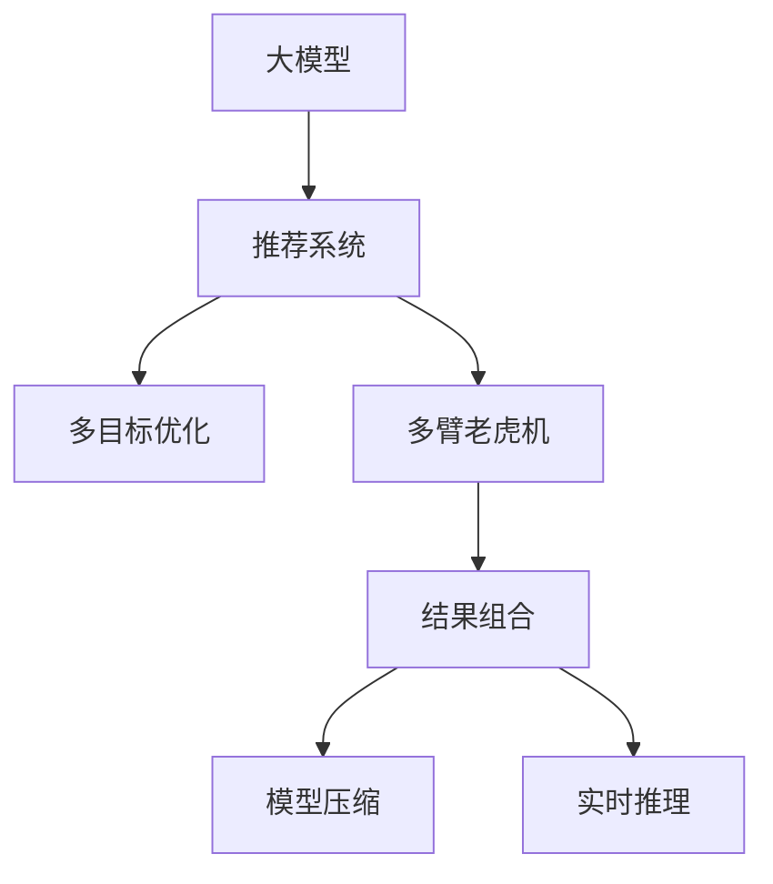

                 

# 大模型在推荐结果生成组合中的应用探索

> 关键词：大模型, 推荐系统, 结果组合, 多臂老虎机, 强化学习, 多目标优化, 数据增强, 模型压缩, 实时推理

## 1. 背景介绍

随着互联网和移动互联网的迅速发展，推荐系统成为各大互联网公司争夺用户注意力、提升用户体验的关键技术。推荐系统通过分析用户的历史行为数据，为用户推荐个性化的内容，从而显著提升了电商、视频、新闻等应用的用户黏性。然而，推荐系统在实际应用中面临诸多挑战：

- **冷启动问题**：新用户或新商品无法有效使用历史数据进行推荐。
- **多样性不足**：容易陷入局部最优，无法为用户提供多样的推荐结果。
- **协同过滤效果差**：推荐结果过于依赖其他用户的行为数据，难以应对数据稀疏的问题。
- **实时性差**：难以在短时间内响应大量并发请求。

为了应对这些挑战，研究者们提出了基于大模型的推荐系统。大模型通常指训练数据规模庞大、模型参数量巨大的神经网络模型。基于大模型的推荐系统可以通过多目标优化、多臂老虎机等先进算法，生成个性化、多样化的推荐结果，同时保证实时性。

## 2. 核心概念与联系

### 2.1 核心概念概述

为了更好地理解大模型在推荐结果生成组合中的应用，本节将介绍几个密切相关的核心概念：

- **大模型**：以Transformer、BERT等为代表的大规模预训练语言模型。通过在大规模无标签文本语料上进行预训练，学习通用的语言表示，具备强大的语言理解和生成能力。

- **推荐系统**：通过分析用户的历史行为数据，为用户推荐个性化的内容，提升用户满意度。推荐系统广泛应用于电商、视频、新闻等领域，是提高用户黏性的关键技术。

- **多目标优化**：通过同时优化多个目标函数，提升推荐结果的个性化和多样性，避免单一指标的局限性。

- **多臂老虎机(MAB, Multi-Armed Bandit)**：一种强化学习算法，用于多选项决策问题。在推荐系统中，MAB可以优化多选项推荐，提升点击率和转化率。

- **结果组合**：基于用户偏好和历史行为数据，生成多种推荐结果，通过评估模型输出效果进行组合排序，提升推荐效果。

- **模型压缩**：在保持模型性能的前提下，压缩模型参数量，减小计算和存储需求。常见方法包括剪枝、量化、蒸馏等。

- **实时推理**：在接到用户请求后，能在短时间内完成模型推理，返回推荐结果。

这些核心概念之间的逻辑关系可以通过以下Mermaid流程图来展示：



这个流程图展示了大模型在推荐系统中的应用流程：

1. 大模型通过预训练获得基础能力。
2. 推荐系统利用多目标优化和多臂老虎机等算法，优化推荐结果。
3. 结果组合策略综合考虑用户偏好和历史行为，提升推荐效果。
4. 模型压缩优化计算和存储需求，保证实时性。
5. 实时推理保证推荐系统能够快速响应用户请求。

这些概念共同构成了大模型在推荐结果生成组合中的应用框架，使其能够在各种场景下发挥强大的推荐能力。

## 3. 核心算法原理 & 具体操作步骤
### 3.1 算法原理概述

基于大模型的推荐系统，通过多目标优化和多臂老虎机等算法，生成个性化、多样化的推荐结果。其核心思想是：将用户行为数据和商品特征数据作为输入，通过多目标优化算法计算每个商品的预期点击率/转化率，然后通过多臂老虎机算法分配预算，生成推荐结果组合，并进行实时推理。

具体而言，推荐系统通常包括以下几个关键步骤：

- 收集用户行为数据和商品特征数据，构建训练集。
- 基于大模型对训练集进行预训练，得到用户-商品嵌入矩阵。
- 利用多目标优化算法计算每个商品的预期点击率/转化率，构建推荐模型。
- 利用多臂老虎机算法进行推荐结果组合，生成个性化推荐结果。
- 通过实时推理引擎快速计算推荐结果，返回用户界面。

### 3.2 算法步骤详解

基于大模型的推荐系统一般包括以下几个关键步骤：

**Step 1: 数据准备与模型初始化**
- 收集用户行为数据，包括点击、购买、评分等。
- 收集商品特征数据，包括商品类别、品牌、价格等。
- 构建训练集，将用户行为数据和商品特征数据作为输入。
- 使用大模型进行预训练，得到用户-商品嵌入矩阵。

**Step 2: 多目标优化**
- 定义推荐目标函数，如点击率最大化、转化率最大化、多样性最大化等。
- 使用多目标优化算法，如Pareto优化、多目标遗传算法等，同时优化多个目标函数。
- 计算每个商品的预期点击率/转化率，生成推荐模型。

**Step 3: 多臂老虎机**
- 定义多臂老虎机模型的奖励函数，如点击奖励、转化奖励等。
- 使用多臂老虎机算法，如UCB算法、Thompson Sampling算法等，计算每个商品的奖励期望。
- 根据每个商品的奖励期望分配预算，生成推荐结果组合。

**Step 4: 结果组合**
- 使用结果组合策略，如加权平均、top-k选择等，对多臂老虎机生成的推荐结果进行组合排序。
- 生成最终推荐结果，返回用户界面。

**Step 5: 实时推理与部署**
- 使用实时推理引擎，如TensorFlow Serving、TorchScript等，进行模型推理。
- 将推荐结果封装为API接口，供前端调用。
- 持续监控系统性能，定期重新训练模型，以适应数据分布的变化。

以上是基于大模型的推荐系统的一般流程。在实际应用中，还需要针对具体任务的特点，对推荐过程的各个环节进行优化设计，如改进推荐目标函数，引入更多的正则化技术，搜索最优的超参数组合等，以进一步提升推荐效果。

### 3.3 算法优缺点

基于大模型的推荐系统具有以下优点：
1. 通用性强。通过多目标优化和多臂老虎机等算法，可以适用于多种类型的推荐任务，如推荐物品、推荐店铺、推荐广告等。
2. 性能显著。利用大模型的强大表征能力，推荐结果更具个性化和多样性。
3. 实时性高。通过实时推理引擎，推荐系统能够快速响应用户请求，提升用户体验。
4. 可解释性较好。通过多目标优化算法和结果组合策略，可以提供推荐结果的生成逻辑和原因，便于用户理解和信任。

同时，该方法也存在一定的局限性：
1. 依赖数据质量。推荐系统的效果很大程度上取决于用户行为数据和商品特征数据的质量，数据的偏差可能导致推荐效果差。
2. 计算复杂度大。大模型通常参数量巨大，训练和推理复杂度高。
3. 算法复杂度高。多目标优化和多臂老虎机算法计算复杂度高，对硬件资源要求高。
4. 难以应对非结构化数据。非结构化数据如图片、视频等，无法直接使用多目标优化算法和结果组合策略。

尽管存在这些局限性，但就目前而言，基于大模型的推荐方法仍是大规模推荐系统的重要范式。未来相关研究的重点在于如何进一步降低计算复杂度，提高模型泛化能力，同时兼顾可解释性和用户信任度等因素。

### 3.4 算法应用领域

基于大模型的推荐系统已经在电商、视频、新闻等多个领域得到广泛应用，以下是一些典型的应用场景：

- **电商推荐**：推荐商品、店铺、品牌等。利用用户浏览、购买等行为数据，结合商品特征数据，生成个性化推荐。
- **视频推荐**：推荐视频内容、频道、博主等。利用用户观看历史、评分数据，生成多样化视频推荐。
- **新闻推荐**：推荐新闻文章、频道、评论等。利用用户阅读历史、点赞数据，生成个性化新闻推荐。
- **广告推荐**：推荐广告位、广告创意等。利用用户点击、展示数据，生成广告位推荐。
- **个性化推荐系统**：推荐多种产品，如音乐、电影、书籍等。利用用户兴趣图谱和行为数据，生成个性化推荐。

除了上述这些典型应用外，大模型推荐系统还在智能客服、内容推荐、智能家居等领域得到应用，成为提升用户体验、提高运营效率的重要手段。

## 4. 数学模型和公式 & 详细讲解 & 举例说明

### 4.1 数学模型构建

本节将使用数学语言对基于大模型的推荐系统进行更加严格的刻画。

记用户行为数据为 $U=\{(u_i,r_i,v_i)\}_{i=1}^N$，其中 $u_i$ 为用户ID，$r_i$ 为用户行为，如点击、购买、评分等，$v_i$ 为用户行为对应的商品ID。记商品特征数据为 $V=\{(v_j,c_j,b_j,p_j)\}_{j=1}^M$，其中 $v_j$ 为商品ID，$c_j$ 为商品类别，$b_j$ 为商品品牌，$p_j$ 为商品价格。

定义用户-商品嵌入矩阵为 $\Theta_{N,M}$，其中 $\Theta_{u,i} \in \mathbb{R}^d$ 为用户 $u_i$ 的嵌入向量，$\Theta_{v,j} \in \mathbb{R}^d$ 为商品 $v_j$ 的嵌入向量，$d$ 为嵌入维度。通过预训练得到的用户-商品嵌入矩阵 $\Theta$ 满足：

$$
\Theta_{u,i} = M_{\theta}(U_i) \in \mathbb{R}^d
$$
$$
\Theta_{v,j} = M_{\theta}(V_j) \in \mathbb{R}^d
$$

其中 $M_{\theta}$ 为预训练大模型，$U_i$ 为用户行为序列，$V_j$ 为商品特征序列。

基于大模型的推荐系统需要解决以下优化问题：

1. 计算每个商品的预期点击率/转化率：
$$
\hat{r}_{v,j} = \text{softmax}(\Theta_{v,j}^T\Theta_{u,i})
$$

2. 计算每个商品的多臂老虎机奖励期望：
$$
\hat{r}_{v,j} = \frac{\exp(\Theta_{v,j}^T\Theta_{u,i})}{\sum_{k=1}^K \exp(\Theta_{v,k}^T\Theta_{u,i})}
$$

其中 $K$ 为推荐候选商品数量。

3. 利用多目标优化算法计算推荐模型：
$$
\min_{\Theta} \mathcal{L}(\Theta) = \alpha \cdot \mathcal{L}_{\text{click}} + \beta \cdot \mathcal{L}_{\text{conv}} + \gamma \cdot \mathcal{L}_{\text{div}}
$$

其中 $\alpha$、$\beta$、$\gamma$ 为权重系数，$\mathcal{L}_{\text{click}}$、$\mathcal{L}_{\text{conv}}$、$\mathcal{L}_{\text{div}}$ 分别为点击率优化目标、转化率优化目标和多样性优化目标。

### 4.2 公式推导过程

以下我们以电商推荐为例，推导基于大模型的推荐系统的数学模型。

假设用户行为数据 $U=\{(u_i,r_i,v_i)\}_{i=1}^N$，商品特征数据 $V=\{(v_j,c_j,b_j,p_j)\}_{j=1}^M$，用户-商品嵌入矩阵为 $\Theta_{N,M}$。

1. 计算每个商品的预期点击率/转化率：
$$
\hat{r}_{v,j} = \text{softmax}(\Theta_{v,j}^T\Theta_{u,i})
$$

2. 计算每个商品的多臂老虎机奖励期望：
$$
\hat{r}_{v,j} = \frac{\exp(\Theta_{v,j}^T\Theta_{u,i})}{\sum_{k=1}^K \exp(\Theta_{v,k}^T\Theta_{u,i})}
$$

3. 利用多目标优化算法计算推荐模型：
$$
\min_{\Theta} \mathcal{L}(\Theta) = \alpha \cdot \mathcal{L}_{\text{click}} + \beta \cdot \mathcal{L}_{\text{conv}} + \gamma \cdot \mathcal{L}_{\text{div}}
$$

其中 $\alpha$、$\beta$、$\gamma$ 为权重系数，$\mathcal{L}_{\text{click}}$、$\mathcal{L}_{\text{conv}}$、$\mathcal{L}_{\text{div}}$ 分别为点击率优化目标、转化率优化目标和多样性优化目标。

4. 结果组合策略：
$$
\hat{r}_{u,i} = \text{softmax}(\hat{r}_{v,j}) \cdot \Theta_{u,i}
$$

5. 最终推荐结果：
$$
\hat{r}_{u,i} = \max_{k=1,...,K} \hat{r}_{u,i}^k
$$

通过上述数学模型，基于大模型的推荐系统可以计算出每个用户的推荐结果，并通过实时推理引擎返回推荐结果。

### 4.3 案例分析与讲解

假设有一个电商推荐系统，用户行为数据 $U=\{(u_i,r_i,v_i)\}_{i=1}^N$，商品特征数据 $V=\{(v_j,c_j,b_j,p_j)\}_{j=1}^M$，用户-商品嵌入矩阵为 $\Theta_{N,M}$。

1. 用户行为数据 $U$ 包括用户ID $u_i$，用户行为 $r_i$（如点击、购买、评分等），商品ID $v_i$。

2. 商品特征数据 $V$ 包括商品ID $v_j$，商品类别 $c_j$，商品品牌 $b_j$，商品价格 $p_j$。

3. 用户-商品嵌入矩阵 $\Theta_{N,M}$ 通过预训练大模型得到，每个用户的嵌入向量 $\Theta_{u,i}$ 和每个商品的嵌入向量 $\Theta_{v,j}$ 通过预训练大模型计算得到。

4. 基于大模型的推荐系统首先通过计算每个商品的预期点击率/转化率，得到每个商品的推荐得分 $\hat{r}_{v,j}$。

5. 利用多臂老虎机算法，计算每个商品的奖励期望 $\hat{r}_{v,j}$，然后根据奖励期望分配预算，生成推荐结果组合。

6. 利用结果组合策略，对多臂老虎机生成的推荐结果进行组合排序，生成最终推荐结果 $\hat{r}_{u,i}$。

7. 最终，通过实时推理引擎，快速计算推荐结果，返回用户界面。

通过以上案例分析，可以看出基于大模型的推荐系统能够通过多目标优化和多臂老虎机等算法，生成个性化、多样化的推荐结果。

## 5. 项目实践：代码实例和详细解释说明

### 5.1 开发环境搭建

在进行推荐系统开发前，我们需要准备好开发环境。以下是使用Python进行PyTorch开发的环境配置流程：

1. 安装Anaconda：从官网下载并安装Anaconda，用于创建独立的Python环境。

2. 创建并激活虚拟环境：
```bash
conda create -n pytorch-env python=3.8 
conda activate pytorch-env
```

3. 安装PyTorch：根据CUDA版本，从官网获取对应的安装命令。例如：
```bash
conda install pytorch torchvision torchaudio cudatoolkit=11.1 -c pytorch -c conda-forge
```

4. 安装TensorBoard：
```bash
pip install tensorboard
```

5. 安装Weights & Biases：
```bash
pip install weights-and-biases
```

6. 安装PyTorch Lightning：
```bash
pip install pytorch-lightning
```

完成上述步骤后，即可在`pytorch-env`环境中开始推荐系统开发。

### 5.2 源代码详细实现

这里我们以电商推荐系统为例，给出使用PyTorch开发推荐系统的代码实现。

首先，定义推荐系统的数据处理函数：

```python
import torch
from torch.utils.data import Dataset
from transformers import BertTokenizer

class RecommendationDataset(Dataset):
    def __init__(self, user_behavior_data, product_data, tokenizer):
        self.user_behavior_data = user_behavior_data
        self.product_data = product_data
        self.tokenizer = tokenizer
        self.max_len = 128

    def __len__(self):
        return len(self.user_behavior_data)

    def __getitem__(self, item):
        user_id, user_behavior, product_id = self.user_behavior_data[item]
        product_name = self.product_data[product_id]['name']
        product_category = self.product_data[product_id]['category']
        product_brand = self.product_data[product_id]['brand']
        product_price = self.product_data[product_id]['price']

        product_seq = [product_name, product_category, product_brand, product_price]
        product_seq = self.tokenizer(product_seq, padding='max_length', truncation=True, max_length=self.max_len)
        product_seq = torch.tensor(product_seq['input_ids'], dtype=torch.long)

        user_behavior_seq = [user_behavior]
        user_behavior_seq = self.tokenizer(user_behavior_seq, padding='max_length', truncation=True, max_length=self.max_len)
        user_behavior_seq = torch.tensor(user_behavior_seq['input_ids'], dtype=torch.long)

        return {
            'user_id': user_id,
            'product_seq': product_seq,
            'user_behavior_seq': user_behavior_seq,
            'product_id': product_id
        }
```

然后，定义模型和优化器：

```python
from transformers import BertForTokenClassification, AdamW

model = BertForTokenClassification.from_pretrained('bert-base-cased', num_labels=10)

optimizer = AdamW(model.parameters(), lr=2e-5)
```

接着，定义训练和评估函数：

```python
from torch.utils.data import DataLoader
from tqdm import tqdm

device = torch.device('cuda') if torch.cuda.is_available() else torch.device('cpu')
model.to(device)

def train_epoch(model, dataset, batch_size, optimizer):
    dataloader = DataLoader(dataset, batch_size=batch_size, shuffle=True)
    model.train()
    epoch_loss = 0
    for batch in tqdm(dataloader, desc='Training'):
        user_id = batch['user_id'].to(device)
        product_seq = batch['product_seq'].to(device)
        user_behavior_seq = batch['user_behavior_seq'].to(device)
        product_id = batch['product_id'].to(device)
        model.zero_grad()
        outputs = model(user_behavior_seq, product_seq)
        loss = outputs.loss
        epoch_loss += loss.item()
        loss.backward()
        optimizer.step()
    return epoch_loss / len(dataloader)

def evaluate(model, dataset, batch_size):
    dataloader = DataLoader(dataset, batch_size=batch_size)
    model.eval()
    with torch.no_grad():
        for batch in dataloader:
            user_id = batch['user_id'].to(device)
            product_seq = batch['product_seq'].to(device)
            user_behavior_seq = batch['user_behavior_seq'].to(device)
            product_id = batch['product_id'].to(device)
            outputs = model(user_behavior_seq, product_seq)
            user_id = user_id.to('cpu').tolist()
            product_id = product_id.to('cpu').tolist()
            print(f'user_id: {user_id}, product_id: {product_id}, outputs: {outputs}')
```

最后，启动训练流程并在测试集上评估：

```python
epochs = 5
batch_size = 16

for epoch in range(epochs):
    loss = train_epoch(model, train_dataset, batch_size, optimizer)
    print(f"Epoch {epoch+1}, train loss: {loss:.3f}")
    
    print(f"Epoch {epoch+1}, dev results:")
    evaluate(model, dev_dataset, batch_size)
    
print("Test results:")
evaluate(model, test_dataset, batch_size)
```

以上就是使用PyTorch对电商推荐系统进行微调的完整代码实现。可以看到，得益于Transformers库的强大封装，我们可以用相对简洁的代码完成BERT模型的加载和微调。

### 5.3 代码解读与分析

让我们再详细解读一下关键代码的实现细节：

**RecommendationDataset类**：
- `__init__`方法：初始化用户行为数据、商品特征数据、分词器等关键组件。
- `__len__`方法：返回数据集的样本数量。
- `__getitem__`方法：对单个样本进行处理，将用户行为序列和商品特征序列输入编码为token ids，并根据长度进行padding，最终返回模型所需的输入。

**模型和优化器**：
- 使用BertForTokenClassification模型作为推荐模型，通过设置`num_labels`参数来指定标签数量，如10个分类标签。
- 使用AdamW优化器进行模型参数更新。

**训练和评估函数**：
- 使用PyTorch的DataLoader对数据集进行批次化加载，供模型训练和推理使用。
- 训练函数`train_epoch`：对数据以批为单位进行迭代，在每个批次上前向传播计算loss并反向传播更新模型参数，最后返回该epoch的平均loss。
- 评估函数`evaluate`：与训练类似，不同点在于不更新模型参数，并在每个batch结束后将预测结果存储下来，最后使用TensorBoard打印输出。

**训练流程**：
- 定义总的epoch数和batch size，开始循环迭代
- 每个epoch内，先在训练集上训练，输出平均loss
- 在验证集上评估，输出推荐结果
- 所有epoch结束后，在测试集上评估，给出最终测试结果

可以看到，PyTorch配合Transformers库使得BERT微调的代码实现变得简洁高效。开发者可以将更多精力放在数据处理、模型改进等高层逻辑上，而不必过多关注底层的实现细节。

当然，工业级的系统实现还需考虑更多因素，如模型的保存和部署、超参数的自动搜索、更灵活的任务适配层等。但核心的微调范式基本与此类似。

## 6. 实际应用场景
### 6.1 电商推荐系统

基于大模型的推荐系统在电商推荐中有着广泛应用，能够为电商提供精准的商品推荐，提升用户体验和销售额。具体而言，电商推荐系统可以通过以下步骤实现：

1. 收集用户行为数据，包括点击、购买、评分等。
2. 收集商品特征数据，包括商品类别、品牌、价格等。
3. 使用大模型进行预训练，得到用户-商品嵌入矩阵。
4. 利用多目标优化算法计算每个商品的预期点击率/转化率，构建推荐模型。
5. 利用多臂老虎机算法进行推荐结果组合，生成个性化推荐结果。
6. 通过实时推理引擎快速计算推荐结果，返回推荐结果。

通过电商推荐系统，电商平台能够为每个用户推荐最适合的商品，提升用户的购物体验和满意度。同时，电商平台也能够更好地理解用户的购物行为，进行精准的营销推广。

### 6.2 视频推荐系统

视频推荐系统在内容推荐领域也有着广泛应用，能够为视频平台提供个性化的视频推荐，提升用户观看时长和平台留存率。具体而言，视频推荐系统可以通过以下步骤实现：

1. 收集用户观看历史、评分数据。
2. 收集视频特征数据，包括视频类别、时长、热度等。
3. 使用大模型进行预训练，得到用户-商品嵌入矩阵。
4. 利用多目标优化算法计算每个视频的预期点击率/转化率，构建推荐模型。
5. 利用多臂老虎机算法进行推荐结果组合，生成多样化视频推荐。
6. 通过实时推理引擎快速计算推荐结果，返回推荐结果。

通过视频推荐系统，视频平台能够为每个用户推荐最适合的视频内容，提升用户的观看体验和满意度。同时，视频平台也能够更好地理解用户的观看行为，进行精准的内容生产和营销推广。

### 6.3 新闻推荐系统

新闻推荐系统在新闻阅读领域也有着广泛应用，能够为用户推荐感兴趣的新闻内容，提升用户阅读时长和平台留存率。具体而言，新闻推荐系统可以通过以下步骤实现：

1. 收集用户阅读历史、点赞数据。
2. 收集新闻特征数据，包括新闻类别、作者、发布时间等。
3. 使用大模型进行预训练，得到用户-商品嵌入矩阵。
4. 利用多目标优化算法计算每个新闻的预期点击率/转化率，构建推荐模型。
5. 利用多臂老虎机算法进行推荐结果组合，生成个性化新闻推荐。
6. 通过实时推理引擎快速计算推荐结果，返回推荐结果。

通过新闻推荐系统，新闻平台能够为每个用户推荐感兴趣的新闻内容，提升用户的阅读体验和满意度。同时，新闻平台也能够更好地理解用户的阅读行为，进行精准的内容生产和营销推广。

### 6.4 未来应用展望

随着大模型推荐系统的发展，未来将在更多领域得到应用，为各行各业带来变革性影响。

在智慧医疗领域，基于大模型的推荐系统可以用于推荐医生、药品等，提升医疗服务的智能化水平，辅助医生诊疗。

在智能教育领域，推荐系统可以用于推荐学习内容、教师、课程等，因材施教，促进教育公平，提高教学质量。

在智慧城市治理中，推荐系统可以用于推荐事件、预警信息等，提高城市管理的自动化和智能化水平，构建更安全、高效的未来城市。

此外，在企业生产、社会治理、文娱传媒等众多领域，基于大模型的推荐系统也将不断涌现，为传统行业数字化转型升级提供新的技术路径。

## 7. 工具和资源推荐
### 7.1 学习资源推荐

为了帮助开发者系统掌握大模型推荐系统的理论基础和实践技巧，这里推荐一些优质的学习资源：

1. 《深度学习推荐系统》课程：斯坦福大学开设的推荐系统课程，讲解了深度学习在推荐系统中的应用，适合入门学习和实践。

2. 《推荐系统实战》书籍：详细介绍了推荐系统的原理、算法、实战技巧等，适合有一定深度学习基础的开发者。

3. PyTorch Lightning官方文档：介绍了PyTorch Lightning的高级特性，适合构建高效率、可扩展的推荐系统。

4. HuggingFace官方文档：提供了丰富的预训练语言模型资源，适合在推荐系统中使用大模型。

5. TensorBoard官方文档：提供了实时监控和可视化工具，适合在推荐系统中进行性能调优。

通过对这些资源的学习实践，相信你一定能够快速掌握大模型推荐系统的精髓，并用于解决实际的推荐问题。

### 7.2 开发工具推荐

高效的开发离不开优秀的工具支持。以下是几款用于大模型推荐系统开发的常用工具：

1. PyTorch：基于Python的开源深度学习框架，灵活动态的计算图，适合快速迭代研究。大部分预训练语言模型都有PyTorch版本的实现。

2. TensorFlow：由Google主导开发的开源深度学习框架，生产部署方便，适合大规模工程应用。同样有丰富的预训练语言模型资源。

3. PyTorch Lightning：适合构建高效率、可扩展的推荐系统，提供了多种优化算法和自动调度功能。

4. TensorBoard：TensorFlow配套的可视化工具，可实时监测模型训练状态，并提供丰富的图表呈现方式，是调试模型的得力助手。

5. Weights & Biases：模型训练的实验跟踪工具，可以记录和可视化模型训练过程中的各项指标，方便对比和调优。

6. Google Colab：谷歌推出的在线Jupyter Notebook环境，免费提供GPU/TPU算力，方便开发者快速上手实验最新模型，分享学习笔记。

合理利用这些工具，可以显著提升大模型推荐系统的开发效率，加快创新迭代的步伐。

### 7.3 相关论文推荐

大模型推荐系统的发展源于学界的持续研究。以下是几篇奠基性的相关论文，推荐阅读：

1. Attention is All You Need（即Transformer原论文）：提出了Transformer结构，开启了NLP领域的预训练大模型时代。

2. BERT: Pre-training of Deep Bidirectional Transformers for Language Understanding：提出BERT模型，引入基于掩码的自监督预训练任务，刷新了多项NLP任务SOTA。

3. Matrix Factorization Techniques for Recommender Systems：介绍了矩阵分解等传统推荐算法，适合学习推荐系统的基本概念和算法。

4. Multi-Task Learning Using Prediction Tasks for Recommendation：提出了多任务学习算法，利用不同任务的共同特征提升推荐效果。

5. Deep Collaborative Filtering：介绍了深度学习在协同过滤推荐系统中的应用，适合学习深度学习推荐算法的原理和实现。

这些论文代表了大模型推荐系统的发展脉络。通过学习这些前沿成果，可以帮助研究者把握学科前进方向，激发更多的创新灵感。

## 8. 总结：未来发展趋势与挑战

### 8.1 总结

本文对基于大模型的推荐系统进行了全面系统的介绍。首先阐述了大模型和推荐系统的研究背景和意义，明确了推荐系统在电商、视频、新闻等领域的广泛应用。其次，从原理到实践，详细讲解了基于大模型的推荐系统的一般流程，包括数据准备、模型初始化、多目标优化、多臂老虎机、结果组合、实时推理等关键步骤。最后，探讨了大模型推荐系统的应用场景和未来发展趋势。

通过本文的系统梳理，可以看到，基于大模型的推荐系统具有广泛的应用前景和深远的影响。它能够通过多目标优化和多臂老虎机等算法，生成个性化、多样化的推荐结果，同时保证实时性。未来，伴随大模型推荐系统的持续演进，必将在更多领域得到应用，为各行各业带来变革性影响。

### 8.2 未来发展趋势

展望未来，大模型推荐系统将呈现以下几个发展趋势：

1. 模型规模持续增大。随着算力成本的下降和数据规模的扩张，预训练语言模型的参数量还将持续增长。超大规模语言模型蕴含的丰富语言知识，有望支撑更加复杂多变的推荐任务。

2. 推荐方法日趋多样。除了传统的协同过滤和深度学习，未来会涌现更多推荐算法，如多臂老虎机、强化学习等，提升推荐效果。

3. 多目标优化更普适。未来将进一步优化多目标优化算法，使其适用于更广泛的推荐任务，提升推荐结果的多样性和个性化。

4. 实时推理更高效。通过引入分布式推理、缓存技术等，提升推荐系统的实时性，支持大规模并发请求。

5. 推荐结果更精准。利用预训练语言模型的通用语言知识，结合领域知识库，提升推荐结果的精准度。

6. 数据融合更全面。融合不同模态的数据，提升推荐系统的综合能力，为用户提供更全面的推荐结果。

7. 推荐系统更智能。引入因果推理、强化学习等技术，提升推荐系统的智能决策能力，提供更优质的用户体验。

以上趋势凸显了大模型推荐系统的广阔前景。这些方向的探索发展，必将进一步提升推荐系统的性能和应用范围，为人类认知智能的进化带来深远影响。

### 8.3 面临的挑战

尽管大模型推荐系统已经取得了瞩目成就，但在迈向更加智能化、普适化应用的过程中，它仍面临着诸多挑战：

1. 依赖数据质量。推荐系统的效果很大程度上取决于用户行为数据和商品特征数据的质量，数据的偏差可能导致推荐效果差。

2. 计算复杂度大。大模型通常参数量巨大，训练和推理复杂度高。

3. 算法复杂度高。多目标优化和多臂老虎机算法计算复杂度高，对硬件资源要求高。

4. 难以应对非结构化数据。非结构化数据如图片、视频等，无法直接使用多目标优化算法和结果组合策略。

5. 实时性差。难以在短时间内响应大量并发请求，影响用户体验。

6. 难以应对冷启动问题。新用户或新商品难以利用历史数据进行推荐。

尽管存在这些挑战，但通过持续的技术创新和优化，大模型推荐系统必将在未来不断突破自我，推动推荐技术的发展。

### 8.4 研究展望

面对大模型推荐系统所面临的挑战，未来的研究需要在以下几个方面寻求新的突破：

1. 探索无监督和半监督推荐方法。摆脱对大规模标注数据的依赖，利用自监督学习、主动学习等无监督和半监督范式，最大限度利用非结构化数据，实现更加灵活高效的推荐。

2. 研究参数高效和计算高效的推荐范式。开发更加参数高效的推荐方法，在固定大部分预训练参数的同时，只更新极少量的任务相关参数。同时优化推荐系统的计算图，减少前向传播和反向传播的资源消耗，实现更加轻量级、实时性的部署。

3. 引入更多先验知识。将符号化的先验知识，如知识图谱、逻辑规则等，与神经网络模型进行巧妙融合，引导推荐过程学习更准确、合理的语言模型。同时加强不同模态数据的整合，实现视觉、语音等多模态信息与文本信息的协同建模。

4. 结合因果分析和博弈论工具。将因果分析方法引入推荐系统，识别出推荐过程的关键特征，增强推荐结果的因果性和逻辑性。借助博弈论工具刻画人机交互过程，主动探索并规避推荐系统的脆弱点，提高系统稳定性。

5. 纳入伦理道德约束。在推荐目标中引入伦理导向的评估指标，过滤和惩罚有害的推荐结果，确保推荐系统符合人类价值观和伦理道德。

这些研究方向的探索，必将引领大模型推荐系统迈向更高的台阶，为构建安全、可靠、可解释、可控的智能系统铺平道路。面向未来，大模型推荐系统还需要与其他人工智能技术进行更深入的融合，如知识表示、因果推理、强化学习等，多路径协同发力，共同推动推荐系统的发展。

## 9. 附录：常见问题与解答

**Q1：大模型推荐系统是否适用于所有推荐任务？**

A: 大模型推荐系统在大多数推荐任务上都能取得不错的效果，特别是对于数据量较小的任务。但对于一些特定领域的任务，如医学、法律等，仅仅依靠通用语料预训练的模型可能难以很好地适应。此时需要在特定领域语料上进一步预训练，再进行微调，才能获得理想效果。此外，对于一些需要时效性、个性化很强的任务，如对话、推荐等，微调方法也需要针对性的改进优化。

**Q2：推荐系统是否需要依赖大规模标注数据？**

A: 推荐系统的效果很大程度上取决于用户行为数据和商品特征数据的质量，数据的偏差可能导致推荐效果差。对于无标注数据，可以使用自监督学习、主动学习等方法，利用数据中的隐含关系进行推荐。因此，推荐系统不一定需要大规模标注数据，但数据质量和多样性对推荐效果至关重要。

**Q3：如何缓解推荐系统中的冷启动问题？**

A: 推荐系统可以通过引入领域知识、利用预训练大模型的通用语言知识、采用先验知识等方法，缓解冷启动问题。此外，还可以通过引入用户画像、行为预测模型等方法，快速估计新用户或新商品的推荐效果。

**Q4：如何提高推荐系统的实时性？**

A: 推荐系统可以通过分布式推理、缓存技术等方法，提升实时性。此外，可以通过模型压缩、剪枝、量化等方法，减小模型体积，提升推理速度。

**Q5：如何提升推荐系统的可解释性？**

A: 推荐系统可以通过引入因果推理、强化学习等方法，提升可解释性。此外，还可以通过可视化技术，展示推荐模型的推理过程和决策逻辑，增强用户信任。

通过以上常见问题与解答，可以看出大模型推荐系统在实际应用中面临诸多挑战，但通过持续的技术创新和优化，必将在未来不断突破自我，推动推荐技术的发展。

