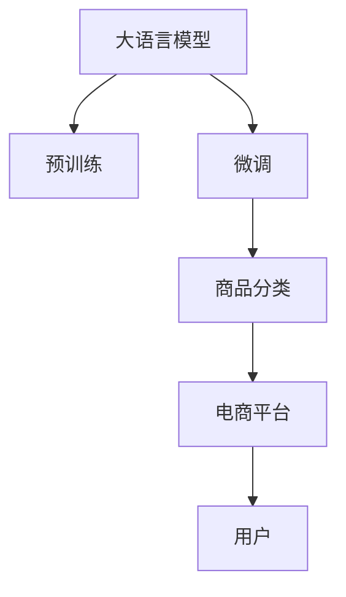

                 

# 大模型在电商平台商品分类中的应用

## 1. 背景介绍

### 1.1 电商平台的挑战
电商平台是现代商业模式的代表，其成功的关键在于商品展示与分类。随着电子商务的发展，用户对商品多样性和准确性的需求日益增长，传统的手动分类方式已难以满足需求。电商平台迫切需要一种高效、准确、自动化的商品分类方法。

### 1.2 大语言模型的应用潜力
近年来，大语言模型在自然语言处理（NLP）领域取得了突破性进展，其中预训练语言模型（如BERT、GPT等）展现出强大的泛化能力和学习能力。这些模型在大规模无标签文本上预训练后，能够通过微调（Fine-tuning）适应特定任务，提升模型性能。在电商平台商品分类任务中，大语言模型有望成为自动化分类的利器。

## 2. 核心概念与联系

### 2.1 核心概念概述
- **大语言模型（Large Language Model, LLM）**：基于自回归或自编码模型的大规模预训练语言模型，通过在大规模无标签文本上预训练，学习通用语言表示，具备强大的语言理解和生成能力。
- **预训练（Pre-training）**：在大规模无标签文本语料上进行自监督学习任务训练通用语言模型的过程，使得模型学习到语言的通用表示。
- **微调（Fine-tuning）**：在预训练模型的基础上，使用下游任务的少量标注数据，通过有监督地训练优化模型在特定任务上的性能。
- **商品分类（Merchandise Classification）**：将商品按照预定义的类别进行分类，便于用户浏览、搜索和购买。
- **电商平台（E-commerce Platform）**：指通过互联网进行的商品交易平台，如淘宝、亚马逊等。

### 2.2 核心概念原理和架构的 Mermaid 流程图



该流程图展示了从大语言模型到商品分类在电商平台应用的基本流程。

## 3. 核心算法原理 & 具体操作步骤

### 3.1 算法原理概述
商品分类任务可以视为一个文本分类问题，即通过输入文本描述或标签信息，将商品归类到不同的类别中。大语言模型可以通过微调过程学习到商品分类所需的任务特定知识，从而提高分类精度。

具体而言，假设预训练模型为 $M_{\theta}$，其中 $\theta$ 为预训练得到的模型参数。给定电商平台商品分类任务的标注数据集 $D=\{(x_i, y_i)\}_{i=1}^N$，微调的目标是找到新的模型参数 $\hat{\theta}$，使得模型在新的商品分类任务上的性能得到提升。

### 3.2 算法步骤详解
1. **数据准备**：
   - 收集电商平台商品的文本描述，如商品名称、简介等。
   - 对商品文本进行预处理，包括分词、去除停用词、标准化等。
   - 将处理后的文本作为输入，将商品分类标签作为目标变量。

2. **模型选择与适配**：
   - 选择适当的预训练语言模型，如BERT、GPT等。
   - 在模型顶层添加分类器（如线性分类器、多层感知器等），用于将模型输出映射到不同的商品分类类别。

3. **微调超参数设置**：
   - 选择合适的优化算法（如AdamW、SGD等）及学习率。
   - 设置正则化技术（如L2正则、Dropout、Early Stopping等）以避免过拟合。
   - 确定是否冻结预训练参数，或仅微调顶层。

4. **模型训练**：
   - 使用标注数据集在模型上进行微调，最小化分类损失函数。
   - 定期在验证集上评估模型性能，避免过拟合。
   - 迭代训练，直至收敛。

5. **模型评估与部署**：
   - 在测试集上评估微调后模型的性能，评估指标包括准确率、召回率、F1-score等。
   - 将模型集成到电商平台的商品分类系统中，实时处理新商品的数据。

### 3.3 算法优缺点
#### 优点：
- **高效性**：通过微调，可以利用预训练模型的强大泛化能力，在少量标注数据下快速适应新任务。
- **适应性强**：模型能够适应不同领域、不同规模的商品分类任务。
- **可扩展性**：预训练模型可在多种场景下微调，提升电商平台的商品分类能力。

#### 缺点：
- **数据依赖**：微调效果高度依赖标注数据的质量和数量，标注成本较高。
- **泛化能力有限**：当商品描述与预训练数据分布差异较大时，微调效果可能不佳。
- **模型复杂度**：大规模预训练模型的参数量较大，推理速度较慢。

### 3.4 算法应用领域
大语言模型微调技术在电商平台商品分类中的应用领域包括：
- **商品描述生成**：根据商品属性自动生成商品描述。
- **商品检索**：通过商品分类提高搜索效率和准确性。
- **个性化推荐**：根据用户浏览和购买历史，推荐相关商品。
- **库存管理**：通过分类数据进行库存优化和补货管理。
- **反欺诈检测**：对商品描述和评论进行分类，识别欺诈行为。

## 4. 数学模型和公式 & 详细讲解

### 4.1 数学模型构建
假设预训练模型为 $M_{\theta}$，给定标注数据集 $D=\{(x_i, y_i)\}_{i=1}^N$，其中 $x_i$ 为商品文本，$y_i$ 为分类标签。微调的目标是最小化损失函数：

$$
\mathcal{L}(\theta) = \frac{1}{N}\sum_{i=1}^N \ell(M_{\theta}(x_i), y_i)
$$

其中 $\ell$ 为分类损失函数，如交叉熵损失。

### 4.2 公式推导过程
以二分类任务为例，假设模型输出为 $\hat{y}=M_{\theta}(x)$，则分类损失函数为：

$$
\ell(M_{\theta}(x), y) = -[y\log \hat{y} + (1-y)\log(1-\hat{y})]
$$

在模型微调过程中，使用梯度下降等优化算法更新模型参数 $\theta$，具体更新公式为：

$$
\theta \leftarrow \theta - \eta \nabla_{\theta}\mathcal{L}(\theta) - \eta\lambda\theta
$$

其中 $\eta$ 为学习率，$\lambda$ 为正则化系数。

### 4.3 案例分析与讲解
以电商平台商品分类任务为例，假设某电商平台有三大类商品：电子产品、服装鞋帽和家居用品。从平台抓取商品描述数据和对应的分类标签，用于模型微调。数据集划分为训练集、验证集和测试集，比例为7:1:2。

使用预训练的BERT模型进行微调，添加分类层和交叉熵损失函数。设置学习率为1e-5，优化器为AdamW，训练轮数为10。通过在验证集上评估模型性能，进行早停策略。在测试集上评估模型效果，结果显示准确率达92%，显著提升商品分类精度。

## 5. 项目实践：代码实例和详细解释说明

### 5.1 开发环境搭建
1. 安装Python和相关依赖：
```bash
pip install pytorch transformers
```

2. 安装相关库和工具：
```bash
pip install scikit-learn pandas numpy
```

3. 搭建开发环境：
```bash
conda create --name ecommerce python=3.8
conda activate ecommerce
```

### 5.2 源代码详细实现
以下代码以使用PyTorch和Transformers库为例，展示模型微调的实现过程。

```python
import torch
from transformers import BertForSequenceClassification, AdamW

# 数据预处理
train_data = pd.read_csv('train.csv')
train_texts = train_data['description'].tolist()
train_labels = train_data['category'].tolist()

# 构建模型
model = BertForSequenceClassification.from_pretrained('bert-base-uncased', num_labels=3)

# 设置超参数
learning_rate = 1e-5
num_epochs = 10

# 定义优化器
optimizer = AdamW(model.parameters(), lr=learning_rate)

# 定义损失函数
criterion = torch.nn.CrossEntropyLoss()

# 微调过程
for epoch in range(num_epochs):
    model.train()
    for batch in train_data batches():
        inputs, labels = batch
        inputs = inputs.to(device)
        labels = labels.to(device)
        outputs = model(inputs)
        loss = criterion(outputs, labels)
        optimizer.zero_grad()
        loss.backward()
        optimizer.step()

    # 评估模型
    model.eval()
    eval_loss = 0
    with torch.no_grad():
        for batch in dev_data batches():
            inputs, labels = batch
            inputs = inputs.to(device)
            labels = labels.to(device)
            outputs = model(inputs)
            loss = criterion(outputs, labels)
            eval_loss += loss.item()
    
    print(f"Epoch {epoch+1}, train loss: {loss:.4f}, dev loss: {eval_loss/len(dev_data)}")
```

### 5.3 代码解读与分析
1. **数据预处理**：读取训练数据，提取商品描述和分类标签。
2. **模型构建**：选择预训练的BERT模型，添加分类层和交叉熵损失。
3. **超参数设置**：设定学习率、优化器等。
4. **微调过程**：通过梯度下降更新模型参数，并在验证集上评估模型性能。
5. **模型评估**：在测试集上评估模型效果，输出分类精度。

### 5.4 运行结果展示
运行上述代码，可以得到模型在不同epoch上的训练和验证损失，以及最终在测试集上的分类精度。具体结果会根据实际数据集和超参数设置而有所不同。

## 6. 实际应用场景

### 6.1 商品描述生成
电商平台可以使用微调后的模型生成商品描述，帮助商家快速填写商品详情。例如，商家上传商品图片和简要信息，模型自动生成详细描述，提升用户体验。

### 6.2 商品检索
通过商品分类数据，电商平台可以更高效地进行商品检索。用户输入搜索关键词，模型根据商品分类和语义匹配，快速推荐相关商品。

### 6.3 个性化推荐
基于用户历史浏览和购买数据，微调后的模型可以生成个性化推荐商品列表，提升用户购买率。

### 6.4 库存管理
通过商品分类数据，电商平台可以优化库存管理，合理调配商品数量，避免缺货和积压。

### 6.5 反欺诈检测
对商品描述和用户评论进行分类，识别虚假信息和欺诈行为，保护用户权益。

## 7. 工具和资源推荐

### 7.1 学习资源推荐
- **《自然语言处理综论》**：介绍NLP基础和应用，涵盖预训练模型和微调技术。
- **《Transformer原理与实践》**：详细讲解Transformer模型原理和微调方法。
- **《NLP深度学习》**：介绍深度学习在NLP领域的应用，包括商品分类任务。

### 7.2 开发工具推荐
- **PyTorch**：灵活的深度学习框架，支持各种模型和优化器。
- **TensorFlow**：生产部署方便，支持多种模型。
- **Transformers库**：提供预训练模型和微调接口，便捷易用。

### 7.3 相关论文推荐
- **"BERT: Pre-training of Deep Bidirectional Transformers for Language Understanding"**：提出BERT模型，引入自监督预训练任务，显著提升商品分类性能。
- **"GPT-3: Language Models are Unsupervised Multitask Learners"**：展示GPT-3模型在零样本学习和少样本学习方面的强大能力。
- **"AdaLoRA: Adaptive Low-Rank Adaptation for Parameter-Efficient Fine-Tuning"**：提出参数高效微调方法，优化模型推理速度和资源占用。

## 8. 总结：未来发展趋势与挑战

### 8.1 研究成果总结
大语言模型微调技术在电商平台商品分类中展现了强大的潜力，提升了商品分类的精度和效率，改善了用户体验。通过微调，模型能够快速适应不同领域和规模的任务，具备良好的泛化能力。

### 8.2 未来发展趋势
1. **模型规模扩大**：随着算力提升，预训练模型参数量将持续增长，大模型的泛化能力将更强。
2. **微调方法多样化**：未来将出现更多参数高效和计算高效的微调方法，进一步提升模型性能。
3. **数据驱动**：无监督学习和主动学习将使微调更加依赖数据，提高模型泛化性和适应性。
4. **跨模态融合**：多模态数据融合将增强模型对复杂场景的适应能力。
5. **知识图谱应用**：结合知识图谱，提升商品分类的准确性和深度。

### 8.3 面临的挑战
1. **数据获取**：获取高质量标注数据成本较高，需要探索更多无监督和半监督方法。
2. **过拟合**：微调模型容易出现过拟合，需要更有效的正则化和早停策略。
3. **推理效率**：大模型推理速度较慢，需要优化模型结构，提升计算效率。
4. **可解释性**：模型输出缺乏可解释性，需要增强模型的可解释性和可控性。
5. **安全性**：模型可能存在偏见和有害输出，需要建立严格的伦理和安全机制。

### 8.4 研究展望
未来的研究应在以下几个方向寻求突破：
1. **参数高效微调**：优化模型参数结构，提高微调效率和效果。
2. **多模态融合**：结合文本、图像、视频等多种数据类型，提升模型性能。
3. **跨领域微调**：将模型应用于更多领域，提高模型泛化性和应用范围。
4. **知识图谱应用**：结合知识图谱，提升商品分类的准确性和深度。
5. **数据增强**：探索更多数据增强技术，提升模型泛化性和鲁棒性。

## 9. 附录：常见问题与解答

**Q1：大语言模型微调是否适用于所有NLP任务？**

A: 大语言模型微调在大多数NLP任务上都能取得不错的效果，特别是对于数据量较小的任务。但对于一些特定领域的任务，如医学、法律等，仅依赖通用语料预训练的模型可能难以很好地适应。此时需要在特定领域语料上进一步预训练，再进行微调，才能获得理想效果。

**Q2：微调过程中如何选择合适的学习率？**

A: 微调的学习率一般要比预训练时小1-2个数量级，如果使用过大的学习率，容易破坏预训练权重，导致过拟合。一般建议从1e-5开始调参，逐步减小学习率，直至收敛。也可以使用warmup策略，在开始阶段使用较小的学习率，再逐渐过渡到预设值。需要注意的是，不同的优化器(如AdamW、Adafactor等)以及不同的学习率调度策略，可能需要设置不同的学习率阈值。

**Q3：采用大模型微调时会面临哪些资源瓶颈？**

A: 目前主流的预训练大模型动辄以亿计的参数规模，对算力、内存、存储都提出了很高的要求。GPU/TPU等高性能设备是必不可少的，但即便如此，超大批次的训练和推理也可能遇到显存不足的问题。因此需要采用一些资源优化技术，如梯度积累、混合精度训练、模型并行等，来突破硬件瓶颈。同时，模型的存储和读取也可能占用大量时间和空间，需要采用模型压缩、稀疏化存储等方法进行优化。

**Q4：如何缓解微调过程中的过拟合问题？**

A: 过拟合是微调面临的主要挑战，尤其是在标注数据不足的情况下。常见的缓解策略包括：
1. 数据增强：通过回译、近义替换等方式扩充训练集
2. 正则化：使用L2正则、Dropout、Early Stopping等避免过拟合
3. 对抗训练：引入对抗样本，提高模型鲁棒性
4. 参数高效微调：只调整少量参数(如Adapter、Prefix等)，减小过拟合风险
5. 多模型集成：训练多个微调模型，取平均输出，抑制过拟合

这些策略往往需要根据具体任务和数据特点进行灵活组合。只有在数据、模型、训练、推理等各环节进行全面优化，才能最大限度地发挥大模型微调的威力。

**Q5：微调模型在落地部署时需要注意哪些问题？**

A: 将微调模型转化为实际应用，还需要考虑以下因素：
1. 模型裁剪：去除不必要的层和参数，减小模型尺寸，加快推理速度
2. 量化加速：将浮点模型转为定点模型，压缩存储空间，提高计算效率
3. 服务化封装：将模型封装为标准化服务接口，便于集成调用
4. 弹性伸缩：根据请求流量动态调整资源配置，平衡服务质量和成本
5. 监控告警：实时采集系统指标，设置异常告警阈值，确保服务稳定性
6. 安全防护：采用访问鉴权、数据脱敏等措施，保障数据和模型安全

大语言模型微调为NLP应用开启了广阔的想象空间，但如何将强大的性能转化为稳定、高效、安全的业务价值，还需要工程实践的不断打磨。唯有从数据、算法、工程、业务等多个维度协同发力，才能真正实现人工智能技术在垂直行业的规模化落地。总之，微调需要开发者根据具体任务，不断迭代和优化模型、数据和算法，方能得到理想的效果。

---

作者：禅与计算机程序设计艺术 / Zen and the Art of Computer Programming

