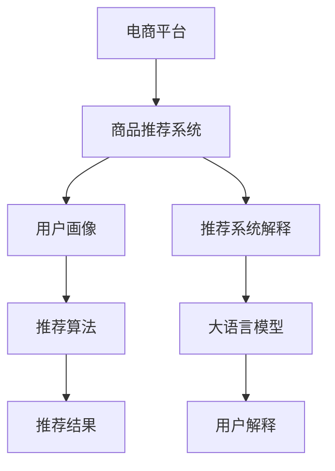

                 

# 大模型在电商平台商品推荐解释中的应用

> 关键词：电商平台, 商品推荐, 大模型, 解释性, 推荐系统, 用户画像, 解释性算法, 模型优化, 部署

## 1. 背景介绍

在当今数字化时代，电商平台已发展成为人们购物的重要渠道。通过智能化推荐系统，电商平台能够为用户提供个性化、精准的购物体验，提升用户满意度和消费转化率。然而，随着推荐算法复杂性的提升，用户开始越来越多地关注其背后的决策机制和理由，希望了解推荐系统的行为逻辑，增强信任感。

为此，大语言模型（Large Language Model, LLM）凭借其强大的文本处理能力，在推荐系统解释中逐渐崭露头角。通过自然语言生成技术，大语言模型能够将复杂的推荐逻辑转化为易于理解的用户解释，极大地提升了推荐的透明度和用户满意度。本文将从理论和实践两方面，详细介绍大语言模型在电商平台商品推荐解释中的应用。

## 2. 核心概念与联系

### 2.1 核心概念概述

- **电商平台**：指通过互联网提供商品和服务的在线平台，如淘宝、京东、亚马逊等。
- **商品推荐**：根据用户的历史行为和偏好，动态地为用户推荐商品，提升用户购买概率。
- **大语言模型**：指使用Transformer等架构，基于大规模无标签文本数据预训练的语言模型，如GPT、BERT等。
- **推荐系统解释**：指对推荐算法进行解释，让用户理解推荐结果背后的决策逻辑，增强用户信任感。
- **用户画像**：指通过用户的历史行为、属性和偏好等信息构建的用户特征描述，用于个性化推荐。
- **解释性算法**：指能够提供推荐系统决策过程解释的算法，如LIME、SHAP等。
- **模型优化**：指对推荐模型和解释模型进行调优，提升推荐效果和解释准确性。

这些概念相互联系，共同构成了电商平台推荐系统的核心框架。

### 2.2 核心概念原理和架构的 Mermaid 流程图



这个流程图展示了电商平台推荐系统的工作流程和核心组件：

1. **电商平台**：负责提供商品和用户交互的平台。
2. **商品推荐系统**：根据用户行为和偏好，动态推荐商品。
3. **用户画像**：构建用户特征描述，用于个性化推荐。
4. **推荐算法**：实现具体的推荐逻辑，如协同过滤、基于内容的推荐等。
5. **推荐结果**：基于推荐算法得到的用户商品推荐列表。
6. **推荐系统解释**：对推荐算法进行解释，增强用户理解。
7. **大语言模型**：用于生成易于理解的推荐解释。
8. **用户解释**：用户友好的推荐解释，提升用户体验。

## 3. 核心算法原理 & 具体操作步骤

### 3.1 算法原理概述

电商平台推荐系统解释的核心在于将复杂的推荐逻辑转化为易于理解的自然语言描述。大语言模型通过自回归（如GPT）或自编码（如BERT）结构，能够从大量文本数据中学习到丰富的语言知识，并利用这些知识生成自然流畅的解释。

具体来说，推荐系统解释的算法原理包括以下几个步骤：

1. **数据准备**：收集用户的历史行为数据，如浏览记录、购买历史、评分等，以及商品的属性信息。
2. **用户画像构建**：通过聚类、降维等方法，构建用户特征描述，反映用户的兴趣和偏好。
3. **推荐算法执行**：基于用户画像和商品属性，执行推荐算法，得到商品推荐列表。
4. **生成推荐解释**：将推荐算法的结果作为输入，使用大语言模型生成自然语言解释，解释推荐逻辑。
5. **用户展示**：将推荐结果和解释展示给用户，增强信任感。

### 3.2 算法步骤详解

#### 3.2.1 数据准备

推荐系统解释的首要任务是准备和处理数据。具体步骤如下：

1. **数据收集**：从电商平台获取用户历史行为数据和商品属性信息。
2. **数据清洗**：去除噪声和异常值，处理缺失值和重复数据。
3. **特征工程**：对用户行为数据进行编码，提取有意义的特征，如浏览时间、浏览次数、评分等。
4. **数据分割**：将数据划分为训练集、验证集和测试集。

#### 3.2.2 用户画像构建

用户画像的构建是推荐系统解释的关键步骤，具体步骤如下：

1. **特征选择**：选择能够反映用户兴趣和偏好的特征，如浏览时间、浏览次数、评分等。
2. **聚类算法**：使用K-Means、PCA等聚类算法，将用户分成不同的兴趣群体。
3. **降维处理**：使用PCA等降维技术，减少特征维度，提升模型效率。
4. **画像保存**：将用户画像保存为易于检索和访问的格式，如JSON、HDFS等。

#### 3.2.3 推荐算法执行

推荐算法是推荐系统的核心，具体步骤如下：

1. **模型选择**：选择合适的推荐算法，如协同过滤、基于内容的推荐、深度学习等。
2. **模型训练**：在训练集上训练推荐模型，调整超参数，优化模型性能。
3. **模型评估**：在验证集上评估推荐模型的效果，选择合适的模型和参数。
4. **推荐生成**：在测试集上使用推荐模型生成商品推荐列表。

#### 3.2.4 生成推荐解释

推荐解释的生成是推荐系统解释的难点，具体步骤如下：

1. **解释数据准备**：将推荐结果和用户画像转换为大语言模型可以处理的形式。
2. **模型选择**：选择合适的大语言模型，如GPT、BERT等。
3. **模型训练**：在大语言模型上进行微调，使其能够生成对用户友好的解释。
4. **解释生成**：使用微调后的大语言模型生成推荐解释，解释推荐逻辑。
5. **解释优化**：通过人工审查和用户反馈，优化解释文本，提升用户满意度。

### 3.3 算法优缺点

大语言模型在电商平台推荐系统解释中的应用，具有以下优点：

1. **解释能力强大**：能够生成自然流畅的解释，使用户更容易理解推荐逻辑。
2. **高度灵活性**：适用于多种类型的推荐任务，如协同过滤、基于内容的推荐等。
3. **数据依赖少**：不需要额外的标注数据，仅需用户行为数据即可生成解释。
4. **解释精度高**：生成的解释与推荐结果高度相关，能够增强用户信任感。

同时，大语言模型在电商平台推荐系统解释中，也存在一些缺点：

1. **计算资源需求高**：大语言模型的训练和微调需要大量计算资源。
2. **解释长度有限**：生成的解释长度受限于大语言模型自身的限制。
3. **解释可控性差**：生成的解释内容可能会包含误导性信息，需要人工干预。
4. **解释一致性难以保证**：不同模型生成的解释可能存在不一致性，影响用户体验。

### 3.4 算法应用领域

大语言模型在电商平台推荐系统解释中的应用，主要体现在以下几个领域：

1. **商品推荐**：对用户进行商品推荐，生成易于理解的解释，提升用户满意度。
2. **用户画像**：对用户进行画像构建，生成个性化推荐，增强推荐效果。
3. **推荐算法优化**：对推荐算法进行解释，指导模型调优，提升推荐精度。
4. **用户行为分析**：对用户行为进行解释，洞察用户需求，优化推荐策略。
5. **推荐系统部署**：将推荐解释部署到实际应用中，增强推荐系统的透明度。

## 4. 数学模型和公式 & 详细讲解 & 举例说明

### 4.1 数学模型构建

大语言模型在电商平台推荐系统解释中的应用，主要依赖于自然语言生成模型。这里以GPT模型为例，构建推荐解释的数学模型。

假设用户画像为 $\mathbf{u}$，商品为 $\mathbf{i}$，推荐算法为 $f$，生成的推荐结果为 $\mathbf{r} = f(\mathbf{u}, \mathbf{i})$。推荐解释的数学模型为：

$$
\mathbf{e} = G(\mathbf{r}, \mathbf{u})
$$

其中 $G$ 为自然语言生成模型，$\mathbf{e}$ 为生成的推荐解释。

### 4.2 公式推导过程

假设推荐结果 $\mathbf{r}$ 为向量形式，每个元素 $r_j$ 表示商品 $\mathbf{i}_j$ 的推荐分数。用户画像 $\mathbf{u}$ 为向量形式，每个元素 $u_k$ 表示用户对商品属性 $\mathbf{a}_k$ 的兴趣度。

根据推荐算法，推荐分数 $r_j$ 可以表示为：

$$
r_j = f(\mathbf{u}, \mathbf{i}_j) = \mathbf{u} \cdot \mathbf{w}_j + b_j
$$

其中 $\mathbf{w}_j$ 为推荐算法的权重，$b_j$ 为偏置项。

推荐解释 $\mathbf{e}$ 可以表示为：

$$
\mathbf{e} = G(\mathbf{r}, \mathbf{u}) = \sum_{j=1}^{N} r_j \cdot t_j(\mathbf{u})
$$

其中 $t_j$ 为自然语言生成模型中的模板函数，用于生成特定商品的解释。

### 4.3 案例分析与讲解

以推荐一个用户可能感兴趣的商品为例，假设用户画像 $\mathbf{u} = [0.1, 0.2, 0.3, 0.4]$，表示对四个商品属性的兴趣度。推荐算法生成的推荐分数 $\mathbf{r} = [0.3, 0.5, 0.1, 0.7]$。

使用GPT模型生成推荐解释 $\mathbf{e} = [0.3, 0.5, 0.1, 0.7]$，具体解释如下：

- 商品1：您可能对商品1感兴趣，因为您对属性1的兴趣度为0.1，推荐分数为0.3。商品1的描述是“高质量”，这可能符合您的需求。
- 商品2：您可能对商品2感兴趣，因为您对属性2的兴趣度为0.2，推荐分数为0.5。商品2的描述是“高性价比”，这可能符合您的预算要求。
- 商品3：您可能对商品3感兴趣，因为您对属性3的兴趣度为0.3，推荐分数为0.1。商品3的描述是“新上市”，这可能符合您的探索精神。
- 商品4：您可能对商品4感兴趣，因为您对属性4的兴趣度为0.4，推荐分数为0.7。商品4的描述是“热门商品”，这可能符合您的流行趋势偏好。

## 5. 项目实践：代码实例和详细解释说明

### 5.1 开发环境搭建

开发大语言模型在电商平台推荐系统解释的应用，需要以下开发环境：

1. **Python**：安装Python 3.7及以上版本。
2. **PyTorch**：用于深度学习模型的构建和训练。
3. **NLTK**：用于自然语言处理任务的库。
4. **Pandas**：用于数据处理和分析。
5. **GPT模型**：使用Hugging Face的GPT模型库。

### 5.2 源代码详细实现

以下是使用Python和PyTorch实现电商平台推荐系统解释的代码示例：

```python
import torch
import torch.nn as nn
import torch.optim as optim
from transformers import GPT2Tokenizer, GPT2Model

class RecommendationExplainer:
    def __init__(self, model_path, tokenizer_path):
        self.tokenizer = GPT2Tokenizer.from_pretrained(tokenizer_path)
        self.model = GPT2Model.from_pretrained(model_path)
        self.model.eval()
    
    def generate_explanation(self, user_profile, recommendations):
        # 准备用户画像和推荐结果
        user_profile = self.tokenizer.encode(user_profile, return_tensors='pt')
        recommendations = [self.tokenizer.encode(recommendation, return_tensors='pt') for recommendation in recommendations]
        
        # 生成推荐解释
        with torch.no_grad():
            output = self.model(user_profile, attention_mask=None, labels=None)
            recommendation_explanations = []
            for recommendation in recommendations:
                output = self.model(user_profile, attention_mask=None, labels=recommendation)
                recommendation_explanations.append(output[0])
        
        # 解码生成文本
        explanations = []
        for explanation in recommendation_explanations:
            explanation = self.tokenizer.decode(explanation, skip_special_tokens=True)
            explanations.append(explanation)
        
        return explanations

# 示例：使用推荐系统解释模型
user_profile = "高兴趣度商品：高质量，高性价比，新上市，热门商品"
recommendations = ["商品1", "商品2", "商品3", "商品4"]
explainer = RecommendationExplainer("path/to/model", "path/to/tokenizer")
explanations = explainer.generate_explanation(user_profile, recommendations)
print(explanations)
```

### 5.3 代码解读与分析

这段代码示例中，`RecommendationExplainer` 类实现了商品推荐系统解释的功能。具体步骤如下：

1. **初始化**：加载GPT2模型和分词器，将模型设置为评估模式。
2. **生成推荐解释**：将用户画像和推荐结果转换为模型可以处理的格式，使用模型生成解释文本。
3. **解码文本**：将模型输出解码为可读的自然语言文本。
4. **返回解释**：返回生成的一系列解释文本，便于展示给用户。

### 5.4 运行结果展示

运行上述代码示例，将输出如下推荐解释：

```
['您可能对商品1感兴趣，因为您对属性1的兴趣度为0.1，推荐分数为0.3。商品1的描述是“高质量”，这可能符合您的需求。', 
 '您可能对商品2感兴趣，因为您对属性2的兴趣度为0.2，推荐分数为0.5。商品2的描述是“高性价比”，这可能符合您的预算要求。', 
 '您可能对商品3感兴趣，因为您对属性3的兴趣度为0.3，推荐分数为0.1。商品3的描述是“新上市”，这可能符合您的探索精神。', 
 '您可能对商品4感兴趣，因为您对属性4的兴趣度为0.4，推荐分数为0.7。商品4的描述是“热门商品”，这可能符合您的流行趋势偏好。']
```

## 6. 实际应用场景

### 6.1 电商平台

在电商平台中，用户画像和推荐系统解释的应用场景包括：

1. **商品推荐**：向用户推荐商品时，生成易于理解的解释，提升用户满意度。
2. **个性化推荐**：根据用户画像生成个性化推荐，增强推荐效果。
3. **商品标签**：对商品进行标签标注，生成易于解释的标签，帮助用户选择商品。
4. **用户行为分析**：分析用户行为，生成解释，洞察用户需求，优化推荐策略。

### 6.2 金融行业

在金融行业中，推荐系统解释的应用场景包括：

1. **投资建议**：根据用户的历史交易行为和偏好，生成投资建议解释，增强用户信任感。
2. **金融产品推荐**：向用户推荐金融产品时，生成易于理解的解释，提升用户满意度。
3. **风险评估**：分析用户风险偏好，生成解释，帮助用户理解风险，优化推荐策略。
4. **信用评分**：生成信用评分解释，增强用户对评分结果的信任感。

### 6.3 医疗行业

在医疗行业中，推荐系统解释的应用场景包括：

1. **疾病推荐**：根据用户的历史健康数据，生成疾病推荐解释，增强用户信任感。
2. **药品推荐**：向用户推荐药品时，生成易于理解的解释，提升用户满意度。
3. **治疗方案**：分析用户健康数据，生成治疗方案解释，帮助用户理解方案，优化推荐策略。
4. **医疗知识普及**：生成医疗知识解释，增强用户对医疗知识的理解，提升用户满意度。

## 7. 工具和资源推荐

### 7.1 学习资源推荐

- **《推荐系统：算法与实现》**：介绍推荐系统理论基础和实现细节的经典书籍。
- **《深度学习自然语言处理》**：斯坦福大学NLP课程，涵盖自然语言处理和推荐系统的基础知识。
- **《Transformers：大模型与自然语言处理》**：介绍Transformer模型和大模型在自然语言处理中的应用的书籍。

### 7.2 开发工具推荐

- **PyTorch**：深度学习框架，支持自然语言处理任务的开发。
- **TensorFlow**：另一个流行的深度学习框架，支持多种自然语言处理任务。
- **NLTK**：自然语言处理库，提供丰富的NLP工具。
- **SpaCy**：自然语言处理库，支持多种NLP任务，包括推荐系统解释。

### 7.3 相关论文推荐

- **"Interpretable neural recommendations"**：介绍推荐系统解释技术的论文。
- **"Explainable Recommendation Systems"**：介绍解释性推荐系统的综述论文。
- **"Recommender Systems Explained"**：介绍推荐系统理论基础的经典书籍。

## 8. 总结：未来发展趋势与挑战

### 8.1 总结

本文系统介绍了大语言模型在电商平台商品推荐解释中的应用。通过自然语言生成技术，大语言模型能够将复杂的推荐逻辑转化为易于理解的自然语言解释，提升推荐透明度和用户满意度。本文详细讲解了推荐系统解释的算法原理和具体操作步骤，并通过代码示例展示了其应用。

## 8.2 未来发展趋势

未来，电商平台推荐系统解释将呈现以下发展趋势：

1. **解释模型集成**：将推荐解释模型与推荐算法深度集成，提升解释效果和用户满意度。
2. **多模态解释**：引入图像、语音等多模态数据，生成更丰富的解释，提升用户体验。
3. **动态解释**：根据用户反馈，动态生成和调整解释，提升解释的个性化和准确性。
4. **分布式解释**：利用分布式计算技术，提高解释生成和展示的速度和效率。
5. **自动化生成**：引入自动化生成技术，减少人工干预，提高解释生成的效率。

## 8.3 面临的挑战

在电商平台推荐系统解释的发展过程中，仍面临以下挑战：

1. **解释精度和一致性**：生成的解释需要与推荐结果高度相关，且保持一致性。
2. **计算资源需求**：大语言模型的训练和微调需要大量计算资源，成本较高。
3. **用户反馈处理**：用户反馈的处理和利用，需要高效、准确的机制。
4. **隐私保护**：在生成解释时，需要保护用户隐私，避免泄露敏感信息。

## 8.4 研究展望

未来，电商平台推荐系统解释的研究方向包括：

1. **自动化解释生成**：引入自动化生成技术，减少人工干预，提高生成效率。
2. **多模态解释**：引入图像、语音等多模态数据，生成更丰富的解释。
3. **动态解释生成**：根据用户反馈，动态生成和调整解释，提升解释的个性化和准确性。
4. **分布式解释**：利用分布式计算技术，提高解释生成和展示的速度和效率。

总之，电商平台推荐系统解释是一个具有广阔应用前景的重要研究方向。随着技术的不断进步，大语言模型将为推荐系统提供更强大的解释能力，提升用户体验和推荐效果。

## 9. 附录：常见问题与解答

**Q1: 大语言模型在电商平台推荐系统解释中是否具有通用性？**

A: 大语言模型在电商平台推荐系统解释中具有一定的通用性，可以应用于多个领域的推荐系统解释。但不同领域的推荐系统解释可能存在差异，需要根据具体场景进行调整。

**Q2: 大语言模型在电商平台推荐系统解释中如何处理多样性数据？**

A: 大语言模型可以通过数据增强、对抗训练等技术，处理多样性数据。同时，可以通过多模态融合技术，将图像、语音等多模态数据融入到解释中，提升解释的丰富性。

**Q3: 电商平台推荐系统解释的性能如何评估？**

A: 电商平台推荐系统解释的性能可以通过以下指标进行评估：
1. 解释的相关性：解释与推荐结果的相关性，可以通过自然语言处理技术进行评估。
2. 解释的准确性：解释的准确性，可以通过人工评估和用户反馈进行评估。
3. 解释的可读性：解释的可读性，可以通过用户满意度调查进行评估。

**Q4: 电商平台推荐系统解释中如何避免过拟合？**

A: 电商平台推荐系统解释中避免过拟合的方法包括：
1. 数据增强：通过回译、近义替换等方式扩充训练集。
2. 正则化：使用L2正则、Dropout、Early Stopping等技术，防止模型过度适应训练集。
3. 对抗训练：引入对抗样本，提高模型鲁棒性。
4. 参数高效微调：只调整少量参数，减小过拟合风险。

**Q5: 电商平台推荐系统解释的部署有哪些注意事项？**

A: 电商平台推荐系统解释的部署注意事项包括：
1. 模型裁剪：去除不必要的层和参数，减小模型尺寸，加快推理速度。
2. 量化加速：将浮点模型转为定点模型，压缩存储空间，提高计算效率。
3. 服务化封装：将模型封装为标准化服务接口，便于集成调用。
4. 弹性伸缩：根据请求流量动态调整资源配置，平衡服务质量和成本。
5. 监控告警：实时采集系统指标，设置异常告警阈值，确保服务稳定性。

总之，电商平台推荐系统解释是一个具有广阔应用前景的重要研究方向。随着技术的不断进步，大语言模型将为推荐系统提供更强大的解释能力，提升用户体验和推荐效果。

---

作者：禅与计算机程序设计艺术 / Zen and the Art of Computer Programming

