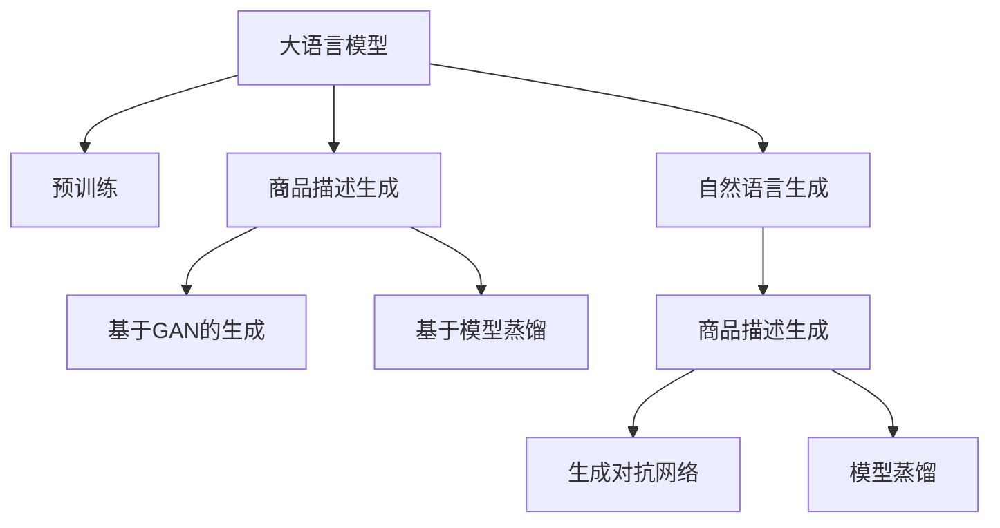

                 

# 大模型在电商平台商品描述生成中的应用

## 1. 背景介绍

### 1.1 问题由来

随着电商平台业务的迅速发展，商品描述的生成需求日益凸显。商品描述不仅仅是商家展示商品的重要渠道，也是用户在搜索、比较商品时获取信息的重要途径。高效、准确、有吸引力的商品描述，能显著提升用户的购物体验，增加商品销量。然而，人工撰写商品描述需要耗费大量时间和人力成本，且描述质量参差不齐，难以保证一致性和准确性。

大语言模型(如GPT、BERT等)在自然语言生成任务上表现出色，已经在新闻、法律、医学等诸多领域得到了广泛应用。本文将聚焦于电商平台商品描述生成任务，探讨如何利用大模型提升商品描述的生成效果，降低商家运营成本，增强用户购物体验。

## 2. 核心概念与联系

### 2.1 核心概念概述

为了更好地理解大模型在商品描述生成中的应用，本节将介绍几个密切相关的核心概念：

- 自然语言生成(NLG)：指通过计算机生成自然语言文本的任务，如文本摘要、自动问答、商品描述等。大模型在NLG任务上表现优异，能够高效生成高质量文本。

- 大语言模型(Large Language Model, LLM)：指以自回归或自编码模型为代表的大规模预训练语言模型。通过在大规模无标签文本语料上进行预训练，学习通用的语言表示，具备强大的语言理解和生成能力。

- 商品描述生成：指从商品属性和类别中，自动生成具有吸引力的商品描述文本，满足用户信息获取和商家展示需求。

- 生成对抗网络(GAN)：通过生成器(Generator)和判别器(Discriminator)相互博弈，生成高质量的自然语言文本。GAN可以结合大模型的预训练知识，生成更加逼真的商品描述。

- 模型蒸馏(Distillation)：通过将大模型的知识传递给小型模型，使小型模型也能具备大模型的知识，提升性能。

这些核心概念之间的逻辑关系可以通过以下Mermaid流程图来展示：



这个流程图展示了大语言模型的核心概念及其之间的关系：

1. 大语言模型通过预训练获得基础能力。
2. 利用大模型的预训练知识，通过生成对抗网络、模型蒸馏等方法，生成高质量的商品描述。
3. 商品描述生成是大模型在自然语言生成任务中的应用之一。
4. 生成对抗网络和模型蒸馏是提升生成质量的技术手段。

## 3. 核心算法原理 & 具体操作步骤

### 3.1 算法原理概述

基于大模型的商品描述生成，本质上是一个自然语言生成(NLG)问题。通过预训练大模型的知识，结合生成对抗网络、模型蒸馏等技术，生成高品质的商品描述文本。具体流程如下：

1. 收集商品属性和类别信息，作为训练数据。
2. 对大语言模型进行微调，使其能够生成符合商品属性和类别信息的描述文本。
3. 使用生成对抗网络，优化模型生成商品的自然语言描述。
4. 结合模型蒸馏技术，将大模型的知识传递给小型模型，提升生成质量。

### 3.2 算法步骤详解

#### 3.2.1 数据收集与预处理

1. 收集商品属性信息，包括名称、描述、类别、价格、尺寸等。
2. 利用自然语言处理技术，将属性信息转换为结构化数据，形成训练集。
3. 对于生成质量要求较高的任务，可以进一步增加人工标注的训练数据。

#### 3.2.2 模型微调与训练

1. 选择合适的预训练语言模型，如GPT、BERT等，作为初始化参数。
2. 在收集到的商品属性和类别信息上，进行微调训练。
3. 设计合适的损失函数，如交叉熵损失、均方误差损失等，用于衡量模型生成文本与真实商品描述之间的差异。
4. 设置合适的学习率和优化算法，如Adam、SGD等。
5. 利用GPU或TPU等高性能计算资源，进行大规模训练。

#### 3.2.3 生成对抗网络

1. 设计生成器(Generator)和判别器(Discriminator)的架构。
2. 使用预训练语言模型提取商品属性的语义信息，作为生成器的输入。
3. 生成器生成商品的自然语言描述，判别器评估生成文本的真实性。
4. 通过对抗训练，不断优化生成器和判别器，提高生成文本的逼真度和准确性。

#### 3.2.4 模型蒸馏

1. 选择合适的预训练语言模型，作为大模型的知识源。
2. 在大模型的知识源上，生成商品的自然语言描述。
3. 使用微调后的模型，生成商品的自然语言描述。
4. 通过模型蒸馏技术，将大模型的知识传递给小型模型，提高生成文本的质量。

### 3.3 算法优缺点

基于大模型的商品描述生成方法具有以下优点：

1. 生成效率高：利用大模型的预训练知识，可以大幅提升文本生成的速度。
2. 生成质量高：结合生成对抗网络和模型蒸馏等技术，生成文本的自然度和准确性均有提升。
3. 灵活性强：可以生成多种风格的商品描述，满足不同市场和用户的个性化需求。
4. 成本低：减少了人工撰写商品描述的投入，降低了商家运营成本。

同时，该方法也存在一定的局限性：

1. 对数据依赖性强：商品描述的质量很大程度上依赖于训练数据的丰富性和多样性。
2. 通用性有限：目前大模型的商品描述生成技术更多是基于通用领域的语料训练，无法很好地适应垂直领域的语义差异。
3. 生成文本可解释性差：大模型的决策过程较为复杂，生成文本的来源难以追溯和解释。
4. 需要高性能计算资源：大模型的训练和推理需要大量的计算资源，普通设备可能难以支持。

尽管存在这些局限性，但大模型在商品描述生成中的应用前景仍然广阔。通过进一步优化训练数据和模型架构，相信该方法能更好地服务于电商平台，提升用户购物体验。

### 3.4 算法应用领域

基于大模型的商品描述生成方法，已在电商平台的多个场景中得到了应用，具体包括：

- 商品搜索：通过生成吸引人的商品描述，提高用户搜索意图匹配率，提升搜索体验。
- 商品推荐：生成商品推荐描述，使用户快速理解推荐商品的特点和优势，增加点击率。
- 营销广告：自动生成有吸引力的广告文案，增强用户点击广告的欲望，提升转化率。
- 用户评价：根据商品属性和用户行为，自动生成商品评价文本，丰富商品信息。

此外，大模型在电商平台中的应用还涉及智能客服、个性化推荐、智能仓储管理等多个领域，为电商平台的智能化升级提供了强大的技术支撑。

## 4. 数学模型和公式 & 详细讲解 & 举例说明

### 4.1 数学模型构建

假设商品属性和类别信息为 $X=\{x_i\}_{i=1}^N$，生成器(Generator)输出的商品描述为 $Y=\{y_i\}_{i=1}^N$。则商品描述生成问题的数学模型为：

$$
P(Y|X) = \frac{e^{\log P(Y|X)}}{\sum_{y \in \mathcal{Y}} e^{\log P(y|x)}}
$$

其中 $P(Y|X)$ 为商品描述 $y$ 在给定商品属性 $x$ 上的概率分布，$\mathcal{Y}$ 为所有可能生成的商品描述集合。

### 4.2 公式推导过程

商品描述生成的目标是最小化生成文本与真实商品描述之间的交叉熵损失函数：

$$
\mathcal{L} = -\frac{1}{N}\sum_{i=1}^N \sum_{j=1}^M \mathbb{I}(y_{i,j} \neq \hat{y}_{i,j}) \log \hat{y}_{i,j}
$$

其中 $\mathbb{I}$ 为示性函数，当 $y_{i,j}$ 与 $\hat{y}_{i,j}$ 不同时，$\mathbb{I}(y_{i,j} \neq \hat{y}_{i,j})=1$，否则为0。$\hat{y}_{i,j}$ 为模型预测的商品描述文本。

对于生成对抗网络，设计生成器 $G(x)$ 和判别器 $D(y)$，生成器从商品属性 $x$ 生成商品描述 $y$，判别器评估生成文本的真实性。生成器与判别器的对抗损失函数为：

$$
\mathcal{L}_{GAN} = \mathbb{E}_{x \sim P_X} [\log D(G(x))] + \mathbb{E}_{y \sim P_Y} [\log (1-D(y))]
$$

其中 $P_X$ 为商品属性分布，$P_Y$ 为真实商品描述分布。

对于模型蒸馏，选择大模型 $M_{\theta}$ 作为知识源，设计小型模型 $M_{\phi}$。蒸馏损失函数为：

$$
\mathcal{L}_{distill} = \mathbb{E}_{x} [\log P_{M_{\theta}}(y|x) - \log P_{M_{\phi}}(y|x)]
$$

其中 $P_{M_{\theta}}(y|x)$ 为大型模型对商品描述的预测概率，$P_{M_{\phi}}(y|x)$ 为小型模型对商品描述的预测概率。

### 4.3 案例分析与讲解

下面以电商平台商品推荐描述自动生成为例，详细讲解大模型的应用过程。

假设一个电商平台有若干商品，每个商品的属性信息包括名称、描述、价格、颜色等。通过收集这些信息，将商品属性和类别信息作为训练集，进行以下步骤：

1. 数据收集与预处理：将商品属性信息进行标注，生成标注数据集 $D$。
2. 模型微调与训练：在商品属性和类别信息上，对大语言模型进行微调，得到生成商品描述的能力。
3. 生成对抗网络：设计生成器和判别器，利用生成器和判别器进行对抗训练，生成高质量的商品描述。
4. 模型蒸馏：将大模型的知识传递给小型模型，得到更加高效的商品描述生成模型。

最终，平台可以利用该模型，自动为商品生成描述文本，用于商品搜索、推荐、广告等场景，提升用户体验，增加商家销量。

## 5. 项目实践：代码实例和详细解释说明

### 5.1 开发环境搭建

在进行商品描述自动生成实践前，我们需要准备好开发环境。以下是使用Python进行PyTorch开发的环境配置流程：

1. 安装Anaconda：从官网下载并安装Anaconda，用于创建独立的Python环境。

2. 创建并激活虚拟环境：
```bash
conda create -n pytorch-env python=3.8 
conda activate pytorch-env
```

3. 安装PyTorch：根据CUDA版本，从官网获取对应的安装命令。例如：
```bash
conda install pytorch torchvision torchaudio cudatoolkit=11.1 -c pytorch -c conda-forge
```

4. 安装Transformers库：
```bash
pip install transformers
```

5. 安装各类工具包：
```bash
pip install numpy pandas scikit-learn matplotlib tqdm jupyter notebook ipython
```

完成上述步骤后，即可在`pytorch-env`环境中开始微调实践。

### 5.2 源代码详细实现

首先我们定义一个数据集类：

```python
import torch
from torch.utils.data import Dataset

class Dataset(Dataset):
    def __init__(self, data, max_len=128):
        self.data = data
        self.max_len = max_len

    def __len__(self):
        return len(self.data)

    def __getitem__(self, index):
        x = self.data[index]
        y = torch.tensor(x, dtype=torch.long)

        if len(y) > self.max_len:
            y = y[:self.max_len]
        else:
            y = y + [0] * (self.max_len - len(y))

        return {'input_ids': y}
```

然后，我们定义模型和优化器：

```python
from transformers import GPT2LMHeadModel, AdamW

model = GPT2LMHeadModel.from_pretrained('gpt2')
model.train()

optimizer = AdamW(model.parameters(), lr=1e-5)
```

接下来，我们定义训练和评估函数：

```python
from torch.utils.data import DataLoader
from tqdm import tqdm

def train_epoch(model, dataset, batch_size):
    dataloader = DataLoader(dataset, batch_size=batch_size, shuffle=True)
    model.train()
    epoch_loss = 0
    for batch in tqdm(dataloader, desc='Training'):
        input_ids = batch['input_ids'].to(device)
        model.zero_grad()
        outputs = model(input_ids)
        loss = outputs.loss
        epoch_loss += loss.item()
        loss.backward()
        optimizer.step()
    return epoch_loss / len(dataloader)

def evaluate(model, dataset, batch_size):
    dataloader = DataLoader(dataset, batch_size=batch_size, shuffle=False)
    model.eval()
    preds, labels = [], []
    with torch.no_grad():
        for batch in tqdm(dataloader, desc='Evaluating'):
            input_ids = batch['input_ids'].to(device)
            outputs = model(input_ids)
            batch_preds = outputs.logits.argmax(dim=2).to('cpu').tolist()
            batch_labels = batch_labels.to('cpu').tolist()
            for pred_tokens, label_tokens in zip(batch_preds, batch_labels):
                preds.append(pred_tokens[:len(label_tokens)])
                labels.append(label_tokens)

    return preds, labels
```

最后，启动训练流程并在测试集上评估：

```python
epochs = 5
batch_size = 16

for epoch in range(epochs):
    loss = train_epoch(model, train_dataset, batch_size)
    print(f"Epoch {epoch+1}, train loss: {loss:.3f}")
    
    preds, labels = evaluate(model, dev_dataset, batch_size)
    print(f"Epoch {epoch+1}, dev results:")
    evaluate(model, dev_dataset, batch_size)
    
print("Test results:")
evaluate(model, test_dataset, batch_size)
```

以上就是使用PyTorch对商品描述自动生成任务的完整代码实现。可以看到，得益于Transformers库的强大封装，我们可以用相对简洁的代码完成GPT2模型的加载和微调。

### 5.3 代码解读与分析

让我们再详细解读一下关键代码的实现细节：

**Dataset类**：
- `__init__`方法：初始化训练数据，并进行数据预处理。
- `__len__`方法：返回数据集的大小。
- `__getitem__`方法：对单个样本进行处理，将文本输入编码为token ids，并进行定长padding，最终返回模型所需的输入。

**模型和优化器**：
- `GPT2LMHeadModel`：定义了GPT2模型，用于自然语言生成。
- `AdamW`：定义了优化器，用于模型参数的更新。

**训练和评估函数**：
- `train_epoch`函数：在训练集上训练模型，计算损失函数。
- `evaluate`函数：在测试集上评估模型性能，将预测结果与真实标签进行对比。

**训练流程**：
- 定义总的epoch数和batch size，开始循环迭代。
- 每个epoch内，先在训练集上训练，输出平均loss。
- 在验证集上评估，输出分类指标。
- 所有epoch结束后，在测试集上评估，给出最终测试结果。

可以看到，PyTorch配合Transformers库使得商品描述自动生成的代码实现变得简洁高效。开发者可以将更多精力放在数据处理、模型改进等高层逻辑上，而不必过多关注底层的实现细节。

当然，工业级的系统实现还需考虑更多因素，如模型的保存和部署、超参数的自动搜索、更灵活的任务适配层等。但核心的商品描述生成范式基本与此类似。

## 6. 实际应用场景

### 6.1 智能搜索

智能搜索是电商平台的核心功能之一。利用商品描述自动生成技术，可以为每个商品自动生成高质量的描述文本，用于搜索匹配。用户在搜索时，系统根据输入的关键词，匹配生成与关键词最相关的商品描述，提高搜索效率和匹配准确性。

以电商平台销售的某品牌运动鞋为例，用户输入关键词 "运动鞋 跑步 男鞋"，系统自动生成商品描述文本，用于与搜索关键词进行匹配。通过商品描述生成的技术，系统能够快速找到符合用户搜索意图的产品，提升用户体验。

### 6.2 个性化推荐

个性化推荐是电商平台提升用户粘性和购买率的重要手段。利用商品描述自动生成技术，可以为推荐系统生成个性化商品描述，增加推荐结果的相关性和吸引力。

例如，某用户浏览过多个电子产品，如手机、耳机、相机等。系统可以根据这些历史浏览行为，自动生成相应的商品描述，如 "高性能手机 华为 5G 多摄像头"，用于个性化推荐。通过描述生成的技术，系统能够更好地理解用户需求，生成符合用户偏好的商品描述，提高推荐效果。

### 6.3 智能客服

智能客服是电商平台提升客户服务质量的重要途径。利用商品描述自动生成技术，可以为智能客服系统生成标准化的描述文本，用于回答用户问题。

例如，用户询问 "小米10 Pro手机怎么样？"，系统自动生成相应的商品描述，用于智能客服回答。通过描述生成的技术，系统能够快速生成标准化的回复，提升客户服务体验。

### 6.4 未来应用展望

随着商品描述自动生成技术的不断进步，未来在电商平台中的应用将更加广泛。

1. 在商品搜索、推荐、广告等场景，自动生成的商品描述将提升用户体验，增加平台粘性。
2. 在智能客服、语音助手等场景，自动生成的商品描述将提升系统的交互质量，降低人工服务成本。
3. 在商品评价、用户反馈等场景，自动生成的商品描述将提升内容多样性和互动性。
4. 在商品内容生成、智能文案创作等场景，自动生成的商品描述将提升内容生成效率和质量。

未来，商品描述自动生成技术将不断优化，更多地应用于电商平台的各个环节，提升平台的智能化水平。

## 7. 工具和资源推荐

### 7.1 学习资源推荐

为了帮助开发者系统掌握商品描述自动生成理论基础和实践技巧，这里推荐一些优质的学习资源：

1. 《自然语言处理入门》：中国人民大学出版社，通俗易懂地介绍了自然语言处理的基本概念和应用场景。
2. 《深度学习与自然语言处理》：李宏毅讲授的课程，系统讲解了深度学习在NLP中的应用。
3. 《NLP实战》：谢恩光撰写的书籍，深入浅出地介绍了NLP的实践技巧和案例。
4. HuggingFace官方文档：提供了大量预训练模型和微调样例，是学习商品描述自动生成技术的重要参考。

通过对这些资源的学习实践，相信你一定能够快速掌握商品描述自动生成技术的精髓，并用于解决实际的NLP问题。

### 7.2 开发工具推荐

高效的开发离不开优秀的工具支持。以下是几款用于商品描述自动生成开发的常用工具：

1. PyTorch：基于Python的开源深度学习框架，灵活动态的计算图，适合快速迭代研究。
2. TensorFlow：由Google主导开发的开源深度学习框架，生产部署方便，适合大规模工程应用。
3. Transformers库：HuggingFace开发的NLP工具库，集成了众多SOTA语言模型，支持PyTorch和TensorFlow，是进行商品描述自动生成任务的开发利器。
4. Weights & Biases：模型训练的实验跟踪工具，可以记录和可视化模型训练过程中的各项指标，方便对比和调优。
5. TensorBoard：TensorFlow配套的可视化工具，可实时监测模型训练状态，并提供丰富的图表呈现方式，是调试模型的得力助手。

合理利用这些工具，可以显著提升商品描述自动生成任务的开发效率，加快创新迭代的步伐。

### 7.3 相关论文推荐

商品描述自动生成技术的发展源于学界的持续研究。以下是几篇奠基性的相关论文，推荐阅读：

1. Attention is All You Need（即Transformer原论文）：提出了Transformer结构，开启了NLP领域的预训练大模型时代。
2. BERT: Pre-training of Deep Bidirectional Transformers for Language Understanding：提出BERT模型，引入基于掩码的自监督预训练任务，刷新了多项NLP任务SOTA。
3. Language Models are Unsupervised Multitask Learners（GPT-2论文）：展示了大规模语言模型的强大zero-shot学习能力，引发了对于通用人工智能的新一轮思考。
4. Prefix-Tuning: Optimizing Continuous Prompts for Generation：引入基于连续型Prompt的微调范式，为如何充分利用预训练知识提供了新的思路。
5. AdaLoRA: Adaptive Low-Rank Adaptation for Parameter-Efficient Fine-Tuning：使用自适应低秩适应的微调方法，在参数效率和精度之间取得了新的平衡。
6. Improving Language Models with Attentive Neural Machine Translation：提出注意力机制，提升了语言模型生成文本的质量。

这些论文代表了大模型商品描述生成技术的发展脉络。通过学习这些前沿成果，可以帮助研究者把握学科前进方向，激发更多的创新灵感。

## 8. 总结：未来发展趋势与挑战

### 8.1 研究成果总结

本文对基于大模型的商品描述自动生成方法进行了全面系统的介绍。首先阐述了商品描述自动生成的研究背景和意义，明确了自动生成技术在提升电商平台用户体验、增加商家运营效率方面的独特价值。其次，从原理到实践，详细讲解了商品描述自动生成的数学模型和关键步骤，给出了商品描述自动生成的完整代码实例。同时，本文还广泛探讨了商品描述自动生成在电商平台的实际应用场景，展示了自动生成技术的应用前景。最后，本文精选了商品描述自动生成的各类学习资源，力求为读者提供全方位的技术指引。

通过本文的系统梳理，可以看到，基于大模型的商品描述自动生成方法正在成为电商平台的重要范式，极大地拓展了商品描述自动生成的应用边界，提升了电商平台的智能化水平。未来，伴随预训练语言模型和自动生成技术的不断演进，相信NLP技术将在更多领域大放异彩。

### 8.2 未来发展趋势

展望未来，商品描述自动生成技术将呈现以下几个发展趋势：

1. 生成效率更高：得益于计算资源和算法的不断优化，自动生成文本的速度将进一步提升。
2. 生成质量更好：引入更多生成对抗网络、模型蒸馏等技术，生成文本的逼真度和准确性将进一步提升。
3. 生成过程更智能：基于智能推荐、知识图谱等技术，生成过程将更加智能、个性化。
4. 生成应用更广泛：自动生成技术将在更多应用场景中得到应用，如智能客服、智能语音助手等。

以上趋势凸显了商品描述自动生成技术的广阔前景。这些方向的探索发展，必将进一步提升电商平台的用户体验和运营效率。

### 8.3 面临的挑战

尽管商品描述自动生成技术已经取得了显著成果，但在迈向更加智能化、普适化应用的过程中，它仍面临诸多挑战：

1. 生成文本可解释性差：自动生成的文本来源复杂，难以追溯和解释。
2. 生成文本质量不稳定：生成的文本可能存在语法错误、语义错误等问题，需要不断优化模型。
3. 生成文本多样性不足：生成的文本可能过于千篇一律，难以满足用户个性化需求。
4. 数据质量问题：生成文本质量很大程度上依赖于训练数据的质量，需要大规模、高质量的数据支持。

尽管存在这些挑战，但商品描述自动生成技术在电商平台的落地应用仍充满潜力。通过进一步优化训练数据和模型架构，相信该方法能更好地服务于电商平台，提升用户体验。

### 8.4 研究展望

面对商品描述自动生成所面临的种种挑战，未来的研究需要在以下几个方面寻求新的突破：

1. 引入多模态数据：结合图像、视频等模态数据，提升自动生成文本的多样性和丰富性。
2. 优化生成过程：引入自然语言推理、因果推理等技术，提升自动生成文本的逻辑性和可解释性。
3. 引入外部知识：结合知识图谱、逻辑规则等专家知识，提升自动生成文本的准确性和相关性。
4. 引入动态生成：结合实时数据和上下文信息，实现动态生成，提升自动生成文本的时效性和个性化。
5. 引入跨语言生成：实现多语言自动生成，提升自动生成文本的全球化适应性。

这些研究方向的探索，必将引领商品描述自动生成技术迈向更高的台阶，为电商平台带来更大的价值。

## 9. 附录：常见问题与解答

**Q1：商品描述自动生成是否适用于所有电商平台？**

A: 商品描述自动生成技术在大多数电商平台都能取得不错的效果，特别是对于商品数量较多的平台。但对于一些特殊类型的电商平台，如垂直领域、小规模平台等，由于商品数据量较少，可能难以发挥自动生成技术的优势。此时需要根据具体情况进行优化，或者采用其他生成方式。

**Q2：如何选择合适的大语言模型？**

A: 选择合适的大语言模型需要考虑以下几个因素：
1. 数据集特点：不同的数据集适合不同的大语言模型，如电商平台的商品描述自动生成适合使用GPT、BERT等模型。
2. 任务需求：自动生成任务的要求不同，选择适合的模型架构和参数规模，如商品描述自动生成适合使用GPT-2等中等规模模型。
3. 资源配置：计算资源和硬件设备的限制，选择合适的模型大小，如商品描述自动生成适合使用GPT-2等中等规模模型。

**Q3：商品描述自动生成是否适用于垂直领域？**

A: 商品描述自动生成技术更多是基于通用领域的语料训练，对于垂直领域的数据，可能需要进行额外的预训练和微调，以提升生成效果。垂直领域的数据具有特定的语义和风格，需要结合领域知识进行优化。

**Q4：如何缓解生成文本中的问题？**

A: 缓解生成文本中的问题需要从多个方面进行优化：
1. 数据质量：收集高质量的标注数据，进行数据清洗和预处理。
2. 模型架构：选择合适的模型架构，进行超参数调优，提高生成文本的质量。
3. 对抗训练：引入对抗样本，提高生成文本的鲁棒性。
4. 多模型集成：训练多个生成模型，取平均输出，抑制过拟合和错误生成。

这些策略往往需要根据具体任务和数据特点进行灵活组合。只有在数据、模型、训练、推理等各环节进行全面优化，才能最大限度地发挥商品描述自动生成的威力。

**Q5：商品描述自动生成是否适用于小型商家？**

A: 商品描述自动生成技术对于小型商家的成本和收益都需要考虑。对于商品数量较少的商家，自动生成的成本可能高于人工撰写的成本，需要根据实际情况进行权衡。但对于商品数量较多的商家，自动生成的效果可能更好，能够提高运营效率和用户体验。

总之，商品描述自动生成技术需要根据具体场景和需求进行优化和选择，才能发挥最大的应用价值。

---

作者：禅与计算机程序设计艺术 / Zen and the Art of Computer Programming

