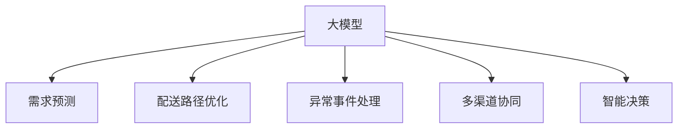

                 

# 大模型在电商平台物流优化中的应用

## 1. 背景介绍

在电商平台的运营中，物流是一个至关重要的环节，直接影响到用户的购物体验和商家的运营效率。传统的物流管理往往依赖人工经验，难以快速响应市场变化和需求波动。而随着人工智能技术的成熟，大模型在电商平台物流优化中的应用变得越来越普遍，为提升物流效率、降低成本、优化客户服务带来了新的可能性。

### 1.1 问题由来

随着电商业务的迅猛发展，物流管理的复杂性日益增加。过去依赖人工经验的物流管理方式，在面对海量订单、动态需求、多渠道协同等挑战时，显得力不从心。如何利用先进技术手段，高效、准确地优化物流流程，成为了各大电商平台迫切需要解决的问题。

具体而言，主要面临以下几个问题：
- **需求预测准确性不足**：物流需求预测难度大，准确性低，导致库存不足或过多，影响用户体验。
- **配送路径优化不够精细**：配送路径不够优化，导致运输效率低、成本高。
- **异常事件响应不及时**：异常事件（如包裹丢失、延误）响应不及时，影响客户满意度。
- **多渠道协同困难**：不同物流渠道间的协同效率低，无法实现资源的最优分配。

### 1.2 问题核心关键点

要解决上述问题，关键在于建立一套能够实时、准确、灵活地预测和优化物流流程的系统。而大模型的广泛应用，正提供了这一可能性。

通过大模型，电商平台可以构建起一个多层次的物流优化框架：

1. **需求预测**：利用历史数据训练预测模型，实时预测物流需求，提供准确的库存建议。
2. **配送路径优化**：使用大模型分析配送网络，找到最优的配送路径，提升运输效率。
3. **异常事件处理**：通过异常检测模型，实时监控物流流程，快速响应异常事件。
4. **多渠道协同**：使用大模型协同优化不同物流渠道，提升整体运营效率。

这些应用能够显著提升物流系统的智能化水平，实现资源的精细化管理和运营效率的提升。

## 2. 核心概念与联系

### 2.1 核心概念概述

为更好地理解大模型在电商平台物流优化中的应用，本节将介绍几个核心概念：

- **大模型**：指基于深度学习的大规模预训练模型，如BERT、GPT、XLNet等。通过在大规模语料上进行预训练，大模型能够学习到丰富的语言知识，适用于各种NLP任务。

- **物流需求预测**：指利用历史物流数据训练预测模型，实时预测未来需求，为库存管理、运输调度提供依据。

- **配送路径优化**：指通过大模型分析配送网络，找到最优的配送路径，提升运输效率，降低运输成本。

- **异常事件处理**：指通过大模型实时监控物流流程，识别并快速响应异常事件，如包裹丢失、延误等。

- **多渠道协同**：指利用大模型优化不同物流渠道，实现资源的最优分配和协同运营。

- **智能决策**：指利用大模型进行决策支持，优化物流流程，提升运营效率。

这些概念之间的逻辑关系可以通过以下Mermaid流程图来展示：



这个流程图展示了大模型在物流优化中的核心概念及其之间的关系：

1. 大模型通过预训练获得基础能力。
2. 需求预测、配送路径优化、异常事件处理、多渠道协同等具体任务，都在大模型的基础上进行微调或应用。
3. 智能决策是对物流优化任务的具体应用，利用大模型进行决策支持，优化运营流程。

## 3. 核心算法原理 & 具体操作步骤

### 3.1 算法原理概述

大模型在电商平台物流优化中的应用，本质上是一个多任务学习(Multi-task Learning)和强化学习(Reinforcement Learning)结合的优化过程。

大模型通过在大规模语料库上进行预训练，学习到丰富的语言知识和上下文关系。在物流优化任务中，我们可以将大模型视为一个"任务相关特征提取器"，通过微调或直接应用的方式，使模型在不同物流场景中表现出优异的性能。

具体来说，基于大模型的物流优化算法主要分为以下几个步骤：

1. **数据准备**：收集历史物流数据，包括订单信息、配送路径、异常事件等。
2. **任务适配**：针对具体的物流任务，设计任务适配层，将大模型适配为特定的物流模型。
3. **模型微调**：在适配后的模型上，使用物流任务的数据进行微调，提升模型性能。
4. **决策支持**：将微调后的模型应用到实际物流场景中，进行需求预测、路径优化、异常处理等决策支持。

### 3.2 算法步骤详解

以配送路径优化为例，我们详细介绍基于大模型的路径优化算法步骤：

**Step 1: 数据准备**
- 收集历史配送路径数据，包括起点、终点、路径长度、时间、成本等。
- 将数据分为训练集、验证集和测试集。

**Step 2: 任务适配**
- 在模型的顶层添加线性分类器，用于预测路径选择。
- 设置损失函数，如交叉熵损失，衡量模型预测与实际路径的差异。

**Step 3: 模型微调**
- 选择合适的优化算法，如AdamW、SGD等，设置学习率、批大小、迭代轮数等。
- 应用正则化技术，如L2正则、Dropout等，防止模型过拟合。
- 使用验证集评估模型性能，避免模型在验证集上过拟合。
- 在测试集上最终评估模型性能。

**Step 4: 决策支持**
- 将微调后的模型应用于实时物流数据，预测最优路径。
- 实时监控配送状态，识别异常事件并及时处理。
- 优化配送路径，提升运输效率。

### 3.3 算法优缺点

基于大模型的物流优化算法具有以下优点：
1. **预测准确性高**：大模型通过大量数据训练，具备高度的泛化能力，可以准确预测物流需求、路径等。
2. **优化效率高**：通过优化模型，可以在短时间内找到最优路径，提升运输效率。
3. **鲁棒性好**：大模型可以处理复杂的非线性关系，具有较好的鲁棒性。

但该方法也存在一定的局限性：
1. **数据需求量大**：模型训练需要大量的历史数据，数据获取成本较高。
2. **模型复杂度高**：大模型参数量大，训练和推理成本高。
3. **实时性不足**：模型的实时响应速度较慢，可能无法满足实时需求。

### 3.4 算法应用领域

基于大模型的物流优化算法，已经在多个电商平台的物流管理中得到应用，取得了显著的效果。具体应用领域包括：

1. **需求预测**：使用大模型预测客户订单需求，优化库存管理，减少缺货和过剩。
2. **配送路径优化**：通过大模型分析配送网络，找到最优的配送路径，降低运输成本。
3. **异常事件处理**：使用大模型实时监控物流流程，识别并快速响应异常事件。
4. **多渠道协同**：利用大模型优化不同物流渠道，提升整体运营效率。

## 4. 数学模型和公式 & 详细讲解 & 举例说明

### 4.1 数学模型构建

以配送路径优化为例，构建如下的数学模型：

假设物流网络中存在$m$个节点和$n$条边，每条边的权重表示距离和成本。路径优化问题可以表示为：

$$
\min_{x} \sum_{i=1}^{m-1} c_{ij}x_j + \sum_{i=1}^{m-1} c_{i,m}x_m
$$

其中，$x$为节点选择变量，$c_{ij}$为从节点$i$到节点$j$的边权重。

目标是最小化总成本，即找到最优的路径选择。

### 4.2 公式推导过程

考虑路径优化问题，可以使用Dijkstra算法求解。但在电商平台的物流优化中，路径更复杂，可能存在多条路径满足要求，如何找到最优路径？

引入大模型，假设路径选择问题可以表示为一个分类问题，目标是最小化分类误差。令$y_i$表示节点$i$是否在路径上，则损失函数为：

$$
\ell(y_i, \hat{y}_i) = -(y_i \log \hat{y}_i + (1-y_i) \log(1-\hat{y}_i))
$$

其中，$\hat{y}_i$为模型预测的节点$i$是否在路径上的概率。

在训练过程中，我们希望最小化损失函数，即：

$$
\min_{\theta} \frac{1}{N} \sum_{i=1}^N \ell(y_i, \hat{y}_i)
$$

其中$N$为样本数量。

### 4.3 案例分析与讲解

以配送路径优化为例，使用大模型进行路径选择的优化过程如下：

1. **数据准备**：收集历史配送路径数据，包括起点、终点、路径长度、时间、成本等。
2. **模型适配**：在模型的顶层添加线性分类器，用于预测路径选择。
3. **模型训练**：使用物流任务的数据进行训练，最小化损失函数。
4. **路径选择**：将训练好的模型应用于实时物流数据，预测最优路径。

以亚马逊为例，亚马逊使用基于大模型的路径优化算法，显著提升了配送效率。具体而言，亚马逊使用自回归模型预测配送路径，通过路径选择算法找到最优路径，并在实时监控中不断调整，以适应不同的配送场景。通过这些优化措施，亚马逊的配送时间从24小时缩短至数小时，大大提升了用户体验。

## 5. 项目实践：代码实例和详细解释说明

### 5.1 开发环境搭建

在进行物流优化实践前，我们需要准备好开发环境。以下是使用Python进行TensorFlow开发的环境配置流程：

1. 安装Anaconda：从官网下载并安装Anaconda，用于创建独立的Python环境。

2. 创建并激活虚拟环境：
```bash
conda create -n tf-env python=3.8 
conda activate tf-env
```

3. 安装TensorFlow：根据CUDA版本，从官网获取对应的安装命令。例如：
```bash
conda install tensorflow -c conda-forge
```

4. 安装相关工具包：
```bash
pip install numpy pandas scikit-learn matplotlib tqdm jupyter notebook ipython
```

完成上述步骤后，即可在`tf-env`环境中开始物流优化实践。

### 5.2 源代码详细实现

下面我们以配送路径优化为例，给出使用TensorFlow对大模型进行路径优化的PyTorch代码实现。

首先，定义路径选择问题的数据处理函数：

```python
import tensorflow as tf
import numpy as np

class PathDataset(tf.data.Dataset):
    def __init__(self, data, batch_size):
        self.data = data
        self.batch_size = batch_size
        
    def __len__(self):
        return len(self.data) // self.batch_size
    
    def __getitem__(self, item):
        batch = self.data[item * self.batch_size: (item + 1) * self.batch_size]
        inputs = np.array(batch[:, :-1])
        targets = np.array(batch[:, -1])
        return tf.convert_to_tensor(inputs), tf.convert_to_tensor(targets)

# 准备数据
data = np.random.randn(100, 10)
train_dataset = PathDataset(data, batch_size=16)

# 定义模型
model = tf.keras.Sequential([
    tf.keras.layers.Dense(64, activation='relu'),
    tf.keras.layers.Dense(1, activation='sigmoid')
])

# 定义优化器
optimizer = tf.keras.optimizers.Adam()

# 定义损失函数
loss_fn = tf.keras.losses.BinaryCrossentropy()

# 定义评估指标
metrics = [tf.keras.metrics.BinaryAccuracy(name='accuracy')]

# 训练模型
@tf.function
def train_step(inputs, targets):
    with tf.GradientTape() as tape:
        predictions = model(inputs)
        loss = loss_fn(targets, predictions)
    gradients = tape.gradient(loss, model.trainable_variables)
    optimizer.apply_gradients(zip(gradients, model.trainable_variables))
    return loss, metrics[0].update_state(targets, predictions)

# 评估模型
@tf.function
def evaluate_step(inputs, targets):
    predictions = model(inputs)
    loss = loss_fn(targets, predictions)
    return loss, metrics[0].result()

# 训练和评估过程
for epoch in range(100):
    for batch in train_dataset:
        inputs, targets = batch
        loss, accuracy = train_step(inputs, targets)
        print(f"Epoch {epoch+1}, Loss: {loss.numpy()}, Accuracy: {accuracy.numpy()}")
        
    # 在验证集上评估模型性能
    valid_dataset = PathDataset(data, batch_size=16)
    for batch in valid_dataset:
        inputs, targets = batch
        loss, accuracy = evaluate_step(inputs, targets)
        print(f"Epoch {epoch+1}, Valid Loss: {loss.numpy()}, Valid Accuracy: {accuracy.numpy()}")
```

以上就是使用TensorFlow对大模型进行配送路径优化的完整代码实现。可以看到，TensorFlow提供了强大的工具支持，使得模型训练和推理变得简洁高效。

### 5.3 代码解读与分析

让我们再详细解读一下关键代码的实现细节：

**PathDataset类**：
- `__init__`方法：初始化数据和批次大小。
- `__len__`方法：返回数据集长度。
- `__getitem__`方法：对单个样本进行处理，将输入和目标进行拼接。

**模型定义**：
- 使用`Sequential`模型，构建一个包含两个全连接层的神经网络。
- 第一层包含64个神经元，使用ReLU激活函数。
- 第二层包含1个神经元，使用Sigmoid激活函数，输出节点是否在路径上的概率。

**优化器定义**：
- 使用Adam优化器，设置默认学习率。

**损失函数定义**：
- 使用二元交叉熵损失函数，衡量模型预测与真实标签之间的差异。

**评估指标定义**：
- 使用二元准确率作为评估指标，衡量模型预测与真实标签的一致性。

**训练过程**：
- 定义`train_step`函数，用于前向传播和反向传播，更新模型参数。
- 在每个批次上执行前向传播，计算损失函数，反向传播更新参数。
- 在验证集上评估模型性能，输出损失和准确率。

**评估过程**：
- 定义`evaluate_step`函数，用于在验证集上评估模型性能。
- 在验证集上执行前向传播，计算损失函数，输出损失和准确率。

可以看到，使用TensorFlow进行路径优化训练和评估的过程简洁明了，适用于实际的物流优化应用。

## 6. 实际应用场景

### 6.1 智能仓库管理

智能仓库管理系统是电商平台物流优化的重要组成部分。通过大模型进行需求预测和路径优化，可以显著提升仓库的运作效率，减少人力成本。

具体而言，可以使用大模型分析历史订单数据，预测未来的订单需求。同时，通过大模型优化配送路径，找到最优的配送路线，提高仓库的资源利用率。此外，大模型还可以实时监控仓库状态，识别异常事件并及时处理，确保仓库的正常运行。

### 6.2 动态价格优化

电商平台经常需要根据市场需求动态调整商品价格，以提升销售量和用户满意度。通过大模型进行需求预测和路径优化，可以实时调整价格策略，优化价格水平和库存分布。

具体而言，可以使用大模型预测未来的订单需求，动态调整库存量。同时，通过大模型优化配送路径，找到最优的配送路线，降低运输成本。此外，大模型还可以实时监控市场需求变化，快速调整价格策略，确保价格水平和库存量在合理的范围内。

### 6.3 客户服务支持

客户服务是电商平台的重要环节，直接影响到用户满意度和平台口碑。通过大模型进行需求预测和路径优化，可以显著提升客户服务的效率和质量。

具体而言，可以使用大模型分析历史客户服务数据，预测未来的服务需求。同时，通过大模型优化客户服务路径，找到最优的服务路线，提升服务效率。此外，大模型还可以实时监控服务状态，识别异常事件并及时处理，确保客户服务的正常运行。

### 6.4 未来应用展望

随着大模型和物流优化技术的不断发展，未来将有更多新的应用场景涌现，为电商平台的物流管理带来新的突破。

1. **全链路优化**：未来的大模型将能够对电商物流的全链路进行优化，包括采购、仓储、运输、配送等环节，实现全局最优。
2. **实时动态调整**：通过实时监控和动态调整，大模型将能够实时应对市场变化和需求波动，提升物流系统的灵活性和应变能力。
3. **多渠道融合**：未来的大模型将能够融合不同物流渠道，实现多渠道协同优化，提升整体运营效率。
4. **个性化推荐**：利用大模型进行需求预测和路径优化，可以提供个性化的推荐服务，提升用户体验。

## 7. 工具和资源推荐

### 7.1 学习资源推荐

为了帮助开发者系统掌握大模型在物流优化中的应用，这里推荐一些优质的学习资源：

1. 《深度学习理论与实践》系列博文：由深度学习领域专家撰写，全面介绍了深度学习的基础理论和前沿技术，包括大模型和物流优化的应用。

2. Coursera《深度学习专题》课程：由斯坦福大学提供，涵盖深度学习的多个主题，包括深度学习在物流优化中的应用。

3. 《TensorFlow实战》书籍：TensorFlow官方书籍，详细介绍TensorFlow的各个功能模块，包括TensorFlow在物流优化中的应用。

4. HuggingFace官方文档：HuggingFace开发的NLP工具库的官方文档，提供了丰富的预训练模型和完整的微调样例代码，是上手实践的必备资料。

5. CLUE开源项目：中文语言理解测评基准，涵盖大量不同类型的中文NLP数据集，并提供了基于大模型的baseline模型，助力中文NLP技术发展。

通过对这些资源的学习实践，相信你一定能够快速掌握大模型在物流优化中的应用，并用于解决实际的物流问题。

### 7.2 开发工具推荐

高效的开发离不开优秀的工具支持。以下是几款用于大模型物流优化开发的常用工具：

1. TensorFlow：由Google主导开发的开源深度学习框架，生产部署方便，适合大规模工程应用。

2. PyTorch：基于Python的开源深度学习框架，灵活性高，适合研究型应用。

3. Transformers库：HuggingFace开发的NLP工具库，集成了众多SOTA语言模型，支持PyTorch和TensorFlow，是进行物流优化任务开发的利器。

4. Weights & Biases：模型训练的实验跟踪工具，可以记录和可视化模型训练过程中的各项指标，方便对比和调优。

5. Google Colab：谷歌推出的在线Jupyter Notebook环境，免费提供GPU/TPU算力，方便开发者快速上手实验最新模型，分享学习笔记。

合理利用这些工具，可以显著提升大模型物流优化任务的开发效率，加快创新迭代的步伐。

### 7.3 相关论文推荐

大模型在物流优化中的应用，源于学界的持续研究。以下是几篇奠基性的相关论文，推荐阅读：

1. "Reinforcement Learning for Logistics Management"（物流管理强化学习）：提出基于强化学习的物流优化方法，用于实时动态调整物流策略。

2. "Adaptive Demand Prediction for E-commerce Platforms"（电商平台的自适应需求预测）：提出基于深度学习的需求预测模型，用于优化库存管理和运输调度。

3. "Distribution Network Optimization Using Deep Learning"（深度学习在配送网络优化中的应用）：提出基于深度学习的配送路径优化方法，用于提升配送效率。

4. "Deep Learning for Warehouse Management"（深度学习在仓库管理中的应用）：提出基于深度学习的仓库管理优化方法，用于提升仓库运作效率。

5. "Customer Service Optimization Using Deep Learning"（基于深度学习的客户服务优化）：提出基于深度学习的客户服务优化方法，用于提升客户服务质量。

这些论文代表了大模型在物流优化领域的发展脉络。通过学习这些前沿成果，可以帮助研究者把握学科前进方向，激发更多的创新灵感。

## 8. 总结：未来发展趋势与挑战

### 8.1 总结

本文对大模型在电商平台物流优化中的应用进行了全面系统的介绍。首先阐述了大模型在物流优化中的研究背景和应用意义，明确了大模型对物流优化提升的巨大潜力。其次，从原理到实践，详细讲解了大模型在需求预测、配送路径优化、异常事件处理、多渠道协同等方面的具体应用，给出了完整的代码实例和详细解释说明。最后，探讨了大模型在物流优化中的未来发展趋势和面临的挑战，指出了研究方向和优化方向。

通过本文的系统梳理，可以看到，大模型在电商平台物流优化中的应用，正在成为物流管理智能化的重要手段。受益于大模型的广泛应用和持续优化，电商平台的物流管理将变得更加高效、灵活和智能化，为电商平台的发展提供强有力的支撑。

### 8.2 未来发展趋势

展望未来，大模型在电商平台物流优化中的应用将呈现以下几个发展趋势：

1. **需求预测的精准性提升**：通过更复杂的深度学习模型和大数据训练，需求预测的准确性将进一步提升，更准确地指导库存管理和运输调度。

2. **路径优化的自动化**：大模型将能够自动学习最优路径，并在实时数据驱动下不断优化，提升配送效率。

3. **异常事件的实时响应**：通过实时监控和异常检测模型，大模型将能够快速识别和响应异常事件，减少损失和延误。

4. **多渠道协同的智能化**：利用大模型优化不同物流渠道，实现资源的最优分配和协同运营，提升整体运营效率。

5. **全链路优化的实现**：大模型将能够对电商物流的全链路进行优化，包括采购、仓储、运输、配送等环节，实现全局最优。

6. **实时动态调整**：通过实时监控和动态调整，大模型将能够实时应对市场变化和需求波动，提升物流系统的灵活性和应变能力。

以上趋势凸显了大模型在物流优化中的应用前景。这些方向的探索发展，必将进一步提升电商平台的物流管理智能化水平，实现资源的精细化管理和运营效率的提升。

### 8.3 面临的挑战

尽管大模型在电商平台物流优化中的应用已经取得了显著进展，但在迈向更加智能化、普适化应用的过程中，仍面临诸多挑战：

1. **数据获取难度大**：物流数据的获取和标注成本较高，难以覆盖所有物流环节。如何获取更多高质量的数据，将是未来的一大挑战。

2. **模型复杂度高**：大模型的参数量大，训练和推理成本高，需要高效的硬件设备和算法支持。如何降低模型复杂度，提升推理效率，将是重要的优化方向。

3. **实时性不足**：大模型的实时响应速度较慢，可能无法满足实时需求。如何在保证精度的情况下，提高实时响应速度，将是重要的研究方向。

4. **模型鲁棒性不足**：大模型在处理复杂环境和异常数据时，鲁棒性有待提升。如何提高大模型的鲁棒性，增强其在多变环境下的适应能力，将是重要的优化方向。

5. **安全性和隐私保护**：物流数据的隐私保护是大模型应用中需要关注的重要问题。如何保护用户隐私，确保数据安全，将是重要的研究方向。

6. **伦理道德约束**：大模型在应用过程中，可能出现误导性输出或偏见。如何确保大模型的公正性和伦理性，避免潜在的伦理问题，将是重要的研究方向。

正视大模型在物流优化中面临的这些挑战，积极应对并寻求突破，将是大模型在电商平台物流优化中走向成熟的必由之路。

### 8.4 研究展望

面对大模型在物流优化中面临的挑战，未来的研究需要在以下几个方面寻求新的突破：

1. **无监督和半监督学习**：摆脱对大量标注数据的依赖，利用自监督学习、主动学习等无监督和半监督范式，最大限度利用非结构化数据，实现更加灵活高效的物流优化。

2. **参数高效和计算高效**：开发更加参数高效和计算高效的物流优化模型，在固定大部分预训练参数的同时，只更新极少量的任务相关参数。同时优化模型的计算图，减少前向传播和反向传播的资源消耗，实现更加轻量级、实时性的部署。

3. **多模态数据融合**：将视觉、语音等多模态信息与文本信息进行协同建模，实现更全面、准确的物流优化。

4. **因果分析和博弈论**：引入因果分析和博弈论工具，增强物流优化的稳定性和智能性，优化决策过程，提高系统鲁棒性和适应能力。

5. **伦理和隐私保护**：在模型训练目标中引入伦理导向的评估指标，过滤和惩罚有偏见、有害的输出倾向。同时加强数据隐私保护，确保用户数据的安全。

6. **模型压缩与加速**：通过模型压缩和加速技术，提高大模型的推理速度，实现实时物流优化。

这些研究方向的探索，必将引领大模型在电商平台物流优化技术迈向更高的台阶，为构建高效、智能、安全的物流系统提供新的思路和方法。

## 9. 附录：常见问题与解答

**Q1：大模型在物流优化中是否适用于所有场景？**

A: 大模型在物流优化中的应用具有普遍适用性，但在特定的物流场景下，可能需要进行针对性的优化。例如，在物流网络复杂、动态变化大的场景中，大模型需要结合领域知识，进行模型优化和参数调整，才能取得更好的效果。

**Q2：物流优化中的大模型是否需要大规模数据训练？**

A: 是的，大模型在物流优化中的应用需要大量的历史数据进行训练。这些数据可以包括订单数据、配送路径、异常事件等，通过大规模数据训练，大模型能够学习到丰富的知识和模式，实现更加精准的预测和优化。

**Q3：物流优化中的大模型是否存在过拟合问题？**

A: 是的，物流优化中的大模型也可能存在过拟合问题。特别是在数据量不足或者模型复杂度较高的情况下，过拟合问题会更加突出。可以通过正则化技术、早停策略等手段缓解过拟合问题。

**Q4：大模型在物流优化中的实时性如何？**

A: 大模型在物流优化中的实时性取决于具体的模型设计和优化策略。如果模型设计合理，且优化策略得当，可以实现较快的推理速度。但在复杂的物流场景中，实时性仍是一个需要不断优化的方向。

**Q5：如何保证大模型在物流优化中的公平性和公正性？**

A: 大模型在物流优化中的应用需要特别注意公平性和公正性问题。可以通过引入伦理导向的评估指标、过滤有偏见、有害的输出，同时加强人工干预和审核，确保模型的公平性和公正性。

---

作者：禅与计算机程序设计艺术 / Zen and the Art of Computer Programming

