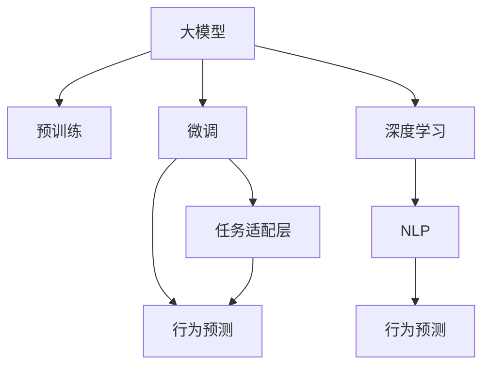

                 

# 大模型在电商平台用户行为理解中的应用

> 关键词：电商平台, 用户行为理解, 大模型, 预训练, 微调, 深度学习, 自然语言处理, 行为预测

## 1. 背景介绍

### 1.1 问题由来
随着电子商务的迅猛发展，电商平台已成为用户日常生活不可或缺的重要部分。通过对用户行为的深入理解，电商平台能够提供更加个性化和精准的服务，提升用户体验，增加用户粘性和消费转化率。然而，用户行为数据的规模巨大且复杂多变，传统的统计分析和手工规则提取方式已经难以满足需求。

近年来，预训练大模型在自然语言处理(NLP)领域的突破性进展，为电商平台用户行为的理解带来了新的契机。借助深度学习技术，电商平台可以利用大模型学习海量用户评论、搜索记录等文本数据，从中挖掘出用户的购物习惯、偏好、情感等信息，实现更加智能化的服务。本文将从预训练大模型的原理、应用和实践等方面，全面探讨其在电商平台用户行为理解中的应用。

### 1.2 问题核心关键点
大模型在电商平台用户行为理解中的应用主要关注以下关键问题：
- 如何选择合适的预训练大模型，以充分利用其语言建模能力。
- 如何高效地在大规模用户数据上进行微调，以适应特定业务场景。
- 如何设计任务适配层，以确保模型输出与实际业务需求一致。
- 如何处理用户行为数据的多样性和复杂性，提升模型鲁棒性。
- 如何在资源有限的条件下，高效地部署和优化大模型。

这些问题涉及到大模型选择、微调策略、任务适配、数据处理和模型优化等多个方面，需要综合考虑技术、业务和资源的实际需求。本文将详细解析这些问题，并提供具体的应用方案和实践示例。

## 2. 核心概念与联系

### 2.1 核心概念概述

为更好地理解大模型在电商平台用户行为理解中的应用，本节将介绍几个关键概念：

- 大模型（Large Model）：如BERT、GPT-3等预训练语言模型，通过在大规模无标签文本语料上进行预训练，学习到丰富的语言表示和知识。
- 预训练（Pre-training）：通过自监督学习任务，在大规模无标签文本数据上训练通用语言模型，如掩码语言模型（MLM）、下一句子预测（NSP）等。
- 微调（Fine-tuning）：在预训练模型的基础上，通过有监督学习，调整模型参数，使其适应特定任务或场景。
- 任务适配层（Task Adaptive Layer）：根据具体任务需求，在预训练模型的顶层设计适当的输出层和损失函数，以适配不同的业务需求。
- 深度学习（Deep Learning）：利用神经网络结构，通过反向传播算法，训练模型以逼近目标函数。
- 自然语言处理（NLP）：涉及文本的表示、分类、生成等任务，是深度学习在自然语言理解上的应用。
- 行为预测（Behavior Prediction）：利用用户历史行为数据，预测其未来的行为，如购物偏好、购买意愿等。

这些概念之间的联系可以通过以下Mermaid流程图来展示：



这个流程图展示了预训练大模型到行为预测这一流程的各个环节：

1. 大模型通过预训练学习到语言表示和知识。
2. 在大模型基础上进行微调，调整模型参数以适配特定任务。
3. 设计任务适配层，确保模型输出与业务需求一致。
4. 利用微调后的模型，进行行为预测。
5. 深度学习技术使得模型能够高效地逼近目标函数。
6. 自然语言处理技术为模型提供文本数据的表示和处理。
7. 行为预测是最终的应用目标，通过模型对用户行为进行预测和分析。

这些概念共同构成了大模型在电商平台用户行为理解中的应用框架，使得模型能够从海量数据中学习用户的语言习惯和行为模式，从而提升服务质量和用户体验。

## 3. 核心算法原理 & 具体操作步骤
### 3.1 算法原理概述

基于大模型在电商平台用户行为理解中的应用，核心算法原理可以概括为：利用大模型的预训练能力，结合任务适配层和行为预测模型，对用户行为数据进行有监督学习，从而实现对用户行为的理解和预测。

具体而言，算法原理如下：
1. 收集和处理电商平台上的用户行为数据，包括搜索记录、评论、评分等文本数据。
2. 选择合适的预训练大模型，并根据任务需求进行微调。
3. 设计任务适配层，将大模型的输出转换为适合业务场景的格式。
4. 构建行为预测模型，对用户未来的行为进行预测。
5. 利用深度学习技术，优化模型参数，提高预测精度和鲁棒性。

### 3.2 算法步骤详解

以下是基于大模型在电商平台用户行为理解中的应用的具体算法步骤：

**Step 1: 数据收集与处理**
- 收集电商平台上的用户行为数据，包括用户搜索词、评论文本、评分等信息。
- 对数据进行清洗和预处理，去除噪声和无用信息，规范化文本格式。

**Step 2: 选择预训练大模型**
- 根据任务需求，选择合适的预训练大模型。如BERT、GPT系列、RoBERTa等。
- 利用这些大模型在通用语料上进行预训练，学习语言表示和知识。

**Step 3: 任务适配层设计**
- 根据具体的业务场景，设计任务适配层，如分类、回归、生成等。
- 选择合适的输出层和损失函数，如softmax分类器、回归损失函数等。

**Step 4: 数据集划分与模型微调**
- 将收集到的用户行为数据划分为训练集、验证集和测试集。
- 在预训练大模型的基础上，对任务适配层进行微调。
- 选择适当的学习率和正则化技术，防止过拟合。

**Step 5: 行为预测模型构建**
- 利用微调后的模型，构建行为预测模型。
- 选择合适的输入特征，如用户ID、历史行为记录、当前环境等。
- 设计预测目标，如购物偏好、购买意愿等。

**Step 6: 模型评估与优化**
- 在测试集上评估模型性能，利用准确率、召回率、F1分数等指标。
- 根据评估结果，调整模型参数和任务适配层设计，优化预测性能。

### 3.3 算法优缺点

基于大模型在电商平台用户行为理解中的应用，算法具有以下优点：
1. 高效学习：大模型通过预训练学习到丰富的语言表示和知识，能够高效地处理大规模用户数据。
2. 泛化能力强：预训练大模型能够适应不同业务场景，泛化能力强，预测结果更加准确。
3. 可解释性高：大模型的可解释性强，能够提供详细的预测推理过程，有助于理解用户行为。
4. 易用性高：利用深度学习框架和预训练模型，开发和部署过程相对简单，易于推广应用。

同时，该算法也存在一些局限性：
1. 资源消耗大：大模型和深度学习模型的计算资源消耗较大，需要高性能计算设备。
2. 数据依赖强：模型效果依赖于数据的规模和质量，需要大量高质量的标注数据。
3. 模型复杂度高：大模型参数量庞大，模型结构复杂，调试和优化难度较大。
4. 隐私风险高：用户行为数据涉及隐私，数据收集和处理过程中需要严格遵守数据隐私法规。

### 3.4 算法应用领域

基于大模型在电商平台用户行为理解中的应用，可以在多个领域进行广泛的应用：

- 个性化推荐：利用用户历史行为数据，预测用户对商品或内容的偏好，实现个性化推荐。
- 购物行为预测：预测用户未来的购物行为，如浏览、购买、收藏等，优化库存管理和营销策略。
- 用户画像构建：从用户行为数据中提取特征，构建用户画像，了解用户兴趣和需求。
- 情感分析：分析用户评论和评分，了解用户对商品或服务的情感倾向，改进产品质量和服务。
- 价格优化：预测用户对不同价格的反应，优化定价策略，提高销售收益。

此外，大模型在电商平台用户行为理解中的应用还可以延伸到供应链管理、风险控制、客户服务等多个方面，为电商平台的运营和发展提供数据支持。

## 4. 数学模型和公式 & 详细讲解 & 举例说明

### 4.1 数学模型构建

假设电商平台收集到的用户行为数据为 $\mathcal{X}=\{(x_i, y_i)\}_{i=1}^N$，其中 $x_i$ 为用户的搜索记录、评论文本等文本数据，$y_i$ 为用户的购买记录、评分等标签数据。

将用户行为数据输入预训练大模型 $M_{\theta}$，得到模型输出 $\hat{y}=M_{\theta}(x)$。根据任务需求，设计任务适配层 $f$，将模型输出转换为适合业务场景的格式。然后，构建行为预测模型 $P$，对用户未来的行为进行预测。

设 $P$ 为预测模型，$w$ 为行为预测模型的参数。则行为预测模型的目标函数为：

$$
\mathcal{L}(w) = \frac{1}{N} \sum_{i=1}^N L(f(\hat{y}_i), y_i)
$$

其中 $L$ 为预测模型 $P$ 的损失函数，常用的损失函数包括均方误差损失（MSE）、交叉熵损失（CE）等。

### 4.2 公式推导过程

以交叉熵损失为例，推导行为预测模型的损失函数。

假设预测模型 $P$ 的输出为 $\hat{y}_i$，真实标签为 $y_i$，则交叉熵损失函数为：

$$
L(f(\hat{y}_i), y_i) = -\sum_{j=1}^K y_{ij} \log \hat{y}_{ij}
$$

其中 $K$ 为预测任务的类别数，$y_{ij}$ 为标签 $y_i$ 在类别 $j$ 上的热码，$\hat{y}_{ij}$ 为模型在类别 $j$ 上的预测概率。

将 $L$ 代入目标函数 $\mathcal{L}$，得：

$$
\mathcal{L}(w) = -\frac{1}{N} \sum_{i=1}^N \sum_{j=1}^K y_{ij} \log \hat{y}_{ij}
$$

利用深度学习框架和优化算法，如AdamW、SGD等，最小化目标函数 $\mathcal{L}$，得到最优参数 $w^*$。

### 4.3 案例分析与讲解

以电商平台个性化推荐为例，详细讲解基于大模型的应用流程。

1. **数据收集与预处理**
   - 收集用户浏览、点击、购买、收藏等行为数据。
   - 对数据进行清洗和预处理，去除噪声和无用信息，规范化文本格式。

2. **选择预训练大模型**
   - 选择BERT、GPT-3等预训练大模型，利用通用语料进行预训练。

3. **任务适配层设计**
   - 设计分类任务适配层，输出用户对不同商品或内容的偏好概率。
   - 选择合适的输出层和损失函数，如softmax分类器、交叉熵损失函数等。

4. **数据集划分与模型微调**
   - 将收集到的用户行为数据划分为训练集、验证集和测试集。
   - 在预训练大模型的基础上，对任务适配层进行微调。
   - 选择适当的学习率和正则化技术，防止过拟合。

5. **行为预测模型构建**
   - 利用微调后的模型，构建行为预测模型，预测用户对不同商品或内容的偏好。
   - 选择合适的输入特征，如用户ID、历史行为记录、当前环境等。
   - 设计预测目标，如购买概率、浏览频率等。

6. **模型评估与优化**
   - 在测试集上评估模型性能，利用准确率、召回率、F1分数等指标。
   - 根据评估结果，调整模型参数和任务适配层设计，优化预测性能。

通过上述流程，电商平台可以利用大模型高效地处理用户行为数据，实现个性化推荐和其他行为预测任务。

## 5. 项目实践：代码实例和详细解释说明

### 5.1 开发环境搭建

在进行电商平台用户行为理解的应用实践前，我们需要准备好开发环境。以下是使用Python进行PyTorch开发的环境配置流程：

1. 安装Anaconda：从官网下载并安装Anaconda，用于创建独立的Python环境。

2. 创建并激活虚拟环境：
```bash
conda create -n pytorch-env python=3.8 
conda activate pytorch-env
```

3. 安装PyTorch：根据CUDA版本，从官网获取对应的安装命令。例如：
```bash
conda install pytorch torchvision torchaudio cudatoolkit=11.1 -c pytorch -c conda-forge
```

4. 安装Transformers库：
```bash
pip install transformers
```

5. 安装各类工具包：
```bash
pip install numpy pandas scikit-learn matplotlib tqdm jupyter notebook ipython
```

完成上述步骤后，即可在`pytorch-env`环境中开始实践。

### 5.2 源代码详细实现

以下是使用PyTorch进行电商平台用户行为理解的大模型微调代码实现。

首先，定义数据处理函数：

```python
import torch
from torch.utils.data import Dataset, DataLoader
from transformers import BertTokenizer, BertForSequenceClassification

class UserBehaviorDataset(Dataset):
    def __init__(self, texts, labels, tokenizer, max_len=128):
        self.texts = texts
        self.labels = labels
        self.tokenizer = tokenizer
        self.max_len = max_len
        
    def __len__(self):
        return len(self.texts)
    
    def __getitem__(self, item):
        text = self.texts[item]
        label = self.labels[item]
        
        encoding = self.tokenizer(text, return_tensors='pt', max_length=self.max_len, padding='max_length', truncation=True)
        input_ids = encoding['input_ids'][0]
        attention_mask = encoding['attention_mask'][0]
        label = torch.tensor(label, dtype=torch.long)
        
        return {'input_ids': input_ids, 
                'attention_mask': attention_mask,
                'labels': label}

# 加载Bert预训练模型和分词器
tokenizer = BertTokenizer.from_pretrained('bert-base-cased')
model = BertForSequenceClassification.from_pretrained('bert-base-cased', num_labels=2)

# 创建dataset
train_dataset = UserBehaviorDataset(train_texts, train_labels, tokenizer)
dev_dataset = UserBehaviorDataset(dev_texts, dev_labels, tokenizer)
test_dataset = UserBehaviorDataset(test_texts, test_labels, tokenizer)
```

然后，定义训练和评估函数：

```python
from transformers import AdamW

device = torch.device('cuda') if torch.cuda.is_available() else torch.device('cpu')
model.to(device)

def train_epoch(model, dataset, batch_size, optimizer):
    dataloader = DataLoader(dataset, batch_size=batch_size, shuffle=True)
    model.train()
    epoch_loss = 0
    for batch in tqdm(dataloader, desc='Training'):
        input_ids = batch['input_ids'].to(device)
        attention_mask = batch['attention_mask'].to(device)
        labels = batch['labels'].to(device)
        model.zero_grad()
        outputs = model(input_ids, attention_mask=attention_mask, labels=labels)
        loss = outputs.loss
        epoch_loss += loss.item()
        loss.backward()
        optimizer.step()
    return epoch_loss / len(dataloader)

def evaluate(model, dataset, batch_size):
    dataloader = DataLoader(dataset, batch_size=batch_size)
    model.eval()
    preds, labels = [], []
    with torch.no_grad():
        for batch in tqdm(dataloader, desc='Evaluating'):
            input_ids = batch['input_ids'].to(device)
            attention_mask = batch['attention_mask'].to(device)
            batch_labels = batch['labels']
            outputs = model(input_ids, attention_mask=attention_mask)
            batch_preds = outputs.logits.argmax(dim=2).to('cpu').tolist()
            batch_labels = batch_labels.to('cpu').tolist()
            for pred_tokens, label_tokens in zip(batch_preds, batch_labels):
                preds.append(pred_tokens[:len(label_tokens)])
                labels.append(label_tokens)
                
    print(classification_report(labels, preds))
```

最后，启动训练流程并在测试集上评估：

```python
epochs = 5
batch_size = 16

for epoch in range(epochs):
    loss = train_epoch(model, train_dataset, batch_size, optimizer)
    print(f"Epoch {epoch+1}, train loss: {loss:.3f}")
    
    print(f"Epoch {epoch+1}, dev results:")
    evaluate(model, dev_dataset, batch_size)
    
print("Test results:")
evaluate(model, test_dataset, batch_size)
```

以上就是使用PyTorch进行电商平台用户行为理解的大模型微调代码实现。可以看到，使用Transformers库和PyTorch，可以快速构建和微调大模型，实现对用户行为的预测。

### 5.3 代码解读与分析

让我们再详细解读一下关键代码的实现细节：

**UserBehaviorDataset类**：
- `__init__`方法：初始化文本、标签、分词器等关键组件。
- `__len__`方法：返回数据集的样本数量。
- `__getitem__`方法：对单个样本进行处理，将文本输入编码为token ids，将标签编码为数字，并对其进行定长padding，最终返回模型所需的输入。

**训练和评估函数**：
- 使用PyTorch的DataLoader对数据集进行批次化加载，供模型训练和推理使用。
- 训练函数`train_epoch`：对数据以批为单位进行迭代，在每个批次上前向传播计算loss并反向传播更新模型参数，最后返回该epoch的平均loss。
- 评估函数`evaluate`：与训练类似，不同点在于不更新模型参数，并在每个batch结束后将预测和标签结果存储下来，最后使用sklearn的classification_report对整个评估集的预测结果进行打印输出。

**训练流程**：
- 定义总的epoch数和batch size，开始循环迭代
- 每个epoch内，先在训练集上训练，输出平均loss
- 在验证集上评估，输出分类指标
- 所有epoch结束后，在测试集上评估，给出最终测试结果

可以看到，使用Transformers库和PyTorch，代码实现变得简洁高效，开发者可以将更多精力放在数据处理、模型改进等高层逻辑上，而不必过多关注底层的实现细节。

## 6. 实际应用场景

### 6.1 电商个性化推荐

基于大模型的电商平台个性化推荐系统，可以显著提升用户的购物体验。通过收集和分析用户的历史浏览、购买、收藏等行为数据，大模型能够预测用户的购物偏好，推荐最适合的商品或内容。

在技术实现上，可以构建一个基于大模型的推荐引擎，利用微调后的模型进行用户行为预测，结合实时数据动态更新推荐列表。同时，引入协同过滤、深度学习等技术，提升推荐系统的多样性和个性化程度。

### 6.2 价格优化

电商平台可以根据用户的历史购物行为，预测用户对不同价格的反应。利用大模型学习用户对价格的敏感度和偏好，构建价格优化模型，动态调整商品价格，提高销售收益。

具体而言，可以收集用户对不同价格的商品的购买记录，标记商品价格和用户购买意愿之间的关系。利用微调后的模型，预测用户对不同价格的反应，结合库存和市场情况，优化商品定价策略。

### 6.3 广告投放优化

通过分析用户的历史行为数据，大模型能够预测用户对广告的响应情况。电商平台可以根据预测结果，优化广告投放策略，提升广告投放的效果和转化率。

具体而言，可以构建一个基于大模型的广告推荐系统，利用微调后的模型预测用户的点击率、转化率等指标，优化广告位布局和投放时间，提升广告投放的ROI。

## 7. 工具和资源推荐

### 7.1 学习资源推荐

为了帮助开发者系统掌握大模型在电商平台用户行为理解中的应用，这里推荐一些优质的学习资源：

1. 《Transformers in Natural Language Processing》课程：斯坦福大学开设的深度学习课程，介绍Transformer在大模型中的应用，包括预训练、微调等技术。

2. CS224N《深度学习自然语言处理》课程：斯坦福大学开设的NLP明星课程，涵盖预训练大模型的原理和应用。

3. 《Natural Language Processing with Transformers》书籍：Transformers库的作者所著，全面介绍大模型在NLP任务中的应用，包括微调、行为预测等。

4. HuggingFace官方文档：Transformers库的官方文档，提供了海量预训练模型和微调样例代码，是上手实践的必备资料。

5. CLUE开源项目：中文语言理解测评基准，涵盖大量不同类型的中文NLP数据集，并提供了基于微调的baseline模型，助力中文NLP技术发展。

通过对这些资源的学习实践，相信你一定能够快速掌握大模型在电商平台用户行为理解中的应用方法，并用于解决实际的NLP问题。

### 7.2 开发工具推荐

高效的开发离不开优秀的工具支持。以下是几款用于大模型在电商平台用户行为理解中应用的开发工具：

1. PyTorch：基于Python的开源深度学习框架，灵活动态的计算图，适合快速迭代研究。大部分预训练语言模型都有PyTorch版本的实现。

2. TensorFlow：由Google主导开发的开源深度学习框架，生产部署方便，适合大规模工程应用。同样有丰富的预训练语言模型资源。

3. Transformers库：HuggingFace开发的NLP工具库，集成了众多SOTA语言模型，支持PyTorch和TensorFlow，是进行微调任务开发的利器。

4. Weights & Biases：模型训练的实验跟踪工具，可以记录和可视化模型训练过程中的各项指标，方便对比和调优。与主流深度学习框架无缝集成。

5. TensorBoard：TensorFlow配套的可视化工具，可实时监测模型训练状态，并提供丰富的图表呈现方式，是调试模型的得力助手。

6. Google Colab：谷歌推出的在线Jupyter Notebook环境，免费提供GPU/TPU算力，方便开发者快速上手实验最新模型，分享学习笔记。

合理利用这些工具，可以显著提升大模型在电商平台用户行为理解中的应用开发效率，加快创新迭代的步伐。

### 7.3 相关论文推荐

大模型在电商平台用户行为理解中的应用源于学界的持续研究。以下是几篇奠基性的相关论文，推荐阅读：

1. Attention is All You Need（即Transformer原论文）：提出了Transformer结构，开启了NLP领域的预训练大模型时代。

2. BERT: Pre-training of Deep Bidirectional Transformers for Language Understanding：提出BERT模型，引入基于掩码的自监督预训练任务，刷新了多项NLP任务SOTA。

3. Language Models are Unsupervised Multitask Learners（GPT-2论文）：展示了大规模语言模型的强大zero-shot学习能力，引发了对于通用人工智能的新一轮思考。

4. Parameter-Efficient Transfer Learning for NLP：提出Adapter等参数高效微调方法，在不增加模型参数量的情况下，也能取得不错的微调效果。

5. Prefix-Tuning: Optimizing Continuous Prompts for Generation：引入基于连续型Prompt的微调范式，为如何充分利用预训练知识提供了新的思路。

6. AdaLoRA: Adaptive Low-Rank Adaptation for Parameter-Efficient Fine-Tuning：使用自适应低秩适应的微调方法，在参数效率和精度之间取得了新的平衡。

这些论文代表了大模型在电商平台用户行为理解中的应用发展脉络。通过学习这些前沿成果，可以帮助研究者把握学科前进方向，激发更多的创新灵感。

## 8. 总结：未来发展趋势与挑战

### 8.1 总结

本文对基于大模型的电商平台用户行为理解的应用进行了全面系统的介绍。首先阐述了电商平台的业务需求和预训练大模型的应用背景，明确了大模型微调在电商平台中的独特价值。其次，从原理到实践，详细讲解了预训练大模型、微调算法和行为预测模型，提供了完整的代码实现。同时，本文还探讨了微调方法在电商平台的多个应用场景，展示了其广泛的应用前景。

通过本文的系统梳理，可以看到，基于大模型的电商平台用户行为理解的应用已经取得了显著成效，对电商平台的发展带来了积极影响。未来，伴随预训练语言模型的持续演进和微调技术的不断优化，大模型在电商平台中的应用将更加高效和广泛，推动电商平台向更加智能化、个性化方向发展。

### 8.2 未来发展趋势

展望未来，大模型在电商平台用户行为理解的应用将呈现以下几个发展趋势：

1. 多模态融合：除了文本数据外，电商平台上还有大量图片、视频等多模态数据。通过融合多模态信息，提升模型对用户行为的全面理解。

2. 实时性增强：电商平台的业务场景要求实时性较高，大模型的推理速度和部署效率需要进一步提升。通过优化模型结构和参数，实现轻量化部署。

3. 泛化能力提升：模型需要适应不同用户和不同时间段的购物行为变化，泛化能力需要进一步提升。通过多任务学习和迁移学习，增强模型的泛化能力。

4. 个性化推荐优化：个性化推荐是电商平台的核心需求之一，大模型的应用需要进一步优化，提升推荐系统的精准度和个性化程度。

5. 交互式反馈：电商平台可以引入用户反馈机制，对大模型的预测结果进行修正和优化，提升模型的鲁棒性和准确性。

以上趋势将推动大模型在电商平台用户行为理解中的应用向更高效、更广泛、更智能的方向发展，为电商平台提供更加精准、个性化的服务。

### 8.3 面临的挑战

尽管大模型在电商平台用户行为理解中的应用已经取得了显著成效，但在实际部署和应用中，仍面临以下挑战：

1. 数据隐私问题：电商平台上用户行为数据涉及隐私，数据收集和处理过程中需要严格遵守数据隐私法规。

2. 模型复杂度高：大模型的参数量庞大，模型结构复杂，调试和优化难度较大。

3. 实时性要求高：电商平台的业务场景要求实时性较高，大模型的推理速度和部署效率需要进一步提升。

4. 成本高昂：大模型的计算资源消耗较大，大规模部署和维护成本较高。

5. 模型泛化能力不足：大模型在电商平台用户行为理解中的应用需要适应不同用户和不同时间段的购物行为变化，泛化能力需要进一步提升。

6. 模型鲁棒性差：电商平台的业务场景复杂多变，大模型需要具备较强的鲁棒性和抗干扰能力。

### 8.4 研究展望

未来，大模型在电商平台用户行为理解中的应用还需要在以下几个方面寻求新的突破：

1. 多模态数据融合：通过融合多模态信息，提升模型对用户行为的全面理解。

2. 实时学习机制：引入实时学习机制，根据用户最新行为数据进行微调，提升模型的适应性和鲁棒性。

3. 个性化推荐系统优化：通过优化个性化推荐系统，提升推荐系统的精准度和个性化程度。

4. 交互式反馈机制：引入用户反馈机制，对大模型的预测结果进行修正和优化，提升模型的鲁棒性和准确性。

5. 模型压缩与加速：通过模型压缩和加速技术，降低模型计算资源消耗，提升模型推理速度。

6. 隐私保护技术：引入隐私保护技术，如差分隐私、联邦学习等，保障用户数据的隐私安全。

这些研究方向的探索，将推动大模型在电商平台用户行为理解中的应用向更加高效、智能、安全的方向发展，为电商平台的运营和发展提供数据支持。

## 9. 附录：常见问题与解答

**Q1：电商平台用户行为数据的质量对大模型的应用效果有多重要？**

A: 电商平台用户行为数据的质量对大模型的应用效果至关重要。高质量的数据能够提供更多的信息，帮助模型更好地理解用户行为，预测结果更加准确。因此，在数据收集和处理过程中，需要注重数据的真实性和多样性，去除噪声和无用信息，规范化文本格式。同时，还需要确保数据的隐私和安全，遵守数据隐私法规。

**Q2：大模型在电商平台上的应用过程中，如何避免过拟合？**

A: 过拟合是模型应用过程中常见的问题，尤其在标注数据较少的情况下更容易发生。为避免过拟合，可以采取以下措施：
1. 数据增强：通过回译、近义替换等方式扩充训练集。
2. 正则化：使用L2正则、Dropout等方法防止模型过度拟合。
3. 提前停止：在验证集上监控模型性能，当性能不再提升时停止训练。
4. 参数高效微调：只调整少量参数，保留大部分预训练权重不变。
5. 多模型集成：训练多个模型，取平均输出，抑制过拟合。

**Q3：电商平台上的用户行为数据是否需要定期更新？**

A: 电商平台上的用户行为数据需要定期更新，以适应用户行为的变化。新数据可以提供新的信息，帮助模型更好地理解用户行为，预测结果更加准确。同时，定期更新数据也可以避免模型“老化”，保持模型的时效性和适应性。在数据更新过程中，需要注意数据的真实性和隐私性，确保数据的质量和安全。

**Q4：大模型在电商平台上的应用过程中，如何确保模型的公平性和透明度？**

A: 确保大模型在电商平台上的应用过程中公平性和透明度，需要在数据收集、模型训练、模型应用等多个环节进行严格的监控和管理。具体措施包括：
1. 数据清洗：在数据收集过程中，去除包含歧视、偏见的数据，确保数据的多样性和代表性。
2. 模型监控：在模型训练和应用过程中，实时监控模型的输出，确保模型的公平性和透明性。
3. 用户反馈：引入用户反馈机制，及时发现和修正模型的不公平输出，提升模型的公平性。
4. 公开透明：公开模型的训练过程和决策逻辑，让用户了解模型的行为和决策依据，增强信任度。

通过这些措施，可以有效避免大模型在电商平台应用过程中出现的偏见和歧视，确保模型的公平性和透明度，提升用户对平台的信任度。

**Q5：大模型在电商平台上的应用过程中，如何平衡预测效果和推理速度？**

A: 在大模型在电商平台上的应用过程中，预测效果和推理速度需要平衡。具体措施包括：
1. 模型压缩：通过模型压缩技术，减少模型的参数量和计算量，提升推理速度。
2. 推理加速：通过推理加速技术，如量化、剪枝等，提升模型的推理速度。
3. 模型选择：选择轻量级模型，如MobileBERT、DistillBERT等，在保证预测效果的同时，提升推理速度。
4. 分布式部署：利用分布式部署技术，将模型部署在多台服务器上，提升推理效率。

通过这些措施，可以有效平衡大模型在电商平台上的预测效果和推理速度，满足电商平台的业务需求。

