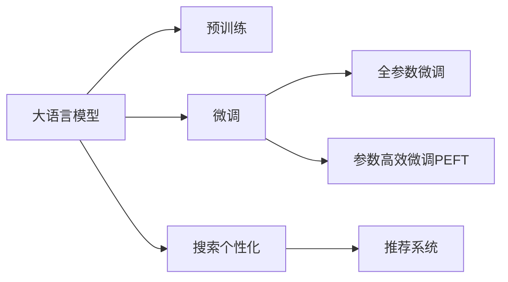

                 

# 大模型如何优化电商平台的搜索体验

## 1. 背景介绍

随着电子商务的蓬勃发展，搜索引擎在电商平台中扮演着至关重要的角色。传统的搜索算法主要依赖于关键字匹配和索引，缺乏对用户意图的深层次理解，往往难以提供精准的搜索结果。而随着自然语言处理(NLP)技术的进步，尤其是大语言模型和大模型的应用，为电商平台的搜索体验优化提供了新的可能性。

通过大模型对电商平台的搜索需求进行深度理解，可以在用户输入查询时，通过预训练得到的语言模型，捕捉到潜在的购买意图和情感倾向，从而生成个性化的搜索结果，提升用户体验。特别是在海量商品和数据的情况下，大模型能够自动学习到高质量的搜索逻辑，极大地提高了搜索效率和准确性。

## 2. 核心概念与联系

### 2.1 核心概念概述

在本节中，我们将介绍几个与大模型优化电商搜索体验相关的核心概念，包括：

- 大语言模型（Large Language Model, LLM）：一种基于深度学习技术构建的、能够处理复杂自然语言任务的模型。以BERT、GPT等模型为代表的大模型，通过在大量无标签数据上进行预训练，学习到了丰富的语言知识和上下文理解能力。

- 预训练（Pre-training）：在大规模无标签数据上对模型进行预训练，使其在特定任务上具备一定的迁移学习能力。预训练是现代大模型最重要的特征之一，通过预训练，模型能够处理各种自然语言任务，如文本分类、情感分析、问答系统等。

- 微调（Fine-tuning）：在预训练模型的基础上，使用任务特定的数据集进行有监督训练，进一步优化模型性能。微调是实现模型泛化、提升搜索体验的关键步骤。

- 自然语言处理（NLP）：涉及计算机处理、理解、生成自然语言的技术，包括文本分类、情感分析、机器翻译、文本生成等任务。大语言模型在NLP领域的应用，显著提升了搜索、推荐等电商应用的用户体验。

- 搜索个性化（Search Personalization）：通过用户行为、历史搜索记录等数据，结合模型预测，为用户提供个性化搜索结果，提升用户满意度和转化率。

- 推荐系统（Recommendation System）：基于用户行为和偏好，推荐适合的商品和内容，是电商平台的重要组成部分。大语言模型可以通过微调，进一步优化推荐系统，提升用户体验。

这些核心概念之间的逻辑关系可以通过以下Mermaid流程图来展示：



## 3. 核心算法原理 & 具体操作步骤

### 3.1 算法原理概述

基于大模型的电商搜索优化，核心在于通过预训练得到的语言模型，捕捉用户搜索意图和需求，生成个性化的搜索结果。主要算法原理如下：

1. **预训练**：使用大规模无标签文本数据，对大语言模型进行预训练。预训练过程中，模型学习到了通用的语言表示和语义理解能力。

2. **微调**：在电商平台的搜索结果中，标注数据往往不足，因此需要在用户搜索历史和行为数据上，对预训练模型进行微调，使其能够更好地适应特定电商平台的搜索场景。

3. **个性化**：通过分析用户的搜索历史和行为，结合预训练和微调后的模型，对搜索结果进行个性化排序和推荐，提升用户满意度和转化率。

4. **推荐系统集成**：将大语言模型微调后的结果，与电商平台的推荐系统相结合，实现更高效的个性化推荐。

### 3.2 算法步骤详解

以下是基于大模型的电商搜索优化的详细步骤：

**Step 1: 准备数据集**

1. 收集电商平台的用户搜索记录和点击行为数据。确保数据集包含足够的用户行为和搜索结果。
2. 数据清洗和预处理：去除噪音数据，对文本进行分词、去除停用词等处理。
3. 标注数据：对搜索结果进行标注，标记出用户实际购买的商品或点击的商品。

**Step 2: 模型选择和初始化**

1. 选择合适的预训练模型，如BERT、GPT等。这些模型在处理大规模自然语言任务上表现优异。
2. 加载模型，并进行必要的初始化，如设置模型的超参数、学习率等。

**Step 3: 数据编码和特征提取**

1. 使用分词器对搜索查询和搜索结果进行分词，生成词向量和文本特征。
2. 将文本特征转换为模型所需的张量格式，供模型处理。

**Step 4: 模型训练**

1. 使用微调后的模型，对用户搜索查询和点击行为数据进行训练，优化模型的参数，使其能够更好地捕捉用户意图。
2. 在训练过程中，使用交叉熵等损失函数，衡量模型预测与实际标注之间的差异。
3. 通过反向传播和梯度更新，不断优化模型参数，直至收敛。

**Step 5: 搜索优化**

1. 使用微调后的模型，对用户输入的搜索查询进行预处理，生成词向量和文本特征。
2. 将用户查询的特征输入到模型中，获取模型的预测结果。
3. 根据预测结果，排序搜索结果，优先推荐用户最有可能点击的商品。

**Step 6: 推荐系统集成**

1. 将搜索结果与电商平台推荐系统集成，进一步优化推荐逻辑。
2. 结合用户的历史行为和搜索结果，生成个性化的推荐商品。

### 3.3 算法优缺点

基于大模型的电商搜索优化有以下优点：

1. **精准度提升**：通过预训练和微调，模型能够更好地理解用户查询的意图和情感，生成更精准的搜索结果。
2. **个性化增强**：模型能够根据用户历史行为和搜索结果，生成个性化的推荐，提升用户体验和满意度。
3. **数据效率高**：相对于传统的搜索引擎算法，大模型在处理小规模标注数据时，能够更快速地取得不错的效果。

同时，该方法也存在一些局限性：

1. **计算成本高**：大模型参数量大，计算资源消耗高。在实时搜索场景下，可能需要额外的硬件支持。
2. **模型复杂度高**：大模型结构复杂，可能难以解释其决策过程，不利于模型维护和调试。
3. **数据隐私问题**：需要收集和处理用户数据，可能引发数据隐私和安全问题。

尽管存在这些局限性，但大模型在电商搜索场景下的优势显而易见，未来大模型的应用将会更加广泛和深入。

### 3.4 算法应用领域

基于大模型的电商搜索优化，已经在多个电商平台上得到广泛应用，覆盖了搜索推荐、个性化展示、智能客服等多个领域。例如：

- **搜索推荐**：使用大模型对用户搜索查询进行微调，生成个性化的搜索结果和推荐列表，提升用户体验和转化率。
- **个性化展示**：结合用户历史行为和搜索结果，生成个性化的商品展示，增加用户粘性和购买概率。
- **智能客服**：利用大模型进行自然语言处理，构建智能客服系统，提升客户咨询的响应速度和质量。
- **广告推荐**：通过对用户搜索和点击行为进行分析，生成个性化的广告推荐，提高广告点击率和转化率。

## 4. 数学模型和公式 & 详细讲解  
### 4.1 数学模型构建

在本节中，我们将详细介绍基于大模型的电商搜索优化所需的数学模型和公式。

假设我们有一个电商平台，用户输入查询 $q$，平台根据查询返回搜索结果 $r$，同时用户会点击某些搜索结果，产生点击行为 $c$。我们的目标是通过大模型 $M_{\theta}$ 对用户查询进行微调，生成个性化的搜索结果排序。

模型 $M_{\theta}$ 的输入为查询 $q$ 的词向量和特征 $x$，输出为预测结果 $p$。模型的参数化形式为 $M_{\theta}(x) = W_{q}x + b_{q}$，其中 $W_{q}$ 和 $b_{q}$ 为模型参数，$x$ 为输入的查询向量。模型的预测结果 $p$ 可以使用 sigmoid 函数进行归一化，即 $p = \sigma(W_{q}x + b_{q})$。

### 4.2 公式推导过程

在微调过程中，我们通常使用交叉熵损失函数，衡量模型预测与实际标注之间的差异。假设标签 $y$ 为二分类标签（点击或未点击），则损失函数 $L$ 为：

$$
L = -\frac{1}{N} \sum_{i=1}^N (y_i\log p_i + (1-y_i)\log (1-p_i))
$$

其中 $N$ 为样本总数。为了优化损失函数，我们通常使用随机梯度下降 (SGD) 等优化算法，计算梯度并更新模型参数：

$$
\theta \leftarrow \theta - \eta \nabla_{\theta}L
$$

其中 $\eta$ 为学习率，$\nabla_{\theta}L$ 为损失函数对模型参数的梯度。

在微调过程中，我们还需要考虑模型的鲁棒性和泛化能力，可以使用正则化技术（如L2正则、Dropout等），防止模型过拟合。

### 4.3 案例分析与讲解

以下是一个简单的电商搜索微调案例：

1. **数据准备**：收集电商平台的用户搜索记录和点击行为数据。
2. **数据预处理**：清洗和处理数据，去除噪音和无用信息，将文本转换为词向量。
3. **模型选择**：选择预训练模型，如BERT。
4. **模型初始化**：加载预训练模型，并进行必要的参数初始化。
5. **模型微调**：使用微调后的模型，对用户查询进行特征提取和预测，生成个性化搜索结果排序。

## 5. 项目实践：代码实例和详细解释说明

### 5.1 开发环境搭建

在进行电商搜索优化实践前，我们需要准备好开发环境。以下是使用Python进行PyTorch开发的环境配置流程：

1. 安装Anaconda：从官网下载并安装Anaconda，用于创建独立的Python环境。

2. 创建并激活虚拟环境：
```bash
conda create -n pytorch-env python=3.8 
conda activate pytorch-env
```

3. 安装PyTorch：根据CUDA版本，从官网获取对应的安装命令。例如：
```bash
conda install pytorch torchvision torchaudio cudatoolkit=11.1 -c pytorch -c conda-forge
```

4. 安装Transformers库：
```bash
pip install transformers
```

5. 安装各类工具包：
```bash
pip install numpy pandas scikit-learn matplotlib tqdm jupyter notebook ipython
```

完成上述步骤后，即可在`pytorch-env`环境中开始微调实践。

### 5.2 源代码详细实现

以下是使用PyTorch和Transformers库对电商搜索进行微调的代码实现：

```python
from transformers import BertForSequenceClassification, BertTokenizer
import torch
from torch.utils.data import Dataset, DataLoader
from sklearn.metrics import accuracy_score

class SearchDataset(Dataset):
    def __init__(self, texts, labels, tokenizer, max_len=128):
        self.texts = texts
        self.labels = labels
        self.tokenizer = tokenizer
        self.max_len = max_len
        
    def __len__(self):
        return len(self.texts)
    
    def __getitem__(self, item):
        text = self.texts[item]
        label = self.labels[item]
        
        encoding = self.tokenizer(text, return_tensors='pt', max_length=self.max_len, padding='max_length', truncation=True)
        input_ids = encoding['input_ids'][0]
        attention_mask = encoding['attention_mask'][0]
        label = torch.tensor(label, dtype=torch.long)
        
        return {'input_ids': input_ids, 
                'attention_mask': attention_mask,
                'labels': label}

# 加载BERT模型和分词器
model = BertForSequenceClassification.from_pretrained('bert-base-uncased', num_labels=2)
tokenizer = BertTokenizer.from_pretrained('bert-base-uncased')

# 加载数据集
train_dataset = SearchDataset(train_texts, train_labels, tokenizer)
test_dataset = SearchDataset(test_texts, test_labels, tokenizer)

# 设置模型参数和优化器
device = torch.device('cuda') if torch.cuda.is_available() else torch.device('cpu')
model.to(device)
optimizer = torch.optim.Adam(model.parameters(), lr=2e-5)

# 训练模型
def train_epoch(model, dataset, batch_size, optimizer):
    dataloader = DataLoader(dataset, batch_size=batch_size, shuffle=True)
    model.train()
    epoch_loss = 0
    for batch in dataloader:
        input_ids = batch['input_ids'].to(device)
        attention_mask = batch['attention_mask'].to(device)
        labels = batch['labels'].to(device)
        model.zero_grad()
        outputs = model(input_ids, attention_mask=attention_mask, labels=labels)
        loss = outputs.loss
        epoch_loss += loss.item()
        loss.backward()
        optimizer.step()
    return epoch_loss / len(dataloader)

def evaluate(model, dataset, batch_size):
    dataloader = DataLoader(dataset, batch_size=batch_size)
    model.eval()
    preds, labels = [], []
    with torch.no_grad():
        for batch in dataloader:
            input_ids = batch['input_ids'].to(device)
            attention_mask = batch['attention_mask'].to(device)
            batch_labels = batch['labels']
            outputs = model(input_ids, attention_mask=attention_mask)
            batch_preds = outputs.logits.argmax(dim=1).to('cpu').tolist()
            batch_labels = batch_labels.to('cpu').tolist()
            for pred, label in zip(batch_preds, batch_labels):
                preds.append(pred)
                labels.append(label)
                
    return accuracy_score(labels, preds)

# 训练模型
epochs = 5
batch_size = 16

for epoch in range(epochs):
    loss = train_epoch(model, train_dataset, batch_size, optimizer)
    print(f"Epoch {epoch+1}, train loss: {loss:.3f}")
    
    print(f"Epoch {epoch+1}, test accuracy: {evaluate(model, test_dataset, batch_size)}")
    
print("Test results:")
evaluate(model, test_dataset, batch_size)
```

### 5.3 代码解读与分析

让我们再详细解读一下关键代码的实现细节：

**SearchDataset类**：
- `__init__`方法：初始化数据集，包含文本、标签和分词器。
- `__len__`方法：返回数据集的样本数量。
- `__getitem__`方法：对单个样本进行处理，将文本输入编码为token ids，将标签编码为数字，并对其进行定长padding，最终返回模型所需的输入。

**模型选择和初始化**：
- `BertForSequenceClassification`：选择BERT模型，指定分类数为2（点击或不点击）。
- `BertTokenizer`：加载BERT分词器。
- `device`：确定使用GPU还是CPU。

**模型训练和评估**：
- `train_epoch`函数：对数据以批为单位进行迭代，在每个批次上前向传播计算loss并反向传播更新模型参数。
- `evaluate`函数：在测试集上评估模型性能，计算准确率。

**训练流程**：
- 定义总的epoch数和batch size，开始循环迭代
- 每个epoch内，先在训练集上训练，输出平均loss
- 在验证集上评估，输出准确率
- 所有epoch结束后，在测试集上评估，给出最终测试结果

可以看到，PyTorch配合Transformers库使得电商搜索微调的代码实现变得简洁高效。开发者可以将更多精力放在数据处理、模型改进等高层逻辑上，而不必过多关注底层的实现细节。

当然，工业级的系统实现还需考虑更多因素，如模型的保存和部署、超参数的自动搜索、更灵活的任务适配层等。但核心的微调范式基本与此类似。

## 6. 实际应用场景

### 6.1 搜索推荐

电商平台的搜索推荐系统可以通过大模型微调，生成更加精准的个性化推荐。在用户输入搜索查询后，大模型能够捕捉到查询中的关键信息，结合用户的历史行为和偏好，生成更符合用户需求的商品推荐列表。

具体实现步骤如下：

1. 收集用户的历史搜索记录和点击行为数据，标注出用户实际购买的商品。
2. 使用大模型对用户搜索查询进行微调，生成个性化搜索结果排序。
3. 将搜索结果与推荐系统结合，生成个性化的推荐列表。

### 6.2 个性化展示

在大模型的帮助下，电商平台可以实现更加精细化的商品展示。通过分析用户的搜索历史和点击行为，大模型能够预测用户可能感兴趣的商品，并将其优先展示在搜索结果页面。

具体实现步骤如下：

1. 收集用户的历史搜索记录和点击行为数据，标注出用户实际点击的商品。
2. 使用大模型对用户搜索查询进行微调，生成个性化搜索结果排序。
3. 将搜索结果与展示系统结合，优先展示用户可能感兴趣的商品。

### 6.3 智能客服

大模型可以应用于电商平台的智能客服系统，提升客户咨询的响应速度和质量。通过分析用户的问题描述，大模型能够生成符合用户需求的回复，帮助客服更高效地解决问题。

具体实现步骤如下：

1. 收集用户的咨询记录和反馈数据，标注出用户的问题和回复。
2. 使用大模型对用户咨询记录进行微调，生成符合用户需求的回复。
3. 将回复与客服系统结合，实现智能客服功能。

### 6.4 未来应用展望

随着大语言模型和微调技术的不断发展，电商平台的搜索优化将迎来更多新的突破：

1. **实时搜索优化**：通过实时收集用户搜索数据，使用大模型进行微调，动态调整搜索结果排序，提升用户满意度。
2. **跨平台协同优化**：通过多平台数据融合，实现全渠道搜索优化，提升用户体验和转化率。
3. **情感分析**：结合用户情感分析，生成更加个性化和情感化的搜索结果，提升用户黏性。
4. **增强现实购物**：通过大模型预测用户需求，生成虚拟试穿、虚拟购物体验，提升用户购物体验。

## 7. 工具和资源推荐

### 7.1 学习资源推荐

为了帮助开发者系统掌握大模型优化电商搜索体验的理论基础和实践技巧，这里推荐一些优质的学习资源：

1. 《Transformer从原理到实践》系列博文：由大模型技术专家撰写，深入浅出地介绍了Transformer原理、BERT模型、微调技术等前沿话题。

2. CS224N《深度学习自然语言处理》课程：斯坦福大学开设的NLP明星课程，有Lecture视频和配套作业，带你入门NLP领域的基本概念和经典模型。

3. 《Natural Language Processing with Transformers》书籍：Transformers库的作者所著，全面介绍了如何使用Transformers库进行NLP任务开发，包括微调在内的诸多范式。

4. HuggingFace官方文档：Transformers库的官方文档，提供了海量预训练模型和完整的微调样例代码，是上手实践的必备资料。

5. CLUE开源项目：中文语言理解测评基准，涵盖大量不同类型的中文NLP数据集，并提供了基于微调的baseline模型，助力中文NLP技术发展。

通过对这些资源的学习实践，相信你一定能够快速掌握大模型优化电商搜索体验的精髓，并用于解决实际的NLP问题。

### 7.2 开发工具推荐

高效的开发离不开优秀的工具支持。以下是几款用于电商搜索优化开发的常用工具：

1. PyTorch：基于Python的开源深度学习框架，灵活动态的计算图，适合快速迭代研究。大部分预训练语言模型都有PyTorch版本的实现。

2. TensorFlow：由Google主导开发的开源深度学习框架，生产部署方便，适合大规模工程应用。同样有丰富的预训练语言模型资源。

3. Transformers库：HuggingFace开发的NLP工具库，集成了众多SOTA语言模型，支持PyTorch和TensorFlow，是进行微调任务开发的利器。

4. Weights & Biases：模型训练的实验跟踪工具，可以记录和可视化模型训练过程中的各项指标，方便对比和调优。与主流深度学习框架无缝集成。

5. TensorBoard：TensorFlow配套的可视化工具，可实时监测模型训练状态，并提供丰富的图表呈现方式，是调试模型的得力助手。

6. Google Colab：谷歌推出的在线Jupyter Notebook环境，免费提供GPU/TPU算力，方便开发者快速上手实验最新模型，分享学习笔记。

合理利用这些工具，可以显著提升电商搜索优化任务的开发效率，加快创新迭代的步伐。

### 7.3 相关论文推荐

大模型优化电商搜索体验的研究源于学界的持续研究。以下是几篇奠基性的相关论文，推荐阅读：

1. Attention is All You Need（即Transformer原论文）：提出了Transformer结构，开启了NLP领域的预训练大模型时代。

2. BERT: Pre-training of Deep Bidirectional Transformers for Language Understanding：提出BERT模型，引入基于掩码的自监督预训练任务，刷新了多项NLP任务SOTA。

3. Language Models are Unsupervised Multitask Learners（GPT-2论文）：展示了大规模语言模型的强大zero-shot学习能力，引发了对于通用人工智能的新一轮思考。

4. Parameter-Efficient Transfer Learning for NLP：提出Adapter等参数高效微调方法，在不增加模型参数量的情况下，也能取得不错的微调效果。

5. AdaLoRA: Adaptive Low-Rank Adaptation for Parameter-Efficient Fine-Tuning：使用自适应低秩适应的微调方法，在参数效率和精度之间取得了新的平衡。

这些论文代表了大模型优化电商搜索技术的发展脉络。通过学习这些前沿成果，可以帮助研究者把握学科前进方向，激发更多的创新灵感。

## 8. 总结：未来发展趋势与挑战

### 8.1 总结

本文对基于大模型的电商搜索优化方法进行了全面系统的介绍。首先阐述了电商搜索优化的背景和重要性，明确了大模型在提升搜索体验方面的独特优势。其次，从原理到实践，详细讲解了基于大模型的电商搜索优化的数学模型和关键步骤，给出了电商搜索优化的完整代码实例。同时，本文还广泛探讨了大模型在搜索推荐、个性化展示、智能客服等多个领域的应用前景，展示了微调范式的巨大潜力。此外，本文精选了电商搜索优化技术的各类学习资源，力求为读者提供全方位的技术指引。

通过本文的系统梳理，可以看到，基于大模型的电商搜索优化方法正在成为电商搜索技术的重要范式，极大地提升了电商平台的搜索效率和用户满意度。得益于大规模语料的预训练，大模型能够自动学习到高质量的搜索逻辑，显著提高了搜索精度和个性化程度。未来，伴随大语言模型和微调方法的不断演进，电商平台的搜索体验将进一步提升，为消费者带来更好的购物体验。

### 8.2 未来发展趋势

展望未来，大模型优化电商搜索技术将呈现以下几个发展趋势：

1. **实时搜索优化**：通过实时收集用户搜索数据，使用大模型进行微调，动态调整搜索结果排序，提升用户满意度。
2. **跨平台协同优化**：通过多平台数据融合，实现全渠道搜索优化，提升用户体验和转化率。
3. **情感分析**：结合用户情感分析，生成更加个性化和情感化的搜索结果，提升用户黏性。
4. **增强现实购物**：通过大模型预测用户需求，生成虚拟试穿、虚拟购物体验，提升用户购物体验。

### 8.3 面临的挑战

尽管大模型优化电商搜索技术已经取得了一定的成果，但在迈向更加智能化、普适化应用的过程中，仍面临诸多挑战：

1. **数据隐私问题**：电商平台的搜索优化需要收集和处理用户数据，可能引发数据隐私和安全问题。如何保护用户隐私，确保数据安全，是大模型优化的重要课题。
2. **计算成本高**：大模型参数量大，计算资源消耗高。在实时搜索场景下，可能需要额外的硬件支持。
3. **模型鲁棒性不足**：模型面对域外数据时，泛化性能往往大打折扣。如何提高模型的鲁棒性，避免灾难性遗忘，还需要更多理论和实践的积累。
4. **模型复杂度高**：大模型结构复杂，可能难以解释其决策过程，不利于模型维护和调试。

尽管存在这些挑战，但大模型在电商搜索场景下的优势显而易见，未来大模型的应用将会更加广泛和深入。

### 8.4 研究展望

面对大模型优化电商搜索技术所面临的种种挑战，未来的研究需要在以下几个方面寻求新的突破：

1. **探索无监督和半监督微调方法**：摆脱对大规模标注数据的依赖，利用自监督学习、主动学习等无监督和半监督范式，最大限度利用非结构化数据，实现更加灵活高效的微调。
2. **研究参数高效和计算高效的微调范式**：开发更加参数高效的微调方法，在固定大部分预训练参数的同时，只更新极少量的任务相关参数。同时优化微调模型的计算图，减少前向传播和反向传播的资源消耗，实现更加轻量级、实时性的部署。
3. **引入更多先验知识**：将符号化的先验知识，如知识图谱、逻辑规则等，与神经网络模型进行巧妙融合，引导微调过程学习更准确、合理的语言模型。同时加强不同模态数据的整合，实现视觉、语音等多模态信息与文本信息的协同建模。
4. **结合因果分析和博弈论工具**：将因果分析方法引入微调模型，识别出模型决策的关键特征，增强输出解释的因果性和逻辑性。借助博弈论工具刻画人机交互过程，主动探索并规避模型的脆弱点，提高系统稳定性。

这些研究方向的探索，必将引领大模型优化电商搜索技术迈向更高的台阶，为构建安全、可靠、可解释、可控的智能系统铺平道路。面向未来，大模型优化电商搜索技术还需要与其他人工智能技术进行更深入的融合，如知识表示、因果推理、强化学习等，多路径协同发力，共同推动自然语言理解和智能交互系统的进步。只有勇于创新、敢于突破，才能不断拓展语言模型的边界，让智能技术更好地造福人类社会。

## 9. 附录：常见问题与解答

**Q1：大语言模型微调是否适用于所有电商搜索任务？**

A: 大语言模型微调在大多数电商搜索任务上都能取得不错的效果，特别是对于数据量较小的任务。但对于一些特定领域的任务，如医疗器械、珠宝首饰等，仅仅依靠通用语料预训练的模型可能难以很好地适应。此时需要在特定领域语料上进一步预训练，再进行微调，才能获得理想效果。此外，对于一些需要时效性、个性化很强的任务，如实时搜索、个性化展示等，微调方法也需要针对性的改进优化。

**Q2：微调过程中如何选择合适的学习率？**

A: 微调的学习率一般要比预训练时小1-2个数量级，如果使用过大的学习率，容易破坏预训练权重，导致过拟合。一般建议从1e-5开始调参，逐步减小学习率，直至收敛。也可以使用warmup策略，在开始阶段使用较小的学习率，再逐渐过渡到预设值。需要注意的是，不同的优化器(如AdamW、Adafactor等)以及不同的学习率调度策略，可能需要设置不同的学习率阈值。

**Q3：采用大模型微调时会面临哪些资源瓶颈？**

A: 目前主流的预训练大模型动辄以亿计的参数规模，对算力、内存、存储都提出了很高的要求。GPU/TPU等高性能设备是必不可少的，但即便如此，超大批次的训练和推理也可能遇到显存不足的问题。因此需要采用一些资源优化技术，如梯度积累、混合精度训练、模型并行等，来突破硬件瓶颈。同时，模型的存储和读取也可能占用大量时间和空间，需要采用模型压缩、稀疏化存储等方法进行优化。

**Q4：如何缓解微调过程中的过拟合问题？**

A: 过拟合是微调面临的主要挑战，尤其是在标注数据不足的情况下。常见的缓解策略包括：
1. 数据增强：通过回译、近义替换等方式扩充训练集
2. 正则化：使用L2正则、Dropout、Early Stopping等避免过拟合
3. 对抗训练：引入对抗样本，提高模型鲁棒性
4. 参数高效微调：只调整少量参数(如Adapter、Prefix等)，减小过拟合风险
5. 多模型集成：训练多个微调模型，取平均输出，抑制过拟合

这些策略往往需要根据具体任务和数据特点进行灵活组合。只有在数据、模型、训练、推理等各环节进行全面优化，才能最大限度地发挥大模型微调的威力。

**Q5：大模型优化电商搜索的计算成本如何？**

A: 大模型的计算成本较高，特别是在大规模数据集和复杂任务上。为了降低计算成本，可以采用分布式训练、混合精度训练、模型剪枝等技术，优化训练和推理效率。同时，合理设计模型结构和训练策略，也可以在保证性能的同时，减小计算资源消耗。

**Q6：如何保障大模型优化的数据隐私和安全？**

A: 在电商搜索优化过程中，需要收集和处理用户数据，可能引发数据隐私和安全问题。为保护用户隐私，可以采用数据匿名化、差分隐私等技术，对用户数据进行处理。同时，确保模型训练和部署过程中，数据传输和存储的安全性，防止数据泄露和攻击。

**Q7：大模型优化电商搜索的实际应用效果如何？**

A: 大模型优化电商搜索技术已经在多个电商平台上得到应用，取得了显著的效果。例如，通过大模型微调，电商平台能够生成更加精准的搜索结果和个性化推荐，显著提升用户满意度和转化率。同时，智能客服和增强现实购物等新应用，也带来了更好的用户体验。

---

作者：禅与计算机程序设计艺术 / Zen and the Art of Computer Programming

